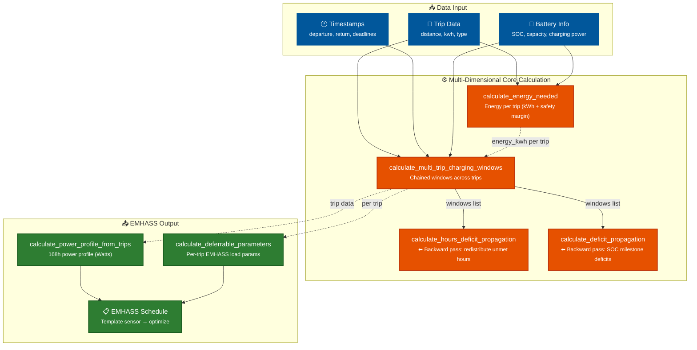

# 🚗⚡ EV Trip Planner for Home Assistant

**Plan electric trips and optimize your vehicle's energy consumption**

[](https://github.com/custom-components/hacs)
[](https://github.com/informatico-madrid/ha-ev-trip-planner/releases)
[](https://opensource.org/licenses/MIT)
[](https://github.com/informatico-madrid/smart-ralph)

## 🛠️ Built With

| Technology | Version | Purpose |
|------------|---------|---------|
|  | 3.11+ | Core integration logic |
|  | 2024.x | Platform |
|  | 5.x | Frontend panel |
|  | 8.x | Unit & integration testing |
|  | 1.x | End-to-end testing |
|  | - | Development approach |

## 📋 Table of Contents

- [🎯 Features](#-features)
- [⚠️ Prerequisites](#️-prerequisites)
- [🚀 Installation](#-installation)
  - [Method 1: HACS (Recommended)](#method-1-hacs-recommended)
  - [Method 2: Manual Installation](#method-2-manual-installation)
  - [Method 3: Development/Testing](#method-3-developmenttesting)
- [⚙️ Initial Configuration](#️-initial-configuration)
- [🎮 Usage](#-usage)
- [🔄 Update](#-update)
- [🗑️ Uninstallation](#️-uninstallation)
- [🔧 Troubleshooting](#-troubleshooting)
- [📊 Development](#-development)
  - [🤖 Smart Ralph Methodology](#-smart-ralph-methodology)
- [📚 Documentation](#-documentation)

---

> 🧪 **This project is also an AI-assisted development laboratory.**
> How a senior architect led the generation of 12,000+ lines of functional code
> through specialized AI agents — [See Portfolio](_ai/PORTFOLIO.md)

---

## 🎯 Features

For the complete milestone history and project roadmap, see [ROADMAP.md](ROADMAP.md).

### 🔬 Multi-Dimensional Charging Algorithm (Core Strength)



### Core Features (MVP)

| Feature | Description | Status |
|---------|-------------|--------|
| 🗓️ **Recurring & Punctual Trips** | Schedule daily/weekly trips or one-time trips with specific date/time | ✅ MVP Ready |
| 🔋 **Smart Optimization** | Calculates required energy based on distance, efficiency, and current SOC | ✅ MVP Ready |
| ⚡ **EMHASS Integration** | Energy optimization with dynamic schedules to take advantage of variable tariffs | ✅ MVP Ready |
| 🏠 **Presence Detection** | Sensor and coordinates for safe charging | ✅ MVP Ready |
| 🔔 **Smart Notifications** | Alerts when charging is needed but not possible | 🔄 In Development |
| 📱 **Real-Time Sensors** | Automatic sensors with reactive updates | ✅ MVP Ready |
| 🎛️ **Lovelace Dashboard** | Preconfigured panel included | ❌ Deprecated (use native panel instead) |

> **Note**: The legacy Lovelace Dashboard is deprecated. Use the new native Home Assistant panel instead (Settings → Devices & Services → EV Trip Planner → Open Panel).
> 
> **Vehicle Control** (4 strategies: switch, service, script, external) is documented in the [Roadmap](ROADMAP.md) — implementation code exists but automatic charge control is not yet connected end-to-end. Contributions welcome!

## 🏆 Technical Excellence

| Aspect | Implementation |
|--------|----------------|
| **Architecture** | 100% Testable Pure Functions — no async, no hass dependencies in core logic |
| **Code Quality** | 100% Test Coverage — every calculation function is parametrized tested |
| **Design Patterns** | TDD-driven development with live refactoring |
| **Documentation** | Functional analysis, architecture specs, E2E test strategy |
| **Methodology** | BMad AI-assisted development with systematic quality gates |

---

## 🧬 Innovation

This project introduces a **Multi-Dimensional Charging Algorithm** that solves the EV charging scheduling problem across multiple trips with constrained time windows — a significantly more complex challenge than simple charging calculations.

### Key Technical Innovations

```
┌────────────────────────────────────────────────────────────────┐
│  INNOVATION HIGHLIGHTS                                         │
├────────────────────────────────────────────────────────────────┤
│  1. Backward Deficit Propagation Algorithm                     │
│     - Calculates optimal charge distribution across trips      │
│     - Ensures all trips meet SOC targets even when time is     │
│       insufficient for all                                     │
│                                                                │
│  2. Multi-Trip Chaining with Window Calculation                │
│     - Coordinated charging windows across multiple journeys    │
│     - Considers return times, departure times, and deadlines   │
│                                                                │
│  3. Presence-Aware Smart Charging                              │
│     - Vehicle presence detection for safe charging             │
│     - Coordinated with home/away states                        │
└────────────────────────────────────────────────────────────────┘
```

**Why This Matters:**
- Traditional chargers don't consider your trip schedule
- This system **KNOWS** when you need energy and **PLANS** accordingly
- The backward propagation algorithm ensures you never run out of charge

### The True Innovation: AI-Assisted Architecture

This project demonstrates a **new paradigm in software development** — architecting complex systems through AI agents without writing code manually.

| Achievement | Description |
|-------------|-------------|
| **12,432 lines of AI-generated code** | All code written by AI agents under human architectural direction |
| **18 production Python modules** | Fully functional Home Assistant integration |
| **90 unit test files** | Every calculation function is parametrized tested |
| **29 structured specifications** | Generated across 6 methodology phases |

#### The Journey: From "Vibe Coding" to Structured Orchestration

```
Vibe Coding → SpecKit SDD → Smart Ralph Fork → BMad Multi-Agent
(No specs,)    (Formal specs)    (Phase 5 verification) (Orchestration)
```

| Era | Approach | Impact |
|-----|----------|--------|
| **2025 Q3** | "Vibe Coding" | No specs, no tests, maximum technical debt |
| **2025 Q4** | SpecKit SDD | Formal specs with checklists and quality gates |
| **2026 Q1** | Smart Ralph Fork | Phase 5 Verification Loop (unique contribution) |
| **2026 Q2** | BMad + Ralph | Multi-agent orchestration with parallel verification |

#### Unique Contribution: Phase 5 Verification Loop
The fork [informatico-madrid/smart-ralph](https://github.com/informatico-madrid/smart-ralph) adds a verification layer that catches implementation errors BEFORE they propagate:

| Feature | Description |
|---------|-------------|
| **Parallel QA** | QA agent reviews implementation during execution, not after |
| **Structured Signals** | VERIFICATION_PASS, VERIFICATION_FAIL, DEGRADED, ESCALATE |
| **Auto-Repair Loop** | Classify → Fix → Retry (max 2) → Escalate to human |
| **Regression Sweep** | Targeted testing based on dependency maps |

#### Technical Debt Management

Started with "vibe coding" → accumulated debt → now systematically eliminated.

| Gap | Status |
|-----|--------|
| Options flow incomplete | 🟡 Tracked, planned |
| Tech deb                | 🟡 Tracked, planned |

**Debt Management Score: 88%** — Gaps are documented, not hidden. This demonstrates mature engineering practice. Next step enforce all quality gate layers in new spec

---

## 💼 Professional Profile

This project demonstrates professional capabilities that translate to enterprise software development:

| Capability | Evidence |
|------------|----------|
| **System Architecture** | Designed 18-module Home Assistant integration with clean separation of concerns |
| **AI Collaboration** | Directed specialized AI agents (BMad, Smart Ralph) as force multipliers — 12K+ lines generated |
| **Methodology Development** | Evolved from ad-hoc "vibe coding" to structured AI-assisted development with quality gates |
| **Technical Leadership** | Made architectural decisions, managed technical debt, contributed back to open source |
| **Full-Stack Delivery** | Python backend + Lit frontend + Home Assistant integration + E2E testing |

**Tech Stack**: Python 3.11+, Home Assistant, Lit 2.8.x, pytest, Playwright, BMad, Smart Ralph

> 📖 **For the complete story**: See [_ai/PORTFOLIO.md](_ai/PORTFOLIO.md) — the detailed account of how 12,000+ lines were generated through AI-assisted architecture and the methodology evolution.

---

## 🎯 MVP Status

**This is a functioning MVP** ready for use with EMHASS to plan and manage vehicle charging. The core calculation engine is robust and production-ready.

### Areas Needing Contribution

| Area | Why It Matters | Impact |
|------|----------------|--------|
| **Native Panel UI** | Modern, reactive frontend for Home Assistant | High |
| **Notification Systems** | Reliable alerting infrastructure | Medium |
| **Vehicle Integration** | Expand support for more EV brands | High |
| **AI Trip Planning** | Natural language trip input and smart suggestions | Medium |

This project is open source and welcomes contributions. See [CONTRIBUTING.md](CONTRIBUTING.md) for guidelines.

---

## ⚠️ Prerequisites

### For End Users (Production)
- Home Assistant Core ≥ 2023.8.0 or Supervisor
- HACS (Home Assistant Community Store) installed
- "Advanced Mode" enabled in your HA profile
- **Optional**: EMHASS installed for energy optimization

### For Developers
- Python 3.14
- Git
- Docker (optional, for testing)
- Basic YAML and Linux command knowledge

---

## 🚀 Installation

### Method 1: HACS (Recommended) ⭐

**This is the method for end users. No terminal commands required.**

1. **Open Home Assistant** in your browser (`http://your-ip:8123`)

2. **Access HACS**:
   - Sidebar → HACS

3. **Add the custom repository**:
   - HACS → Integrations → ⋮ (menu) → Custom repositories
   - URL: `https://github.com/informatico-madrid/ha-ev-trip-planner`
   - Category: `Integration`
   - Click **ADD**

4. **Install the integration**:
   - Search for "EV Trip Planner" in HACS
   - Click on the component
   - Press **DOWNLOAD**

5. **Restart Home Assistant**:
   - Configuration → System → Restart
   - Wait 30-60 seconds

6. **Add the integration**:
   - Configuration → Devices and Services → + ADD INTEGRATION
   - Search for "EV Trip Planner"
   - Follow the configuration wizard

✅ **Done!** Sensors will be created automatically.

---

### Method 2: Manual Installation (Production)

**Use this method only if you don't have HACS or need a specific version.**

1. **Download the latest version** from the releases page:
   - Go to https://github.com/informatico-madrid/ha-ev-trip-planner/releases
   - Download the `.zip` file of the version you want

2. **Copy to Home Assistant directory**:
   ```bash
   cd /tmp
   unzip ha-ev-trip-planner-X.X.X.zip
   cp -r ha-ev-trip-planner-X.X.X/custom_components/ev_trip_planner \
     $HOME/homeassistant/custom_components/
   ```
   (Replace X.X.X with the downloaded version)

3. **Fix permissions**:
   ```bash
   chown -R 1000:1000 $HOME/homeassistant/custom_components/ev_trip_planner
   ```

4. **Restart Home Assistant**:
   ```bash
   docker restart homeassistant
   ```

5. **Add the integration** from the UI (step 6 from Method 1)

---

### Method 3: Development/Testing

**⚠️ ONLY for development. DO NOT use in production.**

1. **Clone the repository**:
   ```bash
   cd /your/projects/directory
   git clone https://github.com/informatico-madrid/ha-ev-trip-planner.git
   cd ha-ev-trip-planner
   ```

2. **Create symbolic link** (for hot-reload development):
   ```bash
   ln -sf /your/projects/directory/ha-ev-trip-planner/custom_components/ev_trip_planner \
     $HOME/homeassistant/custom_components/ev_trip_planner
   ```

3. **Install development dependencies**:
   ```bash
   cd ha-ev-trip-planner
   python3 -m venv venv
   source venv/bin/activate
   pip install -r requirements_dev.txt
   ```

4. **Run tests**:
   ```bash
   pytest tests/unit tests/integration -v --cov=custom_components/ev_trip_planner
   ```

5. **Restart Home Assistant** and check logs:
   ```bash
   docker restart homeassistant && docker logs -f homeassistant
   ```

---

## ⚙️ Initial Configuration

### Basic Configuration (UI)

1. **After adding the integration**, the wizard will guide you through **5 steps**:

   - **Step 1 - Vehicle**: Vehicle name and SOC sensor
   - **Step 2 - Battery**: Capacity, charging power, consumption
   - **Step 3 - EMHASS** (optional): Energy optimization configuration
   - **Step 4 - Presence** (optional): Home and plug sensors
   - **Step 5 - Notifications**: Notification service and device

2. **Available translations**: The project includes Spanish (`es`) and English (`en`) translations. The interface displays in the language configured in your Home Assistant.

3. **Automatic dashboard** (DEPRECATED): Upon completing configuration, the system would attempt to import a preconfigured Lovelace dashboard. Use the native panel instead.

4. **Sensors will be created automatically**, including:
   - `sensor.{vehicle}_trips_list` - List of active trips
   - `sensor.{vehicle}_next_trip` - Next trip
   - `sensor.{vehicle}_next_deadline` - Deadline for charging
   - `sensor.{vehicle}_kwh_today` - Required energy today
   - `sensor.emhass_perfil_diferible_{vehicle_id}` - EMHASS charging profile
   - Additional sensors based on configuration (presence, EMHASS deferrable, etc.)

### Advanced Configuration (YAML)

> ⚠️ **DEPRECATED**: The EV Trip Planner integration uses exclusively **config flow UI**.
> Configuration via `configuration.yaml` is not supported. This section is maintained only
> for historical reference.

<!--
```yaml
# configuration.yaml (NO LONGER SUPPORTED)
ev_trip_planner:
  vehicles:
    - name: "MyCar"
      battery_capacity_kwh: 27
      efficiency_kwh_km: 0.15
      min_soc: 20
```
-->

---

## 🎮 Usage

### Available Services

EV Trip Planner exposes the following services:

| Service | Description |
|---------|-------------|
| `ev_trip_planner.add_recurring_trip` | Creates a recurring trip (weekdays, fixed time) |
| `ev_trip_planner.add_punctual_trip` | Creates a punctual trip (specific date/time) |
| `ev_trip_planner.edit_trip` | Modifies an existing trip |
| `ev_trip_planner.delete_trip` | Deletes a trip |
| `ev_trip_planner.pause_recurring_trip` | Pauses a recurring trip |
| `ev_trip_planner.resume_recurring_trip` | Resumes a paused recurring trip |
| `ev_trip_planner.get_trips` | Gets the list of configured trips |

### Create a Recurring Trip (e.g., work)

1. **Developer Tools** → **Services**
2. **Service**: `ev_trip_planner.add_recurring_trip`
3. **Service data**:

```yaml
service: ev_trip_planner.add_recurring_trip
data:
  vehicle_id: "MyCar"
  dia_semana: "monday"
  hora: "08:00"
  km: 25
  kwh: 3.75
  descripcion: "Work"
```

### Create a Punctual Trip (e.g., airport)

```yaml
service: ev_trip_planner.add_punctual_trip
data:
  vehicle_id: "MyCar"
  datetime: "2025-12-15T14:30:00"
  km: 50
  kwh: 7.5
  descripcion: "Airport"
```

### View Trips on Native Panel

Use the native panel instead of Lovelace Dashboard:

1. Go to **Settings** → **Devices & Services** → **EV Trip Planner**
2. Click **Open Panel** for your vehicle

Alternatively, add sensor cards to any dashboard:
1. **Add a card** → **Entities**
2. **Select the vehicle sensors**

---

## ⚡ EMHASS Integration

### What is EMHASS?

**EMHASS** (Energy Management for Home Assistant) is an energy optimizer
that manages deferrable loads (like electric vehicle charging) to take advantage
of variable tariffs and renewable energy.

### EMHASS Configuration

When configuring your vehicle, you can configure these EMHASS parameters:

| Parameter | Description | Recommended Value |
|-----------|-------------|-------------------|
| Planning Horizon | Planning days (1-365) | 7 days |
| Max Deferrable Loads | Simultaneous loads (10-100) | 50 |
| Planning Sensor | Horizon sensor (optional) | - |

### Deferrable Load Sensors

The system creates template sensors:

- `sensor.emhass_perfil_diferible_{vehicle_id}` - Aggregated power profile (168 values)
- `sensor.emhass_deferrable{N}_power` - Power profile by index (N = 0-49)
- `sensor.emhass_deferrable{N}_schedule` - Hourly detail with ISO 8601 timestamps

Aggregated sensor attributes:
- `power_profile_watts`: Array of 168 values (24h × 7d), 0 = no charge
- `deferrables_schedule`: Hourly detail
- `active_indices`: List of active indices

### Shell Command Example (ADVANCED)

For expert users using external EMHASS, add this to your `configuration.yaml`:

```yaml
shell_command:
  emhass_day_ahead_optim: >
    curl -i -H "Content-Type: application/json" -X POST -d '{
      "P_deferrable": {{ state_attr(
        'sensor.emhass_perfil_diferible_micar',
        'power_profile_watts'
      ) | default([0]*168, true) | tojson }}
    }' http://$EMHASS_IP:5000/action/dayahead-optim
```

**Note**: Replace `micar` with your vehicle ID. For multiple vehicles,
configure multiple shell commands, one per vehicle.

### Verify Integration

1. **Native Panel**: Go to Settings → Devices & Services → EV Trip Planner → Open Panel for your vehicle
2. **Entities**: Search for `sensor.emhass_deferrable*` or `sensor.emhass_perfil_diferible*`
3. **Logs**: Look for "Published X/Y deferrable loads" to confirm successful publication

---

## 🚗 Vehicle Control (Planned)

> ⚠️ **Status**: The Vehicle Control feature is **documented** and **partially implemented** in code, but the automatic charge control is **not yet connected end-to-end**. See [ROADMAP.md](ROADMAP.md) for details.

### Control Types (Planned)

EV Trip Planner will support 4 control strategies:

| Type | Description | When to Use |
|------|-------------|-------------|
| **None** | No automatic control | Monitoring and notifications only |
| **Switch** | Direct ON/OFF control | Wallbox with switch entity |
| **Service** | HA service calls | Integrations that expose services |
| **Script** | Execute HA scripts | Customizable charging with complex logic |
| **External** | No internal action | Delegate everything to external system |

> 📖 **Full documentation**: See [`docs/VEHICLE_CONTROL.md`](docs/VEHICLE_CONTROL.md) for complete implementation guide.

---

## 🔄 Update

### Automatic Update (HACS)

1. **HACS** → **Integrations**
2. Search for "EV Trip Planner"
3. If an update is available, an **UPDATE** button will appear
4. Click it and **restart Home Assistant**

### Manual Update (from GitHub)

1. **Download the new version** from the releases page:
   - Go to https://github.com/informatico-madrid/ha-ev-trip-planner/releases

2. **Copy the files** overwriting existing ones

3. **Restart Home Assistant**

### Update from git (Developers)

If you installed from git clone:
```bash
cd /your/ha-ev-trip-planner/directory
git pull origin main
docker restart homeassistant
```

**⚠️ IMPORTANT**: Updates do not delete your trips. Data persists
in Home Assistant's Storage at `.storage/ev_trip_planner_{vehicle_id}`.

---

## 🗑️ Uninstallation

### Method 1: From HACS (Recommended)

1. **HACS** → **Integrations**
2. Search for "EV Trip Planner"
3. ⋮ (menu) → **Remove**
4. **Restart Home Assistant**

### Method 2: Manual

1. **Remove the integration**:
   - Configuration → Devices and Services
   - Search for "EV Trip Planner"
   - ⋮ → **Remove**

2. **Remove the files**:
   ```bash
   rm -rf $HOME/homeassistant/custom_components/ev_trip_planner
   ```

3. **Restart Home Assistant**

### ⚠️ Note About Trip Data

> **🐛 KNOWN BUG**: When uninstalling the integration, trip data
> saved in `.storage/` may not persist correctly between
> uninstallation and reinstallation. This is a known bug documented
> in the project roadmap.
>
> **Temporary mitigation**: Before uninstalling, export your trips using
> the service `ev_trip_planner.get_trips` to have a backup.
>
> **Fix in development**: The team is working on a solution to
> guarantee data persistence post-uninstallation.

### Complete Cleanup (Optional)

To permanently delete all data:

1. Stop Home Assistant
2. Delete data files:
   ```bash
   rm -f $HOME/homeassistant/.storage/ev_trip_planner_*.json
   ```
3. Delete any dashboard cards related to EV Trip Planner
4. Restart Home Assistant

---

## 🔧 Troubleshooting

### Sensors Don't Appear

1. **Check logs**:
   ```bash
   docker logs homeassistant --tail 50 | grep ev_trip_planner
   ```

2. **Verify the integration is loaded**:
   - Configuration → Devices and Services
   - Search for "EV Trip Planner"
   - You should see at least 1 device (configured vehicle)
   - Each active trip creates additional sensors

3. **Reinstall if necessary**

### Error: "Service Not Found"

- **Restart Home Assistant** (service is registered at startup)
- Verify the component is in `custom_components/`:
  ```bash
  ls -la $HOME/homeassistant/custom_components/ev_trip_planner/
  ```

### Trips Don't Save

- **Trips persist between restarts** using Home Assistant's Storage API
- **Check permissions**:
  ```bash
  ls -la $HOME/homeassistant/.storage/ | grep ev_trip_planner
  ```
- Files are saved in `.storage/ev_trip_planner_{vehicle_id}.json`

### Dashboard Doesn't Import (DEPRECATED)

> ⚠️ **DEPRECATED**: The Lovelace Dashboard import is deprecated. Use the native panel instead:
> Go to **Settings** → **Devices & Services** → **EV Trip Planner** → **Open Panel**

The legacy Lovelace dashboard was created during the configuration flow. If you still need to access it:
- Go to Configuration → Lovelace Dashboard
- Search for "EV Trip Planner" in the available dashboards list

### EMHASS Issues

1. **Verify EMHASS is running**:
   ```bash
   curl http://$EMHASS_IP:5000/action/dayahead-optim
   ```

2. **Verify EMHASS configuration**:
   - EMHASS's `config.json` must have sufficient `number_of_deferrable_loads`
   - If you configured more trips than available slots, trips won't appear in EMHASS

---

## 📊 Development

### 🤖 Smart Ralph Methodology

This plugin was developed with **[`informatico-madrid/smart-ralph`](https://github.com/informatico-madrid/smart-ralph)**,
a fork of [tzachbon/smart-ralph](https://github.com/tzachbon/smart-ralph) that implements
a spec-driven development loop with specialized AI agents in parallel reviewing
and executing each spec.

Every feature, fix, or refactor went through a complete cycle:
`Research → Requirements → Design → Tasks → Implement → Agentic Verification`

The project was deliberately the test laboratory for the plugin itself — and at the same time
resulted in a functional component in production. Over 20 specs generated throughout
development are in `specs/`.

→ **[See complete methodology](_ai/RALPH_METHODOLOGY.md)**

---

The complete E2E testing guide is at [_ai/TESTING_E2E.md](_ai/TESTING_E2E.md).

### Project Structure

```
ha-ev-trip-planner/
├── custom_components/ev_trip_planner/
│   ├── __init__.py              # Entry point and setup
│   ├── const.py                 # Constants
│   ├── coordinator.py           # Data coordinator
│   ├── definitions.py            # Entity definitions
│   ├── diagnostics.py            # HA diagnostics support
│   ├── panel.py                  # Custom UI panel
│   ├── yaml_trip_storage.py      # Optional YAML storage
│   ├── utils.py                  # Utilities
│   ├── translations/             # Translations (en.json, es.json)
│   │
│   ├── emhass/                   # EMHASS adapter package (Facade + Composition)
│   │   ├── __init__.py           # EMHASSAdapter facade
│   │   ├── adapter.py            # Main adapter
│   │   ├── index_manager.py      # Index pool management
│   │   ├── load_publisher.py      # Deferrable load publishing
│   │   └── error_handler.py       # Error handling
│   │
│   ├── trip/                     # Trip management package (Facade + Mixins)
│   │   ├── __init__.py           # TripManager facade
│   │   ├── manager.py            # Main trip manager
│   │   ├── _crud_mixin.py        # CRUD operations
│   │   ├── _soc_mixin.py          # SOC calculations
│   │   ├── _power_profile_mixin.py # Power profile generation
│   │   └── _schedule_mixin.py     # Deferrable schedule
│   │
│   ├── calculations/             # Pure functions package (Functional Decomposition)
│   │   ├── __init__.py
│   │   ├── windows.py             # Charging window calculations
│   │   ├── soc.py                 # SOC calculations
│   │   ├── deferrable.py          # Deferrable hours logic
│   │   └── battery.py             # Battery capacity (SOH-aware)
│   │
│   ├── services/                 # Service handlers package (Module Facade)
│   │   ├── __init__.py           # Service registry
│   │   ├── _handler_factories.py  # Handler factories
│   │   ├── handlers.py            # Service handlers
│   │   └── cleanup.py             # Cleanup operations
│   │
│   ├── dashboard/               # Dashboard package (Facade + Builder)
│   │   ├── __init__.py           # Dashboard facade
│   │   ├── template_manager.py    # Template loading
│   │   └── _paths.py             # Path resolution
│   │
│   ├── vehicle/                  # Vehicle control package (Strategy Pattern)
│   │   ├── __init__.py           # VehicleController + strategies
│   │   └── strategies.py          # Switch/Service/Script/External strategies
│   │
│   ├── sensor/                   # Sensor platform package
│   │   ├── __init__.py           # Sensor platform
│   │   └── entities.py            # Sensor entities
│   │
│   ├── config_flow/             # Config flow package (Flow Type Decomposition)
│   │   ├── __init__.py           # Config flow entry
│   │   └── steps.py               # Multi-step config flow
│   │
│   ├── presence_monitor/        # Presence detection package
│   │   ├── __init__.py           # PresenceMonitor
│   │   └── schedule_monitor.py    # Schedule monitoring
│   │
│   └── services.yaml             # YAML service definition
├── frontend/                     # Native Panel (Lit web components)
│   ├── panel.js
│   └── panel.css
├── dashboard/                    # DEPRECATED: Legacy Lovelace Dashboard YAMLs (use native panel)
├── tests/                        # Layered test architecture
│   ├── unit/                # Unit tests (~1,000+ tests, fast, no HA)
│   ├── integration/         # Integration tests (~30+ tests, HA fixtures)
│   ├── e2e/                 # E2E Tests (Playwright)
│       ├── create-trip.spec.ts
│       ├── delete-trip.spec.ts
│       └── ...
├── specs/                   # Smart Ralph specs history
├── docs/                    # User/developer documentation
│   ├── index.md            # Documentation index
│   ├── architecture.md     # System architecture
│   ├── api-contracts.md    # API contracts
│   ├── data-models.md      # Data models
│   ├── development-guide.md # Development guide
│   └── *.md                # Other documentation
├── _ai/                     # AI agent documentation (dense/technical)
│   ├── index.md           # AI documentation index
│   ├── RALPH_METHODOLOGY.md # Smart Ralph methodology
│   ├── TESTING_E2E.md      # E2E testing guide
│   ├── PORTFOLIO.md        # Project portfolio
│   └── *.md                # Technical guides for AI agents
├── plans/                   # Active development plans
├── _roo/skills/             # Roo agent skills
├── .agents/skills/          # BMad agent skills
├── .github/workflows/       # CI/CD
├── hacs.json                # HACS metadata
├── manifest.json            # HA metadata
└── README.md               # This file
```

### Run Tests

**Unit and integration tests:**
```bash
cd /your/ha-ev-trip-planner/directory
source venv/bin/activate
pytest tests/unit tests/integration -v --cov=custom_components/ev_trip_planner
```

**Run a specific layer:**
```bash
pytest tests/unit -v                          # Unit tests only
pytest tests/integration -v                   # Integration tests only
```

**Run a specific file:**
```bash
pytest tests/unit/test_trip_manager_core.py -v
pytest tests/integration/test_coordinator.py -v
```

**Run with coverage report:**
```bash
pytest tests/unit tests/integration -v --cov=custom_components/ev_trip_planner --cov-report=html
open htmlcov/index.html
```

**E2E Tests (requires Playwright):**
```bash
cd /your/ha-ev-trip-planner/directory
npx playwright test tests/e2e/
```

**See E2E documentation:**
→ **[Complete E2E testing guide](_ai/TESTING_E2E.md)**

### Contributing

1. **Fork the repository**
2. **Create a branch**: `git checkout -b feature/new-feature`
3. **Make commits**: `git commit -am 'Adds new feature'`
4. **Push**: `git push origin feature/new-feature`
5. **Create a Pull Request**

---

## 📚 Documentation

| Documentation | Description |
|---------------|-------------|
| [📖 docs/index.md](docs/index.md) | Documentation for users and developers |
| [🤖 _ai/index.md](_ai/index.md) | Technical documentation for AI agents |
| [📋 plans/DOCS_AUDIT_REPORT.md](plans/DOCS_AUDIT_REPORT.md) | Complete documentation audit report |

---

## 👨‍💻 Author

**Informatico-Madrid** | [GitHub](https://github.com/informatico-madrid)

A professional Home Assistant integration developed with:
- TDD methodology and 100% test coverage
- BMad AI-assisted development framework
- Production-ready architecture with pure functions
- Systematic quality gates throughout development

View on GitHub: [ha-ev-trip-planner](https://github.com/informatico-madrid/ha-ev-trip-planner)

---

## 🤝 Acknowledgments

This project stands on the shoulders of giants:

- **[BMad Method](https://github.com/bmad-project/bmad)** — For the systematic AI-assisted development approach that guides the architecture and quality standards of this project
- **[smart-ralph](https://github.com/tzachbon/smart-ralph)** — For the original EV trip planning concepts and initial inspiration
- **[informatico-madrid/smart-ralph](https://github.com/informatico-madrid/smart-ralph)** — For the fork with development methodology specific to AI agents

---

## ⭐ Support This Project

If you find this useful, please give it a star! Your support helps motivate continued development of:
- Better panel UI and UX
- Expanded vehicle integration options  
- AI-powered trip planning
- Advanced scheduling features

---

## 📄 License

MIT License - See [LICENSE](LICENSE) file for details

---

## 🤝 Support

- **Issues**: [GitHub Issues](https://github.com/informatico-madrid/ha-ev-trip-planner/issues)
- **Discussions**: [GitHub Discussions](https://github.com/informatico-madrid/ha-ev-trip-planner/discussions)
- **Documentation**: [Wiki](https://github.com/informatico-madrid/ha-ev-trip-planner/wiki)

---

**⭐ If you like this component, give it a star on GitHub!**
