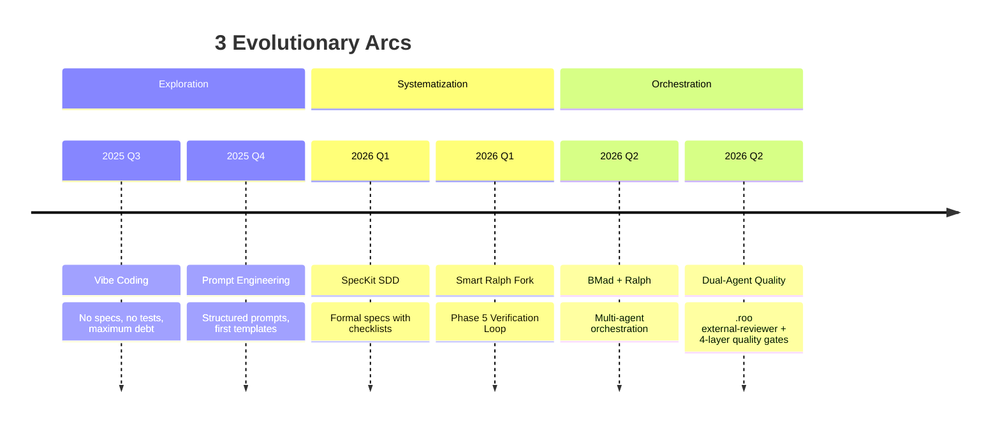
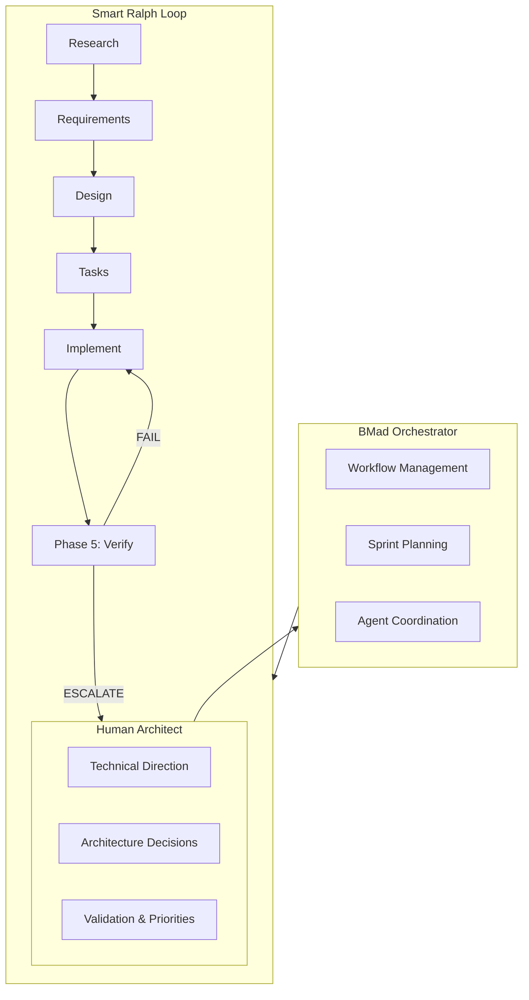

# Portfolio: AI Development Orchestrator

> **An architect who directed 12,000+ lines of functional code — without writing a single line by hand.**

---

## The Story

A year ago, the tools for reliable AI-assisted code generation barely existed. I started with raw "vibe coding" — prompting an AI to write code without specs, without tests, without structure. The result was a working prototype buried in technical debt.

Today, this project runs a **functional Home Assistant plugin** that helps real EV owners plan trips and optimize charging schedules — built entirely through structured specifications executed by specialized AI agents. Every architectural decision is mine. Every line of code is AI-generated. Every inherited flaw is being systematically corrected.

This is not a demo. This is not a toy. This is a **documented journey from chaos to engineering rigor**, and an invitation to anyone who wants to learn from it.

---

## Impact at a Glance

| Metric | Value Verified | Date |
|--------|---------------|------|
| **Lines of Code** | ~12,432 (Python backend) | 2026-04-23 |
| **Python Modules** | **18** production modules | 2026-04-23 |
| **Domain Skills** | **12** domain skills + **11** framework skills + **117** .roo agent skills (17 review/quality + 100 BMAD/game dev/LangChain) | 2026-05-03 |
| **Unit Tests** | **1822** Python tests (100% coverage) | 2026-05-03 |
| **E2E Tests** | **40** Playwright specifications (30 main + 10 SOC) | 2026-05-03 |
| **Specifications Executed** | **30** across 4 methodology arcs (1 spec fully executed) | 2026-05-03 |
| **Technical Documents** | **23** structured docs | 2026-04-23 |
| **Fork Contribution** | Phase 5: Agentic Verification Loop (contributed to Smart Ralph upstream) | — |

---

## The Three Layers

### Layer 1: From Technical Debt to Excellence

Every inherited flaw is documented, diagnosed, and tracked.

**5 known gaps** from the early "vibe coding" era are catalogued in [`doc/gaps/gaps.md`](../doc/gaps/gaps.md) with:
- Root cause hypotheses ranked by probability
- Code references with exact line numbers
- Proposed solutions at immediate, short-term, and long-term horizons
- A **Debt Management Score of 88%** — not because the gaps exist, but because they are transparently managed

This is what mature engineering looks like: not avoiding mistakes, but **finding them, documenting them, and systematically eliminating them**.

### Layer 2: Building Something Real with AI

The plugin is **functional and in production**:

- 🚗 **Trip Planning** — Recurring weekly trips and one-time journeys with energy calculations
- ⚡ **EMHASS Integration** — Intelligent energy optimization with 168-hour charging profiles
- 🔋 **SOC-Aware Charging** — State-of-charge calculations with safety margins
- 📊 **7+ Sensors per Vehicle** — Real-time data via Home Assistant's coordinator pattern
- 🎛️ **Native Panel** — Custom sidebar with Lit web components
- 📋 **Auto-deployed Dashboards** — Lovelace YAML dashboards per vehicle
- 🔔 **Notifications & Control** — 4 vehicle control strategies with presence detection

**Installable via HACS** — the standard Home Assistant app store.

### Layer 3: Sharing the Learning

This project exists to help others:

- **EV owners** plan charging schedules and save energy
- **Developers** learn from a fully documented AI-assisted development process
- **Architects** see how specification-driven AI development works at scale
- **Contributors** join an open-source project with clear specs and quality gates

All documentation is being translated to English to maximize accessibility. Contributions are welcome.

---

## Methodology Evolution

### Arc 1: Exploration — "I discovered that without specifications, debt grows exponentially"

Raw vibe coding produced working code but accumulated 5 significant gaps that persist today. Each gap is a lesson in why structure matters.

### Arc 2: Systematization — "I learned that structured specs + parallel verification elevate quality"

The Smart Ralph fork introduced **Phase 5: Agentic Verification Loop** — a unique contribution where a QA agent reviews implementation in real-time, catching errors before they propagate to subsequent tasks.

### Arc 3: Orchestration — "Multi-agent orchestration with agentic verification is the future"

BMad Method provides the orchestration layer: specialized agents for analysis, architecture, product management, development, and QA — all coordinated through structured workflows.

### Arc 4: Dual-Agent Quality — "Deterministic + consensus quality gates are the next frontier"

During M403-Dynamic-SOC-Capping (136 tasks), a **second quality system** emerged: the `.roo` agent with **117 skills** (17 review/quality + 100 BMAD/game dev/LangChain), including a **4-layer quality gate** that bridges deterministic AST analysis with BMAD multi-agent consensus. This system was NOT in git — it lived in `.roo/skills/` — but its artifacts (checkpoint JSON files) were consumed by Ralph's VERIFY steps, creating a dual-layer quality assurance architecture.

**Key discovery:** The `.roo` external-reviewer evolved beyond a simple QA reviewer into a **spec integrity guardian** with anti-evasion policies, mutation testing integration, and spec integrity protection. It caught spec modification attempts (deletion of pending tasks) that even the Ralph coordinator didn't detect.

---

## Architecture: How It Works

**Key innovation:** The QA Engineer operates in **parallel** with the Spec Executor — reviewing implementation as it happens, not after. When a violation is detected, it is corrected before the next task begins.

**Arc 4 innovation:** A parallel quality system operates alongside Ralph: the `.roo` agent with 117 skills (17 review/quality + 100 BMAD), including a 4-layer quality gate (deterministic AST + BMAD consensus), mutation testing, weak test detection, and spec integrity protection. Its checkpoint JSON outputs are consumed by Ralph's VERIFY steps, creating a dual-layer quality assurance architecture.

**Arc 5: Multi-Layer Code Review** — The lifecycle includes three independent review layers:
- **Gito** (local): Static analysis with a local LLM model before every commit — the first line of defense
- **Ralph + .roo** (parallel): 4-layer quality gate (L3A→L1→L2→L3B) during task execution
- **CodeRabbit** (external): PR review on every push — provides an independent final gate before merge

Together, these layers create a comprehensive safety net: Gito catches local issues before commit, Ralph/.roo catches implementation defects during development, and CodeRabbit provides an independent external perspective.

---

## Unique Contribution: Phase 5 Verification Loop

The fork [`informatico-madrid/smart-ralph`](https://github.com/informatico-madrid/smart-ralph) adds a verification layer that does not exist in the upstream:

| Feature | Description |
|---------|-------------|
| **VE Tasks** | Verification tasks auto-generated by task-planner |
| **Verification Contract** | Structured block with entry points, observable signals, invariants, and seed data |
| **Structured Signals** | `VERIFICATION_PASS`, `VERIFICATION_FAIL`, `VERIFICATION_DEGRADED`, `ESCALATE` |
| **Repair Loop** | Auto-classify failure → fix → retry (max 2) → escalate to human |
| **Regression Sweep** | Based on dependency map, not full test suite |

**Status:** Draft PR prepared for upstream contribution.

---

## Technical Debt Management

| Gap | Impact | Fix Effort | Priority | Status |
|-----|--------|------------|----------|--------|
| Sidebar panel not removed on delete | Medium | Low | 🔴 High | Hypothesis documented |
| Vehicle Status section empty | High | Medium | 🔴 High | Hypothesis documented |
| Options flow incomplete | Medium | Medium | 🟡 Medium | Hypothesis documented |
| Power profile not propagating | High | Low | 🔴 High | Hypothesis documented |
| Dashboard hardcoded gradients | Low | Low | 🟢 Low | Hypothesis documented |

**Debt Management Score: 88%** — All gaps inherited from Phase 1 (Vibe Coding). Their transparent documentation demonstrates mature engineering practice, not negligence.

---

**What this demonstrates:**

1. **System Architecture Without Code** — Designing and directing complex systems through specifications, not manual coding
2. **Methodology Evolution** — 4 arcs (7 phases) of documented growth from chaos to dual-agent quality orchestration
3. **Dual-Agent Quality Assurance** — A 4-layer quality gate (deterministic AST + BMAD consensus) running parallel to Ralph, with 17 review/quality skills, mutation testing, and spec integrity protection
4. **Technical Debt Management** — Transparent tracking and systematic correction of inherited flaws
5. **Open Source Contribution** — Original Phase 5 Verification Loop contributed back to Smart Ralph ecosystem
6. **Production Quality** — Functional plugin with real users, HACS distribution, 1822 tests, 100% coverage

**What to look at first:**
1. This document (you are here) — 2-minute overview
2. [`_ai/ai-development-lab.md`](./ai-development-lab.md) — Full experiment documentation (now includes Phase 7)
3. [`docs/RALPH_METHODOLOGY.md`](./RALPH_METHODOLOGY.md) — Smart Ralph fork methodology
4. [`specs/m403-dynamic-soc-capping/chat.md`](../specs/m403-dynamic-soc-capping/chat.md) — 2300+ lines of dual-agent quality coordination
5. [`specs/m403-dynamic-soc-capping/task_review.md`](../specs/m403-dynamic-soc-capping/task_review.md) — 1100+ lines of external review decisions
6. [`doc/gaps/EXECUTIVE_SUMMARY.md`](../doc/gaps/EXECUTIVE_SUMMARY.md) — Debt management summary

---

## For Contributors

This project welcomes contributions of all kinds:

- 🐛 **Bug fixes** — especially the 5 documented gaps
- 🌍 **Translations** — help make the plugin accessible in more languages
- 📖 **Documentation** — improve guides, add examples, fix typos
- 🧪 **Tests** — expand coverage, add E2E scenarios
- 🏗️ **Features** — pick from the [roadmap](../ROADMAP.md)

**Getting started:**
1. Read the [Development Guide](./development-guide.md)
2. Check the [Architecture Overview](./architecture.md)
3. Pick an issue or gap to work on
4. Follow the spec-driven workflow in [RALPH_METHODOLOGY.md](./RALPH_METHODOLOGY.md)

---

## Tech Stack

| Layer | Technology | Purpose |
|-------|-----------|---------|
| Backend | Python 3.11+ on Home Assistant | Core integration logic |
| Frontend | Lit 2.8.x | Web Components for native panel |
| Testing | pytest + Playwright | Unit tests + E2E browser tests |
| Quality | ruff + pylint + mypy (strict) | Linting, formatting, type checking |
| Distribution | HACS + Docker | Home Assistant app store + containerized testing |
| AI Development | BMad + Smart Ralph + .roo | Multi-agent orchestration + dual-layer quality gates |

---

*Built with direction, not keystrokes.*  
*Maintained by [@informatico-madrid](https://github.com/informatico-madrid).*  
*Open source, open process, open invitation to contribute.*
