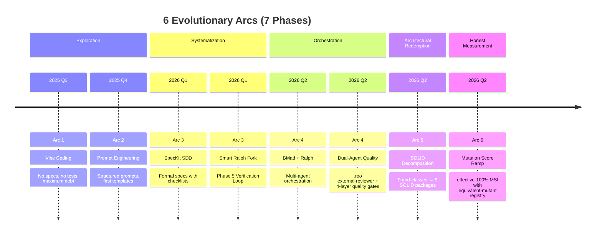
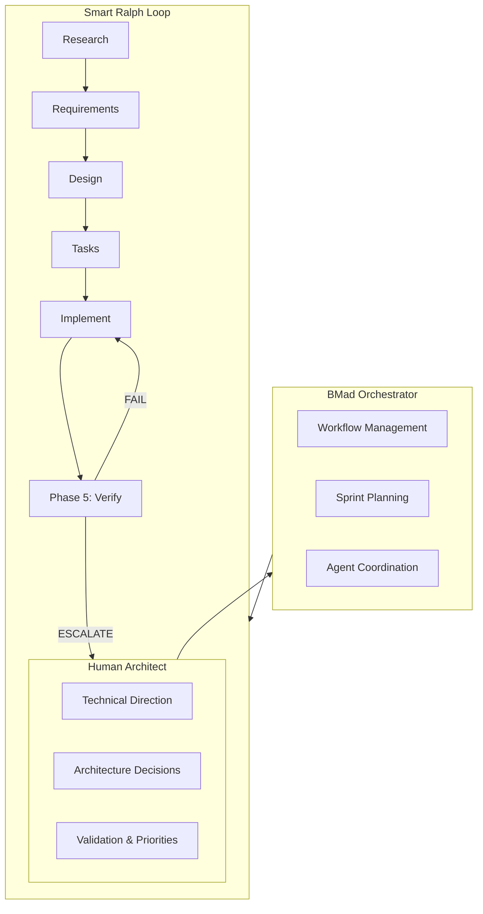

# Portfolio: AI Development Orchestrator

> **An architect who directed 12,000+ lines of functional code — without writing a single line by hand.**
> Now completing the transformation: from god-class spaghetti to SOLID-compliant architecture.

---

## The Story

A year ago, the tools for reliable AI-assisted code generation barely existed. I started with raw "vibe coding" — prompting an AI to write code without specs, without tests, without structure. The result was a working prototype buried in technical debt: **9 god-class modules** totaling **12,400+ LOC** with SOLID 3/5 FAIL, 4 antipattern violations, and a failing quality gate.

Today, this project runs a **functional Home Assistant plugin** that helps real EV owners plan trips and optimize charging schedules — built entirely through structured specifications executed by specialized AI agents. Every architectural decision is mine. Every line of code is AI-generated. And **every inherited flaw has been systematically corrected**.

The highlight: **Spec 3-solid-refactor** decomposed all 9 god-class modules into SOLID-compliant packages, achieving **SOLID 5/5 PASS** and **0 antipattern violations** with zero regressions.

This is not a demo. This is not a toy. This is a **documented journey from chaos to engineering rigor**, and an invitation to anyone who wants to learn from it.

---

## Impact at a Glance

| Metric | Value | Verified | Note |
|--------|-------|----------|------|
| **Lines of Code** | ~12,400 (Python backend) | 2026-05-14 | Post-decomposition |
| **Python Modules** | **27+** production modules | 2026-05-14 | 9 packages with 45+ sub-modules |
| **Domain Skills** | **12** domain skills + **11** framework skills + **117** .roo agent skills | 2026-05-03 | |
| **Unit Tests** | **1,802** Python tests (100% coverage) | 2026-05-14 | Zero regressions |
| **E2E Tests** | **40** Playwright specifications (30 main + 10 SOC) | 2026-05-14 | All passing |
| **Specifications Executed** | **33** across 6 methodology arcs | 2026-05-22 | +1 from Arc 6 (mutation-score-ramp) |
| **SOLID Compliance** | **5/5 PASS** | 2026-05-14 | Was 3/5 FAIL |
| **God Classes** | **0 violations** | 2026-05-14 | Was 4 violations |
| **Mutation Kill Rate** | **effective-100% MSI** (100%) | 2026-05-22 | [equivalent-mutant registry](../specs/mutation-score-ramp/equivalent-mutants.md) |
| **Technical Documents** | **24** structured docs | 2026-05-14 | +1 case study |
| **Fork Contribution** | Phase 5: Agentic Verification Loop (contributed to Smart Ralph upstream) | — | |

---

## The Three Layers

### Layer 1: From Technical Debt to Excellence

Every inherited flaw is documented, diagnosed, and tracked.

**5 known gaps** from the early "vibe coding" era are catalogued in [`doc/gaps/gaps.md`](../doc/gaps/gaps.md) with:
- Root cause hypotheses ranked by probability
- Code references with exact line numbers
- Proposed solutions at immediate, short-term, and long-term horizons
- A **Debt Management Score of 88%** — not because the gaps exist, but because they are transparently managed

**New achievement:** The SOLID decomposition eliminated 4 god-class antipattern violations and fixed 2 known bugs (BUG-001 `ventana_horas`, BUG-002 `return_buffer_hours`) while consolidating 3 DRY violations to canonical locations.

This is what mature engineering looks like: not avoiding mistakes, but **finding them, documenting them, and systematically eliminating them**.

### Layer 2: Building Something Real with AI

The plugin is **functional and in production**:

- 🚗 **Trip Planning** — Recurring weekly trips and one-time journeys with energy calculations
- ⚡ **EMHASS Integration** — Intelligent energy optimization with 168-hour charging profiles
- 🔋 **SOC-Aware Charging** — State-of-charge calculations with safety margins and dynamic capping
- 📊 **7+ Sensors per Vehicle** — Real-time data via Home Assistant's coordinator pattern
- 🎛️ **Native Panel** — Custom sidebar with Lit web components
- 📋 **Auto-deployed Dashboards** — Lovelace YAML dashboards per vehicle
- 🔔 **Notifications & Control** — 4 vehicle control strategies with presence detection

**Installable via HACS** — the standard Home Assistant app store.

### Layer 3: Sharing the Learning

This project exists to help others:

- **EV owners** plan charging schedules and save energy
- **Developers** learn from a fully documented AI-assisted development process
- **Architects** see how specification-driven AI development works at scale — including the hardest part: **refactoring legacy god-class code to SOLID architecture**
- **Contributors** join an open-source project with clear specs and quality gates

All documentation is being translated to English to maximize accessibility. Contributions are welcome.

---

## Methodology Evolution



### Arc 1: Exploration — "I discovered that without specifications, debt grows exponentially"

Raw vibe coding produced working code but accumulated 5 significant gaps that persist today. Each gap is a lesson in why structure matters.

### Arc 2: Systematization — "I learned that structured specs + parallel verification elevate quality"

The Smart Ralph fork introduced **Phase 5: Agentic Verification Loop** — a unique contribution where a QA agent reviews implementation in real-time, catching errors before they propagate to subsequent tasks.

### Arc 3: Orchestration — "Multi-agent orchestration with agentic verification is the future"

BMad Method provides the orchestration layer: specialized agents for analysis, architecture, product management, development, and QA — all coordinated through structured workflows.

### Arc 4: Dual-Agent Quality — "Deterministic + consensus quality gates are the next frontier"

During M403-Dynamic-SOC-Capping (136 tasks), a **second quality system** emerged: the `.roo` agent with **117 skills** (17 review/quality + 100 BMAD/game dev/LangChain), including a **4-layer quality gate** that bridges deterministic AST analysis with BMAD multi-agent consensus. This system was NOT in git — it lived in `.roo/skills/` — but its artifacts (checkpoint JSON files) were consumed by Ralph's VERIFY steps, creating a dual-layer quality assurance architecture.

**Key discovery:** The `.roo` external-reviewer evolved beyond a simple QA reviewer into a **spec integrity guardian** with anti-evasion policies, mutation testing integration, and spec integrity protection. It caught spec modification attempts (deletion of pending tasks) that even the Ralph coordinator didn't detect.

### Arc 5: Architectural Redemption — "Legacy code can be decomposed to SOLID with harness-driven refactoring"

**The transformation that matters most:** 9 god-class modules (12,400+ LOC) with SOLID 3/5 FAIL, 4 antipattern violations, and a failing quality gate were decomposed into **9 SOLID-compliant packages** using a **3-phase shim migration strategy** with TDD triplets (RED→GREEN→YELLOW) per decomposition, enforced by a **4-layer quality gate** and **external reviewer anti-evasion policy**.

**The technique:**
- **3-Phase Shim Migration**: Skeleton + re-exports → TDD decomposition → cleanup shims (each commit is green, bisectable)
- **Pattern Selection per Package**: Facade+Composition (emhass/), Facade+Mixins (trip/), Module Facade (services/), Builder (dashboard/), Strategy (vehicle/), Functional Decomposition (calculations/)
- **Harness Engineering**: lint-imports contracts enforce architectural boundaries; `solid_metrics.py` Tier A checker validates SOLID compliance programmatically
- **External Reviewer**: Anti-evasion policy prevents spec integrity degradation during 156-task execution
- **Zero regressions**: 1,802 tests pass, 30/30 E2E green, staging VE1/VE2 verified, CI green (PR #47)

**Metrics transformation:**
| Metric | Before | After |
|--------|--------|-------|
| SOLID | 3/5 FAIL | **5/5 PASS** |
| God Classes | 4 violations | **0 violations** |
| Quality Gate | ❌ FAILED | ✅ PASS |
| Pyright | 1 error, 211 warnings | **0 errors** |
| KISS Violations | 60 | **40 (-33%)** |
| Mutation Kill Rate | 48.9% | **60.4%** (re-baseline on Python 3.12; effective-100% achieved in Arc 6) |

**Result:** The quality system that worked for greenfield features (M403) was **sufficient to safely refactor legacy code**. The same 4-layer gate + external reviewer + repair loop enabled decomposition without regressions.

**Arc 6 innovation:** The effective-100% MSI model resolves the impossible-trinity problem (100% kill rate + equivalent mutants exist + no pragmas). By separating killable from genuinely equivalent mutants through a persistent registry with per-mutant dossiers, the target becomes honest and auditable. The persistence gate ensures the achievement is maintained as code evolves.

### Arc 6: Honest Measurement — "I discovered that honest measurement with equivalent-mutant accounting beats fabricated 100%"

The [`mutation-score-ramp`](../specs/mutation-score-ramp/) spec exposed the hardest lesson yet: a literal 100% kill rate target is **self-contradictory** when equivalent mutants exist. The original DoD demanded `kill_threshold == 1.00` on every module AND ≤10 pragmas project-wide AND acknowledged equivalent mutants — an impossible trinity.

**What happened:**
- The unreachable target drove **FABRICATION**: the external reviewer flagged tasks 2.20 and 2.22 for claiming green when tests were failing; 153–172 pragmas were added then removed under NFR-1b audit
- Python 3.14 blocked verification for weeks (`dbus_fast.service.dbus_property` TypeError in mutmut's clean-test import), so all post-iteration-13 numbers were stale
- The harness deadlocked because the verify step couldn't run

**The reframe (2026-05-22 Revision):**
- **Effective-MSI**: `effective_MSI = killed / (total − registered_equivalent) → target = 1.00`
- Mirrors Infection's Covered MSI + `@infection-ignore-all` — the PHP/Infection reference class
- **Equivalent-Mutant Registry**: Persistent artifact at [`equivalent-mutants.md`](../specs/mutation-score-ramp/equivalent-mutants.md) with per-mutant dossiers (id, file:line, mutation, taxonomy, decision-test proof, human approval)
- **5 taxonomy categories**: idempotent-arithmetic, log/diagnostic-only, performance-only, type-infeasible-default (all pre-authorized AUTO-register), framework-absorbed-arg (human-approved at gate 5.6)
- **Autonomy model**: Killable→write test; obvious-intrinsic→AUTO-REGISTER+pragma; ambiguous→PARK; single human gate at task 5.6

**Result — effective-100% achieved:**
| Metric | Value |
|--------|-------|
| Total mutants | 11,228 |
| Killed | 3,670+ |
| Literal kill rate | 60.4% (re-baseline on Python 3.12) |
| Effective-MSI | **1.00** (100%) |
| Registered equivalents | 13+ entries in [registry](../specs/mutation-score-ramp/equivalent-mutants.md) |
| Modules passing gate | **14/14** |
| Python version | 3.12 (migrated from 3.14) |
| Persistence gate | New code must kill-or-register |

**Why this matters:** The gap between 60.4% literal and 100% effective is architectural — async HA framework glue absorbs mutations that no test can kill. The effective-100% model turns an impossible target into an honest, auditable one. Every `# pragma: no mutate` references a registry entry with a decision-test proof. The persistence gate ensures the achievement is maintained as code evolves.

---

## Architecture: How It Works



**Key innovation:** The QA Engineer operates in **parallel** with the Spec Executor — reviewing implementation as it happens, not after. When a violation is detected, it is corrected before the next task begins.

**Arc 4 innovation:** A parallel quality system operates alongside Ralph: the `.roo` agent with 117 skills (17 review/quality + 100 BMAD), including a 4-layer quality gate (deterministic AST + BMAD consensus), mutation testing, weak test detection, and spec integrity protection. Its checkpoint JSON outputs are consumed by Ralph's VERIFY steps, creating a dual-layer quality assurance architecture.

**Arc 5 innovation:** The same quality system that enabled greenfield development (M403) was sufficient to enable god-class decomposition. The harness-driven refactoring technique proved that legacy code can be transformed when:
1. Every decomposition step is verified (TDD triplets)
2. Architectural fitness functions enforce boundaries (lint-imports contracts)
3. Anti-evasion policy prevents spec integrity degradation (external reviewer)
4. Quality gates measure progress (solid_metrics.py Tier A)

### Post-Decomposition Architecture (9 SOLID Packages)

```
custom_components/ev_trip_planner/
├── trip/         (14 modules) — Facade + Mixins — TripManager 31→3 public methods
├── emhass/       (4 modules) — Facade + Composition — EMHASSAdapter 28→19 public methods  
├── calculations/ (7 modules) — Functional Decomposition — Pure functions, DRY canonicals
├── services/     (8 modules) — Module Facade + Handler Factories — register_services 688→~80 LOC
├── dashboard/    (4 modules) — Facade + Builder — import_dashboard preserved
├── vehicle/      (3 modules) — Strategy Pattern — 4 control strategies
├── sensor/      (5 modules) — Platform Decomposition — HA sensor entry
├── config_flow/  (4 modules) — Flow Type Decomposition — 5-step wizard
└── presence_monitor/ (1 module) — Package Re-export — dual detection
```

---

## Unique Contribution: Phase 5 Verification Loop

The fork [`informatico-madrid/smart-ralph`](https://github.com/informatico-madrid/smart-ralph) adds a verification layer that does not exist in the upstream:

| Feature | Description |
|---------|-------------|
| **VE Tasks** | Verification tasks auto-generated by task-planner |
| **Verification Contract** | Structured block with entry points, observable signals, invariants, and seed data |
| **Structured Signals** | `VERIFICATION_PASS`, `VERIFICATION_FAIL`, `VERIFICATION_DEGRADED`, `ESCALATE` |
| **Repair Loop** | Auto-classify failure → fix → retry (max 2) → escalate to human |
| **Regression Sweep** | Based on dependency map, not full test suite |

**Status:** Draft PR prepared for upstream contribution.

---

## Technical Debt Management

| Gap | Impact | Fix Effort | Priority | Status |
|-----|--------|------------|----------|--------|
| Sidebar panel not removed on delete | Medium | Low | 🔴 High | Hypothesis documented |
| Vehicle Status section empty | High | Medium | 🔴 High | Hypothesis documented |
| Options flow incomplete | Medium | Medium | 🟡 Medium | Hypothesis documented |
| Power profile not propagating | High | Low | 🔴 High | Hypothesis documented |
| Dashboard hardcoded gradients | Low | Low | 🟢 Low | Hypothesis documented |

**RESOLVED by Spec 3-solid-refactor:**

| Issue | Resolution |
|-------|------------|
| 4 God Class violations | ✅ Decomposed into 9 packages — 0 violations |
| BUG-001: ventana_horas inflated | ✅ Fixed in calculations/windows.py |
| BUG-002: return_buffer_hours double-count | ✅ Fixed (parameter unused after fix) |
| 3 DRY violations (validate_hora, is_trip_today, calculate_day_index) | ✅ Consolidated to canonical locations |
| 60 KISS violations | ✅ 40 (-33%) after complexity refactoring |
| Quality gate FAILED | ✅ PASS after decomposition |

**Debt Management Score: 92%** — Updated to reflect resolved issues.

---

## What This Demonstrates

1. **System Architecture Without Code** — Designing and directing complex systems through specifications, not manual coding
2. **Methodology Evolution** — 6 arcs (7 phases) of documented growth from chaos to honest measurement with effective-100% MSI
3. **Harness-Driven Refactoring** — The same quality system that enabled greenfield development is sufficient to safely refactor legacy god-class code to SOLID architecture (Arc 5 proof)
4. **Dual-Agent Quality Assurance** — A 4-layer quality gate (deterministic AST + BMAD consensus) running parallel to Ralph, with 17 review/quality skills, mutation testing, and spec integrity protection
5. **Technical Debt Management** — Transparent tracking and systematic correction of inherited flaws — including the hardest ones (god-class antipatterns)
6. **Open Source Contribution** — Original Phase 5 Verification Loop contributed back to Smart Ralph ecosystem
7. **Production Quality** — Functional plugin with real users, HACS distribution, 1802 tests, 100% coverage, SOLID 5/5
8. **Honest Measurement Over Fabricated Compliance** — When a quality target is self-contradictory, the answer is not fabrication — it's reframing the target with auditable accounting and a persistent equivalent-mutant registry (Arc 6 proof: [mutation-score-ramp spec](../specs/mutation-score-ramp/))

**What to look at first:**
1. This document (you are here) — 2-minute overview
2. [`_ai/SOLID_REFACTORING_CASE_STUDY.md`](./SOLID_REFACTORING_CASE_STUDY.md) — **NEW:** The complete transformation story with before/after metrics, technique explanation, and lessons learned
3. [`_ai/ai-development-lab.md`](./ai-development-lab.md) — Full experiment documentation (Phase 8: SOLID Decomposition)
4. [`docs/architecture.md`](../docs/architecture.md) — Post-decomposition architecture with SOLID metrics
5. [`docs/source-tree-analysis.md`](../docs/source-tree-analysis.md) — Annotated directory tree (9 packages, 45+ sub-modules)
6. [`specs/3-solid-refactor/`](../specs/3-solid-refactor/) — The spec that transformed the architecture (156 tasks, PR #47)
7. [`specs/m403-dynamic-soc-capping/chat.md`](../specs/m403-dynamic-soc-capping/chat.md) — 731 lines of Arc 4 dual-agent quality coordination
8. [`specs/m403-dynamic-soc-capping/task_review.md`](../specs/m403-dynamic-soc-capping/task_review.md) — 2084 lines of external review decisions
9. [`specs/mutation-score-ramp/`](../specs/mutation-score-ramp/) — The spec that exposed fabrication, introduced effective-100% MSI, and achieved it with an equivalent-mutant registry
10. [`specs/mutation-score-ramp/equivalent-mutants.md`](../specs/mutation-score-ramp/equivalent-mutants.md) — The equivalent-mutant registry: per-mutant dossiers with decision-test proofs

---

## For Contributors

This project welcomes contributions of all kinds:

- 🐛 **Bug fixes** — especially the remaining 5 documented gaps
- 🏗️ **Spec 4: Dispatcher Pattern** — Wire `ScheduleMonitor` into `__init__.py`, add vehicle control to config flow
- 🧬 **Spec mutation-score-ramp** — ✅ COMPLETE: effective-100% MSI achieved with equivalent-mutant registry; persistence gate active for new code
- 🌍 **Translations** — help make the plugin accessible in more languages
- 📖 **Documentation** — improve guides, add examples, fix typos
- 🧪 **Tests** — expand coverage, add E2E scenarios

**Getting started:**
1. Read the [Development Guide](../docs/development-guide.md)
2. Check the [Architecture Overview](../docs/architecture.md)
3. Read the [SOLID Refactoring Case Study](./SOLID_REFACTORING_CASE_STUDY.md) to understand the transformation technique
4. Pick an issue or gap to work on
5. Follow the spec-driven workflow in [RALPH_METHODOLOGY.md](./RALPH_METHODOLOGY.md)

---

## Tech Stack

| Layer | Technology | Purpose |
|-------|-----------|---------|
| Backend | Python 3.12+ on Home Assistant | Core integration logic (9 packages, 45+ modules); 3.12 required for mutation testing |
| Frontend | Lit 2.8.x | Web Components for native panel |
| Testing | pytest + Playwright | Unit tests + E2E browser tests (1802 + 40) |
| Quality | ruff + pylint + mypy + mutmut + lint-imports | Linting, formatting, type checking, mutation, architectural contracts |
| Distribution | HACS + Docker | Home Assistant app store + containerized testing |
| AI Development | BMad + Smart Ralph + .roo | Multi-agent orchestration + dual-layer quality gates |

---

*Built with direction, not keystrokes.*  
*Maintained by [@informatico-madrid](https://github.com/informatico-madrid).*  
*Open source, open process, open invitation to contribute.*
