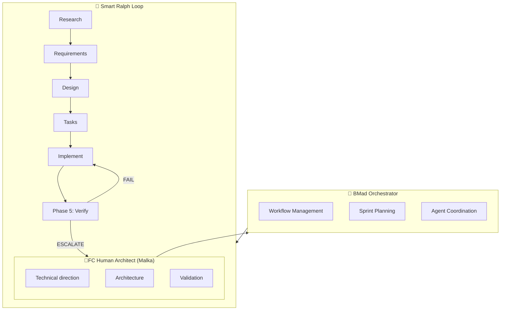
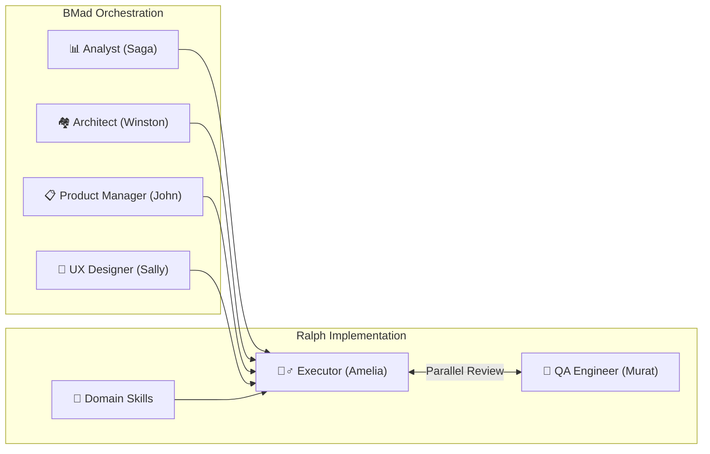
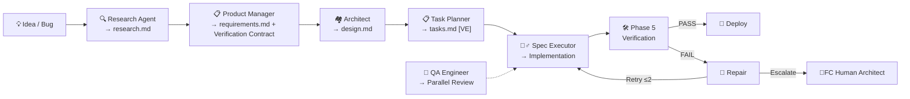

# AI Development Lab — AI-Assisted Development Laboratory

> **Creation Date:** 2026-04-23  
> **Author:** Malka (@informatico-madrid)  
> **Type:** Experimental Document / Methodology Lab  
> **Status:** Active

---

## Table of Contents

- [Executive Summary](#executive-summary)
- [The Project as a Laboratory](#the-project-as-a-laboratory)
- [Evolutionary Trajectory](#evolutionary-trajectory)
- [Experiment Architecture](#experiment-architecture)
- [Current Methodology: BMad + Smart Ralph](#current-methodology-bmad--smart-ralph)
- [Findings and Lessons Learned](#findings-and-lessons-learned)
- [Inherited Gaps](#inherited-gaps)
- [Contribution to the AI Ecosystem](#contribution-to-the-ai-ecosystem)
- [For Recruiters and External Observers](#for-recruiters-and-external-observers)

---

## Executive Summary

**ha-ev-trip-planner** is a **dual experiment**:

1. **Real utility:** A functional Home Assistant component for electric vehicle trip planning with EMHASS energy optimization.
2. **AI Laboratory:** A controlled environment to investigate, validate and document the evolution of AI-assisted development methodologies.

**Technical director profile:** Senior architect specialized in PHP and clean architectures, NOT a Python expert. **100% of the code was generated through architectural specifications executed by specialized IA agents.** Technical direction —architecture decisions, design patterns, quality validation—is human work. Code writing is IA agent work following structured specifications.

This document exists to:
- Document the complete methodological trajectory
- Be transparent about the nature of the experiment
- Serve as a case study for the AI-assisted development community
- Demonstrate architecture capabilities and technical direction without writing code

---

## The Project as a Laboratory

### Dual Nature

| Dimension | Description | Status |
|-----------|-------------|--------|
| **Production** | Functional plugin installed in real Home Assistant | ✅ Active |
| **Laboratory** | Testing environment for AI development methodologies | ✅ Active |

### Laboratory Principles

1. **Radical transparency:** The entire process is documented. Every decision, every failure, every finding is recorded.
2. **Reproducibility:** Specs and artifacts allow anyone to replicate the flow.
3. **Documented evolution:** Each methodology tested left artifacts showing its evolution.
4. **Real quality:** The fact that it is an experiment does not compromise the quality of the outcome.

### What This Is NOT

- ❌ NOT an academic research project
- ❌ NOT a commercial product in mass production
- ❌ NOT code written by a Python expert
- ❌ NOT an attempt to sell something

### What This IS

- ✅ A functional plugin that solves a real problem
- ✅ An AI development methodologies laboratory
- ✅ A documented case study of 100% IA-assisted development
- ✅ A demonstration of technical architecture without manual code writing

---

## Evolutionary Trajectory

The project has evolved through **6 methodological phases**, each leaving artifacts and learnings.

### Phase 1: Pure Live Coding (2025-Q2)

**Description:** Iterative development with Claude Code, without structured specifications. Code generated by conversational prompts without contracts or verification.

**Characteristics:**
- "Vibe Coding" — no specs, no tests, no structure
- Conversational prompts without structure
- No formal specs
- No automated verification
- No API contracts
- Minimal test coverage

**Remaining artifacts:**
- Numeric prefixes in specs (`001-`, `007-`, `008-`, `009-`, `010-`, `011-`, `012-`, `013-`, `017-`, `020-`)
- Docs in `doc/gaps/gaps.md` with inherited problems

**Lessons learned:**
- Without specs, technical debt grows exponentially
- Gaps detected in this phase persist to this day
- Without verification, bugs propagate silently
- Lack of structure makes reproducibility impossible

**Inherited gaps:** See [Inherited Gaps](#inherited-gaps) section

---

### Phase 2: Prompt Engineering (2025-Q3)

**Description:** Introduction of structured prompts and templates. Improved code quality generated without formal SDD methodology.

**Characteristics:**
- Structured prompts (not formal specs)
- Documentation templates
- First attempts at automated testing
- Improved code consistency

**Artifacts:**
- First `requirements.md` and `design.md`
- Documentation templates

**Lessons learned:**
- Structured prompts improve quality but do not resolve architecture problems
- A framework is needed to orchestrate the full flow
- Testing improves but remains reactive

---

### Phase 3: Specialized Models with Fine-Tuning (2025-Q4)

**Description:** Experimentation with fine-tuned models for specific development tasks. Integration of domain skills — still not formal SDD.

**Characteristics:**
- Domain-specific skills loaded per phase (`homeassistant-skill`, `python-testing-patterns`, etc.)
- Models adapted to Home Assistant domain
- Task-specific context
- Still no formal specification-driven development

**Artifacts:**
- `.agents/skills/` with 12+ domain skills
- Skill configuration in `CLAUDE.md`

**Lessons learned:**
- Domain-specific context significantly improves quality
- Domain skills are a force multiplier
- But orchestration remains the main problem

---

### Phase 4: Spec-Driven Development with Speckit (2025-Q4 → 2026-Q1)

**Description:** First adoption of GitHub's spec-kit methodology with `ralph-speckit`. This is when formal SDD was introduced.

**Characteristics:**
- Specs with formal structure (spec.md, plan.md, tasks.md)
- Numeric-prefix-based naming
- Constitution-based governance flows
- Clear separation between requirements, design and tasks

**Artifacts:**
- Specs with numeric prefix (`001-milestone-3-2-complete/`, `007-complete-milestone-3-verify-1-2/`, etc.)
- `_ai/SPECKIT_SDD_FLOW_INTEGRATION_MAP.md`
- Checklists per spec

**Lessons learned:**
- Specs drastically improve traceability
- Numeric naming is hard to navigate and search
- Constitution-based governance is powerful but complex
- A more agile flow is needed for rapid iterations

---

### Phase 5: Smart Ralph Fork (2026-Q1)

**Description:** Migration to `informatico-madrid/smart-ralph`, a fork of `tzachbon/smart-ralph` that adds **Phase 5: Agentic Verification Loop**.

**Characteristics:**
- Free descriptive naming (no numeric prefixes)
- Epics via triage
- **Phase 5: Agentic Verification Loop** (unique fork contribution)
- Real-time reviewer (`qa-engineer` parallel to `spec-executor`)
- Structured signals: `VERIFICATION_PASS`, `VERIFICATION_FAIL`, `ESCALATE`
- Automatic repair loop with retry and human escalation

**Artifacts:**
- `_ai/RALPH_METHODOLOGY.md` — Complete methodology documentation
- Descriptive specs (`e2e-ux-tests-fix/`, `fix-sequential-trip-charging/`, etc.)
- `docs/project-scan-report.json` — Automatic scan reports
- `doc/gaps/gaps.md` — Problem analysis with verifiable hypotheses

**Unique fork contribution:**

| Phase | Upstream | Fork |
|-------|----------|------|
| Phase 1: Make It Work | ✅ | ✅ |
| Phase 2: Refactoring | ✅ | ✅ |
| Phase 3: Testing | ✅ | ✅ |
| Phase 4: Quality Gates | ✅ | ✅ |
| **Phase 5: Verification** | ❌ | ✅ |

**Lessons learned:**
- Real-time agentic verification prevents errors before they propagate
- Parallel reviewer detects SOLID violations during implementation
- Structured signals enable automated repair loops
- The fork has substantial divergences from the upstream
- Draft PR to contribute back upstream

---

### Phase 6: BMad Integration (2026-Q2 — Current)

**Description:** Integration with BMad Method for advanced multi-agent orchestration.

**Characteristics:**
- 3-phase workflow: Analysis → Planning → Solutioning → Implementation
- Domain-specialized agents (`/analyst`, `/architect`, `/pm`, `/dev`, `/ux-designer`, `/qa`)
- Automatic PRD, epic, story generation
- Sprint planning and tracking
- Cross-agent validation

**Artifacts:**
- `_bmad/` — BMad configuration
- `bmalph/` — BMad + Smart Ralph integration
- `specs/` — BMad-generated specs
- `plans/` — Implementation plans

**Lessons learned:**
- Multi-agent orchestration requires balance between automation and human control
- BMad provides structure but adds operational complexity
- The BMad + Smart Ralph combination is powerful but requires tuning

---

### Arc 4: Dual-Agent Quality System (2026-Q2 — discovered during M403 execution)

**Description:** During M403-Dynamic-SOC-Capping (136 tasks), the `.roo` agent's full quality system was discovered and documented. This system — with 117 skills (17 review/quality + 100 BMAD/game dev/LangChain) — was living outside git (in `.roo/`) but its artifacts were consumed by Ralph's VERIFY steps throughout the execution, creating a dual-layer quality architecture.

**Characteristics:**
- `.roo/` directory with 117 skills (NOT in git) — discovered during M403 investigation
- 4-layer quality gate: L3A (smoke <1min) → L1 (tests ~15min) → L2 (weak test ~2min) → L3B (deep SOLID ~15min)
- Two-tier SOLID: Tier A (AST-based deterministic) + Tier B (BMAD Party Mode consensus)
- Spec integrity protection: detects task deletion, criteria weakening, total reduction
- 8 deterministic scripts: solid_metrics, weak_test_detector, mutation_analyzer, antipattern_checker, etc.
- Checkpoint JSON bridge: Ralph VERIFY steps consume .roo quality gate artifacts
- Anti-evasion policy: NO exceptions for pre-existing code, skippable, acceptable regression

**Additional review layers integrated in the development lifecycle:**

| Layer | Tool | Purpose | When |
|-------|------|---------|------|
| **L1: Local review** | **Gito** (`.venv/bin/gito`) | Static analysis with local LLM model | Before commit |
| **L2: Parallel review** | **Ralph external-reviewer** + **.roo quality-gate** | 4-layer quality gate (L3A→L1→L2→L3B) | During task execution |
| **L3: External review** | **CodeRabbit** | PR review on every push | After push to remote |

**Gito** runs local static analysis with a local LLM model before every commit — catching bugs, style issues, and logic errors that automated tests miss. It is the first line of defense.

**CodeRabbit** provides an independent external review on every pull request, complementing the internal Ralph/.roo system with a fresh perspective. CodeRabbit reviews appeared throughout M401, e2e-ux-tests-fix, and other specs — catching duplicate test names, false positives on pre-existing issues, and providing objective feedback before merge.

**Combined coverage:** The three layers create a safety net: Gito catches local issues before commit, Ralph/.roo catches implementation defects during development, and CodeRabbit provides an independent final gate before merge.

**Artifacts discovered:**
- `.roo/skills/quality-gate/SKILL.md` — 4-layer quality gate architecture
- `.roo/skills/quality-gate/config/quality-gate.yaml` — 8 scripts configuration
- `.roo/skills/quality-gate/scripts/` — 8 Python scripts (solid_metrics, weak_test_detector, mutation_analyzer, etc.)
- `.roo/skills/external-reviewer/SKILL.md` — Anti-evasion + spec integrity guardian
- `specs/m403-dynamic-soc-capping/chat.md` — 2300+ lines of dual-agent coordination
- `specs/m403-dynamic-soc-capping/task_review.md` — 1100+ lines of external review decisions

**M403 results:**
- 136 tasks executed, 1822 tests passing, 100% coverage, 0 RuntimeWarnings
- HALLAZGO #11: spec integrity protection gap discovered → fixed during execution
- External-reviewer enhanced to detect "spec task deletion" traps
- Dual-layer quality system: Ralph Phase 5 + .roo quality-gate checkpoint JSON

**Lessons learned:**
- The most sophisticated quality system was living outside git the whole time
- Spec integrity protection is as important as code quality protection
- Deterministic AST + BMAD consensus provides comprehensive quality assurance
- The checkpoint JSON bridge is the key innovation connecting .roo and Ralph

---

### The 4 Evolutionary Arcs

Instead of viewing the 7 phases as independent, they are grouped into **4 narrative arcs** that tell the learning story:

| Arc | Included Phases | Narrative | Result |
|-----|-----------------|-----------|--------|
| **Exploration** | 1-2 (Vibe Coding, Prompts) | "Without specifications, debt grows exponentially" | 5 inherited gaps, functional but fragile code |
| **Systematization** | 3-4 (Domain Context, Speckit) → 5 (Ralph) | "Structured specs + parallel verification elevate quality" | Phase 5 Verification Loop, 99.7% coverage |
| **Orchestration** | 6 (BMad + Ralph) | "Multi-agent with agentic verification is the future" | 23 skills, 29 specs, automated workflow |
| **Dual-Agent Quality** | 7 (M403) | "Deterministic + consensus quality gates are the next frontier" | 1822 tests, 100% coverage, 117 .roo skills, Gito + CodeRabbit |

**Key insight:** Each arc resolved the previous one's problems but introduced new challenges. The technical debt from Arc 1 could only be managed after reaching Arc 3.

---

## Experiment Architecture

### Technology Stack

| Layer | Technology | Version | Purpose |
|-------|-----------|---------|---------|
| **Backend** | Python | 3.11+ / 3.14 | Main component logic |
| **Frontend** | Lit | 2.8.x | Native panel web components |
| **Unit Testing** | pytest + Jest | Latest | Python and JS unit tests |
| **E2E Testing** | Playwright | 1.58+ | End-to-end tests |
| **Linting** | ruff + pylint + mypy | Latest | Python code quality |
| **Container** | Docker | docker-compose | Testing HA environment |

### Development Architecture



**Specialized agent architecture:**



### Development Pipeline



---

## Current Methodology: BMad + Smart Ralph

### Dual Integration

The current project uses a combination of:

1. **BMad Method** for high-level orchestration:
   - PRD and epic generation
   - Sprint planning and tracking
   - Requirements validation
   - Multiple specialized agent management

2. **Smart Ralph Fork** for implementation:
   - Spec-driven loop (Research → Requirements → Design → Tasks → Implement)
   - Phase 5: Agentic Verification Loop
   - Real-time reviewer
   - Structured verification signals

### Domain Skills

12+ domain skills are loaded per phase:

| Skill | Phase | Purpose |
|-------|-------|---------|
| `homeassistant-skill` | All | Core HA — entities, states, services |
| `homeassistant-best-practices` | Design | Recommended HA patterns |
| `homeassistant-config` | Implementation | YAML configuration / config entries |
| `homeassistant-ops` | Research | HA operations: logs, debugging |
| `homeassistant-dashboard-designer` | Design | Lovelace / dashboards |
| `e2e-testing-patterns` | Testing | Generic E2E patterns |
| `playwright-best-practices` | Verification | Playwright selectors, assertions |
| `python-testing-patterns` | Testing | pytest, mocks, fixtures |
| `python-performance-optimization` | Refactoring | Python optimization |
| `python-security-scanner` | Quality Gates | Static security analysis |
| `python-cybersecurity-tool-development` | Quality Gates | Security tools |
| `github-actions-docs` | CI/CD | CI/CD workflows |

---

## Findings and Lessons Learned

### By Methodological Phase

| Phase | Code Quality | Test Coverage | Traceability | Reproducibility | Technical Debt |
|-------|-------------|---------------|--------------|-----------------|---------------|
| Live Coding | Low-Medium | Low | None | None | High |
| Prompts | Medium | Medium | Low | Low | Medium-High |
| Fine-Tuning | Medium | Medium | Medium | Medium | Medium |
| Speckit | High | High | High | High | Medium |
| Smart Ralph | High | High | Very High | Very High | Low |
| BMad + Ralph | Very High | Very High | Very High | Very High | Low |
| **Dual-Agent (M403)** | **Very High** | **Very High** | **Very High** | **Very High** | **Low** |

### Cross-Cutting Findings

1. **Specification is everything:** Without structured specs, code quality depends on prompt quality. With specs, quality is consistently high.

2. **Parallel verification is a force multiplier:** QA Engineer operating parallel to Executor detects errors before they propagate.

3. **Domain context is critical:** Domain-specific skills (Home Assistant, Python testing, Playwright) drastically improve generated code quality.

4. **Clean architecture matters:** Even when code is IA-generated, architectural decisions (patterns, SOLID, protocols) are human decisions that impact long-term quality.

5. **Inherited gaps are inevitable:** Each methodological change leaves technical debt that must be explicitly corrected.

---

## Inherited Gaps

The following problems were introduced during the Live Coding phase and persist to this day:

### Gap #1: Sidebar Panel Not Removed

**Problem:** When deleting a vehicle (config entry), the corresponding panel in the Home Assistant sidebar is not removed until HA is restarted.

**Likely root cause:** Missing call to `async_unregister_panel` in `async_remove_entry_cleanup`.

**Status:** Hypothesis documented in [`doc/gaps/gaps.md`](../doc/gaps/gaps.md), pending verification.

**Affected lines:** `services.py:1451-1533`, `panel.py:109-145`

---

### Gap #2: Empty Vehicle Status Section

**Problem:** The "Vehicle Status" section in the panel shows empty data because `_getVehicleStates()` only searches for sensors with `sensor.{vehicle_id}_*` prefix, but real vehicle sensors (Tesla, VW, etc.) use their own prefixes.

**Likely root cause:** `_getVehicleStates()` filters by entity_id patterns that do not match real vehicle integration sensors.

**Status:** Hypothesis documented in [`doc/gaps/gaps.md`](../doc/gaps/gaps.md), pending verification.

**Affected lines:** `frontend/panel.js:1018-1028`

---

### Gap #3: Incomplete Options Flow

**Problem:** The options flow has only 1 simplified step vs. 5 complete steps in the config flow.

**Likely root cause:** The options flow was intentionally implemented as a simplified version, but an `async_step_reconfigure` method is missing for advanced reconfiguration.

**Status:** Hypothesis documented in [`doc/gaps/gaps.md`](../doc/gaps/gaps.md), pending verification.

**Affected lines:** `config_flow.py:894-951`

---

### Gap #4: Power Profile Not Propagating

**Problem:** Configured power changes do not propagate correctly to the power profile.

**Likely root cause:** The config entry listener uses `entry.data` instead of `entry.options` (or vice versa).

**Status:** Hypothesis documented in [`doc/gaps/gaps.md`](../doc/gaps/gaps.md), pending verification.

**Affected lines:** `services.py:1359`

---

### Gap #5: Dashboard with Hardcoded Gradient

**Problem:** The dashboard uses hardcoded gradients that ignore Home Assistant CSS variables, causing theme inconsistencies.

**Likely root cause:** Initial implementation without a systematic design system.

**Status:** Hypothesis documented in [`doc/gaps/gaps.md`](../doc/gaps/gaps.md), pending verification.

**Affected lines:** `frontend/panel.js` (gradients)

---

### Gap Priority Matrix

| Gap | Impact | Fix Effort | Priority |
|-----|--------|------------|----------|
| Panel not removed | Medium | Low | High |
| Empty Vehicle Status | High | Medium | High |
| Incomplete options flow | Medium | Medium | Medium |
| Power profile not propagating | High | Low | High |
| Dashboard gradients | Low | Low | Low |

---

## Contribution to the AI Ecosystem

### Smart Ralph Fork

The fork [`informatico-madrid/smart-ralph`](https://github.com/informatico-madrid/smart-ralph) adds **Phase 5: Agentic Verification Loop** that does not exist in the upstream.

**Unique contributions:**

1. **VE Tasks:** Verification tasks automatically generated by `task-planner`
2. **Verification Contract:** Structured block in `requirements.md` with entry points, observable signals, invariants and seed data
3. **Structured Signals:** `VERIFICATION_PASS`, `VERIFICATION_FAIL`, `VERIFICATION_DEGRADED`, `ESCALATE`
4. **Repair Loop:** Automatic failure classification with retry and human escalation
5. **Regression Sweep:** Based on the Verification Contract's Dependency map

**Status:** Draft PR to contribute upstream.

### Open Documentation

The entire development process is publicly documented:
- Complete specs in `specs/`
- Gaps and problems in `doc/gaps/gaps.md`
- Methodology in `_ai/RALPH_METHODOLOGY.md`
- Scan reports in `docs/project-scan-report.json`

### Reusable Artifacts

- 12+ domain skills in `.agents/skills/`
- Reusable spec templates
- Checklists per spec type
- E2E verification patterns

---

### Real Example: Verification Contract

The following real example comes from [`specs/e2e-ux-tests-fix/tasks.md`](../specs/e2e-ux-tests-fix/tasks.md):

```markdown
### Reproduction

- [x] 0.1 [VERIFY] Reproduce: verify datetime naive/aware bug exists in trip_manager.py:1470-1502
  <!-- reviewer-diagnosis
    what: Task marked [x] but test PASSED instead of FAILING
    why: Test uses STRING input which goes through dt_util.parse_datetime (always aware).
    fix: Change test to use naive datetime OBJECT
  -->
```

This block shows **Phase 5 in action**: the QA Engineer operates parallel to the Executor, detecting that a test marked as completed was actually not validating the correct condition. The `reviewer-diagnosis` signal is one of the structured signals that enable the automatic repair loop.

---

## For Recruiters and External Observers

### What Does This Project Demonstrate?

1. **Software Architecture Without Code:** Ability to design and direct complex systems without manually writing code. All architectural decisions (patterns, SOLID, DI, protocols) are human decisions.

2. **Complexity Management:** The project handles 17+ Python modules (~12,000 LOC), 12+ web components, 70+ unit tests, 7 E2E specs.

3. **Documented Methodological Evolution:** 6 phases of methodological evolution completely documented and reproducible.

4. **Ecosystem Contribution:** Smart Ralph fork with Phase 5 being contributed upstream.

5. **Production Quality:** Functional plugin in Home Assistant with real EMHASS integration and electric vehicle control.

### Project Metrics

| Metric | Verified Value | Date |
|--------|----------------|------|
| Python lines of code | ~12,432 | 2026-04-23 |
| Python modules | **18** | 2026-04-23 |
| Lit components | 12+ | 2026-04-23 |
| Python unit tests | **1822** (100% coverage) | 2026-05-03 |
| Python test files | **85+** | 2026-05-03 |
| Playwright E2E tests | **40** specs (30 main + 10 SOC) | 2026-05-03 |
| Specs fully executed | **1** (M403) | 2026-05-03 |
| Total specs generated | **30** across 4 arcs | 2026-05-03 |
| Domain skills | **23** (12 domain + 11 framework) + **117** .roo agent skills (17 review/quality + 100 BMAD/game dev/LangChain) | 2026-05-03 |
| Technical documentation | **23+** docs | 2026-05-03 |
| Methodological arcs tested | 4 (7 phases) | 2026-05-03 |

### Who is Malka?

- **Senior Architect** specialized in PHP and clean architectures
- **NOT a Python expert** — all code was IA-generated
- **ZERO lines of code written manually**
- Specialized in directing specialized IA agents
- Creator of the `informatico-madrid/smart-ralph` fork
- Contributor to the AI-assisted development ecosystem

### Why Does This Project Matter?

This project demonstrates that an experienced architect can:

1. **Direct complex systems** without manually writing code
2. **Maintain production quality** using structured specifications
3. **Evolve methodologies** for AI-assisted development
4. **Contribute to the ecosystem** with open tools and documentation
5. **Manage technical debt** inherited from different methodologies

### How to Use This Project as a Case Study

1. **To understand methodological evolution:** Read [`_ai/RALPH_METHODOLOGY.md`](./RALPH_METHODOLOGY.md) and [`CLAUDE.md`](../CLAUDE.md)
2. **To see specs in action:** Explore `specs/` — each spec has research, requirements, design and tasks
3. **To understand the gaps:** Read [`doc/gaps/gaps.md`](../doc/gaps/gaps.md) — shows the diagnosis and hypothesis process
4. **To replicate the flow:** Follow the steps in `_bmad/COMMANDS.md`

---

## References

- [Smart Ralph Fork](https://github.com/informatico-madrid/smart-ralph)
- [Smart Ralph Upstream](https://github.com/tzachbon/smart-ralph)
- [Ralph Agentic Loop](https://ghuntley.com/ralph/)
- [BMad Method](https://github.com/bmad-code-method)
- [EMHASS](https://github.com/squimidi/gem-hass-energy-assistant)
- [Home Assistant Custom Component Docs](https://developers.home-assistant.io/docs/create_custom_component)

---

*Document maintained by [@informatico-madrid](https://github.com/informatico-madrid).*  
*Last review: 2026-04-23.*
