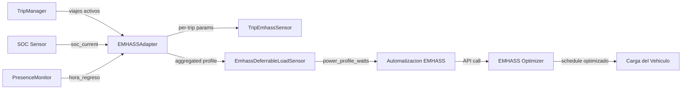

# Análisis Funcional: Planificación de Carga EV con EMHASS

**Fecha**: 2026-04-20  
**Analista**: Mary (Strategic Business Analyst)  
**Estado**: Análisis en progreso  
**Desencadenante**: El usuario observa que el sistema programa carga innecesaria cuando SOC=60% (16 kWh) para un viaje que solo necesita 2 kWh.

---

## 1. ¿Qué ES esta característica?

### Nombre de la Característica
**Perfil de Carga Diferible para EMHASS** (Deferrable Load Power Profile)

### Descripción
El sistema genera un perfil de potencia de 168 horas (7 días) que indica a EMHASS **cuándo y cuánto cargar** el vehículo eléctrico. Este perfil se publica como datos de sensores en Home Assistant, que luego se envían a EMHASS mediante un shell command o automatización para optimización de costes energéticos.

### Componentes Involucrados



### Datos que Produce

Cada viaje activo genera un **TripEmhassSensor** con estos atributos:

| Atributo | Tipo | Descripción | Ejemplo |
|----------|------|-------------|---------|
| `def_total_hours` | float | Horas totales de carga necesarias | `1.0` |
| `P_deferrable_nom` | float | Potencia nominal en Watts | `3600` |
| `def_start_timestep` | int | Paso de inicio en el horizonte 168h | `0` |
| `def_end_timestep` | int | Paso de fin en el horizonte 168h | `3` |
| `power_profile_watts` | list[float] | Perfil de 168 valores (0 o potencia) | `[0, 3600, 0, ...]` |
| `kwh_needed` | float | Energía necesaria para el viaje | `2.0` |
| `deadline` | str | Fecha/hora límite del viaje | `2026-04-20T10:45` |
| `emhass_index` | int | Índice en EMHASS (0-49) | `0` |

El sensor agregado `sensor.emhass_perfil_diferible_{vehicle_id}` combina todos los viajes en una matriz `p_deferrable_matrix`.

---

## 2. ¿Qué DEBERÍA hacer? (Requisitos Funcionales Esperados)

Basado en la documentación del proyecto (epic, specs, docs), estos son los requisitos funcionales que la característica debería cumplir:

### RF-1: Cálculo de Energía Necesaria con SOC
> **Dado** un viaje que necesita X kWh y un SOC actual del Y%,  
> **Cuando** se calcula la energía necesaria,  
> **Entonces** el sistema debe restar la energía disponible en batería:  
> `energia_necesaria = max(0, energia_viaje - (SOC/100 * capacidad_bateria))`

**Fuente**: [`calculate_energy_needed()`](custom_components/ev_trip_planner/calculations.py:199) implementa esta lógica correctamente.  
**Fuente**: [Epic emhass-deferrable-integration](specs/_epics/emhass-deferrable-integration/epic.md) - Spec 3 SOC Milestone Algorithm.

### RF-2: Perfil de Potencia Refleja Energía Real Necesaria
> **Dado** que el SOC es suficiente para cubrir un viaje,  
> **Cuando** se genera el perfil de potencia,  
> **Entonces** el perfil debe mostrar 0W (sin carga) para ese viaje.

**Fuente**: [`calculate_power_profile()`](custom_components/ev_trip_planner/calculations.py:840) implementa esta lógica correctamente (líneas 908-915: llama a `calculate_energy_needed` y hace `continue` si `energia_kwh <= 0`).

### RF-3: Ventana de Carga Basada en SOC y Hora de Regreso
> **Dado** el vehículo ha regresado a casa,  
> **Cuando** se calcula la ventana de carga,  
> **Entonces** la ventana empieza en `hora_regreso` y termina en `deadline del viaje`.

**Fuente**: [`calculate_multi_trip_charging_windows()`](custom_components/ev_trip_planner/calculations.py:347) implementa esto correctamente.

### RF-4: Actualización ante Cambios de SOC
> **Dado** el vehículo está en casa y enchufado,  
> **Cuando** el SOC cambia >= 5%,  
> **Entonces** el perfil de carga se recalcula y los sensores se actualizan.

**Fuente**: [Spec 1 SOC Integration Baseline](specs/soc-integration-baseline/plan.md).

### RF-5: kwh_needed en Sensor Refleja Energía Real
> **Dado** el SOC actual del vehículo,  
> **Cuando** se publica el atributo `kwh_needed` del sensor EMHASS,  
> **Entonces** debe mostrar la energía REAL necesaria (descontando lo que ya tiene la batería), no la energía bruta del viaje.

**Fuente**: Inferido de RF-1 y RF-2. El sensor es la interfaz con EMHASS, por lo que debe reflejar la realidad.

### RF-6: Parámetros EMHASS Consistentes con Perfil
> **Dado** un viaje con SOC suficiente,  
> **Cuando** se publican `def_total_hours`, `P_deferrable_nom`, `power_profile_watts`,  
> **Entonces** todos deben indicar 0 (sin carga necesaria).

**Fuente**: Consistencia lógica. No tiene sentido tener `kwh_needed=0` pero `P_deferrable_nom=3600`.

---

## 3. ¿Qué ESTÁ HACiendo? (Comportamiento Actual)

### Hallazgo Crítico: Dos Caminos Paralelos Desconectados

El sistema tiene **DOS funciones** que generan perfiles de potencia, y se comportan de forma inconsistente:

```mermaid
flowchart TD
    subgraph Camino A - TripManager - CORRECTO
        A1[async_generate_power_profile] --> A2[calculate_power_profile]
        A2 --> A3[calculate_energy_needed]
        A3 --> A4[SI usa SOC]
        A4 --> A5[energia_kwh = max de 0 y viaje - actual]
        A5 --> A6[Si energia_kwh menor o igual 0: SKIP]
    end
    
    subgraph Camino B - EMHASSAdapter - INCORRECTO
        B1[async_publish_all_deferrable_loads] --> B2[_populate_per_trip_cache_entry]
        B1 --> B3[_calculate_power_profile_from_trips]
        B2 --> B4[kwh_needed = trip.kwh directo]
        B3 --> B5[kwh = trip.kwh directo]
        B4 --> B6[NO usa SOC]
        B5 --> B7[NO usa SOC]
        B6 --> B8[Siempre genera carga si kwh mayor 0]
        B7 --> B9[Siempre genera perfil si kwh mayor 0]
    end
    
    style A4 fill:#90EE90
    style A6 fill:#90EE90
    style B6 fill:#FFB6C1
    style B7 fill:#FFB6C1
    style B8 fill:#FFB6C1
    style B9 fill:#FFB6C1
```



### Camino A: `calculate_power_profile()` — CORRECTO ✅

En [`calculations.py:840-964`](custom_components/ev_trip_planner/calculations.py:840):

```python
# Línea 908-915: Usa calculate_energy_needed que SÍ considera SOC
energia_info = calculate_energy_needed(
    trip, battery_capacity_kwh, soc_current, charging_power_kw,
    safety_margin_percent=safety_margin_percent,
)
energia_kwh = energia_info["energia_necesaria_kwh"]

if energia_kwh <= 0:
    continue  # ← SKIP: No carga si SOC es suficiente
```

**Este camino es llamado por**: `TripManager.async_generate_power_profile()` → genera un perfil que se almacena en `coordinator.data["emhass_power_profile"]`.

### Camino B: `calculate_power_profile_from_trips()` — INCORRECTO ❌

En [`calculations.py:715-837`](custom_components/ev_trip_planner/calculations.py:715):

```python
# Línea 792-793: Usa kwh del viaje DIRECTAMENTE, ignora SOC
if "kwh" in trip:
    kwh = float(trip.get("kwh", 0))

# Línea 800-802: Solo verifica kwh > 0
if kwh <= 0:
    continue

# Línea 805: Siempre calcula horas de carga
total_hours = kwh / power_kw

# Líneas 830-832: Siempre llena el perfil
for h in range(int(hora_inicio_carga), int(hora_fin)):
    power_profile[h] = charging_power_watts
```

**Este camino es llamado por**:
- [`EMHASSAdapter._calculate_power_profile_from_trips()`](custom_components/ev_trip_planner/emhass_adapter.py:2078) → delega a la versión simplificada
- [`EMHASSAdapter._populate_per_trip_cache_entry()`](custom_components/ev_trip_planner/emhass_adapter.py:622) → genera `power_profile_watts` por viaje
- [`EMHASSAdapter.async_publish_all_deferrable_loads()`](custom_components/ev_trip_planner/emhass_adapter.py:832) → genera perfil agregado

### Camino B también: `_populate_per_trip_cache_entry()` — INCORRECTO ❌

En [`emhass_adapter.py:521-642`](custom_components/ev_trip_planner/emhass_adapter.py:521):

```python
# Línea 560: Usa kwh del viaje DIRECTAMENTE
kwh_needed = trip.get("kwh", 0.0)

# Línea 620: Calcula horas basándose en kwh_needed sin SOC
total_hours = kwh_needed / charging_power_kw

# Línea 622: Genera perfil sin SOC
power_profile = self._calculate_power_profile_from_trips([trip], charging_power_kw)
```

**Nota**: `soc_current` SE pasa como parámetro (línea 528) y SE usa en la línea 578 para `calculate_multi_trip_charging_windows`, pero **solo para calcular las ventanas temporales** (`inicio_ventana`, `fin_ventana`), no para decidir si cargar.

### El SOC SÍ se usa... pero solo para ventanas temporales

En [`calculate_multi_trip_charging_windows()`](custom_components/ev_trip_planner/calculations.py:347):

```python
# Línea 413-417: Calcula energía necesaria CON SOC
energia_info = calculate_energy_needed(
    trip, battery_capacity_kwh, soc_actual, charging_power_kw,
    safety_margin_percent=safety_margin_percent,
)
kwh_necesarios = energia_info["energia_necesaria_kwh"]
```

El resultado `kwh_necesarios` se almacena en el dict de la ventana pero **no se verifica si es 0** para saltar la publicación. El código siempre procede a publicar el viaje como carga diferible.

---

## 4. Caso del Usuario: Análisis Concreto

| Dato | Valor |
|------|-------|
| Viaje kWh | 2 kWh |
| SOC actual | 60% |
| Batería | ~27 kWh |
| Energía disponible | 16.2 kWh |
| Energía que necesitaría cargar | 0 kWh (sobran 14.2 kWh) |
| Energía que el sistema planifica | **2 kWh** (ignora SOC) |
| Potencia programada | **3600W durante 1 hora** |
| Ventana de carga | 3 horas antes del deadline |

### Lo que el sensor muestra vs. lo que debería mostrar

| Atributo | Valor Actual | Valor Esperado |
|----------|-------------|----------------|
| `kwh_needed` | `2.0` | `0.0` |
| `def_total_hours` | `1` | `0` |
| `P_deferrable_nom` | `3600` | `0` (o no publicar) |
| `power_profile_watts` | `[0, 3600, 0, ...]` | `[0, 0, 0, ...]` |
| `def_start_timestep` | `0` | N/A (sin carga) |
| `def_end_timestep` | `3` | N/A (sin carga) |

---

## 5. Análisis de Impacto

### ¿Qué datos llegan a EMHASS?

EMHASS recibe el `power_profile_watts` del sensor agregado. Si el perfil dice "carga 3600W durante 1h" cuando en realidad no necesitas cargar, EMHASS optimizará esa carga innecesaria, potencialmente:

1. **Consumiendo energía innecesaria** de la red o solar
2. **Desplazando otras cargas** que sí necesitan optimización
3. **Generando costes innecesarios** si la tarifa no es favorable

### ¿Qué datos SÍ son correctos?

- **Ventanas temporales** (`inicio_ventana`, `fin_ventana`): Se calculan con SOC via `calculate_multi_trip_charging_windows`
- **SOC milestones** (`calcular_hitos_soc`): El algoritmo de propagación de déficit funciona correctamente
- **El camino TripManager** (`calculate_power_profile`): Genera el perfil correctamente considerando SOC

### ¿Qué datos son incorrectos?

- **`kwh_needed`** en el sensor EMHASS: No descuenta la energía disponible
- **`def_total_hours`**: Se calcula sobre kwh_needed incorrecto
- **`P_deferrable_nom`**: Siempre muestra la potencia máxima, nunca 0
- **`power_profile_watts`**: Siempre tiene valores de carga, nunca todo ceros
- **Perfil agregado** (`p_deferrable_matrix`): Hereda el error de los perfiles individuales

---

## 6. Contraste con Análisis Externo

El análisis proporcionado por otro agente confirma exactamente los mismos hallazgos:

> 1. `emhass_adapter.py:560` — `kwh_needed = trip.get("kwh", 0.0)` usa kWh del viaje directamente
> 2. `calculations.py:792-793` — `kwh = float(trip.get("kwh", 0))` ignora SOC
> 3. La fórmula correcta existe en `calculate_energy_needed` pero NO se usa en el camino del adapter

**Conclusión**: Ambos análisis convergen en el mismo diagnóstico. Hay consenso técnico.

---

## 7. Root Cause: ¿Por qué existen dos caminos?

### Historia Evolutiva (reconstruida desde specs y git)

1. **Milestone 4** implementó `calculate_power_profile()` en `calculations.py` — la versión completa que SÍ usa SOC
2. **Spec m401-emhass-hotfixes** añadió `calculate_power_profile_from_trips()` — una versión simplificada para el adapter que NO necesitaba SOC en ese momento
3. **Spec fix-sequential-trip-charging** y **fix-emhass-sensor-attributes** extendieron el camino del adapter sin conectarlo con la lógica SOC
4. El resultado: el adapter creció con su propio cálculo de perfil, paralelo e inconexo con el camino TripManager

### La Deuda Técnica

La función `calculate_power_profile_from_trips()` fue creada como utilidad simplificada para el adapter, pero nunca se actualizó para incorporar la lógica SOC que sí existe en `calculate_power_profile()`. Mientras tanto, `_populate_per_trip_cache_entry()` creció dependiendo de esta versión simplificada.

---

## 8. Requisitos Funcionales Propuestos (Corregidos)

### RF-C1: kwh_needed debe reflejar energía real necesaria
```
kwh_needed = max(0, trip.kwh - (SOC/100 * battery_capacity_kwh))
```
Cuando `kwh_needed = 0`, el viaje NO debe generar carga diferible.

### RF-C2: power_profile_watts debe ser todo ceros cuando no se necesita carga
Si `kwh_needed = 0`, el perfil debe ser `[0.0] * 168`.

### RF-C3: P_deferrable_nom debe ser 0 cuando no se necesita carga
Si `kwh_needed = 0`, `P_deferrable_nom = 0`.

### RF-C4: def_total_hours debe ser 0 cuando no se necesita carga
Si `kwh_needed = 0`, `def_total_hours = 0`.

### RF-C5: El sensor EMHASS debe indicar estado idle cuando no hay carga necesaria
Si TODOS los viajes tienen `kwh_needed = 0`, el estado debe ser `idle` (ya existe este estado en el código).

### RF-C6: Consistencia entre los dos caminos de cálculo
Ambos caminos (TripManager y EMHASSAdapter) deben producir el mismo resultado para los mismos inputs.

---

## 9. Preguntas Abiertas para el Usuario

1. **¿Es aceptable que un viaje con SOC suficiente siga apareciendo como carga diferible con valor 0?** O debería eliminarse completamente del sensor EMHASS.

2. **¿El comportamiento actual de SIEMPRE publicar carga es intencional?** Es posible que el diseño original quisiera que EMHASS siempre vea el viaje (para tracking), pero con `kwh_needed=0` para que no cargue.

3. **¿Qué debería pasar con `def_start_timestep` y `def_end_timestep` cuando no se necesita carga?** ¿Deberían ser 0, o debería mantenerse la ventana temporal para referencia?

4. **¿La automatización EMHASS (`emhass_charge_control_template.yaml`) ya maneja el caso `kwh_needed=0`?** La automatización usa `p_deferrable0 > 100` como condición de carga, lo que podría manejarlo correctamente si el perfil es todo ceros.

---

## 10. Gaps Adicionales Identificados (Sesión con Malka)

### G6: El perfil no se actualiza con el paso del tiempo

**Problema**: El coordinador refresca cada 30 segundos ([`coordinator.py:67`](custom_components/ev_trip_planner/coordinator.py:67): `update_interval=timedelta(seconds=30)`), pero solo LEE datos cacheados del EMHASSAdapter:

```python
# coordinator.py:134-136
emhass_data = self._emhass_adapter.get_cached_optimization_results()
```

El cache del adapter solo se actualiza cuando se llama a `publish_deferrable_loads()`, que ocurre en:
- Reinicio de HA ([`__init__.py:132`](custom_components/ev_trip_planner/__init__.py:132))
- CRUD de viajes
- Cambios de SOC ([`presence_monitor.py:566`](custom_components/ev_trip_planner/presence_monitor.py:566))
- Cambios de config

**Pero NO en cada refresh del coordinador.** Resultado: el perfil se queda estático.

**Impacto**: Un viaje que estaba a 3 horas aparece con `def_end_timestep=3` incluso después de que pasen 2 horas.

### G7: Viajes recurrentes no rotan correctamente

Cuando un viaje recurrente (ej: todos los lunes a las 13:00) ya ha comenzado, su ventana de carga debería:
1. Desaparecer de las posiciones iniciales del perfil
2. Aparecer en las posiciones finales (próxima ocurrencia, 7 días después)

[`calculate_next_recurring_datetime()`](custom_components/ev_trip_planner/calculations.py:668) calcula la próxima ocurrencia correctamente, pero solo cuando se recalcula el perfil. Como el perfil no rota automáticamente (G6), el viaje recurrente se queda en su posición original.

### G8: Viajes puntuales activos después de su deadline

Un viaje puntual que ya ha comenzado debería marcarse como completado/cancelado y su ventana de carga debería desaparecer. [`calculate_power_profile_from_trips()`](custom_components/ev_trip_planner/calculations.py:819) salta viajes en el pasado, pero el sensor EMHASS sigue mostrando datos del último cálculo.

### G9: P_deferrable_nom siempre muestra potencia máxima

**Decisión del usuario**: Cuando no se necesita carga, `P_deferrable_nom` debe ser **0**. En las horas que SÍ carga, muestra la potencia nominal del vehículo (ej: 3600W).

---

## 11. Resumen Ejecutivo Actualizado

| Aspecto | Estado |
|---------|--------|
| La lógica SOC correcta existe | ✅ Sí, en `calculate_energy_needed()` y `calculate_power_profile()` |
| El camino EMHASSAdapter usa la lógica SOC | ❌ No, usa `trip.kwh` directamente |
| SOC secuencial entre viajes | ❌ No se propaga en el camino EMHASSAdapter |
| Perfil se actualiza con el tiempo | ❌ Solo cuando hay eventos explícitos |
| Viajes recurrentes rotan | ❌ No rotan automáticamente |
| P_deferrable_nom refleja necesidad real | ❌ Siempre muestra potencia máxima |
| Impacto en el usuario | Carga innecesaria programada cuando SOC es suficiente |
| Impacto en EMHASS | Recibe datos incorrectos y desactualizados |

### Matriz de Gaps Completa

| # | Gap | Impacto | Prioridad | Complejidad |
|---|-----|---------|-----------|-------------|
| G1 | `_populate_per_trip_cache_entry()` ignora SOC para `kwh_needed` | Sensor muestra carga innecesaria | **Alta** | Media |
| G2 | `calculate_power_profile_from_trips()` ignora SOC | Perfil enviado a EMHASS incorrecto | **Alta** | Media |
| G3 | SOC no se propaga entre viajes en EMHASSAdapter | Viajes posteriores calculados con SOC incorrecto | **Alta** | Alta |
| G4 | Dos caminos de cálculo producen resultados diferentes | Inconsistencia | **Media** | Baja |
| G5 | `P_deferrable_nom` siempre muestra potencia máxima | EMHASS planifica carga innecesaria | **Alta** | Baja |
| G6 | Perfil no se actualiza con paso del tiempo | Datos stale para EMHASS | **Alta** | Media |
| G7 | Viajes recurrentes no rotan | Ventana de carga en posición incorrecta | **Media** | Media |
| G8 | Viajes puntuales activos después de deadline | Sensor muestra datos de viaje pasado | **Media** | Baja |
