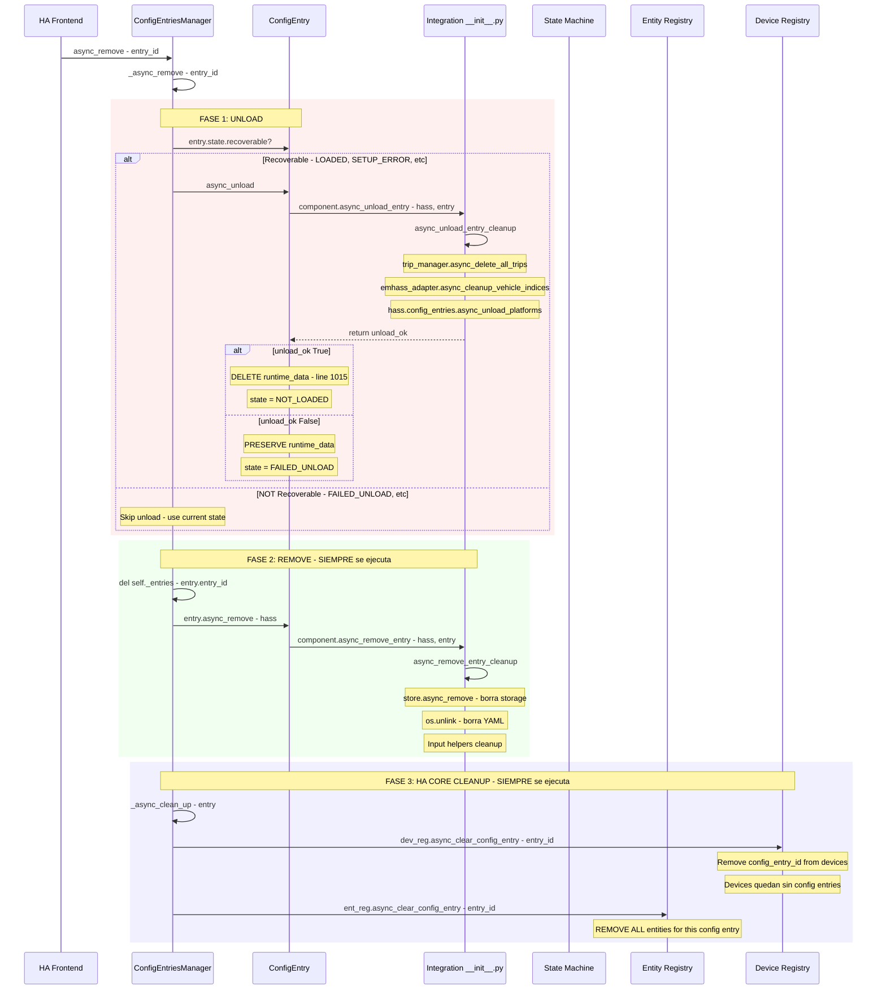
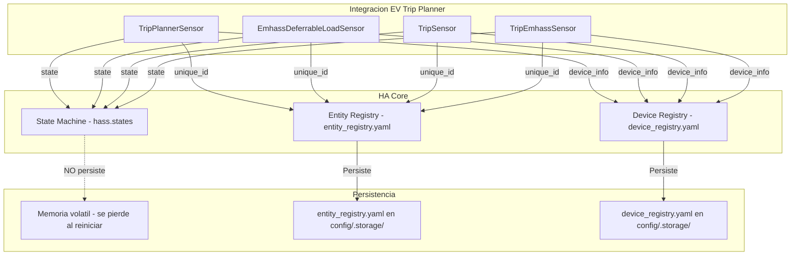
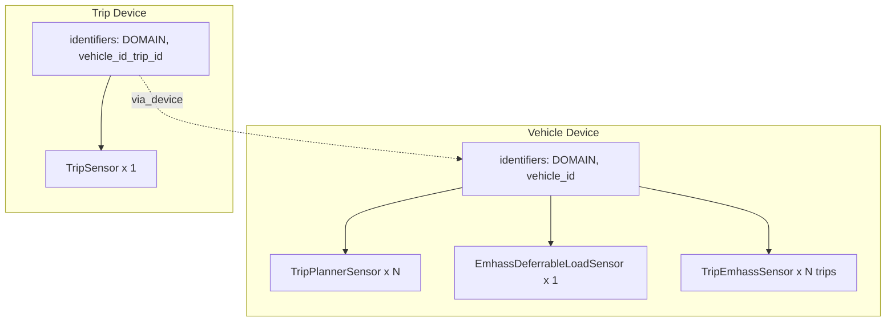
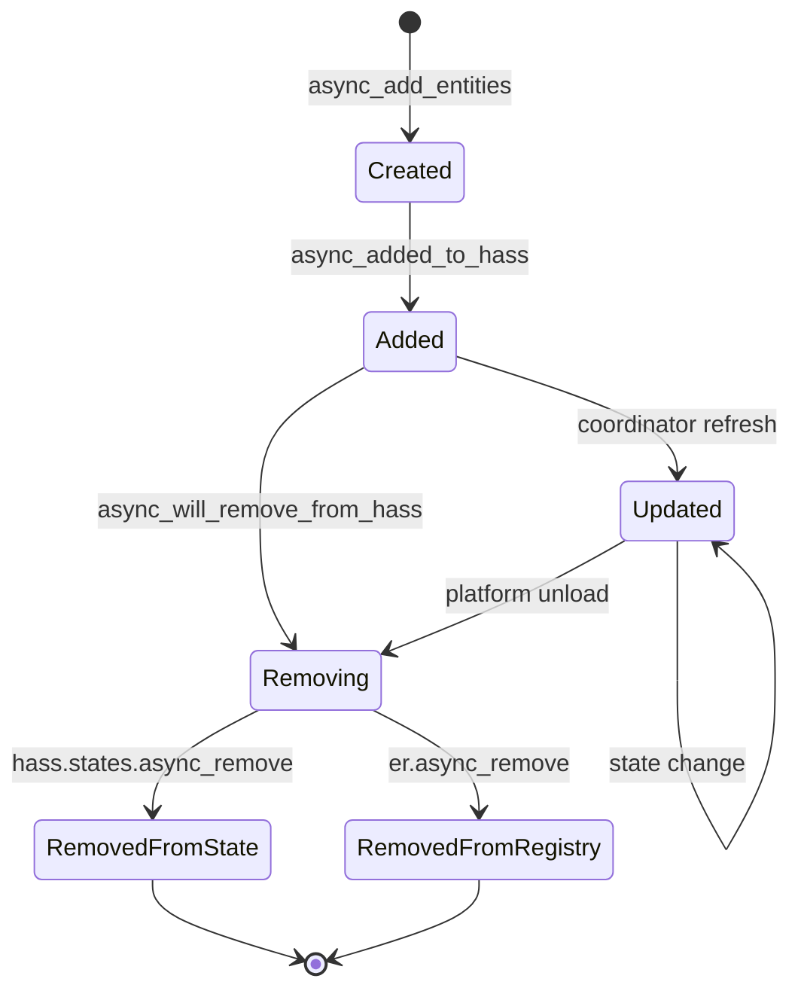
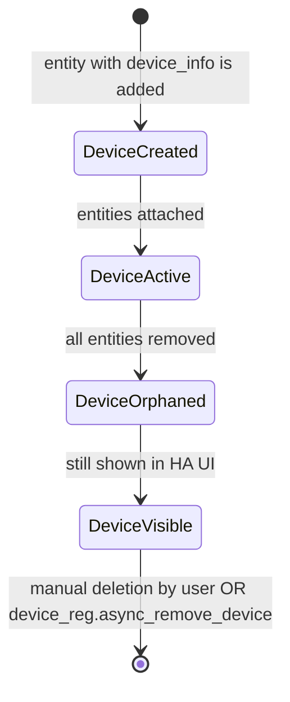
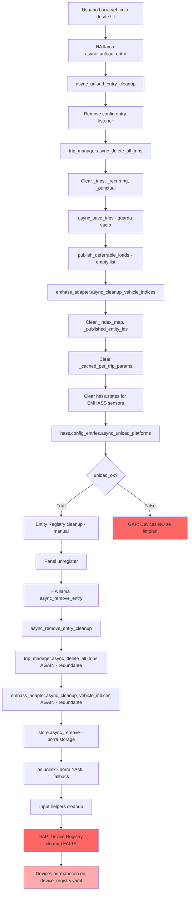
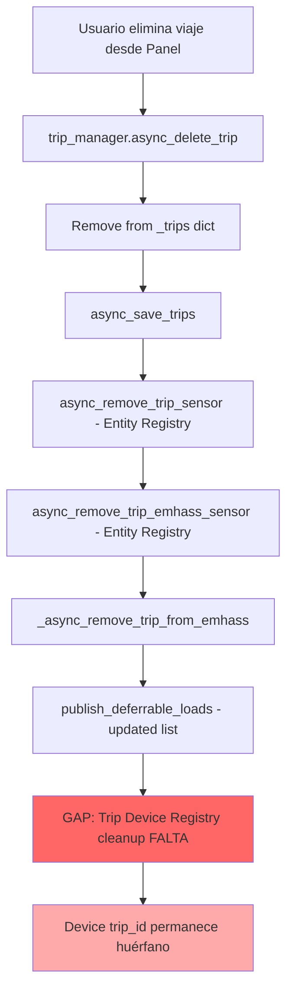

# Investigación Profunda: Eliminación de Devices y Sensores en Home Assistant

**Fecha**: 2026-04-19
**Tipo**: Investigación técnica profunda (verificada contra HA Core source)
**Alcance**: Ciclo de vida completo de Devices, Entities y State en HA Core durante eliminación de integración
**Motivación**: El research anterior (`technical-research-trip-deletion-flow.md`) cubrió el flujo de código de la integración pero NO cubrió cómo HA Core maneja internamente los 3 registros (State Machine, Entity Registry, Device Registry). Los tests E2E y unitarios necesitan este contexto para verificar cleanup correctamente.

**Fuente verificada**: `/mnt/bunker_data/ha-ev-trip-planner/ha-core-source/homeassistant/config_entries.py`

---

## 1. Resumen Ejecutivo

El research anterior identificó 3 causas raíz y 2 problemas arquitectónicos. **Este research profundiza con hallazgos verificados contra el código fuente de HA Core, corrigiendo 2 afirmaciones erróneas del research anterior:**

### ⚠️ CORRECCIONES CRÍTICAS al research anterior

| Afirmación anterior | Realidad (verificada en HA Core source) |
|---|---|
| "async_remove_entry NO se llama si async_unload_entry falla" | **FALSO**: `_async_remove` SIEMPRE llama `entry.async_remove()` y `_async_clean_up()`, incluso si unload falla |
| "HA NO elimina devices automáticamente" | **PARCIALMENTE FALSO**: HA llama `dev_reg.async_clear_config_entry()` que remueve la referencia del config_entry del device, pero NO elimina el device en sí |

### Hallazgos clave verificados

1. **HA Core SIEMPRE ejecuta cleanup completo** de Entity Registry y Device Registry, incluso cuando `async_unload_entry` falla
2. **`_async_clean_up`** (config_entries.py:2182) llama `dev_reg.async_clear_config_entry()` y `ent_reg.async_clear_config_entry()` — SIEMPRE se ejecuta
3. **`async_clear_config_entry` para devices** solo remueve el `config_entry_id` del device, NO elimina el device — el device queda "huérfano" sin config entries
4. **Cuando unload tiene éxito**: `runtime_data` se ELIMINA (config_entries.py:1014-1015), entonces `async_remove_entry_cleanup` ve `entry.runtime_data` como inexistente
5. **Cuando unload FALLA**: `runtime_data` se PRESERVA, entonces `async_remove_entry_cleanup` puede acceder a trip_manager y emhass_adapter

---

## 2. Flujo Exacto de HA Core — Verificado contra Source

### 2.1 Código Fuente Real de `ConfigEntriesManager.async_remove`

**Archivo**: `ha-core-source/homeassistant/config_entries.py`

```python
# Línea 2149 - Entry point: usuario hace clic en Delete
async def async_remove(self, entry_id: str) -> dict[str, Any]:
    """Remove, unload and clean up after an entry."""
    unload_success, entry = await self._async_remove(entry_id)
    self._async_clean_up(entry)  # ← SIEMPRE se ejecuta
    ...
    return {"require_restart": not unload_success}

# Línea 2163 - Unload + remove interno
async def _async_remove(self, entry_id: str) -> tuple[bool, ConfigEntry]:
    """Remove and unload an entry."""
    entry = self.async_get_known_entry(entry_id)
    async with entry.setup_lock:
        if not entry.state.recoverable:
            # Estados NO recuperables: FAILED_UNLOAD, MIGRATION_ERROR,
            # SETUP_IN_PROGRESS, UNLOAD_IN_PROGRESS
            unload_success = entry.state is not ConfigEntryState.FAILED_UNLOAD
        else:
            # Estados recuperables: LOADED, SETUP_ERROR, SETUP_RETRY, NOT_LOADED
            unload_success = await self.async_unload(entry_id, _lock=False)

        # ⚠️ CRÍTICO: Estas líneas SIEMPRE se ejecutan, falle o no el unload
        del self._entries[entry.entry_id]              # Remueve del storage
        await entry.async_remove(self.hass)             # Llama integration async_remove_entry

        self.async_update_issues()
        self._async_schedule_save()

    return (unload_success, entry)

# Línea 2182 - Cleanup SIEMPRE ejecutado
@callback
def _async_clean_up(self, entry: ConfigEntry) -> None:
    """Clean up after an entry."""
    entry_id = entry.entry_id
    dev_reg = dr.async_get(self.hass)
    ent_reg = er.async_get(self.hass)
    dev_reg.async_clear_config_entry(entry_id)   # ← Limpia Device Registry
    ent_reg.async_clear_config_entry(entry_id)   # ← Limpia Entity Registry
    ...
```

### 2.2 Código de `ConfigEntry.async_unload` — Qué pasa cuando falla

```python
# Línea 951
async def async_unload(self, hass, *, integration=None) -> bool:
    ...
    try:
        result = await component.async_unload_entry(hass, self)  # Llama a la integración

        if domain_is_integration:
            if result:  # ←Unload exitoso
                await self._async_process_on_unload(hass)
                if hasattr(self, "runtime_data"):
                    object.__delattr__(self, "runtime_data")  # ← ELIMINA runtime_data
                self._async_set_state(hass, ConfigEntryState.NOT_LOADED, None)
            else:  # ← Unload falló (retornó False)
                self._async_set_state(
                    hass, ConfigEntryState.FAILED_UNLOAD, "Unload failed"
                )
                # ⚠️ runtime_data NO se elimina — queda preservado

    except Exception as exc:
        # ← Excepción en async_unload_entry
        self._async_set_state(
            hass, ConfigEntryState.FAILED_UNLOAD, str(exc) or "Unknown error"
        )
        return False
    return result
```

### 2.3 Implicaciones para `async_remove_entry_cleanup`

| Escenario | `runtime_data` existe? | `trip_manager` accesible? | Storage cleanup funciona? |
|---|---|---|---|
| Unload exitoso | **NO** (eliminado en línea 1015) | **NO** | Sí (Store directo) |
| Unload falla (retorna False) | **SÍ** (preservado) | **SÍ** | Sí (Store directo) |
| Excepción en unload | **SÍ** (preservado) | **SÍ** | Sí (Store directo) |
| Setup nunca completado | **NO** (nunca se creó) | **NO** | Sí (Store directo) |

**Conclusión**: El código actual de [`async_remove_entry_cleanup`](custom_components/ev_trip_planner/services.py:1464) que usa `getattr(entry, "runtime_data", None)` es correcto y resiliente. El trip_manager puede ser None pero el storage cleanup (via Store directo) siempre funciona.

### 2.4 `async_clear_config_entry` para Device Registry — Qué hace exactamente

**Archivo**: `ha-core-source/homeassistant/helpers/device_registry.py:1599`

```python
@callback
def async_clear_config_entry(self, config_entry_id: str) -> None:
    """Clear config entry from registry entries."""
    now_time = time.time()
    for device in self.devices.get_devices_for_config_entry_id(config_entry_id):
        self._async_update_device(device.id, remove_config_entry_id=config_entry_id)
    for deleted_device in list(self.deleted_devices.values()):
        config_entries = deleted_device.config_entries
        if config_entry_id not in config_entries:
            continue
        if config_entries == {config_entry_id}:
            # Único config entry → marcar como huérfano con timestamp
            self.deleted_devices[deleted_device.id] = attr.evolve(
                deleted_device,
                orphaned_timestamp=now_time,
                config_entries=set(),
                config_entries_subentries={},
            )
        else:
            # Múltiples config entries → solo remover esta referencia
            config_entries = config_entries - {config_entry_id}
```

**Comportamiento**:
1. Para cada device vinculado al config_entry: remueve el `config_entry_id` de `device.config_entries`
2. Si el device ya estaba eliminado y era el único config entry: marca con `orphaned_timestamp`
3. **NO elimina el device** — el device permanece en `self.devices` pero sin config entries

### 2.5 `async_clear_config_entry` para Entity Registry — Qué hace exactamente

**Archivo**: `ha-core-source/homeassistant/helpers/entity_registry.py:2148`

```python
@callback
def async_clear_config_entry(self, config_entry_id: str) -> None:
    """Clear config entry from registry entries."""
    now_time = time.time()
    for entity_id in [
        entry.entity_id
        for entry in self.entities.get_entries_for_config_entry_id(config_entry_id)
    ]:
        self.async_remove(entity_id)  # ← ELIMINA completamente la entity
    for key, deleted_entity in list(self.deleted_entities.items()):
        if config_entry_id != deleted_entity.config_entry_id:
            continue
        self.deleted_entities[key] = attr.evolve(
            deleted_entity, orphaned_timestamp=now_time, config_entry_id=None
        )
```

**Comportamiento**:
1. **ELIMINA completamente** todas las entities vinculadas al config_entry
2. Marca entities previamente eliminadas con `orphaned_timestamp`

### 2.6 Diagrama de Secuencia Completo — Verificado contra HA Core



---

## 3. Los 3 Registros de Home Assistant

### 2.1 Arquitectura de Registros



### 2.2 State Machine (`hass.states`)

| Aspecto | Detalle |
|---------|---------|
| **Tipo** | En memoria, NO persiste entre reinicios |
| **Almacenamiento** | `hass._states_dict` (dict en memoria) |
| **Limpieza automática** | Sí — HA elimina states de entidades descargadas |
| **API de eliminación** | `hass.states.async_remove(entity_id)` |
| **Verificación** | `hass.states.get(entity_id)` retorna `None` |

**Comportamiento durante eliminación de integración**:
- Cuando `async_unload_platforms` se ejecuta, HA llama `async_will_remove_from_hass()` en cada entidad
- Luego HA elimina automáticamente el state de `hass.states`
- **NO es necesario** limpiar states manualmente para entidades registradas via `async_add_entities`

### 2.3 Entity Registry (`entity_registry.yaml`)

| Aspecto | Detalle |
|---------|---------|
| **Tipo** | Persistente, sobrevive reinicios |
| **Almacenamiento** | `.storage/entity_registry` (JSON en disco) |
| **Limpieza automática** | **PARCIAL** — HA limpia entities del config_entry cuando se elimina |
| **API de eliminación** | `entity_registry.async_remove(entity_id)` |
| **Verificación** | `er.async_entries_for_config_entry(registry, entry_id)` retorna lista |

**Comportamiento durante eliminación de integración**:
- ⚠️ **CORREGIDO**: HA Core **SIEMPRE** llama `ent_reg.async_clear_config_entry(entry_id)` en `_async_clean_up` (Sección 2.1)
- Esto elimina TODAS las entity entries para ese `config_entry_id`
- El cleanup manual en [`services.py:1436-1451`](custom_components/ev_trip_planner/services.py:1436) es redundante pero inofensivo (double-remove es seguro)

**Código actual de cleanup de Entity Registry** (redundante con HA Core):
```python
# services.py:1436 - async_unload_entry_cleanup
entity_registry = getattr(hass, "entity_registry", None)
if entity_registry is None:
    entity_registry = er.async_get(hass)
for entity_entry in er.async_entries_for_config_entry(registry, entry.entry_id):
    entity_registry.async_remove(entity_entry.entity_id)
```

### 3.4 Device Registry (`device_registry.yaml`) — **Cleanup Parcial por HA**

| Aspecto | Detalle |
|---------|---------|
| **Tipo** | Persistente, sobrevive reinicios |
| **Almacenamiento** | `.storage/device_registry` (JSON en disco) |
| **Limpieza automática por HA** | **PARCIAL** — `async_clear_config_entry` remueve la referencia al config_entry |
| **API de eliminación completa** | `device_registry.async_remove_device(device_id)` |
| **Verificación** | `dr.async_entries_for_config_entry(registry, entry_id)` |

**⚠️ COMPORTAMIENTO VERIFICADO contra HA Core source**:
- HA Core **SÍ llama** `dev_reg.async_clear_config_entry(entry_id)` en `_async_clean_up` (SIEMPRE)
- `async_clear_config_entry` remueve el `config_entry_id` de cada device vinculado
- **PERO NO elimina el device** — el device permanece en el registry sin config entries
- El device queda como "huérfano" — visible en Settings > Devices pero sin integración asociada
- **La integración DEBE llamar** `device_registry.async_remove_device(device_id)` si quiere eliminar completamente el device

---

## 3. Devices Creados por la Integración

### 3.1 Mapa de Devices por Tipo de Sensor



| Sensor Class | Device Identifiers | Device Name | Cantidad |
|---|---|---|---|
| [`TripPlannerSensor`](custom_components/ev_trip_planner/sensor.py:140) | `{DOMAIN, vehicle_id}` | `EV Trip Planner {vehicle_id}` | N (por definición) |
| [`EmhassDeferrableLoadSensor`](custom_components/ev_trip_planner/sensor.py:274) | `{DOMAIN, vehicle_id}` | `EV Trip Planner {vehicle_id}` | 1 |
| [`TripSensor`](custom_components/ev_trip_planner/sensor.py:372) | `{DOMAIN, vehicle_id_trip_id}` | `Trip {trip_id} - {vehicle_id}` | 1 por viaje |
| [`TripEmhassSensor`](custom_components/ev_trip_planner/sensor.py:893) | `{DOMAIN, vehicle_id}` | (sin nombre custom) | 1 por viaje |

### 3.2 Problema: Devices de Viaje Huérfanos

Cuando se elimina un viaje individual (no el vehículo completo):

1. [`async_remove_trip_sensor`](custom_components/ev_trip_planner/sensor.py:657) elimina la entity del Entity Registry
2. [`async_remove_trip_emhass_sensor`](custom_components/ev_trip_planner/sensor.py:696) elimina la entity EMHASS del Entity Registry
3. **PERO**: El device con `identifiers={(DOMAIN, f"{vehicle_id}_{trip_id}")}` **NO se elimina** del Device Registry

Esto significa que cada viaje eliminado deja un device huérfano en `device_registry.yaml`.

### 3.3 Problema: Device del Vehículo Huérfano

Cuando se elimina la integración completa:

1. `async_unload_entry_cleanup` elimina entities del Entity Registry
2. `async_remove_entry_cleanup` elimina storage
3. **PERO**: El device `{DOMAIN, vehicle_id}` **NO se elimina** del Device Registry
4. **Y**: Todos los devices `{DOMAIN, vehicle_id_trip_id}` **tampoco se eliminan**

---

## 4. Secuencia Exacta de HA Core al Eliminar una Integración

### 4.1 Flujo Completo — CORREGIDO contra HA Core Source

> ⚠️ **NOTA**: El diagrama de la sección 2.6 es la fuente de verdad verificada contra `ha-core-source/homeassistant/config_entries.py`. El diagrama anterior en esta sección tenía errores.

**Resumen correcto del flujo**:

1. **FASE 1: UNLOAD** — `async_unload_entry` se llama. Puede tener éxito o fallar.
2. **FASE 2: REMOVE** — `entry.async_remove(hass)` se llama **SIEMPRE**, independientemente del resultado de FASE 1. Esto ejecuta `async_remove_entry_cleanup` de la integración.
3. **FASE 3: HA CORE CLEANUP** — `_async_clean_up(entry)` se llama **SIEMPRE**. Esto ejecuta `dev_reg.async_clear_config_entry()` y `ent_reg.async_clear_config_entry()`.

**El flujo anterior que decía "async_remove_entry NO se llama si unload falla" era INCORRECTO.**

### 4.2 Código Fuente de HA Core — Verificado

Ver Sección 2.1 para el código fuente real verificado línea por línea.

**Correcciones respecto al research anterior**:
- ❌ "Si `async_unload_entry` retorna False, HA NO llama `async_remove_entry`" → **FALSO**
- ✅ `_async_remove` SIEMPRE ejecuta `del self._entries`, `entry.async_remove(hass)`, y luego `_async_clean_up`
- ❌ "HA NO elimina devices automáticamente" → **PARCIALMENTE FALSO**
- ✅ HA llama `dev_reg.async_clear_config_entry()` que remueve la referencia, pero NO elimina el device

---

## 5. Gaps Críticos Identificados — ACTUALIZADO

### GAP 1: Devices huérfanos permanecen después de eliminar integración — **SEVERIDAD MEDIA** (reducida)

**Estado**: HA Core remueve la referencia al config_entry del device via `async_clear_config_entry`. El device permanece en el registry pero sin vinculación a la integración.

**Impacto real**:
- Devices aparecen como "huérfanos" en Settings > Devices & Services
- No causan errores funcionales, pero sí confusión visual
- `device_registry.yaml` crece con devices sin config entries

**Severidad reducida porque**: HA Core SÍ hace cleanup parcial (remueve config_entry reference). El device no causa errores, solo ruido visual.

**Código para cleanup completo** (opcional, no crítico):
```python
from homeassistant.helpers import device_registry as dr

# En async_remove_entry_cleanup, después del storage cleanup:
device_reg = dr.async_get(hass)
for device_entry in list(device_reg.devices.values()):
    if entry.entry_id in device_entry.config_entries:
        device_reg.async_remove_device(device_entry.id)
```

### GAP 2: Trip devices no se limpian al eliminar un viaje individual — **SEVERIDAD MEDIA**

**Ubicación**: [`trip_manager.async_delete_trip`](custom_components/ev_trip_planner/trip_manager.py:690) llama a `async_remove_trip_sensor` y `async_remove_trip_emhass_sensor` pero NO limpia el device

**Impacto**: Cada viaje eliminado deja un device huérfano (sin config entry, sin entities)

**Código necesario**:
```python
# En async_delete_trip, después de async_remove_trip_sensor:
from homeassistant.helpers import device_registry as dr
device_reg = dr.async_get(hass)
device_id = device_reg.async_get_device(identifiers={(DOMAIN, f"{self.vehicle_id}_{trip_id}")})
if device_id:
    device_reg.async_remove_device(device_id.id)
```

### GAP 3: `async_cleanup_orphaned_emhass_sensors` es un stub — **SEVERIDAD MEDIA**

**Ubicación**: [`services.py:1175`](custom_components/ev_trip_planner/services.py:1175)

```python
async def async_cleanup_orphaned_emhass_sensors(hass: HomeAssistant) -> None:
    # ...
    for _entry in entries:
        pass  # Placeholder - actual cleanup logic would go here
```

Esta función se llama en cada [`async_setup_entry`](custom_components/ev_trip_planner/__init__.py:109) pero **no hace nada**. Es un placeholder vacío.

### GAP 4: Normalización inconsistente de vehicle_id en async_remove_entry_cleanup — **SEVERIDAD BAJA**

**Ya identificado en research anterior**. [`services.py:1484`](custom_components/ev_trip_planner/services.py:1484) usa `vehicle_name_raw.lower().replace(" ", "_")` en vez de `normalize_vehicle_id()`.

### GAP 5: Tests E2E solo verifican State Machine — **SEVERIDAD ALTA para tests**

**Ubicación**: [`integration-deletion-cleanup.spec.ts`](tests/e2e/integration-deletion-cleanup.spec.ts:1)

El test E2E verifica:
- ✅ `hass.states[eid].attributes` (State Machine)
- ❌ Entity Registry (no verifica que entities se eliminen)
- ❌ Device Registry (no verifica que devices se eliminen)
- ❌ Storage files (no verifica que archivos se borren)

---

## 6. Cómo HA Core Maneja Entity/Device Lifecycle

### 6.1 Entity Lifecycle



**Puntos clave**:
1. `async_will_remove_from_hass()` se llama ANTES de remover la entity — es el hook para cleanup
2. [`EmhassDeferrableLoadSensor.async_will_remove_from_hass`](custom_components/ev_trip_planner/sensor.py:290) llama `emhass_adapter.async_cleanup_vehicle_indices()` — esto es correcto
3. Pero `TripSensor` y `TripEmhassSensor` NO tienen `async_will_remove_from_hass` — no hacen cleanup al removerse

### 6.2 Device Lifecycle



**Puntos clave**:
1. Un device se crea AUTOMÁTICAMENTE cuando una entity con `device_info` se agrega via `async_add_entities`
2. Un device **NO se elimina automáticamente** cuando sus entities se remueven
3. El device queda en estado "orphaned" pero **sigue visible** en Settings > Devices & Services
4. Solo se elimina si:
   - El usuario lo elimina manualmente desde la UI
   - La integración llama `device_registry.async_remove_device(device_id)`
   - Otra integración lo reclama (raro)

### 6.3 Cómo Obtener el device_id para Cleanup

```python
from homeassistant.helpers import device_registry as dr

device_reg = dr.async_get(hass)

# Opción 1: Por config_entry_id (elimina TODOS los devices de la integración)
for device_entry in device_registry.devices.values():
    if entry.entry_id in device_entry.config_entries:
        device_reg.async_remove_device(device_entry.id)

# Opción 2: Por identifiers (elimina un device específico)
# Para vehicle device: identifiers = {(DOMAIN, vehicle_id)}
# Para trip device: identifiers = {(DOMAIN, f"{vehicle_id}_{trip_id}")}
```

**⚠️ IMPORTANTE**: `async_remove_device` requiere que NO queden entities vinculadas al device. Si quedan entities, la llamada falla silenciosamente o levanta excepción.

---

## 7. Flujo de Eliminación Completo (Corregido)

### 7.1 Eliminación de Integración (Vehicle Delete)



### 7.2 Eliminación de Viaje Individual (Trip Delete)



---

## 8. Verificación en Tests E2E — Perspectiva del Usuario

### 8.1 Principio: Verificar lo que el Usuario Ve

Un usuario normal verifica la eliminación de una integración a través de la UI de HA:

1. **El panel del vehículo ya no existe** — al navegar a la URL del panel, da error 404 o redirige
2. **Los sensores ya no aparecen en Developer Tools > States** — buscar el sensor y no encontrarlo
3. **El dispositivo ya no aparece en Settings > Devices** — la tarjeta del dispositivo desapareció
4. **La integración ya no aparece en Settings > Integrations** — la entrada fue removida
5. **El EMHASS sensor ya no muestra viajes** — `def_total_hours_array` está vacío o el sensor no existe

### 8.2 Verificación via hass.states (Frontend JavaScript)

El objeto `hass.states` es lo que el frontend de HA usa para mostrar todos los estados. Ya se usa en el test actual:

```typescript
// Verificar que un sensor ya no existe en hass.states
const sensorExists = await page.evaluate((entityId) => {
    const ha = document.querySelector('home-assistant') as any;
    return ha?.hass?.states?.[entityId] !== undefined;
}, 'sensor.emhass_perfil_diferible_test_vehicle');
expect(sensorExists).toBe(false);

// Verificar que NO hay ningún sensor de ev_trip_planner para este vehículo
const remainingSensors = await page.evaluate((vehicleId) => {
    const ha = document.querySelector('home-assistant') as any;
    if (!ha?.hass?.states) return [];
    return Object.keys(ha.hass.states).filter(
        id => id.includes(vehicleId) && id.includes('ev_trip_planner')
    );
}, 'test_vehicle');
expect(remainingSensors).toHaveLength(0);
```

### 8.3 Verificación via Navegación UI — Lo que el Usuario Realmente Ve

#### Verificar que la integración ya no existe
```typescript
// Navegar a la página de integraciones
await page.goto('/config/integrations/integration/ev_trip_planner');
await page.waitForLoadState('networkidle');

// Verificar que test_vehicle NO aparece en la lista
const entryVisible = await page.getByText('test_vehicle').isVisible().catch(() => false);
expect(entryVisible).toBe(false);
```

#### Verificar que los sensores no existen en Developer Tools
```typescript
// Navegar a Developer Tools > States
await page.goto('/developer-tools/state');
await page.waitForLoadState('networkidle');

// Buscar el sensor EMHASS — no debería aparecer
const filterInput = page.getByPlaceholder('Filter entities');
await filterInput.fill('emhass_perfil_diferible');
await page.waitForTimeout(500);

// Verificar que no hay resultados
const noResults = await page.getByText('No matching entities').isVisible().catch(() => false);
// O verificar que los sensores del vehículo no aparecen
const sensorRows = page.locator('tr').filter({ hasText: 'ev_trip_planner' });
await expect(sensorRows).toHaveCount(0);
```

#### Verificar que el device ya no aparece en Settings > Devices
```typescript
// Navegar a Settings > Devices & Services > Devices tab
await page.goto('/config/devices/dashboard');
await page.waitForLoadState('networkidle');

// Buscar el device del vehículo
const searchInput = page.getByPlaceholder('Search devices');
await searchInput.fill('EV Trip Planner');
await page.waitForTimeout(500);

// Verificar que no hay devices de ev_trip_planner
const deviceCards = page.locator('.device-card, ha-config-device-row').filter({ hasText: 'EV Trip Planner' });
await expect(deviceCards).toHaveCount(0);
```

### 8.4 Helper Propuesto: verifyCleanupComplete (UI Perspective)

```typescript
/**
 * Verifica cleanup completo desde la perspectiva del usuario.
 * NO usa REST API — solo navega la UI y verifica hass.states.
 */
async function verifyCleanupComplete(page: Page, vehicleId: string): Promise<void> {
    // 1. hass.states: no hay sensores del vehículo
    const remainingSensors = await page.evaluate((vid) => {
        const ha = document.querySelector('home-assistant') as any;
        if (!ha?.hass?.states) return [];
        return Object.keys(ha.hass.states).filter(
            id => id.includes(vid) && id.includes('ev_trip_planner')
        );
    }, vehicleId);
    expect(remainingSensors).toHaveLength(0);

    // 2. hass.states: no hay sensores EMHASS del vehículo
    const emhassSensors = await page.evaluate((vid) => {
        const ha = document.querySelector('home-assistant') as any;
        if (!ha?.hass?.states) return [];
        return Object.entries(ha.hass.states)
            .filter(([id]) => id.includes('emhass_perfil_diferible'))
            .filter(([, state]: [string, any]) => state?.attributes?.vehicle_id === vid);
    }, vehicleId);
    expect(emhassSensors).toHaveLength(0);

    // 3. Integración ya no aparece en Settings
    await page.goto('/config/integrations/integration/ev_trip_planner');
    await page.waitForLoadState('networkidle');
    const integrationExists = await page.getByText(vehicleId, { exact: false })
        .isVisible().catch(() => false);
    expect(integrationExists).toBe(false);

    // 4. Devices ya no aparecen en Settings > Devices
    await page.goto('/config/devices/dashboard');
    await page.waitForLoadState('networkidle');
    const deviceSearch = page.getByPlaceholder('Search devices');
    if (await deviceSearch.isVisible().catch(() => false)) {
        await deviceSearch.fill(`EV Trip Planner ${vehicleId}`);
        await page.waitForTimeout(500);
        const deviceRows = page.locator('ha-config-device-row').filter({ hasText: vehicleId });
        await expect(deviceRows).toHaveCount(0);
    }
}
```

### 8.5 Limitaciones del Enfoque UI

1. **`hass.states` no muestra Entity Registry** — solo muestra states actuales. Si una entity fue removida del registry pero su state persiste en memoria, `hass.states` aún lo muestra. Pero esto se resuelve con un reload de página.
2. **Devices huérfanos** — Si HA Core solo remueve la referencia al config_entry pero no elimina el device, el device puede seguir apareciendo en la UI de Devices. Esto es un gap de HA Core, no de la integración.
3. **Timing** — Después de eliminar una integración, puede tomar unos segundos para que HA procese el cleanup. Los tests deben incluir waits apropiados.

---

## 9. Tests Unitarios: Gaps y Mejoras

### 9.1 Tests que Faltan

| Test | Estado | Prioridad |
|------|--------|-----------|
| Device Registry cleanup en async_remove_entry_cleanup | **FALTA** | CRÍTICA |
| Device Registry cleanup en async_delete_trip | **FALTA** | ALTA |
| Trip device huérfano después de delete | **FALTA** | ALTA |
| Entity Registry cleanup cuando runtime_data es None | Parcial | MEDIA |
| async_cleanup_orphaned_emhass_sensors hace algo | **FALTA** (es stub) | MEDIA |
| Storage key mismatch entre normalize_vehicle_id y inline | **FALTA** | BAJA |

### 9.2 Mock Requerido para Device Registry Tests

```python
# En conftest.py - fixture para device_registry mock
@pytest.fixture
def mock_device_registry():
    """Mock device registry for testing device cleanup."""
    from homeassistant.helpers import device_registry as dr
    
    registry = MagicMock()
    registry.devices = {}
    
    # Simular device del vehículo
    vehicle_device = MagicMock()
    vehicle_device.id = "device_vehicle_123"
    vehicle_device.identifiers = {("ev_trip_planner", "test_vehicle")}
    vehicle_device.config_entries = {"test_entry_id"}
    registry.devices["device_vehicle_123"] = vehicle_device
    
    # Simular device de viaje
    trip_device = MagicMock()
    trip_device.id = "device_trip_456"
    trip_device.identifiers = {("ev_trip_planner", "test_vehicle_trip_001")}
    trip_device.config_entries = {"test_entry_id"}
    registry.devices["device_trip_456"] = trip_device
    
    return registry
```

---

## 10. Resumen de Acciones Requeridas

### Para el Dev (implementación):

1. **CRÍTICO**: Agregar Device Registry cleanup en [`async_remove_entry_cleanup`](custom_components/ev_trip_planner/services.py:1464)
2. **ALTO**: Agregar Device Registry cleanup en [`trip_manager.async_delete_trip`](custom_components/ev_trip_planner/trip_manager.py:690) para trips individuales
3. **ALTO**: Implementar [`async_cleanup_orphaned_emhass_sensors`](custom_components/ev_trip_planner/services.py:1175) (actualmente es stub)
4. **MEDIO**: Centralizar `vehicle_id` normalization en `async_remove_entry_cleanup`
5. **MEDIO**: Agregar `async_will_remove_from_hass` a `TripSensor` y `TripEmhassSensor`

### Para los Tests E2E:

1. **CRÍTICO**: Agregar verificación de Entity Registry cleanup (via REST API o WebSocket)
2. **ALTO**: Agregar verificación de Device Registry cleanup
3. **MEDIO**: Obtener long-lived access token para REST API calls
4. **MEDIO**: Crear helper `verifyCleanupComplete` que verifique los 3 registros

### Para los Tests Unitarios:

1. **CRÍTICO**: Test de Device Registry cleanup en `async_remove_entry_cleanup`
2. **ALTO**: Test de Device Registry cleanup en `async_delete_trip`
3. **MEDIO**: Test de `async_cleanup_orphaned_emhass_sensors` (cuando se implemente)

---

## 11. Referencia Rápida: APIs de HA Registry

### Entity Registry
```python
from homeassistant.helpers import entity_registry as er

registry = er.async_get(hass)

# Listar entities para un config entry
entries = er.async_entries_for_config_entry(registry, entry_id)

# Eliminar una entity
registry.async_remove(entity_id)  # NO es async!

# Buscar por unique_id
entry = registry.async_get_entity_id(domain, platform, unique_id)
```

### Device Registry
```python
from homeassistant.helpers import device_registry as dr

registry = dr.async_get(hass)

# Listar devices para un config entry
devices = [d for d in registry.devices.values() 
           if entry_id in d.config_entries]

# Eliminar un device (solo si no tiene entities)
registry.async_remove_device(device_id)

# Buscar por identifiers
device = registry.async_get_device(identifiers={(DOMAIN, vehicle_id)})
```

### State Machine
```python
# Eliminar state
hass.states.async_remove(entity_id)  # ES async

# Verificar state
state = hass.states.get(entity_id)

# Listar todos los entity IDs
entity_ids = hass.states.async_entity_ids()
```
