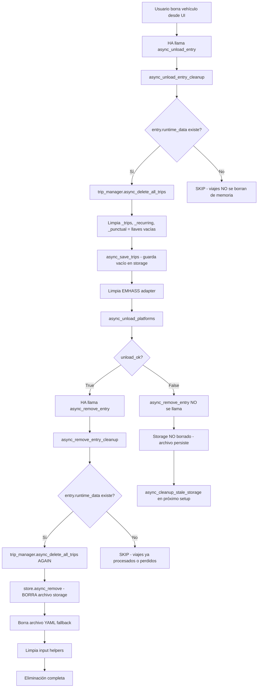

# Investigación: Por qué no se borran los viajes al borrar un vehículo

**Fecha**: 2026-04-18  
**Tipo**: Investigación técnica (sin cambios de código)  
**Alcance**: Flujo completo de eliminación de un vehículo → cleanup de viajes

---

## 1. Resumen Ejecutivo

Se ha trazado el flujo completo de eliminación de un vehículo en la integración EV Trip Planner. Se han identificado **3 causas raíz** potenciales y **2 problemas arquitectónicos** que explican por qué los viajes pueden no eliminarse correctamente al borrar un vehículo.

**Conclusión principal**: El flujo de eliminación tiene una **duplicación de responsabilidad** entre `async_unload_entry_cleanup` y `async_remove_entry_cleanup`, y existe un **gap crítico** cuando `async_remove_entry` no es llamado por HA.

---

## 2. Flujo de Eliminación - Diagrama



---

## 3. Análisis de las 3 Funciones Clave

### 3.1 `async_unload_entry` — [`__init__.py:155`](custom_components/ev_trip_planner/__init__.py:155)

```python
async def async_unload_entry(hass, entry):
    vehicle_id = normalize_vehicle_id(vehicle_name_raw)
    unload_ok = await async_unload_entry_cleanup(hass, entry, vehicle_id, vehicle_name)
    return unload_ok
```

- **USA** `normalize_vehicle_id()` ✅
- Delega todo a `async_unload_entry_cleanup`
- Retorna el resultado de `async_unload_platforms`

### 3.2 `async_unload_entry_cleanup` — [`services.py:1389`](custom_components/ev_trip_planner/services.py:1389)

**Responsabilidades**:
1. Obtiene `trip_manager` desde `entry.runtime_data`
2. Llama `trip_manager.async_delete_all_trips()` → guarda viajes vacíos
3. Limpia EMHASS adapter
4. Descarga plataformas via `async_unload_platforms`
5. Limpia entity registry
6. Desregistra panel

**NO hace**: Eliminar el archivo de storage

### 3.3 `async_remove_entry_cleanup` — [`services.py:1458`](custom_components/ev_trip_planner/services.py:1458)

**Responsabilidades**:
1. Obtiene `trip_manager` desde `entry.runtime_data` (de nuevo)
2. Llama `trip_manager.async_delete_all_trips()` otra vez (redundante)
3. Limpia EMHASS adapter (de nuevo)
4. **BORRA storage**: `store.async_remove()`
5. **BORRA YAML fallback**: `os.unlink(yaml_path)`
6. Limpia input helpers

**Problema**: Usa `vehicle_name_raw.lower().replace(" ", "_")` en vez de `normalize_vehicle_id()`

---

## 4. Causas Raíz Identificadas

### CAUSA 1: `async_remove_entry` puede no ser llamada por HA

**Severidad**: CRÍTICA  
**Probabilidad**: ALTA

En Home Assistant, `async_remove_entry` solo se llama DESPUÉS de que `async_unload_entry` retorna `True`. Si el unload falla:

```python
# services.py:1426
unload_ok = await hass.config_entries.async_unload_platforms(entry, PLATFORMS)
```

Si `async_unload_platforms` retorna `False`, entonces:
- `async_unload_entry` retorna `False`
- HA **NO llama** `async_remove_entry`
- `async_remove_entry_cleanup` **NUNCA se ejecuta**
- El archivo de storage **NO se borra**

**Evidencia**: El propio desarrollador anticipó este problema, como se ve en el comentario de [`async_cleanup_stale_storage`](custom_components/ev_trip_planner/services.py:1123):

> *"This handles the case where async_remove_entry wasnt called - e.g. due to HA bugs"*

### CAUSA 2: `entry.runtime_data` puede ser None

**Severidad**: ALTA  
**Probabilidad**: MEDIA

Ambas funciones de cleanup obtienen el `trip_manager` así:

```python
runtime_data = getattr(entry, "runtime_data", None)
trip_manager = getattr(runtime_data, "trip_manager", None) if runtime_data else None
```

Si `entry.runtime_data` es `None` (setup fallido, restore parcial, etc.):
- `trip_manager` es `None`
- `async_delete_all_trips()` **NO se llama**
- Los viajes **quedan en storage sin tocar**

Sin embargo, `async_remove_entry_cleanup` aún borra el archivo de storage directamente:

```python
store = ha_storage.Store(hass, version=1, key=storage_key)
await store.async_remove()
```

Esto debería funcionar independientemente de `trip_manager`. Pero si `async_remove_entry` no se llama (Causa 1), este código no se ejecuta.

### CAUSA 3: Inconsistencia en normalización de vehicle_id

**Severidad**: BAJA  
**Probabilidad**: BAJA (pero posible con caracteres especiales)

| Ubicación | Método | Código |
|---|---|---|
| [`async_setup_entry`](custom_components/ev_trip_planner/__init__.py:105) | `normalize_vehicle_id()` | ✅ Centralizado |
| [`async_unload_entry`](custom_components/ev_trip_planner/__init__.py:158) | `normalize_vehicle_id()` | ✅ Centralizado |
| [`async_remove_entry_cleanup`](custom_components/ev_trip_planner/services.py:1478) | Inline | ❌ `vehicle_name_raw.lower().replace(" ", "_")` |

Funcionalmente son equivalentes para strings ASCII simples. Pero si el nombre del vehículo contiene caracteres Unicode especiales, tabs, o múltiples espacios, podrían producirse resultados diferentes.

---

## 5. Problemas Arquitectónicos

### PROBLEMA A: Duplicación de responsabilidad

`async_unload_entry_cleanup` y `async_remove_entry_cleanup` **ambas** llaman a:
- `trip_manager.async_delete_all_trips()`
- `emhass_adapter.async_cleanup_vehicle_indices()`

Esto viola el principio de responsabilidad única. La primera función debería encargarse solo del unload (detener plataformas, desregistar panel), y la segunda del cleanup persistente (borrar storage, limpiar entities).

### PROBLEMA B: Storage deletion separada de TripManager

El borrado del archivo de storage se hace creando un NUEVO `ha_storage.Store` en `async_remove_entry_cleanup`, no a través del `YamlTripStorage` inyectado en `TripManager`. Esto significa:

1. `TripManager` guarda datos via `YamlTripStorage` → HA Store API
2. `async_remove_entry_cleanup` borra via un `Store` nuevo → mismo key
3. Si el key no coincide exactamente, el borrado falla silenciosamente

---

## 6. Safety Net: `async_cleanup_stale_storage`

La función [`async_cleanup_stale_storage`](custom_components/ev_trip_planner/services.py:1120) se llama en `async_setup_entry` ANTES de crear el TripManager:

```python
async def async_cleanup_stale_storage(hass, vehicle_id):
    cleanup_store = ha_storage.Store(hass, version=1, key=cleanup_key)
    existing_data = await cleanup_store.async_load()
    if existing_data:
        await cleanup_store.async_remove()
```

**Esto debería prevenir que los viajes sobrevivan** un ciclo de delete→re-add. Pero tiene un gap:

- Solo se ejecuta cuando el usuario **re-agrega** la integración
- Si el usuario solo borra y no re-agrega, el archivo persiste indefinidamente
- No limpia el YAML fallback

---

## 7. Flujo de Datos en `async_delete_all_trips`

[`trip_manager.py:706`](custom_components/ev_trip_planner/trip_manager.py:706):

```python
async def async_delete_all_trips(self):
    # 1. Remover cada viaje de EMHASS
    for trip_id in all_trip_ids:
        if self._emhass_adapter:
            await self._async_remove_trip_from_emhass(trip_id)

    # 2. Limpiar diccionarios en memoria
    self._trips = {}
    self._recurring_trips = {}
    self._punctual_trips = {}

    # 3. Guardar vacío en storage
    await self.async_save_trips()

    # 4. Publicar lista vacía a EMHASS
    if self._emhass_adapter:
        await self.publish_deferrable_loads([])
```

Este método **guarda viajes vacíos** en storage, pero **no borra el archivo**. El borrado del archivo solo ocurre en `async_remove_entry_cleanup`.

---

## 8. Escenarios de Fallo

| Escenario | async_unload_entry | async_remove_entry | Storage borrado? | Viajes sobreviven? |
|---|---|---|---|---|
| Delete normal desde UI | ✅ | ✅ | ✅ Sí | ❌ No |
| Delete con unload fallido | ✅ retorna False | ❌ No llamado | ❌ No | ⚠️ Vacío en storage pero archivo existe |
| Setup fallido + Delete | ✅ | ✅ | ✅ Sí (directo) | ❌ No |
| Container restart sin delete | ❌ | ❌ | ❌ No | ✅ Sí (datos persisten) |
| Re-add después de delete | ✅ setup | N/A | ✅ via stale_cleanup | ❌ No |

---

## 9. Conclusión

El motivo principal por el que los viajes no se borran es:

> **`async_remove_entry_cleanup` es la ÚNICA función que borra el archivo de storage, y solo se ejecuta si HA llama `async_remove_entry`, lo cual depende de que `async_unload_entry` retorne `True`.**

La safety net `async_cleanup_stale_storage` mitiga esto para el caso de re-add, pero no para el caso de solo-delete.

**Recomendaciones** (sin código, solo diseño):
1. Mover el borrado de storage a `async_unload_entry_cleanup` para que siempre se ejecute
2. Centralizar la normalización de vehicle_id en `async_remove_entry_cleanup` usando `normalize_vehicle_id()`
3. Considerar hacer el borrado de storage a través del `YamlTripStorage` inyectado en vez de crear un Store nuevo
4. Eliminar la llamada redundante a `async_delete_all_trips()` en `async_remove_entry_cleanup`
