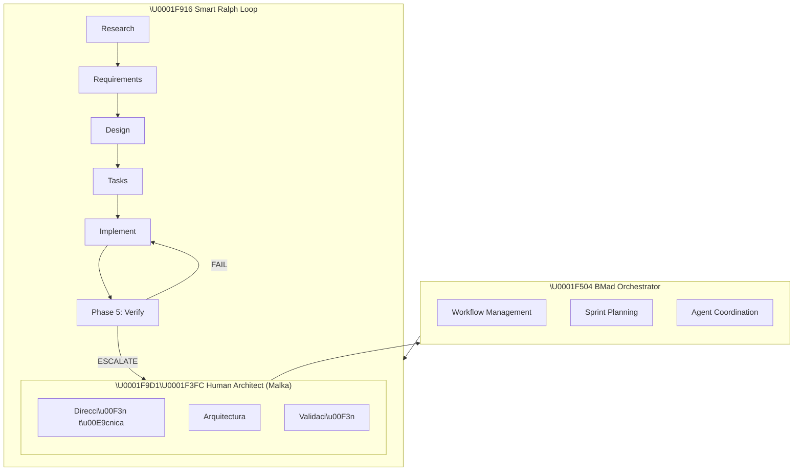
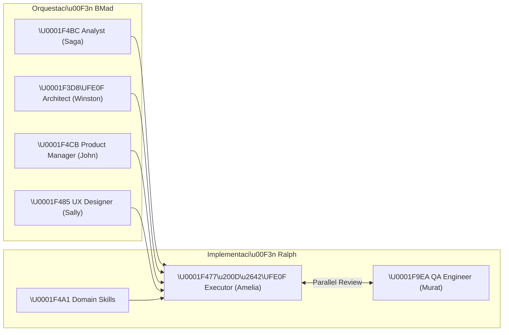
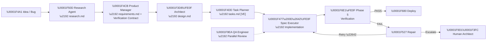

# AI Development Lab — Laboratorio de Desarrollo Asistido por IA

> **Fecha de creación:** 2026-04-23  
> **Autor:** Malka (@informatico-madrid)  
> **Tipo:** Documento experimental / Laboratorio de metodología  
> **Estado:** Activo

---

## Índice

- [Resumen Ejecutivo](#resumen-ejecutivo)
- [El Proyecto como Laboratorio](#el-proyecto-como-laboratorio)
- [Trayectoria Evolutiva](#trayectoria-evolutiva)
- [Arquitectura del Experimento](#arquitectura-del-experimento)
- [Metodología Actual: BMad + Smart Ralph](#metodología-actual-bmad--smart-ralph)
- [Hallazgos y Lecciones Aprendidas](#hallazgos-y-lecciones-aprendidas)
- [Gaps Heredados](#gaps-heredados)
- [Contribución al ecosistema IA](#contribución-al-ecosistema-ia)
- [Para Recruiters y Observadores Externos](#para-recruiters-y-observadores-externos)

---

## Resumen Ejecutivo

**ha-ev-trip-planner** es un **doble experimento**:

1. **Utilidad real:** Un componente de Home Assistant funcional para planificación de viajes en vehículos eléctricos con optimización energética EMHASS.
2. **Laboratorio de IA:** Un entorno controlado para investigar, validar y documentar la evolución de las metodologías de desarrollo asistido por inteligencia artificial.

**Perfil del director técnico:** Arquitecto senior especializado en PHP y arquitecturas limpias, NO experto en Python. **El 100% del código fue generado mediante especificaciones arquitectónicas ejecutadas por agentes IA especializados.** La dirección técnica —decisiones de arquitectura, patrones de diseño, validación de calidad— es trabajo humano. La escritura de código es trabajo de agentes IA siguiendo especificaciones estructuradas.

Este documento existe para:
- Documentar la trayectoria metodológica completa
- Ser transparente sobre la naturaleza del experimento
- Servir como caso de estudio para la comunidad de desarrollo asistido por IA
- Demostrar capacidades de arquitectura y dirección técnica sin escribir código

---

## El Proyecto como Laboratorio

### Doble Naturaleza

| Dimensión | Descripción | Estado |
|-----------|-------------|--------|
| **Producción** | Plugin funcional instalado en Home Assistant real | ✅ Activo |
| **Laboratorio** | Entorno de pruebas para metodologías de desarrollo IA | ✅ Activo |

### Principios del Laboratorio

1. **Transparencia radical:** Todo el proceso es documentado. Cada decisión, cada fallo, cada hallazgo queda registrado.
2. **Reproducibilidad:** Las specs y artifacts permiten que cualquier persona pueda replicar el flujo.
3. **Evolución documentada:** Cada metodología probada dejó artifacts que muestran su evolución.
4. **Calidad real:** El hecho de que sea un experimento no compromete la calidad del resultado.

### Lo que esto NO es

- ❌ NO es un proyecto de investigación académica
- ❌ NO es un producto comercial en producción masiva
- ❌ NO es código escrito por un experto en Python
- ❌ NO es un intento de vender algo

### Lo que SÍ es

- ✅ Un plugin funcional que resuelve un problema real
- ✅ Un laboratorio de metodologías de desarrollo IA
- ✅ Un caso de estudio documentado de desarrollo 100% asistido por IA
- ✅ Una demostración de arquitectura técnica sin escritura manual de código

---

## Trayectoria Evolutiva

El proyecto ha evolucionado a través de **6 fases metodológicas**, cada una dejando artifacts y aprendizajes.

### Fase 1: Vive Coding Puro (2024-Q1)

**Descripción:** Desarrollo iterativo con Claude Code, sin especificaciones estructuradas. Código generado por prompts conversacionales sin contratos ni verificación.

**Características:**
- Prompts conversacionales sin estructura
- Sin specs formales
- Sin verificación automatizada
- Sin contratos de API
- Cobertura de tests mínima

**Artifacts restantes:**
- Prefijos numéricos en specs (`001-`, `007-`, `008-`, `009-`, `010-`, `011-`, `012-`, `013-`, `017-`, `020-`)
- Docs en `doc/gaps/gaps.md` con problemas heredados

**Lecciones aprendidas:**
- Sin specs, la deuda técnica crece exponencialmente
- Los gaps detectados en esta fase persisten hasta hoy
- Sin verificación, los bugs se propagan silenciosamente
- La falta de estructura hace imposible la reproducibilidad

**Gaps heredados:** Ver sección [Gaps Heredados](#gaps-heredados)

---

### Fase 2: Ingeniería de Prompts (2024-Q2)

**Descripción:** Introducción de prompts estructurados y plantillas. Mejora en la calidad del código generado pero sin metodología formal.

**Características:**
- Prompts con estructura definida
- Plantillas de documentación
- Primeros intentos de testing automatizado
- Mejora en consistencia del código

**Artifacts:**
- Primeros `requirements.md` y `design.md`
- Templates de documentación

**Lecciones aprendidas:**
- Los prompts estructurados mejoran la calidad pero no resuelven problemas de arquitectura
- Se necesita un framework que orqueste el flujo completo
- El testing mejora pero sigue siendo reactivo

---

### Fase 3: Modelos Especializados con Fine-Tuning (2024-Q3)

**Descripción:** Experimentación con modelos fine-tuned para tareas específicas de desarrollo. Integración de skills de dominio.

**Características:**
- Skills específicas cargadas según fase (`homeassistant-skill`, `python-testing-patterns`, etc.)
- Modelos adaptados al dominio Home Assistant
- Contexto específico por tarea

**Artifacts:**
- `.agents/skills/` con 12+ skills de dominio
- Configuración de skills en `CLAUDE.md`

**Lecciones aprendidas:**
- El contexto específico del dominio mejora significativamente la calidad
- Las skills de dominio son un multiplicador de fuerza
- Pero la orquestación sigue siendo el problema principal

---

### Fase 4: Spec-Driven Development con Speckit (2024-Q4)

**Descripción:** Adopción de la metodología spec-kit de GitHub con `ralph-speckit`. Primer intento serio de desarrollo guiado por especificaciones.

**Características:**
- Specs con estructura formal (spec.md, plan.md, tasks.md)
- Naming basado en prefijos numéricos
- Flujos de gobernanza basados en constitución
- Separación clara entre requirements, design y tasks

**Artifacts:**
- Specs con prefijo numérico (`001-milestone-3-2-complete/`, `007-complete-milestone-3-verify-1-2/`, etc.)
- `docs/SPECKIT_SDD_FLOW_INTEGRATION_MAP.md`
- Checklists por spec

**Lecciones aprendidas:**
- Las specs mejoran drásticamente la trazabilidad
- El naming numérico es difícil de navegar y buscar
- La gobernanza basada en constitución es poderosa pero compleja
- Se necesita un flujo más ágil para iteraciones rápidas

---

### Fase 5: Smart Ralph Fork (2025-Q1 a 2026-Q1)

**Descripción:** Migración a `informatico-madrid/smart-ralph`, un fork de `tzachbon/smart-ralph` que añade **Phase 5: Agentic Verification Loop**.

**Características:**
- Naming descriptivo libre (sin prefijos numéricos)
- Epics via triage
- **Phase 5: Agentic Verification Loop** (contribución única del fork)
- Revisor en tiempo real (`qa-engineer` en paralelo al `spec-executor`)
- Señales estructuradas: `VERIFICATION_PASS`, `VERIFICATION_FAIL`, `ESCALATE`
- Loop de reparación automática con reintento y escalado humano

**Artifacts:**
- `docs/RALPH_METHODOLOGY.md` — Documentación completa de la metodología
- Specs descriptivos (`e2e-ux-tests-fix/`, `fix-sequential-trip-charging/`, etc.)
- `docs/project-scan-report.json` — Reportes de escaneo automático
- `doc/gaps/gaps.md` — Análisis de problemas con hipótesis verificables

**Contribución única del fork:**

| Fase | Upstream | Fork |
|------|----------|------|
| Phase 1: Make It Work | ✅ | ✅ |
| Phase 2: Refactoring | ✅ | ✅ |
| Phase 3: Testing | ✅ | ✅ |
| Phase 4: Quality Gates | ✅ | ✅ |
| **Phase 5: Verification** | ❌ | ✅ |

**Lecciones aprendidas:**
- La verificación agéntica en tiempo real previene errores antes de que se propaguen
- El revisor en paralelo detecta violaciones SOLID durante la implementación
- Las señales estructuradas permiten loops de reparación automatizados
- El fork tiene divergencias sustanciales respecto al upstream
- PR en draft para contribuir de vuelta al upstream

---

### Fase 6: Integración BMad (2026-Q1 — Actual)

**Descripción:** Integración con BMad Method para orquestación avanzada de múltiples agentes especializados.

**Características:**
- Workflow de 3 fases: Analysis → Planning → Solutioning → Implementation
- Agentes especializados por dominio (`/analyst`, `/architect`, `/pm`, `/dev`, `/ux-designer`, `/qa`)
- Generación automática de PRDs, epics, stories
- Sprint planning y tracking
- Validación cruzada entre agentes

**Artifacts:**
- `_bmad/` — Configuración de BMad
- `bmalph/` — Integración BMad + Smart Ralph
- `specs/` — Specs generados por BMad
- `plans/` — Planes de implementación

**Lecciones aprendidas:**
- La orquestación multi-agente requiere balance entre automatización y control humano
- BMad proporciona estructura pero añade complejidad operativa
- La combinación BMad + Smart Ralph es poderosa pero requiere tuning

---

### Los 3 Arcos Evolutivos

En lugar de ver las 6 fases como independientes, se agrupan en **3 arcos narrativos** que cuentan la historia del aprendizaje:

| Arco | Fases Incluidas | Narrativa | Resultado |
|------|-----------------|-----------|-----------|
| **Exploración** | 1-2 (Vive Coding, Prompts) | "Sin especificaciones, la deuda crece exponencialmente" | 5 gaps heredados, código funcional pero frágil |
| **Sistematización** | 3-5 (Fine-tuning, Speckit, Ralph) | "Las especificaciones estructuradas + verificación en paralelo elevan la calidad" | Phase 5 Verification Loop, 99.7% coverage |
| **Orquestación** | 6 (BMad + Ralph) | "Multi-agente con verificación agéntica es el futuro" | 23 skills, 29 specs, workflow automatizado |

**Insight clave:** Cada arco resolvió los problemas del anterior pero introdujo nuevos desafíos. La deuda técnica del Arco 1 solo pudo ser gestionada después de alcanzar el Arco 3.

---

## Arquitectura del Experimento

### Stack Tecnológico

| Capa | Tecnología | Versión | Propósito |
|------|-----------|---------|-----------|
| **Backend** | Python | 3.11+ / 3.14 | Lógica principal del componente HA |
| **Frontend** | Lit | 2.8.x | Web Components para panel nativo |
| **Testing Unit** | pytest + Jest | Latest | Tests unitarios Python y JS |
| **Testing E2E** | Playwright | 1.58+ | Tests end-to-end |
| **Linting** | ruff + pylint + mypy | Latest | Calidad de código Python |
| **Container** | Docker | docker-compose | Entorno HA de testing |

### Arquitectura de Desarrollo



**Arquitectura de agentes especializados:**



### Pipeline de Desarrollo



---

## Metodología Actual: BMad + Smart Ralph

### Integración Dual

El proyecto actual usa una combinación de:

1. **BMad Method** para orquestación de alto nivel:
   - Generación de PRDs y epics
   - Sprint planning y tracking
   - Validación de requisitos
   - Gestión de múltiples agentes especializados

2. **Smart Ralph Fork** para implementación:
   - Loop spec-driven (Research → Requirements → Design → Tasks → Implement)
   - Phase 5: Agentic Verification Loop
   - Revisor en tiempo real
   - Señales estructuradas de verificación

### Skills de Dominio

12+ skills de dominio se cargan según la fase:

| Skill | Fase | Propósito |
|-------|------|-----------|
| `homeassistant-skill` | Todos | Core HA — entities, states, services |
| `homeassistant-best-practices` | Design | Patrones recomendados HA |
| `homeassistant-config` | Implementation | Configuración YAML / config entries |
| `homeassistant-ops` | Research | Operaciones HA: logs, debugging |
| `homeassistant-dashboard-designer` | Design | Lovelace / dashboards |
| `e2e-testing-patterns` | Testing | Patrones E2E genéricos |
| `playwright-best-practices` | Verification | Playwright selectors, assertions |
| `python-testing-patterns` | Testing | pytest, mocks, fixtures |
| `python-performance-optimization` | Refactoring | Optimización Python |
| `python-security-scanner` | Quality Gates | Análisis de seguridad estático |
| `python-cybersecurity-tool-development` | Quality Gates | Herramientas de seguridad |
| `github-actions-docs` | CI/CD | Workflows de CI/CD |

---

## Hallazgos y Lecciones Aprendidas

### Por Fase Metodológica

| Fase | Calidad del Código | Cobertura de Tests | Trazabilidad | Reproducibilidad | Deuda Técnica |
|------|-------------------|-------------------|--------------|------------------|---------------|
| Vive Coding | Media-Baja | Baja | Nula | Nula | Alta |
| Prompts | Media | Media | Baja | Baja | Media-Alta |
| Fine-Tuning | Media | Media | Media | Media | Media |
| Speckit | Alta | Alta | Alta | Alta | Media |
| Smart Ralph | Alta | Alta | Muy Alta | Muy Alta | Baja |
| BMad + Ralph | Muy Alta | Muy Alta | Muy Alta | Muy Alta | Baja |

### Hallazgos Transversales

1. **La especificación es todo:** Sin specs estructuradas, la calidad del código generado depende de la calidad del prompt. Con specs, la calidad es consistentemente alta.

2. **La verificación en paralelo es un multiplicador de fuerza:** El QA Engineer operando en paralelo al Executor detecta errores antes de que se propaguen.

3. **El contexto de dominio es crítico:** Las skills específicas del dominio (Home Assistant, Python testing, Playwright) mejoran drásticamente la calidad del código generado.

4. **La arquitectura limpia importa:** Aunque el código sea generado por IA, las decisiones arquitectónicas (patrones, SOLID, protocolos) son decisiones humanas que impactan la calidad a largo plazo.

5. **Los gaps heredados son inevitables:** Cada cambio metodológico deja deuda técnica que debe ser corregida explícitamente.

---

## Gaps Heredados

Los siguientes problemas fueron introducidos durante la fase de Vive Coding y persisten hasta hoy:

### Gap #1: Panel del Sidebar No Se Elimina

**Problema:** Al eliminar un vehículo (config entry), el panel correspondiente en el sidebar de Home Assistant no se elimina hasta reiniciar HA.

**Causa raíz probable:** Falta de llamada a `async_unregister_panel` en `async_remove_entry_cleanup`.

**Estado:** Hipótesis documentada en [`doc/gaps/gaps.md`](../doc/gaps/gaps.md), pendiente de verificación.

**Líneas afectadas:** `services.py:1451-1533`, `panel.py:109-145`

---

### Gap #2: Sección Vehicle Status Vacía

**Problema:** La sección "Vehicle Status" en el panel muestra datos vacíos porque `_getVehicleStates()` solo busca sensores con prefijo `sensor.{vehicle_id}_*`, pero los sensores reales de vehículos (Tesla, VW, etc.) usan sus propios prefijos.

**Causa raíz probable:** `_getVehicleStates()` filtra por patrones de entity_id que no coinciden con sensores de integraciones de vehículos reales.

**Estado:** Hipótesis documentada en [`doc/gaps/gaps.md`](../doc/gaps/gaps.md), pendiente de verificación.

**Líneas afectadas:** `frontend/panel.js:1018-1028`

---

### Gap #3: Options Flow Incompleto

**Problema:** El options flow tiene solo 1 paso simplificado vs. 5 pasos completos del config flow.

**Causa raíz probable:** El options flow fue implementado como una versión simplificada intencionalmente, pero falta un método `async_step_reconfigure` para reconfiguración avanzada.

**Estado:** Hipótesis documentada en [`doc/gaps/gaps.md`](../doc/gaps/gaps.md), pendiente de verificación.

**Líneas afectadas:** `config_flow.py:894-951`

---

### Gap #4: Power Profile No Se Propaga

**Problema:** Los cambios de potencia configurados no se propagan correctamente al power profile.

**Causa raíz probable:** El listener de config entry usa `entry.data` en lugar de `entry.options` (o viceversa).

**Estado:** Hipótesis documentada en [`doc/gaps/gaps.md`](../doc/gaps/gaps.md), pendiente de verificación.

**Líneas afectadas:** `services.py:1359`

---

### Gap #5: Dashboard con Gradiente Hardcodeado

**Problema:** El dashboard usa gradientes hardcodeados que ignoran las CSS variables de Home Assistant, causando inconsistencias de tema.

**Causa raíz probable:** Implementación inicial sin design system sistemático.

**Estado:** Hipótesis documentada en [`doc/gaps/gaps.md`](../doc/gaps/gaps.md), pendiente de verificación.

**Líneas afectadas:** `frontend/panel.js` (gradientes)

---

### Matriz de Prioridades de Gaps

| Gap | Impacto | Esfuerzo de Fix | Prioridad |
|-----|---------|-----------------|-----------|
| Panel no se elimina | Medio | Bajo | Alta |
| Vehicle Status vacío | Alto | Medio | Alta |
| Options flow incompleto | Medio | Medio | Media |
| Power profile no propaga | Alto | Bajo | Alta |
| Dashboard gradientes | Bajo | Bajo | Baja |

---

## Contribución al Ecosistema IA

### Fork de Smart Ralph

El fork [`informatico-madrid/smart-ralph`](https://github.com/informatico-madrid/smart-ralph) añade **Phase 5: Agentic Verification Loop** que no existe en el upstream.

**Contribuciones únicas:**

1. **VE Tasks:** Tareas de verificación generadas automáticamente por `task-planner`
2. **Verification Contract:** Bloque estructurado en `requirements.md` con entry points, señales observables, invariantes y seed data
3. **Señales Estructuradas:** `VERIFICATION_PASS`, `VERIFICATION_FAIL`, `VERIFICATION_DEGRADED`, `ESCALATE`
4. **Loop de Reparación:** Clasificación automática de fallos con reintento y escalado humano
5. **Barrido de Regresión:** Basado en el Dependency map del Verification Contract

**Estado:** PR en draft para contribuir al upstream.

### Documentación Abierta

Todo el proceso de desarrollo está documentado públicamente:
- Specs completos en `specs/`
- Gaps y problemas en `doc/gaps/gaps.md`
- Metodología en `docs/RALPH_METHODOLOGY.md`
- Reportes de escaneo en `docs/project-scan-report.json`

### Artifacts Reutilizables

- 12+ skills de dominio en `.agents/skills/`
- Templates de specs reutilizables
- Checklists por tipo de spec
- Patrones de verificación E2E

---

### Ejemplo Real: Verification Contract

El siguiente ejemplo real proviene de [`specs/e2e-ux-tests-fix/tasks.md`](../specs/e2e-ux-tests-fix/tasks.md):

```markdown
### Reproduction

- [x] 0.1 [VERIFY] Reproduce: verify datetime naive/aware bug exists in trip_manager.py:1470-1502
  <!-- reviewer-diagnosis
    what: Task marked [x] but test PASSED instead of FAILING
    why: Test uses STRING input which goes through dt_util.parse_datetime (always aware).
    fix: Change test to use naive datetime OBJECT
  -->
```

Este bloque muestra **Phase 5 en acción**: el QA Engineer opera en paralelo al Executor, detectando que un test marcado como completado en realidad no estaba validando la condición correcta. La señal `reviewer-diagnosis` es una de las señales estructuradas que permiten el loop de reparación automática.

---

## Para Recruiters y Observadores Externos

### ¿Qué demuestra este proyecto?

1. **Arquitectura de Software sin Código:** Capacidad de diseñar y dirigir sistemas complejos sin escribir código manualmente. Todas las decisiones arquitectónicas (patrones, SOLID, DI, protocolos) son decisiones humanas.

2. **Gestión de Complejidad:** El proyecto maneja 17+ módulos Python (~12,000 LOC), 12+ web components, 70+ tests unitarios, 7 specs E2E.

3. **Evolución Metodológica Documentada:** 6 fases de evolución metodológica completamente documentadas y reproducibles.

4. **Contribución al Ecosistema:** Fork de Smart Ralph con Phase 5 que está siendo contribuido al upstream.

5. **Calidad de Producción:** Plugin funcional en Home Assistant con integración real a EMHASS y control de vehículos eléctricos.

### Métricas del Proyecto

| Métrica | Valor Verificado | Fecha |
|---------|-----------------|-------|
| Líneas de código Python | ~12,432 | 2026-04-23 |
| Módulos Python | **18** | 2026-04-23 |
| Components Lit | 12+ | 2026-04-23 |
| Tests Unitarios Python | **85** archivos | 2026-04-23 |
| Tests E2E Playwright | **8** specs | 2026-04-23 |
| Specs generados | **29** | 2026-04-23 |
| Skills de dominio | **23** (12 dominio + 11 framework) | 2026-04-23 |
| Documentación técnica | **23** docs | 2026-04-23 |
| Fases metodológicas probadas | 6 | 2026-04-23 |

### ¿Quién es Malka?

- **Arquitecto Senior** especializado en PHP y arquitecturas limpias
- **NO experto en Python** — todo el código fue generado por IA
- **CERO líneas de código escritas manualmente**
- Especializado en dirección técnica de agentes IA especializados
- Creador del fork `informatico-madrid/smart-ralph`
- Contribuidor al ecosistema de desarrollo asistido por IA

### ¿Por qué este proyecto importa?

Este proyecto demuestra que un arquitecto experimentado puede:

1. **Dirigir sistemas complejos** sin escribir código manualmente
2. **Mantener calidad de producción** usando especificaciones estructuradas
3. **Evolucionar metodologías** de desarrollo asistido por IA
4. **Contribuir al ecosistema** con herramientas y documentación abiertas
5. **Gestionar deuda técnica** heredada de diferentes metodologías

### Cómo usar este proyecto como caso de estudio

1. **Para entender la evolución metodológica:** Lee [`docs/RALPH_METHODOLOGY.md`](./RALPH_METHODOLOGY.md) y [`CLAUDE.md`](../CLAUDE.md)
2. **Para ver specs en acción:** Explora `specs/` — cada spec tiene research, requirements, design y tasks
3. **Para entender los gaps:** Lee [`doc/gaps/gaps.md`](../doc/gaps/gaps.md) — muestra el proceso de diagnosis y hipótesis
4. **Para reproducir el flujo:** Sigue los pasos en `_bmad/COMMANDS.md`

---

## Referencias

- [Smart Ralph Fork](https://github.com/informatico-madrid/smart-ralph)
- [Smart Ralph Upstream](https://github.com/tzachbon/smart-ralph)
- [Ralph Agentic Loop](https://ghuntley.com/ralph/)
- [BMad Method](https://github.com/bmad-code-method)
- [EMHASS](https://github.com/squimidi/gem-hass-energy-assistant)
- [Home Assistant Custom Component Docs](https://developers.home-assistant.io/docs/create_custom_component)

---

*Documento mantenido por [@informatico-madrid](https://github.com/informatico-madrid).*  
*Última revisión: 2026-04-23.*
