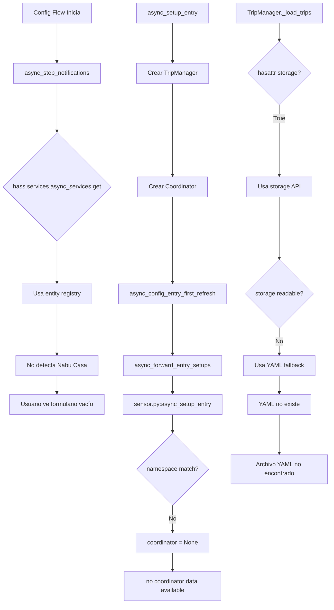

# Análisis Forense: Módulo ev_trip_planner

**Fecha:** 2026-03-20  
**Analista:** Roo (Arquitecto)  
**Instalación:** Home Assistant Container

---

## Resumen Ejecutivo

Se han identificado **4 problemas críticos** que causan los errores reportados en los logs:

1. **Problema de Notificaciones Nabu Casa** - No se detectan correctamente los servicios de notificación
2. **Storage API no disponible** - Error de verificación de permisos de almacenamiento
3. **Sensores sin datos del coordinator** - Problema de recuperación del namespace
4. **Archivo YAML no encontrado** - Fallback no funciona correctamente

---

## Problema 1: Notificaciones Nabu Casa No Detectadas

### Síntoma
```
Notification step: 5 notify services available
```
El log muestra 5 servicios disponibles, pero el usuario no ve su sensor de altavoz Nabu Casa.

### Análisis

**Ubicación:** [`config_flow.py:540-541`](custom_components/ev_trip_planner/config_flow.py:540)

```python
notify_services = self.hass.services.async_services().get("notify", {})
available_services = list(notify_services.keys())
```

**Causa Raíz:** El código usa `async_services()` que devuelve los servicios registrados, pero para entidades de notificación (como `notify.alexa_media_xxx` de Nabu Casa), la forma correcta de obtenerlas es a través del **entity registry**.

En Home Assistant, los servicios de notificación (Nabu Casa) se registran como entidades en el dominio `notify`, y se accede a ellas mediante el selector de entidades, no directamente por servicios.

### Solución Propuesta
Cambiar la detección para usar el **entity registry** en lugar de servicios:

```python
# Obtener entidades de notificación del registry
entity_registry = await self.hass.helpers.entity_registry.async_get_registry()
notify_entities = [
    entity.entity_id 
    for entity in entity_registry.entities.values()
    if entity.domain == "notify"
]
```

---

## Problema 2: Storage API No Disponible

### Síntomas
```
STORAGE PERMISSION DENIED: Storage API not available for vehicle chispitas
STORAGE API NOT AVAILABLE for chispitas, using YAML fallback
```

### Análisis

**Ubicación:** [`__init__.py:584-589`](custom_components/ev_trip_planner/__init__.py:584)

```python
# Check if hass.storage is available
if not hasattr(hass, "storage"):
    _LOGGER.error(
        "STORAGE PERMISSION DENIED: Storage API not available for vehicle %s",
        vehicle_id,
    )
    return False
```

**Causa Raíz:** El código verifica incorrectamente la disponibilidad del Storage API. En Home Assistant Container, `hass.storage` **SÍ existe**, pero el problema es que:

1. La verificación `hasattr(hass, "storage")` puede retornar True incluso si el componente storage no está inicializado correctamente
2. El código intenta usar `hass.storage.async_read("lovelace")` pero en Container el modo YAML de Lovelace está activo por defecto

### Solución Propuesta
Mejorar la verificación para detectar el modo de Lovelace:

```python
# Check if we're in storage mode (YAML mode = fallback needed)
try:
    # Try to get lovelace config
    lovelace_config = await hass.storage.async_read("lovelace")
    if lovelace_config:
        return True  # Storage mode is available
except:
    pass

# If we get here, we're in YAML mode
return False  # Use YAML fallback
```

---

## Problema 3: Sensores Sin Datos del Coordinator

### Síntomas
```
NextTripSensor(chispitas) no coordinator data available
NextDeadlineSensor(chispitas) no coordinator data available
```

### Análisis

**Ubicación:** [`sensor.py:551-554`](custom_components/ev_trip_planner/sensor.py:551)

```python
runtime_data = hass.data.get(DATA_RUNTIME, {})
namespace_data = runtime_data.get(namespace, {})
trip_manager = namespace_data.get("trip_manager")
coordinator = namespace_data.get("coordinator")
```

**Causa Raíz:** El namespace usado en `sensor.py` es:
- `sensor.py` usa: `namespace = f"ev_trip_planner_{entry_id}"` (línea 548)
- `__init__.py` usa: `namespace = f"{DOMAIN}_{entry.entry_id}"` (línea 967)

Como `DOMAIN = "ev_trip_planner"`, ambos deberían ser iguales, pero el problema es que `async_setup_entry` de los sensores se ejecuta **antes** de que los datos estén disponibles en `hass.data[DATA_RUNTIME]`.

El flujo es:
1. `__init__.py:async_setup_entry` crea el coordinator y lo guarda en `hass.data[DATA_RUNTIME]`
2. Luego llama a `async_forward_entry_setups(entry, PLATFORMS)` (línea 1018)
3. Esto dispara `sensor.py:async_setup_entry`
4. **PROBLEMA:** `async_forward_entry_setups` es async pero no espera a que los sensores se inicialicen completamente

### Solución Propuesta
Usar un patrón de espera o store reference antes de forward:

```python
# En __init__.py, asegurar que los datos estén disponibles antes de forward
# Opción 1: Usar el entry_id directamente como namespace key
namespace = entry.entry_id  # Más simple y directo

# Opción 2: Asegurar que el coordinator está disponible antes de forward
# ya está hecho correctamente con await coordinator.async_config_entry_first_refresh()
```

El problema real es que el coordinator existe pero `coordinator.data` está vacío porque `_async_update_data` requiere que `trip_manager` esté completamente configurado.

---

## Problema 4: Archivo YAML No Encontrado

### Síntomas
```
Archivo YAML no encontrado para chispitas, usando datos vacíos
Config entry no encontrada para chispitas
```

### Análisis

**Ubicación:** [`trip_manager.py:133`](custom_components/ev_trip_planner/trip_manager.py:133)

```python
yaml_file = Path(config_dir) / "ev_trip_planner" / f"{storage_key}.yaml"
```

**Causa Raíz:** El archivo YAML se busca en `/config/ev_trip_planner/ev_trip_planner_chispitas.yaml`, pero:

1. **El directorio no existe** - El código crea el directorio con `mkdir(parents=True, exist_ok=True)` pero esto solo ocurre cuando se **guarda**, no cuando se **carga**
2. **El vehículo es nuevo** - No hay viajes guardados aún, así que el archivo no existe (esto es esperado)

El warning "Config entry no encontrada para chispitas" viene de [`trip_manager.py:705`](custom_components/ev_trip_planner/trip_manager.py:705):

```python
entry = self.hass.config_entries.async_get_entry(vehicle_id)
```

**Causa:** Se usa `vehicle_id` (="chispitas") en lugar del `entry_id` real de la configuración.

### Solución Propuesta
```python
# En trip_manager.py, buscar la config entry correctamente
# El vehicle_id no es el entry_id, necesitamos buscar por vehicle_name
for config_entry in self.hass.config_entries.async_entries(DOMAIN):
    if config_entry.data.get("vehicle_name") == self.vehicle_id:
        entry = config_entry
        break
```

---

## Diagrama de Flujo de Errores



---

## Plan de Corrección

### Tarea 1: Arreglar Detección de Notificaciones
- [ ] Modificar [`config_flow.py`](custom_components/ev_trip_planner/config_flow.py) para usar entity registry
- [ ] Probar con Nabu Casa

### Tarea 2: Arreglar Verificación Storage API
- [ ] Mejorar [`__init__.py:_verify_storage_permissions`](custom_components/ev_trip_planner/__init__.py:566)
- [ ] Detectar correctamente modo YAML vs Storage de Lovelace

### Tarea 3: Arreglar Sensores Sin Datos
- [ ] Revisar namespace consistency entre `__init__.py` y `sensor.py`
- [ ] Asegurar que el coordinator tiene datos antes de crear sensores

### Tarea 4: Arreglar Búsqueda de Config Entry
- [ ] Corregir [`trip_manager.py:619`](custom_components/ev_trip_planner/trip_manager.py:619) para buscar por vehicle_name

---

## Recomendación

Se recomienda ejecutar las correcciones en el siguiente orden:
1. **Tarea 4** (más simple) - Arreglar búsqueda de config entry
2. **Tarea 2** - Storage API  
3. **Tarea 3** - Coordinator data
4. **Tarea 1** - Notificaciones (puede requerir configuración adicional del usuario)
