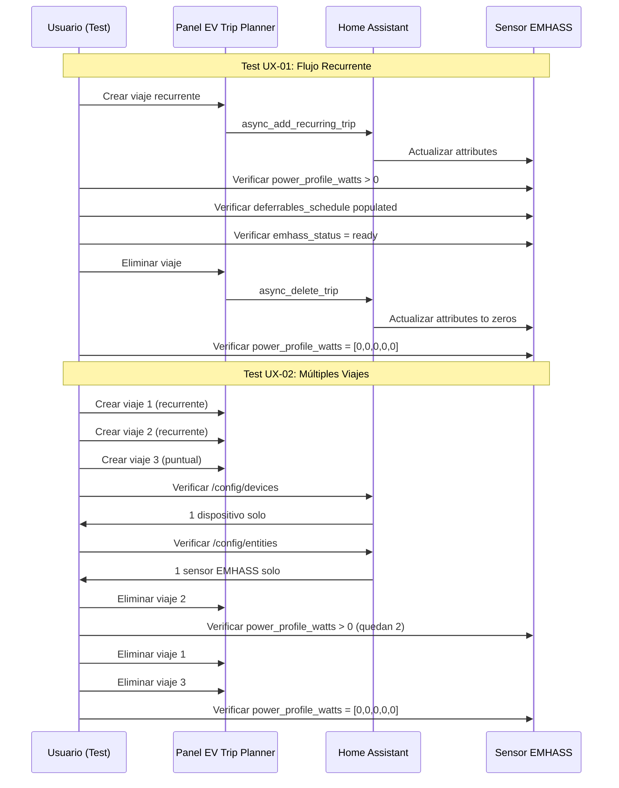

# Propuesta: Tests E2E UX para PR `fix-sensor-deletion-calculating-soc`

## Contexto

Los tests E2E existentes ya cubren:
- [`emhass-sensor-updates.spec.ts`](tests/e2e/emhass-sensor-updates.spec.ts): 6 tests de sensores EMHASS
  - Test #1: Trip crea y verifica attributes populated (Bug #2 fix)
  - Test #2: Attributes via UI (Bug #2 fix)
  - Test #3: Sensor entity via states page
  - Test #4: SOC change simulation
  - Test #5: Trip deletion → sensor attributes to zeros
  - Test #6: Single device in HA UI (no duplication)
- [`zzz-integration-deletion-cleanup.spec.ts`](tests/e2e/zzz-integration-deletion-cleanup.spec.ts): 1 test de cleanup
  - Test #1: Integration deletion → all trips cascade deleted
- [`delete-trip.spec.ts`](tests/e2e/delete-trip.spec.ts): 2 tests de eliminación
  - Test #1: Delete puntual trip
  - Test #2: Cancel deletion dialog

El orden actual con `zzz-` prefix asegura que cleanup sea el último.

---

## Tests Propuestos

### Test UX-01: "Flujo completo de creación-visualización-eliminación con verificación de sensor"

**Objetivo:** Verificar la experiencia de usuario completa al crear un viaje y confirmar que el sensor EMHASS refleja los cambios correctamente en tiempo real.

**Flujo:**
1. Navegar al panel EV Trip Planner
2. Crear un viaje recurrente (no solo puntual) para probar el caso más complejo
3. Verificar que el viaje aparece en la lista con todos sus datos
4. Esperar propagación al sensor EMHASS (polling hasta 15s)
5. Verificar que `power_profile_watts` tiene valores NO-CERO
6. Verificar que `deferrables_schedule` tiene datos
7. Verificar que `emhass_status` es "ready"
8. Eliminar el viaje
9. Verificar que el sensor se actualiza a todos ceros
10. Verificar que el viaje ya no aparece en la lista

**Diferencia con tests existentes:**
- Los tests actuales crean viajes PUNTUALES. Este prueba un viaje RECURRENTE que es el caso más complejo.
- Combina verificación UI + sensor en un solo test (los actuales están separados).
- Verifica `deferrables_schedule` que los tests actuales no validan explícitamente.

**Criterios de éxito:**
- [ ] Viaje recurrente aparece correctamente en UI
- [ ] Sensor tiene valores NO-CERO después de crear viaje
- [ ] Sensor tiene todos ceros después de eliminar
- [ ] `deferrables_schedule` tiene datos válidos
- [ ] `emhass_status` es "ready"

---

### Test UX-02: "Múltiples viajes con verificación de no-duplicación de dispositivos"

**Objetivo:** Verificar que al crear MÚLTIPLES viajes, no se duplican dispositivos ni sensores en HA.

**Flujo:**
1. Navegar al panel EV Trip Planner
2. Crear 3 viajes diferentes (2 recurrentes + 1 puntual)
3. Esperar propagación al sensor EMHASS
4. Verificar que TODOS los viajes aparecen en la lista
5. Navegar a `/config/devices` y verificar que solo existe 1 dispositivo "EV Trip Planner {vehicle_id}"
6. Navegar a `/config/entities` y verificar que solo existe 1 sensor EMHASS para este vehicle
7. Eliminar UN viaje individual (no todos)
8. Verificar que los otros 2 viajes siguen visibles
9. Verificar que el sensor sigue teniendo valores NO-CERO (porque quedan 2 viajes)
10. Eliminar los 2 viajes restantes
11. Verificar que el sensor tiene todos ceros

**Diferencia con tests existentes:**
- Los tests actuales crean máximo 1 viaje por test. Este prueba 3 viajes simultáneos.
- Verifica explícitamente que no hay duplicación de dispositivos Y sensores.
- Prueba la eliminación individual de un viaje y verifica que los demás persisten.
- Los tests actuales de eliminación borran TODOS los viajes de golpe.

**Criterios de éxito:**
- [ ] 3 viajes aparecen en UI
- [ ] Solo 1 dispositivo en `/config/devices`
- [ ] Solo 1 sensor EMHASS en `/config/entities`
- [ ] Eliminar 1 viaje no afecta los otros 2
- [ ] Sensor sigue con valores NO-CERO después de eliminar 1 de 3
- [ ] Sensor va a ceros solo cuando se eliminan TODOS

---

## Diagrama de Flujo

---

## Ubicación en la Suite Existente

Los nuevos tests se añadirían a [`tests/e2e/emhass-sensor-updates.spec.ts`](tests/e2e/emhass-sensor-updates.spec.ts) como:
- `test('should verify complete recurring trip lifecycle with sensor sync (UX-01)'...)`
- `test('should verify multiple trips with no device/sensor duplication (UX-02)'...)`

El archivo `zzz-integration-deletion-cleanup.spec.ts` sigue siendo el último por el prefix `zzz-`.

---

## Implementación

Ambos tests usan los helpers existentes:
- [`navigateToPanel()`](tests/e2e/trips-helpers.ts:23)
- [`createTestTrip()`](tests/e2e/trips-helpers.ts:129)
- [`cleanupTestTrips()`](tests/e2e/trips-helpers.ts:272)

No requieren cambios en el shell script de ejecución (`scripts/run-e2e.sh`).

---

## Notas para el Code Mode

Cuando se implementen estos tests:
1. Usar `page.waitForTimeout(3000)` después de crear cada viaje para propagación
2. Usar `page.evaluate()` para acceder a `hass.states` y verificar attributes
3. Usar `expect(async () => {...}).toPass({ timeout: 15000 })` para polling
4. Limpiar viajes al final con `cleanupTestTrips(page)` o eliminación manual
5. Usar `getFutureIso()` desde `zzz-integration-deletion-cleanup.spec.ts` para evitar problemas de datetime
