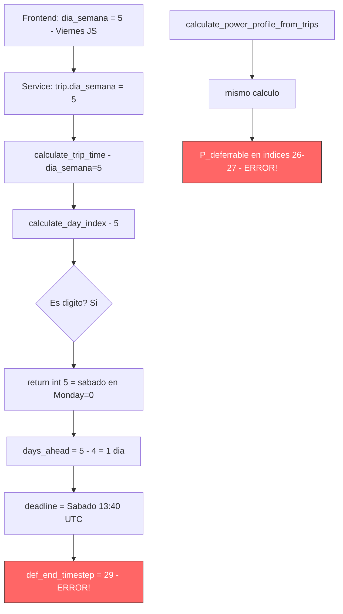
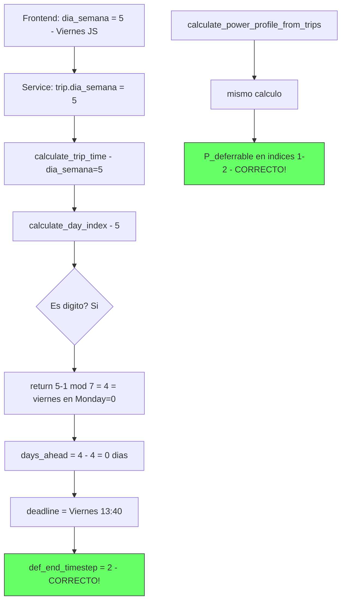

# Plan: Fix Recurring Trip Day Offset Bug (24h + timezone)

## Fecha: 2026-04-24
## Branch: feature/propagate-charge-deficit

---

## Síntoma

Un viaje recurrente de Viernes a las 13:40, creado cuando son las 11:15 del mismo Viernes,
debería programar la carga para las próximas ~2-3 horas. En su lugar:

- **Bug 1**: La carga se programa ~24 horas después (para el Sábado)
- **Bug 2**: Tras corregir Bug 1, la carga aún tiene un offset de ~2 horas (timezone)

## Datos del sensor del usuario (Viernes, trip Viernes)

```
def_start_timestep: [0]
def_end_timestep: [29]          ← ERROR: debería ser ~2
P_deferrable: [...0.0, 3300.0, 3300.0, 0.0...] en índices 26-27  ← ERROR: debería ser 1-2
```

## Datos del sensor del usuario (Viernes, trip Jueves)

```
def_start_timestep: [0]
def_end_timestep: [5]           ← ERROR: debería ser ~2
P_deferrable: [...0.0, 3300.0, 3300.0, 0.0...] en índices 2-3  ← ERROR: debería ser 1-2
```

---

## Root Cause Analysis

### Bug 1: Formato de día incorrecto en `calculate_day_index` (~24h offset)

**Cadena de fallo:**

1. El **frontend** almacena `dia_semana` como string numérico en formato **JavaScript getDay()**:
   - `panel.js` línea 1525-1531: `<option value="0">Domingo</option>` ... `<option value="5">Viernes</option>`
   - `panel.js` línea 1597: `serviceData.dia_semana = day;` → almacena `"5"` para Viernes

2. El **backend** interpreta el valor numérico con formato **Monday=0** en `calculate_day_index()`:
   - `calculations.py` línea 49-57: `DAYS_OF_WEEK = ("lunes", "martes", ..., "sabado", "domingo")` → índice Monday=0
   - `calculations.py` línea 72-75: `if day_lower.isdigit(): return int(day_lower)` → retorna 5

3. **Resultado**: `"5"` (Viernes en JS) → `calculate_day_index("5")` = 5 → **Sábado** en Monday=0 format

**Tabla de mapeo erróneo:**

| Frontend JS getDay | Significado | calculate_day_index | Interpreta como | Offset |
|---|---|---|---|---|
| 0 | Domingo | 0 | Lunes | +1 día |
| 1 | Lunes | 1 | Martes | +1 día |
| 2 | Martes | 2 | Miércoles | +1 día |
| 3 | Miércoles | 3 | Jueves | +1 día |
| 4 | Jueves | 4 | Viernes | +1 día |
| 5 | Viernes | 5 | **Sábado** | **+1 día** |
| 6 | Sábado | 6 | Domingo | +1 día (wrap) |

**Cada viaje recurrente está desplazado exactamente 1 día hacia adelante.**

**Archivos afectados:**
- `custom_components/ev_trip_planner/calculations.py` → `calculate_day_index()` línea 65
- `custom_components/ev_trip_planner/calculations.py` → `calculate_trip_time()` línea 98 (usa `calculate_day_index`)
- `custom_components/ev_trip_planner/calculations.py` → `calculate_next_recurring_datetime()` línea 822 (afectado indirectamente vía `_calculate_deadline_from_trip`)

### Bug 2: Timezone incorrecto en `calculate_trip_time` (~2h offset para UTC+2)

**Cadena de fallo:**

1. `calculate_trip_time()` línea 136-139:
   ```python
   return datetime.combine(
       today + timedelta(days=days_ahead),
       datetime.strptime(hora, "%H:%M").time(),
   ).replace(tzinfo=timezone.utc)
   ```

2. `hora` es la hora local del usuario (ej: "13:40" = 13:40 CET)
3. El código crea un datetime con esa hora y le asigna **UTC** como timezone
4. Resultado: 13:40 UTC en vez de 13:40 CET (= 11:40 UTC)

**Para un usuario UTC+2:** el deadline se calcula 2 horas más tarde de lo real.

**Archivos afectados:**
- `custom_components/ev_trip_planner/calculations.py` → `calculate_trip_time()` línea 98
- `custom_components/ev_trip_planner/calculations.py` → `calculate_next_recurring_datetime()` línea 822 (mismo problema)

---

## Estrategia de Fix

### Fix Bug 1: `calculate_day_index` debe distinguir formatos

La función necesita saber si el valor numérico viene en formato JS getDay (Sunday=0) o
si es un nombre de día. Opción recomendada:

**Opción A**: Convertir de JS getDay format a Monday=0 format cuando el valor es numérico:

```python
def calculate_day_index(day_name: str) -> int:
    day_lower = day_name.lower().strip()
    if day_lower.isdigit():
        js_day = int(day_lower)
        # Frontend stores JS getDay() format: Sunday=0, Monday=1, ..., Saturday=6
        # Convert to Monday=0 format: Monday=0, ..., Saturday=5, Sunday=6
        return (js_day - 1) % 7  # JS Sunday=0 → (0-1)%7=6=Sunday in Monday=0
    # ... rest unchanged
```

Verificación: JS Friday=5 → (5-1)%7 = 4 = viernes en DAYS_OF_WEEK ✓

### Fix Bug 2: Usar timezone de Home Assistant

`calculate_trip_time` y `calculate_next_recurring_datetime` deben recibir la timezone
del usuario y crear datetimes en timezone local, no UTC.

Alternativamente, el caller puede convertir la hora local a UTC antes de pasarla.

---

## Plan de Tests TDD

### Test 1 (RED → GREEN con Fix Bug 1)

```python
def test_recurring_friday_trip_same_day_not_24h_ahead():
    """Bug 1: Viernes trip no debe programarse 24h adelante cuando hoy es Viernes."""
    # Fake clock: Viernes 11:15 UTC (13:15 local UTC+2)
    reference_dt = datetime(2026, 4, 24, 9, 15, tzinfo=timezone.utc)  # Friday

    trip = {
        "id": "rec_vie_test1",
        "tipo": "recurrente",
        "dia_semana": "5",  # Viernes en formato JS getDay (frontend)
        "hora": "13:40",
        "kwh": 7,
        "km": 30,
        "activo": True,
    }

    # Calculate deadline
    deadline = calculate_trip_time(
        trip_tipo="recurrente",
        hora="13:40",
        dia_semana="5",
        datetime_str=None,
        reference_dt=reference_dt,
    )

    # Deadline should be TODAY (Friday), not Saturday
    hours_until = (deadline - reference_dt).total_seconds() / 3600
    assert hours_until <= 24, f"Expected < 24h, got {hours_until:.1f}h (scheduled for next day!)"

    # def_end_timestep should be < 24
    def_end_timestep = int(hours_until)
    assert def_end_timestep <= 24
```

### Test 2 (RED → GREEN con Fix Bug 2, solo visible tras Fix Bug 1)

```python
def test_recurring_friday_trip_correct_timestep_positions():
    """Bug 2: def_end_timestep y P_deferrable en posiciones correctas."""
    # Fake clock: Viernes 11:15 local (09:15 UTC)
    reference_dt = datetime(2026, 4, 24, 9, 15, tzinfo=timezone.utc)

    trip = {
        "id": "rec_vie_test2",
        "tipo": "recurrente",
        "dia_semana": "5",
        "hora": "13:40",
        "kwh": 7,
        "km": 30,
        "activo": True,
    }

    # ... full integration test with EMHASSAdapter
    # Assert def_end_timestep == 2 (or close)
    # Assert P_deferrable[1] == 3300 and P_deferrable[2] == 3300
    # Assert all other positions are 0.0
```

---

## Diagrama de Flujo del Bug



## Diagrama del Flujo Correcto (tras fix)



---

## Archivos a Modificar

1. **`custom_components/ev_trip_planner/calculations.py`**
   - `calculate_day_index()` → convertir JS getDay format a Monday=0
   - `calculate_trip_time()` → usar timezone local
   - `calculate_next_recurring_datetime()` → usar timezone local

2. **`tests/test_recurring_day_offset_bug.py`** (NUEVO)
   - Test 1: def_end_timestep <= 24
   - Test 2: def_end_timestep == 2 y P_deferrable correcto

3. **Posibles archivos adicionales afectados:**
   - `custom_components/ev_trip_planner/emhass_adapter.py` → `_calculate_deadline_from_trip()` puede necesitar ajuste
   - Tests existentes que usen `calculate_day_index` con valores numéricos
