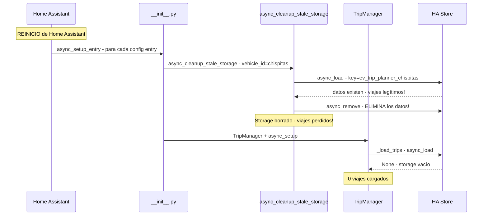

# Fix: Pérdida de viajes al reiniciar Home Assistant

## Root Cause

**BUG CRÍTICO:** La función `async_cleanup_stale_storage()` en `services.py:1120-1172` es llamada desde `async_setup_entry()` en `__init__.py:108` en **CADA reinicio de HA**.

### Flujo del bug



### Código problemático

En `__init__.py:108`:
```python
await async_cleanup_stale_storage(hass, vehicle_id)  # ← BORRA storage legítimo!
```

En `services.py:1138-1144`:
```python
existing_data = await cleanup_store.async_load()
if existing_data:
    await cleanup_store.async_remove()  # ← Elimina viajes legítimos!
```

### Por qué se añadió

El comentario dice: *This handles the case where async_remove_entry wasnt called - e.g. due to HA bugs. When a user deletes and re-adds an integration, we want a fresh start.*

El problema es que `async_setup_entry()` se ejecuta para **TODOS** los config entries existentes en cada reinicio, no solo para entries nuevos.

### Por qué los sensores sí aparecen

Los sensores de viajes se registran en el Entity Registry de HA, que persiste entre reinicios. La clase `RestoreSensor` restaura el último estado conocido. Por eso los sensores "existen" pero muestran datos vacíos/obsoletos.

---

## Plan de Fix

### Paso 1: Eliminar la llamada a `async_cleanup_stale_storage` de `async_setup_entry`

**Archivo:** `custom_components/ev_trip_planner/__init__.py`

**Acción:** Eliminar la línea 108:
```python
# ELIMINAR esta línea:
await async_cleanup_stale_storage(hass, vehicle_id)
```

**Justificación:** La limpieza de storage ya se maneja correctamente en `async_remove_entry_cleanup()` (services.py:1486-1601), que solo se ejecuta cuando el usuario elimina la integración.

### Paso 2: Verificar que `async_remove_entry_cleanup` es suficiente

**Archivo:** `custom_components/ev_trip_planner/services.py:1486-1601`

**Verificación:** Confirmar que este flujo ya maneja:
- ✅ Borrar trips del TripManager (línea 1533)
- ✅ Limpiar índices EMHASS (línea 1540)
- ✅ Eliminar storage persistente (línea 1551)
- ✅ Eliminar YAML fallback (línea 1563)
- ✅ Limpiar input helpers (línea 1586-1598)

### Paso 3: Limpiar logs de debug excesivos

Múltiples `_LOGGER.warning` deberían ser `_LOGGER.debug` o `_LOGGER.info`:

**Archivos afectados:**
- `services.py` - líneas 497, 499, 501, 505, 728, 732 (logs de debug con WARNING)
- `trip_manager.py` - líneas 104, 228-248 (logs de debug con WARNING)
- `coordinator.py` - líneas 99-106 (logs E2E-DEBUG con WARNING)

### Paso 4: Actualizar tests

- Verificar que los tests de `test_post_restart_persistence.py` pasan
- Añadir test específico que verifique que `async_setup_entry` NO borra el storage
- Añadir test que verifique que `async_remove_entry_cleanup` SÍ borra el storage

---

## Archivos a modificar

| Archivo | Cambio |
|---------|--------|
| `__init__.py` | Eliminar llamada a `async_cleanup_stale_storage` |
| `services.py` | Downgrade logs WARNING→DEBUG en líneas de debug |
| `trip_manager.py` | Downgrade logs WARNING→DEBUG en líneas de debug |
| `coordinator.py` | Downgrade logs WARNING→DEBUG en líneas de debug |

## Riesgo

- **Bajo:** El único cambio funcional es eliminar una línea. La limpieza de storage al eliminar la integración ya funciona correctamente vía `async_remove_entry_cleanup`.
- **Edge case:** Si un usuario elimina la integración sin que se ejecute `async_remove_entry` (crash de HA), el storage quedaría huérfano. Esto es aceptable porque:
  1. Es un caso extremo
  2. El storage huérfano no causa problemas funcionales
  3. Se limpiará si el usuario vuelve a añadir la integración con el mismo nombre
