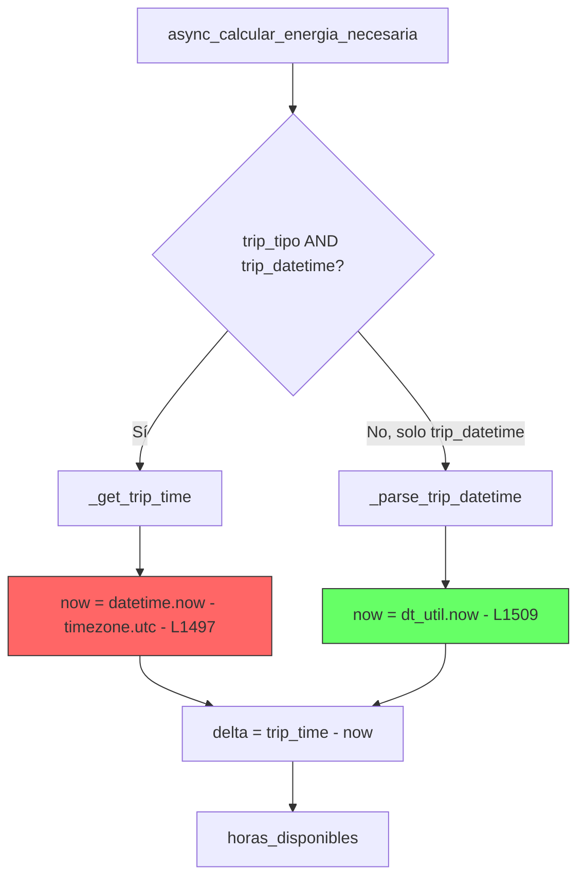

# Revisión Adversarial — C12 Fix: Tests datetime deterministas

**Archivo revisado:** `tests/test_trip_manager_datetime_tz.py`
**Fecha:** 2026-04-23
**Veredicto general:** ✅ APROBADO con observaciones menores

---

## 1. ¿El fix es correcto? ¿Garantiza determinismo?

**✅ SÍ.** El fix es correcto y garantiza determinismo completo.

### Ruta de código ejecutada por los tests

Los 3 tests usan `tipo=None`, por lo que [`async_calcular_energia_necesaria()`](custom_components/ev_trip_planner/trip_manager.py:1429) toma la rama `elif trip_datetime:` (línea 1502). Esta rama:

1. Llama a [`_parse_trip_datetime()`](custom_components/ev_trip_planner/trip_manager.py:145) que convierte el input a datetime aware-UTC
2. Luego usa `dt_util.now()` (línea 1509) para calcular el delta

El mock `monkeypatch.setattr(trip_manager.dt_util, "now", lambda: fixed_now)` intercepta exactamente esa llamada. Ambos valores son constantes fijas:

| Valor | Fecha | Resultado |
|-------|-------|-----------|
| `fixed_now` (mock) | `2026-12-01T08:00 UTC` | Retornado por `dt_util.now()` |
| `trip_time` | `2027-06-15T10:00 UTC` | Parseado del trip dict |
| **Delta** | **~4606 horas** | **Siempre > 0** |

**No hay ninguna fuente de no-determinismo.** El test produce el mismo resultado sin importar cuándo se ejecute.

---

## 2. ¿Hay regresiones potenciales?

**✅ NO hay regresiones.** Los cambios son exclusivamente dentro del archivo de test. No se modifica código de producción.

### Observación: Rama `if trip_tipo and trip_datetime:` NO cubierta

Existe una segunda rama en [`async_calcular_energia_necesaria()`](custom_components/ev_trip_planner/trip_manager.py:1493) que se ejecuta cuando `tipo` está seteado:

```python
if trip_tipo and trip_datetime:          # línea 1493
    trip_time = self._get_trip_time(trip) # usa _get_trip_time
    if trip_time:
        now = datetime.now(timezone.utc)  # ← datetime.now DIRECTO, no dt_util.now()
```

Esta rama usa [`datetime.now(timezone.utc)`](custom_components/ev_trip_planner/trip_manager.py:1497) directamente, que **NO es interceptado** por el mock actual de `dt_util.now()`. Si alguien agrega un test con `tipo="puntual"`, el mock no funcionaría.

**Severidad:** Baja — es un issue preexistente del código de producción, no introducido por este fix. Pero vale la pena documentarlo.

---

## 3. ¿El assert `horas_disponibles > 0` es significativo o frágil?

**✅ Significativo y NO frágil.**

- El delta es ~4606 horas — un margen enorme que no puede fluctuar
- Ambos valores son constantes hardcodeadas
- El assert valida 3 cosas simultáneamente:
  1. El datetime se parseó correctamente (sin TypeError)
  2. La resta naive/aware no explotó (el bug original de C12)
  3. El resultado es semánticamente correcto (viaje futuro = horas positivas)

**No se volverirá frágil** porque no depende de ningún valor calculado dinámicamente.

---

## 4. ¿Patrones DRY/SOLID violados?

**⚠️ SÍ — Violación DRY significativa.**

Los 3 tests comparten código idéntico que debería extraerse a un fixture:

```
Líneas duplicadas en los 3 tests:
├── hass mock setup (3 líneas)     → idéntico
├── TripManager instantiation       → idéntico
├── vehicle_config dict (5 líneas) → idéntico
├── fixed_now + monkeypatch (4 líneas) → idéntico
└── assertions pattern (4 líneas)  → idéntico
```

**Total:** ~16 líneas duplicadas × 3 tests = ~32 líneas redundantes.

**Recomendación:** Extraer a un `@pytest.fixture` que retorne `(tm, vehicle_config)` con el monkeypatch ya aplicado, dejando que cada test solo defina el `trip` dict (lo único que varía).

**Severidad:** Baja — no afecta funcionalidad, pero dificulta mantenimiento futuro.

---

## 5. ¿Resuelve el problema original C12?

**✅ SÍ, completamente.**

El problema C12 original era:
- Trip datetime: `"2026-04-23T10:00"` (fijo)
- `dt_util.now()`: retornaba la hora real actual
- Después de las 10:00 UTC del 2026-04-23 → `horas_disponibles <= 0`

El fix ataca las dos causas raíz:

| Causa | Fix |
|-------|-----|
| Trip datetime en el pasado | Cambiado a `2027-06-15` (futuro lejano) |
| `dt_util.now()` no determinista | Mockeado a `2026-12-01T08:00 UTC` (fijo) |
| Sin validación de viabilidad | Agregado `assert horas_disponibles > 0` |

---

## Hallazgo adicional: Inconsistencia en producción

La función [`async_calcular_energia_necesaria()`](custom_components/ev_trip_planner/trip_manager.py:1429) tiene **dos fuentes de tiempo diferentes** en sus dos ramas:



- **Rama con tipo:** `datetime.now(timezone.utc)` — NO mockeable con monkeypatch de `dt_util`
- **Rama sin tipo:** `dt_util.now()` — Mockeable correctamente

Esto es un code smell preexistente, no una regresión del fix.

---

## Veredicto Final

| Criterio | Resultado | Severidad |
|----------|-----------|-----------|
| Determinismo | ✅ Garantizado | — |
| Regresiones | ✅ Ninguna | — |
| Assert significativo | ✅ Sí, robusto | — |
| DRY violation | ⚠️ Repetición significativa | Baja |
| Resuelve C12 | ✅ Completamente | — |
| Rama `tipo` no testeada | ⚠️ Gap de cobertura | Baja |

**APROBADO.** El fix es correcto, determinista, y resuelve el problema C12. Las observaciones DRY y de cobertura de la rama `tipo` son mejoras futuras deseables pero no bloqueantes.
