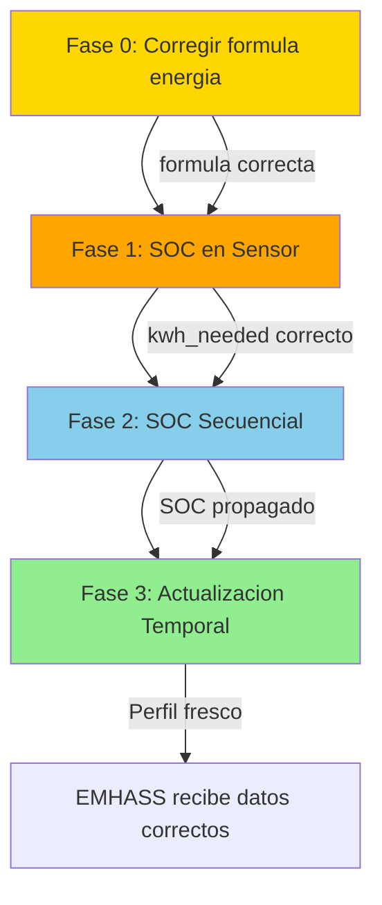

# Plan de Corrección: SOC-Aware Charging + Temporal Updates (v2 - Post-Adversarial Review)

**Fecha**: 2026-04-20
**Estado**: Plan corregido tras revisión adversarial
**Dependencias**: Fix de persistencia tras reinicio (ya completado)
**Revisión adversarial**: 12 hallazgos — todos incorporados

---

## Cambios respecto a v1

| # | Hallazgo Adversarial | Corrección Aplicada |
|---|---------------------|---------------------|
| H1 | `calculate_energy_needed` no garantiza margen post-viaje | Nueva Fase 0: corregir fórmula |
| H2 | T2.1 TODO sin resolver sobre carga en ventanas | Resuelto en T2.1 con algoritmo completo |
| H3 | T3.1 riesgo de bucle infinito | Guardar `_last_profile_hour` ANTES del refresh |
| H4 | EMHASSAdapter es God Class (2172 líneas) | Extraer `ChargingDecision` y `ChargingCalculator` |
| H5 | `_populate_per_trip_cache_entry` tiene 120 líneas | Extraer lógica a función pura |
| H6 | Edge case: SOC = None | Guard en `calculate_energy_needed` |
| H7 | Edge case: viajes simultáneos | Agrupar por deadline |
| H8 | Edge case: kwh > capacidad batería | Clamp a capacidad máxima |
| H9 | Sin estrategia de rollback | Añadida por fase |
| H10 | Sin análisis de impacto en tests | Añadido por tarea |
| H11 | Sin logging/observabilidad | Añadido logging estructurado |
| H12 | Contradicción independencia de fases | Corregido: fases secuenciales |

---

## Arquitectura: Principios SOLID

### Estado Actual

| Principio | Estado | Problema |
|-----------|--------|----------|
| **S** (Single Responsibility) | ❌ Violado | `EMHASSAdapter` tiene 2172 líneas, 40+ métodos |
| **O** (Open/Closed) | ✅ Cumplido | Funciones puras en `calculations.py` |
| **L** (Liskov) | ✅ Cumplido | Protocolos en `protocols.py` |
| **I** (Interface Segregation) | ⚠️ Parcial | Protocolo minimal pero adapter expone demasiado |
| **D** (Dependency Inversion) | ⚠️ Parcial | Adapter lee SOC directamente de `hass.states.get()` |

### Cambios Arquitectónicos del Plan

1. **Extraer `ChargingDecision`** — dataclass pura que encapsula la decisión de carga
2. **Extraer `determine_charging_need()`** — función pura que reemplaza lógica inline
3. **Parámetros opcionales con fallback** — backward compatibility sin romper tests

---

## Fase 0: Corregir Fórmula de Energía Necesaria (H1)

**Prioridad**: CRÍTICA — la fórmula actual no garantiza el margen de seguridad post-viaje

### T0.1: Corregir `calculate_energy_needed()` en `calculations.py`

**Archivo**: [`calculations.py:199-258`](custom_components/ev_trip_planner/calculations.py:199)

**Problema actual** (líneas 236-245):
```python
energia_objetivo = energia_viaje  # Solo energía del viaje
energia_actual = (soc_current / 100.0) * battery_capacity_kwh
energia_necesaria = max(0.0, energia_objetivo - energia_actual)
energia_final = energia_necesaria * (1 + safety_margin_percent / 100)
```

**Caso que falla**: SOC=5%, viaje=2 kWh, batería=27 kWh, margen=10%
- `energia_actual = 1.35 kWh`
- `energia_necesaria = max(0, 2 - 1.35) = 0.65 kWh`
- `energia_final = 0.65 * 1.1 = 0.715 kWh`
- Post-carga: SOC = 5% + 2.6% = 7.6%
- Post-viaje: SOC = 7.6% - 7.4% = **0.2%** ← POR DEBAJO DEL MARGEN

**Fórmula correcta**:
```python
# Energía actual en batería
energia_actual = (soc_current / 100.0) * battery_capacity_kwh

# Energía mínima de seguridad que debe quedar DESPUÉS del viaje
energia_seguridad = (safety_margin_percent / 100.0) * battery_capacity_kwh

# Energía total necesaria = viaje + margen seguridad post-viaje
energia_objetivo = energia_viaje + energia_seguridad

# Energía a cargar = lo que falta para llegar al objetivo
energia_necesaria = max(0.0, energia_objetivo - energia_actual)

# Clamp: no cargar más de la capacidad de la batería
energia_necesaria = min(energia_necesaria, battery_capacity_kwh)
```

**Caso corregido**: SOC=5%, viaje=2 kWh, batería=27 kWh, margen=10%
- `energia_actual = 1.35 kWh`
- `energia_seguridad = 2.7 kWh`
- `energia_objetivo = 2 + 2.7 = 4.7 kWh`
- `energia_necesaria = max(0, 4.7 - 1.35) = 3.35 kWh`
- Post-carga: SOC = 5% + 12.4% = 17.4%
- Post-viaje: SOC = 17.4% - 7.4% = **10%** ← Exactamente el margen ✅

**Edge cases cubiertos**:
- SOC suficiente: `energia_objetivo < energia_actual` → `energia_necesaria = 0` ✅
- kwh > capacidad: clamp a `battery_capacity_kwh` ✅ (H8)
- SOC = None: caller debe asegurar float, pero añadimos guard ✅ (H6)

### T0.2: Guard contra SOC None en `calculate_energy_needed()`

```python
def calculate_energy_needed(
    trip, battery_capacity_kwh, soc_current, charging_power_kw, ...
):
    # Guard: SOC debe ser un float válido
    if soc_current is None or not isinstance(soc_current, (int, float)):
        soc_current = 0.0  # Asumir batería vacía si sensor no disponible
```

### T0.3: Tests Fase 0

- [ ] Test: SOC suficiente → `energia_necesaria = 0`
- [ ] Test: SOC insuficiente → garantiza margen post-viaje
- [ ] Test: SOC=5%, viaje=2 kWh → post-viaje SOC >= margen seguridad
- [ ] Test: SOC=None → fallback a 0.0 (no TypeError)
- [ ] Test: kwh > capacidad → clamp a capacidad máxima
- [ ] Test: SOC > 100% → `energia_necesaria = 0`
- [ ] Test: Todos los tests existentes de `calculate_energy_needed` siguen pasando

**Impacto en tests existentes**: Medio — la fórmula cambia, tests que verifican valores exactos pueden necesitar actualización.

**Rollback**: Revertir commit de T0.1. Los parámetros de entrada no cambian, solo la fórmula interna.

---

## Fase 1: SOC-Aware EMHASS Sensor (G1, G2, G5)

**Prioridad**: ALTA — corrige el problema inmediato del usuario
**Depende de**: Fase 0 completada

### T1.0: Extraer `determine_charging_need()` — función pura (H4, H5)

**Archivo nuevo o en `calculations.py`:

```python
@dataclass(frozen=True)
class ChargingDecision:
    """Immutable charging decision for a single trip."""
    trip_id: str
    kwh_needed: float          # Energy to charge (0 = no charge needed)
    def_total_hours: int        # Hours of charging needed
    power_watts: float          # Charging power (0 = no charge)
    needs_charging: bool        # Whether charging is needed
    
    @property
    def power_profile_template(self) -> List[float]:
        """168-element profile: all zeros if no charging needed."""
        if not self.needs_charging:
            return [0.0] * 168
        return []  # Caller must generate based on window


def determine_charging_need(
    trip: Dict[str, Any],
    soc_current: float,
    battery_capacity_kwh: float,
    charging_power_kw: float,
    safety_margin_percent: float = DEFAULT_SAFETY_MARGIN,
) -> ChargingDecision:
    """Pure function: determine if and how much to charge for a trip.
    
    Uses calculate_energy_needed() internally (which guarantees post-trip safety margin).
    
    Returns:
        ChargingDecision with kwh_needed=0 if SOC is sufficient.
    """
    trip_id = trip.get("id", "unknown")
    
    energia_info = calculate_energy_needed(
        trip, battery_capacity_kwh, soc_current, charging_power_kw,
        safety_margin_percent=safety_margin_percent,
    )
    kwh_needed = energia_info["energia_necesaria_kwh"]
    
    needs_charging = kwh_needed > 0
    
    if needs_charging:
        total_hours = math.ceil(kwh_needed / charging_power_kw) if charging_power_kw > 0 else 0
        power_watts = charging_power_kw * 1000
    else:
        total_hours = 0
        power_watts = 0.0
    
    return ChargingDecision(
        trip_id=trip_id,
        kwh_needed=kwh_needed,
        def_total_hours=total_hours,
        power_watts=power_watts,
        needs_charging=needs_charging,
    )
```

**Beneficio SOLID**: `_populate_per_trip_cache_entry` se reduce de 120 líneas. La decisión de carga es testeable independientemente.

### T1.1: Usar `determine_charging_need()` en `_populate_per_trip_cache_entry()`

**Archivo**: [`emhass_adapter.py:521-642`](custom_components/ev_trip_planner/emhass_adapter.py:521)

**Cambio** (reemplazar líneas 560-621):
```python
# Determinar necesidad de carga usando función pura
decision = determine_charging_need(
    trip, soc_current, self._battery_capacity_kwh,
    charging_power_kw, self._safety_margin_percent,
)

# Logging estructurado para observabilidad (H11)
_LOGGER.info(
    "Charging decision for trip %s: kwh_needed=%.2f, needs_charging=%s, soc=%.1f%%",
    trip_id, decision.kwh_needed, decision.needs_charging, soc_current,
)

# Usar decisión para poblar cache
kwh_needed = decision.kwh_needed
total_hours = decision.def_total_hours
power_watts = decision.power_watts
```

### T1.2: Añadir SOC a `calculate_power_profile_from_trips()`

**Archivo**: [`calculations.py:715-837`](custom_components/ev_trip_planner/calculations.py:715)

**Nueva firma** (parámetros opcionales para backward compat):
```python
def calculate_power_profile_from_trips(
    trips: List[Dict[str, Any]],
    power_kw: float,
    horizon: int = 168,
    reference_dt: Optional[datetime] = None,
    soc_current: Optional[float] = None,
    battery_capacity_kwh: Optional[float] = None,
    safety_margin_percent: float = DEFAULT_SAFETY_MARGIN,
) -> List[float]:
```

**Lógica** (reemplazar líneas 792-802):
```python
# Determine charging need considering SOC
if soc_current is not None and battery_capacity_kwh is not None:
    decision = determine_charging_need(
        trip, soc_current, battery_capacity_kwh, power_kw,
        safety_margin_percent=safety_margin_percent,
    )
    kwh = decision.kwh_needed
else:
    # Backward compat: use trip kwh directly (no SOC available)
    if "kwh" in trip:
        kwh = float(trip.get("kwh", 0))
    else:
        distance_km = float(trip.get("km", 0))
        kwh = calcular_energia_kwh(distance_km, 0.15)

if kwh <= 0:
    continue  # Skip: SOC suficiente
```

**Callers a actualizar**:
- [`emhass_adapter.py:622`](custom_components/ev_trip_planner/emhass_adapter.py:622): `_calculate_power_profile_from_trips([trip], charging_power_kw)` → añadir `soc_current=soc_current, battery_capacity_kwh=self._battery_capacity_kwh`
- [`emhass_adapter.py:832`](custom_components/ev_trip_planner/emhass_adapter.py:832): `_calculate_power_profile_from_trips(trips, charging_power_kw)` → añadir SOC params
- [`emhass_adapter.py:2078`](custom_components/ev_trip_planner/emhass_adapter.py:2078): delega a `calculate_power_profile_from_trips` → pasar SOC params

### T1.3: P_deferrable_nom = 0 cuando no se necesita carga

**Ya cubierto por T1.0**: `ChargingDecision.power_watts = 0.0` cuando `needs_charging = False`.

Actualizar cache en `_populate_per_trip_cache_entry`:
```python
self._cached_per_trip_params[trip_id] = {
    "def_total_hours": decision.def_total_hours,
    "P_deferrable_nom": round(decision.power_watts, 0),
    "p_deferrable_nom": round(decision.power_watts, 0),
    "power_profile_watts": [0.0] * 168 if not decision.needs_charging else power_profile,
    # ... resto de campos
}
```

### T1.4: Verificar automatización EMHASS (H4)

**Archivo**: [`automations/emhass_charge_control_template.yaml`](automations/emhass_charge_control_template.yaml)

Verificar que la condición `p_deferrable0 > 100` funciona correctamente cuando `P_deferrable_nom = 0`. Si `p_deferrable0` es 0, la condición es False → no carga. ✅ Correcto.

### T1.5: Tests Fase 1

- [ ] Test: `determine_charging_need()` con SOC suficiente → `needs_charging=False`
- [ ] Test: `determine_charging_need()` con SOC insuficiente → `needs_charging=True`
- [ ] Test: `determine_charging_need()` con SOC=None → fallback a 0.0
- [ ] Test: `_populate_per_trip_cache_entry` usa `determine_charging_need`
- [ ] Test: Sensor muestra viaje con `kwh_needed=0`, `P_deferrable_nom=0`
- [ ] Test: `calculate_power_profile_from_trips` con SOC → perfil todo ceros
- [ ] Test: `calculate_power_profile_from_trips` sin SOC → backward compat
- [ ] Test: Integración: SOC=60%, viaje 2 kWh → no carga, viaje visible

**Impacto en tests existentes**: Alto — `_populate_per_trip_cache_entry` cambia comportamiento. Tests que mockean `trip.get("kwh")` directamente pueden fallar.

**Archivos de test afectados**:
- `tests/test_emhass_adapter.py` (~30+ tests)
- `tests/test_calculations.py` (~20+ tests)
- `tests/test_power_profile_tdd.py` (~10 tests)
- `tests/test_deferrable_load_sensors.py` (~10 tests)

**Rollback**: Revertir commits de T1.0-T1.3. Los parámetros opcionales permiten que callers antiguos funcionen sin SOC.

---

## Fase 2: SOC Secuencial entre Viajes (G3, G4)

**Prioridad**: ALTA
**Depende de**: Fase 1 completada

### T2.1: Propagar SOC entre viajes con carga en ventanas (H2 resuelto)

**Archivo**: [`emhass_adapter.py`](custom_components/ev_trip_planner/emhass_adapter.py) — método `async_publish_all_deferrable_loads`

**Algoritmo completo** (resolviendo TODO de v1):

```python
# 1. Ordenar viajes por deadline
trip_deadlines.sort(key=lambda x: x[1])

# 2. Propagar SOC secuencialmente
projected_soc = soc_current  # SOC actual del sensor

for i, (trip_id, deadline_dt, trip) in enumerate(trip_deadlines):
    # 2a. Determinar necesidad de carga para este viaje
    decision = determine_charging_need(
        trip, projected_soc, self._battery_capacity_kwh,
        charging_power_kw, self._safety_margin_percent,
    )
    
    # 2b. Calcular cuánto se cargará en la ventana de este viaje
    if decision.needs_charging and batch_charging_windows.get(trip_id):
        window = batch_charging_windows[trip_id]
        ventana_horas = window.get("ventana_horas", 0)
        horas_carga = min(decision.def_total_hours, ventana_horas)
        kwh_cargados = horas_carga * charging_power_kw
        soc_ganado = (kwh_cargados / self._battery_capacity_kwh) * 100
    else:
        soc_ganado = 0
    
    # 2c. Calcular SOC post-carga + post-viaje
    trip_kwh = trip.get("kwh", 0.0)
    soc_consumido = (trip_kwh / self._battery_capacity_kwh) * 100
    projected_soc = projected_soc + soc_ganado - soc_consumido
    projected_soc = max(0, min(100, projected_soc))  # Clamp 0-100
    
    # 2d. Guardar SOC proyectado para este viaje
    trip_soc_map[trip_id] = projected_soc  # SOC al INICIO (antes de cargar)
    
    # 2e. Logging (H11)
    _LOGGER.info(
        "SOC propagation: trip=%s, soc_start=%.1f%%, charged=%.1f%%, consumed=%.1f%%, soc_end=%.1f%%",
        trip_id, projected_soc - soc_ganado + soc_consumido, soc_ganado, soc_consumido, projected_soc,
    )
```

**Edge case: viajes simultáneos** (H7): Agrupar viajes con el mismo deadline y procesarlos con el mismo SOC inicial:

```python
# Agrupar por deadline
from itertools import groupby
for deadline, group in groupby(trip_deadlines, key=lambda x: x[1]):
    trips_at_same_time = list(group)
    # Todos usan el mismo projected_soc
    for trip_id, _, trip in trips_at_same_time:
        trip_soc_map[trip_id] = projected_soc
    # Consumo total de todos los viajes simultáneos
    total_consumption = sum(t.get("kwh", 0) for _, _, t in trips_at_same_time)
    soc_consumido = (total_consumption / self._battery_capacity_kwh) * 100
    projected_soc -= soc_consumido
```

### T2.2: Unificar caminos de cálculo (G4)

**Estrategia**: Hacer que `EMHASSAdapter._calculate_power_profile_from_trips()` delegue a `calculate_power_profile()` (la versión completa) en vez de a `calculate_power_profile_from_trips()` (la simplificada).

```python
def _calculate_power_profile_from_trips(self, trips, charging_power_kw, planning_horizon_hours=168):
    """Delegates to the complete SOC-aware calculation."""
    soc = await self._get_current_soc()  # Already available
    return calculate_power_profile(
        all_trips=trips,
        battery_capacity_kwh=self._battery_capacity_kwh,
        soc_current=soc or 0.0,
        charging_power_kw=charging_power_kw,
        hora_regreso=await self._get_hora_regreso(),
        planning_horizon_days=planning_horizon_hours // 24,
        reference_dt=datetime.now(timezone.utc),
        safety_margin_percent=self._safety_margin_percent,
    )
```

**Nota**: Esto requiere hacer `_calculate_power_profile_from_trips` async o extraer el SOC antes. Evaluar durante implementación.

### T2.3: Tests Fase 2

- [ ] Test: Viaje 1 consume 2 kWh → SOC para viaje 2 es 2 kWh menor
- [ ] Test: Viaje 1 carga + consume → SOC post-viaje correcto
- [ ] Test: 3 viajes encadenados con propagación completa
- [ ] Test: Viajes simultáneos (mismo deadline) → mismo SOC inicial
- [ ] Test: Margen de seguridad respetado después de cada viaje
- [ ] Test: Unificación de caminos produce mismo resultado

**Rollback**: Revertir commits de T2.1-T2.2. La propagación de SOC es aditiva — sin ella, el comportamiento vuelve al actual (SOC fijo para todos los viajes).

---

## Fase 3: Actualización Temporal (G6, G7, G8)

**Prioridad**: MEDIA-ALTA
**Depende de**: Fase 2 completada

### T3.1: Recalcular perfil en coordinator refresh (H3 resuelto)

**Archivo**: [`coordinator.py`](custom_components/ev_trip_planner/coordinator.py)

**Problema de bucle infinito resuelto**: Guardar `_last_profile_hour` ANTES de llamar a `publish_deferrable_loads`:

```python
async def _async_update_data(self) -> dict[str, Any]:
    # ... existing code ...
    
    # T3.1: Recalculate profile when hour changes
    if self._emhass_adapter is not None:
        current_hour = int(datetime.now(timezone.utc).timestamp() / 3600)
        if not hasattr(self, '_last_profile_hour'):
            self._last_profile_hour = current_hour
        
        if current_hour != self._last_profile_hour:
            # UPDATE FLAG FIRST to prevent infinite loop
            self._last_profile_hour = current_hour
            
            # Then trigger recalculation
            try:
                await self._trip_manager.publish_deferrable_loads()
            except Exception as err:
                _LOGGER.warning("Hourly profile recalculation failed: %s", err)
        
        emhass_data = self._emhass_adapter.get_cached_optimization_results()
```

**Prevención de bucle**: `_last_profile_hour` se actualiza ANTES del refresh. Si `publish_deferrable_loads` → `coordinator.async_refresh` → `_async_update_data`, `current_hour == _last_profile_hour` → no se recalcula.

### T3.2: Rotación de viajes recurrentes

**Sin cambios de código adicionales**: Con T3.1 implementado, el perfil se recalcula cada hora. [`calculate_next_recurring_datetime()`](custom_components/ev_trip_planner/calculations.py:668) ya calcula la próxima ocurrencia correctamente. Cuando un viaje recurrente pasa su deadline, la próxima llamada a `calculate_power_profile_from_trips` usará la nueva ocurrencia.

**Verificación necesaria**: Confirmar que `publish_deferrable_loads` → `async_publish_all_deferrable_loads` recalcula los deadlines de viajes recurrentes.

### T3.3: Limpiar viajes puntuales pasados

**Archivo**: [`trip_manager.py`](custom_components/ev_trip_planner/trip_manager.py) — en `publish_deferrable_loads`

```python
async def publish_deferrable_loads(self, trips=None):
    if trips is None:
        trips = await self._get_all_active_trips()
    
    # T3.3: Auto-complete punctual trips whose deadline has passed
    now = datetime.now(timezone.utc)
    completed = []
    for trip in trips:
        if trip.get("tipo") == "punctual":
            deadline = trip.get("datetime")
            if deadline:
                try:
                    deadline_dt = datetime.fromisoformat(deadline)
                    if deadline_dt < now:
                        completed.append(trip["id"])
                except (ValueError, TypeError):
                    pass
    
    for trip_id in completed:
        _LOGGER.info("Auto-completing punctual trip %s (deadline passed)", trip_id)
        await self.async_complete_punctual_trip(trip_id)
    
    # Re-fetch trips after completions
    if completed:
        trips = await self._get_all_active_trips()
    
    await self._emhass_adapter.async_publish_all_deferrable_loads(trips)
    # ... rest of method
```

### T3.4: Tests Fase 3

- [ ] Test: Perfil se actualiza cuando cambia la hora
- [ ] Test: Perfil NO se recalcula dentro de la misma hora
- [ ] Test: No hay bucle infinito entre coordinator y publish_deferrable_loads
- [ ] Test: Viaje recurrente pasado → aparece en posición de próxima semana
- [ ] Test: Viaje puntual pasado → se marca como completado
- [ ] Test: Sensor muestra ceros para viaje completado
- [ ] Test: Integración: paso de 1 hora actualiza perfil correctamente

**Rollback**: Revertir commits de T3.1-T3.3. Sin estos cambios, el perfil se actualiza solo en eventos explícitos (comportamiento actual).

---

## Dependencias entre Fases (CORREGIDO)



**Las fases son SECUENCIALES, no independientes** (corrección de H12). Cada fase depende de la anterior.

---

## Logging Estructurado (H11)

Todas las fases deben incluir logging para observabilidad:

```python
# En determine_charging_need:
_LOGGER.info(
    "ChargingDecision: trip=%s, soc=%.1f%%, trip_kwh=%.2f, needed=%.2f, charging=%s",
    trip_id, soc_current, trip_kwh, kwh_needed, needs_charging,
)

# En SOC propagation:
_LOGGER.info(
    "SOC propagation: trip=%s, soc_in=%.1f%%, charged=%.1f%%, consumed=%.1f%%, soc_out=%.1f%%",
    trip_id, soc_in, soc_charged, soc_consumed, soc_out,
)

# En hourly recalculation:
_LOGGER.info(
    "Hourly profile recalculation: hour=%d, trips=%d, vehicle=%s",
    current_hour, len(trips), vehicle_id,
)
```

---

## Análisis de Impacto en Tests (H10)

| Fase | Tests Nuevos | Tests Afectados | Archivos de Test |
|------|-------------|-----------------|------------------|
| Fase 0 | 7 | ~5 (valores exactos cambian) | `test_calculations.py` |
| Fase 1 | 8 | ~30 (mocks de trip.kwh) | `test_emhass_adapter.py`, `test_calculations.py`, `test_power_profile_tdd.py` |
| Fase 2 | 6 | ~10 (SOC secuencial) | `test_emhass_adapter.py`, `test_trip_manager_emhass.py` |
| Fase 3 | 7 | ~5 (coordinator refresh) | `test_coordinator.py`, `test_trip_manager_core.py` |
| **Total** | **28** | **~50** | |

---

## Criterios de Aceptación Actualizados

### Fase 0
- [ ] AC-0.1: `calculate_energy_needed` garantiza SOC post-viaje >= margen seguridad
- [ ] AC-0.2: SOC=None → fallback a 0.0 sin TypeError
- [ ] AC-0.3: kwh > capacidad → clamp a capacidad máxima
- [ ] AC-0.4: Tests existentes de `calculate_energy_needed` actualizados y pasando

### Fase 1
- [ ] AC-1.1: Viaje con SOC suficiente → `kwh_needed=0`, `P_deferrable_nom=0`, perfil ceros
- [ ] AC-1.2: Viaje con SOC insuficiente → valores correctos de carga
- [ ] AC-1.3: Viaje siempre visible, incluso sin carga
- [ ] AC-1.4: `determine_charging_need()` es función pura testeable independientemente
- [ ] AC-1.5: Automatización EMHASS funciona con `P_deferrable_nom=0`
- [ ] AC-1.6: 100% coverage mantenido

### Fase 2
- [ ] AC-2.1: Viajes encadenados → SOC propagado correctamente
- [ ] AC-2.2: Carga en ventana anterior → reflejada en SOC del siguiente viaje
- [ ] AC-2.3: Viajes simultáneos → mismo SOC inicial
- [ ] AC-2.4: Un solo camino de cálculo (no dos)
- [ ] AC-2.5: Margen seguridad respetado después de CADA viaje

### Fase 3
- [ ] AC-3.1: Perfil se actualiza cuando cambia la hora (sin bucle infinito)
- [ ] AC-3.2: Viaje recurrente pasado → próxima ocurrencia en posición correcta
- [ ] AC-3.3: Viaje puntual pasado → auto-completado
- [ ] AC-3.4: EMHASS siempre recibe datos actualizados
