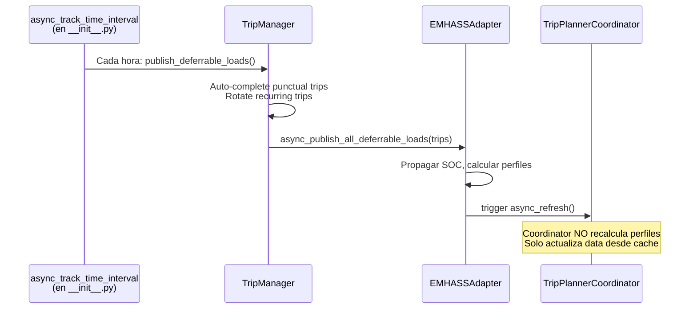
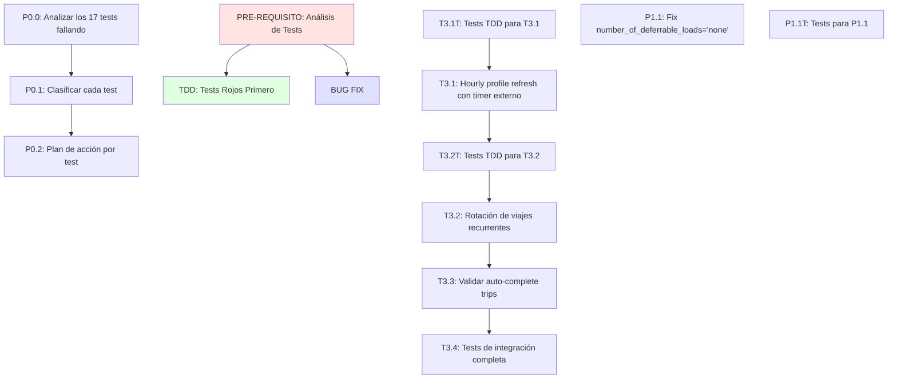

# Plan v3: Completar Implementación SOC-Aware Charging

**Fecha**: 2026-04-20  
**Estado**: Plan corregido con honestidad sobre lo que REALMENTE falta  
**Analista**: Mary (Strategic Business Analyst)  
**Dependencias**: Fix de persistencia tras reinicio (ya completado)  
**Metodología**: TDD - Primero tests rojos, luego verde, luego refactor

---

## Problema Detectado

El plan v2 tenía 2 tareas marcadas como completadas/partiales que en realidad **nunca se implementaron**:

| Tarea | Estado en v2 | Estado Real | Razón del fallo |
|-------|--------------|-------------|----------------|
| **T3.1** | "partial" | ❌ NUNCA IMPLEMENTADO | Error arquitectónico: el plan propuso meter el timer dentro de `_async_update_data()`, causando bucle infinito. Se revertió. |
| **T3.2** | "functional" | ❌ NUNCA IMPLEMENTADO | `calculate_next_recurring_datetime()` existe pero **nadie la llama** en el flujo. |
| **T3.4** | Tests | ❌ NUNCA IMPLEMENTADO | No hay tests para T3.1, T3.2, ni para la limpieza de trips más allá de T3.3. |

**Adicionalmente**: Hay **17 tests fallando** después del primer intento de implementación. Esto es sospecha y requiere análisis profundo.

---

## Análisis: Lo que SÍ se implementó correctamente

| Fase | Tareas | Estado Real |
|------|--------|-------------|
| **Fase 0** | T0.1-T0.3 | ✅ Completado — Fórmula `calculate_energy_needed` corregida |
| **Fase 1** | T1.0-T1.5 | ✅ Completado — `ChargingDecision`, `determine_charging_need()`, SOC en sensor |
| **Fase 2** | T2.1-T2.3 | ✅ Completado — Propagación secuencial de SOC entre viajes |
| **T3.3** | Auto-complete trips | ✅ Completado — Viajes puntuales pasados se auto-completan |

---

## Arquitectura Propuesta para Evitar Bucle Infinito



**Clave**: El timer está en `__init__.py`, **fuera** del coordinator.

---

## Estructura del Plan



---

## PASO 0: Análisis de los 17 Tests Fallando

### P0.0: Ejecutar suite completa para identificar los 17 tests

**Precaución CRÍTICA**: No asumir que los tests están obsoletos o que sobran. Cada test que falla es una pista sobre algo que no se implementó correctamente o que reveló un problema en el código existente.

```bash
python -m pytest tests/ -x --tb=short 2>&1 | tee test-output.txt
```

**Objetivo**: Documentar todos los tests que fallan, incluyendo:
- Nombre del test
- Archivo donde está
- Mensaje de error exacto
- Stack trace completo

### P0.1: Clasificar cada test que falla

Para cada uno de los 17 tests, determinar la categoría:

| Categoría | Descripción | Acción |
|-----------|-------------|--------|
| **A) Cambio de comportamiento esperado** | El test verifica algo que cambió debido a las fases 0-2 | Actualizar el test para reflejar el nuevo comportamiento correcto |
| **B) Test obsoleto** | El test verifica una funcionalidad que ya no existe o fue reemplazada | Eliminar el test o marcarlo como skip |
| **C) Revela bug en implementación** | El test es válido y falla porque el código no está implementado correctamente | Fixear el código, NO el test |
| **D) Revela gap en el plan** | El test verifica funcionalidad que nunca se planeó | Añadir al plan como tarea pendiente |
| **E) Test incorrecto** | El test tiene lógica incorrecta | Corregir el test |
| **F) Efecto colateral de cambios** | El test falla por dependencias no consideradas | Investigar dependencias y fixear apropiadamente |

**Formato de documentación**:

```markdown
## Test: test_[nombre]
- **Archivo**: tests/test_[archivo].py
- **Error**: [mensaje exacto]
- **Categoría**: [A/B/C/D/E/F]
- **Razón**: [explicación de por qué falla]
- **Acción**: [qué hacer para resolver]
```

### P0.2: Plan de acción por test

Una vez clasificados, crear una tabla de acción:

| Test | Categoría | Prioridad | Acción Específica |
|------|-----------|-----------|-------------------|
| test_xxx | A | Alta | Update assertion para nuevo valor de kwh_needed |
| test_yyy | C | Crítica | Fix en _populate_per_trip_cache_entry |
| test_zzz | B | Baja | Eliminar test (funcionalidad removida) |
| ... | ... | ... | ... |

**Criterios de decisión**:
- Si la funcionalidad que el test verifica ES correcta y DEBERÍA funcionar → **Fix el código**
- Si el test verifica algo que cambió legítimamente → **Update el test**
- Si el test verifica algo que no existe ni debería existir → **Eliminar test**
- Si no estás seguro → **Investigar más** antes de actuar

---

## TDD: Tests Rojos Primero para Funcionalidades Pendientes

### Metodología TDD para este plan

1. **Rojo**: Crear test que falla porque la funcionalidad NO está implementada
2. **Verde**: Implementar la funcionalidad mínima para que pase el test
3. **Refactor**: Mejorar el código mientras los tests siguen pasando

### T3.1T: Tests TDD para Hourly Profile Refresh

**Test 1**: Timer se registra en `async_setup_entry`

```python
@pytest.mark.asyncio
async def test_hourly_timer_registered_in_setup(hass, mock_config_entry, mock_trip_manager):
    """TDD: Timer debe registrarse cuando se configura la integración."""
    # Arrange
    with patch('homeassistant.helpers.event.async_track_time_interval') as mock_timer:
        mock_timer.return_value = MagicMock()
        
        # Act
        await async_setup_entry(hass, mock_config_entry)
        
        # Assert - Timer fue llamado con interval de 1 hora
        mock_timer.assert_called_once()
        args = mock_timer.call_args[0]
        assert args[2] == timedelta(hours=1)  # tercer arg es el interval
```

**Test 2**: Timer se cancela en `async_unload_entry`

```python
@pytest.mark.asyncio
async def test_hourly_timer_cancelled_on_unload(hass, mock_config_entry, mock_trip_manager):
    """TDD: Timer debe cancelarse cuando se descarga la integración."""
    # Arrange
    cancel_fn = MagicMock()
    with patch('homeassistant.helpers.event.async_track_time_interval', return_value=cancel_fn):
        # Act
        result = await async_setup_entry(hass, mock_config_entry)
        await async_unload_entry(hass, mock_config_entry)
        
        # Assert
        cancel_fn.assert_called_once()
```

**Test 3**: Timer llama a `publish_deferrable_loads()`

```python
@pytest.mark.asyncio
async def test_hourly_timer_calls_publish_deferrable_loads(hass, mock_config_entry, mock_trip_manager):
    """TDD: Timer debe llamar a publish_deferrable_loads cada hora."""
    # Arrange
    with patch('homeassistant.helpers.event.async_track_time_interval') as mock_timer:
        callback = None
        def capture_callback(hass, callback_fn, interval):
            nonlocal callback
            callback = callback_fn
            return MagicMock()
        mock_timer.side_effect = capture_callback
        
        await async_setup_entry(hass, mock_config_entry)
        
        # Act - Simular callback del timer
        await callback(datetime.now(timezone.utc))
        
        # Assert
        mock_trip_manager.publish_deferrable_loads.assert_called_once()
```

**Test 4**: No hay bucle infinito

```python
@pytest.mark.asyncio
async def test_no_infinite_loop_between_coordinator_and_publish(hass, mock_coordinator, mock_trip_manager, mock_emhass_adapter):
    """TDD: Llamar a publish no debe causar bucle infinito."""
    # Arrange
    call_count = 0
    original_async_refresh = mock_coordinator.async_refresh
    
    def counting_refresh():
        nonlocal call_count
        call_count += 1
        if call_count > 5:
            raise RuntimeError("Infinite loop detected!")
        return original_async_refresh()
    
    mock_coordinator.async_refresh = counting_refresh
    
    # Act
    await mock_trip_manager.publish_deferrable_loads()
    
    # Assert - coordinator.async_refresh fue llamado exactamente 1 vez
    assert call_count == 1
```

### T3.2T: Tests TDD para Rotación de Viajes Recurrentes

**Test 1**: Recurring trip con deadline pasado → usa próxima semana

```python
@pytest.mark.asyncio
async def test_recurring_trip_past_deadline_uses_next_week(hass, mock_trip_manager):
    """TDD: Viaje recurrente pasado debe usar la próxima ocurrencia."""
    # Arrange
    past_trip = {
        "id": "recurring_1",
        "tipo": "recurring",
        "days": ["monday"],
        "datetime": "2026-04-13T08:00:00",  # Monday pasado
        "hora": "08:00",
    }
    
    # Act
    await mock_trip_manager.publish_deferrable_loads([past_trip])
    
    # Assert - Verificar que se calculó próxima occurrence
    # El datetime debe ser el próximo Monday, no el pasado
```

**Test 2**: Multiple recurring trips → cada uno con su próximo datetime

```python
@pytest.mark.asyncio
async def test_multiple_recurring_trips_rotated_correctly(hass, mock_trip_manager):
    """TDD: Múltiples viajes recurrentes deben rotarse independientemente."""
    # Arrange
    trips = [
        {"id": "rec_1", "tipo": "recurring", "days": ["monday"], "hora": "08:00", "datetime": "2026-04-13T08:00:00"},
        {"id": "rec_2", "tipo": "recurring", "days": ["wednesday"], "hora": "18:00", "datetime": "2026-04-15T18:00:00"},
        {"id": "rec_3", "tipo": "recurring", "days": ["friday"], "hora": "07:30", "datetime": "2026-04-17T07:30:00"},
    ]
    
    # Act
    await mock_trip_manager.publish_deferrable_loads(trips)
    
    # Assert - Verificar que cada uno tiene datetime actualizado
```

**Test 3**: Recurring daily → se recalcula cada hora

```python
@pytest.mark.asyncio
async def test_recurring_daily_trip_recalculated_hourly(hass, mock_trip_manager):
    """TDD: Viaje diario debe recalcularse cada hora."""
    # Arrange
    daily_trip = {
        "id": "daily_1",
        "tipo": "recurring",
        "frecuencia": "daily",
        "hora": "22:00",
        "datetime": "2026-04-19T22:00:00",  # Ayer
    }
    
    # Act - Llamar dos veces con diferentes "ahora"
    with freeze_time("2026-04-20T10:00:00"):
        await mock_trip_manager.publish_deferrable_loads([daily_trip])
        first_datetime = daily_trip["datetime"]
    
    # Avanzar una hora
    with freeze_time("2026-04-20T11:00:00"):
        await mock_trip_manager.publish_deferrable_loads([daily_trip])
        second_datetime = daily_trip["datetime"]
    
    # Assert - Los datetime deben ser diferentes (recalculado)
    assert first_datetime != second_datetime
```

### P1.1T: Tests para Fix `number_of_deferrable_loads`

**Test 1**: Sensor con 0 trips → `number_of_deferrable_loads = 0` (no "none")

```python
@pytest.mark.asyncio
async def test_emhass_sensor_zero_deferrable_shows_zero_not_none(hass, mock_coordinator):
    """TDD: Sensor con 0 cargas aplazables debe mostrar 0, no none."""
    # Arrange
    mock_coordinator.data = {
        "per_trip_params": {},  # Sin trips
        "power_profile_watts": [0.0] * 168,
    }
    
    # Act
    sensor = EmhassDeferrableLoadSensor(mock_coordinator, "test_vehicle")
    attrs = sensor.extra_state_attributes
    
    # Assert
    assert attrs["number_of_deferrable_loads"] == 0
    assert attrs["number_of_deferrable_loads"] is not None
```

**Test 2**: Sensor con N trips → `number_of_deferrable_loads = N`

```python
@pytest.mark.asyncio
async def test_emhass_sensor_with_trips_shows_correct_count(hass, mock_coordinator):
    """TDD: Sensor con N cargas debe mostrar N."""
    # Arrange
    mock_coordinator.data = {
        "per_trip_params": {
            "trip_1": {"def_total_hours": 1.0},
            "trip_2": {"def_total_hours": 2.0},
            "trip_3": {"def_total_hours": 1.5},
        },
        "power_profile_watts": [0.0] * 168,
    }
    
    # Act
    sensor = EmhassDeferrableLoadSensor(mock_coordinator, "test_vehicle")
    attrs = sensor.extra_state_attributes
    
    # Assert
    assert attrs["number_of_deferrable_loads"] == 3
```

---

## FASE 3: Implementación

### T3.1: Hourly Profile Refresh con Timer Externo

**Archivo principal**: [`__init__.py:101`](custom_components/ev_trip_planner/__init__.py:101)

**Import necesario**:
```python
from homeassistant.helpers.event import async_track_time_interval
from datetime import timedelta
```

**Implementación**:

```python
async def async_setup_entry(hass: HomeAssistant, entry: ConfigEntry) -> bool:
    # ... existing setup code ...
    
    # T3.1: Setup hourly refresh timer OUTSIDE coordinator
    runtime_data: EVTripRuntimeData = entry.runtime_data
    
    async def hourly_refresh(now: datetime) -> None:
        """Hourly callback to refresh deferrable loads profile."""
        try:
            if runtime_data.trip_manager:
                await runtime_data.trip_manager.publish_deferrable_loads()
        except Exception as err:
            _LOGGER.warning("Hourly profile refresh failed: %s", err)
    
    # Register timer and ensure cleanup on unload
    entry.async_on_unload(
        async_track_time_interval(hass, hourly_refresh, timedelta(hours=1))
    )
```

---

### T3.2: Rotación de Viajes Recurrentes

**Archivo**: [`trip_manager.py`](custom_components/ev_trip_planner/trip_manager.py) — método `publish_deferrable_loads`

**Import necesario**:
```python
from .calculations import calculate_next_recurring_datetime
```

**Implementación**:

```python
async def publish_deferrable_loads(self, trips: Optional[List[Dict[str, Any]]] = None) -> None:
    if trips is None:
        trips = await self._get_all_active_trips()
    
    # T3.2: Calculate next occurrences for recurring trips
    for trip in trips:
        if trip.get("tipo") == "recurring":
            next_occurrence = calculate_next_recurring_datetime(trip)
            if next_occurrence:
                trip["datetime"] = next_occurrence.isoformat()
    
    # T3.3: Auto-complete punctual trips whose deadline has passed
    # ... (already implemented) ...
    
    await self._emhass_adapter.async_publish_all_deferrable_loads(trips)
    # ... rest of method
```

---

### P1.1: Fix bug `number_of_deferrable_loads` = "none"

**Archivo**: [`sensor.py:239-313`](custom_components/ev_trip_planner/sensor.py:239)

**Root cause**: El atributo se establece solo dentro del bloque `if per_trip_params:`.

**Fix**:

```python
@property
def extra_state_attributes(self) -> Dict[str, Any]:
    attrs: Dict[str, Any] = {}
    
    # Initialize with default BEFORE per_trip_params block
    number_of_deferrable_loads = 0
    
    per_trip_params = self.coordinator.data.get("per_trip_params", {})
    
    if per_trip_params:
        # ... existing code ...
        number_of_deferrable_loads = len(per_trip_params)
        # ... existing code ...
    
    # Set AFTER per_trip_params block
    attrs["number_of_deferrable_loads"] = number_of_deferrable_loads
    
    return attrs
```

---

## Resumen de Tareas

| ID | Descripción | Tipo | Dependencias |
|----|-------------|------|--------------|
| **P0.0** | Ejecutar suite de tests, documentar 17 failures | Análisis | Ninguna |
| **P0.1** | Clasificar cada test (A-F) | Análisis | P0.0 |
| **P0.2** | Crear plan de acción por test | Análisis | P0.1 |
| **T3.1T** | Crear tests TDD para hourly refresh (4 tests) | TDD | P0.2 |
| **T3.1** | Implementar timer externo en `__init__.py` | Código | T3.1T |
| **T3.2T** | Crear tests TDD para recurring rotation (3 tests) | TDD | T3.1 |
| **T3.2** | Implementar rotation en `publish_deferrable_loads` | Código | T3.2T |
| **T3.3** | Validar auto-complete trips (ya implementado) | Validación | T3.2 |
| **T3.4** | Tests de integración completa | Tests | T3.1, T3.2, T3.3 |
| **P1.1T** | Crear tests para fix `number_of_deferrable_loads` | TDD | P0.2 |
| **P1.1** | Fix bug en `sensor.py` | Código | P1.1T |

**Total tareas**: 11  
**Tests nuevos estimados**: ~15 (TDD) + análisis de 17 failures

---

## Criterios de Aceptación

### Análisis de Tests Completo

- [ ] **AC-P0.1**: Los 17 tests fallando están documentados con razón de fallo
- [ ] **AC-P0.2**: Cada test tiene categoría (A-F) y acción específica
- [ ] **AC-P0.3**: Para cada test en categorías A-C, el plan de acción está ejecutado

### TDD Completado

- [ ] **AC-T3.1T**: 4 tests rojos para hourly refresh
- [ ] **AC-T3.2T**: 3 tests rojos para recurring rotation  
- [ ] **AC-P1.1T**: 2 tests rojos para number_of_deferrable_loads

### Fase 3 Completa

- [ ] **AC-3.1**: Timer se ejecuta cada hora y llama a `publish_deferrable_loads()`
- [ ] **AC-3.2**: Timer se limpia correctamente cuando se desactiva la integración
- [ ] **AC-3.3**: NO hay bucle infinito entre coordinator y publish
- [ ] **AC-3.4**: Viaje recurrente pasado → aparece en posición de próxima semana
- [ ] **AC-3.5**: Viaje puntual pasado → se marca como completado
- [ ] **AC-3.6**: Sensor muestra `number_of_deferrable_loads = 0` cuando no hay trips (no "none")
- [ ] **AC-3.7**: EMHASS siempre recibe datos actualizados

---

## Preguntas Pendientes

1. ¿Quieres que就先 ejecutemos P0.0 para ver exactamente cuáles son los 17 tests que fallan antes de continuar con el plan?
2. ¿El análisis de los 17 tests lo quieres hacer ahora en esta sesión o prefieres que lo documentemos para hacerlo más tarde?