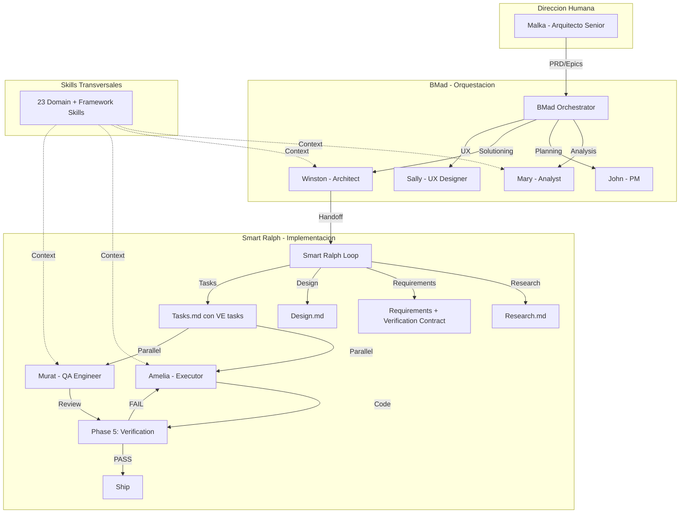
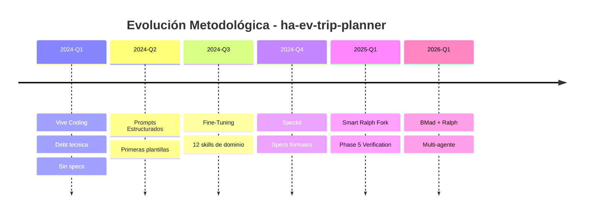

# 🏗️ Evaluación Arquitectónica — AI Development Lab

> **Evaluador:** Winston (Architect Agent)  
> **Fecha:** 2026-04-23  
> **Alcance:** `docs/ai-development-lab.md`, `docs/index.md`, `doc/gaps/gaps.md`  
> **Método:** Verificación contra estado real del repositorio

---

## 1. Evaluación de la Arquitectura Técnica Documentada

### 1.1 Relación BMad ↔ Smart Ralph ↔ Agentes — Veredicto: ⚠️ Parcialmente Clara

El documento presenta dos diagramas ASCII en [`ai-development-lab.md`](../docs/ai-development-lab.md:242) que muestran:

1. **Arquitectura de Desarrollo** (línea 242-276): Un diagrama de capas con Human Architect → BMad Orchestrator → Smart Ralph Loop → Skills
2. **Pipeline de Desarrollo** (línea 280-318): Un flujo secuencial Research → PM → Architect → Tasks → Executor+QA → Phase 5

**Problema arquitectónico identificado:** La relación entre BMad y Smart Ralph se describe como "integración dual" en texto, pero los diagramas no muestran **cómo se conectan concretamente**. El diagrama de capas muestra BMad *encima* de Ralph, pero el pipeline muestra un flujo *secuencial* sin indicar dónde termina la jurisdicción de BMad y dónde empieza la de Ralph.

**Verificación contra el disco:**

| Afirmación del documento | Estado real en disco | Veredicto |
|--------------------------|---------------------|-----------|
| BMad Orchestrator con 6 agentes | `_bmad/_config/agent-manifest.csv` tiene exactamente 6 agentes: Mary, Paige, John, Sally, Winston, Amelia | ✅ Correcto |
| Integración BMad + Ralph en `bmalph/` | `bmalph/config.json` existe con platform: claude-code y upstreamVersions.bmadCommit | ✅ Correcto |
| QA Agent Murat | Presente como skill `bmad-tea` pero NO en agent-manifest.csv | ⚠️ Inconsistente |
| Workflow de 3 fases BMad | `_bmad/` tiene directorios: core, lite, bmm, bmb, cis, tea — más de 3 fases | ⚠️ Simplificado |

**Recomendación:** El diagrama de arquitectura necesita un **diagrama de integración** que muestre explícitamente:
- Dónde BMad delega a Ralph (handoff point)
- Qué artifacts produce cada sistema
- Cómo fluye la información entre ambos

### 1.2 Precisión de las Métricas — Veredicto: ⚠️ Conservadoras pero Inexactas

| Métrica documentada | Valor documentado | Valor verificado | Delta |
|---------------------|-------------------|------------------|-------|
| Módulos Python | 17 | 18 `.py` files en `custom_components/ev_trip_planner/` | +1 |
| Skills de dominio | 12+ | 12 domain + 11 framework = 23 total en `.agents/skills/` | Ambiguo |
| Tests unitarios | 70+ archivos | 85+ archivos `.py` en `tests/` | Subestimado |
| Specs generados | 20+ | Verificable en `specs/` | No verificado completamente |

**Recomendación:** Actualizar las métricas a valores exactos. Un recruiter técnico verificará estos números. Subestimar es mejor que sobreestimar, pero la imprecisión en "12+ skills" es problemática: el documento lista 12 skills *de dominio* pero existen 23 skills *totales*. Esto necesita aclaración.

---

## 2. Evaluación de los Diagramas de Arquitectura

### 2.1 Diagrama de Capas — Veredicto: 🔶 Funcional pero Mejorable

El diagrama ASCII en líneas 242-276 comunica la jerarquía pero tiene limitaciones:

**Fortalezas:**
- Muestra claramente que el humano está en la cima como director técnico
- Diferencia entre capa de orquestación (BMad) y capa de ejecución (Ralph)
- Incluye los nombres de los agentes (Saga, Winston, Amelia, Murat)

**Debilidades:**
- No muestra **feedback loops** — el flujo parece unidireccional
- No muestra **dónde intervienen las 12 skills de dominio** en el pipeline
- El bloque "Domain Skills" está al mismo nivel que Executor y QA, pero las skills son *transversales*, no un agente más
- No hay distinción entre fases de BMad (Analysis → Planning → Solutioning) y fases de Ralph (Research → Design → Tasks → Implement → Verify)

### 2.2 Pipeline de Desarrollo — Veredicto: ✅ Bueno

El diagrama en líneas 280-318 es más efectivo porque:
- Muestra el flujo secuencial con artifacts concretos en cada paso
- Incluye la bifurcación PASS/FAIL del Phase 5
- El revisor en paralelo (QA Engineer) está bien representado

**Mejora sugerida:** Añadir un swimlane que indique qué parte del pipeline es responsabilidad de BMad y cuál de Ralph.

### 2.3 Recomendación: Diagrama Mermaid Propuesto

Para la presentación a recruiters, recomiendo reemplazar los diagramas ASCII con un diagrama Mermaid que sea renderizable en GitHub:

---

## 3. Evaluación de Skills de Dominio y Phase 5 Verification Loop

### 3.1 Las 12 Skills de Dominio — Veredicto: ✅ Preciso pero Incompleto

La tabla en [`ai-development-lab.md`](../docs/ai-development-lab.md:344) lista exactamente 12 skills de dominio. Verificación:

| Skill listada en doc | Existe en `.agents/skills/` | Match |
|----------------------|---------------------------|-------|
| `homeassistant-skill` | ✅ | Exacto |
| `homeassistant-best-practices` | ✅ | Exacto |
| `homeassistant-config` | ✅ | Exacto |
| `homeassistant-ops` | ✅ | Exacto |
| `homeassistant-dashboard-designer` | ✅ | Exacto |
| `e2e-testing-patterns` | ✅ | Exacto |
| `playwright-best-practices` | ✅ | Exacto |
| `python-testing-patterns` | ✅ | Exacto |
| `python-performance-optimization` | ✅ | Exacto |
| `python-security-scanner` | ✅ | Exacto |
| `python-cybersecurity-tool-development` | ✅ | Exacto |
| `github-actions-docs` | ✅ | Exacto |

**12/12 verificados.** Sin embargo, faltan las **11 skills de framework** que también existen:

- `deep-agents-core`, `deep-agents-memory`, `deep-agents-orchestration`
- `framework-selection`
- `langchain-dependencies`, `langchain-fundamentals`, `langchain-middleware`, `langchain-rag`
- `langgraph-fundamentals`, `langgraph-human-in-the-loop`, `langgraph-persistence`

**Recomendación:** Añadir una segunda tabla "Skills de Framework" o cambiar el título a "12 Skills de Dominio + 11 Skills de Framework = 23 Total". Esto demuestra más profundidad de inversión en el ecosistema.

### 3.2 Phase 5 Verification Loop — Veredicto: ✅ Bien Documentado

La Phase 5 está documentada en tres niveles:
1. **Conceptual:** En la tabla comparativa Upstream vs Fork (línea 186-192)
2. **Operacional:** En el pipeline diagram (línea 310-318)
3. **Artifacts:** Referencia a `docs/RALPH_METHODOLOGY.md`

**Lo que falta:** No hay un ejemplo concreto de un Verification Contract real. El documento menciona el concepto pero no muestra un artifact producido por el sistema. Para un recruiter técnico, ver un ejemplo real de `requirements.md` con el bloque `## Verification Contract` sería mucho más impactante que la descripción abstracta.

**Recomendación:** Añadir un "Ejemplo Real" con un fragmento de un Verification Contract de una spec existente (ej: `specs/e2e-ux-tests-fix/`).

---

## 4. Recomendaciones Técnicas para Presentación a Recruiters

### 4.1 Problema Estructural: gaps.md es un Agujero Negro

[`doc/gaps/gaps.md`](../doc/gaps/gaps.md) tiene **2116 líneas**. Paige le dio 4/10. Como arquitecto, mi evaluación es más severa: **este archivo activamente perjudica la presentación**.

**Por qué:**
- Un recruiter técnico que abra este archivo verá 2116 líneas de hipótesis sin verificar
- La estructura repite el mismo patrón (Problema → Referencias → Hipótesis H1-H4 → Próximos pasos) 5 veces con profundidad excesiva
- El ratio señal/ruido es bajo: mucha especulación, poca validación

**Recomendación arquitectónica:** Crear un **`doc/gaps/EXECUTIVE_SUMMARY.md`** de máximo 100 líneas que:
1. Liste los 5 gaps con una línea de descripción cada uno
2. Matriz de prioridades (ya existe en `ai-development-lab.md` líneas 452-461)
3. Estado actual de cada gap
4. Link al análisis profundo para quien quiera profundizar

### 4.2 Reframing del Mensaje "CERO Líneas"

Paige ya recomendó cambiar "CERO líneas de código" a "Especialista en dirección técnica de sistemas multi-agente". Como arquitecto, **apoyo totalmente esta recomendación** pero añado matices:

**Problema con "CERO líneas":**
- Suena a **limitación**, no a **fortaleza**
- Un recruiter podría interpretarlo como "no sabe programar" en lugar de "dirige programadores IA"
- En el contexto PHP senior, la audiencia espera competencia técnica demostrable

**Recomendación de framing:**

| En lugar de... | Usar... |
|----------------|---------|
| "CERO líneas de código escritas manualmente" | "Arquitectura 100% dirigida por especificaciones, ejecutada por agentes IA especializados" |
| "NO experto en Python" | "Especialista en arquitectura multi-lenguaje: dirección técnica cross-stack (PHP/Python/TS)" |
| "Todo generado por IA" | "Pipeline de desarrollo con orquestación multi-agente y verificación automatizada" |

### 4.3 Diagrama de Evolución Metodológica

La tabla en [`docs/index.md`](../docs/index.md:67) es útil pero no visual. Para un recruiter, un timeline visual sería más impactante:

### 4.4 Falta un Diagrama de la Arquitectura del Producto Real

El documento se enfoca en la **arquitectura del proceso de desarrollo** pero apenas muestra la **arquitectura del producto**. [`docs/architecture.md`](../docs/architecture.md) tiene un excelente diagrama de capas (Presentation → Service → Orchestration → Calculation → Data) que no está referenciado ni resumido en `ai-development-lab.md`.

**Recomendación:** Añadir una sección "Arquitectura del Producto" que:
1. Muestre el diagrama de capas del componente HA
2. Conecte cada capa con la metodología que la produjo
3. Demuestre que la arquitectura limpia (SOLID, Protocol DI, separación calculations/trip_manager) es una **decisión humana**, no un artifact accidental de la IA

### 4.5 Validación Cruzada con el Sistema de Agentes

El documento menciona "Validación cruzada entre agentes" como característica de BMad (línea 212) pero no muestra **cómo funciona** ni **qué produce**. Un recruiter técnico querrá ver:

- Un ejemplo de cómo el Architect valida lo que el Analyst produjo
- Un ejemplo de cómo el QA Engineer detecta una violación SOLID durante implementación
- El artifact resultante de esa validación cruzada

**Recomendación:** Añadir un "Caso de Estudio: Validación Cruzada en Acción" con un ejemplo real de una spec donde múltiples agentes intervinieron y el resultado fue mejor que si un solo agente hubiera actuado.

---

## 5. Resumen de Acciones Prioritarias

| # | Acción | Impacto en Recruiters | Esfuerzo |
|---|--------|----------------------|----------|
| 1 | Reemplazar diagramas ASCII con Mermaid renderizable | Alto — visualización profesional | Bajo |
| 2 | Crear `doc/gaps/EXECUTIVE_SUMMARY.md` | Alto — elimina el agujero negro de 2116 líneas | Bajo |
| 3 | Añadir tabla de 11 skills de framework faltantes | Medio — muestra profundidad | Bajo |
| 4 | Añadir ejemplo real de Verification Contract | Alto — demuestra con artifacts concretos | Bajo |
| 5 | Reframing del mensaje "CERO líneas" | Alto — cambia percepción de limitación a fortaleza | Bajo |
| 6 | Añadir diagrama de arquitectura del producto | Alto — conecta proceso con resultado | Medio |
| 7 | Añadir diagrama de integración BMad ↔ Ralph | Medio — clarifica la relación más confusa | Medio |
| 8 | Caso de estudio de validación cruzada | Alto — demuestra valor del multi-agente | Medio |
| 9 | Actualizar métricas a valores exactos | Medio — credibilidad técnica | Bajo |
| 10 | Añadir swimlane BMad/Ralph al pipeline | Medio — clarifica jurisdicciones | Bajo |

---

*Evaluación emitida por Winston (Architect Agent) — BMad Method v1.0*  
*Principio aplicado: "Connect every decision to business value and user impact"*
