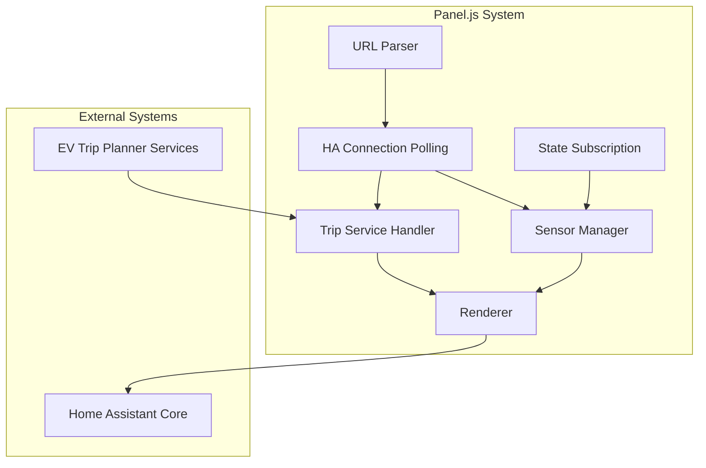
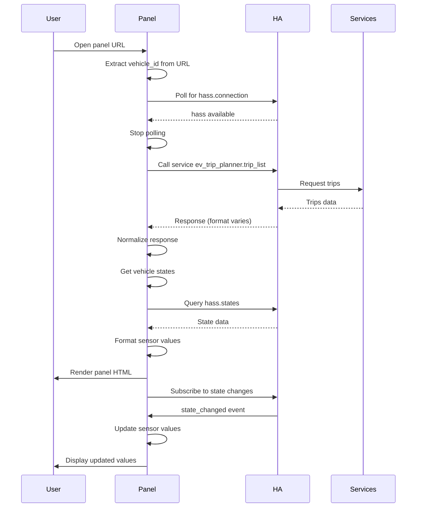

# Design: Fix Panel Trips Sensors

## Overview
Technical design for fixing EV Trip Panel bugs to display actual sensor values, load trips correctly, and enable trip management actions. Focuses on URL parsing robustness, service response handling, sensor value formatting, and rendering control to prevent race conditions.

## Architecture



## Components

### URL Parser
**Purpose**: Extract vehicle ID from panel URL with multiple fallback strategies

**Responsibilities**:
- Parse URL pathname with multiple formats
- Handle `/panel/` prefix variations
- Fallback to hash parsing
- Log extraction method for debugging

**Interfaces**:
```typescript
interface URLParser {
  extractVehicleId(url: URL): string | null;
  getExtractionMethod(): 'split' | 'regex' | 'hash' | null;
}

interface URLParserInput {
  pathname: string;
  hash: string;
}

interface URLParserOutput {
  vehicleId: string | null;
  method: 'split' | 'regex' | 'hash' | null;
}
```

### Trip Service Handler
**Purpose**: Call trip_list service and normalize response across HA versions

**Responsibilities**:
- Handle 3 response formats (direct, array, object)
- Combine recurring and punctual trips
- Validate response structure
- Log response format for debugging

**Interfaces**:
```typescript
interface TripServiceHandler {
  getTrips(vehicleId: string): Promise<Trip[]>;
  normalizeResponse(response: any): TripsData;
}

interface TripsData {
  recurring_trips: Trip[];
  punctual_trips: Trip[];
}

interface Trip {
  id: string;
  type: string;
  time: string;
  km?: number;
  kwh?: number;
  // ... trip properties
}
```

### Sensor Manager
**Purpose**: Collect and format vehicle sensor values for display

**Responsibilities**:
- Query hass.states for all vehicle entities
- Filter unavailable/unknown states (show as "N/A")
- Format values with appropriate decimals
- Group sensors by category

**Interfaces**:
```typescript
interface SensorManager {
  getVehicleStates(vehicleId: string): SensorMap;
  formatValue(entityId: string): string;
  groupSensors(sensors: SensorMap): SensorGroups;
}

interface SensorMap {
  [entityId: string]: SensorState;
}

interface SensorState {
  state: string;
  attributes: {
    unit_of_measurement?: string;
    device_class?: string;
  };
}

interface SensorGroups {
  status: SensorItem[];
  battery: SensorItem[];
  trips: SensorItem[];
  energy: SensorItem[];
  charging: SensorItem[];
  other: SensorItem[];
}
```

### State Subscription
**Purpose**: Real-time updates without page refresh

**Responsibilities**:
- Subscribe to state_changed events
- Match entity patterns for vehicle sensors
- Trigger value updates (not full re-render)
- Cleanup on disconnect

**Interfaces**:
```typescript
interface StateSubscription {
  subscribe(vehicleId: string, onUpdate: (entityId: string) => void): Unsubscribe;
  unsubscribe(): void;
}
```

### Renderer
**Purpose**: Render panel HTML and manage render state

**Responsibilities**:
- Write HTML to DOM
- Set `window._tripPanel` reference
- Manage `_rendered` flag timing
- Prevent re-rendering race conditions

**Interfaces**:
```typescript
interface Renderer {
  render(): Promise<void>;
  renderTripsSection(): Promise<void>;
  setRenderedFlag(completed: boolean): void;
}
```

## Data Flow



1. **Initialization**: Extract vehicle ID, poll for hass connection
2. **Data Fetching**: Call trip_list service, query hass.states for sensors
3. **Rendering**: Build HTML with formatted values, write to DOM
4. **Real-time Updates**: State subscription triggers value updates
5. **User Actions**: Service calls for trip CRUD operations

## Technical Decisions

| Decision | Options Considered | Choice | Rationale |
|----------|-------------------|--------|-----------|
| Vehicle ID extraction | Single method vs multiple | 3 fallback methods (split, regex, hash) | HA URL patterns may vary; redundancy ensures reliability |
| Trip response handling | Strict format vs flexible | Handle 3 formats (direct, array, object) | HA versions differ in service response wrapping |
| Sensor filtering | Filter N/A vs show N/A | Show "N/A" for unavailable states | Users need visibility into missing sensor data |
| Value formatting | Fixed decimals vs smart | Smart formatting by unit type | Better UX with appropriate precision |
| Polling strategy | Poll until hass vs event-based | Poll with _pollStarted flag | HA doesn't emit ready event for custom panels |
| Render control | Set flag immediately vs after trips | Set after trips section loads | Prevents early exit from connectedCallback |
| State updates | Re-render vs partial update | Partial update of sensor values | Better performance, no visual flicker |
| Entity patterns | Single pattern vs multiple | Multiple patterns with wildcards | Sensors may have different prefixes in different setups |

## Unresolved Questions
- What exact URL pattern does HA use for panel_custom? (verified patterns: `/panel/ev-trip-planner-{id}` and `/ev-trip-planner-{id}`)
- Does trip_list service always return both recurring_trips and punctual_trips keys?
- Should "N/A" sensors be collapsed or always visible?

## File Structure

| File | Action | Purpose |
|------|--------|---------|
| custom_components/ev_trip_planner/frontend/panel.js | Modify | Apply all fix patterns |

## Error Handling

| Error Scenario | Handling Strategy | User Impact |
|----------------|-------------------|-------------|
| Vehicle ID extraction fails | Show "No vehicle configured" message | Panel shows error, no data loaded |
| Service call fails | Show "Error loading trips" message | Trips section shows error |
| Sensor unavailable | Show "N/A" with entity ID on hover | User knows sensor missing |
| State subscription fails | Log error, continue with manual refresh | Degraded real-time updates |
| Trip CRUD fails | Show alert with error message | Action fails, user notified |

## Edge Cases

- **Edge case 1: Vehicle ID with special characters** -> URL encode in service calls, decode on extraction
- **Edge case 2: Empty trip list** -> Show "No trips" message, still show add button
- **Edge case 3: Sensor state changes during render** -> State subscription will update after render completes
- **Edge case 4: Multiple connectedCallback calls** -> `_pollStarted` flag prevents duplicate polling
- **Edge case 5: Trip list service returns different field names** -> Normalize to standard schema

## Test Strategy

### Unit Tests
- **URL extraction**: Test each method with various URL patterns
- **Response normalization**: Test all 3 response format variants
- **Value formatting**: Test percentage, distance, energy units
- **Sensor grouping**: Test categorization logic

### Integration Tests
- **Service calls**: Verify trip_list returns expected structure
- **State subscription**: Verify state updates trigger value refresh
- **CRUD operations**: Verify service calls complete successfully

## Performance Considerations

- **Polling**: Max 10 attempts, 500ms intervals = 5 second timeout
- **State subscription**: Single subscription, not per-sensor
- **Sensor queries**: Batch query all entities at once
- **Updates**: DOM updates only changed values, not full re-render

## Security Considerations

- **XSS prevention**: All user content escaped via `_escapeHtml()`
- **Service calls**: Validate vehicle_id format before service calls
- **Entity access**: Only query entities matching vehicle patterns

## Existing Patterns to Follow

Based on codebase analysis:

1. **Polling pattern**: `_pollStarted` flag + `_pollTimeout` for controlled polling
2. **Service call pattern**: `await this._hass.callService(domain, service, data)`
3. **State access pattern**: `this._hass.states instanceof Map` check
4. **Rendering pattern**: `_rendered` flag to prevent re-rendering
5. **Global reference pattern**: `window._tripPanel = this` for onclick handlers
6. **Error logging pattern**: `console.log` for debug, `console.error` for failures

---

## Implementation Steps

1. **Fix URL extraction** (lines 67-102)
   - Ensure all 3 methods work with `/panel/` prefix
   - Add method logging

2. **Fix response normalization** (lines 397-435)
   - Add array check: `Array.isArray(response) ? response[0] : response`
   - Add object check: `response?.result ? response.result : response`
   - Log response format

3. **Fix sensor filtering** (lines 2088-2110)
   - Change from filter to show "N/A" for unavailable
   - Keep filter only for truly invalid states

4. **Fix value formatting** (lines 1775-1831)
   - Percentages: 1 decimal
   - Energy (kWh): 2 decimals
   - Distance (km): 1 decimal
   - Boolean: "✓ Activo" / "✗ Inactivo"

5. **Fix render control** (lines 2007-2023, 2226-2233)
   - Set `_rendered = true` only after trips section loads
   - Check trips section presence before returning early

6. **Add debug logging** (all critical functions)
   - Log extraction method
   - Log response format
   - Log sensor counts
