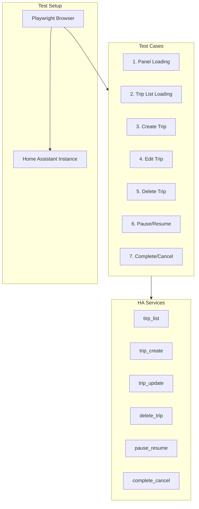
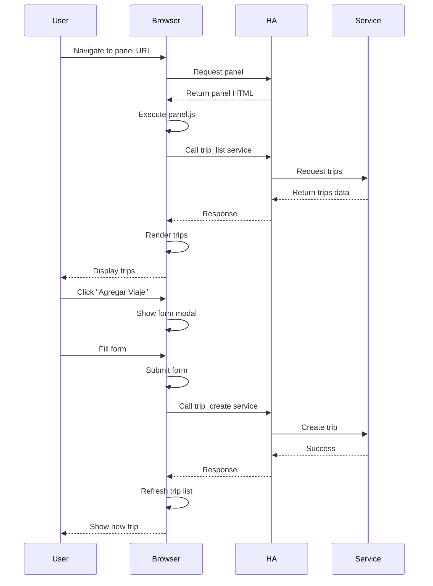

# Design: E2E Tests for Trip CRUD Panel

## Overview
Technical design for browser-based E2E tests that verify complete CRUD functionality of EV Trip Planner panel. Uses Playwright for browser automation.

## Architecture



## Components

### Test Base Class

```typescript
class TripPanelTestBase {
  page: Page;
  vehicleId: string = 'test-vehicle';
  haUrl: string = 'http://localhost:8123';

  async gotoPanel() {
    await this.page.goto(`${this.haUrl}/ev-trip-planner-${this.vehicleId}`);
  }

  async waitForPanel() {
    await this.page.waitForFunction(
      () => window._tripPanel !== undefined,
      { timeout: 30000 }
    );
  }

  async handleDialog() {
    // Handle confirmation dialogs
    this.page.on('dialog', async dialog => {
      await dialog.accept();
    });
  }
}
```

### Test Case: Panel Loading

```typescript
test('should load panel and extract vehicle ID', async ({ page }) => {
  const test = new TripPanelTestBase();
  await test.gotoPanel();
  await test.waitForPanel();

  // Verify panel header
  await expect(page.locator('.panel-header')).toContainText('Chispitas');
  await expect(page.locator('.panel-header')).toContainText('Morgan');
});
```

### Test Case: Trip List Loading

```typescript
test('should display trip list', async ({ page }) => {
  await test.gotoPanel();
  await test.waitForPanel();

  // Check for trips section
  await expect(page.locator('.trips-section')).toBeVisible();

  // Check for "No hay viajes" or trip cards
  const hasTrips = await page.locator('.trip-card').count() > 0;
  const hasNoTrips = await page.locator('.no-trips').count() > 0;
  expect(hasTrips || hasNoTrips).toBe(true);
});
```

### Test Case: Create Trip

```typescript
test('should create a new trip', async ({ page }) => {
  await test.gotoPanel();
  await test.waitForPanel();
  await test.handleDialog();

  // Open form
  await page.click('.add-trip-btn');
  await expect(page.locator('.trip-form-container')).toBeVisible();

  // Fill form
  await page.selectOption('#trip-type', 'recurrente');
  await page.fill('#trip-time', '08:00');
  await page.fill('#trip-km', '25.5');
  await page.fill('#trip-description', 'Test trip');

  // Submit
  await page.click('.btn-primary');

  // Verify trip created
  await expect(page.locator('.trip-card')).toHaveCount(1);
});
```

### Test Case: Edit Trip

```typescript
test('should edit an existing trip', async ({ page }) => {
  await test.gotoPanel();
  await test.waitForPanel();

  // Click edit button
  await page.click('.trip-card .edit-btn');
  await expect(page.locator('.trip-form-container')).toBeVisible();

  // Verify form pre-filled
  const timeValue = await page.locator('#trip-time').inputValue();
  expect(timeValue).toBeTruthy();

  // Modify and submit
  await page.fill('#trip-time', '10:00');
  await page.click('.btn-primary');

  // Verify update
  await page.waitForSelector('.trip-card');
  const newTime = await page.locator('.trip-card').textContent();
  expect(newTime).toContain('10:00');
});
```

### Test Case: Delete Trip

```typescript
test('should delete a trip', async ({ page }) => {
  await test.gotoPanel();
  await test.waitForPanel();

  // Count trips
  const initialCount = await page.locator('.trip-card').count();

  // Click delete
  await page.click('.trip-card .delete-btn');
  await test.page.waitForSelector('[role="alert"]');

  // Accept confirmation
  await test.page.evaluate(() => {
    const confirmBtn = document.querySelector('button[aria-label="Confirm"]');
    confirmBtn?.click();
  });

  // Verify deletion
  await expect(page.locator('.trip-card')).toHaveCount(initialCount - 1);
});
```

### Test Case: Pause/Resume

```typescript
test('should pause and resume a recurring trip', async ({ page }) => {
  await test.gotoPanel();
  await test.waitForPanel();

  // Pause trip
  await page.click('.trip-card .pause-btn');
  await page.waitForSelector('.trip-card.inactive');

  // Verify inactive state
  await expect(page.locator('.trip-card.inactive')).toBeVisible();

  // Resume trip
  await page.click('.trip-card .resume-btn');
  await page.waitForSelector('.trip-card.active');

  // Verify active state
  await expect(page.locator('.trip-card.active')).toBeVisible();
});
```

### Test Case: Complete/Cancel

```typescript
test('should complete or cancel a punctual trip', async ({ page }) => {
  await test.gotoPanel();
  await test.waitForPanel();

  // Count trips
  const initialCount = await page.locator('.trip-card').count();

  // Complete trip
  await page.click('.trip-card .complete-btn');

  // Verify trip removed
  await expect(page.locator('.trip-card')).toHaveCount(initialCount - 1);
});
```

## Data Flow



## Test Strategy

### Browser Automation vs Static Analysis

| Approach | Pros | Cons |
|----------|------|------|
| **Browser Automation** | Tests actual user flow, catches UI bugs, verifies service integration | Slower, more fragile, requires HA instance |
| **Static Analysis** | Fast, reliable, no HA instance needed | Doesn't catch runtime bugs |

**Decision**: Implement both:
- Browser tests for critical user flows (create, edit, delete)
- Static analysis for code structure validation

## Test Environment

### Requirements

1. **Home Assistant Instance**
   - URL: `http://localhost:8123` (or configurable)
   - EV Trip Planner integration installed
   - Test vehicle configured

2. **Browser**
   - Playwright installed
   - Chrome, Firefox, or Safari

3. **Test Data**
   - Pre-existing trips for edit/delete tests
   - Clean state for create tests

### Configuration

```typescript
// playwright.config.ts
const config: PlaywrightTestConfig = {
  webServer: {
    command: 'ha core start',
    url: 'http://localhost:8123',
    timeout: 120000,
  },
  testDir: 'tests/e2e',
  timeout: 60000, // 60 seconds per test
  use: {
    headless: true,
    screenshot: 'on-failure',
    video: 'on-failure',
  },
};
```

## Error Handling

### Common Issues

| Issue | Solution |
|-------|----------|
| Panel not loading | Increase timeout, check vehicle ID |
| Service call failing | Ensure HA is running, check integration |
| Form not opening | Wait for DOM, check button visibility |
| Confirmation dialog | Use page.on('dialog') handler |
| Race conditions | Use page.waitForSelector |

### Retry Strategy

```typescript
test('should create a trip with retries', async ({ page }, testInfo) => {
  let retries = 3;
  while (retries > 0) {
    try {
      await test.gotoPanel();
      await test.waitForPanel();
      // ... test logic
      break;
    } catch (error) {
      retries--;
      if (retries === 0) throw error;
      await sleep(5000); // Wait 5 seconds before retry
    }
  }
});
```

## Implementation Plan

1. **Phase 1**: Panel Loading Test
2. **Phase 2**: Trip List Loading Test
3. **Phase 3**: Create Trip Test
4. **Phase 4**: Edit Trip Test
5. **Phase 5**: Delete Trip Test
6. **Phase 6**: Pause/Resume Test
7. **Phase 7**: Complete/Cancel Test

## Verification Checklist

- [ ] All 7 test cases implemented
- [ ] Tests pass in Chrome
- [ ] Tests pass in Firefox
- [ ] Tests pass in Safari
- [ ] Tests run in < 5 minutes
- [ ] No flaky tests
- [ ] Tests integrated in CI/CD
