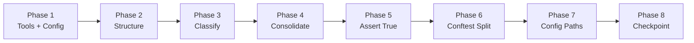
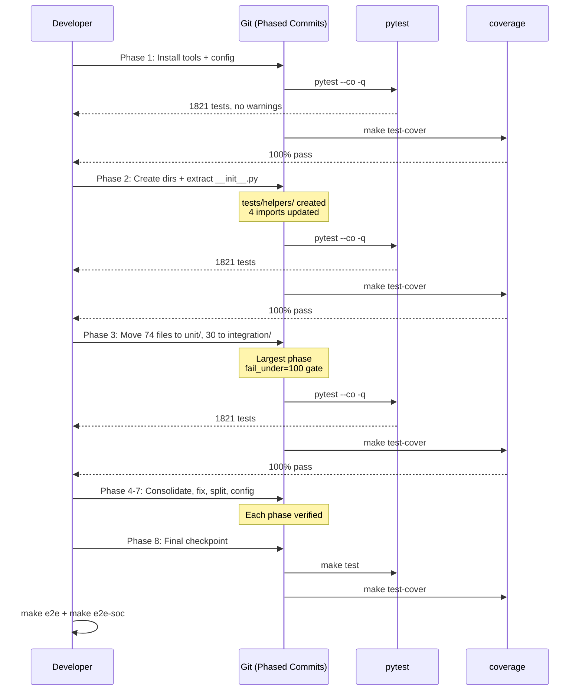

# Design: Test Architecture Reorganization

## Overview

Reorganize 104 flat Python test files (1,821 tests, 60,220 LOC) into `tests/unit/`, `tests/integration/`, `tests/e2e/`, `tests/fixtures/`, `tests/helpers/` layer structure. Eight phased commits, each gated by `fail_under=100`. No source code changes. Classification uses HA import heuristic validated by BMAD Party Mode. Consolidation reduces trip_manager files from 18 to 3 and config_flow files from 6 to 2. Conftest split from 702 LOC monolith to scoped hierarchy.

## Architecture


## Phase Architecture



| Phase | Commit Scope | Risk | Files Changed | Revert If |
|-------|-------------|------|---------------|-----------|
| 1 | Install tools, configure pytest strict/importlib/markers | LOW | pyproject.toml, .pre-commit-config.yaml | Tests fail (unlikely) |
| 2 | Create dirs, extract `__init__.py` to helpers/ | MEDIUM | ~10 new files, 4 import updates | Import errors |
| 3 | Move files to unit/ or integration/ | HIGH | 104 file moves | Coverage < 100% |
| 4 | Consolidate trip/config_flow/coverage/bug files | HIGH | 40+ file merges + deletes | Lost assertions |
| 5 | Fix 2 `assert True` violations | LOW | 2 files | Coverage drops |
| 6 | Split conftest.py, eliminate mock_hass duplication | HIGH | conftest.py + 28 files | Fixture resolution breaks |
| 7 | Update pyproject.toml, Makefile, mutmut paths | MEDIUM | 3 config files | make test fails |
| 8 | Final checkpoint: baseline + e2e verification | LOW | 0 files | Any regression |

**Verification after EVERY phase**: `make test` passes, `make test-cover` passes with 100%, test count >= 1,821.

## Components

### Component 1: Directory Structure

**Purpose**: Layer-based test organization per ARN-008.

**Structure**:
```text
tests/
  conftest.py                  # Root: shared fixtures only (~120 LOC)
  panel.test.js                # Jest test (stays in root)
  setup_entry.py               # CLI utility (stays in root)
  unit/                        # 74 files: no HA imports
    conftest.py                # Unit-specific mock fixtures
    test_calculations.py
    test_trip_manager_core.py
    ...
  integration/                 # 30 files: HA framework imports
    conftest.py                # HA framework fixtures
    test_config_flow.py
    test_init.py
    ...
  e2e/                         # TypeScript (unchanged)
  e2e-dynamic-soc/             # TypeScript (unchanged)
  fixtures/                    # Test data (unchanged)
  helpers/                     # Extracted from __init__.py
    __init__.py                # Re-exports for backward compat
    constants.py               # TEST_VEHICLE_ID, TEST_CONFIG, etc.
    fakes.py                   # FakeTripStorage, FakeEMHASSPublisher
    factories.py               # create_mock_trip_manager, create_mock_coordinator, create_mock_ev_config_entry
```text

### Component 2: Classification System

**Primary classifier**: HA import heuristic.

| Signal | Unit | Integration |
|--------|------|-------------|
| `from homeassistant` / `import homeassistant` | No | Yes |
| `MockConfigEntry` usage | No | Yes |
| `async_setup_entry` test pattern | No | Yes |
| `hass.config_entries` interaction | No | Yes |
| Only `custom_components.*` + stdlib imports | Yes | No |

**Validation pipeline**:
1. **Automated classification script**: Scans all 104 files for HA import patterns
2. **BMAD Party Mode validation**: Specialist agents review edge cases (files with ambiguous signals)
3. **Adversarial resolution**: Disagreements resolved by examining actual test behavior

**Classification results** (30 integration, 74 unit):

**Integration (30 files)** -- files with `from homeassistant` or `import homeassistant`:

| File | HA Pattern | Target Location |
|------|-----------|----------------|
| test_config_entry_not_ready.py | HA imports | integration/ |
| test_config_flow_core.py | HA imports | integration/ |
| test_config_flow_milestone3.py | HA imports | integration/ |
| test_config_flow_missing.py | HA imports | integration/ |
| test_config_flow.py | HA imports | integration/ |
| test_config_updates.py | HA imports | integration/ |
| test_coordinator.py | HA imports | integration/ |
| test_coverage_edge_cases.py | HA imports | integration/ |
| test_emhass_adapter.py | HA imports | integration/ |
| test_emhass_soft_delete.py | HA imports | integration/ |
| test_functional_emhass_sensor_updates.py | HA imports | integration/ |
| test_init.py | HA imports | integration/ |
| test_integration_uninstall.py | HA imports | integration/ |
| test_migrate_entry.py | HA imports | integration/ |
| test_notifications.py | HA imports | integration/ |
| test_parse_trip_datetime_error_paths.py | HA imports | integration/ |
| test_post_restart_persistence.py | HA imports | integration/ |
| test_power_profile_tdd.py | HA imports | integration/ |
| test_presence_monitor.py | HA imports | integration/ |
| test_presence_monitor_soc.py | HA imports | integration/ |
| test_renault_integration_issues.py | HA imports | integration/ |
| test_restore_sensor.py | HA imports | integration/ |
| test_sensor_coverage.py | HA imports | integration/ |
| test_services_core.py | HA imports | integration/ |
| test_trip_calculations.py | HA imports | integration/ |
| test_trip_emhass_sensor.py | HA imports | integration/ |
| test_trip_manager_core.py | HA imports | integration/ |
| test_trip_manager_power_profile.py | HA imports | integration/ |
| test_user_real_data_simple.py | HA imports | integration/ |
| test_vehicle_controller.py | HA imports | integration/ |

**Unit (74 files)** -- no HA imports, only `custom_components.*` and stdlib:

All remaining files (full list in research.md). Key groups:
- Calculations: test_calculations.py, test_charging_window*.py, test_dynamic_soc_capping.py
- EMHASS pure: test_emhass_ceil.py, test_emhass_datetime.py, test_emhass_index_*.py
- Dashboard: test_dashboard*.py
- Sensor: test_sensor_attributes.py, test_sensor_exists_fn.py
- Bug regression: test_*_bug*.py (14 files)
- Coverage-driven: test_*coverage*.py, test_*missing*.py (26 files)

### Component 3: Helpers Extraction

**Purpose**: Extract 198 LOC from `tests/__init__.py` to `tests/helpers/`.

**File mapping**:

| Source (tests/__init__.py) | Target | Contents |
|---------------------------|--------|----------|
| CONSTANTS section (lines 10-53) | tests/helpers/constants.py | TEST_VEHICLE_ID, TEST_ENTRY_ID, TEST_CONFIG, TEST_TRIPS, TEST_COORDINATOR_DATA |
| FakeTripStorage, FakeEMHASSPublisher | tests/helpers/fakes.py | Two fake test doubles |
| create_mock_trip_manager, create_mock_coordinator, create_mock_ev_config_entry, setup_mock_ev_config_entry | tests/helpers/factories.py | Four factory functions |
| (new file) | tests/helpers/__init__.py | Re-exports all public symbols for backward compatibility |

**Import migration** (4 files currently import from `tests`):

| File | Current Import | Updated Import |
|------|---------------|----------------|
| test_coverage_100_percent.py | `from tests import TEST_ENTRY_ID, TEST_VEHICLE_ID` | `from tests.helpers import TEST_ENTRY_ID, TEST_VEHICLE_ID` |
| test_trip_manager_missing_coverage.py | `from tests import create_mock_ev_config_entry` | `from tests.helpers import create_mock_ev_config_entry` |
| test_trip_manager_cover_more.py | `from tests import FakeTripStorage, create_mock_ev_config_entry` | `from tests.helpers import FakeTripStorage, create_mock_ev_config_entry` |
| test_trip_manager_core.py | `from tests import FakeTripStorage` (inline) | `from tests.helpers import FakeTripStorage` |

**Constraint**: `tests/helpers/__init__.py` re-exports all symbols so `from tests.helpers import X` works. Old `tests/__init__.py` is replaced with a re-export shim to prevent breakage.

### Component 4: Conftest Hierarchy

**Purpose**: Split 702 LOC monolith into scoped fixtures.

**Current conftest.py (23 fixtures)** -- classification:

| Fixture | Scope | Used By | Layer |
|---------|-------|---------|-------|
| mock_datetime_2026_05_04_monday_0800_utc | function | Tests needing time mock | Root (cross-cutting) |
| enable_custom_integrations | function | HA integration setup | Integration |
| mock_frame_reporting | autouse | All tests (HA compat) | Root (HA compat shim) |
| mock_input_text_entity | function | Input entity tests | Integration |
| mock_input_text_entity_with_trips | function | Input entity tests | Integration |
| vehicle_id | function | Multiple tests | Root |
| hass | function | Tests needing full hass mock | Integration |
| mock_hass | function | Tests needing minimal hass mock | Unit (also some integration) |
| mock_store | function | Storage-dependent tests | Root |
| mock_store_class | function | HA Store mocking | Integration |
| mock_entity_registry | function | Config flow tests | Integration |
| mock_device_registry | function | Config flow tests | Integration |
| mock_config_entries | function | Config flow tests | Integration |
| mock_flow_manager | function | Config flow tests | Integration |
| mock_er_async_get | function | Entity registry tests | Integration |
| mock_hass_with_entity_registry | function | Config flow tests | Integration |
| sample_vehicle_config | function | Config data tests | Root |
| sample_emhass_config | function | EMHASS config tests | Root |
| sample_presence_config | function | Presence tests | Root |
| sample_notification_config | function | Notification tests | Root |
| trip_manager_with_entry_id | function | TripManager tests | Integration |
| trip_manager_no_entry_id | function | TripManager tests | Unit |
| _make_mock_datetime_fixture | internal | Factory helper | Root |

**Target conftest split**:

| File | Fixtures | LOC Target |
|------|----------|------------|
| `tests/conftest.py` (root) | mock_datetime, mock_frame_reporting, vehicle_id, mock_store, sample_*_config, _make_mock_datetime_fixture | ~120 LOC |
| `tests/unit/conftest.py` | mock_hass (minimal version), trip_manager_no_entry_id | ~40 LOC |
| `tests/integration/conftest.py` | hass (full mock), enable_custom_integrations, mock_input_text_*, mock_store_class, mock_entity/device_registry, mock_config_entries, mock_flow_manager, mock_er_async_get, mock_hass_with_entity_registry, trip_manager_with_entry_id | ~540 LOC |

### Component 5: Consolidation Strategy

#### Trip Manager Tests (18 files -> 3)

| Target File | Source Files | LOC | Tests | Content |
|-------------|-------------|-----|-------|---------|
| test_trip_manager_core.py | test_trip_manager.py (2238), test_trip_manager_core.py (3214), test_trip_manager_fix_branches.py (166) | ~5600 | ~133 | CRUD, lifecycle, branches |
| test_trip_manager_calculations.py | test_trip_manager_calculations.py (190), test_trip_manager_more_coverage.py (317), test_trip_manager_missing_coverage.py (92), test_trip_manager_cover_more.py (123), test_trip_manager_cover_line1781.py (110) | ~830 | ~19 | Calculations, coverage gaps |
| test_trip_manager_integration.py | test_trip_manager_emhass.py (332), test_trip_manager_sensor_hooks.py (161), test_trip_manager_entry_lookup.py (89), test_trip_manager_power_profile.py (66), test_trip_manager_datetime_tz.py (138) | ~786 | ~13 | EMHASS, sensors, entry, datetime |

Remaining 5 `test_trip_*.py` files (not `test_trip_manager*`):

| File | LOC | Tests | Disposition |
|------|-----|-------|-------------|
| test_trip_calculations.py | 205 | 5 | Keep separate (different scope) |
| test_trip_create_branches.py | 222 | 3 | Keep separate (service layer) |
| test_trip_crud.py | 1186 | 0 | Keep separate (large, CRUD focused) |
| test_trip_emhass_sensor.py | 550 | 8 | Keep separate (EMHASS sensor specific) |
| test_trip_id_generation.py | 278 | 0 | Keep separate (ID generation) |

#### Config Flow Tests (6 files -> 2)

| Target File | Source Files | LOC | Tests | Content |
|-------------|-------------|-----|-------|---------|
| test_config_flow.py | test_config_flow.py (936), test_config_flow_core.py (200), test_config_flow_issues.py (236) | ~1370 | ~38 | Core flow, issues |
| test_config_flow_options.py | test_config_flow_milestone3.py (989), test_config_flow_milestone3_1_ux.py (147), test_config_flow_missing.py (728) | ~1860 | ~42 | Options, UX, missing coverage |

#### Coverage-Driven Files (26 files -> renamed/merged)

Strategy: Rename to behavior-based names. Merge into parent module files when small.

| Group | Files | Disposition |
|-------|-------|-------------|
| Dashboard coverage (3) | test_dashboard_cover.py, test_dashboard_missing.py, test_dashboard_coverage_missing.py | Merge into test_dashboard.py |
| Sensor coverage (1) | test_sensor_coverage.py (1786 LOC) | Rename to test_sensor_integration.py |
| Coverage edge cases (1) | test_coverage_edge_cases.py (1354 LOC) | Rename to test_emhass_integration_edge_cases.py |
| Missing coverage (2) | test_missing_coverage.py, test_coverage_remaining.py | Merge into test_init_coverage.py |
| 100% coverage (1) | test_coverage_100_percent.py | Rename to test_init_full_coverage.py |
| Trip manager coverage (5) | test_trip_manager_cover_line1781.py, test_trip_manager_cover_more.py, test_trip_manager_missing_coverage.py, test_trip_manager_more_coverage.py, test_trip_manager_calculations.py | Merge into consolidated trip files |
| EMHASS coverage (1) | test_emhass_adapter_trip_id_coverage.py | Rename to test_emhass_adapter_trip_id.py |
| Config flow missing (1) | test_config_flow_missing.py | Merge into consolidated config flow file |

#### Bug Regression Files (14 files -> renamed/merged)

Strategy: Rename to behavior-based names. Merge into module files when tests target same module.

| File | Disposition | Target Name/Location |
|------|-------------|---------------------|
| test_aggregated_sensor_bug.py | Rename | test_sensor_aggregation.py |
| test_charging_window_bug_fix.py | Rename | test_charging_window_edge_cases.py |
| test_def_end_bug_red.py | Rename | test_deferrable_end_boundary.py |
| test_def_start_window_bug.py | Rename | test_deferrable_start_boundary.py |
| test_def_total_hours_mismatch_bug.py | Rename | test_deferrable_hours_calculation.py |
| test_def_total_hours_window_mismatch.py | Rename | test_deferrable_hours_window.py |
| test_emhass_adapter_def_end_bug.py | Rename | test_emhass_deferrable_end.py |
| test_emhass_arrays_ordering_bug.py | Rename | test_emhass_array_ordering.py |
| test_emhass_index_persistence_bug.py | Rename | test_emhass_index_persistence.py |
| test_emhass_publish_bug.py | Rename | test_emhass_publish_edge_cases.py |
| test_recurring_day_offset_bug.py | Rename | test_recurring_day_offset.py |
| test_soc_100_p_deferrable_nom_bug.py | Rename | test_soc_100_deferrable_nominal.py |
| test_soc_100_propagation_bug.py | Rename | test_soc_100_propagation.py |
| test_timezone_utc_vs_local_bug.py | Rename | test_timezone_utc_vs_local.py |

### Component 6: Config Changes

#### pyproject.toml

```toml
[tool.pytest.ini_options]
testpaths = ["tests/unit", "tests/integration"]
pythonpath = ["."]
python_files = ["test_*.py"]
python_classes = "Test*"
python_functions = "test_*"
addopts = [
    "-v",
    "--strict-markers",
    "--strict-config",
]
asyncio_mode = "auto"
asyncio_default_fixture_loop_scope = "function"
import_mode = "importlib"
markers = [
    "unit: pure Python logic, no HA framework",
    "integration: tests with HA framework types",
    "slow: tests taking >1s",
]
filterwarnings = [
    "ignore:Inheritance class.*:DeprecationWarning",
    "ignore::pytest.PytestDeprecationWarning",
]

[tool.mutmut]
tests_dir = ["tests/unit/", "tests/integration/"]
```

#### Makefile

| Target | Current | Target |
|--------|---------|--------|
| test | `pytest tests --ignore=tests/e2e/` | `pytest tests/unit tests/integration` |
| test-cover | `pytest tests --cov=... --ignore=tests/e2e/` | `pytest tests/unit tests/integration --cov=...` |
| test-verbose | `pytest tests -vv -s --ignore=tests/e2e/` | `pytest tests/unit tests/integration -vv -s` |
| test-parallel | `pytest tests --ignore=tests/e2e/ -n auto` | `pytest tests/unit tests/integration -n auto` |
| test-random | `pytest tests --ignore=tests/e2e/ --random-order` | `pytest tests/unit tests/integration --random-order` |
| test-dashboard | `pytest tests --cov=... --ignore=tests/e2e/` | `pytest tests/unit tests/integration --cov=...` |
| htmlcov | `pytest tests --cov=...` | `pytest tests/unit tests/integration --cov=...` |
| lint | `pylint custom_components/ tests/` | `pylint custom_components/ tests/unit/ tests/integration/` |
| dead-code | `vulture custom_components/ tests/` | `vulture custom_components/ tests/unit/ tests/integration/` |
| refurb | `refurb custom_components/ tests/` | `refurb custom_components/ tests/unit/ tests/integration/` |

#### .pre-commit-config.yaml

Add flake8-pytest-style hook (if available as pre-commit repo) or configure via flake8 section. Bandit `exclude: tests/` remains correct -- tests are still under `tests/` root.

## Data Flow



## Technical Decisions

| Decision | Options Considered | Choice | Rationale |
|----------|-------------------|--------|-----------|
| Classification method | Pure heuristic, manual review, BMAD-only, heuristic+BMAD | Heuristic + BMAD Party Mode | Heuristic is fast for 80% of files; BMAD catches edge cases. Dual validation minimizes misclassification. |
| Phase ordering | Tools-first, structure-first, mixed | Tools + config first | Zero file moves in Phase 1 = zero risk. Establishes pytest strict/importlib before moves need them. |
| `__init__.py` extraction timing | With moves, before moves, after moves | Before moves (separate commit) | 4 files import from it. Extraction is low-risk standalone. Must be separate per constraint C-5. |
| Conftest split timing | Before moves, after moves, with moves | After consolidation (Phase 6) | Moving files first establishes which fixtures belong where. Premature split risks fixture resolution errors. |
| File move granularity | One-at-a-time, batched by module, all-at-once | All-at-once per layer | Single commit for all moves = single revert point. `import_mode=importlib` prevents sys.path issues. |
| Coverage-driven file strategy | Delete, rename only, merge+rename | Merge+rename | Tests have value. Renaming improves discoverability. Merging small files into parent reduces count. |
| Bug test strategy | Keep all separate, merge all, rename+merge | Rename+selective merge | Rename removes _bug suffix. Merge when tests target same module. Keep separate when targeting different concerns. |
| mock_hass consolidation | Single fixture, per-layer fixtures, keep inline | Per-layer fixtures in conftest.py | Unit tests need minimal mock. Integration tests need full hass mock. Layer conftest provides correct version. |
| `tests_excluded_from_mutmut/` | Move into structure, leave as-is, delete | Leave as-is, document rationale | Spec 5 owns mutmut configuration. Moving files now may break mutmut exclusions. Defer disposition. |

## Error Handling

| Error Scenario | Handling Strategy | User Impact |
|----------------|-------------------|-------------|
| Phase fails `fail_under=100` | `git revert HEAD`; fix import; re-commit | Dev sees which file has uncovered line |
| Import error after file move | `git revert HEAD`; check `import_mode=importlib` config | Dev sees ModuleNotFoundError |
| Lost assertion during consolidation | `git revert HEAD`; re-examine diff for missing assertions | Detected by coverage drop |
| Circular import in helpers extraction | Split re-export shim; use lazy imports | Dev sees ImportError |
| Fixture not found after conftest split | Check fixture scope chain; add to correct conftest | Dev sees fixture not found error |
| mutmut cannot find tests after path update | Check `tests_dir` config; verify paths | Dev sees empty test list |
| E2E tests fail after Python changes | Investigate -- should be unrelated; verify no JS touched | Dev sees Playwright failure |
| Test count drops below 1,821 | `git revert HEAD`; check for accidentally deleted test | Dev sees test count change |

## Edge Cases

- **`panel.test.js`**: Must stay in `tests/` root. It uses Jest, not Playwright. Moving to e2e/ would break it.
- **`setup_entry.py`**: Stays in `tests/` root. It is a CLI utility, not a test.
- **`tests_excluded_from_mutmut/`**: Not moved. Document rationale. Spec 5 owns mutmut configuration.
- **`tests/__init__.py` re-export shim**: After extracting to helpers/, old `tests/__init__.py` becomes a re-export wrapper so any remaining `from tests import X` still works during transition.
- **Files with both unit and integration tests**: Split tests into two files by layer if single file mixes patterns.
- **Autouse fixtures**: `mock_frame_reporting` is autouse. Must remain in root conftest -- applies to all layers.
- **Async fixtures**: conftest.py has zero async fixtures currently. Split maintains this -- no new async fixtures.
- **pytest-randomly**: Run `make test-random` after each phase to prove test independence post-reorganization.

## Test Strategy

### Test Double Policy

| Type | What it does | When to use |
|------|-------------|-------------|
| **Stub** | Returns predefined data | Isolate from I/O; only SUT output matters |
| **Fake** | Simplified real implementation | Need real behavior without real infrastructure |
| **Mock** | Verifies interactions | Interaction IS the observable outcome |
| **Fixture** | Predefined data state | Known initial data for tests |

### Mock Boundary

| Component | Unit test | Integration test | Rationale |
|-----------|-----------|------------------|-----------|
| conftest.py (root fixtures) | Real | Real | Own test infrastructure -- test it real |
| conftest.py (unit fixtures) | Real | N/A | Own code, test directly |
| conftest.py (integration fixtures) | N/A | Real | Own code, test directly |
| helpers/fakes.py | Real | Real | Own test doubles -- verify they implement correct interface |
| helpers/factories.py | Real | Real | Own factory functions -- verify they return correct mocks |
| helpers/constants.py | Real | Real | Own constants -- verify values |
| Classification script | Real | N/A | Own utility -- verify classification accuracy |
| File move operations | N/A | Real (pytest --co) | Verify all tests discovered post-move |
| pyproject.toml config | Real (pytest reads it) | Real | Verify strict mode catches issues |
| Makefile targets | Real (make test) | Real | Verify paths correct |

### Fixtures and Test Data

| Component | Required state | Form |
|-----------|---------------|------|
| helpers/fakes.py | FakeTripStorage with empty data, with initial data | Factory fn `FakeTripStorage(initial_data={...})` |
| helpers/fakes.py | FakeEMHASSPublisher with published_trips tracking | Constructor `FakeEMHASSPublisher()` |
| helpers/factories.py | MagicMock(spec=TripManager) with async stubs | Factory fn `create_mock_trip_manager()` |
| helpers/factories.py | MagicMock(spec=TripPlannerCoordinator) | Factory fn `create_mock_coordinator()` |
| helpers/factories.py | MockConfigEntry with test config | Factory fn `create_mock_ev_config_entry()` |
| conftest.py (root) | Fixed datetime 2026-05-04 08:00 UTC | Fixture `mock_datetime_2026_05_04_monday_0800_utc` |
| conftest.py (integration) | Full hass mock with states, services, config | Fixture `hass` |
| conftest.py (unit) | Minimal hass mock (config only) | Fixture `mock_hass` |
| pyproject.toml | pytest strict mode, importlib, markers | Config file |
| Makefile | Updated test paths | Config file |

### Test Coverage Table

| Component / Function | Test type | What to assert | Test double |
|---------------------|-----------|----------------|-------------|
| helpers/constants.py values | unit | TEST_VEHICLE_ID == "coche1", TEST_CONFIG has expected keys | none |
| FakeTripStorage.async_load/save | unit | Load returns initial data; save persists new data | none |
| FakeEMHASSPublisher tracking | unit | published_trips appended; removed_trip_ids tracked | none |
| create_mock_trip_manager | unit | Returns MagicMock(spec=TripManager); async stubs configured | none |
| create_mock_coordinator | unit | Returns MagicMock(spec=TripPlannerCoordinator); data seeded | none |
| helpers/__init__.py re-exports | unit | All public symbols importable from `tests.helpers` | none |
| conftest root fixtures | integration | mock_datetime patches datetime correctly; vehicle_id returns string | Stub datetime |
| conftest unit fixtures | unit | mock_hass returns minimal MagicMock; config attributes set | none |
| conftest integration fixtures | integration | hass fixture has states dict, services mock, async_run_hass_job | Stub hass |
| pyproject.toml strict mode | integration | pytest rejects unknown markers; strict_config catches typos | none |
| pyproject.toml importlib mode | integration | Tests in subdirectories discovered and run | none |
| File classification accuracy | unit | 30 files classified integration; 74 classified unit | none |
| Post-move test discovery | integration | `pytest --co -q` returns 1,821 tests | none |
| Post-move coverage | integration | `make test-cover` passes with fail_under=100 | none |
| E2E isolation | e2e | `make e2e` passes unchanged | none |
| Makefile paths | integration | `make test` discovers all tests from new paths | none |
| mutmut discovery | integration | `mutmut run --list` finds all Python test files | none |
| assert True elimination | unit | `grep -r "assert True" tests/` returns 0 Python matches | none |
| assert True replacement assertions | unit | New assertions test real behavior (not placeholders) | none |

### Test File Conventions

- **Test runner**: pytest 9.0.0 (verified)
- **Test file location**: `tests/unit/test_*.py` and `tests/integration/test_*.py` (co-located)
- **Integration test pattern**: Files in `tests/integration/` (no separate naming suffix)
- **E2E test pattern**: `tests/e2e/*.spec.ts` and `tests/e2e-dynamic-soc/*.spec.ts` (Playwright, unchanged)
- **Mock cleanup**: No current cleanup convention; `import_mode=importlib` handles module isolation
- **Fixture/factory location**: `tests/helpers/` (constants.py, fakes.py, factories.py)
- **Conftest hierarchy**: `tests/conftest.py` (root), `tests/unit/conftest.py`, `tests/integration/conftest.py`
- **Unit test command**: `make test` (targets `tests/unit tests/integration`)
- **Coverage command**: `make test-cover` (fail_under=100)
- **E2E command**: `make e2e` and `make e2e-soc`
- **Markers**: `@pytest.mark.unit`, `@pytest.mark.integration`, `@pytest.mark.slow` (registered, not yet applied to tests)

## Performance Considerations

- `import_mode=importlib` eliminates sys.path manipulation overhead for subdirectory tests
- No change to test execution time expected (same tests, different locations)
- NFR-7: No more than 10% increase in test suite duration
- pytest-xdist parallel execution unaffected by directory reorganization

## Security Considerations

- No security implications -- test code only, no source changes
- flake8-pytest-style may catch insecure pytest patterns (fixture injection, marker misuse)
- Bandit exclusion (`exclude: tests/`) remains correct after reorganization

## Existing Patterns to Follow

- FakeTripStorage/FakeEMHASSPublisher are correct Meszaros "Fake" doubles -- keep pattern
- `create_mock_trip_manager()` uses `MagicMock(spec=TripManager)` -- correct spec'd mock pattern
- `asyncio_mode = "auto"` in pyproject.toml -- maintain
- `asyncio_default_fixture_loop_scope = "function"` -- maintain
- Filterwarnings for HA deprecation warnings -- maintain
- `pythonpath = ["."]` -- maintain for source imports

## Unresolved Questions

1. **BMAD Party Mode execution**: When to run the specialist agent validation? During Phase 3 implementation, or as a pre-implementation review?
2. **Marker application timing**: This spec registers markers but does not apply `@pytest.mark.unit/integration` to tests. When? Deferred to implementation phase or separate spec?
3. **test_trip_crud.py (1186 LOC, 0 tests detected by grep)**: Need to verify -- may use class-based tests or dynamic generation. Consolidation plan depends on actual test count.
4. **test_missing_coverage.py assert True**: Line 551 -- need to understand what code path it covers before replacing. May need to examine source code at that line.
5. **test_init.py assert True**: Line 830 -- "Placeholder implementation - cleanup not yet active". Need to verify if cleanup is now active (source may have changed since test written).

## Implementation Steps

1. **Phase 1** -- Install time-machine, flake8-pytest-style, hypothesis in pyproject.toml. Configure pytest `strict=true`, `import_mode=importlib`, markers. Verify `make test` passes.
2. **Phase 2** -- Create `tests/helpers/` with constants.py, fakes.py, factories.py, __init__.py. Update 4 import statements. Update `tests/__init__.py` to re-export shim. Verify `make test-cover` passes.
3. **Phase 3** -- Run classification script. BMAD Party Mode validation. Move 74 files to `tests/unit/`, 30 files to `tests/integration/`. Create layer conftest.py stubs. Verify 1,821 tests at 100%.
4. **Phase 4** -- Consolidate trip_manager files (18->3). Consolidate config_flow files (6->2). Rename coverage-driven files. Rename bug regression files. Verify after each sub-group.
5. **Phase 5** -- Fix assert True in test_missing_coverage.py (line 551) and test_init.py (line 830). Replace with real assertions or remove tests. Verify `grep -r "assert True" tests/` returns 0.
6. **Phase 6** -- Split conftest.py into root + unit + integration. Eliminate 28 inline mock_hass definitions. Update affected test files to use conftest fixtures. Verify.
7. **Phase 7** -- Update `testpaths`, mutmut `tests_dir`, Makefile targets. Update lint/dead-code/refurb paths. Verify `make test`, `make test-cover`, `mutmut run --list`.
8. **Phase 8** -- Run `make test`, `make test-cover`, `make e2e`, `make e2e-soc`. Capture final metrics. Compare with baseline.
