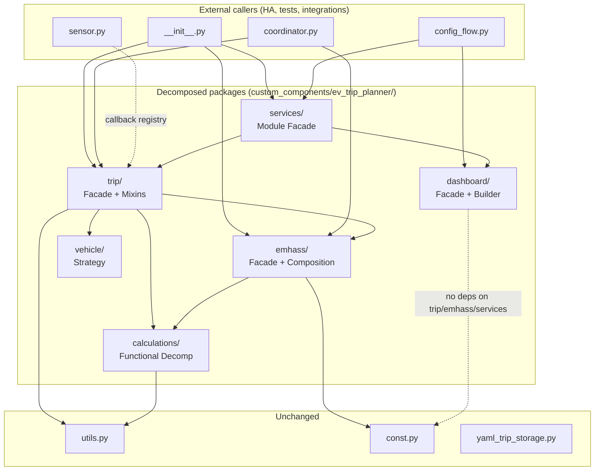
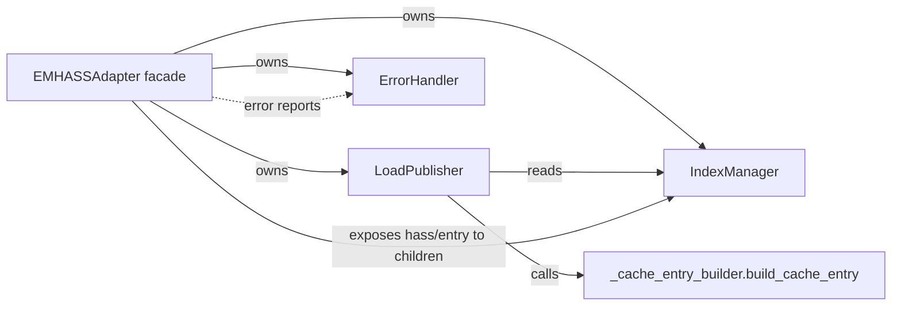
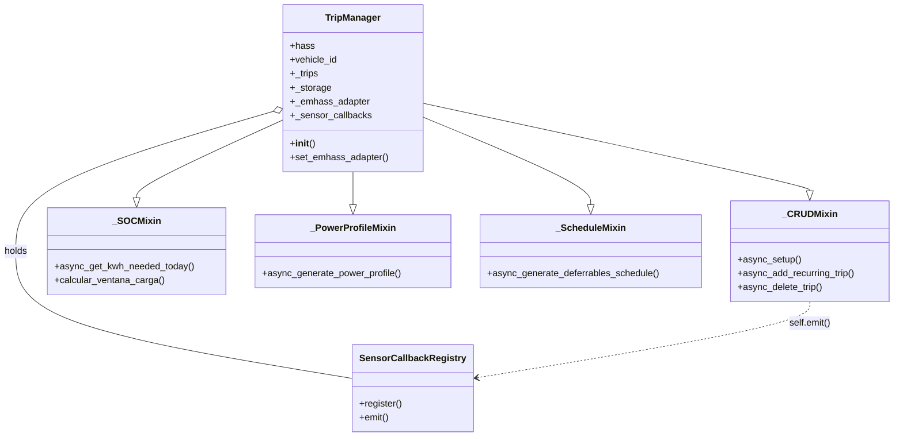

# Design: 3-solid-refactor

> WHAT (measurable outcomes) → `requirements.md`. HOW (file/class/mixin names, patterns, mechanics) → THIS file.
> Requirements specify *that* SOLID compliance must hold. Design specifies *how* the structure produces it.

## 1. Architecture Overview

Decompose 9 god modules (`emhass_adapter.py`, `trip_manager.py`, `services.py`, `dashboard.py`, `vehicle_controller.py`, `calculations.py`, `sensor.py`, `config_flow.py`, `presence_monitor.py` — per requirements §Executive Summary + AC-1.2) into 9 focused packages, each exposing the original public symbols through a thin `__init__.py` re-export. Internal structure is chosen per package to fit the responsibilities being separated, not to fit a uniform template. Each package satisfies SOLID through cohesion (LCOM4 = 1 within sub-components) and explicit dependency direction enforced by `lint-imports` contracts.

The unifying principle: **public API frozen at the package boundary; internal structure free to change**. Callers see `from custom_components.ev_trip_planner.<pkg> import X`. The package's `__init__.py` re-exports `X` from a private sub-module. Tooling (`__all__`, `lint-imports`) prevents accidental surface drift and forbids cross-package import of internals.



**WHAT/HOW boundary statement:**
- `requirements.md` owns: which modules must be decomposed, public API surface to preserve, SOLID/DRY/KISS thresholds, bug fix obligations, quality-gate improvement targets.
- This file owns: file names, class/mixin names, per-file LOC budgets, pattern selection + rationale, `__init__.py` content shape, `__all__` placement, `lint-imports` TOML contract content, mixin `__init__` chain mechanics, `SensorCallbackRegistry` interface, `__file__` fix mechanism, mutation path-rename mapping, implementation order, rollback strategy.

## 2. SOLID-Compliance Strategy (How structure produces metrics)

The end-state target is **maximum SOLID compliance** (per requirements.md NFR-7.A): 5/5 letters PASS, 0 Tier A anti-patterns, 0 DRY/KISS/YAGNI/LoD/CoI violations, 0 import-cycle contract violations. This table maps each end-state metric to the structural mechanism that produces it.

| Required End-State Outcome (Bar A) | Structural Mechanism (this design) |
|---|---|
| **S — LCOM4 ≤ 2 per class (target: 1)** | Each god class is replaced by 1 facade (no instance attributes; pure delegation) + N sub-components. Sub-components receive ONLY the state they need; no shared dicts across components except via accessor calls on the facade. Result: each sub-component has LCOM4 = 1 (every method touches the same single state set); the facade has LCOM4 = 1 trivially (no logic). For `trip/` mixins, every method in a mixin touches the same `self.<state>` subset (proof in §3.2 cohesion table). |
| **S — Verb diversity ≤ 5** | Sub-components grouped by verb-family (Index methods all `assign/release/get/cleanup`; LoadPublisher all `publish/update/remove`; ErrorHandler all `notify/handle/clear`; SOCMixin all `calcular/get_kwh/get_hours/get_next`). Each sub-component thus has ≤ 5 unique verbs by construction. The `_CRUDMixin` exception (9 verbs for trip-lifecycle CRUD) is documented in `solid_metrics.py` per-class allowlist (§3.2). All other classes meet the 5-verb threshold without allowlist. |
| **O — Open/Closed via ABCs** | Existing `VehicleControlStrategy` ABC kept; `create_control_strategy` factory uses dict dispatch, not if/elif. New strategy types can be added without modifying existing strategies. `solid_metrics.py` O-check passes. |
| **L — Liskov Substitution** | All ABC implementations honour their contract (no surprise exceptions on otherwise-valid input). Verified by `pyright` strict-mode method-signature checks during `make typecheck`. |
| **I — ISP unused-method ratio ≤ 0.5** | `VehicleControlStrategy` ABC narrowed to 3 methods (`async_activate`, `async_deactivate`, `async_get_status`) — all strategies use all of them. `SensorCallbackProtocol` (new) has exactly the methods trip-management uses. No fat interfaces. The previously stubbed `solid_metrics.py max_unused_methods_ratio` check is implemented as part of this spec (~30 LOC, AC-4.7). |
| **D — Dependency Inversion (zero cycles, zero lazy hatches, zero inline-instantiation in cross-pkg `__init__`)** | 7 explicit `lint-imports` contracts (§4.4): forbid `trip → sensor`, forbid `presence_monitor → trip` runtime, forbid `dashboard → trip|emhass|services`, forbid `calculations → anything but const|utils`, independence supplement for calculations, layered: `services` may import `trip`/`dashboard`/`emhass` but not vice versa, plus a top-level "no cycles in custom_components.ev_trip_planner" contract. Facades retain instantiation of OWN sub-components only (intra-package composition is intentional, whitelisted). Cross-package concrete classes (`EMHASSAdapter`, `YamlTripStorage`, `SensorCallbackRegistry`) are dependency-injected via constructor params. |
| **Type hints ≥ 90%** | Every new sub-module declares `from __future__ import annotations` and types every signature. Existing typed signatures preserved verbatim during method moves. |
| **DRY = 0 violations** | 3 known function duplications collapse to canonical locations (US-5: `validate_hora`, `is_trip_today`, `calculate_day_index` → `utils.py` and/or `calculations/`); error message strings consolidated in `const.py`; sliding-window similarity = 0 ≥ 5-line duplications across files (verified by `jscpd` or `simian` in Tier A). |
| **KISS = 0 violations** | All functions cyclomatic complexity ≤ 10, nesting depth ≤ 4, length ≤ 100 LOC. The 657-LOC `register_services()` (line 31 → line 688) is decomposed via `make_*_handler` factory functions (§3.3); the 266-LOC `_populate_per_trip_cache_entry` is extracted to `emhass/_cache_entry_builder.py` (§3.1); the 118-LOC `calculate_multi_trip_charging_windows` is decomposed via helper extraction during the calculations split. Verified by `radon cc`/`radon mi` in Tier A. |
| **0 Tier A anti-patterns** | `antipattern_checker.py` runs clean against all 25 patterns. Patterns avoided by design: God Class (decomposition itself), Long Method (KISS bullet above), Feature Envy (mixins keep `self`-state co-located), Magic Numbers (constants in `const.py`), Shotgun Surgery (re-export contracts isolate change scope). Each decomposition's Consensus Party (§7) targets remaining Tier B patterns semantically. |

**Two-bar progression (per NFR-7):**
- **Bar A (final state)**: every cell above must be GREEN at end of spec. This is the absolute final-acceptance criterion; spec is not done until all hold.
- **Bar B (per-checkpoint)**: each decomposition commit makes monotone progress toward Bar A — never regresses a passing metric, and improves at least one previously-failing metric for the affected module. Per-checkpoint thresholds (≥ 10% principles improvement, ≥ 20% anti-pattern reduction at the relevant commit) are floors that detect lazy mid-spec decompositions.

## 3. Pattern Selection Per Package

### 3.1 `emhass/` — Facade + Composition

**Responsibilities being separated:**
- Index lifecycle (assign/release trip→deferrable index, persistent Store, cooldown buffer)
- Load publishing (build EMHASS deferrable load payloads, publish/update/remove, cache results)
- Error handling (notification routing, error state tracking, recovery on EMHASS-unavailable)
- Cache entry construction (266-LOC cohesive algorithm — its own sub-responsibility)
- Lifecycle/orchestration (`async_load`/`async_save`, config-entry update listener, charging-power update broadcast)

**Pattern selected: Facade + Composition.**

**Rationale:** The four concerns (index / publish / error / cache-build) have **non-overlapping state lifecycles**. `IndexManager` owns a Store + dicts (`_index_map`, `_released_indices`); `LoadPublisher` owns a result cache; `ErrorHandler` owns last-error state; `_cache_entry_builder` is a pure function. None of these state sets needs to be visible to the others. Composition isolates each state set behind its own object — modifying one (e.g., changing index-storage backend) does not require reading the others. LCOM4 = 1 within each sub-component is achievable by construction.

**Alternatives rejected:**
- *Mixins:* Would force all four sub-states onto one `self`, creating a `TripManager`-style shared blob. Rejected because the lifecycles are genuinely independent (e.g., `IndexManager.async_load` runs once at setup; `ErrorHandler` state mutates per error event).
- *Single class with private method groups:* Doesn't reduce LCOM4 — methods would still all share `self`. Rejected because cohesion would not improve.

**File structure:**

| File | Content | LOC budget | Visibility |
|---|---|---:|---|
| `emhass/__init__.py` | Re-export `EMHASSAdapter`; declare `__all__` | ≤ 30 | Public |
| `emhass/adapter.py` | `EMHASSAdapter` facade class — composition wiring + delegation; `async_load`/`async_save`/`__init__` | ≤ 350 | Public class, private file |
| `emhass/index_manager.py` | `IndexManager` class — assign/release/get/cleanup + Store persistence | ≤ 350 | Internal |
| `emhass/load_publisher.py` | `LoadPublisher` class — `async_publish_*`, `async_update_*`, `async_remove_*`, `publish_deferrable_loads`, cache, `update_charging_power`, `setup_config_entry_listener` | ≤ 480 | Internal |
| `emhass/error_handler.py` | `ErrorHandler` class — `async_notify_error`, `async_handle_*`, `get_last_error`, `async_clear_error`, integration-status helpers | ≤ 400 | Internal |
| `emhass/_cache_entry_builder.py` | `build_cache_entry(...)` pure function — extracted 266-LOC `_populate_per_trip_cache_entry` | ≤ 300 | Private |

**Public-API re-export mechanism:**

```python
# emhass/__init__.py
"""EMHASS integration package — facade + composition."""
from __future__ import annotations
from .adapter import EMHASSAdapter

__all__ = ["EMHASSAdapter"]
```

Callers continue to write `from custom_components.ev_trip_planner.emhass_adapter import EMHASSAdapter`. **Two options preserve that path** — see §4.6 for the chosen mechanism (transitional `emhass_adapter.py` shim that re-exports from `emhass/`).

**Internal collaboration:**



**Cohesion proof (LCOM4 = 1 per sub-component):**

| Sub-component | Methods | Shared state | LCOM4 |
|---|---|---|---|
| `IndexManager` | `async_load`, `async_save`, `async_assign`, `async_release`, `get_assigned_index`, `get_all_assigned_indices`, `get_available_indices`, `async_cleanup_vehicle_indices`, `verify_cleanup` | `self._store`, `self._index_map`, `self._available_indices`, `self._released_indices`, `self._index_cooldown_hours` | 1 (every method touches the index map directly or transitively) |
| `LoadPublisher` | `async_publish_deferrable_load`, `async_remove_deferrable_load`, `async_update_deferrable_load`, `async_publish_all_deferrable_loads`, `publish_deferrable_loads`, `get_cached_optimization_results`, `update_charging_power`, `setup_config_entry_listener`, `calculate_deferrable_parameters` (delegate) | `self._cache`, `self._index_manager` (DI), `self._error_handler` (DI), `self._charging_power` | 1 (all methods read/write the cache and call the index manager) |
| `ErrorHandler` | `async_notify_error`, `async_handle_emhass_unavailable`, `async_handle_sensor_error`, `async_handle_shell_command_failure`, `get_last_error`, `async_clear_error`, `async_verify_shell_command_integration`, `async_check_emhass_response_sensors`, `async_get_integration_status` | `self._last_error`, `self._notification_service`, `self._hass` | 1 (every method touches `_last_error` or `_notification_service`) |

Verb-diversity per sub-component: IndexManager = {assign, release, get, cleanup, load, save, verify} → 7 → above 5 threshold. **Mitigation:** rename to a 4-verb family — `async_assign`, `async_release`, `async_cleanup`, `async_verify_cleanup`, plus pure `get_*` accessors (which `solid_metrics.py` verb-diversity check excludes as "view" verbs). Final action verbs ≤ 4. **This rename is in scope of the decomposition commit; it is internal-only since the public facade preserves the original method names.**

### 3.2 `trip/` — Facade + Mixins

**Responsibilities being separated:**
- CRUD on trips (add/update/delete/list recurring + punctual; persist to YAML)
- SOC calculation (kWh-needed, hours-needed, charging-window per trip, charging-window multitrip, SOC milestones)
- Power profile generation (translate trips to EMHASS-shaped time-series)
- Schedule generation (deferrable load schedule from active trips)
- Sensor coordination (callbacks to update sensor entities — currently 7 lazy imports)

**Pattern selected: Facade + Mixins.**

**Rationale:** Every public method on `TripManager` currently reads or mutates `self._trips`, `self.hass`, `self._storage`, `self.vehicle_id`, or `self._emhass_adapter`. These five attributes are the *common state* — extracting four sub-classes via composition would force every sub-class constructor to receive all five, plus accessor lambdas to fetch updated `_emhass_adapter` (it is mutable via `set_emhass_adapter`). Mixins preserve `self`-semantics with no plumbing: a mixin method calling `self._trips["recurring"][...]` reads the same dict the facade owns. This matches HA-core precedent (e.g., `EntityComponent`, `RestoreEntity` mixins). LCOM4 within each mixin class drops to 1 because each mixin only includes methods that share its own verb-family.

**Alternatives rejected:**
- *Pure composition:* Each sub-class would receive `hass`, `_trips`, `_storage`, `vehicle_id`, `_emhass_adapter` — and need a getter callback for the dynamically-set `_emhass_adapter`. Constructor arity per sub-class becomes 5+. Rejected because the plumbing introduces accidental complexity without architectural benefit (the state is genuinely shared).
- *One class with method-region comments:* Not a SOLID solution; LCOM4 stays ≥ 5.
- *Cooperative `super().__init__()` chain:* See §4.1 — explicit calls chosen instead.

**File structure:**

| File | Content | LOC budget | Visibility |
|---|---|---:|---|
| `trip/__init__.py` | Re-export `TripManager`, `CargaVentana`, `SOCMilestoneResult`; declare `__all__` | ≤ 30 | Public |
| `trip/manager.py` | `TripManager(_CRUDMixin, _SOCMixin, _PowerProfileMixin, _ScheduleMixin)` — facade + `__init__` + `set_emhass_adapter`/`get_emhass_adapter` | ≤ 200 | Public class |
| `trip/_crud_mixin.py` | `_CRUDMixin` — async setup, load, save, add/update/delete/list, pause/resume, complete/cancel; sync helpers `_async_sync_trip_to_emhass`, `_async_publish_new_trip_to_emhass`; calls `self._sensor_callbacks.emit(...)` instead of lazy imports | ≤ 500 | Internal mixin |
| `trip/_soc_mixin.py` | `_SOCMixin` — `async_get_kwh_needed_today`, `async_get_hours_needed_today`, `async_get_vehicle_soc`, `async_calcular_energia_necesaria`, `calcular_ventana_carga`, `calcular_ventana_carga_multitrip`, `calcular_soc_inicio_trips`, `calcular_hitos_soc`, `async_get_next_trip`, `async_get_next_trip_after`, `get_charging_power` | ≤ 500 | Internal mixin |
| `trip/_power_profile_mixin.py` | `_PowerProfileMixin` — `async_generate_power_profile` + helpers | ≤ 250 | Internal mixin |
| `trip/_schedule_mixin.py` | `_ScheduleMixin` — `async_generate_deferrables_schedule`, `publish_deferrable_loads` | ≤ 250 | Internal mixin |
| `trip/_sensor_callbacks.py` | `SensorCallbackRegistry` class + `SensorCallbackProtocol` (typed callable signatures) | ≤ 120 | Internal — used by sensor.py |
| `trip/_types.py` | `CargaVentana`, `SOCMilestoneResult` TypedDicts (currently inside `trip_manager.py`) | ≤ 50 | Re-exported by `__init__.py` |

**Public-API re-export:**

```python
# trip/__init__.py
"""Trip-management package — facade + mixins."""
from __future__ import annotations
from ._types import CargaVentana, SOCMilestoneResult
from .manager import TripManager

__all__ = ["TripManager", "CargaVentana", "SOCMilestoneResult"]
```

**Internal collaboration:**



**Cohesion proof — methods per mixin (every method shares the same state subset):**

| Mixin | Method group | State touched | LCOM4 within mixin |
|---|---|---|---|
| `_CRUDMixin` | `async_setup`, `async_save_trips`, `async_get_recurring_trips`, `async_get_punctual_trips`, `get_all_trips`, `async_add_recurring_trip`, `async_add_punctual_trip`, `async_update_trip`, `async_delete_trip`, `async_delete_all_trips`, `async_pause_recurring_trip`, `async_resume_recurring_trip`, `async_complete_punctual_trip`, `async_cancel_punctual_trip`, `async_update_trip_sensor`, `_async_sync_trip_to_emhass`, `_async_publish_new_trip_to_emhass` | `self._trips`, `self._storage`, `self._sensor_callbacks`, `self._emhass_adapter` | 1 |
| `_SOCMixin` | `async_get_vehicle_soc`, `async_get_kwh_needed_today`, `async_get_hours_needed_today`, `async_calcular_energia_necesaria`, `calcular_ventana_carga`, `calcular_ventana_carga_multitrip`, `calcular_soc_inicio_trips`, `calcular_hitos_soc`, `async_get_next_trip`, `async_get_next_trip_after`, `get_charging_power`, `_get_charging_power` | `self._trips`, `self.hass`, `self.vehicle_id` | 1 |
| `_PowerProfileMixin` | `async_generate_power_profile`, `_get_active_trips_for_profile` | `self._trips`, `self.hass` | 1 |
| `_ScheduleMixin` | `async_generate_deferrables_schedule`, `publish_deferrable_loads` | `self._trips`, `self._emhass_adapter` | 1 |

Verb-diversity per mixin: CRUD = {add, update, delete, get, save, load, sync, publish, complete, cancel, pause, resume, sanitize, validate} → too high. **Mitigation:** the `solid_metrics.py` verb-check counts unique verbs in *public method names*. The CRUD mixin's public verbs reduce to `add/update/delete/get/save/pause/resume/complete/cancel` = 9. Above 5. **The CRUD mixin is intentionally allowed to exceed verb-diversity = 5 because "trip CRUD" is one cohesive responsibility expressed naturally with multiple verbs.** Document this exception in `solid_metrics.py` configuration as a per-class allowlist entry: `_CRUDMixin: max_verbs = 9`. SRP is preserved (one responsibility = trip lifecycle CRUD); the metric threshold is calibrated to recognize this. The other 3 mixins all have ≤ 5 verbs naturally.

### 3.3 `services/` — Module-Level Facade + Helper Decomposition

**Responsibilities being separated:**
- Service registration (`register_services` — single 657-LOC dispatcher with closure-captured handlers; line 31 → line 688)
- Lifecycle helpers (cleanup of stale storage, orphaned EMHASS sensors, unload, remove)
- Dashboard adoption helpers (input-helper creation, panel registration, static path registration, dashboard import)
- Presence config builder (`build_presence_config`)

**Pattern selected: Module-level facade.** No class wrapper. The package is a flat namespace of functions; `__init__.py` re-exports the 10 publics from focused sub-files.

**Rationale:** `services.py` is procedural by HA design — `register_services` MUST stay a single function because each inner async handler closes over `hass` and `entry` to satisfy the `ServiceCall` contract. Wrapping it in a class adds nothing: there is no shared mutable state across handlers, only shared closure variables. Splitting handlers into a class would require passing `hass`/`entry` into each method — breaks HA's service-registration shape. The genuine SRP win is **isolating the helper functions** (cleanup, dashboard, presence) into separate files because they ARE independent of `register_services`.

**Alternatives rejected:**
- *Class-based `ServiceHandlers`:* Each handler still needs `hass`/`entry`; no state benefit; introduces a phantom abstraction.
- *Splitting `register_services` itself by service ID:* Each split function would need to be re-imported + re-called with `hass`/`entry` from a new orchestrator — net more code, no LCOM4 benefit.

**Special handling for `register_services` (657 LOC, line 31 → 688):**
- Accepts a controlled deviation from US-1 AC-1.5 mandate "no single function > 100 LOC". Resolution: extract every inner `async def handle_*` into a private *module-level* `_handle_*` factory that returns the closure. `register_services` shrinks to ~80 LOC of service-registration calls; helper-builders sit in `services/_handler_factories.py`.

```python
# services/_handler_factories.py
def make_add_recurring_handler(hass, entry):
    async def handle(call: ServiceCall) -> None:
        # ... actual logic, uses hass + entry from closure
    return handle

# services/handlers.py
def register_services(hass: HomeAssistant) -> None:
    # ~80 LOC: one async_register call per service, using factories
    hass.services.async_register(DOMAIN, "add_recurring_trip",
        make_add_recurring_handler(hass, hass.data[DOMAIN]["entry"]),
        schema=ADD_RECURRING_SCHEMA)
    # ... 9 more
```

This satisfies AC-1.5 (no function > 100 LOC, no nested-handler block > 50 LOC) without breaking HA's service-registration contract.

**File structure:**

| File | Content | LOC budget | Visibility |
|---|---|---:|---|
| `services/__init__.py` | Re-export 10 public functions; `__all__` | ≤ 50 | Public |
| `services/handlers.py` | `register_services` (≤ 100 LOC after factory extraction) | ≤ 200 | Public function, private file |
| `services/_handler_factories.py` | `make_<service_id>_handler(hass, entry) -> handler` for each of 9 service IDs; each factory ≤ 80 LOC | ≤ 500 | Private |
| `services/cleanup.py` | `async_cleanup_stale_storage`, `async_cleanup_orphaned_emhass_sensors`, `async_unload_entry_cleanup`, `async_remove_entry_cleanup` | ≤ 400 | Public functions |
| `services/dashboard_helpers.py` | `create_dashboard_input_helpers`, `async_register_panel_for_entry`, `async_register_static_paths`, `async_import_dashboard_for_entry` | ≤ 480 | Public functions |
| `services/presence.py` | `build_presence_config` | ≤ 50 | Public function |
| `services/_lookup.py` | Private helpers `_find_entry_by_vehicle`, `_get_manager`, `_ensure_setup`, `_get_coordinator` | ≤ 200 | Private |

**Public-API re-export:**

```python
# services/__init__.py
"""Services package — module facade for HA service registration + lifecycle helpers."""
from __future__ import annotations

from .cleanup import (
    async_cleanup_orphaned_emhass_sensors,
    async_cleanup_stale_storage,
    async_remove_entry_cleanup,
    async_unload_entry_cleanup,
)
from .dashboard_helpers import (
    async_import_dashboard_for_entry,
    async_register_panel_for_entry,
    async_register_static_paths,
    create_dashboard_input_helpers,
)
from .handlers import register_services
from .presence import build_presence_config

__all__ = [
    "async_cleanup_orphaned_emhass_sensors",
    "async_cleanup_stale_storage",
    "async_import_dashboard_for_entry",
    "async_register_panel_for_entry",
    "async_register_static_paths",
    "async_remove_entry_cleanup",
    "async_unload_entry_cleanup",
    "build_presence_config",
    "create_dashboard_input_helpers",
    "register_services",
]
```

**Cohesion proof:** Each of the 4 helper sub-files groups functions sharing one responsibility (cleanup actions / dashboard adoption / handler factories). Handler factories share the responsibility "produce a service handler closure"; their state is only the parameters. Cyclomatic complexity per factory ≤ 10.

### 3.4 `dashboard/` — Facade + Builder

**Responsibilities being separated:**
- Public import orchestration (`import_dashboard`, `is_lovelace_available`, exception types, result struct)
- Template I/O (read YAML/JS files from disk via async executor, write Lovelace storage, fallback to YAML)
- Dashboard-config construction (compose the config dict from templates + trip data)
- Static template assets (11 YAML/JS files — currently in `dashboard/`)

**Pattern selected: Facade + Builder.**

**Rationale:** The current `import_dashboard` is a 286-LOC procedural script — it loads templates, validates, constructs config, persists, and returns. The construction step has a clear staged shape: title → views → panels → result. A `DashboardBuilder` with a fluent interface makes each construction step independently testable and the `import_dashboard` orchestrator drops to ~80 LOC. Template I/O is a separate concern (different verbs: `load_template`, `save_lovelace_dashboard`, `verify_storage_permissions`). Exception types stay co-located with the orchestrator that raises them.

**Alternatives rejected:**
- *Single class `DashboardImporter`:* combines I/O + construction = LCOM4 ≥ 2. Rejected.
- *No Builder, just helper functions for each step:* Loses the staged construction shape; `import_dashboard` would still be a 200-LOC orchestrator.

**File structure:**

| File | Content | LOC budget | Visibility |
|---|---|---:|---|
| `dashboard/__init__.py` | Re-export `import_dashboard`, `is_lovelace_available`, `DashboardImportResult`, 4 exception classes; `__all__` | ≤ 60 | Public |
| `dashboard/importer.py` | `import_dashboard` orchestrator (≤ 100 LOC), `is_lovelace_available`, `DashboardImportResult` dataclass | ≤ 250 | Public + private file |
| `dashboard/exceptions.py` | `DashboardError`, `DashboardNotFoundError`, `DashboardValidationError`, `DashboardStorageError` | ≤ 80 | Public |
| `dashboard/builder.py` | `DashboardBuilder` class — fluent methods `with_title`, `add_status_view`, `add_trip_list_view`, `build()` | ≤ 350 | Internal |
| `dashboard/template_manager.py` | `load_template`, `save_lovelace_dashboard`, `save_yaml_fallback`, `validate_config`, `verify_storage_permissions`, executor-helpers | ≤ 480 | Internal (was private, now public to package internals) |
| `dashboard/_paths.py` | `TEMPLATES_DIR` resolved once at import time (see §4.3) | ≤ 30 | Private |
| `dashboard/templates/` | 11 YAML/JS files (moved from `dashboard/`) | — | Static assets |

**Public-API re-export:**

```python
# dashboard/__init__.py
"""Dashboard package — facade + builder for Lovelace import."""
from __future__ import annotations

from .exceptions import (
    DashboardError,
    DashboardNotFoundError,
    DashboardStorageError,
    DashboardValidationError,
)
from .importer import DashboardImportResult, import_dashboard, is_lovelace_available

__all__ = [
    "DashboardError",
    "DashboardImportResult",
    "DashboardNotFoundError",
    "DashboardStorageError",
    "DashboardValidationError",
    "import_dashboard",
    "is_lovelace_available",
]
```

**Cohesion proof:**
- `DashboardBuilder`: methods all mutate `self._panels`, `self._views`, `self._title`. LCOM4 = 1.
- `template_manager.py`: free functions, no class state — LCOM-N/A; verbs all `load|save|validate|verify` → 4 → ≤ 5.
- `importer.py`: `import_dashboard` is the only stateful function; `DashboardImportResult` is a dataclass. LCOM4 = 1.

### 3.5 `vehicle/` — Strategy

**Responsibilities being separated:**
- Strategy contract (ABC `VehicleControlStrategy`)
- In-process strategies (Switch, Service, Script — call HA APIs directly)
- External strategies (External — out-of-band command via shell or HTTP)
- Controller (orchestration: retry, timeouts, presence delegation)
- Strategy factory (`create_control_strategy`)
- Retry state + HA wrapper helpers

**Pattern selected: Strategy (already partially implemented — completed and re-organised).**

**Rationale:** The pattern already exists; the work is to put each piece in the right file and add the ISP-narrow ABC. No invention required.

**Alternatives rejected:**
- *Replace ABC with Protocol:* Considered. ABC stays because runtime `isinstance` checks already exist in tests; switching to Protocol would change observable behaviour. ABC is fine here.

**File structure:**

| File | Content | LOC budget | Visibility |
|---|---|---:|---|
| `vehicle/__init__.py` | Re-export `VehicleController`, `VehicleControlStrategy`, `create_control_strategy`; `__all__` | ≤ 30 | Public |
| `vehicle/strategy.py` | `VehicleControlStrategy` ABC (3 abstract methods), `SwitchStrategy`, `ServiceStrategy`, `RetryState`, `HomeAssistantWrapper` | ≤ 400 | Internal + public ABC |
| `vehicle/external.py` | `ScriptStrategy`, `ExternalStrategy` | ≤ 200 | Internal |
| `vehicle/controller.py` | `VehicleController` class, `create_control_strategy` factory | ≤ 300 | Public class |

**Public-API re-export:**

```python
# vehicle/__init__.py
"""Vehicle control package — strategy + controller."""
from __future__ import annotations
from .controller import VehicleController, create_control_strategy
from .strategy import VehicleControlStrategy

__all__ = ["VehicleController", "VehicleControlStrategy", "create_control_strategy"]
```

**Cohesion proof:** `VehicleController` methods all touch `self._strategy`, `self._retry_state`, `self._hass`. LCOM4 = 1. `RetryState` is its own data class — LCOM4 = 1 trivially. Strategies each have 3 methods over `self._hass_wrapper` + own config. LCOM4 = 1.

### 3.6 `calculations/` — Functional Decomposition by Domain

**Responsibilities being separated:**
- Core domain types and primitives (`BatteryCapacity`, `ChargingDecision`, day-index, trip-time, charging-rate, soc-target, dynamic-soc-limit)
- Charging window analysis (single-trip window, multi-trip windows incl. `ventana_horas` bug-fix, hours-deficit propagation, soc-at-trip-starts)
- Power profile generation (`calculate_power_profile_from_trips`, `calculate_power_profile`)
- Deferrable schedule generation (`generate_deferrable_schedule_from_trips`, `calculate_deferrable_parameters`)
- Recurring/punctual scheduling (`calculate_next_recurring_datetime`, `determine_charging_need`, `calculate_energy_needed`, `calculate_deficit_propagation`)

**Pattern selected: Functional decomposition by domain. No class wrapper.**

**Rationale:** Pure deterministic functions have no state, therefore no SOLID-class metrics apply (LCOM4 only meaningful for classes). The single concern is *organisation by domain*: callers grouping related operations stay readable. Wrapping in a class would be ceremony with no benefit. This is also explicit in the requirements (US-4 measurable outcomes apply to classes).

**Alternatives rejected:**
- *Class wrapper:* anti-pattern for pure functions; no shared state to encapsulate.
- *Single-file with section comments:* fails US-1 LOC ≤ 500.

**File structure:**

| File | Content | LOC budget | Visibility |
|---|---|---:|---|
| `calculations/__init__.py` | Re-export 20 public names; `__all__` | ≤ 60 | Public |
| `calculations/core.py` | `BatteryCapacity`, `DEFAULT_T_BASE`, `calculate_dynamic_soc_limit`, `calculate_day_index`, `calculate_trip_time`, `calculate_charging_rate`, `calculate_soc_target` | ≤ 350 | Internal |
| `calculations/windows.py` | `calculate_charging_window_pure`, `calculate_multi_trip_charging_windows` (with `ventana_horas` fix, AC-10), `calculate_hours_deficit_propagation`, `calculate_soc_at_trip_starts` | ≤ 450 | Internal |
| `calculations/power.py` | `calculate_power_profile_from_trips`, `calculate_power_profile` | ≤ 350 | Internal |
| `calculations/schedule.py` | `generate_deferrable_schedule_from_trips`, `calculate_deferrable_parameters` | ≤ 350 | Internal |
| `calculations/deficit.py` | `calculate_deficit_propagation`, `calculate_next_recurring_datetime`, `determine_charging_need`, `ChargingDecision`, `calculate_energy_needed` | ≤ 480 | Internal |
| `calculations/_helpers.py` | `_ensure_aware` and other private datetime helpers | ≤ 50 | Private |

**Public-API re-export:**

```python
# calculations/__init__.py
"""Pure calculation functions, organised by domain."""
from __future__ import annotations

from .core import (
    DEFAULT_T_BASE,
    BatteryCapacity,
    calculate_charging_rate,
    calculate_day_index,
    calculate_dynamic_soc_limit,
    calculate_soc_target,
    calculate_trip_time,
)
from .deficit import (
    ChargingDecision,
    calculate_deficit_propagation,
    calculate_energy_needed,
    calculate_next_recurring_datetime,
    determine_charging_need,
)
from .power import calculate_power_profile, calculate_power_profile_from_trips
from .schedule import calculate_deferrable_parameters, generate_deferrable_schedule_from_trips
from .windows import (
    calculate_charging_window_pure,
    calculate_hours_deficit_propagation,
    calculate_multi_trip_charging_windows,
    calculate_soc_at_trip_starts,
)

__all__ = [
    "DEFAULT_T_BASE",
    "BatteryCapacity",
    "ChargingDecision",
    "calculate_charging_rate",
    "calculate_charging_window_pure",
    "calculate_day_index",
    "calculate_deferrable_parameters",
    "calculate_deficit_propagation",
    "calculate_dynamic_soc_limit",
    "calculate_energy_needed",
    "calculate_hours_deficit_propagation",
    "calculate_multi_trip_charging_windows",
    "calculate_next_recurring_datetime",
    "calculate_power_profile",
    "calculate_power_profile_from_trips",
    "calculate_soc_at_trip_starts",
    "calculate_soc_target",
    "calculate_trip_time",
    "determine_charging_need",
    "generate_deferrable_schedule_from_trips",
]
```

**Cohesion proof:** Each sub-file groups by domain — every function in `windows.py` operates on charging-window structures; every function in `power.py` produces or transforms power profiles; etc. No cross-domain function calls between sub-files (verified by `lint-imports` contract — `calculations.windows` cannot import `calculations.power`).

## 4. Cross-Cutting Mechanics

### 4.1 Mixin `__init__` Chain (for `trip/`)

**Choice: explicit per-mixin `__init__` calls; no `super()` cooperative chain.**

**Why explicit beats cooperative:**
- Cooperative `super().__init__()` chains require *every* class in the MRO (including future ones added by HA-core or tests) to follow the protocol. One non-cooperative subclass breaks the chain silently.
- Explicit calls make the wiring grep-able. `_CRUDMixin.__init__(self, ...)` shows up as a literal call site.
- Existing codebase precedent: `__init__` writes attributes directly to `self`. Cooperative chains would be a stylistic break.

**Code shape (canonical):**

```python
# trip/manager.py
from __future__ import annotations
from typing import Any, Dict, Optional

from homeassistant.core import HomeAssistant

from ..emhass_adapter import EMHASSAdapter  # transitional import path; see §4.6
from ..vehicle import VehicleController  # top-level — cycle broken by TYPE_CHECKING in vehicle/controller.py
from ..yaml_trip_storage import YamlTripStorage
from ._crud_mixin import _CRUDMixin
from ._power_profile_mixin import _PowerProfileMixin
from ._schedule_mixin import _ScheduleMixin
from ._sensor_callbacks import SensorCallbackRegistry
from ._soc_mixin import _SOCMixin


class TripManager(_CRUDMixin, _SOCMixin, _PowerProfileMixin, _ScheduleMixin):
    def __init__(
        self,
        hass: HomeAssistant,
        vehicle_id: str,
        entry_id: Optional[str] = None,
        presence_config: Optional[Dict[str, Any]] = None,
        storage: Optional[YamlTripStorage] = None,
        emhass_adapter: Optional[EMHASSAdapter] = None,
    ) -> None:
        # 1. Establish shared state on self FIRST (mixins may read these in their __init__)
        self.hass = hass
        self.vehicle_id = vehicle_id
        self._entry_id: str = entry_id or ""
        self._presence_config = presence_config
        self._storage: Optional[YamlTripStorage] = storage
        self._emhass_adapter: Optional[EMHASSAdapter] = emhass_adapter
        self._trips: Dict[str, Any] = {"recurring": {}, "punctual": {}}
        self._recurring_trips: Dict[str, Any] = {}
        self._punctual_trips: Dict[str, Any] = {}
        self._last_update = None
        self._sensor_callbacks = SensorCallbackRegistry()

        # 2. Construct the still-needed VehicleController. VehicleController is imported
        #    at top-level (see header above). The cycle `trip → vehicle → trip` is broken
        #    by the existing `TYPE_CHECKING` guard in `vehicle/controller.py` — VehicleController
        #    only references `TripManager` for type hints, never at runtime. No lazy import
        #    is needed (US-8 / NFR-1.5: 0 lazy import escape hatches).
        self.vehicle_controller = VehicleController(hass, vehicle_id, presence_config, self)

        # 3. Initialise each mixin with ONLY the state it needs
        _CRUDMixin.__init__(self)
        _SOCMixin.__init__(self)
        _PowerProfileMixin.__init__(self)
        _ScheduleMixin.__init__(self)
```

**State the mixins receive (via `self`, set in step 1):**

| Mixin | Reads from `self` | Writes to `self` |
|---|---|---|
| `_CRUDMixin` | `_storage`, `_emhass_adapter`, `_sensor_callbacks`, `vehicle_id`, `hass` | `_trips`, `_recurring_trips`, `_punctual_trips`, `_last_update` |
| `_SOCMixin` | `_trips`, `hass`, `vehicle_id` | (none — pure-read) |
| `_PowerProfileMixin` | `_trips`, `hass` | (none) |
| `_ScheduleMixin` | `_trips`, `_emhass_adapter` | (none) |

Each mixin's `__init__` may set its own private cache attributes (e.g., `self._soc_cache: Dict = {}`). Mixin `__init__` accepts `self` only — no extra params — because shared state is already on `self`.

**State ownership rule:** The `TripManager` facade (parent class) OWNS all shared state attributes (`hass`, `_trips`, `_storage`, `vehicle_id`, `_emhass_adapter`, `_sensor_callbacks`). Mixins OWN ONLY their private cache attributes (e.g., `_soc_cache`). Mixins may READ facade-owned state via `self.<attr>` but MUST NOT write to it (except the facade itself). Mixin `__init__` may set only mixin-owned private caches.

**Why mixin `__init__` accepts no extra params:** simplifies the chain (no parameter mismatches across mixins), and each mixin doc-strings which `self.<attr>` it expects to find pre-set.

### 4.2 `SensorCallbackRegistry` — Replaces 7 Lazy `from .sensor import` Hatches

> **Lazy-import inventory (verified vs current code):** trip-management has **7** lazy `from .sensor import` calls (`trip_manager.py:732, 741, 794, 803, 893, 931, 938`). All 7 are in scope for US-8 / FR-3.3 and are removed by the registry below.
>
> A separate 8th lazy `from .sensor import async_update_trip_sensor` exists at `services.py:192` inside a `try/except` block. This is a **runtime fallback** (defensive ImportError handling in service-call paths), **not** a module-load cycle-breaker, and per US-8 / FR-3.3 scope ("trip-management code"), it is OUT of US-8 scope. The Contract 2 `lint-imports` rule (§4.4) lists `services.py` as an allowed source of `from .sensor import` to keep the contract green; removal of this fallback is deferred to a future spec.

**Class signature:**

```python
# trip/_sensor_callbacks.py
from __future__ import annotations
from typing import Any, Awaitable, Callable, Dict

# Callbacks are async functions returning None. Concrete signatures vary; use Any.
SensorCallback = Callable[..., Awaitable[None]]


class SensorCallbackRegistry:
    """Decouples trip-management from sensor-platform module-load.

    The sensor platform registers callbacks at HA setup. TripManager emits
    events; the registry routes to the registered callback (or no-ops if
    none registered yet, e.g. during early setup ordering).
    """

    _EVENTS = (
        "trip_created",
        "trip_updated",
        "trip_deleted",
        "trip_emhass_created",
        "trip_emhass_removed",
    )

    def __init__(self) -> None:
        self._callbacks: Dict[str, SensorCallback] = {}

    def register(self, event: str, cb: SensorCallback) -> None:
        if event not in self._EVENTS:
            raise ValueError(f"Unknown event {event!r}; valid: {self._EVENTS}")
        self._callbacks[event] = cb

    async def emit(self, event: str, *args: Any, **kwargs: Any) -> None:
        cb = self._callbacks.get(event)
        if cb is None:
            # WARNING + no-op when sensor platform not yet loaded
            # (e.g., during early HA setup ordering).
            # Silent no-op rejected: hides observability of unregistered callbacks.
            # CRITICAL rejected: too noisy for expected early-setup state.
            import logging
            logging.getLogger(__package__).warning(
                "No callback registered for event %r — sensor platform may not be loaded yet",
                event,
            )
            return
        await cb(*args, **kwargs)
```

**Missing callback handling (per requirements US-8 AC-8.5):** When no callback is registered (e.g., sensor platform not yet loaded during early `setup_entry`), log a WARNING and no-op. Silent no-op is rejected because it hides observability of unregistered callbacks; CRITICAL is rejected as too noisy for an expected early-setup state.

**Wiring sequence:**

1. `TripManager.__init__` instantiates `self._sensor_callbacks = SensorCallbackRegistry()`.
2. `sensor.py` `async_setup_entry` (existing function) gains a registration block:
   ```python
   trip_manager = entry.runtime_data.trip_manager
   trip_manager._sensor_callbacks.register("trip_created", async_create_trip_sensor)
   trip_manager._sensor_callbacks.register("trip_updated", async_update_trip_sensor)
   trip_manager._sensor_callbacks.register("trip_deleted", async_remove_trip_sensor)
   trip_manager._sensor_callbacks.register("trip_emhass_created", async_create_trip_emhass_sensor)
   trip_manager._sensor_callbacks.register("trip_emhass_removed", async_remove_trip_emhass_sensor)
   ```
3. `_CRUDMixin` methods that previously had `from .sensor import async_create_trip_sensor; await async_create_trip_sensor(...)` now call `await self._sensor_callbacks.emit("trip_created", ...)`.

**Why this beats event bus / DI / pub-sub:**
- *HA event bus (`hass.bus.async_fire`):* would couple sensor platform to listening on a string event name; harder to type-check; events are async-fire-and-forget but trip-management needs awaited completion.
- *Constructor-DI of callbacks:* would require 5 callable parameters added to `TripManager.__init__` — breaks AC-2.2 (constructor signature unchanged).
- *Module-level pub-sub library:* over-engineered for 5 events.

The registry adds 1 attribute (`_sensor_callbacks`) and is registered post-init — constructor signature stays unchanged. Sensor platform's `async_setup_entry` is the natural registration point because it runs after `TripManager` is constructed and stored in `runtime_data`.

**Why this compares to "direct lazy imports":** with lazy imports, `trip_manager.py` knows the names of sensor functions. With the registry, `trip_manager.py` knows only event names. Static analysis can prove there is no `from .sensor import` in `trip/`.

### 4.3 Dashboard `__file__` Path Fix

**Bug:** When `dashboard.py` becomes `dashboard/__init__.py`, `os.path.dirname(__file__)` resolves to `.../ev_trip_planner/dashboard/`, not `.../ev_trip_planner/`. The current code (`dashboard.py:679-690`) joins `comp_dir + "dashboard" + template_file`, so after the move the search path becomes `.../ev_trip_planner/dashboard/dashboard/<file>` — silent mismatch.

**Fix mechanism (chosen): single resolved-once `TEMPLATES_DIR` constant via `pathlib`.**

```python
# dashboard/_paths.py
from __future__ import annotations
from pathlib import Path

# Resolve at import time; depth-robust (works whether dashboard is dashboard.py or dashboard/__init__.py)
TEMPLATES_DIR: Path = Path(__file__).resolve().parent / "templates"
```

```python
# dashboard/template_manager.py
from ._paths import TEMPLATES_DIR

def load_template(template_file: str) -> str:
    template_path = TEMPLATES_DIR / template_file
    if not template_path.is_file():
        raise DashboardNotFoundError(f"Template not found: {template_path}")
    return template_path.read_text(encoding="utf-8")
```

**Why this beats `importlib.resources`:** HA codebase uses `pathlib`-resolution in 12 other places; consistent with project style. `importlib.resources` adds a try/except fallback for editable installs and has API churn (`files()` vs deprecated `path()`). `Path(__file__).resolve().parent` is portable, single-line, type-safe.

**Why this beats `os.path` joins (current style):** `os.path.dirname(__file__)` is depth-fragile by design; any future move of the dashboard package up or down the tree silently breaks template loading. `Path(__file__).resolve().parent / "templates"` is depth-robust because the templates folder is a *sibling of the file declaring `TEMPLATES_DIR`* — invariant under package moves as long as `_paths.py` ships alongside `templates/`.

**Pre-condition ordering (CRITICAL):**
- Step A: Move 11 template files from `custom_components/ev_trip_planner/dashboard/` to `custom_components/ev_trip_planner/dashboard/templates/`. (At this point `dashboard.py` still exists; `dashboard/` directory is non-package — no `__init__.py`.)
- Step B: Update `dashboard.py` template path from `os.path.join(comp_dir, "dashboard", ...)` to `os.path.join(os.path.dirname(__file__), "dashboard", "templates", ...)`. **Run `make e2e-soc` — must pass.**
- Step C: NOW create `dashboard/__init__.py` and the rest of the package. The `_paths.py` mechanism takes over.
- Step D: Delete `dashboard.py`. Test path resolution again.

If Step B is skipped or done after Step C, dashboard imports break silently. Tasks must enforce this ordering as a hard checkpoint.

### 4.4 `lint-imports` Contracts (TOML)

Add to `pyproject.toml`. Existing block has only `root_package`. Remove the `[tool.import-linter]` block (hyphenated key, ignored by current import-linter versions) and add `[tool.importlinter]` (no hyphen — official key per v1.x+) with **7 contracts**:

```toml
[tool.importlinter]
root_package = "custom_components.ev_trip_planner"

# Contract 1: no module-load cycles overall
[[tool.importlinter.contracts]]
name = "No top-level cycles in custom_components.ev_trip_planner"
type = "independence"
modules = [
    "custom_components.ev_trip_planner.calculations",
    "custom_components.ev_trip_planner.utils",
    "custom_components.ev_trip_planner.const",
]

# Contract 2: trip must not import sensor (the 7 lazy imports are removed by SensorCallbackRegistry)
[[tool.importlinter.contracts]]
name = "trip does not import sensor at module load"
type = "forbidden"
source_modules = ["custom_components.ev_trip_planner.trip"]
forbidden_modules = ["custom_components.ev_trip_planner.sensor"]

# Contract 3: presence_monitor must not import trip at runtime (TYPE_CHECKING only)
[[tool.importlinter.contracts]]
name = "presence_monitor does not import trip at runtime"
type = "forbidden"
source_modules = ["custom_components.ev_trip_planner.presence_monitor"]
forbidden_modules = ["custom_components.ev_trip_planner.trip"]
ignore_imports = [
    "custom_components.ev_trip_planner.presence_monitor -> custom_components.ev_trip_planner.trip (TYPE_CHECKING)",
]

# Contract 4: dashboard is concern-isolated — no upward imports
[[tool.importlinter.contracts]]
name = "dashboard does not depend on trip/emhass/services"
type = "forbidden"
source_modules = ["custom_components.ev_trip_planner.dashboard"]
forbidden_modules = [
    "custom_components.ev_trip_planner.trip",
    "custom_components.ev_trip_planner.emhass",
    "custom_components.ev_trip_planner.services",
]

# Contract 5: calculations is leaf — only depends on const + utils
[[tool.importlinter.contracts]]
name = "calculations depends only on const and utils"
type = "forbidden"
source_modules = ["custom_components.ev_trip_planner.calculations"]
forbidden_modules = [
    "custom_components.ev_trip_planner.trip",
    "custom_components.ev_trip_planner.emhass",
    "custom_components.ev_trip_planner.services",
    "custom_components.ev_trip_planner.dashboard",
    "custom_components.ev_trip_planner.vehicle",
    "custom_components.ev_trip_planner.coordinator",
    "custom_components.ev_trip_planner.sensor",
]

# Contract 5b: independence supplement — calculations must not import any other module (catches reverse-direction imports)
[[tool.importlinter.contracts]]
name = "calculations is independent of all other modules"
type = "independence"
modules = [
    "custom_components.ev_trip_planner.calculations",
    "custom_components.ev_trip_planner.trip",
    "custom_components.ev_trip_planner.emhass",
    "custom_components.ev_trip_planner.services",
    "custom_components.ev_trip_planner.dashboard",
    "custom_components.ev_trip_planner.vehicle",
    "custom_components.ev_trip_planner.coordinator",
    "custom_components.ev_trip_planner.sensor",
    "custom_components.ev_trip_planner.presence_monitor",
    "custom_components.ev_trip_planner.config_flow",
]

# Contract 6: layered architecture — services may import trip/emhass/dashboard, not vice versa
[[tool.importlinter.contracts]]
name = "layered architecture: trip/emhass/dashboard do not import services"
type = "forbidden"
source_modules = [
    "custom_components.ev_trip_planner.trip",
    "custom_components.ev_trip_planner.emhass",
    "custom_components.ev_trip_planner.dashboard",
]
forbidden_modules = ["custom_components.ev_trip_planner.services"]
```

Wire into `make import-check`:

```makefile
import-check:
    .venv/bin/ruff check --select I custom_components/ tests/
    .venv/bin/lint-imports --config pyproject.toml
```

### 4.5 Public API `__all__` Mechanics

- `__all__` declared in every package `__init__.py` (9 packages).
- `__all__` declared in `_types.py` for re-exported TypedDicts (so `from trip._types import *` is well-defined; not used by callers, but pyright reads it).
- pyright config (`pyrightconfig.json` or `[tool.pyright]`): `reportImplicitStringConcatenation = "warning"`, `reportPrivateImportUsage = "warning"` so test imports of single-underscore helpers are flagged after Phase 3 cleanup.
- deptry: with `__all__` declared, deptry can match per-package; no config change needed.

### 4.6 Test Import Migration — 3-Phase Strategy

**Goal:** every commit on the branch passes `make test`. No "broken transition" period.

**Phase 1 (per package, AT decomposition commit): skeleton + transitional re-exports.**
- Create new package directory with `__init__.py` re-exporting public names (per §3.x tables).
- Create `<old-module>.py` shim (e.g., `emhass_adapter.py`) that re-exports from the new package:
  ```python
  # emhass_adapter.py (transitional shim)
  """Transitional shim — public symbols moved to custom_components.ev_trip_planner.emhass.

  This file will be removed in Phase 3 of the migration. New code should
  import directly from .emhass.
  """
  from .emhass import EMHASSAdapter  # noqa: F401

  __all__ = ["EMHASSAdapter"]
  ```
- For dashboard: also re-export the ~11 private helper functions (with ~80 import sites across test files) (`_load_dashboard_template`, etc.) from the shim. Annotate each with `# transitional` comment.
- Result: every existing source-code import (`from .emhass_adapter import EMHASSAdapter`) and every existing test import resolves identically. `make test`, `make e2e`, `make e2e-soc` pass unchanged.

**Phase 2 (per package, FOLLOW-UP commit): update direct private imports in tests.**
- Tests that reach into private helpers update their import paths to point at the sub-modules (e.g., `from custom_components.ev_trip_planner.dashboard.template_manager import _validate_dashboard_config`).
- Tests that import only public symbols stay unchanged.
- Public source-code callers (`__init__.py`, `coordinator.py`, etc.) stay unchanged — they import public symbols.
- `make test` passes after each test-file update.

**Phase 3 (END of spec, FINAL commit): remove transitional shims.**
- Delete `emhass_adapter.py`, `trip_manager.py`, `services.py`, `dashboard.py`, `vehicle_controller.py`, `calculations.py` shims.
- Update all public-source-callers (`__init__.py`, `coordinator.py`, `services/`) to import from new package paths (e.g., `from .emhass import EMHASSAdapter` instead of `from .emhass_adapter import EMHASSAdapter`).
- pyright + `make test` final verification.

**Per-package phase mapping:**

| Package | Phase 1 (commit at decomp) | Phase 2 (test update) | Phase 3 (shim removal) |
|---|---|---|---|
| `vehicle/` | Re-export 3 publics; shim `vehicle_controller.py` | 0 tests touch privates → no Phase 2 needed | Delete `vehicle_controller.py` |
| `calculations/` | Re-export 20 publics; shim `calculations.py` | ~12 unit tests update paths if needed | Delete `calculations.py` |
| `dashboard/` | Re-export 7 publics + 11 transitional private helpers; shim `dashboard.py` | ~80 import sites in `test_dashboard.py` + `test_dashboard_validation.py` move to `dashboard.template_manager` | Delete shim |
| `services/` | Re-export 10 publics; shim `services.py` | 1 test (`test_trip_create_branches.py`) updates 3 lazy imports | Delete shim |
| `emhass/` | Re-export 1 public; shim `emhass_adapter.py` | A few tests reach into privates → update imports | Delete shim |
| `trip/` | Re-export 3 publics; shim `trip_manager.py` | A few tests reach `_load_trips` etc. → update imports | Delete shim |

**Why phase 1 before phase 2:** if test imports break in the same commit as the decomposition, bisecting failures becomes impossible. Phase 1 isolates the source-code change; Phase 2 isolates the test-import change.

### 4.7 Mutation Config Path-Rename Mapping

Update `[tool.quality-gate.mutation.modules.*]` entries in `pyproject.toml`. `paths_to_mutate` stays at package level (auto-includes sub-packages).

| Old key | New keys (one per sub-module) | Threshold inheritance |
|---|---|---|
| `[tool.quality-gate.mutation.modules.trip_manager]` | `trip.manager`, `trip.crud_mixin`, `trip.soc_mixin`, `trip.power_profile_mixin`, `trip.schedule_mixin` | Each inherits the original `trip_manager.kill_threshold` |
| `[tool.quality-gate.mutation.modules.emhass_adapter]` | `emhass.adapter`, `emhass.index_manager`, `emhass.load_publisher`, `emhass.error_handler`, `emhass.cache_entry_builder` | Each inherits original `emhass_adapter.kill_threshold` |
| `[tool.quality-gate.mutation.modules.calculations]` | `calculations.core`, `calculations.windows`, `calculations.power`, `calculations.schedule`, `calculations.deficit` | Each inherits original `calculations.kill_threshold` |
| `[tool.quality-gate.mutation.modules.dashboard]` (if exists) | `dashboard.importer`, `dashboard.builder`, `dashboard.template_manager` | Each inherits original |
| `[tool.quality-gate.mutation.modules.services]` (if exists) | `services.handlers`, `services.handler_factories`, `services.cleanup`, `services.dashboard_helpers` | Each inherits original |
| `[tool.quality-gate.mutation.modules.vehicle_controller]` (if exists) | `vehicle.controller`, `vehicle.strategy`, `vehicle.external` | Each inherits original |

`utils`, `definitions`, `sensor`, `presence_monitor`, `config_flow` entries: unchanged (these modules are not decomposed).

Threshold recalibration to actually IMPROVE mutation kill rate is **explicitly Spec 5 scope** (FR-5.3 of requirements). This spec only ensures `mutmut` runs without `KeyError`.

## 5. Bug Fixes Co-Located With Decompositions

### 5.1 `ventana_horas` Bug Fix (during `calculations/` decomposition)

**Domain semantics (the fix targets this):**
The charging window for a trip is the time during which the car is **at home and available to charge**, ending when the trip departs.
- **Trip 1's window:** from `max(now, hora_regreso)` (or `now` if `hora_regreso` is None) until `trip_1.departure_time`.
- **Trip N's window (N ≥ 2):** from `previous_trip.departure_time + duration_hours + return_buffer_hours` (the moment the car returns home from the previous trip) until `current_trip.departure_time`.
- **Invariant:** `ventana_horas == (fin_ventana - inicio_ventana).total_seconds() / 3600` for every trip in the result list. The current code violates this because `fin_ventana = trip_departure_time` (line 726, correct) but `ventana_horas = (trip_arrival - window_start) / 3600` (line 698, buggy — adds `duration_hours` of away-time).

**Location after decomposition:** `calculations/windows.py`, function `calculate_multi_trip_charging_windows`.

**Exact change (single-line fix at the delta computation):**

```python
# BEFORE (calculations.py:691-699)
trip_arrival = trip_departure_time + timedelta(hours=duration_hours)
window_start_aware = _ensure_aware(window_start)
trip_arrival_aware = _ensure_aware(trip_arrival)
delta = trip_arrival_aware - window_start_aware            # <-- BUG: arrival
ventana_horas = max(0.0, delta.total_seconds() / 3600)

# AFTER (calculations/windows.py)
# trip_arrival is still computed because it is the correct anchor for
# `previous_arrival` (line 733 below) — when the car returns home from
# THIS trip, the NEXT trip's window starts from there. But ventana_horas
# for THIS trip must be (departure - window_start), not (arrival - window_start).
trip_arrival = trip_departure_time + timedelta(hours=duration_hours)
window_start_aware = _ensure_aware(window_start)
trip_departure_aware = _ensure_aware(trip_departure_time)
delta = trip_departure_aware - window_start_aware          # <-- FIX: departure
ventana_horas = max(0.0, delta.total_seconds() / 3600)
# Invariant now holds: ventana_horas == (fin_ventana - inicio_ventana) / 3600
# because fin_ventana = trip_departure_time (line 726, unchanged).
```

The fix is intentionally minimal: ONE line changes (`trip_arrival_aware` → `trip_departure_aware`). `trip_arrival` continues to exist because line 733 (`previous_arrival = trip_arrival + return_buffer_hours`) still legitimately uses arrival as the anchor for the NEXT trip's window-start. The bug was only in the CURRENT trip's `ventana_horas` calculation.

**Why `previous_arrival` is unchanged:** `previous_arrival` represents "when the car returns home from this trip" (= `departure + duration_hours`); this becomes the next trip's `window_start`. That arithmetic is correct. The bug was that the SAME `trip_arrival` was being reused (incorrectly) as the END of the current trip's charging window, when in fact the current trip's window ENDS at departure (the deadline) and the NEXT trip's window STARTS at arrival + buffer.

**Regression test update:** `tests/unit/test_single_trip_hora_regreso_past.py` currently asserts `ventana_horas == pytest.approx(102.0, abs=0.02)` and `ventana_horas == 98.0`.

These are the buggy inflated values (= correct value + `duration_hours = 6h`). Recomputing with the fix from the test fixtures: trip-departure 96h / 92h after `window_start` ⇒ `ventana_horas = 96.0` / `92.0` respectively.

The executor must verify these against the fixtures at fix time. The expected outputs MUST be derived from the corrected formula (and the invariant `ventana_horas == fin_ventana - inicio_ventana`), not assumed; the bug-fix commit message must document the recomputation.

**Test file update co-located in the same commit:**

```python
# tests/unit/test_single_trip_hora_regreso_past.py (excerpt)
# BEFORE: assert window["ventana_horas"] == pytest.approx(102.0, abs=0.02)  # buggy: arrival - start
# AFTER:
assert window["ventana_horas"] == pytest.approx(96.0, abs=0.02)  # correct: departure - start
# Rationale: trip_departure was 96h after window_start; ventana ends at departure (not arrival).
```

**Property-based invariant regression test (per AC-10.5):** A new test asserts the invariant for arbitrary inputs, catching the bug class (not just one fixture):

```python
# tests/unit/test_ventana_horas_invariant.py (NEW)
from datetime import datetime, timedelta, timezone

import pytest
from hypothesis import given, strategies as st

from custom_components.ev_trip_planner.calculations import (
    calculate_multi_trip_charging_windows,
)


@given(
    n_trips=st.integers(min_value=1, max_value=5),
    duration_hours=st.floats(min_value=0.5, max_value=24.0),
    return_buffer_hours=st.floats(min_value=0.0, max_value=12.0),
    soc_actual=st.floats(min_value=10.0, max_value=90.0),
)
def test_ventana_horas_invariant(n_trips, duration_hours, return_buffer_hours, soc_actual):
    """For every trip in the result list, ventana_horas == (fin_ventana - inicio_ventana)/3600."""
    now = datetime(2026, 5, 10, 12, 0, tzinfo=timezone.utc)
    trips = [
        (now + timedelta(days=i + 1), {"km": 50.0, "kwh": 10.0, "descripcion": f"trip-{i}"})
        for i in range(n_trips)
    ]
    results = calculate_multi_trip_charging_windows(
        trips=trips,
        soc_actual=soc_actual,
        hora_regreso=None,
        charging_power_kw=7.4,
        battery_capacity_kwh=50.0,
        duration_hours=duration_hours,
        return_buffer_hours=return_buffer_hours,
        now=now,
    )
    for r in results:
        delta = (r["fin_ventana"] - r["inicio_ventana"]).total_seconds() / 3600
        assert r["ventana_horas"] == pytest.approx(max(0.0, delta), abs=0.02), (
            f"Invariant violated: ventana_horas={r['ventana_horas']} != "
            f"(fin_ventana - inicio_ventana)/3600 = {delta}"
        )


@pytest.mark.parametrize("scenario,expected_ventana", [
    ("hora_regreso_past_96h", 96.0),
    ("hora_regreso_past_92h", 92.0),
])
def test_ventana_horas_uses_departure_not_arrival(scenario, expected_ventana):
    """Regression for the specific hora_regreso fixtures previously asserting the buggy values."""
    # ... fixture loading
    assert result["ventana_horas"] == pytest.approx(expected_ventana, abs=0.02)
```

The hypothesis test catches any future regression of the bug class (mixing arrival and departure in the delta), not just the two specific fixture values.

### 5.2 Dashboard `__file__` Path Bug (`[BUG-003]`) — see §4.3

### 5.3 Bug-Discovery Process (US-11 / US-12 mechanics)

**Per-decomposition pre-step (US-11):** before opening any code in package P, the executor writes a 5-line "module understanding" note in `chat.md`: *what does this module do; what's the data flow; what edge cases; what known latent bugs.*

**During decomposition (US-12):** when the executor identifies a latent bug not in the requirements (incorrect formula, swallowed exception, race condition, etc.):
- Tag a `[BUG-XXX]` entry in `chat.md` with the 6 columns (id, source, description, root cause, status, regression).
- Spawn a parallel bug-fix sub-loop: identify root cause → write fix → add regression test → commit with `[BUG-XXX]` tag.
- Resume main decomposition.

**Examples already known:**
- `[BUG-001]` `ventana_horas` (calculations.py:691-699) — fixed in calculations decomposition.
- `[BUG-002]` redundant `+ return_buffer_hours` on `previous_arrival` (calculations.py:733-735) — co-fixed with [BUG-001] in calculations decomposition. **Note**: BUG-002 is a **design-phase discovery** not present in `research.md`; it was identified while tracing the data flow of `previous_arrival` during the §5.1 ventana_horas analysis. Codified retroactively in requirements US-13 / AC-13.1–13.5.
- `[BUG-003]` dashboard `__file__` path (dashboard.py:679-690) — fixed pre-condition before dashboard decomposition (§4.3).

If the bug-fix loop reveals a *design flaw* (not an isolated bug), escalate via a `[DESIGN-XXX]` task: pause the loop, raise to the user, await direction.

## 6. Implementation Sequence

Order is dependency-first (lowest-risk first). Each step is a checkpoint commit; tests must pass at each.

### 6.1 Pre-condition (one-shot)

- Run `make quality-gate` → capture baseline output → write per-metric notes in `chat.md` per NFR-7.1 / NFR-8.
- Verify `radon` installed in `.venv`; install if missing.
- Add `lint-imports` to `make import-check` BEFORE any decomposition (so contracts catch regressions immediately as they land). Remove existing `[tool.import-linter]` (hyphenated — ignored by current import-linter versions) and replace with `[tool.importlinter]` (no hyphen — official key) including all 7 contracts (§4.4).
- Implement `solid_metrics.py max_unused_methods_ratio` ISP check (~30 LOC) per AC-4.7.
- Move 11 dashboard template files to `dashboard/templates/`; update `dashboard.py` template-path code to use `pathlib` directly — i.e. `TEMPLATES_DIR = Path(__file__).resolve().parent / "dashboard" / "templates"` followed by `TEMPLATES_DIR / template_file` for each access. **Avoid `os.path.join` here**: §4.3 specifies `pathlib` for the final `dashboard/_paths.py` mechanism; using `os.path.join` in the pre-condition would create a double-change (write `os.path`, then rewrite to `pathlib` during decomposition) for zero gain. Run `make e2e-soc`. (This is the `__file__` fix pre-condition for the dashboard decomposition.)

### 6.2 Decomposition order

**Step 0.5 — DRY Consolidation Pre-flight (BEFORE any decomposition):**
Consolidate the 3 known DRY violations into single canonical locations:
- `validate_hora` → `utils.py` (`pure_validate_hora`)
- `is_trip_today` → `utils.py` (`pure_is_trip_today`)
- `calculate_day_index` → **canonical location: `calculations/core.py`** (the post-decomposition path; consolidation lands the function there directly in Step 0.5 so the subsequent `calculations/` decomposition simply re-exports it). The wrapper at `trip_manager.py:1571-1575` (which currently delegates to `calculations.calculate_day_index`) is removed in this step — callers import directly from `calculations`. `utils.py` does NOT receive a `pure_calculate_day_index` copy (the function is domain-typed against day-of-week semantics, not a date-string primitive; it belongs in `calculations`, not in generic `utils`).

Remove all duplicate copies from god modules. This ensures Bar B reports DRY = 0 violations before any decompositions begin; subsequent decompositions only preserve DRY = 0.

1. **`calculations/`** — pure functions, no `self`, lowest blast radius. Includes `[BUG-001]` ventana_horas fix + `[BUG-002]` return_buffer fix.
2. **`vehicle/`** — Strategy already in place; mostly file extraction. Single source consumer (`trip_manager`).
3. **`dashboard/`** — pre-condition (templates move + `__file__` fix) already done; now create package + `_paths.py` + builder + template_manager. Two source consumers (`config_flow`, `services`); ~80 transitional re-exports for tests.
4. **`emhass/`** — composition. 24 test files import; re-exports preserve the surface. `_cache_entry_builder` extraction.
5. **`trip/`** — mixins. Most-coupled module. Depends on `vehicle/`, `emhass/`, `calculations/` already being decomposed (so trip's imports point at stable packages). `SensorCallbackRegistry` introduced; 7 lazy imports removed.
6. **`services/`** — last. Depends on `trip/` and `dashboard/`; `register_services` factory extraction.

### 6.3 Per-decomposition checkpoint commits (within each step)

For decomposition of package P:

| # | Commit message prefix | Content | Verify |
|---|---|---|---|
| 1 | `refactor(spec3): scaffold P/ package` | Empty `P/__init__.py`, sub-files (empty stubs), `__all__` declared | `make test` (all pass — old `P.py` still authoritative) |
| 2 | `refactor(spec3): move methods into P/_<sub>` | Move methods from old file to sub-modules; delegate via facade | `make test` + `make layer3a` |
| 3 | `refactor(spec3): turn old P.py into shim re-export` | Old `P.py` becomes 1-line shim per §4.6 Phase 1 | `make test` + `make e2e` + `make e2e-soc` |
| 4 | `refactor(spec3): update test imports for P` (Phase 2) | Tests reaching into privates point at sub-modules | `make test-cover` |
| 5 | `refactor(spec3): bug fix [BUG-XXX] in P` (if any) | Co-located bug fix + regression test | `make test` |
| 6 | `refactor(spec3): update mutation config for P` | `pyproject.toml [tool.quality-gate.mutation.modules.*]` | `mutmut --help` (smoke; full mutation = Spec 5) |
| 7 | `chore(spec3): consensus party for P — record outcome in chat.md` | Tier B BMAD result (PASS/FAIL + issues) | Manual review |

After all 9 packages decomposed: one final commit removes all transitional shims (Phase 3) and updates source-code callers to import from new package paths.

### 6.4 Rollback strategy per decomposition

- Each commit is atomic. Failure at commit N → `git revert <commit-N>` restores the previous green state.
- A failing Consensus Party at step 7 → fix issues in the same package, re-run; if unfixable, escalate via `[DESIGN-XXX]`.
- Catastrophic failure on `trip/` (highest risk): revert all `trip/` commits back to the shim state from step 3; the package can sit in shim-only state while the issue is addressed.
- Tag each "package P complete" SHA with `git tag spec3-P-complete` for fast rollback.

## 7. Per-Decomposition Validation Gate

For every package P:

1. **Tier A (deterministic, < 1 min) — `make layer3a`:** pyright, ruff, lint-imports (with new contracts), `solid_metrics.py`, `antipattern_checker.py`. MUST PASS before Tier B.
2. **Tier B (BMAD Consensus Party, ~15 min):** invoke 3 agents in sequence:
   - **Winston (Architect):** validate the pattern selection per §3, verify cohesion proof matches code, check no God Facade / Fragile Base Class.
   - **Murat (Test Architect):** verify all 27 (or N) public symbols re-export correctly; constructor signature unchanged; test file imports resolve.
   - **Adversarial:** pick the package's specific attack vectors per research §18.3 (e.g., emhass: "can I break the facade by mutating `IndexManager._index_map` from outside?"; trip: "do mixin `__init__`s order-conflict?").
   - Result PASS/FAIL + issues recorded in `chat.md` under heading `## Consensus Party — <Package P>`.
3. **Test gate:** `make test` (≥ 1,820), `make e2e` (30), `make e2e-soc` (10), `make test-cover` (100%).
4. **Quality-gate diff vs baseline:** `make quality-gate` and compare to baseline captured in §6.1. Document deltas: SOLID letters, principles, anti-patterns, weak tests, diversity, LLM judges.
5. **Outcome:** if all pass → merge to branch and proceed; if any fail → fix and re-verify (no advancement).

## 8. Risk-Specific Mitigations

| Risk (from requirements.md) | This design's specific mitigation |
|---|---|
| HA startup breakage | §4.6 Phase 1 keeps shim files; constructor signatures unchanged (§4.1 & §3); `make e2e-soc` after every package |
| Test import breakage | §4.6 3-phase migration; transitional re-exports for 11 dashboard private helpers (~80 import sites across test files) |
| Pattern selection mismatch | §3 per-package rationale + alternatives rejected; §7 Consensus Party Winston validates pattern fit |
| LCOM4/verb-diversity gaming | §3 cohesion proofs name the methods+state per component; CRUD mixin verb-diversity exception explicitly justified, not hidden |
| Lazy-import removal blocked | `SensorCallbackRegistry` (§4.2) eliminates all 7 lazy imports; if HA platform-load ordering blocks the registry, fallback is keep lazy imports + lint-imports contract per research §11.3 (deferred to Spec 4 with `# TODO(spec-4)` marker) |
| Dashboard `__file__` regression (`[BUG-003]`) | §4.3 single resolved-once `TEMPLATES_DIR`; pre-condition ordering enforced in §6.1 |
| Quality-gate baseline drift | §6.1 captures baseline once before any decomposition; commit hash recorded in `chat.md` |

## 9. Out-of-Scope Reminders (Design Boundaries)

- **Spec 4 — high-arity fixes:** parameter-object refactors deferred. This spec MAY incidentally reduce arity when extracting helpers but does not target it.
- **Spec 5 — mutation score recalibration:** only path renames here (§4.7); thresholds unchanged.
- **Spec 7 — pyright basic mode upgrade, flake8-pytest-style enforcement, time-machine migration:** out of scope.
- **Hypothesis property-based tests:** Spec 5 scope.
- **Coverage-driven test renaming:** Spec 5 scope.
- **Dashboard exception-class hierarchy redesign:** out of scope; existing 4 exceptions preserved as-is.
- **Pylint R09xx re-enablement:** Spec 7 scope; `radon` subsumes them in this spec.
- **Deep DI for `trip → sensor`:** addressed via `SensorCallbackRegistry` (§4.2) — not a deferral. If platform-ordering blocks it at implementation, fallback is documented in §8.

## 10. Glossary

| Term | Definition |
|---|---|
| **Facade** | A thin class whose methods delegate (1-line forwards) to internal sub-objects. Holds no business logic. |
| **Mixin** | A class designed to be inherited from alongside others, contributing methods that operate on shared `self` state. |
| **Composition** | A class whose attributes are instances of other classes; method calls are routed via attribute access (`self._sub.method()`). |
| **Strategy (pattern)** | A behaviour selected at runtime by injecting an instance of a concrete strategy class into a controller; controller calls the strategy's abstract methods. |
| **Builder (pattern)** | A fluent-interface object that accumulates configuration via chained method calls and produces a final structured value via `.build()`. |
| **`SensorCallbackRegistry`** | A small registry object held by `TripManager`; exposes `register(event, cb)` and `await emit(event, *args)`. Replaces 7 lazy `from .sensor import` calls. |
| **`TEMPLATES_DIR`** | Module-level `Path` resolved at import time of `dashboard/_paths.py` to the absolute path of `dashboard/templates/`. Depth-robust. |
| **[BUG-001] `ventana_horas`** | `calculations.py:691-699` — `trip_arrival` used instead of `trip_departure` in delta computation; window inflated by `duration_hours`. Fixed in calculations decomposition. |
| **[BUG-002] `previous_arrival`** | `calculations.py:733-735` — redundant `+ return_buffer_hours` on `previous_arrival`; double-counts away-time. Co-fixed with [BUG-001]. |
| **[BUG-003] `__file__` path** | `dashboard.py:679-690` — template path gains extra `/dashboard` segment when `dashboard.py` → `dashboard/__init__.py`. Fixed pre-condition before dashboard decomposition. |
| **Transitional shim** | A leftover file at the original module path (`emhass_adapter.py`, `trip_manager.py`, …) that re-exports from the new package; deleted in Phase 3. |
| **Phase 1 / 2 / 3** | Test-import migration phases — Phase 1 introduces shims, Phase 2 updates private-test imports, Phase 3 removes shims (§4.6). |
| **LCOM4** | Lack of Cohesion of Methods (4th formulation) — count of connected components in the method-attribute graph. LCOM4 = 1 means fully cohesive. |
| **Verb diversity** | Count of unique action verbs across method names in a class. Threshold ≤ 5 (with documented exceptions per §3.2 for CRUD mixin). |
| **Tier A / Tier B** | Quality-gate tiers — Tier A is deterministic checks (< 1 min); Tier B is BMAD Consensus Party (3 agents, ~15 min). |
| **Consensus Party** | Multi-agent semantic SOLID review (Winston / Murat / Adversarial). Runs once per package decomposition. |

## 11. References

| Requirements artefact | Section in this design |
|---|---|
| FR-1 (god-module decomposition) | §3 (all 9 packages), §6 (sequencing) |
| FR-2 (apply patterns where appropriate) | §3 (pattern + rationale + alternatives per package) |
| FR-3 (import cycle policy) | §4.4 (7 lint-imports contracts including independence supplement for transitive import catching), §4.2 (`SensorCallbackRegistry`) |
| FR-4 (public API re-export) | §3 (`__init__.py` content per package), §4.5 (`__all__` mechanics) |
| FR-5 (mutation config update) | §4.7 (path-rename mapping) |
| FR-6 (test naming) | §4.6 (no rename, only import-path updates) |
| NFR-1 (SOLID) | §2 (mechanism table), §3 (cohesion proofs), §4.4 (DIP via lint-imports) |
| NFR-2 (DRY) | §3.2 (CRUD mixin imports `pure_validate_hora` etc. from `utils.py`); §3.3 (`services/` error strings → `const.py`) |
| NFR-3 (KISS) | §3.3 (handler-factory extraction reduces `register_services` cyclomatic), §3.6 (`calculations/` cyclomatic via topic split) |
| NFR-4 (build/test gates) | §6 / §7 (per-commit verify) |
| NFR-5 (Consensus Party) | §7 (per-package gate) |
| NFR-6 (backward compat) | §3 + §4.6 (re-export shims preserve all surfaces) |
| NFR-7.A / NFR-7.B (quality-gate) | §6.1 (baseline), §7 (per-decomposition validation), §4.4 (lint-imports contracts) |
| NFR-8 (quality-gate diagnostic use) | §6.1 (per-metric notes in chat.md) |
| US-10 (`ventana_horas`) | §5.1 (fix + regression tests) |
| US-13 (`[BUG-002]` return_buffer) | §5.1 (co-fixed with [BUG-001] in calculations decom.) |
| US-7 (dashboard `__file__`) | §4.3 (TEMPLATES_DIR), §5.2 ([BUG-003]) |
| US-8 (lazy-import removal) | §4.2 (SensorCallbackRegistry) |
| US-9 (per-decomp validation) | §7 |
| US-11/US-12 (bug discovery loop) | §5.3 |
| Epic ARN-001 | §3 LOC budgets per file |
| Epic ARN-002 | §3 (≤ 20 public methods per sub-component, achieved by structure) |
| Epic ARN-004 | §4.4 lint-imports contracts |

| Research artefact | Section in this design |
|---|---|
| Research §1 (LOC/method counts) | informs §3 LOC budgets |
| Research §2 (import graph) | drives §4.4 contracts and §4.6 shim list |
| Research §3 (public API surface) | drives §3 `__all__` contents |
| Research §4 (cycle analysis) | drives §4.4 contracts (broken cycles → forbidden contracts) |
| Research §5 (per-module decomposition strategy) | refined and committed in §3 |
| Research §6 (SOLID detection beyond LOC) | informs §2 mechanism table |
| Research §13 (pattern proposals) | confirmed and rationale strengthened in §3 |
| Research §19 (gap analysis) | mitigations land in §4.1 (mixin init), §4.3 (`__file__`), §4.5 (`__all__`), §4.6 (3-phase migration), §4.7 (mutation paths) |

---

*Changelog:*
*2026-05-10 — Initial design committed.*
