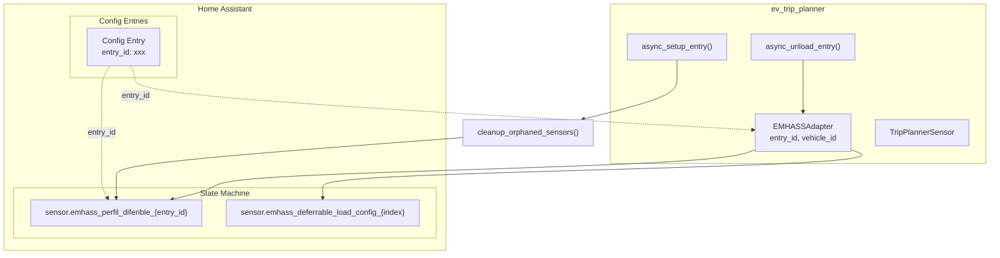
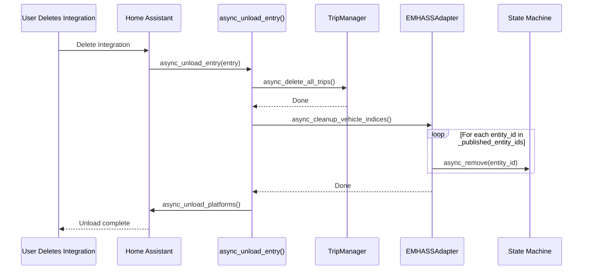
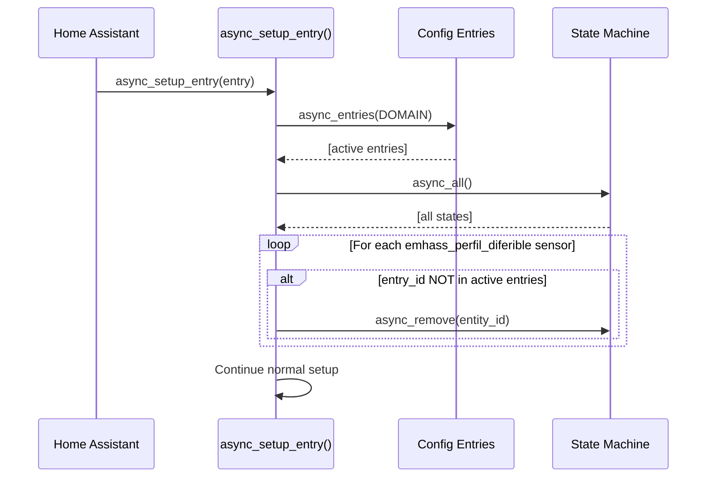

# Design: duplicate-emhass-sensor-fix

## Overview

Fix two bugs in the EV Trip Planner HA integration: (1) orphaned EMHASS state-based sensors surviving after integration deletion, and (2) sensor attributes not updating when trips or SOC change. Changes are confined to 3 files with <20 lines total impact.

## Architecture



## Components

### 1. EMHASSAdapter - Entity Tracking (emhass_adapter.py)

**Purpose**: Track all state-based entities created by `publish_deferrable_loads()` for later cleanup.

**Changes**:
- Add `_published_entity_ids: Set[str]` to `__init__` (after line ~66)
- Populate set in `publish_deferrable_loads()` when creating main sensor (line ~508)
- Populate set in `async_publish_deferrable_load()` when creating config sensors

**Interface**:
```python
# New field in __init__ (~line 66)
self._published_entity_ids: Set[str] = set()

# In publish_deferrable_loads() - add after successful async_set:
self._published_entity_ids.add(sensor_id)

# In async_publish_deferrable_load() - add after successful async_set:
config_sensor_id = self._get_config_sensor_id(emhass_index)
self._published_entity_ids.add(config_sensor_id)
```

### 2. async_cleanup_vehicle_indices() - Fix Removal (emhass_adapter.py:~1104-1162)

**Purpose**: Actually remove entities from state machine instead of setting to "idle".

**Change**: Replace `hass.states.async_set(idle)` with `hass.states.async_remove()`.

| Line | Old | New |
|------|-----|-----|
| ~1124 | `await self.hass.states.async_set(config_sensor_id, "idle", {})` | `await self.hass.states.async_remove(config_sensor_id)` |
| ~1151 | `await self.hass.states.async_set(sensor_id, "idle", {...})` | `await self.hass.states.async_remove(sensor_id)` |

**Also**: Clear `self._published_entity_ids.clear()` after cleanup loop.

### 3. async_unload_entry() - Call Cleanup (\_\_init\_\_.py:~774-818)

**Purpose**: Call cleanup before unloading platforms so state-based entities are removed.

**Change**: After line ~797 (after `await trip_manager.async_delete_all_trips()`), add:
```python
# Clean up EMHASS state-based entities before unload
emhass_adapter = None
if DATA_RUNTIME in hass.data and namespace in hass.data[DATA_RUNTIME]:
    emhass_adapter = hass.data[DATA_RUNTIME][namespace].get("emhass_adapter")
if emhass_adapter:
    await emhass_adapter.async_cleanup_vehicle_indices()
```

### 4. EmhassDeferrableLoadSensor.async_update() - Persist Attributes (sensor.py:~555-621)

**Purpose**: Call `async_schedule_update_ha_state()` after updating `_cached_attrs` so changes propagate to HA.

**Change**: After line ~616 (`self._attr_native_value = EMHASS_STATE_READY`), before the `_LOGGER.debug`, add:
```python
self.async_schedule_update_ha_state()
```

### 5. Startup Cleanup - Remove Orphaned Sensors (\_\_init\_\_.py:~453-771)

**Purpose**: At setup, safely remove orphaned sensors from previously deleted integrations.

**Change**: At start of `async_setup_entry()` (after line ~470, before namespace setup), add:
```python
# Clean up orphaned EMHASS state-based sensors from deleted integrations
try:
    all_entries = hass.config_entries.async_entries(DOMAIN)
    active_entry_ids = {e.entry_id for e in all_entries}
    # Scan for orphaned sensors
    for state in hass.states.async_all():
        if state.entity_id.startswith("sensor.emhass_perfil_diferible_"):
            sensor_entry_id = state.attributes.get("entry_id")
            if sensor_entry_id and sensor_entry_id not in active_entry_ids:
                await hass.states.async_remove(state.entity_id)
                _LOGGER.warning(
                    "Removed orphaned EMHASS sensor %s (stale entry_id %s)",
                    state.entity_id,
                    sensor_entry_id,
                )
except Exception as ex:
    _LOGGER.warning("Startup orphan cleanup failed: %s", ex)
```

## Data Flow

### Cleanup on Unload


### Startup Orphan Cleanup


## Technical Decisions

| Decision | Options Considered | Choice | Rationale |
|----------|-------------------|--------|-----------|
| Entity tracking | Add new set / reuse _index_map / separate registry | Add `_published_entity_ids` set | Minimal intrusion; directly maps to what's needed for cleanup |
| Cleanup timing | Before trips deleted / After trips deleted / In separate method | Before trips deleted | Ensures entities still exist when we try to remove them |
| Startup cleanup confidence | Remove if uncertain / Conservative | Conservative: only remove if `entry_id` attribute exists AND is not in active entries | NFR-5 requires safe cleanup - uncertain = don't remove |
| async_remove vs async_set(idle) | Both valid removal approaches | `async_remove()` | Proper removal vs idle is misleading; avoids confusion about entity state |

## File Structure

| File | Lines | Action | Purpose |
|------|-------|--------|---------|
| `emhass_adapter.py` | ~66 | Modify `__init__` | Add `_published_entity_ids: Set[str] = set()` |
| `emhass_adapter.py` | ~508 | Modify `publish_deferrable_loads()` | Add `self._published_entity_ids.add(sensor_id)` after successful `async_set` |
| `emhass_adapter.py` | ~1124 | Modify `async_cleanup_vehicle_indices()` | Change `async_set(idle)` to `async_remove()` for config sensors |
| `emhass_adapter.py` | ~1151 | Modify `async_cleanup_vehicle_indices()` | Change `async_set(idle)` to `async_remove()` for main sensor |
| `emhass_adapter.py` | ~1157 | Modify `async_cleanup_vehicle_indices()` | Add `self._published_entity_ids.clear()` |
| `sensor.py` | ~617 | Modify `EmhassDeferrableLoadSensor.async_update()` | Add `self.async_schedule_update_ha_state()` |
| `__init__.py` | ~798 | Modify `async_unload_entry()` | Call `emhass_adapter.async_cleanup_vehicle_indices()` |
| `__init__.py` | ~470 | Modify `async_setup_entry()` | Add startup orphan cleanup block |

**Total lines changed**: ~14 lines across 3 files (within NFR-2 <20 target)

## Error Handling

| Scenario | Handling | User Impact |
|----------|----------|-------------|
| `async_remove()` fails for one entity | Log warning, continue with other entities | Remaining entities still cleaned |
| Startup cleanup fails | Log warning, continue with setup | Setup proceeds; orphan remains |
| Entity already removed | `async_remove()` handles gracefully | No error |

## Edge Cases

- **Multiple vehicles**: Each EMHASSAdapter tracks its own entities via `entry_id` - deleting one vehicle does not affect another's sensors
- **Entity already removed**: HA's `async_remove()` is idempotent - safe to call even if entity doesn't exist
- **Race condition on rapid delete/recreate**: Startup cleanup runs at beginning of setup before new sensors are created - no conflict
- **No EMHASS configured**: `emhass_adapter` is `None` - cleanup call is skipped gracefully

## Test Strategy

### Test Double Policy

| Component | Unit test | Integration test | Rationale |
|---|---|---|---|
| EMHASSAdapter._published_entity_ids | Fake (set with known contents) | Fake | Simple data structure, no I/O |
| EMHASSAdapter.async_cleanup_vehicle_indices() | Stub async_remove (verify called with correct ids) | Fake hass.states | Verifies correct entities removed |
| EmhassDeferrableLoadSensor.async_update() | Real (calls actual methods) | Real | Business logic - must verify attribute persistence |
| async_unload_entry() | Stub emhass_adapter, trip_manager | Stub hass.config_entries | Flow coordination - verify calls happen |

### Mock Boundary

| Component | Unit test | Integration test | Rationale |
|---|---|---|---|
| `EMHASSAdapter` | none (pure logic wrapper) | Real adapter with stubbed hass.states | hass.states is HA I/O boundary |
| `hass.states.async_remove()` | Stub (verify called, check args) | Stub | External I/O - charges apply potentially |
| `hass.states.async_set()` | Stub | Stub | External I/O |
| `async_schedule_update_ha_state()` | Real (schedule only, no actual HA update) | Real | Schedules work, doesn't execute synchronously |

### Fixtures & Test Data

| Component | Required state | Form |
|---|---|---|
| EMHASSAdapter | entry_id="test_entry", vehicle_id="test_vehicle", 2 trips assigned indices 0,1 | Factory: `build_emhass_adapter(hass, entry_id="test_entry")` |
| EmhassDeferrableLoadSensor | hass with config_entries, trip_manager with trips | Fixture: `emhass_sensor_with_trips(hass)` |
| Startup orphan cleanup | hass.states with orphaned sensor (entry_id not in config_entries) | Fixture: `hass_with_orphaned_sensor(hass)` |

### Test Coverage Table

| Component / Function | Test type | What to assert | Test double |
|---|---|---|---|
| `EMHASSAdapter.__init__` | unit | `_published_entity_ids` initialized empty | none |
| `publish_deferrable_loads` | unit | `_published_entity_ids` contains main sensor id after call | fake hass.states.async_set |
| `async_cleanup_vehicle_indices` | unit | `async_remove` called for each tracked entity | stub hass.states.async_remove |
| `async_cleanup_vehicle_indices` | unit | `_published_entity_ids` cleared after cleanup | stub |
| `async_cleanup_vehicle_indices` - config sensors | unit | `async_remove(config_sensor_id)` called for each config sensor | stub |
| `EmhassDeferrableLoadSensor.async_update` | unit | `async_schedule_update_ha_state` called once on success | mock |
| `EmhassDeferrableLoadSensor.async_update` - exception | unit | `async_schedule_update_ha_state` NOT called on exception | mock |
| `async_unload_entry` | unit | `emhass_adapter.async_cleanup_vehicle_indices()` called before unload | stub emhass_adapter |
| Startup orphan cleanup | unit | `async_remove` called for sensor with stale entry_id | stub hass.states.async_remove, async_all |
| Startup orphan cleanup - active sensor | unit | `async_remove` NOT called for sensor with valid entry_id | stub hass.states |

### Test File Conventions

Discovered from codebase:
- Test runner: **pytest** (`.venv/bin/pytest`)
- Test file location: `tests/` directory, co-located with source structure
- Test file pattern: `test_*.py` (e.g., `test_emhass_adapter.py`, `test_sensor.py`)
- Mock cleanup: `pytest-asyncio` handles coroutine cleanup; no explicit `mock.reset_mock()` needed
- Fixture location: `tests/conftest.py` - shared fixtures in `mock_hass`, `mock_store_class`
- Custom fixtures for this fix: `hass_with_orphaned_sensor`, `emhass_sensor_with_trips`

### Execution Commands

```bash
# Unit tests (existing)
.venv/bin/pytest tests/test_emhass_adapter.py -v
.venv/bin/pytest tests/test_sensor.py -v

# New tests to add
.venv/bin/pytest tests/test_emhass_cleanup.py -v

# Smoke test (existing)
npm test
```

## Unresolved Questions

None. All ambiguities resolved in research phase.

## Implementation Steps

1. **`emhass_adapter.py`**: Add `_published_entity_ids: Set[str] = set()` to `EMHASSAdapter.__init__` (~line 66)

2. **`emhass_adapter.py`**: In `publish_deferrable_loads()`, add `self._published_entity_ids.add(sensor_id)` after successful `async_set` (~line 508)

3. **`emhass_adapter.py`**: In `async_cleanup_vehicle_indices()`, replace two `async_set(..., "idle", ...)` calls with `async_remove()` calls (~lines 1124, 1151), add `self._published_entity_ids.clear()` after cleanup loop

4. **`sensor.py`**: In `EmhassDeferrableLoadSensor.async_update()`, add `self.async_schedule_update_ha_state()` after line ~616 (after `_attr_native_value` assignment, before debug log)

5. **`__init__.py`**: In `async_unload_entry()`, after `async_delete_all_trips()` (~line 797), add call to `emhass_adapter.async_cleanup_vehicle_indices()`

6. **`__init__.py`**: In `async_setup_entry()`, after line ~470 (before namespace setup), add orphan cleanup block scanning for `sensor.emhass_perfil_diferible_*` with stale `entry_id`

7. **Add new tests** in `tests/test_emhass_cleanup.py`:
   - Test `async_cleanup_vehicle_indices` calls `async_remove` for each entity
   - Test `_published_entity_ids` populated by `publish_deferrable_loads`
   - Test `async_unload_entry` calls cleanup
   - Test startup orphan cleanup removes stale sensors but not active ones