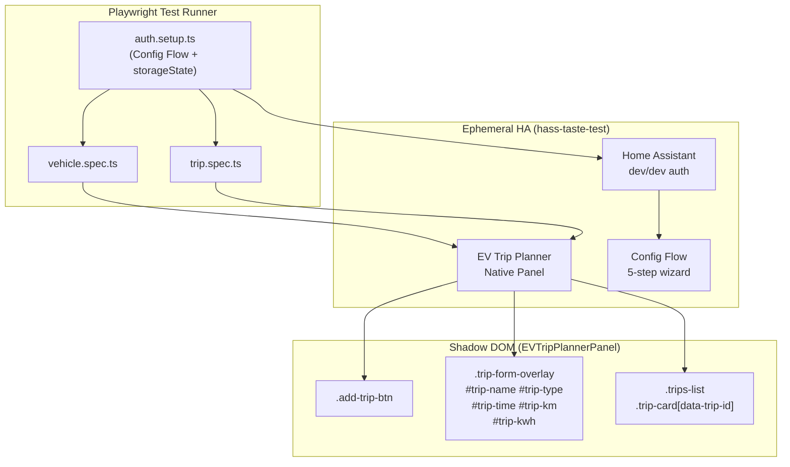

# Design: E2E Test Suite for EV Trip Planner

## Overview

The E2E test suite uses Playwright with hass-taste-test to create ephemeral Home Assistant instances, run the Config Flow UI to install the EV Trip Planner integration, open the native panel, create trips via the Shadow DOM form, and verify persistence. Tests are fully isolated: each test creates its own vehicle via Config Flow and tears it down in `afterEach`.

## Architecture



## Components

### playwright.config.ts

**Purpose**: Root Playwright configuration; references global.setup.ts/global.teardown.ts and defines test environment.

```typescript
import { defineConfig, devices } from '@playwright/test';
import * as path from 'path';

export default defineConfig({
  testDir: './tests/e2e',
  fullyParallel: false,           // One browser at a time; hass-taste-test ports conflict
  forbidOnly: !!process.env.CI,   // Fail on only() in CI
  retries: 0,                     // No retries; tests are fast and isolated
  workers: 1,                     // Single worker; ephemeral HA is not parallel-safe
  reporter: [['html', { open: 'never' }]],

  use: {
    baseURL: 'http://localhost:8123',
    trace: 'on-first-retry',
    screenshot: 'only-on-failure',
    video: 'retain-on-failure',
  },

  globalSetup: path.join(__dirname, 'tests', 'global.setup.ts'),
  globalTeardown: path.join(__dirname, 'tests', 'global.teardown.ts'),

  projects: [
    {
      name: 'chromium',
      use: { ...devices['Desktop Chrome'] },
    },
  ],
});
```

### tests/e2e/auth.setup.ts

**Purpose**: Project-specific authentication setup. Runs Config Flow UI end-to-end and saves `storageState` to `playwright/.auth/user.json`. This is NOT a Playwright globalSetup (which lives in `tests/global.setup.ts`); it is a **project setup** file referenced by the test files via `use: { storageState }`.

**Config Flow steps** (from `config_flow.py`):
1. `async_step_user` — enter `vehicle_name`
2. `async_step_sensors` — fill battery_capacity, charging_power, consumption, safety_margin (all have defaults)
3. `async_step_emhass` — fill planning_horizon, max_deferrable_loads (all have defaults)
4. `async_step_presence` — charging_sensor auto-selected from `input_boolean` entities (STEP_PRESENCE_SCHEMA marks CONF_CHARGING_SENSOR Optional; `async_step_presence` auto-selects if not provided)
5. `async_step_notifications` — all fields Optional; skip directly to create

```typescript
import { test as setup, expect } from '@playwright/test';
import * as fs from 'fs';
import * as path from 'path';

const authFile = path.join(__dirname, '..', '..', 'playwright', '.auth', 'user.json');

// Read server info from global.setup.ts output
function getServerInfo() {
  const serverInfoPath = path.join(__dirname, '..', '..', 'playwright', '.auth', 'server-info.json');
  if (!fs.existsSync(serverInfoPath)) {
    throw new Error(`server-info.json not found at ${serverInfoPath}. Run global.setup first.`);
  }
  return JSON.parse(fs.readFileSync(serverInfoPath, 'utf-8'));
}

setup('authenticate via Config Flow', async ({ page }) => {
  const { link } = getServerInfo();
  await page.goto(link);

  // Step 1: Integrations page — click "Add Integration"
  await page.getByRole('link', { name: 'Integrations' }).click();
  await page.waitForURL(/\/config\/integrations/);
  await page.getByRole('button', { name: 'Add Integration' }).click();

  // Step 2: Search and select "EV Trip Planner"
  await page.getByPlaceholder('Search...').fill('EV Trip Planner');
  await page.getByRole('option', { name: 'EV Trip Planner' }).click();

  // Step 3: Config Flow step 1 — vehicle_name
  await page.waitForSelector('input[name="vehicle_name"]', { timeout: 10000 });
  await page.getByLabel(/vehicle name/i).fill('TestVehicle');

  // Submit step 1 → step 2 (sensors — all defaults, submit immediately)
  await page.getByRole('button', { name: 'Submit' }).click();
  await page.waitForTimeout(500);

  // Step 4: Config Flow step 2 (sensors) — submit with defaults
  await page.getByRole('button', { name: 'Submit' }).click();
  await page.waitForTimeout(500);

  // Step 5: Config Flow step 3 (EMHASS) — submit with defaults
  await page.getByRole('button', { name: 'Submit' }).click();
  await page.waitForTimeout(500);

  // Step 6: Config Flow step 4 (presence) — charging_sensor auto-selected, submit
  await page.getByRole('button', { name: 'Submit' }).click();
  await page.waitForTimeout(500);

  // Step 7: Config Flow step 5 (notifications) — skip/submit
  await page.getByRole('button', { name: 'Submit' }).click();
  await page.waitForURL(/\/config\/integrations/);  // Confirms success

  // Verify panel appears in sidebar
  await page.waitForSelector('a:has-text("EV Trip Planner")', { timeout: 10000 });

  // Save storage state
  await page.context().storageState({ path: authFile });
  console.log('[auth.setup] storageState saved to', authFile);
});
```

### tests/e2e/pages/ConfigFlowPage.ts

**Purpose**: Page Object Model for the HA Config Flow UI.

```typescript
import { Page, Locator } from '@playwright/test';

export class ConfigFlowPage {
  readonly page: Page;

  // Integrations page
  readonly addIntegrationBtn: Locator;
  readonly searchInput: Locator;

  // Config Flow form
  readonly vehicleNameInput: Locator;
  readonly submitBtn: Locator;

  constructor(page: Page) {
    this.page = page;
    this.addIntegrationBtn = page.getByRole('button', { name: 'Add Integration' });
    this.searchInput = page.getByPlaceholder('Search...');
    this.vehicleNameInput = page.locator('input[name="vehicle_name"]');
    this.submitBtn = page.getByRole('button', { name: 'Submit' });
  }

  async navigateToIntegrations() {
    await this.page.goto('/config/integrations');
  }

  async addIntegration(name: string) {
    await this.addIntegrationBtn.click();
    await this.searchInput.fill(name);
    await this.page.getByRole('option', { name }).click();
    await this.vehicleNameInput.waitFor({ state: 'visible' });
  }

  async fillVehicleName(name: string) {
    await this.vehicleNameInput.fill(name);
  }

  async submit() {
    await this.submitBtn.click();
    await this.page.waitForTimeout(500);  // Allow transition to next step
  }

  async waitForIntegrationComplete() {
    // Config Flow returns to integrations page on success
    await this.page.waitForURL(/\/config\/integrations/, { timeout: 15000 });
  }

  async waitForPanelInSidebar() {
    await this.page.waitForSelector('a:has-text("EV Trip Planner")', { timeout: 10000 });
  }
}
```

### tests/e2e/pages/EVTripPlannerPage.ts

**Purpose**: Page Object Model for the EV Trip Planner native panel (Shadow DOM).

```typescript
import { Page, Locator, expect } from '@playwright/test';

export class EVTripPlannerPage {
  readonly page: Page;

  // Shadow DOM selectors via pierce combinator `>>`
  readonly sidebarLink: Locator;
  readonly addTripBtn: Locator;
  readonly tripsList: Locator;
  readonly tripFormOverlay: Locator;

  // Form fields (inside .trip-form-container via pierce)
  readonly tripTypeSelect: Locator;
  readonly tripDaySelect: Locator;
  readonly tripTimeInput: Locator;
  readonly tripKmInput: Locator;
  readonly tripKwhInput: Locator;
  readonly tripDescriptionInput: Locator;
  readonly tripSubmitBtn: Locator;

  constructor(page: Page) {
    this.page = page;

    // Sidebar navigation (light DOM)
    this.sidebarLink = page.locator('a:has-text("EV Trip Planner")');

    // Shadow DOM — pierce combinator `>>` traverses into shadow roots
    this.addTripBtn       = page.locator('ev-trip-planner-panel >> .add-trip-btn');
    this.tripsList        = page.locator('ev-trip-planner-panel >> .trips-list');
    this.tripFormOverlay  = page.locator('ev-trip-planner-panel >> .trip-form-overlay');

    // Form fields inside .trip-form-container
    this.tripTypeSelect       = page.locator('ev-trip-planner-panel >> #trip-type');
    this.tripDaySelect        = page.locator('ev-trip-planner-panel >> #trip-day');
    this.tripTimeInput        = page.locator('ev-trip-planner-panel >> #trip-time');
    this.tripKmInput          = page.locator('ev-trip-planner-panel >> #trip-km');
    this.tripKwhInput         = page.locator('ev-trip-planner-panel >> #trip-kwh');
    this.tripDescriptionInput = page.locator('ev-trip-planner-panel >> #trip-description');
    this.tripSubmitBtn        = page.locator('ev-trip-planner-panel >> .trip-form-container .btn-primary');
  }

  async openFromSidebar() {
    await this.sidebarLink.click();
    await this.page.waitForURL(/\/ev-trip-planner-/);
    await this.addTripBtn.waitFor({ state: 'visible', timeout: 15000 });
  }

  async openAddTripForm() {
    await this.addTripBtn.click();
    await this.tripFormOverlay.waitFor({ state: 'visible', timeout: 5000 });
  }

  async createRecurringTrip(opts: {
    day?: number;       // 0=Sun … 6=Sat; default 1 (Lunes)
    time?: string;      // HH:MM; default "12:00"
    km?: number;
    kwh?: number;
    description?: string;
  }) {
    const {
      day = 1,
      time = '12:00',
      km,
      kwh,
      description,
    } = opts;

    await this.tripTypeSelect.waitFor({ state: 'visible' });
    await this.tripTypeSelect.selectOption('recurrente');
    await this.tripDaySelect.selectOption(String(day));
    await this.tripTimeInput.fill(time);
    if (km !== undefined) await this.tripKmInput.fill(String(km));
    if (kwh !== undefined) await this.tripKwhInput.fill(String(kwh));
    if (description) await this.tripDescriptionInput.fill(description);

    await this.tripSubmitBtn.click();
    // Form closes and trip card appears
    await this.tripFormOverlay.waitFor({ state: 'hidden', timeout: 5000 });
  }

  async tripCardLocator(tripId: string): Promise<Locator> {
    return this.page.locator(`ev-trip-planner-panel >> .trip-card[data-trip-id="${tripId}"]`);
  }

  async expectTripVisible(tripId: string) {
    const card = await this.tripCardLocator(tripId);
    await expect(card).toBeVisible({ timeout: 10000 });
  }

  async deleteTrip(tripId: string) {
    const card = await this.tripCardLocator(tripId);
    const deleteBtn = card.locator('.delete-btn');
    page.on('dialog', dialog => dialog.accept());  // Confirm dialog
    await deleteBtn.click();
    await card.waitFor({ state: 'detached', timeout: 5000 });
  }
}
```

### tests/e2e/vehicle.spec.ts

**Purpose**: US-1 (install via Config Flow) + US-2 (view vehicle panel).

```typescript
import { test, expect } from '@playwright/test';
import * as path from 'path';
import { ConfigFlowPage } from './pages/ConfigFlowPage';
import { EVTripPlannerPage } from './pages/EVTripPlannerPage';

const authFile = path.join(__dirname, '..', '..', 'playwright', '.auth', 'user.json');

test.describe('Vehicle Creation and Panel', () => {
  let configFlow: ConfigFlowPage;
  let panel: EVTripPlannerPage;
  let vehicleName: string;
  let vehicleId: string;

  test.beforeEach(async ({ page }) => {
    // Load auth state from auth.setup.ts
    await page.context().storageState({ path: authFile });

    configFlow = new ConfigFlowPage(page);
    panel = new EVTripPlannerPage(page);

    vehicleName = `TestVehicle${Date.now()}`;
    vehicleId = vehicleName.toLowerCase().replace(/\s+/g, '_');
  });

  test.afterEach(async ({ page }) => {
    // Remove integration via Config Flow "Delete" option
    await page.goto('/config/integrations');
    const integrationRow = page.locator(' hass-integration-card', { hasText: vehicleName });
    const row = integrationRow.first();
    if (await row.isVisible()) {
      await row.getByRole('button', { name: 'Delete' }).click();
      await page.getByRole('button', { name: 'Delete' }).click();  // Confirm
      await page.waitForTimeout(1000);
    }
  });

  test('US-1 + US-2: install EV Trip Planner and open panel', async ({ page }) => {
    // Navigate to HA
    await page.goto('/config/integrations');

    // Run Config Flow
    await configFlow.addIntegration('EV Trip Planner');
    await configFlow.fillVehicleName(vehicleName);
    await configFlow.submit();  // Step 1 → Step 2
    await configFlow.submit();  // Step 2 (sensors) → Step 3
    await configFlow.submit();  // Step 3 (EMHASS) → Step 4
    await configFlow.submit();  // Step 4 (presence) → Step 5
    await configFlow.submit();  // Step 5 (notifications) → complete

    // Verify panel appears in sidebar
    await configFlow.waitForPanelInSidebar();

    // Open panel
    await panel.openFromSidebar();
    await expect(panel.addTripBtn).toBeVisible();

    // Panel URL contains vehicle_id
    await expect(page).toHaveURL(/\/ev-trip-planner-/);
  });
});
```

### tests/e2e/trip.spec.ts

**Purpose**: US-3 (create trip) + US-4 (verify trip appears) + US-5 (cleanup).

```typescript
import { test, expect, Page } from '@playwright/test';
import * as path from 'path';
import { ConfigFlowPage } from './pages/ConfigFlowPage';
import { EVTripPlannerPage } from './pages/EVTripPlannerPage';

const authFile = path.join(__dirname, '..', '..', 'playwright', '.auth', 'user.json');

test.describe('Trip Creation', () => {
  let configFlow: ConfigFlowPage;
  let panel: EVTripPlannerPage;
  let vehicleName: string;
  let page: Page;

  test.beforeEach(async ({ browserPage }) => {
    page = browserPage;
    await page.context().storageState({ path: authFile });

    configFlow = new ConfigFlowPage(page);
    panel = new EVTripPlannerPage(page);

    vehicleName = `TripTest${Date.now()}`;

    // Create vehicle via Config Flow (same as vehicle.spec.ts)
    await page.goto('/config/integrations');
    await configFlow.addIntegration('EV Trip Planner');
    await configFlow.fillVehicleName(vehicleName);
    await configFlow.submit();
    await configFlow.submit();
    await configFlow.submit();
    await configFlow.submit();
    await configFlow.submit();
    await configFlow.waitForPanelInSidebar();
  });

  test.afterEach(async () => {
    // Delete all trips via API
    // DELETE /api/states/sensor.ev_trip_planner_{vehicle_id}_trips
    // OR: open panel and delete each trip card via UI
    const vehicleId = vehicleName.toLowerCase().replace(/\s+/g, '_');
    await page.goto(`/ev-trip-planner-${vehicleId}`);
    await panel.addTripBtn.waitFor({ state: 'visible', timeout: 10000 }).catch(() => {});

    // Delete any visible trip cards
    const deleteButtons = page.locator('ev-trip-planner-panel >> .delete-btn');
    const count = await deleteButtons.count();
    for (let i = 0; i < count; i++) {
      page.on('dialog', dialog => dialog.accept());
      await deleteButtons.first().click();
      await page.waitForTimeout(500);
    }

    // Remove integration
    await page.goto('/config/integrations');
    const integrationRow = page.locator('hass-integration-card', { hasText: vehicleName });
    if (await integrationRow.isVisible()) {
      await integrationRow.getByRole('button', { name: 'Delete' }).click();
      await page.getByRole('button', { name: 'Delete' }).click();
      await page.waitForTimeout(1000);
    }
  });

  test('US-3 + US-4: create recurring trip and verify it appears', async () => {
    // Open panel
    await panel.openFromSidebar();

    // Create trip
    await panel.openAddTripForm();
    await panel.createRecurringTrip({
      day: 1,       // Lunes
      time: '08:30',
      km: 25.5,
      kwh: 5.2,
      description: 'Commute to work',
    });

    // Verify trip card appears in list
    // The trip ID is generated by HA; we verify by waiting for any card to appear
    // and checking the form closes
    await expect(panel.tripFormOverlay).toBeHidden();
    const tripCards = page.locator('ev-trip-planner-panel >> .trip-card');
    await expect(tripCards.first()).toBeVisible({ timeout: 10000 });

    // Verify trip details via text content
    await expect(page.locator('ev-trip-planner-panel >> .trip-card')).toContainText('08:30');
    await expect(page.locator('ev-trip-planner-panel >> .trip-card')).toContainText('25.5');
  });

  test('US-3 + US-4: create punctual trip and verify it appears', async () => {
    await panel.openFromSidebar();
    await panel.openAddTripForm();

    // Select punctual type
    await panel.tripTypeSelect.selectOption('puntual');

    // Fill punctual-specific fields
    await page.locator('ev-trip-planner-panel >> #trip-datetime').fill('2026-04-15T09:00');
    await panel.tripKmInput.fill('100');
    await panel.tripKwhInput.fill('20');

    await panel.tripSubmitBtn.click();
    await expect(panel.tripFormOverlay).toBeHidden();

    const tripCards = page.locator('ev-trip-planner-panel >> .trip-card');
    await expect(tripCards.first()).toBeVisible({ timeout: 10000 });
    await expect(page.locator('ev-trip-planner-panel >> .trip-card')).toContainText('100');
  });
});
```

## Technical Decisions

| Decision | Options Considered | Choice | Rationale |
|----------|-------------------|--------|-----------|
| Shadow DOM pierce combinator `>>` | `>>` pierce, JS evaluate, custom click | `>>` pierce | Built-in Playwright syntax that traverses Shadow DOM roots. Clean and readable: `ev-trip-planner-panel >> .add-trip-btn`. No JS injection needed. |
| Sidebar navigation over direct URL | Click sidebar link, Direct URL `/ev-trip-planner-{id}` | Sidebar link | Vehicle ID is derived from vehicle name after Config Flow. Sidebar link appears automatically after Config Flow completes — no ID extraction needed. Direct URL requires knowing the ID which is only revealed after flow completes. |
| Per-test cleanup (afterEach) over shared fixtures | Session-scoped fixture with vehicle, Per-test create+delete | Per-test create+delete | NFR-3 mandates zero shared state. Each test creates its own vehicle via Config Flow and deletes it in afterEach. Session fixture would leak state between tests. |
| TypeScript over JavaScript | TypeScript, JavaScript | TypeScript | Project already uses TypeScript (tsconfig.json includes `tests/**/*` with `@playwright/test` types). Type safety and IDE autocomplete for POM methods. |
| Auth via project-level setup file | Playwright globalSetup, project-level setup | Project-level `auth.setup.ts` | `global.setup.ts` already owns server lifecycle. Auth (Config Flow) is a separate concern — running it as a project-level setup file via `use: { storageState }` keeps concerns separated. `auth.setup.ts` is not a Playwright globalSetup; it is a test file run once per project. |
| One worker (workers: 1) | Multiple workers, single worker | Single worker | `hass-taste-test` uses lockfiles on sequential ports. Parallel workers would cause port conflicts. |
| No retries (retries: 0) | Retries on failure, no retries | No retries | Tests are fast (<5 min total); failures are deterministic. Retries mask real issues. |

## File Structure

```
playwright.config.ts                          Create — root Playwright config
tests/global.setup.ts                         Existing — server lifecycle
tests/global.teardown.ts                      Existing — server cleanup
tests/e2e/
  auth.setup.ts                               Create — Config Flow + storageState
  pages/
    ConfigFlowPage.ts                         Create — Config Flow POM
    EVTripPlannerPage.ts                       Create — Panel POM
  vehicle.spec.ts                             Create — US-1 + US-2
  trip.spec.ts                                Create — US-3 + US-4
```

## Error Handling

| Error Scenario | Detection | Handling | User Impact |
|----------------|-----------|----------|-------------|
| Config Flow selectors break (HA UI update) | `waitForSelector` timeout | Fail fast with screenshot; update POM selectors | Test suite fails; selectors must be updated |
| Panel doesn't load (Shadow DOM not ready) | `addTripBtn.waitFor` timeout after 15s | Retry once; capture screenshot and console logs | Test fails; check panel.js version matches |
| Trip not found after creation | `trip-card` not visible after 10s | Capture HA API response via `page.evaluate` | Test fails; investigate `trip_create` service |
| Config Flow fails (validation error) | URL stays on `/config/integrations` with error | Capture error message from page | Test fails; Config Flow schema may have changed |
| Integration delete fails | afterEach times out | Force page reload and retry; log warning | Potential state leak; CI should warn |
| Ephemeral HA port conflict | `hass-taste-test` throws on startup | Catch in global.setup.ts; exit 1 | Entire suite fails; restart needed |

## Test Strategy

### Mock Boundary

| Layer | Mock allowed? | Rationale |
|-------|---------------|-----------|
| Ephemeral HA server | N/A (real) | hass-taste-test creates real HA instance; tests run against it |
| Auth (storageState) | N/A (real) | Must use real auth — Config Flow creates real session cookies |
| Config Flow UI | No | Tests drive the real Config Flow UI; no mocking |
| EV Trip Planner panel (Shadow DOM) | No | Real Lit web component; tests verify actual rendering |
| Home Assistant API (delete trip/entity) | No | Tests call real `DELETE /api/states` or use real UI deletion |
| Browser (Chromium) | No | E2E tests require real browser |

### US to Test Code Mapping

| US | Test File | Test Name | What It Does |
|----|-----------|-----------|--------------|
| US-1 | vehicle.spec.ts | `install EV Trip Planner and open panel` | Config Flow → vehicle_name → Submit×5 → sidebar link appears |
| US-2 | vehicle.spec.ts | `install EV Trip Planner and open panel` | Sidebar click → panel URL `/ev-trip-planner-*` → addTripBtn visible |
| US-3 | trip.spec.ts | `create recurring trip` | open panel → addTripBtn → createRecurringTrip() → form closes |
| US-3 | trip.spec.ts | `create punctual trip` | open panel → addTripBtn → select punctual → fill punctual fields |
| US-4 | trip.spec.ts | `create recurring trip` | After creation → trip-card visible → card contains trip time/km |
| US-4 | trip.spec.ts | `create punctual trip` | After creation → trip-card visible → card contains km |
| US-5 | vehicle.spec.ts + trip.spec.ts | `afterEach` in both files | Delete integration via Config Flow UI (vehicle.spec.ts); delete trips via panel UI then integration via Config Flow (trip.spec.ts) |
| US-6 | CI | `.github/workflows/playwright.yml` | Already exists; runs `npx playwright test tests/e2e/` on PR |

### Test File Conventions (discovered from codebase)

- **Test runner**: `@playwright/test@^1.58.2` (from package.json)
- **Test file location**: `tests/e2e/*.spec.ts` (referenced by `.github/workflows/playwright.yml`)
- **Page Object co-location**: `tests/e2e/pages/*.ts` (one directory per spec)
- **Auth file location**: `playwright/.auth/user.json` (created by auth.setup.ts, directory created by CI step)
- **Server info file**: `playwright/.auth/server-info.json` (created by global.setup.ts)
- **TypeScript config**: `tsconfig.json` — `tests/**/*` included, `module: commonjs`
- **Playwright config**: `playwright.config.ts` at repo root (not yet created)
- **Test naming**: `*.spec.ts` pattern; one `test.describe` block per US group
- **Cleanup**: `test.afterEach` inside each spec file; no shared fixtures
- **Screenshots/videos**: `retain-on-failure` — CI uploads via `actions/upload-artifact`

### Skip Policy

Tests marked `.skip` are **forbidden** unless referencing a GitHub issue. The E2E suite tests happy-path only (no error flows, per Out of Scope). Any skipped test must include the issue URL in the skip reason.

## Unresolved Questions

1. **Exact Config Flow field selectors**: The selectors above (`input[name="vehicle_name"]`, `getByRole('button', { name: 'Submit' })`) are based on `config_flow.py` schema analysis. They should be verified against the actual rendered HA UI before implementation.
2. **Sidebar link text**: After Config Flow completes, the sidebar may show the vehicle name instead of "EV Trip Planner". The POM uses `a:has-text("EV Trip Planner")` — may need adjustment to `a:has-text(vehicleName)`.
3. **Post-Config Flow page reload**: May need `page.reload()` before clicking sidebar link if HA requires a restart for the panel to register.
4. **Trip ID extraction**: The panel generates trip IDs server-side. Verification in US-4 uses presence of any `.trip-card` rather than matching a specific `data-trip-id` attribute. If specific ID verification is needed, the trip creation response must be captured via `page.evaluate`.

## Implementation Steps

1. Create `playwright.config.ts` at repo root with `globalSetup`/`globalTeardown` pointing to `tests/global.setup.ts`/`tests/global.teardown.ts` and Chromium-only project
2. Create `tests/e2e/auth.setup.ts` — run full Config Flow UI, save `storageState` to `playwright/.auth/user.json`
3. Create `tests/e2e/pages/ConfigFlowPage.ts` — POM with methods: `navigateToIntegrations`, `addIntegration`, `fillVehicleName`, `submit`, `waitForIntegrationComplete`, `waitForPanelInSidebar`
4. Create `tests/e2e/pages/EVTripPlannerPage.ts` — POM with Shadow DOM pierce selectors, `openFromSidebar`, `openAddTripForm`, `createRecurringTrip`, `expectTripVisible`
5. Create `tests/e2e/vehicle.spec.ts` — `beforeEach` loads auth, `test` runs Config Flow, `afterEach` deletes integration
6. Create `tests/e2e/trip.spec.ts` — `beforeEach` creates vehicle via Config Flow, `test` creates and verifies trips, `afterEach` deletes trips then integration
7. Verify selectors against running ephemeral HA (run `npm run test:e2e` locally and iterate)
8. Confirm CI workflow `.github/workflows/playwright.yml` passes on PR
