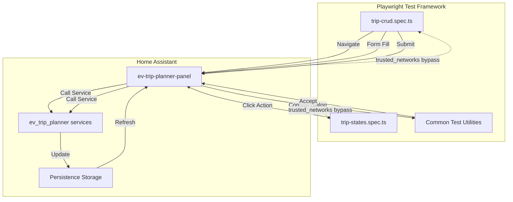
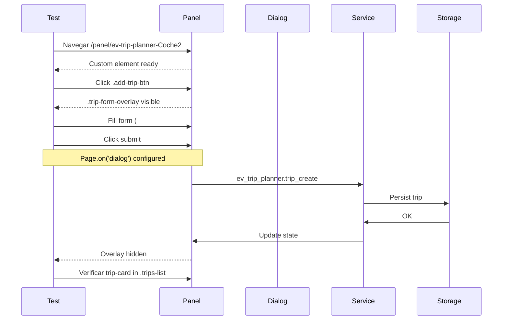

# Design: E2E Tests CRUD para Viajes EV Trip Planner

## Overview
Arquitectura de tests E2E con Playwright para validar CRUD completo de viajes mediante interacción real con el panel ev-trip-planner-panel, usando selector `>>` para Shadow DOM, manejo de dialogs nativos y configurando trusted_networks para bypass de login.

## Architecture

## Components

### Test Orchestrator (trip-crud.spec.ts)
**Purpose**: CRUD completo (Create, Read, Update, Delete) con verificación UI
**Responsibilities**:
- Crear viajes recurrentes y puntuales vía form
- Editar viajes existentes con datos pre-populated
- Eliminar viajes con confirmación de dialog
- Validar persistencia UI tras cada operación

### Test States (trip-states.spec.ts)
**Purpose**: Estados de viajes (Pause/Resume, Complete/Cancel)
**Responsibilities**:
- Pausar/reanudar viajes recurrentes
- Completar/cancelar viajes puntuales
- Validar cambios en data-active y badges UI
- Verificar count de trips no cambia tras state changes

### Common Utilities
**Purpose**: Helpers reutilizables para patrones comunes
**Responsibilities**:
- Setup de dialog handlers
- Esperar panel cargado
- Validar formación de servicios HA

## Data Flow

## Technical Decisions

| Decision | Options | Choice | Rationale |
|----------|---------|--------|-----------|
| **Selector pattern** | `document.querySelector` vs `>>` | `>>` | Playwright atraviesa Shadow DOM nativamente para Lit components |
| **Dialog handling** | Event listener vs page mock | `page.on('dialog')` antes de click | Patrón obligatorio - listener debe estar establecido antes del trigger |
| **Wait strategy** | `waitForTimeout` vs assertions | `toBeVisible/toBeHidden/toHaveCount` | NFR-4: 0 ocurrencias de waitForTimeout obligatorio |
| **Test scope** | 5 tests pequeños vs 2 integrados | 2 tests (CRUD + States) | Tests de Nivel 1 eliminados (performance, cross-browser, etc.) |
| **Auth bypass** | Token vs trusted_networks | `allow_bypass_login_for_ips` | configuration.yaml ya tiene 127.0.0.1 y 192.168.1.0/24 |
| **Vehicle ID** | Coche1/2 vs CochePrueba | Coche2 | Más estable según configuration.yaml |

## File Structure

| File | Action | Purpose |
|------|--------|---------|
| specs/e2e-tests/design.md | Create | Este diseño |
| specs/e2e-tests/requirements.md | Exists | Requirements ya completado |
| tests/e2e/trip-crud.spec.ts | Create | CRUD completo (3 tests) |
| tests/e2e/trip-states.spec.ts | Create | Estados de viajes (4 tests) |
| test-ha/config/configuration.yaml | Modify | Add `allow_bypass_login_for_ips` |

## Error Handling

| Error Scenario | Handling Strategy | User Impact |
|----------------|-------------------|-------------|
| Panel no carga | Timeout 30s en waitForFunction | Test fail con error claro |
| Dialog no aparece | Dialog handler timeout 5s | Test fail indicando servicio no llamado |
| Form no visible | expect.toBeVisible() timeout 10s | Test fail indicando problema UI |
| Service falla | Validar error en console.log | Test fail con mensaje específico |

## Edge Cases

- **Viaje inexistente**: Tests usan `if (cardCount > 0)` para skip graceful
- **Dialog dismissed**: Tests validan que trip no cambia si se cancela
- **Last trip deleted**: Validar `.no-trips` message aparece
- **Recurrente vs Puntual**: Botones conditionales según tipo

## Test Strategy

### Unit Tests (Playwright describe/it)
- CRUD: 3 tests (create, edit, delete)
- States: 4 tests (pause/resume, complete/cancel)
- Mock: Servicios de HA no mockeados - E2E real

### Integration Tests
- Validar servicio trip_create con parámetros correctos
- Validar trip_update actualiza datos
- Validar delete_trip elimina del storage

### E2E Tests
- Flujo completo: Create → Read → Update → Delete → Verify
- Estado: Active → Paused → Active → Verify attributes

## Performance Considerations

- **Timeout total**: <60s para CRUD completo (NFR-2)
- **Retries**: 0 en local, 2 en CI (NFR-3: 95% success rate)
- **Parallel**: true para tests independientes

## Security Considerations

- **Token auth**: No requerido con trusted_networks
- **IP restrictions**: Solo 127.0.0.1 y 192.168.1.0/24
- **Environment variables**: HA_URL, VEHICLE_ID from .env

## Existing Patterns to Follow

1. **Shadow DOM selectors**: `ev-trip-planner-panel >> .class`
2. **Dialog pattern**: `page.on('dialog', ...)` ANTES de click
3. **Panel ready**: `waitForFunction(() => customElements.get(...))`
4. **No assertions débiles**: Eliminar `expect(true).toBe(true)`

---

## Unresolved Questions
- ¿Nombre exacto del día para day_of_week=1? (Lunes vs Monday)
- ¿Message exacto del dialog de confirmación?
- ¿Formato de fecha para trips puntuales en UI?

## Implementation Steps

1. **Actualizar configuration.yaml**
   - Add `allow_bypass_login_for_ips: [127.0.0.1, 192.168.1.0/24]`

2. **Crear trip-crud.spec.ts**
   - Test 1: Create recurrente + validación UI
   - Test 2: Edit trip + submit update
   - Test 3: Delete con confirmación dialog

3. **Crear trip-states.spec.ts**
   - Test 1: Pause trip + validate data-active="false"
   - Test 2: Resume trip + validate data-active="true"
   - Test 3: Complete punctual + validate badge
   - Test 4: Cancel punctual + validate state

4. **Refactorizar tests existentes**
   - Reemplazar todos `waitForTimeout` con Playwright waits
   - Eliminar assertions débiles `expect(true).toBe(true)`

5. **Eliminar tests de Nivel 1**
   - dashboard-crud.spec.ts
   - test-performance.spec.ts
   - test-cross-browser.spec.ts
   - test-pr-creation.spec.ts
   - test-panel-loading.spec.ts
