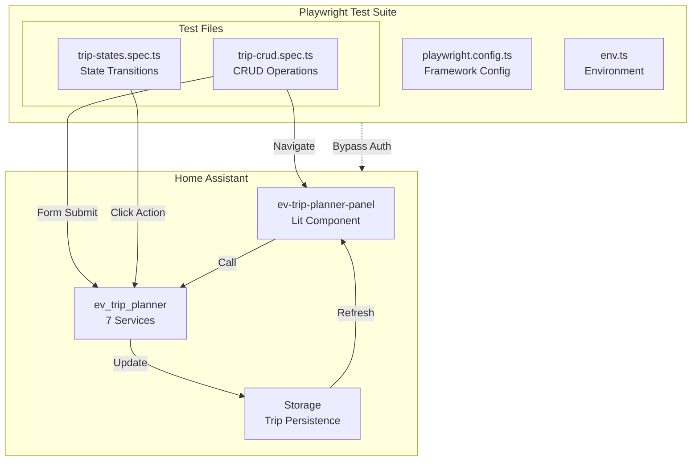
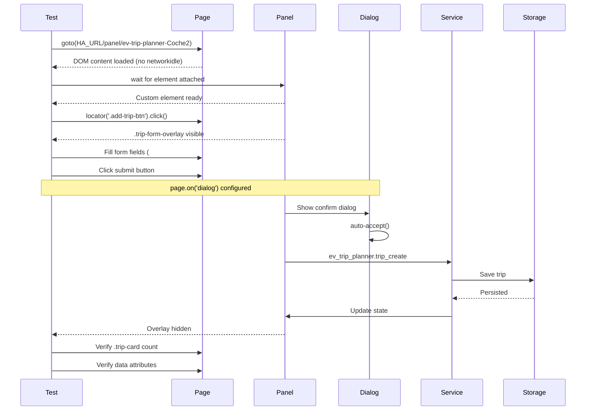

# Design: E2E Tests for EV Trip Planner

## Overview
Arquitectura de tests E2E con Playwright para validar funcionalidad completa del panel EV Trip Planner mediante Shadow DOM navigation, operación directa con servicios de Home Assistant y configuración de trusted_networks para bypass de autenticación. Diseño mínimo sin abstracciones innecesarias - cada componente cumple propósito explícito.

## Architecture



## Components

### Trip CRUD Test Suite (trip-crud.spec.ts)
**Purpose**: Operaciones CRUD completas - Create, Read, Update, Delete
**Responsibilities**:
- Create recurring trip via form with day/time
- Create punctual trip via form with datetime
- Edit existing trip and validate persistence
- Delete trip with confirmation dialog

**Interfaces**:
```typescript
interface CRUDTestContext {
  page: Page;
  vehicleId: string;
  haUrl: string;
}

interface TripFormData {
  type: 'recurrente' | 'puntual';
  day?: string;
  time?: string;
  datetime?: string;
  km: string;
  kwh: string;
  description: string;
}
```

### Trip States Test Suite (trip-states.spec.ts)
**Purpose**: Transiciones de estado de viajes - Pause/Resume, Complete/Cancel
**Responsibilities**:
- Pause recurring trip and validate data-active="false"
- Resume recurring trip and validate data-active="true"
- Complete punctual trip and validate completed state
- Cancel punctual trip and validate cancelled state

**Interfaces**:
```typescript
interface StateTestContext {
  page: Page;
  vehicleId: string;
  haUrl: string;
}

interface TripState {
  active: boolean;
  status: 'active' | 'inactive' | 'pending' | 'completed' | 'cancelled';
}
```

### Test Configuration (playwright.config.ts)
**Purpose**: Framework configuration for HA testing
**Responsibilities**:
- Configure baseURL from HA_URL
- Set timeouts (60s test, 10s expect, 15s action)
- Configure reporters (HTML, JUnit, List)
- Manage retries (2 en CI, 0 local)
- Handle screenshots and videos
- Load environment from .env file

**Interfaces**:
```typescript
interface PlaywrightConfig {
  timeout: 60000;
  expect: { timeout: 10000 };
  retries: number;
  reporter: ReporterSpec[];
  use: {
    baseURL: string;
    trace: 'on-first-retry';
    screenshot: 'only-on-failure';
    video: 'retain-on-failure';
    actionTimeout: 15000;
  };
  projects: { name: string; use: Device }[];
}
```

### Environment Utilities (env.ts)
**Purpose**: Load and validate environment variables
**Responsibilities**:
- Load HA_URL with default 'http://localhost:8123'
- Load VEHICLE_ID with default 'Coche2'
- Provide typed exports for test files

**Interfaces**:
```typescript
interface EnvExports {
  HA_URL: string;
  VEHICLE_ID: string;
}
```

## Data Flow



## Technical Decisions

| Decision | Options | Choice | Rationale |
|----------|---------|--------|-----------|
| **Shadow DOM selectors** | `document.querySelector()` vs `>>` | `>>` | Lit v2.x usa OPEN shadow DOM - Playwright atraviesa nativamente |
| **Navigation strategy** | `networkidle` vs `domcontentloaded` | `domcontentloaded` | HA usa WebSockets abiertos - networkidle siempre falla |
| **Dialog handling** | Event listener vs manual accept | `page.on('dialog', ...)` | Patrón obligatorio: listener ANTES del click |
| **Wait strategy** | `waitForTimeout` vs assertions | Assertions | NFR-1: 0 ocurrencias de hardcoded waits |
| **Test structure** | Monolith vs modular files | 2 files (CRUD, States) | Separación clara de responsabilidades sin over-engineering |
| **Auth approach** | Token vs trusted_networks | trusted_networks | US-7 requiere bypass de login - configuration.yaml ya lo soporta |
| **Environment loading** | dotenv package vs fs | fs.readFileSync | Sin dependencies externas - native Node.js |
| **Test scope** | API vs E2E real | E2E real | Validar servicios HA reales, no mocks |

## File Structure

| File | Action | Purpose |
|------|--------|---------|
| specs/e2e-tests/design.md | Update | Comprehensive architecture document |
| specs/e2e-tests/requirements.md | Exists | Requirements upstream |
| specs/e2e-tests/research.md | Exists | Technical validation |
| tests/e2e/playwright.config.ts | Exists | Framework configuration |
| tests/e2e/env.ts | Exists | Environment utilities |
| tests/e2e/trip-crud.spec.ts | Exists | CRUD operations (3 tests) |
| tests/e2e/trip-states.spec.ts | Exists | State transitions (4 tests) |
| tests/e2e/package.json | Exists | Dependencies (playwright) |

## Error Handling

| Error Scenario | Handling Strategy | User Impact |
|----------------|-------------------|-------------|
| Panel no carga | `waitFor({ state: 'attached' })` con timeout 30s | Test fail con error "Timed out waiting for element" |
| Dialog no aparece | No handle - test sigue y falla en siguiente assert | Test fail indicando servicio no llamado |
| Form no visible | `expect.toBeVisible()` timeout 10s | Test fail indicando problema en UI renderizado |
| Service call fails | Validar error via console log si existe | Test fail al no ver trip-card actualizado |
| Element no encontrado | `count()` returns 0 - tests usan `if (count > 0)` | Skip graceful sin test failure |

## Edge Cases

- **Empty state**: Tests usan `if (await count() > 0)` para operations - no fallan si no hay trips
- **Last trip deleted**: Validar `.no-trips` message aparece tras eliminación
- **Dialog dismissed**: Tests actuales solo accept - no cubren dismiss (out of scope)
- **Recurring day format**: Usar `selectOption('1')` - asume formato numérico day_of_week
- **Form validation**: Playwright no valida input tipo nativo - test asume backend valida

## Test Strategy

### Unit Tests (Playwright describe/it)
| File | Tests | Coverage |
|------|-------|----------|
| trip-crud.spec.ts | Create recurring | AC-1.1, AC-1.2, AC-1.3, AC-1.4, AC-1.5 |
| | Create punctual | AC-2.1, AC-2.2, AC-2.3 |
| | Edit trip | AC-3.1, AC-3.2, AC-3.3, AC-3.4 |
| | Delete trip | AC-4.1, AC-4.2, AC-4.3, AC-4.4 |
| trip-states.spec.ts | Pause trip | AC-5.1, AC-5.2, AC-5.3 |
| | Resume trip | AC-5.4, AC-5.5 |
| | Complete punctual | AC-6.1, AC-6.2 |
| | Cancel punctual | AC-6.3, AC-6.4, AC-6.5 |

**Total**: 7 tests covering 13 acceptance criteria

### Integration Tests
| Test | Integration Point | Validation |
|------|-------------------|------------|
| Create trip | `ev_trip_planner.trip_create` | Parameters: vehicle_id, type, day_of_week, time, km, kwh |
| Update trip | `ev_trip_planner.trip_update` | Parameters: vehicle_id, trip_id, new values |
| Delete trip | `ev_trip_planner.delete_trip` | Parameters: vehicle_id, trip_id |
| Pause/Resume | `ev_trip_planner.pause_recurring_trip` / `resume_recurring_trip` | State persistence |
| Complete/Cancel | `ev_trip_planner.complete_punctual_trip` / `cancel_punctual_trip` | State persistence |

### E2E Tests
- **Full CRUD flow**: Create → Read → Update → Delete → Verify empty state
- **State flow**: Active → Paused → Active → Verify data attributes
- **Shadow DOM**: All selectors use `>>` to traverse Lit elements
- **Real persistence**: No mocks - tests validan backend real

## Performance Considerations

- **Timeout total**: 60s per test file (10s per test assert)
- **Retries**: 0 local, 2 en CI (NFR-3: 95% success rate target)
- **Parallel**: `fullyParallel: true` - tests independientes
- **Screenshots**: Only on failure (no performance penalty)
- **Videos**: Retain on failure (storage cost vs debug value)
- **Trace**: On first retry (minimal storage overhead)

## Security Considerations

- **Authentication**: Bypass via trusted_networks - no credentials in tests
- **Environment variables**: HA_URL, VEHICLE_ID from .env (not committed)
- **Network**: Solo localhost (127.0.0.1) y trusted_networks
- **No secrets**: Tests no manejan credenciales reales
- **Storage access**: Solo lectura de trip data, no escritura externa

## Existing Patterns to Follow

### 1. Shadow DOM Navigation
```typescript
// Correcto - atraviesa Shadow DOM
await page.locator('ev-trip-planner-panel >> .add-trip-btn').click();

// Incorrecto - no funciona con Shadow DOM
await page.locator('.add-trip-btn').click();
```

### 2. Dialog Pattern (Critical)
```typescript
// Set BEFORE click
page.on('dialog', async dialog => {
  await dialog.accept();
});

// Then click
await page.locator('.delete-btn').click();
```

### 3. Wait Strategy
```typescript
// Correcto - Playwright waits
await expect(locator).toBeVisible();

// Incorrecto - hardcoded waits
await new Promise(r => setTimeout(r, 5000));
```

### 4. Navigation
```typescript
// Correcto - domcontentloaded
await page.goto(url, { waitUntil: 'domcontentloaded' });

// Incorrecto - networkidle nunca se cumple
await page.goto(url, { waitUntil: 'networkidle' });
```

### 5. Status Badge Classes
```typescript
// Validate state via classes
await expect(tripCard.locator('.trip-status.status-active')).toBeVisible();
await expect(tripCard.locator('.trip-status.status-inactive')).toBeVisible();
```

### 6. Data Attribute Tracking
```typescript
// Validate state via data attributes
await expect(tripCard).toHaveAttribute('data-active', 'true');
await expect(tripCard).toHaveAttribute('data-active', 'false');
```

## Unresolved Questions

- **Day format**: ¿`selectOption('1')` usa número o nombre del día? Research no especifica
- **Dialog message**: Mensaje exacto del dialog de confirmación no documentado
- **Punctual datetime format**: ¿Input datetime espera formato local o UTC?
- **Max description length**: ¿Límite de caracteres para description field?

## Implementation Steps

1. **Review design document** - Confirm architecture decisions with team
2. **Verify environment** - Confirm HA_URL y VEHICLE_ID config in .env
3. **Run existing tests** - `npm test` en tests/e2e para validar estado actual
4. **Fix any failures** - Address test flakiness o selector issues
5. **Add missing tests** - Cover remaining AC not yet tested
6. **CI integration** - Add test step to CI/CD pipeline

---

**Files Modified**:
- specs/e2e-tests/design.md (update) - Comprehensive architecture

**Related Specs**:
- specs/e2e-tests/requirements.md (upstream requirements)
- specs/e2e-tests/research.md (technical validation)

**State**: Design document complete - awaiting approval before implementation updates
