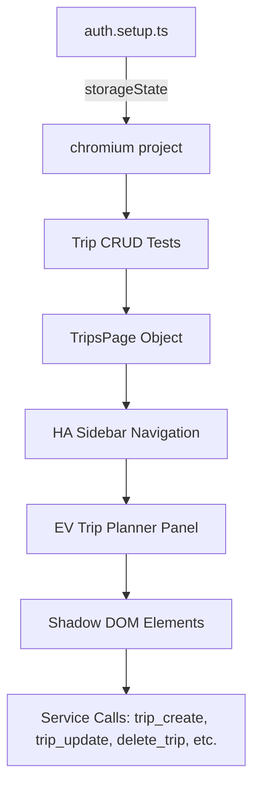
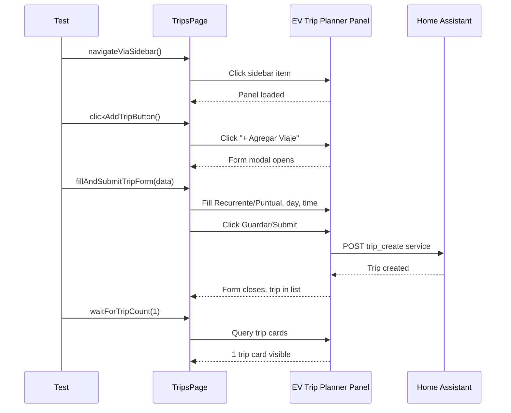

# Design: E2E Trip CRUD Tests

## Overview

Browser-based E2E Playwright tests that verify CRUD operations (Create, Read, Update, Delete) for trips in the EV Trip Planner panel. Tests reuse `storageState` from the working `auth.setup.ts` and navigate via sidebar. All Shadow DOM traversal uses web-first locators (`getByRole`, `getByText`, `getByLabel`).

## Architecture



## Components

### 1. TripsPage Page Object (`tests/e2e/pages/trips.page.ts`)

**Purpose**: Encapsulates all trip-related interactions with the EV Trip Planner panel.

**Responsibilities**:
- Navigate to panel via sidebar click
- Query trip list state via HA service calls
- Manage trip form modal (open, fill, submit)
- Trigger trip actions (edit, delete, pause, resume, complete, cancel)
- Read trip state from panel

**Key Methods**:

| Method | Purpose |
|--------|---------|
| `navigateViaSidebar()` | Click EV Trip Planner in sidebar |
| `getTripCount()` | Count visible trip cards |
| `getPanelUrl()` | Read panel URL from `playwright/.auth/panel-url.txt` |
| `clickAddTripButton()` | Click "+ Agregar Viaje" button |
| `openEditFormForTrip(tripIndex)` | Click Editar on specific trip |
| `openDeleteDialogForTrip(tripIndex)` | Click Eliminar on specific trip |
| `confirmDelete()` | Accept deletion dialog |
| `cancelDelete()` | Dismiss deletion dialog |
| `clickPauseButton(tripIndex)` | Click Pausar on recurring trip |
| `clickResumeButton(tripIndex)` | Click Reanudar on paused trip |
| `clickCompleteButton(tripIndex)` | Click Completar on punctual trip |
| `clickCancelButton(tripIndex)` | Click Cancelar on punctual trip |
| `isEmptyStateVisible()` | Check "No hay viajes" message |
| `waitForTripCount(expected, timeout)` | Assert trip count after CRUD |
| `callTripCreateService(data)` | Direct HA service call for test setup |
| `callDeleteTripService(tripId)` | Direct HA service call for cleanup |

**Web-First Locators**:

```typescript
// Main navigation
readonly sidebarTripPlannerItem = this.page.getByText(/ev trip planner|planificador de viajes/i);

// Add trip button
readonly addTripButton = this.page.getByRole('button', { name: /\+?\s*agregar viaje/i });

// Trip form modal
readonly tripFormOverlay = this.page.getByRole('dialog', { name: /viaje|trip/i });
readonly recurrenteOption = this.page.getByRole('radio', { name: /recurrente/i });
readonly puntualOption = this.page.getByRole('radio', { name: /puntual/i });
readonly daySelector = this.page.getByLabel(/dia|day/i);
readonly timeInput = this.page.getByLabel(/hora|time/i);
readonly submitButton = this.page.getByRole('button', { name: /guardar|crear|submit/i });

// Trip card actions
readonly editButton = (index: number) => this.page.getByRole('button', { name: /editar/i }).nth(index);
readonly deleteButton = (index: number) => this.page.getByRole('button', { name: /eliminar/i }).nth(index);
readonly pauseButton = (index: number) => this.page.getByRole('button', { name: /pausar/i }).nth(index);
readonly resumeButton = (index: number) => this.page.getByRole('button', { name: /reanudar/i }).nth(index);
readonly completeButton = (index: number) => this.page.getByRole('button', { name: /completar/i }).nth(index);
readonly cancelButton = (index: number) => this.page.getByRole('button', { name: /cancelar/i }).nth(index);

// Confirmation dialog
readonly confirmDialog = this.page.getByRole('alertdialog');
readonly confirmButton = this.page.getByRole('button', { name: /confirmar|delete|eliminar/i });
readonly cancelDialogButton = this.page.getByRole('button', { name: /cancelar|cancel/i });

// Empty state
readonly emptyState = this.page.getByText(/no hay viajes|no trips/i);

// Trip list
readonly tripCards = this.page.locator('ev-trip-planner-panel').locator('.trip-card');
```

### 2. Test File (`tests/e2e/trips.spec.ts`)

**Purpose**: Implement 6 user stories as Playwright tests.

**Structure**:

```typescript
// US-1: Trip List Loading Test
test.describe('US-1: Trip List Loading', () => {
  test('displays empty state when no trips exist', ...)
  test('displays recurring trips with day/time format', ...)
  test('displays punctual trips with date/time format', ...)
  test('shows correct trip count badge', ...)
});

// US-2: Create Trip Test
test.describe('US-2: Create Trip', () => {
  test('opens form modal when clicking + Agregar Viaje', ...)
  test('shows Recurrente option with day selector', ...)
  test('shows Puntual option without day selector', ...)
  test('creates recurring trip successfully', ...)
  test('creates punctual trip successfully', ...)
  test('new trip appears immediately in list', ...)
});

// US-3: Edit Trip Test
test.describe('US-3: Edit Trip', () => {
  test('opens edit form with pre-filled data', ...)
  test('updates trip successfully', ...)
});

// US-4: Delete Trip Test
test.describe('US-4: Delete Trip', () => {
  test('shows confirmation dialog on Eliminar', ...)
  test('removes trip on confirm', ...)
  test('keeps trip on cancel', ...)
});

// US-5: Pause/Resume Recurring Trip
test.describe('US-5: Pause/Resume Recurring', () => {
  test('shows Pausar for active recurring trip', ...)
  test('pauses trip and shows Reanudar', ...)
  test('resumes trip and shows Pausar again', ...)
});

// US-6: Complete/Cancel Punctual Trip
test.describe('US-6: Complete/Cancel Punctual', () => {
  test('shows Completar for active punctual trip', ...)
  test('completes trip and removes from list', ...)
  test('shows Cancelar for active punctual trip', ...)
  test('cancels trip and removes from list', ...)
});
```

## Technical Decisions

| Decision | Options | Choice | Rationale |
|----------|---------|--------|-----------|
| Locator strategy | CSS/XPath vs web-first | web-first (`getByRole`, `getByText`, `getByLabel`) | Shadow DOM encapsulation requires semantic locators that traverse shadow roots |
| Navigation | Sidebar click vs direct URL | Sidebar click | Requirement FR-1: "Navigate via sidebar, not hardcoded URLs" |
| Test data creation | Before each test via UI vs direct service call | Create via UI for main flows, direct service call for setup/cleanup | Ensures end-to-end validation of trip creation UX |
| Form interaction | Fill fields individually vs page.evaluate | Fill via web-first locators | Matches real user interaction, validates form wiring |
| Service verification | Mock service calls vs real calls | Real service calls + UI state verification | Tests full integration path |
| Confirmation dialog | Playwright dialog handler vs manual button click | Playwright dialog handler | `page.on('dialog')` auto-intercepts, cleaner test code |
| Test isolation | Each test creates/cleans its own data | Per-test setup via UI + teardown via service | No cross-test contamination |

## File Structure

| File | Action | Purpose |
|------|--------|---------|
| `tests/e2e/pages/trips.page.ts` | **Create** | Page object for trip panel interactions |
| `tests/e2e/trips.spec.ts` | **Create** | All 6 user story test suites |
| `tests/e2e/pages/index.ts` | **Modify** | Export new TripsPage |
| `tests/e2e/auth.setup.ts` | **Modify** | Fix URL case mismatch (line 282: use lowercase vehicle_id) |

## Data Flow



## Test Flow: Create Trip (US-2)

1. Navigate to panel via sidebar: `await tripsPage.navigateViaSidebar()`
2. Verify panel loaded: `await tripsPage.verifyPanelLoaded()`
3. Click add trip: `await tripsPage.clickAddTripButton()`
4. Verify form modal visible: `await tripsPage.verifyFormModalVisible()`
5. Select trip type: `await tripsPage.selectRecurrente()` or `await tripsPage.selectPuntual()`
6. If Recurrente, select day: `await tripsPage.selectDay('Lunes')`
7. Enter time: `await tripsPage.enterTime('08:00')`
8. Submit form: `await tripsPage.submitForm()`
9. Verify form closes: `await tripsPage.waitForFormHidden()`
10. Verify trip in list: `await tripsPage.waitForTripCount(n + 1)`

## Error Handling

| Scenario | Handling | User Impact |
|----------|----------|-------------|
| Shadow DOM locator timeout | Playwright auto-retry with `expect().toBeVisible()` | Test fails with clear "element not found" |
| Service call failure | Catch, assert with service error message | Test fails showing service error toast |
| Form validation error | Verify error message visible in form | Test fails showing validation error |
| Delete confirmation dialog timeout | Dialog auto-accepted via `page.on('dialog')` | Clean dialog handling |
| Trip not appearing after create | Wait with `waitForTripCount()`, assert eventually | Test fails showing trip count mismatch |
| Network timeout | Playwright `actionTimeout: 10000` | Test fails with timeout |

## Selector Strategy

### Primary Selectors (Web-First)

```typescript
// Navigation
' EV Trip Planner' sidebar item:
  page.getByText(/ev trip planner/i).click()

// Add trip button:
  page.getByRole('button', { name: /\+?\s*agregar viaje/i })

// Form type selection
  page.getByRole('radio', { name: /recurrente/i })
  page.getByRole('radio', { name: /puntual/i })

// Day selector (Recurrente only)
  page.getByLabel(/dia|day/i)

// Time input
  page.getByLabel(/hora|time/i)

// Action buttons
  page.getByRole('button', { name: /editar/i })
  page.getByRole('button', { name: /eliminar/i })
  page.getByRole('button', { name: /pausar/i })
  page.getByRole('button', { name: /reanudar/i })
  page.getByRole('button', { name: /completar/i })
  page.getByRole('button', { name: /cancelar/i })

// Confirmation
  page.getByRole('alertdialog')
  page.getByRole('button', { name: /confirmar|eliminar/i })
  page.getByRole('button', { name: /cancelar/i })

// Empty state
  page.getByText(/no hay viajes/i)
```

### Fallback Selectors (Only if web-first fails)

If a web-first locator truly cannot be constructed, use `page.locator()` with text content matching - NOT CSS classes:

```typescript
// BAD - CSS class (fragile)
page.locator('.trip-card')

// GOOD - text content via locator
page.locator('ev-trip-planner-panel').getByText('Monday')
```

## Test Strategy

### Mock Boundary

| Layer | Mock allowed? | Rationale |
|-------|---------------|-----------|
| Own page object methods | NO | Tests real page object wiring |
| TripsPage → Panel interaction | NO | Real browser, real panel |
| Panel → HA service calls | NO | Tests full integration |
| Test setup via direct service call | YES | Only for creating seed data before tests |
| Test cleanup via direct service call | YES | Only for removing test-created data |

### Test Coverage Table

| Component / Test | Type | What to assert | Mocks |
|------------------|------|----------------|-------|
| TripsPage.navigateViaSidebar | e2e | URL contains panel path, panel loaded | none |
| TripsPage.clickAddTripButton | e2e | Form modal visible | none |
| TripsPage.selectTripType (Recurrente) | e2e | Day selector appears | none |
| TripsPage.selectTripType (Puntual) | e2e | Day selector hidden | none |
| TripsPage.fillAndSubmitForm | e2e | Form closes, trip in list | none |
| US-1: Empty state | e2e | "No hay viajes" visible when 0 trips | service (trip_list returns empty) |
| US-2: Create recurring trip | e2e | Trip appears with day/time | none |
| US-2: Create punctual trip | e2e | Trip appears with date/time | none |
| US-3: Edit trip | e2e | Form pre-filled, updates after save | none |
| US-4: Delete with confirm | e2e | Trip removed from list | none |
| US-4: Delete with cancel | e2e | Trip remains in list | none |
| US-5: Pause recurring | e2e | Pause button -> Resume button visible | none |
| US-5: Resume recurring | e2e | Resume button -> Pause button visible | none |
| US-6: Complete punctual | e2e | Trip removed from active list | none |
| US-6: Cancel punctual | e2e | Trip removed from active list | none |

### Test File Conventions

- **Test runner**: `@playwright/test`
- **Test file location**: `tests/e2e/trips.spec.ts`
- **Page object location**: `tests/e2e/pages/trips.page.ts`
- **Auth storage**: `playwright/.auth/user.json` (via `chromium` project in config)
- **Test isolation**: Each test creates its own trip data, cleans up via service call
- **No `.skip`**: All tests must run; use `test.fixme()` only if blocking issue with reference

### Skip Policy

- `.skip` or `xit` FORBIDDEN unless referencing a GitHub issue
- `test.fixme()` preferred for known failures (creates tracking)

## Unresolved Questions

- Should tests use direct HA service calls to create seed data, or only UI-based creation?
- How to handle pre-existing trips from previous test runs (cleanup strategy)?

## Implementation Steps

1. Create `tests/e2e/pages/trips.page.ts` with all locators and methods
2. Create `tests/e2e/trips.spec.ts` with US-1 through US-6 test suites
3. Update `tests/e2e/pages/index.ts` to export `TripsPage`
4. Run tests against ephemeral HA to verify locator strategy works with Shadow DOM
5. Verify all 6 user stories pass in Chrome
