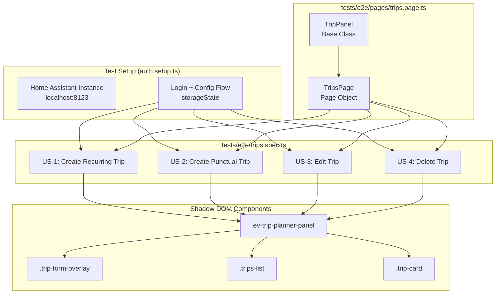

# Design: E2E Trip CRUD Tests

## Overview

Playwright E2E tests verifying CRUD operations (Create, Edit, Delete) for trips in the EV Trip Planner panel. Tests interact through Shadow DOM using the `ev-trip-planner-panel >> selector` locator chain pattern. Each test is fully independent: it creates its own trips, performs operations, and cleans up in `test.afterEach()`. Dialog handling for delete confirmation uses Playwright's `page.on('dialog')` event handler.

## Architecture



## Components

### TripsPage (Page Object)

**Location**: `tests/e2e/pages/trips.page.ts`

**Responsibility**: Encapsulates all trip CRUD operations with proper Shadow DOM traversal and dialog handling.

**Public API**:
```typescript
class TripsPage {
  constructor(page: Page, vehicleId?: string);

  // Navigation
  navigateToPanel(): Promise<void>;

  // Trip Operations
  createRecurringTrip(trip: RecurringTripData): Promise<string>;
  createPunctualTrip(trip: PunctualTripData): Promise<string>;
  editTrip(tripId: string, updates: Partial<TripData>): Promise<void>;
  deleteTrip(tripId: string, acceptDialog?: boolean): Promise<void>;

  // Queries
  getTripCount(): Promise<number>;
  waitForTrip(tripId: string, timeout?: number): Promise<void>;
  getTripCard(tripId: string): Locator;
  getAllTripIds(): Promise<string[]>;

  // Cleanup
  cleanupTrips(): Promise<void>;
}
```

### TripPanel (Base Class)

**Location**: `tests/e2e/test-helpers.ts`

**Responsibility**: Provides Shadow DOM traversal utilities and dialog handling for the `ev-trip-planner-panel` web component.

**Existing Methods Used**:
- `navigateToPanel()` - navigates to `/ev-trip-planner-{vehicleId}`
- `openAddTripForm()` - clicks `.add-trip-btn`
- `fillTripForm(data)` - fills form fields
- `submitTripForm()` - clicks `.btn-primary`
- `setupDialogHandler(accept)` - sets up dialog listener
- `getTripCount()` - counts `.trip-card` elements

### TripData Interfaces

**Location**: `tests/e2e/pages/trips.page.ts`

```typescript
interface RecurringTripData {
  type: 'recurrente';
  day: string;       // '0'-'6' (Sunday-Saturday)
  time: string;     // 'HH:mm' 24h format
  km: string;
  kwh?: string;
  description?: string;
}

interface PunctualTripData {
  type: 'puntual';
  datetime: string;  // 'YYYY-MM-DDTHH:mm' datetime-local format
  km: string;
  kwh?: string;
  description?: string;
}

type TripData = RecurringTripData | PunctualTripData;
```

## Shadow DOM Strategy

**Locator Chain Pattern** (mandatory for all panel interactions):
```typescript
// CORRECT: chain through shadow root
await page.locator('ev-trip-planner-panel').locator('.add-trip-btn').click();
await page.locator('ev-trip-planner-panel').locator('#trip-type').selectOption('recurrente');
await page.locator('ev-trip-planner-panel').locator('#trip-km').fill('25.5');

// WRONG: direct selector fails inside Shadow DOM
await page.locator('.add-trip-btn').click();  // Will not find element
```

**Form Open/Close Flow**:
```typescript
// Open form
await page.locator('ev-trip-planner-panel').locator('.add-trip-btn').click();
await page.locator('ev-trip-planner-panel').locator('.trip-form-overlay').waitFor({ state: 'visible' });

// Close form (cancel)
await page.locator('ev-trip-planner-panel').locator('.btn-secondary').click();
await page.locator('ev-trip-planner-panel').locator('.trip-form-overlay').waitFor({ state: 'hidden' });
```

## Dialog Handling (Delete Confirmation)

**Pattern**: Playwright `page.on('dialog')` event listener registered before action.

```typescript
test('should delete a trip', async ({ page }) => {
  // Register dialog handler BEFORE triggering delete
  let dialogAccepted = false;
  page.on('dialog', async dialog => {
    dialogAccepted = true;
    await dialog.accept();
  });

  // Perform delete
  await page.locator('ev-trip-planner-panel')
    .locator(`.trip-card[data-trip-id="${tripId}"]`)
    .locator('.trip-action-btn.delete-btn')
    .click();

  // Verify dialog was handled
  expect(dialogAccepted).toBe(true);
});
```

**Cancel Dialog Variant**:
```typescript
page.on('dialog', async dialog => {
  await dialog.dismiss();
});
```

## Cleanup Strategy

**After Each Test**: Delete all trips created during the test.

```typescript
test.afterEach(async ({ page }) => {
  const tripsPage = new TripsPage(page, 'Coche2');
  await tripsPage.cleanupTrips();
});
```

**cleanupTrips() Implementation**:
```typescript
async cleanupTrips(): Promise<void> {
  const tripIds = await this.getAllTripIds();
  for (const tripId of tripIds) {
    try {
      await this.deleteTrip(tripId, true);
    } catch (e) {
      // Trip may already be deleted; ignore
    }
  }
}
```

**Why not clear all**: Tests must only delete their own trips. Other tests may have created trips concurrently (parallel execution). Using `getAllTripIds()` after setup phase ensures we only delete trips that exist.

## Error Handling

| Scenario | Handling Strategy | Timeout |
|----------|-------------------|---------|
| Form field not visible | Retry with polling | 5s |
| Trip card not appearing | `waitForSelector` with timeout | 10s |
| Delete dialog not appearing | Fail fast (HA regression) | 2s |
| Trip still visible after delete | `waitForSelector` hidden | 5s |
| Network/navigation timeout | Playwright default | 30s |

**Retry Logic for Flaky Elements**:
```typescript
async waitForTrip(tripId: string, timeout = 10000): Promise<void> {
  const card = this.getTripCard(tripId);
  await card.waitFor({ state: 'visible', timeout });
}
```

## Test Files Structure

```
tests/e2e/
  trips.spec.ts          # 4 user story tests
  pages/
    trips.page.ts        # TripPage object (NEW)
    index.ts            # export TripsPage
```

**Files NOT to modify**:
- `tests/e2e/pages/ev-trip-planner.page.ts` - exists for dashboard/vehicle-level operations
- `tests/e2e/test-helpers.ts` - TripPanel base class unchanged

## Test Cases

### US-1: Create Recurring Trip

```typescript
test('US-1: should create a recurring trip', async ({ page }) => {
  const tripsPage = new TripsPage(page, 'Coche2');
  await tripsPage.navigateToPanel();

  const tripId = await tripsPage.createRecurringTrip({
    type: 'recurrente',
    day: '1',       // Monday
    time: '08:30',
    km: '25.5',
    kwh: '4.2',
    description: 'Daily commute'
  });

  await tripsPage.waitForTrip(tripId);
  const card = tripsPage.getTripCard(tripId);
  await expect(card).toContainText('25.5');
  await expect(card).toContainText('08:30');
});
```

### US-2: Create Punctual Trip

```typescript
test('US-2: should create a punctual trip', async ({ page }) => {
  const tripsPage = new TripsPage(page, 'Coche2');
  await tripsPage.navigateToPanel();

  const tripId = await tripsPage.createPunctualTrip({
    type: 'puntual',
    datetime: '2026-04-15T09:00',
    km: '50.0',
    kwh: '8.5',
    description: 'Trip to airport'
  });

  await tripsPage.waitForTrip(tripId);
  const card = tripsPage.getTripCard(tripId);
  await expect(card).toContainText('50.0');
  // Punctual trips do NOT show day-of-week
});
```

### US-3: Edit Trip

```typescript
test('US-3: should edit an existing trip', async ({ page }) => {
  const tripsPage = new TripsPage(page, 'Coche2');
  await tripsPage.navigateToPanel();

  const tripId = await tripsPage.createRecurringTrip({
    type: 'recurrente',
    day: '1',
    time: '08:00',
    km: '20.0'
  });
  await tripsPage.waitForTrip(tripId);

  // Open edit form
  await tripsPage.getTripCard(tripId).locator('.edit-btn').click();
  const form = page.locator('ev-trip-planner-panel').locator('.trip-form-overlay');
  await expect(form).toBeVisible();

  // Verify pre-filled (button text changes)
  const submitBtn = page.locator('ev-trip-planner-panel').locator('.btn-primary');
  await expect(submitBtn).toContainText('Guardar Cambios');

  // Edit and save
  await tripsPage.editTrip(tripId, { km: '35.0', time: '09:00' });

  // Verify update
  const card = tripsPage.getTripCard(tripId);
  await expect(card).toContainText('35.0');
  await expect(card).toContainText('09:00');
});
```

### US-4: Delete Trip

```typescript
test('US-4: should delete a trip', async ({ page }) => {
  const tripsPage = new TripsPage(page, 'Coche2');
  await tripsPage.navigateToPanel();

  const tripId = await tripsPage.createRecurringTrip({
    type: 'recurrente',
    day: '2',
    time: '10:00',
    km: '15.0'
  });
  await tripsPage.waitForTrip(tripId);
  const initialCount = await tripsPage.getTripCount();

  // Delete with dialog acceptance
  await tripsPage.deleteTrip(tripId, true);

  // Verify removal
  const newCount = await tripsPage.getTripCount();
  expect(newCount).toBe(initialCount - 1);
});
```

## Technical Decisions

| Decision | Options Considered | Choice | Rationale |
|----------|-------------------|--------|-----------|
| Shadow DOM traversal | `>>` combinator, `.locator().locator()` | `.locator().locator()` | More explicit, clearer error messages |
| Dialog handling | `page.evaluate()` JS, `page.on('dialog')` | `page.on('dialog')` | Official Playwright API, non-blocking |
| Page Object location | Extend ev-trip-planner.page.ts, separate trips.page.ts | Separate | Separation of concerns - trips are distinct from dashboard |
| Cleanup strategy | Delete all trips, delete created only | Delete created only | Parallel-safe, maintains test independence |
| Trip ID storage | Generate UUID, use data-trip-id attribute | data-trip-id attribute | Direct, no UUID tracking needed |

## File Structure

| File | Action | Purpose |
|------|--------|---------|
| `tests/e2e/pages/trips.page.ts` | Create | TripPage object with CRUD methods |
| `tests/e2e/pages/index.ts` | Modify | Export TripsPage |
| `tests/e2e/trips.spec.ts` | Create | 4 user story tests |

## Test Strategy

### Mock Boundary

| Layer | Mock allowed? | Rationale |
|---|---|---|
| TripPanel base class (test-helpers.ts) | NO | Shared infrastructure, tested once |
| TripsPage methods (own business logic) | NO | Must test real DOM interaction |
| Playwright browser/dialog API | NO | Real browser required for Shadow DOM |
| Home Assistant API (trip services) | NO | E2E tests verify full integration |
| Dialog (window.confirm) | NO | Browser built-in, cannot mock |

### Test Coverage Table

| Component / Function | Test type | What to assert | Mocks needed |
|---|---|---|---|
| TripsPage.createRecurringTrip | e2e | Trip card appears with correct day/time/km | none |
| TripsPage.createPunctualTrip | e2e | Trip card appears with correct datetime/km | none |
| TripsPage.editTrip | e2e | Card reflects new km/time values after save | none |
| TripsPage.deleteTrip | e2e | Trip card removed, count decrements | none |
| TripsPage.cleanupTrips | e2e | All created trips removed after test | none |
| US-1: Create Recurring | e2e | AC-1.1 through AC-1.11 verified | none |
| US-2: Create Punctual | e2e | AC-2.1 through AC-2.8 verified | none |
| US-3: Edit Trip | e2e | AC-3.1 through AC-3.6 verified | none |
| US-4: Delete Trip | e2e | AC-4.1 through AC-4.5 verified | none |
| Dialog: accept on delete | e2e | Trip removed after dialog.accept() | none |
| Dialog: dismiss on delete | e2e | Trip remains after dialog.dismiss() | none |

### Test File Conventions

Based on codebase analysis:

- **Test runner**: Playwright (vitest underlying)
- **Test file location**: co-located `*.spec.ts` in `tests/e2e/`
- **Page Object location**: `tests/e2e/pages/*.page.ts`
- **Index export**: `tests/e2e/pages/index.ts`
- **Base class**: `tests/e2e/test-helpers.ts` exports `test` and `TripPanel`
- **Auth setup**: `tests/e2e/auth.setup.ts` (setup project, runs first)
- **Storage state**: `playwright/.auth/user.json` (created by auth.setup.ts)
- **Mock cleanup**: `page.on('dialog')` handlers auto-clear per test

### Skip Policy

Tests marked `.skip` or `xit`/`xdescribe` are FORBIDDEN unless:
1. The test is for functionality not yet implemented (must have a GitHub issue reference)
2. The skip reason is documented inline: `it.skip('TODO: #123 - implement X first', ...)`

## Performance Considerations

- **Parallel execution**: `fullyParallel: true` in playwright.config.ts - tests run concurrently
- **Timeout tuning**: 10s for DOM operations, 30s for navigation
- **No artificial sleeps**: Use Playwright auto-waiting and `waitForSelector`

## Security Considerations

- **Auth state**: Stored in `playwright/.auth/user.json` - not committed to git
- **No credentials in code**: Auth.setup reads from `.env` via `global.setup.ts`
- **Vehicle ID**: Hardcoded "Coche2" (per requirements) - acceptable for E2E tests

## Existing Patterns to Follow

- **Shadow DOM traversal**: `page.locator('ev-trip-planner-panel').locator('#selector')` - confirmed working in test-helpers.ts
- **Dialog handling**: `page.on('dialog')` pattern as used in test-helpers.ts `setupDialogHandler()`
- **Form submission**: Click `.btn-primary` - button text changes between "Crear Viaje" (create) and "Guardar Cambios" (edit)
- **Trip identification**: Use `data-trip-id` attribute on `.trip-card` elements

## Implementation Steps

1. Create `tests/e2e/pages/trips.page.ts` with `TripsPage` class implementing all CRUD methods
2. Update `tests/e2e/pages/index.ts` to export `TripsPage`
3. Create `tests/e2e/trips.spec.ts` with 4 tests (US-1 through US-4)
4. Add `test.afterEach()` cleanup to `trips.spec.ts`
5. Verify playwright.config.ts projects include the new test file (it should via `testDir: './tests/e2e'`)
6. Run tests with `npx playwright test trips.spec.ts` to verify
