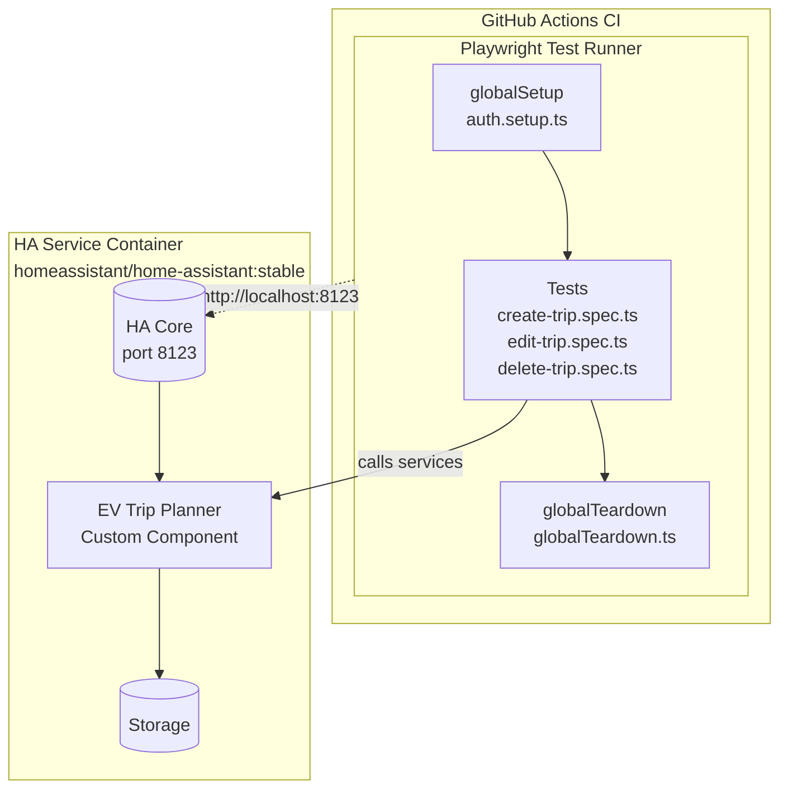
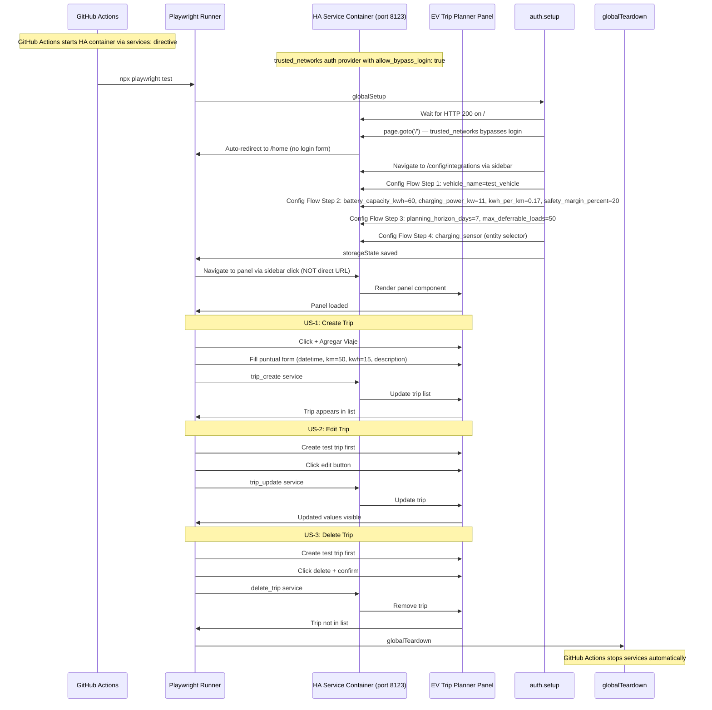

# Design: E2E Trip CRUD Tests

## Overview

Implement smoke tests for EV Trip Planner CRUD operations (Create, Edit, Delete) using Playwright in GitHub Actions. The tests simulate real user interactions with the Lit web component panel at `/ev-trip-planner-{vehicle_id}`, hitting actual Home Assistant services (trip_create, trip_update, delete_trip) rather than mocking.

## Architecture



**Key architecture change**: HA runs as a GitHub Actions `services:` container, not as a Docker-in-Docker container. The `ubuntu-latest` runner does not have a Docker daemon, so we use the services directive to run HA as a sidecar container with the custom component mounted via volume.

## Components

### playwright.config.ts
**Purpose**: Configure Playwright for CI with HA service container.

**Responsibilities**:
- Set baseURL pointing to HA service container (`http://localhost:8123`)
- Configure timeout (30s for HA services)
- Single worker to avoid port conflicts
- Trace collection for debugging

**Interface**:
```typescript
import { defineConfig } from '@playwright/test';

export default defineConfig({
  testDir: './tests/e2e',
  timeout: 30000,
  retries: 1,
  workers: 1,
  reporter: [['list'], ['html', { outputFolder: 'playwright-report' }]],
  use: {
    baseURL: 'http://localhost:8123',
    trace: 'on-first-retry',
    screenshot: 'only-on-failure',
    video: 'retain-on-failure',
  },
  globalSetup: './auth.setup.ts',
  globalTeardown: './globalTeardown.ts',
});
```

### auth.setup.ts (globalSetup)
**Purpose**: Authenticate with HA via trusted_networks bypass and install EV Trip Planner integration via Config Flow.

**Responsibilities**:
1. Wait for HA to be ready (HTTP 200 on `http://localhost:8123/`)
2. Navigate to root URL `page.goto('/')` — HA auto-redirects to `/home` via trusted_networks bypass (no login form)
3. Navigate to panel via sidebar click (NOT direct URL — HA is SPA)
4. Execute Config Flow (4 steps) to install EV Trip Planner with test vehicle
5. Save `storageState` to `playwright/.auth/user.json`

**IMPORTANT**: Per homeassistant-selector-map skill, `page.goto()` to internal URLs or `/login` is FORBIDDEN. HA is a SPA — only `page.goto('/')` is allowed as entry point. trusted_networks auth provider with `allow_bypass_login: true` bypasses the login form entirely.

**Selector patterns for auth flow**:

| Step | Selector | Pattern |
|------|----------|---------|
| Root navigation | `page.goto('/')` then `page.waitForURL('/home')` | Only allowed entry point |
| Sidebar link | `page.getByRole('link', { name: 'EV Trip Planner' })` | Navigate to panel |
| Add Integration | `page.getByRole('button', { name: /Add Integration/i })` | From integrations page |
| Integration search | `page.getByRole('textbox', { name: /search/i })` | Search field |
| Config Flow form fields | `page.getByRole('textbox', { name: /field_name/i })` | By name |
| Config Flow submit | `page.getByRole('button', { name: /Next\|Submit\|Finish/i })` | By name |

**Config Flow Implementation Details**:

The Config Flow has 4 sequential steps, each requiring form submission:

| Step | Function | Fields | Defaults |
|------|----------|--------|----------|
| 1 | `async_step_user` | vehicle_name | - |
| 2 | `async_step_sensors` | battery_capacity_kwh, charging_power_kw, kwh_per_km, safety_margin_percent | 60.0, 11.0, 0.17, 20 |
| 3 | `async_step_emhass` | planning_horizon_days, max_deferrable_loads, planning_sensor | 7, 50, (optional) |
| 4 | `async_step_presence` | charging_sensor (required), home_sensor, plugged_sensor | - |

**Step-by-step Config Flow**:

1. **Navigate to**: `/config/integrations`
2. **Find integration**: Click "+ Add Integration" → search for "EV Trip Planner" → click to start Config Flow
3. **Step 1 - Vehicle Name**: Fill `vehicle_name` = "test_vehicle"
4. **Step 2 - Sensors**: Fill:
   - `battery_capacity_kwh`: "60"
   - `charging_power_kw`: "11"
   - `kwh_per_km`: "0.17"
   - `safety_margin_percent`: "20"
5. **Step 3 - EMHASS**: Accept defaults (click "Next" or "Submit"):
   - `planning_horizon_days`: "7" (default)
   - `max_deferrable_loads`: "50" (default)
   - `planning_sensor`: (optional, leave empty)
6. **Step 4 - Presence**: Skip or provide entity selectors:
   - `charging_sensor`: (required - may auto-select if missing)
   - `home_sensor`: (optional)
   - `plugged_sensor`: (optional)
7. **Submit** via "Submit" or "Finish" button
8. **Vehicle ID**: hardcoded as `test_vehicle` for all CI tests (URL: `/ev-trip-planner-test_vehicle`)

**Critical paths**:
- HA startup: handled by GitHub Actions services directive (~30-60s for container init)
- trusted_networks auth: `allow_bypass_login: true` in configuration.yaml — no login form needed
- Config Flow: requires UI interaction via Playwright, 4 sequential steps
- storageState must include cookies + localStorage for HA session
- SPA navigation: NEVER use `page.goto('/ev_trip_planner')` — use sidebar click instead

### globalTeardown.ts
**Purpose**: Cleanup after test run.

**Responsibilities**:
- No container cleanup needed (GitHub Actions handles services lifecycle)
- Cleanup any leftover state files (server-info.json if written)

### tests/e2e/create-trip.spec.ts (US-1)
**Purpose**: Smoke test for puntual trip creation.

**Test flow**:
1. Navigate to root: `page.goto('/')` then `page.waitForURL('/home')`
2. Navigate to panel via sidebar: `page.getByRole('link', { name: 'EV Trip Planner' }).click()`
3. Wait for panel URL: `page.waitForURL(/\/ev_trip_planner\/)`
4. Click `+ Agregar Viaje` button
5. Select trip type "puntual"
6. Fill form: datetime-local, km, kwh, description (NOTE: no "Trip name" field - only `description` textarea)
7. Submit via "Crear Viaje" button
8. Assert trip appears in trips list with submitted values

**IMPORTANT**: Per homeassistant-selector-map skill, `page.goto('/ev-trip-planner-test_vehicle')` is FORBIDDEN. HA is a SPA — only `page.goto('/')` followed by sidebar navigation is allowed.

**Selector patterns for panel** (Playwright auto-pierces shadow DOM with web-first locators):

| Element | Selector | Notes |
|---------|----------|-------|
| Add trip button | `page.getByRole('button', { name: /Agregar Viaje/i })` | Auto-pierces shadow DOM |
| Trip type select | `page.getByRole('combobox', { name: /trip.type/i })` | For selecting puntual/recurrente |
| Datetime field | `page.getByLabel(/datetime/i)` or `page.getByRole('textbox', { name: /datetime/i })` | Form field |
| KM field | `page.getByLabel(/km/i)` or `page.getByRole('spinbutton', { name: /km/i })` | Numeric field |
| KWH field | `page.getByLabel(/kwh/i)` or `page.getByRole('spinbutton', { name: /kwh/i })` | Numeric field |
| Description textarea | `page.getByLabel(/description/i)` or `page.getByRole('textbox', { name: /description/i })` | Text area |
| Submit button | `page.getByRole('button', { name: /Crear Viaje/i })` | Form submit |

**Scoped panel access** (if web-first locators need scoping):
```typescript
const panel = page.locator('ev-trip-planner-panel');
await panel.getByRole('button', { name: /Agregar Viaje/i }).click();
```

**Test values** (from AC-1.4):
- datetime: "2026-04-15T08:30"
- km: "50"
- kwh: "15"
- description: "Test Commute"

**Test assertions**:
- Form overlay visible after click
- Trip card appears in list after create
- Values match: km, kwh, description, datetime

### tests/e2e/edit-trip.spec.ts (US-2)
**Purpose**: Smoke test for editing existing trip.

**Test flow**:
1. Navigate to root: `page.goto('/')` then `page.waitForURL('/home')`
2. Navigate to panel via sidebar: `page.getByRole('link', { name: 'EV Trip Planner' }).click()`
3. Wait for panel URL: `page.waitForURL(/\/ev_trip_planner\/)`
4. Create a recurrente trip first (setup for edit test)
5. Click edit button (pencil icon) on trip card
6. Modify km to new value and description
7. Submit via "Guardar Cambios" button
8. Assert trip card shows updated values

**Selector patterns for edit flow**:

| Element | Selector | Notes |
|---------|----------|-------|
| Edit button | `page.getByRole('button', { name: /edit/i })` or `page.getByTestId('edit-trip-{id}')` | If testid exposed |
| Edit form - KM | `page.getByLabel(/km/i)` or `page.getByRole('spinbutton', { name: /km/i })` | Pre-filled |
| Edit form - KWH | `page.getByLabel(/kwh/i)` or `page.getByRole('spinbutton', { name: /kwh/i })` | Pre-filled |
| Edit form - Description | `page.getByLabel(/description/i)` | Pre-filled |
| Save button | `page.getByRole('button', { name: /Guardar Cambios/i })` | Submit edit |

### tests/e2e/delete-trip.spec.ts (US-3)
**Purpose**: Smoke test for deleting trip with confirmation dialog.

**Test flow**:
1. Navigate to root: `page.goto('/')` then `page.waitForURL('/home')`
2. Navigate to panel via sidebar: `page.getByRole('link', { name: 'EV Trip Planner' }).click()`
3. Wait for panel URL: `page.waitForURL(/\/ev_trip_planner\/)`
4. Create a puntual trip first (setup for delete test)
5. Click delete button (trash icon) on trip card
6. Handle `window.confirm()` dialog via Playwright dialog handler
7. Assert trip no longer appears in list

**Selector patterns for delete flow**:

| Element | Selector | Notes |
|---------|----------|-------|
| Delete button | `page.getByRole('button', { name: /delete/i })` or `page.getByTestId('delete-trip-{id}')` | If testid exposed |

**Dialog handling**:
```typescript
// In test setup or before delete click:
page.on('dialog', async dialog => {
  expect(dialog.message()).toContain('¿Estás seguro de que quieres eliminar este viaje?');
  await dialog.accept();
});

// Then click delete
await page.getByRole('button', { name: /delete/i }).click();
```

**Delete dialog text (exact)**: `¿Estás seguro de que quieres eliminar este viaje?`

## Technical Decisions

| Decision | Options Considered | Choice | Rationale |
|----------|-------------------|--------|-----------|
| Ephemeral HA strategy | DinD vs service container vs Python venv | GitHub Actions services | ubuntu-latest has no Docker daemon; services directive runs HA as sidecar with volume-mounted custom component |
| Shadow DOM selector | Web-first (getByRole/getByText) vs CSS pierce (>>) | Web-first locators | Per homeassistant-selector-map skill; Playwright auto-pierces shadow DOM with getByRole, getByText; >> is forbidden anti-pattern |
| Dialog handling | Playwright dialog handler vs `page.evaluate` | Playwright dialog handler | Native Playwright support; `page.on('dialog')` handles `window.confirm()` automatically |
| Test data isolation | Each test creates+deletes own data | Each test creates+deletes | Implicit in all US; prevents cross-test contamination |
| Auth flow | trusted_networks bypass + Config Flow vs login form | trusted_networks bypass | Per homeassistant-selector-map skill; `allow_bypass_login: true` skips login form entirely; only `page.goto('/')` is allowed as entry point |
| Navigation | Sidebar click vs direct URL (forbidden) | Sidebar click only | HA is SPA; `page.goto('/ev_trip_planner')` is forbidden anti-pattern per skill |
| Vehicle ID for CI | Hardcoded "test_vehicle" vs config | Hardcoded "test_vehicle" | Consistent across tests; URL becomes `/ev-trip-planner-test_vehicle` |
| Docker image | ghcr.io vs homeassistant/* | homeassistant/home-assistant:stable | Official stable image; well-tested with Config Flow |
| HA service URL | localhost:8123 vs service name | http://localhost:8123 | GitHub Actions services exposed on localhost |
| Config Flow steps | 4 steps (user, sensors, emhass, presence) | All 4 documented | Actual config_flow.py has 4 sequential steps with entity selectors |

## File Structure

| File | Action | Purpose |
|------|--------|---------|
| `playwright.config.ts` | Create | Playwright configuration for CI |
| `auth.setup.ts` | Create | globalSetup - authenticate + install integration via Config Flow (4 steps) |
| `globalTeardown.ts` | Create | globalTeardown - cleanup state files |
| `tests/e2e/create-trip.spec.ts` | Create | US-1 smoke test |
| `tests/e2e/edit-trip.spec.ts` | Create | US-2 smoke test |
| `tests/e2e/delete-trip.spec.ts` | Create | US-3 smoke test |
| `tests/e2e/trips-helpers.ts` | Create | Shared helper functions (create test trip, cleanup) |
| `playwright/.auth/user.json` | Created by auth.setup | Auth state for tests |
| `.github/workflows/playwright.yml` | Modify | Add HA service container to services directive |

## Data Flow



## Error Handling

| Error Scenario | Handling Strategy | User Impact |
|----------------|-------------------|-------------|
| HA service fails to start | Fail globalSetup with diagnostic | Test suite fails, no partial runs |
| trusted_networks misconfigured | Fail globalSetup, redirect to /auth/authorize | Check configuration.yaml has allow_bypass_login: true |
| Config Flow fails (any step) | Fail globalSetup, integration not installed | 404 on panel URL |
| Panel gives 404 | Fail test, check integration installed | Panel URL correct? Config Flow completed? |
| Trip create service fails | Test fails, trip not in list | HA service error in logs |
| Shadow DOM selector timeout | Debug with trace, verify web-first locator works | Selector not found - use getByRole/getByText |
| Dialog text mismatch | Test fails, update expected text | Exact dialog text must match |
| HA container cleanup | GitHub Actions handles automatically | No manual cleanup needed |

## Test Strategy

### Mock Boundary

| Layer | Mock allowed? | Rationale |
|---|---|---|
| Playwright test code | NEVER | Must test real user interactions |
| HA services (trip_create, trip_update, delete_trip) | NEVER | Core functionality being tested |
| Home Assistant frontend JS | NEVER | Part of the system under test |
| Browser (Chromium) | NEVER | Provided by Playwright |
| HA service container | NEVER | Real HA instance for integration tests |
| Window.confirm dialog | MUST MOCK | Native browser dialog, not code |

### Test Coverage Table

| Component / Function | Test type | What to assert | Mocks needed |
|---|---|---|---|
| Create trip flow (US-1) | e2e | Trip card appears with correct values (km=50, kwh=15, description="Test Commute") | none |
| Edit trip flow (US-2) | e2e | Trip card shows updated km and description after save | none |
| Delete trip flow (US-3) | e2e | Trip card disappears after confirm dialog accepted | dialog (page.on) |
| globalSetup: HA wait | integration | HTTP 200 on http://localhost:8123 | none |
| globalSetup: Auth | integration | storageState saved with valid session | none |
| globalSetup: Config Flow Step 1 (user) | integration | vehicle_name field submitted | none |
| globalSetup: Config Flow Step 2 (sensors) | integration | battery_capacity_kwh, charging_power_kw, kwh_per_km, safety_margin_percent submitted | none |
| globalSetup: Config Flow Step 3 (emhass) | integration | planning_horizon_days, max_deferrable_loads submitted (defaults accepted) | none |
| globalSetup: Config Flow Step 4 (presence) | integration | charging_sensor entity selector handled | none |
| globalTeardown: cleanup | integration | State files cleaned | none |

### Test File Conventions

Based on homeassistant-selector-map skill patterns:
- Test runner: `@playwright/test` v1.58.2
- Test file location: `tests/e2e/*.spec.ts`
- Test config location: `playwright.config.ts` in project root
- Auth setup: `auth.setup.ts` (globalSetup) — uses trusted_networks bypass, NOT login form
- Teardown: `globalTeardown.ts` (globalTeardown)
- Auth state: `playwright/.auth/user.json` (gitignored)
- Test isolation: 1 worker, each test creates and cleans its own data
- **Selector priority**: getByRole > getByLabel > getByTestId > getByText > locator('css')
- Playwright auto-pierces shadow DOM with web-first locators (getByRole, getByTestId)
- **FORBIDDEN**: `>>` pierce syntax, XPath, CSS classes from Lit/Polymer, hardcoded shadow DOM depth, `page.goto('/login')`, `page.goto('/ev_trip_planner')`
- **Navigation pattern**: `page.goto('/')` → `page.waitForURL('/home')` → sidebar click → `page.waitForURL(/\/ev_trip_planner\/)`

### Skip Policy

Tests marked `.skip` are FORBIDDEN unless:
1. The functionality is not yet implemented (must have GitHub issue reference)
2. The skip reason is documented inline with issue reference

## GitHub Actions Workflow Update

The `.github/workflows/playwright.yml` must add the HA service container with trusted_networks configuration. This change is **mandatory**.

```yaml
jobs:
  test:
    services:
      homeassistant:
        image: homeassistant/home-assistant:stable
        ports:
          - 8123:8123
        volumes:
          - ./tests/ha-manual/custom_components:/config/custom_components:ro
          - ./tests/ha-manual/configuration.yaml:/config/configuration.yaml:ro
        env:
          - HAPPY_PATH: "true"
    steps:
      # ... existing steps ...
```

**Required `configuration.yaml` for trusted_networks auth** (mounted at `/config/configuration.yaml`):

```yaml
homeassistant:
  auth_providers:
    - type: trusted_networks
      trusted_networks:
        - 127.0.0.1
        - 172.17.0.0/16
      allow_bypass_login: true
    - type: homeassistant
```

This configuration allows Playwright to bypass the login form entirely — `page.goto('/')` automatically redirects to `/home` when accessed from a trusted network.

## Unresolved Questions

All questions resolved:
1. **Vehicle ID**: `test_vehicle` (hardcoded)
2. **Docker image**: `homeassistant/home-assistant:stable`
3. **HA service URL**: `http://localhost:8123`
4. **Container cleanup**: GitHub Actions services directive handles lifecycle automatically
5. **Config Flow steps**: 4 steps documented (user, sensors, emhass, presence)
6. **Selector syntax**: Web-first locators (getByRole/getByText) per homeassistant-selector-map skill
7. **Auth method**: trusted_networks bypass — NO login form, `page.goto('/')` auto-redirects to `/home`
8. **Navigation**: Only sidebar click to panel — NEVER `page.goto('/ev_trip_planner')` (forbidden SPA pattern)

## Implementation Steps

1. Update `.github/workflows/playwright.yml` to add HA service container (DONE - already modified)
2. Create `playwright.config.ts` with CI configuration
3. Create `auth.setup.ts` with Config Flow implementation using web-first selectors (4 steps: vehicle_name, sensors, emhass, presence)
4. Create `globalTeardown.ts` for state cleanup
5. Create `tests/e2e/trips-helpers.ts` with shared helper `createTestTrip()`
6. Create `tests/e2e/create-trip.spec.ts` for US-1 using getByRole/getByLabel (use km=50, kwh=15 from AC-1.4)
7. Create `tests/e2e/edit-trip.spec.ts` for US-2 using web-first selectors
8. Create `tests/e2e/delete-trip.spec.ts` for US-3 using web-first selectors (use exact dialog text `¿Estás seguro de que quieres eliminar este viaje?`)
9. Verify all 3 tests pass in GitHub Actions
