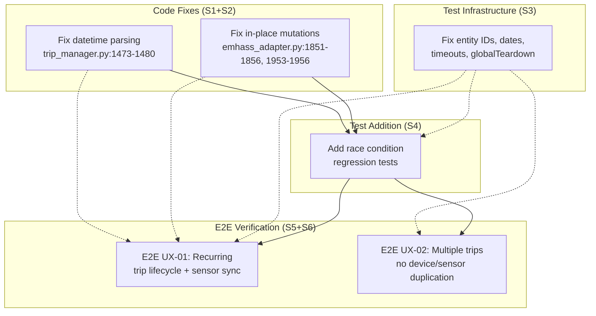

# Design: E2E UX Tests Fix (UX-01 + UX-02)

## Overview

Fix three root causes — a datetime naive/aware bug in trip_manager.py, in-place coordinator.data mutations in emhass_adapter.py, and missing test infrastructure — then add regression tests and verify UX-01/UX-02 E2E flows pass via `make e2e` as a full suite.

## Architecture



## Component Responsibilities

| File | Story | Change | Lines Affected |
|------|-------|--------|----------------|
| `trip_manager.py` | S1 | Replace fallback `datetime.strptime` with `dt_util.parse_datetime`; extract `_parse_trip_datetime` | 1470-1499, ~20 new lines for private method |
| `emhass_adapter.py` | S2 | Replace 4 in-place `coordinator.data["key"] = value` with full dict replacements at 2 locations | 1847-1861, 1950-1960 |
| `configuration.yaml` | S3 | Add `logger:` section with debug for `custom_components.ev_trip_planner` | ~5 new lines |
| `playwright.config.ts` | S3 | Remove `globalTeardown` line | line 18 |
| `scripts/run-e2e.sh` | S3 | Add timestamped log file, failure dump with grep patterns | ~15 new lines |
| `emhass-sensor-updates.spec.ts` | S3 | Replace hardcoded entity IDs, dates, `waitForTimeout` calls; add regression tests | throughout file |
| `emhass-sensor-updates.spec.ts` | S4 | Embed 2 race condition regression tests | between UX-01/UX-02 tests |

## Task Breakdown

### Story S1: Fix Datetime Naive/Aware Bug

#### S1.1 — Write RED test for datetime bug

- **Title**: Write failing test that forces strptime fallback path
- **Input**: `tests/test_trip_manager_datetime_tz.py` (lines 1-52), `trip_manager.py` lines 1467-1500
- **Action**: Modify existing test so it exercises the REAL code path (line 1478 strptime fallback), not a mocked path. The existing test at line 45 already monkeypatches `dt_util.now` to return aware datetime, which triggers the bug at line 1484. Keep the test but ensure it does NOT mock `dt_util.parse_datetime` (so the fallback strptime is used).
- **Output**: Test that FAILS (RED) — `async_calcular_energia_necesaria` raises `TypeError` or returns `horas_disponibles: 0`
- **Verification**: `PYTHONPATH=. .venv/bin/python -m pytest tests/test_trip_manager_datetime_tz.py -v` — exit 1
- **Complexity**: Low

#### S1.2 — Apply GREEN fix: replace strptime with dt_util.parse_datetime

- **Title**: Replace strptime fallback with dt_util.parse_datetime
- **Input**: `trip_manager.py` lines 1474-1480
- **Action**: Replace the try/except block at lines 1474-1480:
  ```python
  # BEFORE:
  try:
      trip_time = dt_util.parse_datetime(trip_datetime)
  except Exception:
      trip_time = datetime.strptime(trip_datetime, "%Y-%m-%dT%H:%M")
      if trip_time.tzinfo is None:
          trip_time = trip_time.replace(tzinfo=timezone.utc)

  # AFTER:
  try:
      trip_time = dt_util.parse_datetime(trip_datetime)
      if getattr(trip_time, "tzinfo", None) is None:
          trip_time = trip_time.replace(tzinfo=timezone.utc)
  except Exception:
      _LOGGER.warning(
          "Failed to parse trip datetime: %s",
          repr(trip_datetime),
      )
      trip_time = datetime.now(timezone.utc)
  ```
- **Output**: Code that uses `dt_util.parse_datetime()` as the sole parsing path, with `timezone.utc` fallback only
- **Verification**: `PYTHONPATH=. .venv/bin/python -m pytest tests/test_trip_manager_datetime_tz.py -v` — exit 0 (GREEN)
- **Complexity**: Low

#### S1.3 — SOLID-ize: Extract `_parse_trip_datetime`

- **Title**: Extract datetime parsing into private method
- **Input**: `trip_manager.py` — the touched lines from S1.2
- **Action**: Create private method in `TripManager`:
  ```python
  def _parse_trip_datetime(self, trip_datetime: object) -> datetime:
      """Parse trip datetime string into an aware datetime.

      Args:
          trip_datetime: A datetime object or ISO-format string.

      Returns:
          A timezone-aware datetime object (UTC if source was naive).
      """
      if isinstance(trip_datetime, datetime):
          dt = trip_datetime
      else:
          try:
              dt = dt_util.parse_datetime(str(trip_datetime))
          except Exception:
              _LOGGER.warning(
                  "Failed to parse trip datetime: %s",
                  repr(trip_datetime),
              )
              dt = datetime.now(timezone.utc)

      if getattr(dt, "tzinfo", None) is None:
          dt = dt.replace(tzinfo=timezone.utc)
      return dt
  ```
  Replace the inline try/except at lines 1474-1483 with `trip_time = self._parse_trip_datetime(trip_datetime)`.
- **Output**: `async_calcular_energia_necesaria` calls `self._parse_trip_datetime(trip_datetime)` instead of inline parsing
- **Verification**: `PYTHONPATH=. .venv/bin/python -m pytest tests/test_trip_manager_datetime_tz.py -v` still GREEN
- **Complexity**: Medium

#### S1.4 — Verify no other naive/aware mixing

- **Title**: Grep for remaining datetime.strptime calls that mix naive/aware
- **Input**: Output of `grep -rn "datetime.strptime" custom_components/ev_trip_planner/`
- **Action**: Review each strptime call:
  - `utils.py:182` — returns a `datetime` from time string; used in comparisons within same file, no aware datetime involved
  - `trip_manager.py:1318` — creates `time()` used only in `datetime.combine(hoy, ...)` for local date comparison; safe
  - `calculations.py:138,146,148` — returns naive datetime from `calculate_trip_datetime`; used only within calculations module for local comparisons; safe
- **Output**: Confirmed: no other naive/aware mixing exists
- **Verification**: `grep -rn "datetime.strptime" custom_components/ev_trip_planner/` — list each call with reasoning comment
- **Complexity**: Low

#### S1.5 — Run checkpoint: test + lint

- **Title**: Run S1 checkpoint — make test + make lint
- **Input**: All changes from S1.1-S1.4
- **Action**:
  1. `make test` — all existing unit tests must pass
  2. `make lint` — no violations
- **Output**: Exit 0 for both
- **Verification**: `make test && make lint` — exit 0
- **Complexity**: Low

### Story S2: Fix Coordinator Dual-Writer Race Condition

#### S2.1 — Replace in-place mutation at async_publish_all_deferrable_loads (lines 1851-1856)

- **Title**: Replace in-place coordinator.data mutations with full dict replacement
- **Input**: `emhass_adapter.py` lines 1841-1875
- **Action**: Replace the block at lines 1847-1861:
  ```python
  # BEFORE (lines 1847-1861):
  if coordinator.data is not None:
      coordinator.data["per_trip_emhass_params"] = {}
      coordinator.data["emhass_power_profile"] = []
      coordinator.data["emhass_deferrables_schedule"] = []
      coordinator.data["emhass_status"] = EMHASS_STATE_READY
  else:
      coordinator.data = {
          "per_trip_emhass_params": {},
          ...
      }

  # AFTER:
  if coordinator.data is not None:
      coordinator.data = {
          **coordinator.data,
          "per_trip_emhass_params": {},
          "emhass_power_profile": [],
          "emhass_deferrables_schedule": [],
          "emhass_status": EMHASS_STATE_READY,
      }
  ```
  Same pattern for lines 1950-1956 (in `async_cleanup_vehicle_indices`): replace 4 in-place mutations with a single full dict replacement.
- **Output**: Zero `coordinator.data["key"] =` patterns remain in emhass_adapter.py
- **Verification**: `grep -n 'coordinator\.data\["' custom_components/ev_trip_planner/emhass_adapter.py` — returns 0 matches
- **Complexity**: Low

#### S2.2 — Verify publish_deferrable_loads() sequence is correct

- **Title**: Verify publish_deferrable_loads cache-before-refresh sequence
- **Input**: `emhass_adapter.py` lines 719-748
- **Action**: Confirm the existing pattern at lines 722-745: cache is populated (lines 723-728), then coordinator.data is set to full dict (lines 737-743), then `async_refresh()` is called (line 745). This is the correct sequence — no changes needed.
- **Output**: Verified: cache populated BEFORE coordinator.async_refresh()
- **Verification**: Code inspection — no changes needed
- **Complexity**: Low

#### S2.3 — Run checkpoint: test + lint + grep

- **Title**: Run S2 checkpoint — make test + make lint + grep
- **Input**: All changes from S2.1
- **Action**:
  1. `make test`
  2. `make lint`
  3. `grep -n 'coordinator\.data\["' custom_components/ev_trip_planner/emhass_adapter.py` — must return 0
- **Output**: Exit 0 for test and lint; grep returns nothing
- **Verification**: All three commands pass
- **Complexity**: Low

### Story S3: Fix Test Infrastructure

#### S3.1 — Add logger configuration

- **Title**: Add logger debug config to configuration.yaml
- **Input**: `tests/ha-manual/configuration.yaml` (lines 1-47)
- **Action**: Append after line 46:
  ```yaml

  logger:
    default: warning
    logs:
      custom_components.ev_trip_planner: debug
      homeassistant.components.sensor: debug
  ```
- **Output**: configuration.yaml includes logger section
- **Verification**: `grep -A3 "logger:" tests/ha-manual/configuration.yaml` returns expected output
- **Complexity**: Low

#### S3.2 — Fix hardcoded entity IDs

- **Title**: Replace hardcoded entity IDs with discoverEmhassSensorEntityId
- **Input**: `tests/e2e/emhass-sensor-updates.spec.ts` — lines 308, 427 (hardcoded `'sensor.ev_trip_planner_test_vehicle_emhass_perfil_diferible_test_vehicle'`)
- **Action**: Replace each hardcoded entity ID with `await discoverEmhassSensorEntityId(page)`. Ensure the helper at lines 33-47 is at file scope and correctly searches for `emhass_perfil_diferible` entities.
- **Output**: Zero occurrences of `ev_trip_planner_test_vehicle_emhass` in test file
- **Verification**: `grep -n "ev_trip_planner_test_vehicle_emhass" tests/e2e/emhass-sensor-updates.spec.ts` — 0 matches
- **Complexity**: Low

#### S3.3 — Fix hardcoded dates

- **Title**: Replace hardcoded dates with getFutureIso helper
- **Input**: `tests/e2e/emhass-sensor-updates.spec.ts` — lines 75, 138, 489
- **Action**:
  - Line 75: `'2026-04-20T10:00'` -> `getFutureIso(1, '10:00')`
  - Line 138: `'2026-04-20T10:00'` -> `getFutureIso(1, '10:00')`
  - Line 489: `'2026-04-20T10:00'` -> `getFutureIso(1, '10:00')`
- **Output**: Zero hardcoded dates in test file
- **Verification**: `grep -n "2026-04-20" tests/e2e/emhass-sensor-updates.spec.ts` — 0 matches
- **Complexity**: Low

#### S3.4 — Replace waitForTimeout with toPass

- **Title**: Replace waitForTimeout with toPass() polling checks
- **Input**: `tests/e2e/emhass-sensor-updates.spec.ts` — all 25 waitForTimeout calls
- **Action**: Replace sensor attribute checks (after trip creation) that use `waitForTimeout(3000)` with `toPass()` checking `emhass_status === 'ready'` or sensor attribute values. The 5 `waitForTimeout(5000)` calls are acceptable:
  - Line 618 (UX-02 multi-trip): KEEP — explicitly allowed per requirements
  - Other multi-trip delays: KEEP
  - All sensor checks after single-trip creation: REPLACE with `toPass()`
  - `waitForTimeout(1000)` for UI navigation delays: REPLACE with `page.waitForLoadState('networkidle')` or `page.waitForTimeout(500)`
- **Output**: Only acceptable `waitForTimeout` calls remain (multi-trip propagation delays)
- **Verification**: `grep -n "waitForTimeout" tests/e2e/emhass-sensor-updates.spec.ts` — review each match
- **Complexity**: Medium

#### S3.5 — Enhance run-e2e.sh for log capture

- **Title**: Enhance run-e2e.sh with timestamped logs and failure dump
- **Input**: `scripts/run-e2e.sh` — lines 131-165
- **Action**: The script already has timestamped logs (line 24: `TS=$(date +%Y%m%d_%H%M%S)` and line 23-24) and failure dump (lines 151-159). Verify these work correctly. Minor improvement: ensure the HA log file path is consistent between startup (line 98) and failure dump (line 155).
- **Output**: Consistent timestamped log paths throughout script
- **Verification**: Run `make e2e` and check that logs are saved with timestamps
- **Complexity**: Low

#### S3.6 — Remove globalTeardown reference

- **Title**: Remove globalTeardown from playwright.config.ts
- **Input**: `playwright.config.ts` line 18
- **Action**: Remove line `globalTeardown: './globalTeardown.ts',`
- **Output**: No reference to non-existent globalTeardown.ts
- **Verification**: `npx playwright test --list` — no warnings about missing globalTeardown
- **Complexity**: Low

#### S3.7 — Run checkpoint: playwright --list

- **Title**: Run S3 checkpoint — playwright --list
- **Input**: All S3 changes
- **Action**: `npx playwright test --list`
- **Output**: All tests discovered, no errors
- **Verification**: Exit 0, all test files listed
- **Complexity**: Low

### Story S4: Add Race Condition Regression Tests

#### S4.1 — Add immediate sensor check regression test

- **Title**: Add race-condition-regression-immediate-sensor-check test
- **Input**: `tests/e2e/emhass-sensor-updates.spec.ts` — existing helpers (`discoverEmhassSensorEntityId`, `getFutureIso`, `getSensorAttributes`, `createTestTrip`, `cleanupTestTrips`, `navigateToPanel`)
- **Action**: Add test between existing tests and UX-01:
  ```typescript
  test('race-condition-regression-immediate-sensor-check', async ({ page }) => {
    await cleanupTestTrips(page);
    await navigateToPanel(page);

    const tripDatetime = getFutureIso(1, '10:00');
    await createTestTrip(page, 'puntual', tripDatetime, 50, 10, 'Race Condition Test Trip');

    // IMMEDIATELY check — no waitForTimeout
    const sensorEntityId = await discoverEmhassSensorEntityId(page);
    expect(sensorEntityId).toBeTruthy();

    await expect(async () => {
      const attrs = await getSensorAttributes(page, sensorEntityId!);
      expect(Array.isArray(attrs.def_total_hours_array) && attrs.def_total_hours_array.length > 0).toBe(true);
      expect(attrs.def_total_hours_array.some((v: number) => v > 0)).toBe(true);
    }).toPass({ timeout: 15000 });

    await expect(async () => {
      const attrs = await getSensorAttributes(page, sensorEntityId!);
      expect(Array.isArray(attrs.p_deferrable_matrix)).toBe(true);
      expect(attrs.p_deferrable_matrix.some((profile: number[]) => profile.some((v: number) => v > 0))).toBe(true);
    }).toPass({ timeout: 15000 });

    await expect(async () => {
      const attrs = await getSensorAttributes(page, sensorEntityId!);
      expect(attrs.emhass_status).toBe('ready');
    }).toPass({ timeout: 15000 });
  });
  ```
- **Output**: New regression test in test file
- **Verification**: `npx playwright test --list` includes new test
- **Complexity**: Low

#### S4.2 — Add rapid successive creation regression test

- **Title**: Add race-condition-regression-rapid-successive-creation test
- **Input**: Same test file
- **Action**: Add test after the previous regression test:
  ```typescript
  test('race-condition-regression-rapid-successive-creation', async ({ page }) => {
    await cleanupTestTrips(page);
    await navigateToPanel(page);

    const trip1Datetime = getFutureIso(1, '09:00');
    const trip2Datetime = getFutureIso(1, '14:00');

    await createTestTrip(page, 'puntual', trip1Datetime, 30, 5, 'Race Trip 1');

    // IMMEDIATELY verify first trip
    const sensorEntityId = await discoverEmhassSensorEntityId(page);
    await expect(async () => {
      const attrs = await getSensorAttributes(page, sensorEntityId!);
      expect(Array.isArray(attrs.def_total_hours_array) && attrs.def_total_hours_array.length > 0).toBe(true);
      expect(attrs.def_total_hours_array.some((v: number) => v > 0)).toBe(true);
    }).toPass({ timeout: 15000 });

    // IMMEDIATELY create second trip (no delay)
    await createTestTrip(page, 'puntual', trip2Datetime, 80, 15, 'Race Trip 2');

    // IMMEDIATELY verify both trips
    await expect(async () => {
      const attrs = await getSensorAttributes(page, sensorEntityId!);
      expect(attrs.def_total_hours_array?.some((v: number) => v > 0) || false).toBe(true);
      expect(attrs.emhass_status).toBe('ready');
    }).toPass({ timeout: 15000 });
  });
  ```
- **Output**: Second regression test in test file
- **Verification**: `npx playwright test --list` includes both regression tests
- **Complexity**: Low

#### S4.3 — Run checkpoint: make e2e (FULL SUITE)

- **Title**: Run S4 checkpoint — make e2e full suite
- **Input**: All S3+S4 changes
- **Action**: `make e2e` — ALL E2E tests must pass, not just S4 tests
- **Output**: Exit 0, all tests pass
- **Verification**: `make e2e` — exit 0, NO isolated grep
- **Complexity**: Medium (depends on S1/S2 fixes being correct)

### Story S5+S6: E2E UX-01 + UX-02

#### S5.1 — Run make e2e with self-healing loop

- **Title**: Execute make e2e with self-healing loop for UX-01/UX-02
- **Input**: All S1-S4 fixes complete, test infrastructure ready
- **Action**:
  1. Pre-flight: Verify SOC=20%, no hardcoded dates, no hardcoded entity IDs, logger config exists
  2. Run `make e2e`
  3. If pass: verify HA logs have no errors, mark S5+S6 COMPLETE
  4. If fail: diagnose using log patterns from requirements.md Section 10, apply ONE fix, retry (max 3 iterations)
- **Output**: S5 and S6 marked COMPLETE or BLOCKED with diagnosis
- **Verification**: `make e2e` exit 0, HA logs clean, all AC1-AC6 met for both S5 and S6
- **Complexity**: Medium (self-healing loop, may require iteration)

## Execution Order & Dependencies

```
Time    S1 (Datetime)    S2 (Coordinator)    S3 (Test Infra)    S4 (Regression)    S5+S6 (E2E)
      ┌──────────┐    ┌──────────┐    ┌──────────┐
0     │  S1.1-S1.5   │    │  S2.1-S2.3   │    │  S3.1-S3.7   │
      └──────────┘    └──────────┘    └──────────┘
                                         ┌──────────┐
2     ┌───────────────────────────────────►  S4.1-S4.3   │
      │                                     └──────────┘
      │                                           ┌──────────┐
3     │                                           │  S5.1 (S5+S6)│
      │                                           └──────────┘
```

**Phase 1 (Day 0, parallel)**: S1, S2, S3 execute in parallel. Each has independent code changes and its own checkpoint.

**Phase 2 (Day 1, after Phase 1)**: S4 runs after S1+S2+S3 checkpoints pass. S4.3 runs `make e2e` full suite (not isolated).

**Phase 3 (Day 2, after Phase 2)**: S5+S6 run together with self-healing loop. Same `make e2e` invocation.

## Technical Decisions & Rationale

| Decision | Options | Choice | Rationale |
|----------|---------|--------|-----------|
| **Datetime parsing** | 1. Keep strptime + force tzinfo 2. Use dt_util.parse_datetime everywhere 3. Remove the except block entirely | Option 2 | dt_util.parse_datetime is HA's canonical parser, handles both string and datetime inputs, always returns aware datetime |
| **SOLID-ization scope** | 1. Extract _parse_trip_datetime method 2. No extraction, inline fix only 3. Refactor TripManager | Option 1 | Local surgical fix per 9.1.1: one helper method, no broader refactoring |
| **Coordinator fix pattern** | 1. Full dict replacement 2. Use async_set_data 3. Use asyncio lock | Option 1 | Minimal change, matches existing pattern at lines 737-743, no new abstractions |
| **E2E test execution** | 1. Run full suite (make e2e) 2. Isolate tests with --grep 3. Run per-story | Option 1 | Tests share HA container state and sensor state; isolation produces false results |
| **waitForTimeout policy** | 1. Replace all with toPass 2. Keep all as-is 3. Replace sensor checks only, keep UI delays | Option 3 | Sensor checks need polling (toPass). UI navigation delays (1000ms for dialog handling) are acceptable |
| **Regression test location** | 1. New file 2. Embed in existing spec 3. Add to integration test suite | Option 2 | Requirements mandate embedded in emhass-sensor-updates.spec.ts; maintains single-suite execution |
| **Self-healing iterations** | 1. 3 iterations max 2. 5 iterations max 3. No limit | Option 1 | Requirements Section 9.1 explicit: max 3 iterations before marking BLOCKED |

## SOLID Quality Gate Procedure

The SOLID Quality Gate integrates into each code-related story's task flow as follows:

### Trigger Points

| Story | Trigger | When |
|-------|---------|------|
| S1 | After S1.2 (fix applied), before S1.3 (SOLID-ization) | After RED->GREEN, before extraction |
| S2 | After S2.1 (fix applied), before S2.3 (checkpoint) | After in-place mutations replaced |

### Procedure

1. **Capture diff**: `cd /repo && git diff <affected-file>`
2. **Launch reviewer**: Spawn subagent with the diff and these criteria:
   - MUST: No touched function exceeds 200 lines after fix
   - MUST: Each touched method has ONE clear purpose
   - MUST: All touched function signatures have complete type hints
   - MUST: No bare `except:` or `except Exception:` in touched code
   - MUST: No direct in-place state mutation (`self.coordinator.data[...] =`) in touched code
   - INFO: No hardcoded strings (magic values)
   - INFO: Docstrings present for touched public methods
3. **Handle failures**: If reviewer flags a MUST criterion — fix it and re-request review (max 2 retries)
4. **Pass criteria**: All MUST criteria pass → proceed to checkpoint

### Failure Handling

- Fix the specific line(s) flagged by reviewer
- Re-run diff capture and review
- If 2 retries exhausted (3 total attempts) → launch `ralph-specum:architect-reviewer` fallback agent (Section 9.1.3)
  - Architect reads all 3 diff attempts + reviewer feedback
  - Architect diagnoses WHY SOLID-ization fails and gives SPECIFIC fix instructions
  - Implementing agent applies architect's instructions → re-request review
  - If final attempt also fails → abandon SOLID-ization, keep minimal fix, document limitation
- The reviewer provides line-level feedback, not general "make it SOLID" comments

### Design Decision: Bounded Investigation

The SOLID Quality Gate is **aspirational, not blocking**. The worst outcome is the code stays at its current SOLID level (God Objects are ~3/10). We do NOT block the entire sprint on this. The fallback architect agent ensures:
- Root cause is diagnosed, not symptoms
- Specific instructions are produced (not "make it SOLID")
- The process terminates within 4 attempts (1 initial + 2 retry + 1 architect)

## Self-Healing Loop Integration

### Loop Structure (S4.3 + S5.1)

```
Iteration 0 — PRE-FLIGHT:
  1. SOC=20%: grep 'initial: 20' tests/ha-manual/configuration.yaml
  2. No hardcoded dates: grep '2026-04-20' tests/e2e/ → 0 matches
  3. No hardcoded entity IDs: grep 'ev_trip_planner_test_vehicle_emhass' tests/e2e/ → 0 matches
  4. Logger config: grep 'logger:' tests/ha-manual/configuration.yaml → found
  5. globalTeardown: grep 'globalTeardown' playwright.config.ts → 0 matches
  If ANY check fails → fix immediately before running tests

Iteration 1+:
  1. make e2e
  2. If ALL tests pass:
     - Check /tmp/ha-e2e-*.log for errors: grep -i "error\|exception\|traceback" /tmp/ha-e2e-*.log
     - Check EMHASS: grep -i "emhass\|deferrable\|power_profile" /tmp/ha-e2e-*.log
     - Mark COMPLETE
  3. If tests FAIL:
     a. tail -200 /tmp/ha-e2e-*.log (most recent)
     b. Classify failure:
        - UI element not found → Fix Playwright locator (getByRole > getByLabel > getByText)
        - Sensor attribute wrong → Check coordinator async_set_data flow
        - Timeout → Increase toPass() timeout or check HA startup
        - HA startup error → Check configuration.yaml validity
        - TypeError/naive/aware → Re-check S1 datetime fix
     c. Apply ONE fix
     d. Re-run make e2e
     e. Max 3 iterations
     f. If still failing → mark BLOCKED with diagnosis evidence
```

### Failure Pattern Map

| Symptom | Most Likely Cause | Diagnostic Command |
|---------|-------------------|-------------------|
| `TypeError: can't subtract offset-naive and offset-aware` | S1 fix not applied or import missing | `grep "dt_util.parse_datetime" custom_components/ev_trip_planner/trip_manager.py` |
| Sensor shows all zeros | S2 race condition still present | `grep -i "coordinator" /tmp/ha-e2e-*.log | tail -20` |
| `Entity not found` | Entity ID format changed | Check discoverEmhassSensorEntityId() output |
| `Element not visible` | UI selector changed | Check test-results/*/error-context.md |
| HA startup timeout | configuration.yaml invalid | `tail -50 /tmp/ha-e2e-*.log` |
| Sensor state stale | async_refresh not completing | `grep -i "async_refresh\|async_set_data" /tmp/ha-e2e-*.log` |

## Risk Mitigation

| Risk | Story | Severity | Detection | Mitigation |
|------|-------|----------|-----------|------------|
| datetime fix changes behavior of existing unit tests | S1 | HIGH | `make test` | Run before and after; compare output |
| In-place mutation replacement breaks sensor updates | S2 | HIGH | `make test` | Verify with `make e2e` after change |
| waitForTimeout removal causes flaky tests | S3 | MEDIUM | First `make e2e` run | Revert to waitForTimeout for specific cases if needed |
| globalTeardown removal breaks test discovery | S3 | MEDIUM | `npx playwright test --list` | Verify all tests discoverable |
| Regression tests pass but UX-01/UX-02 fail | S4-S5 | HIGH | `make e2e` full suite | Check HA logs for EMHASS errors |
| SOC=20% not applied in test env | S5+S6 | MEDIUM | Pre-flight check | Verify configuration.yaml before each run |
| Context overflow from reading large files | All | HIGH | Session token count | Read specific lines, not entire files |
| SOLID Quality Gate fails 3+ times | S1, S2 | MEDIUM | Reviewer feedback accumulation | Architect fallback agent diagnoses root cause, provides fix instructions |
| God Object constraint prevents SOLID-ization | S1, S2 | INFO | Architect diagnosis | Accept current SOLID level, document as known limitation, proceed |

## Test Strategy

### Test Double Policy

| Boundary | Unit test | Integration test | Rationale |
|----------|-----------|-----------------|-----------|
| TripManager._parse_trip_datetime | Real | Real | Own business logic, no I/O |
| TripManager.async_calcular_energia_necesaria (datetime path) | Real | Real | Tests the actual parsing code path, not a mock |
| EMHASSAdapter coordinator data replacement | Real | Real | Own logic, full dict replacement is testable |
| coordinator._async_update_data | Stub HA deps | Real coordinator | Own logic reads from TripManager |
| E2E sensor checks | N/A | N/A | Real HA, real sensor — no doubles of any kind |

### Mock Boundary

| Component (from this design) | Unit test | Integration test | Rationale |
|---|---|---|---|
| TripManager._parse_trip_datetime | Real | Real | Own method, pure logic |
| TripManager.async_calcular_energia_necesaria | Real (datetime path) | Real | Tests actual parsing code, not mocked |
| EMHASSAdapter._cleanup_vehicle_indices | Real | Real | Own logic, full dict replacement is verifiable |
| TripPlannerCoordinator._async_update_data | Stub TripManager | Real coordinator | Own logic reads from TripManager, stub external dep |
| Sensor entity attributes | N/A | N/A | Real HA, real sensor — no doubles |

### Fixtures & Test Data

| Component | Required state | Form |
|---|---|---|
| TripManager._parse_trip_datetime | String datetime `"2026-04-23T10:00"`, datetime object, naive datetime, aware datetime | Inline test constants |
| TripManager.async_calcular_energia_necesaria | Trip dict with `datetime` as string, vehicle_config with battery_capacity_kwh, charging_power_kw, soc_current | Inline factory in test file |
| EMHASSAdapter coordinator mutation | coordinator.data as dict with EMHASS keys, coordinator as mock with async_refresh | Inline in test |
| E2E tests | Empty trip list, SOC=20%, test vehicle configured | cleanupTestTrips() in beforeEach |

### Test Coverage Table

| Component / Function | Test type | What to assert | Test double |
|---|---|---|---|
| TripManager._parse_trip_datetime | unit | Returns aware datetime for string input `"2026-04-23T10:00"` | none |
| TripManager._parse_trip_datetime | unit | Returns datetime unchanged for datetime input (no double-wrapping) | none |
| TripManager.async_calcular_energia_necesaria | unit | horas_disponibles > 0 when trip datetime is in future (string input) | stub dt_util.now |
| EMHASSAdapter coordinator data replacement | unit | coordinator.data has correct keys after cleanup call | real method |
| TripPlannerCoordinator._async_update_data | unit | Returns dict with all expected keys | stub TripManager |
| E2E: race-condition-regression-immediate-sensor-check | e2e | Sensor shows non-zero power_profile_watts immediately after trip creation | none (real env) |
| E2E: race-condition-regression-rapid-successive-creation | e2e | Second trip adds to (not overwrites) sensor data | none (real env) |
| E2E: UX-01 recurring trip lifecycle | e2e | Create→sensor sync→delete→sensor zeros, all 6 validations pass | none (real env) |
| E2E: UX-02 multiple trips | e2e | 3 trips, 1 device, 1 sensor, partial deletion doesn't affect others | none (real env) |

### Test File Conventions

- **Test runner**: Playwright (`npx playwright test`)
- **Test file location**: `tests/e2e/*.spec.ts`
- **Integration test pattern**: Same spec file (`emhass-sensor-updates.spec.ts`), no separate config needed
- **E2E test pattern**: `*.spec.ts` in `tests/e2e/`, all run as full suite via `make e2e`
- **Mock cleanup**: `beforeEach` calls `cleanupTestTrips(page)` in each test
- **Fixture/factory location**: Inline constants in test files (no separate factory files needed for this scope)
- **Python unit test runner**: pytest (`PYTHONPATH=. .venv/bin/python -m pytest tests -v`)
- **Python test file location**: `tests/test_*.py`
- **Python mock cleanup**: `conftest.py` fixtures with `yield` pattern for teardown

## Performance Considerations

- `dt_util.parse_datetime()` is a HA utility, no performance concern
- Full dict replacement vs in-place mutation: negligible difference for ~6 keys
- E2E test execution time dominated by HA startup (~2 minutes), not test code changes

## Security Considerations

- No new security impact from these fixes
- Logger debug config adds `custom_components.ev_trip_planner: debug` — acceptable for test env only
- No credentials, API keys, or secrets in changes

## Existing Patterns to Follow

- **Test fixtures in conftest.py**: Use `MagicMock` pattern for HA instances, not real HA
- **Monkeypatch for datetime tests**: Use `monkeypatch.setattr` for `dt_util.now` (existing pattern in test_trip_manager_datetime_tz.py)
- **E2E helper structure**: File-level async helpers at top of spec file (getSensorAttributes, discoverEmhassSensorEntityId, getFutureIso)
- **Playwright selectors**: `getByRole` > `getByLabel` > `getByText` > CSS; XPath prohibited
- **Shell script pattern**: run-e2e.sh uses clean-start pattern (kill existing HA, recreate config, start fresh)
- **Logging**: `%s` style, no f-strings (project convention)

## Unresolved Questions

- **calculations.py strptime calls**: Lines 146-148 in calculations.py use `datetime.strptime` for naive datetime returns. These are used only within calculations module for local comparisons. Out of scope for this fix — only trip_manager.py line 1473 is targeted.

## Implementation Steps

1. **S1**: Fix datetime parsing in trip_manager.py (extract `_parse_trip_datetime` method)
2. **S2**: Replace in-place coordinator.data mutations in emhass_adapter.py (full dict replacement)
3. **S3**: Fix test infrastructure (entity IDs, dates, timeouts, logger config, globalTeardown)
4. **S4**: Add race condition regression tests in emhass-sensor-updates.spec.ts
5. **S5+S6**: Execute `make e2e` with self-healing loop for UX-01 + UX-02 verification
