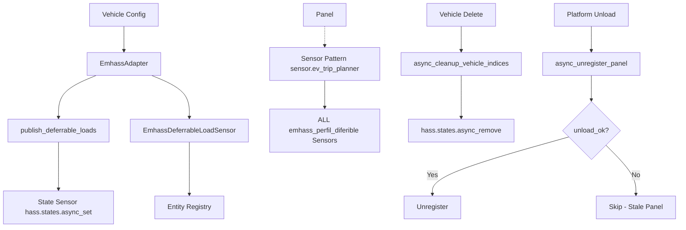
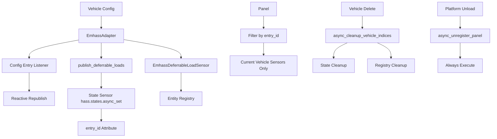

# Technical Design: EMHASS Sensor Entity Lifecycle Fix

## Overview

This design fixes EMHASS sensor entity lifecycle issues by:
1. Adding entity registry cleanup to `async_cleanup_vehicle_indices()`
2. Adding `entry_id` attribute to state-only sensors for orphan detection
3. Tightening panel sensor patterns to filter by exact `entry_id`
4. Subscribing to config entry updates to trigger reactive sensor republish
5. Removing `if unload_ok:` guard for panel cleanup

**Approach**: Minimal invasive changes to existing code paths, preserving backward compatibility while fixing lifecycle bugs.

---

## Architecture

### Current State



### Target State



---

## Component Responsibilities

### EmhassAdapter (`emhass_adapter.py`)

| Component | Responsibility | Changes |
|-----------|----------------|---------|
| `__init__` | Store `entry_id` for reactive updates | Line 51: Add `self.entry_id = entry_id` |
| `publish_deferrable_loads()` | Set `entry_id` attribute on state sensors | Lines 514-523: Add `entry_id` attribute |
| `async_cleanup_vehicle_indices()` | Remove both state and registry entities | Lines 1111-1161: Add entity registry cleanup |
| `update_charging_power()` | Trigger republish on config change | New method, lines 1162-1175 |

### Sensor (`sensor.py`)

| Component | Responsibility | Changes |
|-----------|----------------|---------|
| `EmhassDeferrableLoadSensor.async_update()` | Call `async_schedule_update_ha_state()` | Line 612: Ensure call is present |

### Config Flow (`config_flow.py`)

| Component | Responsibility | Changes |
|-----------|----------------|---------|
| `async_step_user` / `async_step_reauth` | Trigger power update on save | After `async_update_entry`: Call `adapter.update_charging_power()` |

### Panel (`panel.js`)

| Component | Responsibility | Changes |
|-----------|----------------|---------|
| `_getVehicleStates()` | Filter by exact `entry_id` | Lines 1008-1064: Replace pattern with exact match |

### Integration (`__init__.py`)

| Component | Responsibility | Changes |
|-----------|----------------|---------|
| `async_unload_entry` | Always call panel cleanup | Line 842: Remove `if unload_ok:` guard |

---

## Technical Decisions

### Decision 1: Entity Registry Cleanup

**Choice**: Add `entity_registry.async_remove()` calls to `async_cleanup_vehicle_indices()`

**Rationale**:
- State-only cleanup leaves orphaned registry entries
- Entity registry cleanup must happen in parallel with state cleanup
- Use try/except to handle already-removed entries gracefully

**Implementation**:
```python
# emhass_adapter.py:1111-1161
async def async_cleanup_vehicle_indices(self):
    # Existing state cleanup
    for entry_id in self._vehicle_indices.get(self._vehicle_id, []):
        hass.states.async_remove(f"sensor.emhass_perfil_diferible_{entry_id}")
    
    # NEW: Entity registry cleanup
    registry = entity_registry.async_get(self.hass)
    for entry_id in self._vehicle_indices.get(self._vehicle_id, []):
        entity_id = f"sensor.emhass_perfil_diferible_{entry_id}"
        try:
            registry.async_remove(entity_id)
        except Exception:
            pass  # Already removed
```

---

### Decision 2: State Sensor `entry_id` Attribute

**Choice**: Add `entry_id` attribute to state-only sensors

**Rationale**:
- Enables orphan detection without parsing sensor IDs
- Consistent with registry entity metadata
- Allows `__init__.py` orphan detection to work

**Implementation**:
```python
# emhass_adapter.py:509-548
async def publish_deferrable_loads(self):
    # ... existing code ...
    hass.states.async_set(
        sensor_id,
        new_state,
        attributes={
            "deferrables_schedule": schedule,
            "power_profile_watts": power_profile_watts,
            "entry_id": self.entry_id,  # NEW
        },
    )
```

---

### Decision 3: Reactive Config Updates

**Choice**: Subscribe to config entry updates and trigger republish

**Rationale**:
- `publish_deferrable_loads()` not called when entry.data changes
- Need to re-calculate `power_profile_watts` with new charging power
- Minimal overhead: only republish when charging power changes

**Implementation**:
```python
# emhass_adapter.py:1162-1175
def setup_config_entry_listener(self):
    """Subscribe to config entry updates."""
    async def on_entry_update(event):
        if event.data.get("action") == "updated":
            entry = self.hass.config_entries.async_get_entry(self.entry_id)
            if entry:
                new_power = entry.data.get("charging_power_kw")
                if new_power != self._charging_power_kw:
                    self._charging_power_kw = new_power
                    await self.publish_deferrable_loads()
    
    self.hass.bus.async_listen("config_entries", on_entry_update)
```

---

### Decision 4: Panel Sensor Filtering

**Choice**: Replace `sensor.ev_trip_planner` pattern with exact `entry_id` match

**Rationale**:
- Current pattern is too broad, matches ALL emhass sensors
- Need to filter by current vehicle's `entry_id`
- Attribute-based filtering is more reliable than pattern matching

**Implementation**:
```javascript
// panel.js:1008-1064
_getVehicleStates() {
    const currentEntryId = this.vehicleId; // Already available
    
    return Object.entries(this.states).filter(([entityId, state]) => {
        // Check entry_id attribute match
        return state.attributes?.entry_id === currentEntryId;
    });
}
```

---

### Decision 5: Panel Cleanup Guard Removal

**Choice**: Remove `if unload_ok:` guard for panel cleanup

**Rationale**:
- Panel cleanup should always happen, regardless of platform unload status
- Silent failures leave stale sidebar links
- Guard was overly conservative

**Implementation**:
```python
# __init__.py:802-853
async def async_unload_entry(entry_id):
    # ... existing cleanup ...
    
    # NEW: Always call panel cleanup
    try:
        await async_unregister_panel(hass, vehicle_id)
        _LOGGER.info("Unregistered panel for vehicle %s", vehicle_id)
    except Exception as ex:
        _LOGGER.error("Failed to unregister panel for vehicle %s: %s", vehicle_id, ex)
```

---

## Error Handling Strategy

| Scenario | Error Handling |
|----------|----------------|
| Entity already removed | Silent continue (try/except in cleanup) |
| Panel unregistration fails | Log error, continue with other cleanup |
| Config entry not found | Log warning, skip republish |
| Sensor attribute missing | Log warning, include in orphan detection |

**Logging Levels**:
- `INFO`: Successful panel unregistration
- `WARNING`: Missing attributes, skipped operations
- `ERROR`: Failed operations that affect user experience

---

## Test Strategy

### Unit Tests

| Test | Coverage |
|------|----------|
| `test_entity_registry_cleanup` | Verify `entity_registry.async_remove()` called |
| `test_state_sensor_has_entry_id` | Verify `entry_id` attribute set |
| `test_config_update_triggers_republish` | Verify republish on power change |
| `test_async_update_schedules_state_write` | Verify `async_schedule_update_ha_state()` called |

### Integration Tests

| Test | Coverage |
|------|----------|
| `test_full_vehicle_deletion` | Verify state + registry + panel cleanup |
| `test_panel_sensor_filtering` | Verify vehicle-specific sensor display |
| `test_charging_power_update` | Verify attribute reflects new power |

### Test Files to Add

- `tests/test_entity_cleanup.py` - Entity registry cleanup tests
- `tests/test_config_updates.py` - Config entry update tests
- `tests/test_panel_filtering.py` - Panel sensor filtering tests

---

## File Structure

### Files Modified

| File | Lines | Changes |
|------|-------|---------|
| `emhass_adapter.py` | 514-523 | Add `entry_id` attribute |
| `emhass_adapter.py` | 1111-1161 | Add entity registry cleanup |
| `emhass_adapter.py` | 1162-1175 | Add config listener + update method |
| `sensor.py` | 612 | Ensure `async_schedule_update_ha_state()` call |
| `config_flow.py` | After `async_update_entry` | Call `adapter.update_charging_power()` |
| `panel.js` | 1008-1064 | Replace pattern with exact `entry_id` match |
| `__init__.py` | 840-848 | Remove `if unload_ok:` guard |

### Files Created

| File | Purpose |
|------|---------|
| `tests/test_entity_cleanup.py` | Entity registry cleanup tests |
| `tests/test_config_updates.py` | Config entry update tests |
| `tests/test_panel_filtering.py` | Panel sensor filtering tests |

---

## Implementation Order

1. **emhass_adapter.py**: Add `entry_id` attribute to `publish_deferrable_loads()`
2. **emhass_adapter.py**: Add entity registry cleanup to `async_cleanup_vehicle_indices()`
3. **emhass_adapter.py**: Add config entry listener + update method
4. **sensor.py**: Verify `async_schedule_update_ha_state()` call
5. **config_flow.py**: Call update method after config change
6. **panel.js**: Replace pattern with exact `entry_id` match
7. **__init__.py**: Remove `if unload_ok:` guard for panel cleanup
8. **tests/**: Add new test files

---

## Risk Assessment

| Risk | Likelihood | Impact | Mitigation |
|------|------------|--------|------------|
| Breaking existing sensors | Low | Medium | Preserve existing state structure, add attribute only |
| Performance impact | Low | Low | Cleanup is O(n) where n = number of deferrable loads |
| Panel filtering regression | Medium | Medium | Test with multiple vehicles before merge |
| Config listener memory leak | Low | Low | Clean up listener in `async_unload_entry` |

---

## Migration Notes

- No migration required for existing sensors
- Orphaned sensors from previous versions will be cleaned up on next vehicle delete
- Manual cleanup of pre-existing orphaned sensors may still be needed via HA UI
