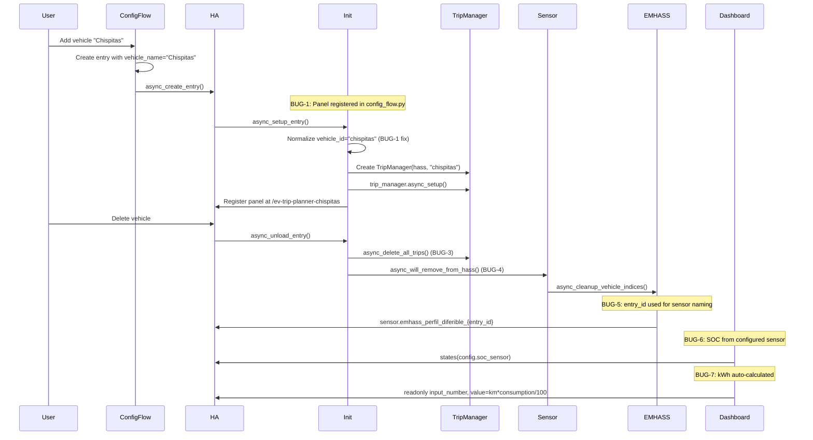

# Design: EV Trip Planner Integration Fixes

## Overview

Fix 7 critical bugs in the EV Trip Planner Home Assistant integration. The fixes address duplicate panel registration from case-sensitive URL handling, missing cascade deletion, orphaned sensors, incorrect EMHASS power values, missing SOC display, and kWh manual input instead of auto-calculation.

## Architecture

```mermaid
graph TB
    subgraph HA["Home Assistant"]
        subgraph ConfigFlow["config_flow.py"]
            CF1[_async_create_entry] --> CF2[async_register_panel]
        end
        subgraph Init["__init__.py"]
            I1[async_setup_entry] --> I2[Normalize vehicle_id at line 471]
            I2 --> I3[async_register_panel at line 652]
            I1 --> I4[TripManager creation]
            I4 --> I5[async_delete_all_trips at line 739]
            InitUnload[async_unload_entry] --> I5
        end
        subgraph TripManager["trip_manager.py"]
            TM1[TripManager.__init__] --> TM2[async_delete_all_trips - MISSING]
        end
        subgraph Sensor["sensor.py"]
            S1[EmhassDeferrableLoadSensor] --> S2[async_will_remove_from_hass - MISSING]
        end
        subgraph EmhassAdapter["emhass_adapter.py"]
            EA1[EMHASSAdapter.__init__] --> EA2[Uses vehicle_id for sensor names]
            EA2 --> EA3[sensor.emhass_perfil_diferible_{vehicle_id}]
        end
        subgraph Dashboard["Dashboard YAML"]
            D1[SOC display] --> D2[Hardcoded sensor.{{ vehicle_id }}_soc]
            D3[kWh input] --> D4[User input instead of auto-calc]
        end
    end
```

## Components

### Component: Panel Registration (BUG-1, BUG-2)

**Purpose**: Register vehicle panels in Home Assistant sidebar with normalized vehicle_id

**Problem**: Panel registered twice - once in config_flow.py (with normalized ID) and once in __init__.py (without normalization). When user adds "Chispitas", URLs `/ev-trip-planner-chispitas` and `/ev-trip-planner-Chispitas` are both created, causing flickering.

**Interfaces**:
```python
# __init__.py line 471 - FIX: normalize vehicle_id
vehicle_id = entry.data.get("vehicle_name").lower().replace(" ", "_")

# __init__.py line 652 - Keep panel registration here (HA lifecycle)
await panel_module.async_register_panel(hass, vehicle_id=vehicle_id, vehicle_name=vehicle_name)

# config_flow.py line 839 - REMOVE duplicate registration
# await panel_module.async_register_panel(...)  # DELETE THIS
```

### Component: TripManager (BUG-3)

**Purpose**: Manage trip CRUD operations and persistence

**Interfaces**:
```python
class TripManager:
    async def async_delete_all_trips(self) -> None:
        """Delete all recurring and punctual trips for this vehicle."""
        # Implementation needed
```

### Component: EmhassDeferrableLoadSensor (BUG-4)

**Purpose**: Sensor entity for EMHASS deferrable load profile

**Interfaces**:
```python
class EmhassDeferrableLoadSensor(SensorEntity):
    async def async_will_remove_from_hass(self) -> None:
        """Clean up sensor resources on entity removal."""
        # Implementation needed - call emhass_adapter.async_cleanup_vehicle_indices()
```

### Component: EMHASSAdapter (BUG-5)

**Purpose**: Publish trips as EMHASS deferrable loads

**Problem**: Uses `self.vehicle_id` (name like "Chispitas") instead of `entry_id` for `async_get_entry()`. The `publish_deferrable_loads` at line 499 creates sensor `sensor.emhass_perfil_diferible_{self.vehicle_id}` which doesn't match the entry lookup.

**Interfaces**:
```python
class EMHASSAdapter:
    def __init__(self, hass: HomeAssistant, entry: ConfigEntry):  # CHANGE: receive entry
        self.entry_id = entry.entry_id  # STORE entry_id
        self.vehicle_id = entry.data.get("vehicle_name")  # For display only

    # Line 499 - Use entry_id for sensor naming
    sensor_id = f"sensor.emhass_perfil_diferible_{self.entry_id}"
```

### Component: Dashboard Templates (BUG-6, BUG-7)

**Purpose**: Lovelace dashboard for trip management

**Problem BUG-6**: Dashboard hardcodes `sensor.{{ vehicle_id }}_soc` instead of using configured `soc_sensor`

**Problem BUG-7**: Dashboard creates user-editable `input_number` for kWh instead of auto-calculated readonly field

**Interfaces**:
```yaml
# ev-trip-planner-simple.yaml line 134 - FIX: use configured soc_sensor
# WRONG: 
# RIGHT: 

# ev-trip-planner-full.yaml lines 239-244 - FIX: readonly + auto-calc
# input_number for kwh should have mode: display (readonly)
# And value should be: {{ states('input_number.' ~ vehicle_id ~ '_trip_km') | float * consumption / 100 }}
```

## Data Flow



## Technical Decisions

| Bug | Decision | Rationale |
|-----|---------|----------|
| BUG-1/2 | Normalize vehicle_id at `__init__.py:471` AND remove duplicate from `config_flow.py:839` | Panel registration belongs in `async_setup_entry` (HA lifecycle), not in config flow. Config flow may be called multiple times. |
| BUG-3 | Add `async_delete_all_trips()` method to TripManager | Cascade delete is HA best practice for cleaning up child entities when parent is removed |
| BUG-4 | Add `async_will_remove_from_hass()` to `EmhassDeferrableLoadSensor` | HA entity lifecycle hook for cleanup; calls `emhass_adapter.async_cleanup_vehicle_indices()` |
| BUG-5 | Pass `entry_id` to EMHASSAdapter via ConfigEntry, use for sensor naming | `async_get_entry(entry_id)` returns the entry; using vehicle_name causes lookup failure |
| BUG-6 | Dashboard uses `{{ config.soc_sensor }}` instead of hardcoded | Users configure their own SOC sensor; hardcoded name won't match |
| BUG-7 | Dashboard kWh field: readonly + `mode: display` + auto-calculate | kWh is derived from distance * consumption; user input causes inconsistency |

## File Changes

| File | Change Type | Lines | Description |
|------|------------|-------|-------------|
| `custom_components/ev_trip_planner/__init__.py` | Modify | 471 | Normalize `vehicle_id` to lowercase with underscores |
| `custom_components/ev_trip_planner/__init__.py` | Modify | 729 | Use normalized `vehicle_id` for `async_unregister_panel` |
| `custom_components/ev_trip_planner/config_flow.py` | Modify | 839-851 | REMOVE duplicate `async_register_panel` call |
| `custom_components/ev_trip_planner/trip_manager.py` | Modify | NEW | Add `async_delete_all_trips()` method |
| `custom_components/ev_trip_planner/sensor.py` | Modify | 488-623 | Add `async_will_remove_from_hass()` to `EmhassDeferrableLoadSensor` |
| `custom_components/ev_trip_planner/emhass_adapter.py` | Modify | 28-34, 499 | Pass `ConfigEntry` to `__init__`, use `entry.entry_id` for sensor naming |
| `custom_components/ev_trip_planner/dashboard/ev-trip-planner-simple.yaml` | Modify | 134 | Use configured `soc_sensor` |
| `custom_components/ev_trip_planner/dashboard/ev-trip-planner-simple.yaml` | Modify | 229-234 | kWh readonly + auto-calc |
| `custom_components/ev_trip_planner/dashboard/ev-trip-planner-full.yaml` | Modify | 150 | Use configured `soc_sensor` |
| `custom_components/ev_trip_planner/dashboard/ev-trip-planner-full.yaml` | Modify | 239-244, 317-318 | kWh readonly + auto-calc |

## Implementation Order

1. **BUG-1/2 (Panel duplication)**:
   - `__init__.py:471`: Change `vehicle_id = entry.data.get("vehicle_name")` to normalize
   - `config_flow.py:839-851`: Remove the `async_register_panel` call block
   - `__init__.py:729`: Ensure `async_unregister_panel` uses normalized ID

2. **BUG-3 (Cascade delete)**:
   - `trip_manager.py`: Add `async_delete_all_trips()` method
   - `__init__.py:739`: Already calls `trip_manager.async_delete_all_trips()` - no change needed

3. **BUG-4 (Entity cleanup)**:
   - `sensor.py`: Add `async_will_remove_from_hass()` to `EmhassDeferrableLoadSensor`
   - Call `trip_manager._emhass_adapter.async_cleanup_vehicle_indices()` if adapter exists

4. **BUG-5 (EMHASS 0W)**:
   - `emhass_adapter.py:28`: Change signature to receive `ConfigEntry` instead of `vehicle_config: Dict`
   - Store `self.entry_id = entry.entry_id` and `self.vehicle_id = entry.data.get("vehicle_name")`
   - `emhass_adapter.py:499`: Change sensor ID to use `entry_id`

5. **BUG-6 (SOC display)**:
   - Dashboard templates: Replace hardcoded `sensor.{{ vehicle_id }}_soc` with `{{ config.soc_sensor }}`

6. **BUG-7 (kWh auto-calc)**:
   - Dashboard templates: Change `input_number` kWh fields to `mode: display` (readonly)
   - Add template logic: `{{ states('input_number.xxx_trip_km') | float * vehicle_consumption / 100 }}`

## Test Strategy

### Unit Tests

| Test | File | What to Verify |
|------|------|----------------|
| TU-1 | `test_config_flow.py` | Single panel registration (no duplicate in config_flow) |
| TU-2 | `test___init__.py` | vehicle_id normalized at line 471 |
| TU-3 | `test_coordinator.py` | WARNING logs -> DEBUG level for panel updates |
| TU-4 | `test_trip_manager.py` | `async_delete_all_trips()` exists and clears all trips |
| TU-5 | `test_emhass_sensor.py` | `async_will_remove_from_hass()` called during unload |
| TU-6 | `test_emhass_adapter.py` | Sensor named with `entry_id`, not `vehicle_id` |
| TU-7 | `test_dashboard.py` | SOC reads from `config.soc_sensor` |
| TU-8 | `test_dashboard.py` | kWh field is readonly and auto-calculated |

### Integration Tests (E2E Playwright)

| Test | User Story | Verification |
|------|------------|--------------|
| TE-1 | US-1 | Add vehicle "Chispitas" -> exactly 1 panel in sidebar |
| TE-2 | US-2 | Console logs < 10 msg/min during normal operation |
| TE-3 | US-3 | Delete integration -> trips removed from storage |
| TE-4 | US-4 | Delete vehicle -> no orphaned sensors in entity registry |
| TE-5 | US-5 | EMHASS sensor shows 3600W (not 0W) |
| TE-6 | US-6 | SOC gauge shows value from configured sensor |
| TE-7 | US-7 | Enter distance -> kWh auto-calculated, field readonly |

## Risks and Mitigations

| Risk | Likelihood | Impact | Mitigation |
|------|------------|--------|------------|
| BUG-1 fix breaks existing vehicle re-add | Low | High | Migration: existing entries already have normalized IDs in storage |
| BUG-5 changing sensor name breaks existing EMHASS configs | Medium | Medium | EMHASS adapter already uses entry_id internally; only sensor name changes |
| Dashboard template changes affect user customizations | Medium | Low | Template changes are opt-in; users can keep existing dashboards |
| BUG-3 `async_delete_all_trips` called on already-deleted trips | Low | Low | Check if trip exists before deletion |

## Unresolved Questions

- Q1: Should duplicate panel registration (case-variant) be rejected with an error, or silently deduplicated? **Decision**: Silently deduplicate (fix normalizes to lowercase)
- Q2: Is 5 seconds the appropriate debounce window, or should it be configurable? **Not applicable to this spec**
- Q3: Should the energy field show the calculated value before first EMHASS publish, or only after? **Decision**: Show calculated value immediately (auto-calc is independent of EMHASS)