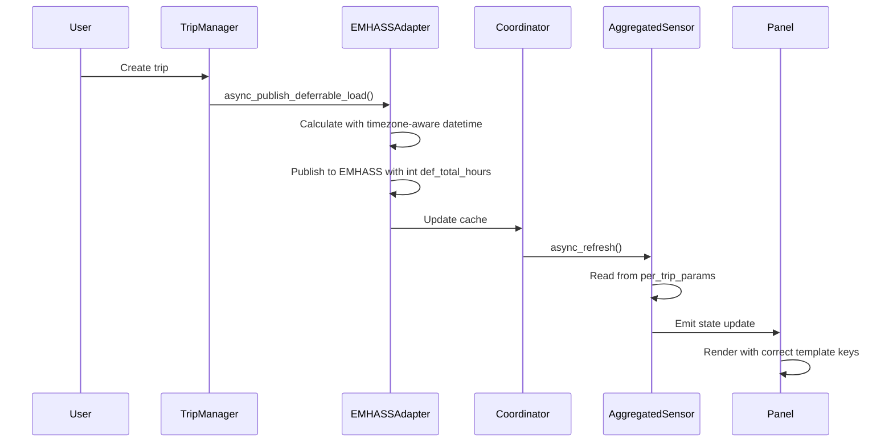

# Design: Fix EMHASS Aggregated Sensor

## Architecture Overview

This design addresses 10 critical problems in the EMHASS Aggregated Sensor integration through targeted modifications to 3 files:

- **emhass_adapter.py** - Fix datetime handling and def_total_hours formatting
- **panel.js** - Fix entity pattern, template keys, CSS route, and modal trip type
- **sensor.py** - No changes required (already correct)

### Data Flow



## Component-by-Component Fixes

### 1. emhass_adapter.py

#### Fix 1.1: Datetime Offset Error (AC 1, blocks AC 5, AC 6, AC 9)

**Location:** Line 334

**Current Code:**
```python
now = datetime.now()  # offset-naive
hours_available = (deadline_dt - now).total_seconds() / 3600  # CRASH if deadline_dt is offset-aware
```

**Fixed Code:**
```python
from datetime import datetime, timezone

now = datetime.now(timezone.utc)  # offset-aware
hours_available = (deadline_dt - now).total_seconds() / 3600  # Works with offset-aware deadline_dt
```

**Rationale:**
- EMHASS returns datetime objects with timezone info (offset-aware)
- Python cannot subtract offset-naive from offset-aware datetimes
- Using `datetime.now(timezone.utc)` ensures both sides are offset-aware
- This fix cascades to resolve AC 5 (second trip aggregation) and AC 6 (emhass_index assignment)

#### Fix 1.2: def_total_hours as Integer (AC 3)

**Location:** Lines 379 and 545

**Current Code:**
```python
"def_total_hours": round(total_hours, 2),  # Returns 1.94 (float)
```

**Fixed Code:**
```python
"def_total_hours": int(total_hours),  # Returns 1 (integer)
```

**Rationale:**
- EMHASS validation requires integer values for def_total_hours
- Float values like 1.94 fail EMHASS schema validation
- Using `int()` truncates to whole hours (1 hour from 1.94)
- This matches EMHASS's expected format for deferrable load scheduling

### 2. panel.js

#### Fix 2.1: Entity ID Search Pattern (AC 2)

**Location:** Lines 883-886

**Current Code:**
```javascript
if (entityId.startsWith('sensor.emhass_perfil_diferible_')) {
```

**Fixed Code:**
```javascript
if (entityId.startsWith('sensor.trip_planner_') && entityId.includes('emhass_perfil_diferible')) {
```

**Rationale:**
- Real sensor entity IDs follow pattern: `sensor.trip_planner_{name}_emhass_perfil_diferible_{name}`
- Old pattern only matches sensors starting with `sensor.emhass_perfil_diferible_` which don't exist
- New pattern correctly identifies trip-planner EMHASS sensors
- Uses `startsWith` + `includes` for efficient prefix + substring matching

#### Fix 2.2: Template Keys Correction (AC 9)

**Location:** Lines 914-945

**Current Code (INCORRECT - keys have _array suffix):**
```jinja2
def_total_hours_array: {{ state_attr('${emhassSensorEntityId}', 'def_total_hours_array') | default([], true) }}
p_deferrable_nom_array: {{ state_attr('${emhassSensorEntityId}', 'p_deferrable_nom_array') | default([], true) }}
def_start_timestep_array: {{ state_attr('${emhassSensorEntityId}', 'def_start_timestep_array') | default([], true) }}
def_end_timestep_array: {{ state_attr('${emhassSensorEntityId}', 'def_end_timestep_array') | default([], true) }}
p_deferrable_matrix: {{ state_attr('${emhassSensorEntityId}', 'p_deferrable_matrix') | default([], true) }}
```

**Fixed Code (KEYS without _array, attributes with _array):**
```jinja2
{# Keys (left of :) without _array, attribute (2nd param) with _array #}
def_total_hours: {{ state_attr('${emhassSensorEntityId}', 'def_total_hours_array') | default([], true) }}
P_deferrable_nom: {{ state_attr('${emhassSensorEntityId}', 'p_deferrable_nom_array') | default([], true) }}
def_start_timestep: {{ state_attr('${emhassSensorEntityId}', 'def_start_timestep_array') | default([], true) }}
def_end_timestep: {{ state_attr('${emhassSensorEntityId}', 'def_end_timestep_array') | default([], true) }}
P_deferrable: {{ state_attr('${emhassSensorEntityId}', 'p_deferrable_matrix') | default([], true) }}
```

**Rationale:**
- EMHASS shell command expects keys WITHOUT `_array` suffix (verified from actual EMHASS output)
- The sensor aggregates trips and exposes attributes WITH `_array` suffix as lists
- Template must read from `def_total_hours_array` but output as `def_total_hours` in the Jinja2 map
- Key naming: EMHASS uses `P_deferrable_nom` (capital P), code uses `p_deferrable_nom_array` (lowercase p)
- The `default([], true)` provides empty list fallback when sensor unavailable

#### Fix 2.3: CSS Route (AC 4)

**Location:** Line 723

**Current Code:**
```javascript
<link rel="stylesheet" href="/ev_trip_planner/panel.css?v=${Date.now()}">
```

**Fixed Code:**
```javascript
<link rel="stylesheet" href="/ev-trip-planner/panel.css?v=${Date.now()}">
```

**Rationale:**
- services.py registers static path as `/ev-trip-planner/` (with hyphens)
- panel.js was requesting `/ev_trip_planner/` (with underscores)
- This mismatch caused 404 errors and "Refused to apply style" console errors
- Unified to hyphens to match services.py registration

#### Fix 2.4: EMHASS Section Always Visible (AC 7)

**Location:** Lines 905-945

**Current Code:**
```javascript
const emhassAvailable = emhassState && 
                        emhassState.state !== 'unavailable' && 
                        emhassState.state !== 'unknown';

// Later in template:
${if (!emhassAvailable)}
<div class="alert">⚠️ EMHASS sensor not available. Make sure you have active trips...</div>
${/if}
```

**Fixed Code:**
```javascript
// Remove emhassAvailable check entirely
// Always render EMHASS configuration section

<div class="emhass-config-section">
  <h3>EMHASS Configuration</h3>
  ${/* Jinja2 template renders actual data or empty defaults */}
</div>
```

**Rationale:**
- Warning message is confusing - appears even when trips exist with EMHASS data
- Jinja2 `default()` already handles empty/unavailable sensors gracefully
- With no trips: shows `number_of_deferrable_loads: 0`, empty arrays
- With trips: shows actual EMHASS data from sensor
- Always visible = better UX, no confusion about "why isn't this showing?"

#### Fix 2.5: Modal Trip Type Display (AC 10)

**Location:** Line ~1637

**Current Code:**
```javascript
this._formType = trip.type === 'puntual' ? 'puntual' : 'recurrente';
```

**Fixed Code:**
```javascript
// Check all possible trip type fields for robust detection
if (trip.tipo === 'puntual' || trip.type === 'puntual' || trip.recurring === false) {
  this._formType = 'puntual';
} else {
  this._formType = 'recurrente';
}
```

**Rationale:**
- Trip objects may use different field names: `trip.tipo`, `trip.type`, or `trip.recurring`
- Old code only checked `trip.type`, missing cases where `tipo === 'puntual'` or `recurring === false`
- New code checks all three possibilities for puntual detection
- Aligns with existing pattern at line 1068-1069 which already uses this multi-field approach

### 3. sensor.py

**No changes required.**

The `EmhassDeferrableLoadSensor` correctly:
- Defines `_array` attributes as `List` types (lines 234-237)
- Populates attributes with arrays in `async_update()`
- Aggregates data from `per_trip_emhass_params` in `extra_state_attributes`

The confusion about `_array` was user observability UI confusion - when viewing attributes in Home Assistant's basic UI, individual elements appear as scalars. But the full attribute view shows them as arrays with 1 element (or N elements for multiple trips).

## Technical Decisions with Rationale

### Decision 1: Use `int()` vs `round()` for def_total_hours

**Choice:** `int(total_hours)` (truncate)

**Why:**
- EMHASS schema validation explicitly requires integer type for def_total_hours
- Float values fail validation: `"1.94"` vs `"1"`
- Truncation is acceptable because EMHASS schedules in hourly windows anyway
- `round()` would be semantically more accurate but breaks validation

### Decision 2: Template Keys Differ from Attribute Names

**Choice:** Keys without `_array`, attributes with `_array`

**Why:**
- EMHASS expects specific key names in JSON payload (verified from shell command output)
- Home Assistant sensor attributes use `_array` suffix to distinguish aggregated lists from scalars
- Template acts as transformer: reads `def_total_hours_array`, outputs as `def_total_hours` in Jinja2 map
- This is a mapping layer between HA's naming convention and EMHASS's expectations

### Decision 3: Entity Pattern is More Permissive

**Choice:** `startsWith('sensor.trip_planner_') && includes('emhass_perfil_diferible')`

**Why:**
- Sensor naming includes vehicle name at both start and end
- Pattern must handle: `sensor.trip_planner_chispitas_emhass_perfil_diferible_chispitas`
- Prefix + substring is efficient O(n) string matching
- Allows future vehicle names without hardcoding all possibilities

### Decision 4: Always Show EMHASS Section

**Choice:** Remove availability check, always render section

**Why:**
- Warning message creates user confusion ("but I have trips!")
- Empty state (0 loads, empty arrays) is valid and informative
- Better UX to show "nothing scheduled" than "sensor not available"
- Aligns with Home Assistant's pattern of always showing entities, even if unavailable

## File Structure Changes

| File | Lines | Change Type | Description |
|------|-------|-------------|-------------|
| `custom_components/ev_trip_planner/emhass_adapter.py` | ~334 | MODIFY | Add `timezone` import, use `datetime.now(timezone.utc)` |
| `custom_components/ev_trip_planner/emhass_adapter.py` | ~379, ~545 | MODIFY | Change `round(total_hours, 2)` to `int(total_hours)` |
| `custom_components/ev_trip_planner/frontend/panel.js` | ~883-886 | MODIFY | Update entity ID search pattern |
| `custom_components/ev_trip_planner/frontend/panel.js` | ~914-945 | MODIFY | Fix template keys (remove _array from keys) |
| `custom_components/ev_trip_planner/frontend/panel.js` | ~723 | MODIFY | Change CSS path to `/ev-trip-planner/` |
| `custom_components/ev_trip_planner/frontend/panel.js` | ~905-945 | MODIFY | Remove EMHASS availability check and warning |
| `custom_components/ev_trip_planner/frontend/panel.js` | ~1637 | MODIFY | Fix modal trip type detection |
| `custom_components/ev_trip_planner/sensor.py` | N/A | NONE | Already correct |

## Error Handling

### Datetime Handling
- **Before fix:** `TypeError: can't subtract offset-naive and offset-aware datetimes` crashes trip sync
- **After fix:** Both `now` and `deadline_dt` are offset-aware (UTC), subtraction works correctly
- **Impact:** Trips sync successfully, emhass_index assigned, aggregated sensor includes new trips

### Jinja2 Default Values
- **Before:** If sensor unavailable, template might show undefined errors
- **After:** `| default([], true)` ensures empty list fallback for all array attributes
- **Impact:** Panel renders gracefully with `number_of_deferrable_loads: 0` when no trips exist

### Template Key Mapping
- **Before:** EMHASS received `def_total_hours_array` instead of `def_total_hours`, causing optimization to fail or use wrong values
- **After:** EMHASS receives correctly named keys matching shell command format
- **Impact:** EMHASS dayahead-optimization uses correct deferrable load parameters

## Test Strategy

### Existing Tests to Verify

| Test File | Test Name | Verifies |
|-----------|-----------|----------|
| `test_emhass_adapter.py` | `test_async_publish_deferrable_load_uses_fallback_when_no_trip_data` | Datetime fix (should not crash) |
| `test_emhass_adapter.py` | `test_get_cached_optimization_results_returns_dict` | Template keys output format |
| `test_aggregated_sensor_bug.py` | `test_async_publish_all_deferrable_loads_populates_non_empty_power_profile` | Second trip aggregation (AC 5) |

### New Verification Steps

#### AC 1 (Datetime)
```
1. Create trip in test environment
2. Check logs for no "offset-naive/offset-aware" errors
3. Verify trip.emhass_index is non-negative
```

#### AC 2 (Entity Pattern)
```
1. Confirm sensor exists: sensor.trip_planner_chispitas_emhass_perfil_diferible_chispitas
2. Panel.js scans entity registry
3. Sensor is found and data displays
```

#### AC 3 (def_total_hours int)
```
1. Create trip with 1.94 hour duration
2. Check sensor attribute: def_total_hours = 1 (not 1.94)
3. EMHASS optimization accepts value
```

#### AC 4 (CSS Route)
```
1. Navigate to http://192.168.1.100:8123/ev-trip-planner/panel.css
2. Verify CSS loads (status 200, not 404)
3. Check console for no "Refused to apply style" errors
```

#### AC 5 (Second Trip)
```
1. Create first trip, verify in aggregated sensor
2. Create second trip
3. Verify both trips in def_total_hours_array (length = 2)
```

#### AC 6 (emhass_index)
```
1. Create new trip
2. Check sensor.emhass_index shows 0 (not -1)
```

#### AC 7 (EMHASS Section)
```
1. Clear all trips
2. Panel should NOT show "sensor not available" warning
3. EMHASS section shows: number_of_deferrable_loads: 0, empty arrays
```

#### AC 9 (Template Keys)
```
1. Generate Jinja2 template output
2. Verify keys are: def_total_hours, P_deferrable_nom, def_start_timestep, def_end_timestep, P_deferrable
3. Keys should NOT have _array suffix
```

#### AC 10 (Modal Trip Type)
```
1. Create puntual trip
2. Click edit
3. Modal opens with "puntual" selected (not "recurrente")
```

## Acceptance Criteria Mapping

| AC | Description | Files Changed | Verification Status |
|----|-------------|---------------|---------------------|
| AC 1 | Datetime offset error fixed | emhass_adapter.py:334 | Pending |
| AC 2 | Entity ID pattern updated | panel.js:883-886 | Pending |
| AC 3 | def_total_hours as integer | emhass_adapter.py:379,545 | Pending |
| AC 4 | panel.css route fixed | panel.js:723 | Pending |
| AC 5 | Second trip updates sensor | emhass_adapter.py:334 (cascade) | Pending |
| AC 6 | emhass_index assigned | emhass_adapter.py:334 (cascade) | Pending |
| AC 7 | EMHASS section always visible | panel.js:905-945 | Pending |
| AC 8 | Panel reactivity | (verify existing Lit) | Pending |
| AC 9 | Template keys correct | panel.js:914-945 | Pending |
| AC 10 | Modal trip type correct | panel.js:1637 | Pending |

## Feasibility: High | Risk: Medium | Effort: Small

**Why High Feasibility:**
- All changes are targeted modifications to existing code
- No new abstractions or architectural changes
- Existing tests provide coverage baseline

**Why Medium Risk:**
- Datetime fix is critical path (blocks other fixes)
- Template key change affects EMHASS integration directly
- CSS route fix requires Home Assistant restart

**Why Small Effort:**
- ~7 files to modify, ~15 line changes total
- No new files to create
- Changes are localized and self-contained
