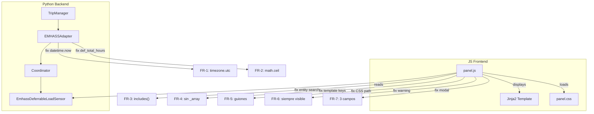
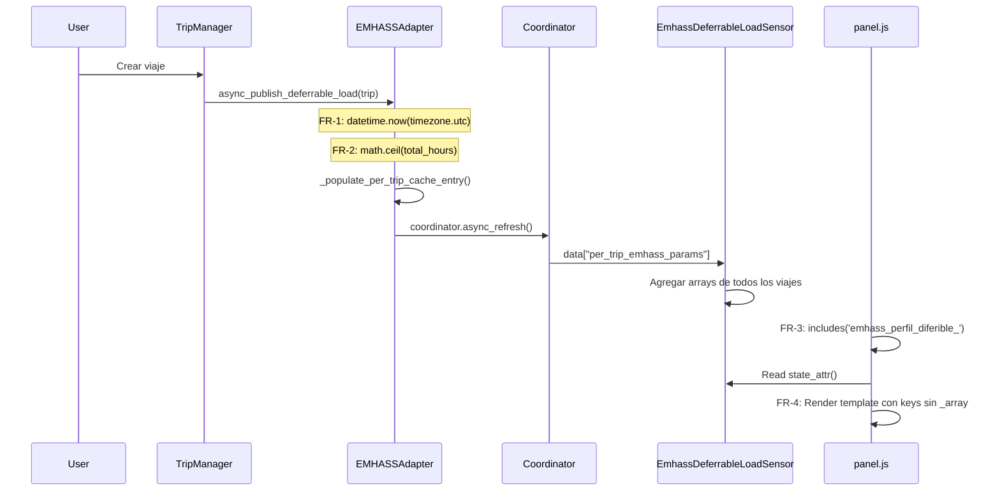

# Design: Fix EMHASS Aggregated Sensor

## Overview

Correcciones quirúrgicas a 2 archivos (`emhass_adapter.py`, `panel.js`) para resolver 7 bugs en la integración EMHASS. La causa raíz principal es `datetime.now()` (offset-naive) usado en restas contra datetimes offset-aware. Los fixes son autocontenidos y no requieren cambios arquitecturales.

## Architecture

### Component Diagram



### Data Flow



## Technical Decisions

| Decision | Options Considered | Choice | Rationale |
|----------|-------------------|--------|-----------|
| def_total_hours rounding | `int()` (truncate), `round()` (float), `math.ceil()` (round up) | `math.ceil()` | `int(1.94)=1` deja el EV sin carga. `ceil(1.94)=2` sobreestima ligeramente pero garantiza carga suficiente |
| Entity ID search | `startsWith('sensor.trip_planner_')`, `startsWith('sensor.ev_trip_planner_')`, `includes('emhass_perfil_diferible_')` | `includes()` | El prefijo depende de device_name en HA y puede variar por config de usuario. `includes()` es robusto |
| datetime fix scope | Solo línea 333, Todas las restas (5 puntos) | Todas las restas | Un fix parcial dejaría bugs latentes en `_populate_per_trip_cache_entry()` y `get_available_indices()` |
| Warning EMHASS removal | Mantener con lógica mejorada, Eliminar warning | Eliminar warning | El Jinja2 `default()` ya maneja sensores vacíos. El warning confunde más que ayuda |

## File Structure

| File | Action | Purpose |
|------|--------|---------|
| `custom_components/ev_trip_planner/emhass_adapter.py` | Modify | FR-1: timezone.utc (5 puntos), FR-2: math.ceil (2 puntos) |
| `custom_components/ev_trip_planner/frontend/panel.js` | Modify | FR-3: entity search (5 puntos), FR-4: template keys, FR-5: CSS path, FR-6: warning, FR-7: modal |
| `custom_components/ev_trip_planner/sensor.py` | None | Ya correcto — no requiere cambios |

## Interfaces

### emhass_adapter.py — Cambios puntuales

```python
# FR-1: Import fix (línea 3)
from datetime import datetime, timezone  # Añadir timezone

# FR-2: Import fix (nuevo)
import math  # Para math.ceil

# FR-1: 5 puntos de datetime.now() → datetime.now(timezone.utc)
# Línea 126: async_load
now = datetime.now(timezone.utc)

# Línea 333: async_publish_deferrable_load
now = datetime.now(timezone.utc)

# Línea 534: _populate_per_trip_cache_entry
delta_hours = (inicio_ventana - datetime.now(timezone.utc)).total_seconds() / 3600

# Línea 537: _populate_per_trip_cache_entry
hours_available = (deadline_dt - datetime.now(timezone.utc)).total_seconds() / 3600

# Línea 721: get_available_indices
now = datetime.now(timezone.utc)

# FR-2: 2 puntos de round() → math.ceil()
# Línea ~379: async_publish_deferrable_load
"def_total_hours": math.ceil(total_hours),

# Línea ~549: _populate_per_trip_cache_entry
"def_total_hours": math.ceil(total_hours),
"def_total_hours_array": [math.ceil(total_hours)],
```

### panel.js — Cambios puntuales

```javascript
// FR-3: 5 puntos — cambiar startsWith a includes
// Líneas 883, 893, 1218, 1233:
if (entityId.includes('emhass_perfil_diferible_')) {

// Línea 1210: En array de patterns
'sensor.emhass_perfil_diferible_',  // Reemplazar por lógica includes en el filter

// FR-4: Template keys (líneas ~914-918)
def_total_hours: {{ state_attr('...', 'def_total_hours_array') | default([], true) }}
P_deferrable_nom: {{ state_attr('...', 'p_deferrable_nom_array') | default([], true) }}
def_start_timestep: {{ state_attr('...', 'def_start_timestep_array') | default([], true) }}
def_end_timestep: {{ state_attr('...', 'def_end_timestep_array') | default([], true) }}
P_deferrable: {{ state_attr('...', 'p_deferrable_matrix') | default([], true) }}

// FR-5: CSS path (línea 723)
href="/ev-trip-planner/panel.css?v=${Date.now()}"

// FR-6: Eliminar bloque warning (línea ~942)
// Eliminar: ${!emhassAvailable ? html`<div class="emhass-warning">...` : ''}

// FR-7: Modal trip type (línea ~1637)
const isPunctual = trip.tipo === 'puntual' || trip.type === 'puntual' || trip.recurring === false;
this._formType = isPunctual ? 'puntual' : 'recurrente';
```

## Error Handling

| Error Scenario | Handling Strategy | User Impact |
|----------------|-------------------|-------------|
| deadline_dt offset-aware vs now offset-naive | `datetime.now(timezone.utc)` asegura compatibilidad | Viajes se publican correctamente |
| Sensor no encontrado por entity_id pattern | `includes()` busca substring en cualquier entity_id | Panel muestra datos EMHASS |
| CSS 404 por ruta incorrecta | Ruta unificada con guiones `/ev-trip-planner/` | Panel con estilos correctos |
| Template keys incorrectas para EMHASS | Keys sin `_array` suffix | EMHASS REST API recibe parámetros correctos |

## Edge Cases

- **Trip sin timezone en ISO string**: `_calculate_deadline_from_trip()` devuelve naive datetime → `datetime.now(timezone.utc) - naive_dt` sigue fallando. Se debe asegurar que `deadline_dt` sea aware. Verificar si `datetime.fromisoformat()` devuelve naive/aware dependiendo del input.
- **Entity renombrada por usuario**: Con `includes()` funciona mientras el entity_id contenga `emhass_perfil_diferible_`.
- **`math.ceil(0.0) = 0`**: Si `kwh = 0`, `total_hours = 0`, `def_total_hours = 0`. EMHASS podría ignorar cargas de 0h — esto es correcto.

## Security Considerations

- Sin impacto de seguridad — los cambios son lógica interna sin inputs de usuario no validados

## Performance Considerations

- Sin impacto — `math.ceil()` y `datetime.now(timezone.utc)` tienen complejidad O(1)
- `includes()` en vez de `startsWith()` es O(n) en longitud de string pero entity_ids son cortos (~60 chars)

## Concurrency & Ordering Risks

| Operation | Required Order | Risk if Inverted |
|---|---|---|
| `datetime.now(timezone.utc)` antes de resta | `now` debe calcularse antes de `deadline_dt - now` | TypeError si `now` es naive y `deadline_dt` es aware |
| Entity search antes de template render | Sensor encontrado antes de leer attrs | `state_attr(null, ...)` devuelve undefined — mitigado por `default()` |

## Test Strategy

### Test Double Policy

| Type | What it does | When to use |
|---|---|---|
| **Stub** | Returns predefined data, no behavior | Aislar emhass_adapter de HA para datetime tests |
| **Mock** | Verifies interactions (call args, call count) | Verificar que `datetime.now(timezone.utc)` se llama correctamente |
| **Fixture** | Predefined data state, not code | Trip dicts y sensor attrs para tests |

### Mock Boundary

| Component (from this design) | Unit test | Integration test | Rationale |
|---|---|---|---|
| `EMHASSAdapter.async_publish_deferrable_load` | stub (hass, store) | none | Aislar del HA runtime |
| `EMHASSAdapter._populate_per_trip_cache_entry` | stub (hass, store) | none | Mismas dependencias |
| `EMHASSAdapter.get_available_indices` | none | none | Lógica pura sobre dict en memoria |
| `panel.js` entity search | N/A (JS) | E2E (Playwright) | No testeable como unit en Python |

### Fixtures & Test Data

| Component | Required state | Form |
|---|---|---|
| `EMHASSAdapter` tests | Trip dict con `datetime: "2026-04-20T10:00:00+02:00"` (aware) | Inline dict en test |
| `EMHASSAdapter` tests | Trip dict con `kwh: 14.37`, `charging_power_kw: 7.4` → `total_hours = 1.94` | Inline dict |
| Entity search tests | E2E con sensor activo | Seed via HA test config |

### Test Coverage Table

| Component / Function | Test type | What to assert | Test double |
|---|---|---|---|
| `async_publish_deferrable_load` datetime | unit | `now` es offset-aware, no TypeError en resta | stub hass |
| `_populate_per_trip_cache_entry` datetime | unit | Líneas 534, 537 usan `timezone.utc` | stub hass |
| `async_publish_deferrable_load` ceil | unit | `def_total_hours` es `int` y `== math.ceil(total_hours)` | stub hass |
| `get_available_indices` datetime | unit | No error con `released_time` aware | none |
| Entity search (panel.js) | e2e | Panel encuentra sensor con prefijo `ev_trip_planner_` | none (real env) |
| Template keys (panel.js) | e2e | Keys no tienen suffix `_array` | none (real env) |
| CSS loading | e2e | HTTP 200 para `/ev-trip-planner/panel.css` | none |
| Modal trip type | e2e | Editar trip puntual muestra "puntual" seleccionado | none |

### Skip Policy

Tests marked `.skip` / `@pytest.mark.skip` son PROHIBIDOS a menos que:
1. La funcionalidad no está implementada aún
2. Hay referencia a GitHub issue en el skip reason

### Test File Conventions

- Test runner: `pytest`
- Test file location: `tests/test_*.py`
- Integration test pattern: `tests/test_*_integration.py` (si aplica)
- E2E test pattern: `playwright/*.spec.ts`
- Mock cleanup: `@pytest.fixture` con scope adecuado
- Fixture location: Dentro de cada test file o `conftest.py`
