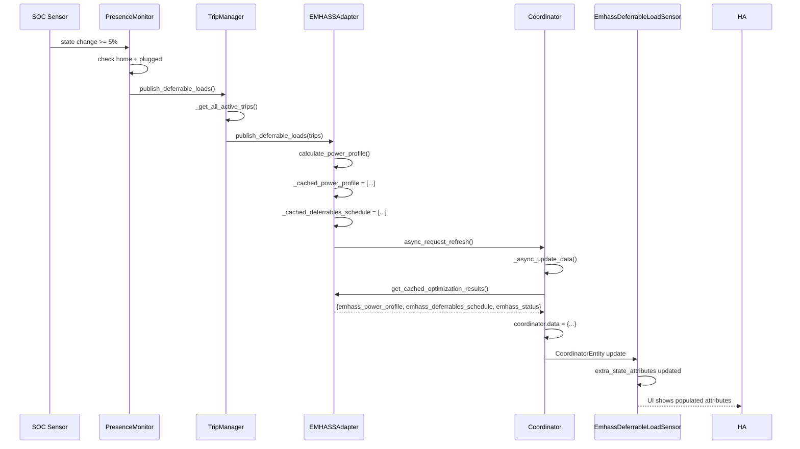

# Design: Fix EMHASS Sensor Attributes

## Overview

Fix two bugs in `EmhassDeferrableLoadSensor`: (1) device duplication caused by using `entry_id` instead of `vehicle_id` in `device_info.identifiers`, and (2) null sensor attributes caused by broken data flow where `PresenceMonitor._async_handle_soc_change()` calls methods that never cache EMHASS data. Fix: add `vehicle_id` property to `TripPlannerCoordinator` and route SOC changes through `publish_deferrable_loads()` (the caching method).

## Architecture

```mermaid
graph TB
    subgraph Current["Current BROKEN Flow"]
        PM[PresenceMonitor._async_handle_soc_change] --> agp[async_generate_power_profile]
        PM --> ags[async_generate_deferrables_schedule]
        agp -.->|NO CACHE| X1[(X)]
        ags -.->|NO CACHE| X2[(X)]
    end

    subgraph Fixed["FIXED Flow"]
        PM2[PresenceMonitor._async_handle_soc_change] --> TM[TripManager.publish_deferrable_loads]
        TM --> EA[EMHASSAdapter.publish_deferrable_loads]
        EA --> Cache[_cached_* attributes]
        Cache --> Coord[coordinator.async_request_refresh]
        Coord --> CD[coordinator.data]
        CD --> Sensor[EmhassDeferrableLoadSensor.attributes]
    end

    subgraph DeviceInfo["Device Info Fix"]
        Coord2[TripPlannerCoordinator] -->|new property| VID[vehicle_id]
        Sensor2[EmhassDeferrableLoadSensor] -->|reads from| VID
        Sensor2 --> DI[device_info.identifiers]
        DI -->|uses| VID
    end
```



## Components

### Bug #1: Device Duplication

**Root Cause**: `EmhassDeferrableLoadSensor.device_info` uses `entry_id` (UUID) instead of `vehicle_id` in `identifiers`, creating a second device in HA UI.

**Current Code** (`sensor.py:183-187`):
```python
@property
def device_info(self) -> Dict[str, Any]:
    vehicle_id = getattr(self.coordinator, 'vehicle_id', self._entry_id)
    return {
        "identifiers": {(DOMAIN, self._entry_id)},  # BUG: should be vehicle_id
        ...
    }
```

**Issue**: Code gets `vehicle_id` from coordinator but uses `self._entry_id` in `identifiers`.

### Bug #2: Empty Attributes

**Root Cause**: `PresenceMonitor._async_handle_soc_change()` calls:
- `trip_manager.async_generate_power_profile()` - only returns list, no cache
- `trip_manager.async_generate_deferrables_schedule()` - only returns list, no cache

**Correct Path**: Should call `trip_manager.publish_deferrable_loads()` which:
1. Gets all active trips
2. Calls `emhass_adapter.publish_deferrable_loads(all_trips)` (plural, non-async - DOES cache)

### EMHASSAdapter Method Comparison

| Method | Lines | What it does | Sets `_cached_*`? | Called by |
|--------|-------|--------------|-------------------|-----------|
| `async_publish_deferrable_load(trip)` | ~274-460 | Publishes ONE trip to EMHASS config | **NO** | `async_publish_all_deferrable_loads()`, `publish_deferrable_loads()` |
| `async_publish_all_deferrable_loads(trips)` | ~403-460 | Loops and calls `async_publish_deferrable_load()` for each | **NO** | `TripManager.publish_deferrable_loads()` (current) |
| `publish_deferrable_loads(trips, ...)` | ~486-570 | Calculates profile, sets cache, triggers coordinator | **YES** | **NONE currently** |

**Key insight**: Only `publish_deferrable_loads()` (plural, non-async prefix in name but IS async def) sets the cache. It also internally calls `async_publish_deferrable_load()` for each trip (lines 565-568), so calling it replaces the need to call `async_publish_all_deferrable_loads()`.

**Current Data Flow** (BROKEN):
```
SOC change >= 5%
  -> PresenceMonitor._async_handle_soc_change()
  -> trip_manager.async_generate_power_profile()
  -> returns [0, 0, 3600, ...]  (NO CACHE!)
  -> trip_manager.async_generate_deferrables_schedule()
  -> returns [...]  (NO CACHE!)
  -> coordinator.data = {emhass_*: None}  (stays None!)
  -> sensor.attributes = {power_profile_watts: null}
```

**Fixed Data Flow**:
```
SOC change >= 5%
  -> PresenceMonitor._async_handle_soc_change()
  -> trip_manager.publish_deferrable_loads()
  -> emhass_adapter.publish_deferrable_loads(trips)
  -> self._cached_power_profile = [...]
  -> self._cached_deferrables_schedule = [...]
  -> coordinator.async_request_refresh()
  -> coordinator._async_update_data()
  -> emhass_adapter.get_cached_optimization_results()
  -> coordinator.data = {emhass_power_profile: [...], ...}
  -> sensor.attributes populated!
```

## Technical Decisions

| Decision | Options Considered | Choice | Rationale |
|----------|-------------------|--------|-----------|
| **How to expose vehicle_id to sensor** | A. Pass vehicle_id as sensor constructor param<br>B. Add vehicle_id property to coordinator | B | Maintains existing sensor API, coordinator already has access via entry.data. Less invasive than changing constructor signature. |
| **How to fix data flow routing** | A. Make async_generate_* methods cache internally<br>B. Route through publish_deferrable_loads()<br>C. Call publish_deferrable_loads() from PresenceMonitor | B + C | async_generate_* are pure calculation methods (correct separation). publish_deferrable_loads() already has caching logic. PresenceMonitor should call TripManager.publish_deferrable_loads() which calls the correct adapter method. |
| **Which adapter method to call** | A. async_publish_all_deferrable_loads() (current)<br>B. async_publish_deferrable_load() (singular)<br>C. publish_deferrable_loads() (plural, non-async) | C | Method A calls B iteratively, neither caches. Method C is the ONLY one that sets _cached_* attributes and triggers coordinator refresh. |

## Component Changes

| Component | Change | Files |
|-----------|--------|-------|
| `TripPlannerCoordinator` | Add `vehicle_id` property (read from entry.data) | `custom_components/ev_trip_planner/coordinator.py` |
| `EmhassDeferrableLoadSensor.device_info` | Use `vehicle_id` from coordinator in `identifiers` | `custom_components/ev_trip_planner/sensor.py` |
| `EmhassDeferrableLoadSensor._attr_name` | Use `vehicle_id` for friendly name instead of entry_id (UUID) | `custom_components/ev_trip_planner/sensor.py` |
| `PresenceMonitor._async_handle_soc_change` | Replace async_generate_* calls with `trip_manager.publish_deferrable_loads()` | `custom_components/ev_trip_planner/presence_monitor.py` |
| `TripManager.publish_deferrable_loads` | Rename from `_publish_deferrable_loads()` to public, call `publish_deferrable_loads()` instead of `async_publish_all_deferrable_loads()` | `custom_components/ev_trip_planner/trip_manager.py` |
| `TripManager` internal callers (4 sites) | Update `self._publish_deferrable_loads()` → `self.publish_deferrable_loads()` at 4 call sites | `custom_components/ev_trip_planner/trip_manager.py` |
| `tests/__init__.py` mock factory | Update `mock._publish_deferrable_loads` → `mock.publish_deferrable_loads` | `tests/__init__.py` |
| `tests/test_trip_manager_core.py` | Update 2 tests that call `manager._publish_deferrable_loads()` → `manager.publish_deferrable_loads()` | `tests/test_trip_manager_core.py` |
| `tests/test_deferrable_load_sensors.py` | Update `test_sensor_device_info` to expect `vehicle_id` not `entry_id` | `tests/test_deferrable_load_sensors.py` |

**Note**: `EMHASSAdapter.publish_deferrable_loads()` does dual work: (1) calculates and caches the 168-value power profile, AND (2) calls `async_publish_deferrable_load()` for each trip internally (lines 565-568). This means we're replacing the explicit call to `async_publish_all_deferrable_loads()` with a method that does the same per-trip work PLUS caching. No double-processing.

### ⚠️ Rename Blast Radius: `_publish_deferrable_loads()` → `publish_deferrable_loads()`

Renaming this method affects **7 additional references** beyond the definition. The implementing agent MUST update ALL of these or the code will crash with `AttributeError`.

**4 internal callers in `trip_manager.py`:**

| Call site | Line | Context |
|-----------|------|---------|
| `_save_trips()` | ~375 | After saving trips to storage, triggers EMHASS update |
| `_async_sync_trip_to_emhass()` | ~859 | After trip edit with recalc-worthy field changes |
| `_async_remove_trip_from_emhass()` | ~887 | After removing a trip from EMHASS |
| `_async_publish_new_trip_to_emhass()` | ~903 | After publishing a new trip to EMHASS |

All 4 sites use `await self._publish_deferrable_loads()` → change to `await self.publish_deferrable_loads()`.

**3 test/mock references:**

| File | Line | What to change |
|------|------|---------|
| `tests/__init__.py` | ~127 | `mock._publish_deferrable_loads = AsyncMock(...)` → `mock.publish_deferrable_loads = AsyncMock(...)` |
| `tests/test_trip_manager_core.py` | ~774 | `await manager._publish_deferrable_loads()` → `await manager.publish_deferrable_loads()` |
| `tests/test_trip_manager_core.py` | ~885 | Same rename in second test |

### ⚠️ Double-Processing Warning for Internal Callers

3 of the 4 internal callers call a per-trip adapter method BEFORE calling `publish_deferrable_loads()`:

```python
# _async_publish_new_trip_to_emhass() — line ~900:
await self._emhass_adapter.async_publish_deferrable_load(trip)  # per-trip
await self.publish_deferrable_loads()  # also does per-trip internally!
```

Since `EMHASSAdapter.publish_deferrable_loads()` already calls `async_publish_deferrable_load()` for EACH trip (lines 565-568), the trip published individually will be processed TWICE. This is pre-existing behavior (same double-call existed with `async_publish_all_deferrable_loads()`) and is NOT a new regression. The individual call ensures the trip gets its EMHASS index assigned immediately; the bulk call recalculates the full 168-value profile. This is acceptable for now — optimization can be done later.

## Data Flow Diagram



## File-by-File Implementation Plan

### 1. `custom_components/ev_trip_planner/coordinator.py`

**Add `vehicle_id` property to `TripPlannerCoordinator`:**

```python
# Add import at top of file:
from .const import CONF_VEHICLE_NAME

# In __init__, after storing self._entry:
self._vehicle_id = self._entry.data.get(CONF_VEHICLE_NAME, "unknown").lower().replace(" ", "_")

# Add property:
@property
def vehicle_id(self) -> str:
    """Return the vehicle ID for this coordinator."""
    return self._vehicle_id
```

### 2. `custom_components/ev_trip_planner/sensor.py`

**Fix `EmhassDeferrableLoadSensor.device_info`:**

```python
# Lines 177-190, BEFORE:
@property
def device_info(self) -> Dict[str, Any]:
    vehicle_id = getattr(self.coordinator, 'vehicle_id', self._entry_id)
    return {
        "identifiers": {(DOMAIN, self._entry_id)},  # BUG
        ...
    }

# AFTER:
@property
def device_info(self) -> Dict[str, Any]:
    vehicle_id = getattr(self.coordinator, 'vehicle_id', self._entry_id)
    return {
        "identifiers": {(DOMAIN, vehicle_id)},  # FIXED: use vehicle_id
        "name": f"EV Trip Planner {vehicle_id}",
        ...
    }
```

**Fix `EmhassDeferrableLoadSensor._attr_name` (lines 154-156):**

```python
# BEFORE:
self._attr_unique_id = f"emhass_perfil_diferible_{entry_id}"
self._attr_name = f"EMHASS Perfil Diferible {entry_id}"  # Shows UUID in UI
self._attr_has_entity_name = True

# AFTER:
self._attr_unique_id = f"emhass_perfil_diferible_{entry_id}"  # Keep entry_id for stability
vehicle_id = getattr(coordinator, 'vehicle_id', entry_id)  # Get from coordinator
self._attr_name = f"EMHASS Perfil Diferible {vehicle_id}"  # Shows friendly name
self._attr_has_entity_name = True
```

**Note**: `unique_id` must keep `entry_id` for stability (renaming vehicle shouldn't change entity ID), but `name` should show `vehicle_id` for user-friendliness.

### 3. `custom_components/ev_trip_planner/presence_monitor.py`

**Fix `_async_handle_soc_change()` method routing:**

```python
# Lines 546-547, AFTER all validation checks, BEFORE:
# Call the public async methods on trip_manager
await self._trip_manager.async_generate_power_profile()
await self._trip_manager.async_generate_deferrables_schedule()

# AFTER:
# Route through publish_deferrable_loads which caches and triggers coordinator
# Note: Renamed from _publish_deferrable_loads to publish_deferrable_loads (public)
await self._trip_manager.publish_deferrable_loads()
```

### 4. `custom_components/ev_trip_planner/trip_manager.py`

**Rename `_publish_deferrable_loads()` to `publish_deferrable_loads()` (public) and fix adapter call:**

```python
# Line 154-159, BEFORE:
async def _publish_deferrable_loads(self) -> None:
    """Publish current trips to EMHASS as deferrable loads."""
    if not self._emhass_adapter:
        return
    all_trips = await self._get_all_active_trips()
    await self._emhass_adapter.async_publish_all_deferrable_loads(all_trips)

# AFTER:
async def publish_deferrable_loads(self) -> None:
    """Publish current trips to EMHASS as deferrable loads.

    This method is now PUBLIC (no underscore prefix) so PresenceMonitor can call it.
    It calls publish_deferrable_loads() on the adapter which:
    1. Calculates and caches the 168-value power profile
    2. Generates deferrables schedule
    3. Triggers coordinator refresh
    4. Also publishes per-trip configs internally (no separate call needed)
    """
    if not self._emhass_adapter:
        return
    all_trips = await self._get_all_active_trips()
    # Call publish_deferrable_loads (plural) which CACHES, not async_publish_all_deferrable_loads
    await self._emhass_adapter.publish_deferrable_loads(all_trips)
```

## Error Handling

| Error Scenario | Handling Strategy | User Impact |
|----------------|-------------------|-------------|
| `vehicle_id` missing from entry.data | Coordinator property falls back to entry_id | Sensor still works but with device ID as UUID (partial fix) |
| `publish_deferrable_loads()` throws exception | Logged as ERROR, sensor attributes remain at previous values | No crash, stale data until next successful update |
| Coordinator refresh fails | EMHASSAdapter logs warning "No coordinator found" | EMHASS data not updated, but other sensor data continues |

## Edge Cases

- **vehicle_id changes**: If user renames vehicle in config flow, entry_id remains stable but vehicle_id changes. Old device orphaned in HA UI (manual cleanup required).
- **SOC unavailable**: PresenceMonitor debounces with `_last_processed_soc` to skip unavailable/unknown states.
- **No trips configured**: `publish_deferrable_loads()` handles empty list, caches all-zero profile.
- **EMHASS adapter not initialized**: `TripManager.publish_deferrable_loads()` returns early if `self._emhass_adapter` is None.
- **RestoreSensor not implemented**: `EmhassDeferrableLoadSensor` does not inherit from `RestoreSensor` (known gap G-08). Sensor state will be `unknown` until first successful coordinator refresh. Out of scope for this fix.

## Test Strategy

### Test Double Policy

| Type | What it does | When to use |
|---|---|---|
| **Stub** | Returns predefined data, no behavior | Isolate SUT from external I/O (HA state, config storage) |
| **Fake** | Simplified real implementation | Test coordinator refresh without real HA |
| **Mock** | Verifies interactions | When method call itself is the outcome (rare - use Stub) |
| **Fixture** | Predefined data state | Any test needing known trips, SOC values, coordinator state |

> **Consistency rule**: Check each cell - if you write "Mock" ask "is the interaction itself the observable outcome?" If no, use Stub.

### Mock Boundary

| Component | Unit test | Integration test | Rationale |
|---|---|---|---|
| `TripPlannerCoordinator.vehicle_id` | none (property) | Read entry.data mock | Simple property, no behavior to test |
| `EmhassDeferrableLoadSensor.device_info` | Stub coordinator with vehicle_id | None | Only verifies return value, not side effects |
| `PresenceMonitor._async_handle_soc_change` | Stub trip_manager.publish_deferrable_loads | Stub trip_manager | Verifies SOC delta triggers call, not internal logic |
| `TripManager.publish_deferrable_loads` | Stub emhass_adapter.publish_deferrable_loads | Stub emhass_adapter | Verifies correct method called (not the async_all variant) |
| `EMHASSAdapter.publish_deferrable_loads` | Stub coordinator.async_request_refresh | Fake coordinator | Verifies cache is set, not coordinator internals |

### Fixtures & Test Data

| Component | Required state | Form |
|---|---|---|
| `mock_coordinator` | `vehicle_id="test_vehicle"`, `data={emhass_*: [...]}` | Factory in `conftest.py` |
| `mock_trip_manager` | `_emhass_adapter=Mock()`, active trips list | Factory in `conftest.py` |
| `SOC change test` | `last_processed_soc=50`, `new_soc=55`, `is_home=True`, `is_plugged=True` | Inline constants or fixture |
| `Power profile test` | 168-element list with 0s and positive values | Fixture `power_profile_charging` |

### Test Coverage Table

| Component / Function | Test type | What to assert | Test double |
|---|---|---|---|
| `TripPlannerCoordinator.vehicle_id` | unit | Property returns `vehicle_id` from entry.data | None (property) |
| `EmhassDeferrableLoadSensor.device_info` | unit | `identifiers` uses `vehicle_id`, not `entry_id` | Stub coordinator with vehicle_id |
| `PresenceMonitor._async_handle_soc_change` | unit | Calls `publish_deferrable_loads()` when delta >= 5% | Stub trip_manager |
| `PresenceMonitor._async_handle_soc_change` | unit | Skips when delta < 5% (debounce) | Stub trip_manager |
| `PresenceMonitor._async_handle_soc_change` | unit | Skips when not home or not plugged | Stub trip_manager |
| `TripManager.publish_deferrable_loads` | unit | Calls `publish_deferrable_loads()` (plural) on adapter | Stub emhass_adapter |
| `TripManager.publish_deferrable_loads` | unit | Returns early if no emhass_adapter | None |
| `TripManager._save_trips` (existing) | unit | Verify still calls `self.publish_deferrable_loads()` (not `_publish_...`) | Stub emhass_adapter |
| `TripManager._async_remove_trip_from_emhass` (existing) | unit | Verify still calls `self.publish_deferrable_loads()` after remove | Stub emhass_adapter |
| `TripManager._async_publish_new_trip_to_emhass` (existing) | unit | Verify still calls `self.publish_deferrable_loads()` after publish | Stub emhass_adapter |
| `EMHASSAdapter.publish_deferrable_loads` | unit | Sets `_cached_power_profile` | None |
| `EMHASSAdapter.publish_deferrable_loads` | unit | Calls `coordinator.async_request_refresh()` | Stub coordinator |
| E2E: SOC change → sensor update | e2e | `power_profile_watts` has non-null values after SOC change | None (real HA) |

### Test File Conventions

**Test runner**: pytest 9.0.0

**Execution commands**:
- Unit: `pytest tests/test_deferrable_load_sensors.py -v`
- Integration: `pytest tests/integration/ -v` (if exists)
- E2E: `make e2e` (runs Playwright)

**Test file location**: `tests/test_*.py` (co-located with test name)

**Mock cleanup**: Tests use `@pytest.fixture` with function scope (auto-cleanup)

**Fixture/factory location**: `tests/conftest.py` for shared fixtures, inline for test-specific

## Existing Patterns to Follow

1. **Coordinator property pattern**: `TripPlannerCoordinator` already stores `self._entry`. Adding `vehicle_id` property follows existing pattern.
2. **Sensor device_info pattern**: Other sensors in `sensor.py` use `device_info` property with `identifiers` tuple.
3. **PresenceMonitor debouncing**: `_last_processed_soc` pattern already exists for delta comparison.
4. **Public method convention**: `publish_deferrable_loads()` is renamed from private (underscore prefix) to public so `PresenceMonitor` can call it. This follows the pattern of making internal methods public when they need to be called from other components (e.g., `async_get_trips()` is also public).

## Rollback Plan

If issues arise after deployment:

1. **Device duplication returns**: Revert `sensor.py` device_info change to use `entry_id`. Users may need to manually clean up orphaned devices via HA UI.
2. **Sensor attributes null again**: Revert `presence_monitor.py` and `trip_manager.py` changes. SOC changes will not trigger updates (pre-existing bug).
3. **Coordinator property breaks**: Remove `vehicle_id` property from coordinator, add fallback logic in sensor to read from `entry.data` directly.

## Implementation Steps

1. Add `vehicle_id` property to `TripPlannerCoordinator` (`coordinator.py`)
2. Fix `EmhassDeferrableLoadSensor.device_info` to use `vehicle_id` from coordinator (`sensor.py`)
3. Fix `EmhassDeferrableLoadSensor._attr_name` to show `vehicle_id` instead of `entry_id` UUID (`sensor.py`)
4. Update `PresenceMonitor._async_handle_soc_change()` to call `publish_deferrable_loads()` (`presence_monitor.py`)
5. Rename `TripManager._publish_deferrable_loads()` to `publish_deferrable_loads()` (public) and fix adapter call (`trip_manager.py`)
6. **Update ALL 4 internal callers** of `self._publish_deferrable_loads()` → `self.publish_deferrable_loads()` in `trip_manager.py` (lines ~375, ~859, ~887, ~903)
7. **Update mock factory** in `tests/__init__.py`: `mock._publish_deferrable_loads` → `mock.publish_deferrable_loads`
8. **Update 2 tests** in `tests/test_trip_manager_core.py` that call `manager._publish_deferrable_loads()`
9. Update `test_sensor_device_info` to expect `vehicle_id` in identifiers (`tests/test_deferrable_load_sensors.py`)
10. Add tests for SOC change triggering `publish_deferrable_loads()`
11. Create E2E test for full SOC → sensor update flow (`tests/e2e/emhass-sensor-updates.spec.ts`)
