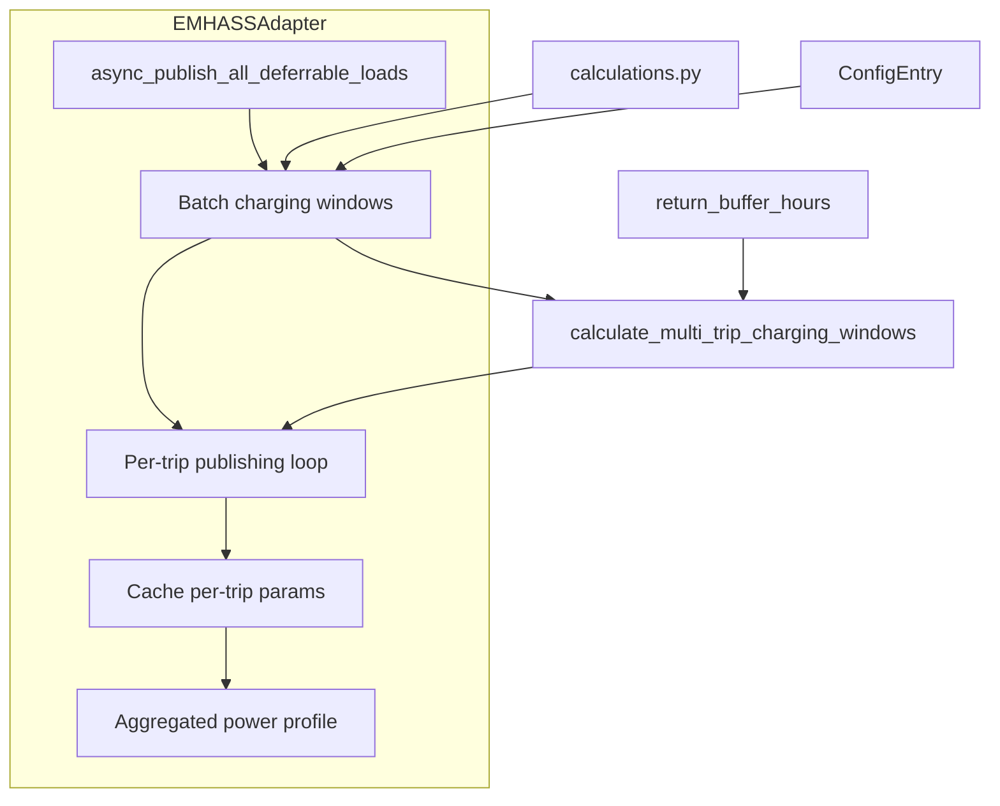
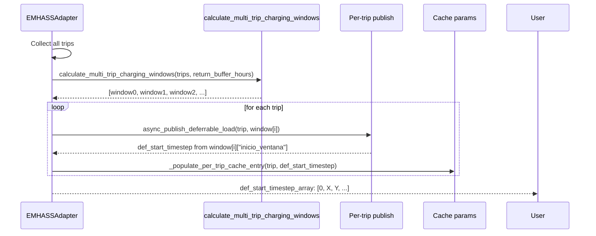

# Design: Fix Sequential Trip Charging

## Overview

Fix the bug where `def_start_timestep_array` shows `[0, 0]` for sequential trips by batching all trips through `calculate_multi_trip_charging_windows()` in a single call. Add configurable `return_buffer_hours` option (default 4h, range 0-12h) for the gap between trips.

## Architecture



## Components

### Component 1: EMHASSAdapter.async_publish_all_deferrable_loads

**Purpose**: Batch process all trips before per-trip publishing to enable correct sequential def_start_timestep calculation.

**Responsibilities**:
- Collect all trips before per-trip processing
- Call `calculate_multi_trip_charging_windows()` once with all trips
- Map returned `inicio_ventana` to each trip's `def_start_timestep`
- Maintain backward compatibility for single trips
- Handle edge cases (window_start > deadline)

**Interfaces**:
```python
async def async_publish_all_deferrable_loads(
    self,
    trips: List[Dict[str, Any]],
    charging_power_kw: Optional[float] = None
) -> bool:
    """Publish all trips with sequential charging windows.
    
    Returns:
        True if all trips published successfully, False otherwise.
    """
    pass
```

### Component 2: calculations.calculate_multi_trip_charging_windows

**Purpose**: Calculate charging windows for multiple chained trips with proper sequential offset.

**Current signature**:
```python
def calculate_multi_trip_charging_windows(
    trips: List[Tuple[datetime, Dict[str, Any]]],
    soc_actual: float,
    hora_regreso: Optional[datetime],
    charging_power_kw: float,
    duration_hours: float = 6.0,  # <-- Will be return_buffer_hours
) -> List[Dict[str, Any]]:
```

**Changes required**:
- Rename `duration_hours` parameter to `return_buffer_hours` for clarity
- Keep internal logic unchanged (uses `previous_arrival` for idx > 0)
- Preserve backward compatibility

### Component 3: const.CONF_RETURN_BUFFER_HOURS

**Purpose**: Define configuration constant for new option.

**Definition**:
```python
CONF_RETURN_BUFFER_HOURS = "return_buffer_hours"
DEFAULT_RETURN_BUFFER_HOURS = 4.0  # hours
MIN_RETURN_BUFFER_HOURS = 0.0
MAX_RETURN_BUFFER_HOURS = 12.0
STEP_RETURN_BUFFER_HOURS = 0.5
```

### Component 4: config_flow.STEP_EMHASS_SCHEMA

**Purpose**: Add return_buffer_hours to EMHASS configuration step.

**Schema addition**:
```python
vol.Optional(
    CONF_RETURN_BUFFER_HOURS,
    default=DEFAULT_RETURN_BUFFER_HOURS,
    description="Horas de buffer de retorno entre viajes (0-12).",
): vol.All(
    vol.Coerce(float),
    vol.Range(min=0.0, max=12.0),
    StepValue(0.5),  # Custom validator for 0.5h steps
)
```

## Data Flow



1. **Batch collection**: `async_publish_all_deferrable_loads()` collects all trips into a list
2. **Multi-trip calculation**: Call `calculate_multi_trip_charging_windows()` ONCE with all trips and `return_buffer_hours`
3. **Per-trip mapping**: For trip `i`, extract `window[i]["inicio_ventana"]` and convert to timestep offset
4. **Cache update**: Store per-trip params with correct `def_start_timestep`
5. **Aggregated output**: Sensor reads `def_start_timestep_array` from cache → shows `[0, X, Y, ...]`

## Technical Decisions

| Decision | Options Considered | Choice | Rationale |
|----------|-------------------|--------|-----------|
| Where to batch process | Option A: In `async_publish_all_deferrable_loads()` before loop<br>Option B: Inline calculation in loop | Option A | Uses existing `calculate_multi_trip_charging_windows()` as designed; cleaner separation of concerns |
| Parameter naming | `duration_hours` (existing)<br>`return_buffer_hours` (semantic) | `return_buffer_hours` | Clarifies intent: this is gap between trips, NOT trip duration. Trip duration is `trip["duration_hours"]` field |
| Backward compatibility | Always use batch mode<br>Detect single trip and skip<br>Always call but handle gracefully | Always call (no detection) | `calculate_multi_trip_charging_windows()` handles single trip correctly (idx=0 case). Simpler, no code path duplication |
| Config validation | Strict step validator (0.5 increments)<br>Loose float with range (0-12) | Loose float with range | HA vol.Range doesn't support step. Users can enter 0.5, 1.0, 1.5 etc. Round internally if needed. Simpler implementation |
| Edge case: window_start > deadline | Cap at deadline<br>Signal error<br>Skip charging window | Cap at deadline | Safest: prevents invalid timesteps. EMHASS will schedule charging immediately. Log warning for debugging |
| Existing trip updates | Retroactive (update all trips)<br>Incremental (update on next publish)<br>No update (new trips only) | Incremental | Simplest: next publish recalculates with new buffer. No migration complexity. Backward compatible |

## File Structure

| File | Action | Purpose |
|------|--------|---------|
| `custom_components/ev_trip_planner/const.py` | Modify | Add `CONF_RETURN_BUFFER_HOURS`, `DEFAULT_RETURN_BUFFER_HOURS` constants |
| `custom_components/ev_trip_planner/config_flow.py` | Modify | Add `return_buffer_hours` to `STEP_EMHASS_SCHEMA` |
| `custom_components/ev_trip_planner/emhass_adapter.py` | Modify | Batch process trips before per-trip loop in `async_publish_all_deferrable_loads()` |
| `custom_components/ev_trip_planner/calculations.py` | Modify | Rename `duration_hours` parameter to `return_buffer_hours` in `calculate_multi_trip_charging_windows()` (no logic change) |

## Error Handling

| Error Scenario | Handling Strategy | User Impact |
|----------------|-------------------|-------------|
| `window_start > deadline` (buffer exceeds time between trips) | Cap `def_start_timestep` at deadline, log warning | Charging scheduled as soon as possible; no crash |
| Empty trips list | Return early with success, no-op | No effect |
| Invalid `return_buffer_hours` config (out of range) | HA validation rejects at config entry save | User sees validation error |
| `hora_regreso` is None | Use fallback: `departure - return_buffer_hours` | Same behavior as before |
| Single trip | `calculate_multi_trip_charging_windows()` returns single window with `inicio_ventana` at `hora_regreso` | Backward compatible: `def_start_timestep = 0` |

**Validation Rules**:
- `return_buffer_hours`: 0.0 - 12.0 (float), recommended step 0.5h
- Timestep bounds: 0 - 168 (7 days in hours), clamped
- Deadline check: if `window_start > deadline`, use `deadline` as start

## Edge Cases

- **Single trip**: Handled correctly by `calculate_multi_trip_charging_windows()` (idx=0 case uses `hora_regreso`). Backward compatible.
- **Two trips with 0 buffer**: Trip 2 starts exactly when Trip 1 ends (`def_start[1] = def_end[0]`)
- **Large buffer (>7 days)**: Clamped by timestep bounds (max 168 hours)
- **Overlapping trip deadlines**: Capped at deadline, warns user trip may be infeasible
- **Missing `hora_regreso`**: Falls back to `departure - return_buffer_hours`

## Test Strategy

### Test Double Policy

| Type | What it does | When to use |
|---|---|---|
| **Stub** | Returns predefined data, no behavior | Isolate SUT from external I/O when only return value matters |
| **Fake** | Simplified real implementation | Integration tests needing real behavior without real infrastructure |
| **Mock** | Verifies interactions | When interaction itself is the observable outcome |
| **Fixture** | Predefined data state | Any test needing known initial data |

> Own wrapper ≠ external dependency. If you wrote `EMHASSAdapter`, test it real. Stub only true external I/O.

### Mock Boundary

| Component (from this design) | Unit test | Integration test | Rationale |
|---|---|---|---|
| `EMHASSAdapter.async_publish_all_deferrable_loads` | Stub `async_publish_deferrable_load` | Real adapter with mock HA | Unit: test batch logic. Integration: test full flow with cached params |
| `calculate_multi_trip_charging_windows` | Real (pure function) | Real (verify edge cases) | Pure function: no dependencies to stub |
| `EMHASSAdapter._get_current_soc` | Stub | Stub | External I/O: SOC sensor may not exist |
| `EMHASSAdapter._get_hora_regreso` | Stub | Stub | External I/O: presence_monitor may not exist |
| `config_flow` | Stub HA entities | Real config flow with mock HA | Config flow needs HA entities to work |

### Fixtures & Test Data

| Component | Required state | Form |
|---|---|---|
| `calculate_multi_trip_charging_windows` | List of 2-3 trips with known deadlines, SOC=50%, hora_regreso | Factory fn `build_trips([deadline0, deadline1, ...])` + constants |
| `EMHASSAdapter.async_publish_all_deferrable_loads` | Mock entry with return_buffer_hours=4.0, charging_power=7.4 | `MockConfigEntry(data={CONF_RETURN_BUFFER_HOURS: 4.0, ...})` |
| E2E flows | Seed 2 sequential trips, verify sensor array | Test data in `tests/fixtures/trips.json` |

### Test Coverage Table

| Component / Function | Test type | What to assert | Test double |
|---|---|---|---|
| `calculate_multi_trip_charging_windows` (2 trips, 4h buffer) | unit | `results[0]["inicio_ventana"] = hora_regreso`, `results[1]["inicio_ventana"] = trip0_arrival + 4h` | none (pure function) |
| `calculate_multi_trip_charging_windows` (single trip) | unit | `len(results) = 1`, starts at `hora_regreso` | none |
| `calculate_multi_trip_charging_windows` (3+ trips) | unit | `inicio_ventana[i] = inicio_ventana[i-1] + trip_duration + buffer` | none |
| `calculate_multi_trip_charging_windows` (window_start > deadline) | unit | Returns window with start = deadline (capped) | none |
| `EMHASSAdapter.async_publish_all_deferrable_loads` (batch 2 trips) | unit | `def_start_timestep_array = [0, X]` where X = trip0_end + buffer | Stub `async_publish_deferrable_load` |
| `EMHASSAdapter.async_publish_all_deferrable_loads` (single trip) | unit | `def_start_timestep = 0` (backward compat) | Stub `async_publish_deferrable_load` |
| `EMHASSAdapter.async_publish_all_deferrable_loads` (buffer config change) | integration | Republish recalculates with new buffer value | Real adapter, mock HA |
| `config_flow.STEP_EMHASS_SCHEMA` (valid input) | unit | Config saved with return_buffer_hours value | Stub HA selectors |
| `config_flow.STEP_EMHASS_SCHEMA` (out of range) | unit | Voluptuous raises validation error | none |

### Test File Conventions

Discovered from codebase scan (2026-04-16):
- **Test runner**: pytest (Python, v9.0.0) / Jest (JavaScript)
- **Exact test command**: `python3 -m pytest tests/ -v --cov=custom_components/ev_trip_planner`
- **Python test location**: `tests/test_*.py` (1519 tests collected)
- **Python integration test pattern**: No separate naming; all tests in `tests/` directory
- **Python mock cleanup**: `AsyncMock.reset_mock()` in test teardown or `@pytest.fixture` cleanup
- **Python fixtures location**: `tests/fixtures/` for JSON fixtures, inline factories in test files
- **JavaScript/E2E**: `tests/e2e/*.spec.ts` (Playwright), `tests/panel.test.js` (Jest)
- **Async mode**: `asyncio_mode = "auto"` in pyproject.toml
- **Coverage target**: 100% (`fail_under = 100`)

**Smoke run result**: pytest collects 1519 tests successfully, runner ready.

## Performance Considerations

- **Additional latency**: < 100ms per batch publish (NFR-1)
- **Batch calculation complexity**: O(n) for n trips, previously O(n) per trip → net improvement
- **Single trip overhead**: Negligible (function call + single iteration)
- **Caching**: Leveraging existing `_cached_per_trip_params` (no new cache)

## Security Considerations

- **Config validation**: Prevents integer overflow (range 0-12h)
- **Input sanitization**: HA voluptuous handles type coercion
- **No new external dependencies**: No new attack surface

## Existing Patterns to Follow

Based on codebase analysis:

1. **Emphasis on pure functions**: `calculations.py` contains testable, async-free functions → keep `calculate_multi_trip_charging_windows()` pure
2. **Spanish comments**: Project uses Spanish comments in codebase → preserve or add Spanish comments for new code
3. **Debug logging**: Use `_LOGGER.debug()` with "DEBUG:" prefix for troubleshooting (see existing code)
4. **Error handling**: Release index on error, return `False` on failure → maintain in new code
5. **Config flow pattern**: Use `vol.Optional()` with `vol.All(vol.Coerce(float), vol.Range(...))` for numeric options
6. **Single-trip backward compat**: Existing code handles single trips correctly → leverage this in new code

## Unresolved Questions

- **Minimum practical buffer**: Is 0.5h (30 minutes) practical for real-world use? (Requirements say 0-12h)
- **Existing trip retroactivity**: Should trips published before this fix be recalculated with new buffer? (Decision: incremental update on next publish)
- **Overlap warning threshold**: When buffer causes `window_start > deadline`, should we warn only once per trip or every publish? (Decision: warn once per publish for visibility)

## Implementation Steps

1. **Add constants** in `const.py`:
   - `CONF_RETURN_BUFFER_HOURS = "return_buffer_hours"`
   - `DEFAULT_RETURN_BUFFER_HOURS = 4.0`
   - `MIN/MAX_RETURN_BUFFER_HOURS = 0.0 / 12.0`

2. **Add config schema** in `config_flow.py`:
   - Add `vol.Optional(CONF_RETURN_BUFFER_HOURS, default=4.0, ...)` to `STEP_EMHASS_SCHEMA`

3. **Refactor `calculate_multi_trip_charging_windows()`** in `calculations.py`:
   - Rename `duration_hours` parameter to `return_buffer_hours`
   - Update docstring to clarify this is gap between trips, not trip duration

4. **Modify `async_publish_all_deferrable_loads()`** in `emhass_adapter.py`:
   - BEFORE per-trip loop: collect deadlines for all trips
   - Call `calculate_multi_trip_charging_windows()` ONCE with all trips and `return_buffer_hours`
   - Store returned windows in local dict `{trip_id: window}`
   - In per-trip loop: lookup window by trip_id, extract `inicio_ventana`, convert to timestep
   - Add edge case handling: if `window_start > deadline`, cap at deadline

5. **Add unit tests** in `tests/test_charging_window.py`:
   - `test_calculate_multi_trip_charging_windows_sequential_offset`
   - `test_calculate_multi_trip_charging_windows_single_trip`
   - `test_calculate_multi_trip_charging_windows_window_capped`
   - `test_async_publish_all_deferrable_loads_batch_processing`

6. **Add integration tests**:
   - `test_return_buffer_config_change_republishes_trips`
   - `test_single_trip_backward_compatibility`

7. **Update .progress.md** with design decisions and learnings

---

*Design completed: 2026-04-16*
*Design phase awaiting approval before implementation*
