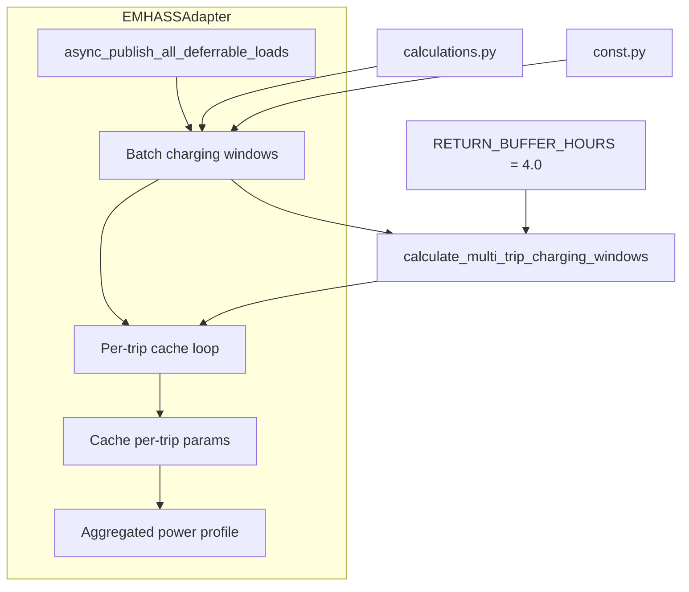
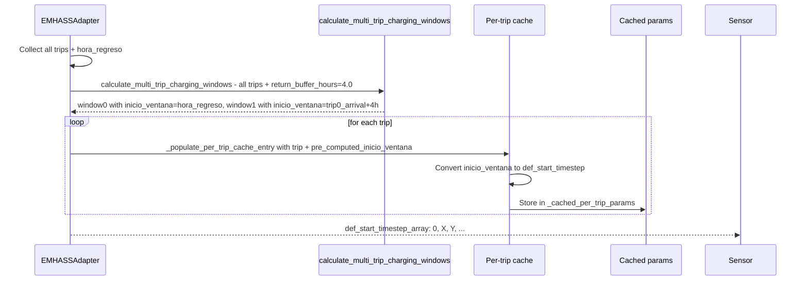

# Design: Fix Sequential Trip Charging

## Overview

Fix the bug where `def_start_timestep_array` shows `[0, 0]` for sequential trips by batching all trips through `calculate_multi_trip_charging_windows()` in a single call. Add a fixed `RETURN_BUFFER_HOURS = 4.0` constant for the gap between trips. No config_flow changes — constant is immutable for MVP.

## Architecture



## Components

### Component 1: EMHASSAdapter.async_publish_all_deferrable_loads

**Purpose**: Batch process all trips before per-trip cache population to enable correct sequential def_start_timestep calculation.

**Responsibilities**:
- Collect all trips before per-trip processing
- Call `calculate_multi_trip_charging_windows()` once with all trips and return_buffer_hours
- Map returned `inicio_ventana` to each trip's `def_start_timestep`
- Maintain backward compatibility for single trips
- Handle edge cases (window_start > deadline)

**Interfaces**:
```python
async def async_publish_all_deferrable_loads(
    self,
    trips: List[Dict[str, Any]],
    charging_power_kw: Optional[float] = None
) -> bool:
    """Publish all trips with sequential charging windows.
    
    Returns:
        True if all trips published successfully, False otherwise.
    """
    pass
```

### Component 2: calculations.calculate_multi_trip_charging_windows

**Purpose**: Calculate charging windows for multiple chained trips with proper sequential offset.

**Current signature**:
```python
def calculate_multi_trip_charging_windows(
    trips: List[Tuple[datetime, Dict[str, Any]]],
    soc_actual: float,
    hora_regreso: Optional[datetime],
    charging_power_kw: float,
    duration_hours: float = 6.0,
) -> List[Dict[str, Any]]:
```

**Changes required**:
- Add NEW parameter `return_buffer_hours: float = 4.0` (alongside existing `duration_hours`)
- Keep `duration_hours` unchanged (it represents trip duration, not buffer)
- Modify line 419: `previous_arrival = trip_arrival + timedelta(hours=return_buffer_hours)`
- Update docstring to clarify the distinction between trip duration and return buffer

**Key distinction**:
- `duration_hours`: How long the car is away on a trip (used for trip_arrival calculation)
- `return_buffer_hours`: Gap between when the car returns and when the next trip's charging starts

### Component 3: const.RETURN_BUFFER_HOURS

**Purpose**: Define fixed return buffer constant.

**Definition**:
```python
RETURN_BUFFER_HOURS = 4.0  # hours between sequential trip charging windows
```

### Component 4: EMHASSAdapter._populate_per_trip_cache_entry

**Purpose**: Accept pre-computed batch results instead of calculating per-trip in isolation.

**Changes required**:
- Add `pre_computed_inicio_ventana: Optional[datetime] = None` parameter
- If pre_computed value provided, use it for def_start_timestep calculation
- If None, fall back to existing single-trip calculation (backward compat)

## Data Flow



1. **Batch collection**: `async_publish_all_deferrable_loads()` collects all trips and gets `hora_regreso`
2. **Multi-trip calculation**: Call `calculate_multi_trip_charging_windows()` ONCE with all trips and `return_buffer_hours=RETURN_BUFFER_HOURS`
3. **Per-trip mapping**: For trip `i`, pass `window[i]["inicio_ventana"]` as `pre_computed_inicio_ventana`
4. **Cache update**: `_populate_per_trip_cache_entry()` converts `inicio_ventana` to timestep offset and stores
5. **Aggregated output**: Sensor reads `def_start_timestep_array` from cache → shows `[0, X, Y, ...]`

## Technical Decisions

| Decision | Options Considered | Choice | Rationale |
|----------|-------------------|--------|-----------|
| Where to batch process | Option A: In async_publish_all_deferrable_loads before loop<br>Option B: Inline calculation in loop | Option A | Uses existing calculate_multi_trip_charging_windows as designed; cleaner separation |
| Parameter approach | Rename duration_hours to return_buffer_hours<br>Add return_buffer_hours as NEW parameter | Add as NEW parameter | duration_hours represents trip duration (semantics must be preserved). Adding new parameter avoids confusion |
| Buffer configurability | Configurable via config_flow<br>Fixed constant | Fixed constant | MVP simplicity. hora_regreso already handles dynamic early returns via presence_monitor |
| Backward compatibility | Always use batch mode<br>Detect single trip and skip | Always call batch | calculate_multi_trip_charging_windows handles single trip correctly (idx=0 case). Simpler, no code path duplication |
| Edge case: window_start > deadline | Cap at deadline<br>Signal error<br>Skip charging window | Cap at deadline | Safest: prevents invalid timesteps. Log warning for debugging |

## File Structure

| File | Action | Purpose |
|------|--------|---------|
| `custom_components/ev_trip_planner/const.py` | Modify | Add `RETURN_BUFFER_HOURS = 4.0` constant |
| `custom_components/ev_trip_planner/calculations.py` | Modify | Add `return_buffer_hours` parameter to `calculate_multi_trip_charging_windows()`, modify `previous_arrival` calculation |
| `custom_components/ev_trip_planner/emhass_adapter.py` | Modify | Add batch computation before per-trip loop, modify `_populate_per_trip_cache_entry()` to accept pre-computed values |

## Error Handling

| Error Scenario | Handling Strategy | User Impact |
|----------------|-------------------|-------------|
| `window_start > deadline` (buffer exceeds time between trips) | Cap `def_start_timestep` at deadline - 1, log warning | Charging scheduled as soon as possible; no crash |
| Empty trips list | Return early with success, no-op | No effect |
| `hora_regreso` is None | Use fallback: `departure - duration_hours` | Same behavior as before |
| Single trip | `calculate_multi_trip_charging_windows()` returns single window with `inicio_ventana` at `hora_regreso` | Backward compatible: `def_start_timestep = 0` |

## Edge Cases

- **Single trip**: Handled correctly by `calculate_multi_trip_charging_windows()` (idx=0 case uses `hora_regreso`). Backward compatible.
- **Two trips with 0 buffer**: Trip 2 starts exactly when Trip 1 arrives (`def_start[1] = def_end[0]`)
- **Large buffer (>7 days)**: Clamped by timestep bounds (max 168 hours)
- **Overlapping trip deadlines**: Capped at deadline, warns user trip may be infeasible
- **Missing `hora_regreso`**: Falls back to `departure - duration_hours`

## Test Strategy

### Test Double Policy

| Type | What it does | When to use |
|---|---|---|
| **Stub** | Returns predefined data, no behavior | Isolate SUT from external I/O when only return value matters |
| **Mock** | Verifies interactions | When interaction itself is the observable outcome |
| **Fixture** | Predefined data state | Any test needing known initial data |

### Mock Boundary

| Component | Unit test | Integration test | Rationale |
|---|---|---|---|
| `calculate_multi_trip_charging_windows` | Real (pure function) | Real (verify edge cases) | Pure function: no dependencies to stub |
| `EMHASSAdapter.async_publish_all_deferrable_loads` | Stub `_get_current_soc`, `_get_hora_regreso` | Real adapter with mock HA | Unit: test batch logic. Integration: test full flow with cached params |
| `EMHASSAdapter._get_current_soc` | Stub | Stub | External I/O: SOC sensor may not exist |
| `EMHASSAdapter._get_hora_regreso` | Stub | Stub | External I/O: presence_monitor may not exist |

### Test Coverage Table

| Component / Function | Test type | What to assert | Test double |
|---|---|---|---|
| `calculate_multi_trip_charging_windows` (2 trips, 4h buffer) | unit | `results[0]["inicio_ventana"] = hora_regreso`, `results[1]["inicio_ventana"] = trip0_arrival + 4h` | none (pure function) |
| `calculate_multi_trip_charging_windows` (single trip) | unit | `len(results) = 1`, starts at `hora_regreso` | none |
| `calculate_multi_trip_charging_windows` (3+ trips) | unit | `inicio_ventana[i] = inicio_ventana[i-1] + trip_duration + buffer` | none |
| `calculate_multi_trip_charging_windows` (window_start > deadline) | unit | Returns window with start = deadline (capped) | none |
| `EMHASSAdapter.async_publish_all_deferrable_loads` (batch 2 trips) | unit | `def_start_timestep_array = [0, X]` where X > 0 | Stub `_get_current_soc`, `_get_hora_regreso` |
| `EMHASSAdapter.async_publish_all_deferrable_loads` (single trip) | unit | `def_start_timestep = 0` (backward compat) | Stub `_get_current_soc`, `_get_hora_regreso` |

### Test File Conventions

- **Test runner**: pytest (Python, v9.0.0)
- **Exact test command**: `python3 -m pytest tests/ -v --tb=short --ignore=tests/ha-manual/ --ignore=tests/e2e/`
- **Python test location**: `tests/test_*.py`
- **Async mode**: `asyncio_mode = "auto"` in pyproject.toml
- **Coverage target**: 100% (`fail_under = 100`)

## Performance Considerations

- **Additional latency**: < 100ms per batch publish (NFR-1)
- **Batch calculation complexity**: O(n) for n trips, previously O(n) per trip → net improvement
- **Single trip overhead**: Negligible (function call + single iteration)
- **Caching**: Leveraging existing `_cached_per_trip_params` (no new cache)

## Existing Patterns to Follow

1. **Emphasis on pure functions**: `calculations.py` contains testable, async-free functions → keep `calculate_multi_trip_charging_windows()` pure
2. **Spanish comments**: Project uses Spanish comments in codebase → preserve or add Spanish comments for new code
3. **Debug logging**: Use `_LOGGER.debug()` with "DEBUG:" prefix for troubleshooting
4. **Error handling**: Release index on error, return `False` on failure → maintain in new code
5. **Single-trip backward compat**: Existing code handles single trips correctly → leverage this in new code

## Implementation Steps

1. **Write failing test** that demonstrates the bug (Phase 0)
2. **Add constant** in `const.py`: `RETURN_BUFFER_HOURS = 4.0`
3. **Add parameter** in `calculations.py`: `return_buffer_hours` parameter to `calculate_multi_trip_charging_windows()`, modify `previous_arrival` calculation
4. **Modify `async_publish_all_deferrable_loads()`** in `emhass_adapter.py`:
   - BEFORE per-trip cache loop: collect deadlines for all trips
   - Call `calculate_multi_trip_charging_windows()` ONCE with all trips and `return_buffer_hours=RETURN_BUFFER_HOURS`
   - Store returned windows in local dict `{trip_id: window}`
   - In per-trip loop: pass `window[i]["inicio_ventana"]` to `_populate_per_trip_cache_entry()`
5. **Modify `_populate_per_trip_cache_entry()`** to accept `pre_computed_inicio_ventana` parameter
6. **Add unit tests** for multi-trip scenarios
7. **Run full test suite** to verify no regressions

---

*Design updated: 2026-04-16*
*Simplified from original: removed configurable buffer, reactive update, config_flow changes*
