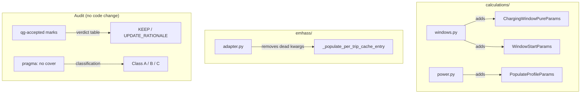

# Design: High-Arity Refactoring

## Overview

Closes arity tech-debt (Epic AC-4.6, plus 3 un-wrapped functions) and audits all `# pragma: no cover` marks in `custom_components/ev_trip_planner/`. The work is investigative: prove each suppression is right or wrong before touching code. Three functions get dataclass wrappers; `_populate_per_trip_cache_entry` loses two truly dead kwargs (not six — three kwargs were wrongly described as dead in the requirements but are actively used in the method body); all pragma marks are classified and justified or remediated.

---

## Architecture



---

## Section 2: Audit Decision Framework

### 2a. `qg-accepted` Arity Audit Criteria

**Valid suppression** — one of:
1. **Framework constraint**: the function is a callback/hook whose signature is imposed by an external system (HA event bus, config flow, platform setup). A param object would break the caller contract.
2. **Algorithm invariant with proof**: the parameters are orthogonal inputs to a closed-form algorithm; no natural grouping exists (i.e., grouping 3 of N into a sub-object would create a semantically meaningless struct that obscures intent more than it helps).
3. **Public API / canonical domain function**: the function is the named entry point for a domain operation; its full parameter set IS the domain model for that call. Wrapping would produce a single-use throwaway struct.

**Invalid suppression** — symptom descriptions that do not explain why wrapping is *impossible*:
- "needs all params"
- "domain inputs only"
- "helper needs all params"
- "chain algorithm needs all context"
- "all params required" without naming the constraint

**Verdict options**:
- **KEEP**: valid rationale — update wording only if ambiguous
- **WRAP**: invalid rationale — design a param dataclass, remove the `qg-accepted` comment
- **UPDATE_RATIONALE**: valid but wording is ambiguous — rewrite the inline comment to be specific
- **OUT_OF_SCOPE**: BMAD consensus function (requirements explicitly exclude from re-evaluation)

#### `qg-accepted` Verdict Table

| File | Line | Function | Arity | Current Comment | Verdict | Reasoning |
|------|------|----------|-------|-----------------|---------|-----------|
| `calculations/windows.py` | 27 | `calculate_energy_needed` | 6 | "canonical energy API — all params are domain inputs" | **KEEP** | Public entry point for a named domain operation (energy calculation). All 6 params are orthogonal domain inputs with no natural grouping. Wrapping would produce a single-use struct that adds no readability. |
| `calculations/windows.py` | 111 | `calculate_charging_window_pure` | 6 | "charging window API — domain inputs only" | **WRAP** (US-2) | "Domain inputs only" is a symptom, not a constraint. A `ChargingWindowPureParams` is architecturally correct — same pattern as `VentanaCargaParams`. Already decided. |
| `calculations/windows.py` | 333 | `_compute_window_start` | 7 | "chain algorithm needs all context for window start" | **WRAP** (US-2) | "Needs all context" describes the symptom. This is a private helper called from one site; wrapping does not break any contract. Already decided. |
| `calculations/core.py` | 206 | `calculate_trip_time` | 6 | "canonical trip time API — all domain inputs" | **KEEP** | Same class as `calculate_energy_needed`. Public, named domain operation. All params are orthogonal domain inputs. No grouping makes semantic sense. |
| `calculations/deficit.py` | 142 | `_propagate_deficits` | 10 | "BMAD consensus 2026-05-17 — arity=10 is inherent to deficit propagation" | **OUT_OF_SCOPE** | BMAD consensus with named date. Excluded by requirements. |
| `calculations/deficit.py` | 148 | (repeat marker on same fn) | — | duplicate line same function | **OUT_OF_SCOPE** | Same function. |
| `calculations/deficit.py` | 197 | `_build_milestone` | 8 | "BMAD consensus 2026-05-17 — arity=8 is inherent to milestone building" | **OUT_OF_SCOPE** | BMAD consensus. Excluded. |
| `calculations/deficit.py` | 253 | `calculate_deficit_propagation` | 9 | "BMAD consensus 2026-05-17 — arity=9 is the public API for deficit" | **OUT_OF_SCOPE** | BMAD consensus. Excluded. |
| `calculations/power.py` | 90 | `calculate_power_profile_from_trips` | 8 | "public API for power profile calculation" | **KEEP** | Public API with 8 orthogonal params. Several are optional with defaults. No natural grouping that doesn't obscure meaning. |
| `calculations/power.py` | 162 | `calculate_power_profile` | 8 | "domain function signature for power profile calc" | **KEEP** | Public API, same reasoning. |
| `calculations/power.py` | 296 | `_populate_profile` | 6 | "helper needs all params for profile population" | **WRAP** (US-2) | "Helper needs all params" is the canonical weak rationale. Private function, single call site. Already decided. |
| `calculations/power.py` | 320 | `_try_populate_window` | 11 | "arity=11 is inherent to window population with full trip context" | **KEEP** | This comment is substantive — it names the reason (full trip context required for single-trip energy + window calculation). BMAD consensus 2026-05-17. |
| `config_flow/main.py` | 263 | `_validate_field` | 6 | "arity=6 is the numeric field validation API" | **KEEP + UPDATE** | Effective arity is 5 (self excluded), which is at the threshold (not above). The layer3a tool counts including self for methods? Verify at impl time. If effective=5, remove the `qg-accepted` entirely (it's not needed — the gate only fires at >5). If the tool counts self and fires at 6, KEEP. Either way, comment must be updated to say "effective arity = 5 (self excluded)". |
| `emhass/adapter.py` | 714 | `_populate_per_trip_cache_entry` | 7 | "arity=7, complexity=21 — cache entry building with backward compat params" | **UPDATE** (US-3) | After removing 2 dead kwargs (`hora_regreso`, `adjusted_def_total_hours`), effective arity drops to 5 (self + params + pre_computed × 3). The `qg-accepted` comment must be removed or rewritten. If layer3a counts the 5 remaining, no suppression needed at all. |
| `trip/_sensor_callbacks.py` | 51,65,79,91,103 | 5x framework callbacks | 6 | "event callback signature — all params required by framework" | **OUT_OF_SCOPE** | Framework dispatch. BMAD consensus. Excluded. |

**Summary of arity audit work**:
- 3 WRAP: already covered by US-2 (design in §3)
- 1 UPDATE + potential REMOVE: `_populate_per_trip_cache_entry` qg-comment (covered by US-3)
- 1 KEEP + UPDATE: `_validate_field` — verify effective arity at implementation; remove qg-accepted if tool doesn't fire on it
- All others: KEEP or OUT_OF_SCOPE — no code changes

---

### 2b. `pragma: no cover` Audit Criteria

**Class A (KEEP — genuinely not testable in this test infrastructure)**:
- `TYPE_CHECKING` blocks (import-time only, never executed at runtime)
- HA lifecycle integration points: code inside `async_setup_entry`, `async_unload_entry`, timer registration, platform forwarding, service registration — these require a real HA instance that configures via config entries. The E2E suite does not run against this code path in unit tests.
- HA entity lifecycle: `async_will_remove_from_hass`, entity registry interactions
- HA entity platform: `async_add_entities` callback patterns, real sensor instantiation
- HA version compatibility fallbacks: `ImportError` for HA-version-specific imports
- Filesystem operations requiring HA `hass.config.config_dir` (real HA path)
- Action: confirm justification comment is present and specific (not bare `# pragma: no cover`)

**Class B (REMOVE + TEST — code that can be tested, just wasn't)**:
- Business logic reachable without HA runtime (pure functions, data transforms)
- Exception handlers reachable by injecting a failing mock
- Code paths already exercised by the test infrastructure setup

**Class C (NEEDS JUSTIFICATION — no inline reason)**:
- Bare `# pragma: no cover` without `reason=` or equivalent inline explanation
- Action: add specific justification OR write test and remove pragma

---

#### `pragma: no cover` Classification Table

**File: `custom_components/ev_trip_planner/__init__.py`** — 18 pragmas

All 18 marks are on HA integration lifecycle code (`async_setup_entry`, `async_unload_entry`, timer callbacks, service registration, platform forwarding). Every mark has an inline `reason=HA lifecycle — ...` justification. These are Class A.

| Lines | Code covered | Justification | Class |
|-------|-------------|---------------|-------|
| 170 | UID migration edge case branch | "reason=unique ID migration edge case" | A |
| 224–300 (14 marks) | `async_setup_entry` body — emhass adapter init, SOC listener, timer registration, panel registration, platform forwarding, success return | "reason=HA lifecycle — ..." on each | A |
| 312–316 (3 marks) | `async_unload_entry` — timer cancel, debug log | "reason=HA lifecycle — ..." | A |

**Action**: No changes. All marks have specific inline justification.

---

**File: `custom_components/ev_trip_planner/sensor/_async_setup.py`** — 17 pragmas

| Lines | Code covered | Justification | Class |
|-------|-------------|---------------|-------|
| 110–112 | `TypeError` catch from sync callback + `pass` | "sync callback returns None in HA entity platform, causes TypeError when awaited" | A |
| 152–161 | Recurring sensor creation loop + error handler | "requires HA entity platform async_add_entities" | A |
| 176–177 | Punctual sensor creation error handler | "requires HA entity platform" | A |
| 256–263 | EMHASS sensor creation TypeError + error catch + return False | "HA entity platform" | A |
| 488–495 | EMHASS sensor TypeError + outer Exception + return False | "HA entity platform" | A |

**Action**: No changes. All marks have inline justification.

---

**File: `custom_components/ev_trip_planner/trip/_crud.py`** — 1 pragma

| Line | Code covered | Justification present | Class |
|------|-------------|-----------------------|-------|
| 53 | `_emit_post_add` — emits HA sensor events via `emit(SensorEvent(..., hass, ...))` | **None** — bare `# pragma: no cover` | **C** |

**Decision**: `_emit_post_add` calls `emit(SensorEvent(event_name, self._state.hass, ...))`. The `emit` function fires HA event bus events. The function cannot be tested without a real HA `hass` instance (or a very elaborate mock of the event bus). This is legitimately Class A (HA event bus integration), but the mark lacks justification.

**Action**: Add inline justification: `# pragma: no cover reason=HA event bus integration — emit() dispatches via hass.bus which requires a real HA instance`

---

**File: `custom_components/ev_trip_planner/trip/_persistence.py`** — 7 pragmas

| Lines | Code covered | Justification | Class |
|-------|-------------|---------------|-------|
| 130 | `asyncio.CancelledError` in storage load | "reason=hass-taste-test-timing" | A |
| 147 | `_load_trips_yaml` method (entire function) | "reason=ha-filesystem-only" | A |
| 168 | `_load_trips_yaml` exception handler | "reason=ha-filesystem-only" | A |
| 175 | `_save_trips_yaml` try block | "reason=ha-filesystem-only" | A |
| 190 | `_save_trips_yaml` exception handler | "reason=ha-filesystem-only" | A |
| 81 | YAML try block | "reason=ha-filesystem-only" | A |
| 83 | YAML exception handler | "reason=ha-filesystem-only" | A |

**Action**: No changes. All marks have inline justification.

---

**File: `custom_components/ev_trip_planner/trip/_trip_lifecycle.py`** — 2 pragmas

| Lines | Code covered | Justification | Class |
|-------|-------------|---------------|-------|
| 129 | `async_update_trip_sensor` (whole method) | "reason=ha-entity-registry" | A |
| 179 | Exception handler in `async_update_trip_sensor` | "reason=ha-entity-registry" | A |

**Action**: No changes.

---

**File: `custom_components/ev_trip_planner/services/_utils.py`** — 1 pragma

| Line | Code covered | Justification | Class |
|------|-------------|---------------|-------|
| 107 | Exception in `_get_manager` after `async_setup()` | "reason=requires async_setup failure which needs HA runtime" | A |

**Action**: No changes.

---

**File: `custom_components/ev_trip_planner/services/dashboard_helpers.py`** — 2 pragmas

| Line | Code covered | Justification | Class |
|------|-------------|---------------|-------|
| 58 | `ImportError` for `StaticPathConfig` | "reason=HA version dependency — static_path_config only available in newer HA versions" | A |
| 115 | `TypeError`/`AttributeError`/`RuntimeError` fallback for `async_register_static_paths` | "reason=HA version compatibility fallback" | A |

**Action**: No changes.

---

**File: `custom_components/ev_trip_planner/sensor/entity_emhass_deferrable.py`** — 1 pragma

| Line | Code covered | Justification | Class |
|------|-------------|---------------|-------|
| 206 | `async_will_remove_from_hass` | "reason=HA entity lifecycle — ... requires HA runtime" | A |

**Action**: No changes.

---

**File: `custom_components/ev_trip_planner/vehicle/external.py`** — 2 pragmas

| Lines | Code covered | Justification | Class |
|-------|-------------|---------------|-------|
| 47 | Exception in script execution | "reason=script execution failure requires HA runtime" | A |
| 51 | `return False` in exception handler | "reason=paired with above exception handler" | A |

**Action**: No changes.

---

**Pragma audit summary**:

| Class | Count | Files | Action |
|-------|-------|-------|--------|
| A (KEEP, justified) | 49 | all files | No change |
| B (REMOVE + TEST) | 0 | — | None |
| C (ADD JUSTIFICATION) | 1 | `trip/_crud.py:53` | Add inline reason |

**Total pragmas found**: 50 across 9 files. **Zero Class B**. The pragma coverage is clean — these are real HA lifecycle integration points, not coverage shortcuts.

---

## Section 3: Dataclass Designs (3 confirmed wraps)

### 3.1 `ChargingWindowPureParams` — `calculations/windows.py`

**Current signature** (line 103):
```python
def calculate_charging_window_pure(
    trip_departure_time: Optional[datetime],
    soc_actual: float,
    hora_regreso: Optional[datetime],
    charging_power_kw: float,
    energia_kwh: float,
    duration_hours: float = 6.0,
) -> Dict[str, Any]:
    # qg-accepted: arity=6 is the charging window API — domain inputs only
```

**New dataclass** (insert before the function, in `calculations/windows.py`):
```python
@dataclass(frozen=True, kw_only=True)
class ChargingWindowPureParams:
    trip_departure_time: Optional[datetime]
    soc_actual: float
    hora_regreso: Optional[datetime]
    charging_power_kw: float
    energia_kwh: float
    duration_hours: float = 6.0
```

**New function signature**:
```python
def calculate_charging_window_pure(params: ChargingWindowPureParams) -> Dict[str, Any]:
```

**Internal callers to update**:
- `calculations/power.py:334` — `_try_populate_window` calls `calculate_charging_window_pure(trip_departure_time=..., soc_actual=..., hora_regreso=..., charging_power_kw=..., energia_kwh=..., duration_hours=6.0)` → wrap in `ChargingWindowPureParams(...)`

**Test callers to update** (`tests/unit/test_calculations.py`):
- Lines 608, 628, 646, 663, 681, 698 — 6 call sites, all positional/keyword → update to `ChargingWindowPureParams(...)` constructor
- Lines 2886, 2949 — mock patches target string `"...calculations.power.calculate_charging_window_pure"` — mock target stays the same, but mock return_value shapes don't change

---

### 3.2 `WindowStartParams` — `calculations/windows.py`

**Current signature** (line 324):
```python
def _compute_window_start(
    idx: int,
    trip_departure_time: datetime,
    hora_regreso: datetime | None,
    return_buffer_hours: float,
    loop_now: datetime | None,
    prev_departure: datetime | None,
    now: datetime | None,
) -> datetime:
    # qg-accepted: arity=7 — chain algorithm needs all context for window start
```

**New dataclass** (insert before the function, in `calculations/windows.py`):
```python
@dataclass(frozen=True, kw_only=True)
class WindowStartParams:
    idx: int
    trip_departure_time: datetime
    hora_regreso: datetime | None
    return_buffer_hours: float
    loop_now: datetime | None
    prev_departure: datetime | None
    now: datetime | None
```

**New function signature**:
```python
def _compute_window_start(params: WindowStartParams) -> datetime:
```

**Internal callers to update**:
- `calculations/windows.py:275` — `calculate_multi_trip_charging_windows` inner loop: `_compute_window_start(idx, trip_departure_time, hora_regreso, return_buffer_hours, loop_now, previous_departure, now)` → wrap in `WindowStartParams(...)`
- Note: the `loop_now` variable is mutated in the loop body after the first call (line 350 in current code). The internal function body reads `params.loop_now` — the mutation logic stays in `calculate_multi_trip_charging_windows` (caller side), not in the function body.

**Test callers to update**:
- `tests/unit/test_coverage_guards.py:106` — tests `_compute_window_start` returning None (actually that test description says "returns None" but the function returns `datetime`). Verify the test actually calls `_compute_window_start` directly and update the call site.

---

### 3.3 `PopulateProfileParams` — `calculations/power.py`

**Current signature** (line 288):
```python
def _populate_profile(
    power_profile: List[float],
    hora_inicio: int,
    horas_necesarias: int,
    horas_hasta_fin: int,
    profile_length: int,
    charging_power_watts: float,
) -> None:
    # qg-accepted: arity=6 — helper needs all params for profile population
```

**New dataclass** (insert before the function, in `calculations/power.py`):
```python
@dataclass(frozen=True, kw_only=True)
class PopulateProfileParams:
    power_profile: List[float]
    hora_inicio: int
    horas_necesarias: int
    horas_hasta_fin: int
    profile_length: int
    charging_power_watts: float
```

**New function signature**:
```python
def _populate_profile(params: PopulateProfileParams) -> None:
```

**Note on `power_profile` mutability**: `power_profile` is a `List[float]` that is mutated in-place. `frozen=True` prevents reassigning the field, not mutating the list. This is correct and consistent with the existing pattern (frozen dataclass does not prevent in-place mutation of mutable field contents). No `field(default_factory=list)` needed — the caller always passes an existing list.

**Internal callers to update**:
- `calculations/power.py:351` — `_try_populate_window` calls `_populate_profile(power_profile, hora_inicio, horas_necesarias, horas_hasta_fin, profile_length, charging_power_watts)` → wrap in `PopulateProfileParams(...)`

**Test callers to update**:
- `tests/unit/test_calculations.py` — search for direct `_populate_profile(...)` calls (if any). Given `_populate_profile` is private, tests likely exercise it via `_try_populate_window` or `calculate_power_profile`. Confirm at implementation time with `grep -n "_populate_profile(" tests/`.

---

## Section 4: `_populate_per_trip_cache_entry` Cleanup Design

### Critical Finding: Requirements Description Is Partially Wrong

The requirements state "6 dead kwargs". The actual state after reading the source is:

| Kwarg | Is it used in the method body? | Verdict |
|-------|-------------------------------|---------|
| `hora_regreso` | **No** — docstring says "Unused — kept for test compatibility." No usage in body. | REMOVE |
| `pre_computed_inicio_ventana` | **Yes** — used at line 790–796 for `def_start_timestep` calculation | KEEP |
| `pre_computed_fin_ventana` | **Yes** — used at line 805–812 for `def_end_timestep` calculation | KEEP |
| `pre_computed_charging_window` | **Yes** — used at line 776–778 as batch-mode input | KEEP |
| `adjusted_def_total_hours` | **No** — docstring says "Unused — kept for test compatibility." No usage in body. | REMOVE |
| `soc_cap` | **No** — the parameter is never read. The body creates its own local `soc_cap` via `calculate_dynamic_soc_limit()` at line 864. | REMOVE |

**Current true signature** (declared):
```python
async def _populate_per_trip_cache_entry(
    self,
    params: PerTripCacheParams,
    hora_regreso: Optional[datetime] = None,                          # DEAD
    pre_computed_inicio_ventana: Optional[datetime] = None,           # ACTIVE
    pre_computed_fin_ventana: Optional[datetime] = None,              # ACTIVE
    pre_computed_charging_window: Optional[List[Dict[str, Any]]] = None,  # ACTIVE
    adjusted_def_total_hours: Optional[float] = None,                 # DEAD
    soc_cap: Optional[float] = None,                                  # DEAD
) -> None:
```

**Target signature** (after cleanup):
```python
async def _populate_per_trip_cache_entry(
    self,
    params: PerTripCacheParams,
    pre_computed_inicio_ventana: Optional[datetime] = None,
    pre_computed_fin_ventana: Optional[datetime] = None,
    pre_computed_charging_window: Optional[List[Dict[str, Any]]] = None,
) -> None:
```

**Effective arity**: self + params + 3 pre_computed = 5 params (excluding self = 4 effective). No `qg-accepted` comment needed after cleanup. Remove it entirely.

**Test callers that pass the dead kwargs**:
- Grep result confirms NO test files pass `hora_regreso=` or `adjusted_def_total_hours=` directly to `_populate_per_trip_cache_entry`. The `hora_regreso=` calls found in the test grep are to `calculate_multi_trip_charging_windows`, not to this method.
- Tests that DO pass `pre_computed_*` kwargs (`test_emhass_adapter_edge_cases.py:311`, `:340`) remain valid — those kwargs are KEPT.
- **Action**: remove `hora_regreso`, `adjusted_def_total_hours`, `soc_cap` from the signature. No test callers need updating for those specific kwargs.

**`qg-accepted` comment**: Remove `# qg-accepted: arity=7, complexity=21 — cache entry building with backward compat params`. After cleanup, the arity is 4 effective — no gate fires.

---

## Section 5: File Change Map

| File | Change type | What changes |
|------|-------------|-------------|
| `calculations/windows.py` | Modify | Add `ChargingWindowPureParams` dataclass; change `calculate_charging_window_pure` signature to `(params)` |
| `calculations/windows.py` | Modify | Add `WindowStartParams` dataclass; change `_compute_window_start` signature to `(params)` |
| `calculations/windows.py` | Modify | Update `calculate_multi_trip_charging_windows` inner call to `_compute_window_start` — wrap args in `WindowStartParams` |
| `calculations/power.py` | Modify | Add `PopulateProfileParams` dataclass; change `_populate_profile` signature to `(params)` |
| `calculations/power.py` | Modify | Update `_try_populate_window` call to `_populate_profile` — wrap args in `PopulateProfileParams` |
| `calculations/power.py` | Modify | Update `_try_populate_window` call to `calculate_charging_window_pure` — wrap args in `ChargingWindowPureParams` |
| `emhass/adapter.py` | Modify | Remove `hora_regreso`, `adjusted_def_total_hours`, `soc_cap` kwargs from `_populate_per_trip_cache_entry`; remove `qg-accepted` comment |
| `trip/_crud.py` | Modify | Add inline reason to `# pragma: no cover` at line 53 |
| `config_flow/main.py` | Modify (minor) | Verify `_validate_field` effective arity; remove `qg-accepted` comment if layer3a does not fire on effective arity=5 |
| `tests/unit/test_calculations.py` | Modify | Update 6 `calculate_charging_window_pure(...)` direct call sites to use `ChargingWindowPureParams(...)` |
| `tests/unit/test_coverage_guards.py` | Modify | Update `_compute_window_start` call site(s) to use `WindowStartParams(...)` |
| `tests/unit/test_calculations_imports.py` | Modify (if needed) | Verify imports of affected functions still resolve |

**Files with no changes needed**:
- All `# pragma: no cover` files except `trip/_crud.py` — Class A marks with inline justification
- `test_emhass_adapter_edge_cases.py:311,:340` — pre_computed kwargs are KEPT, call sites are valid

---

## Section 6: Test Strategy

> Core rule: if it lives in this repo and is not an I/O boundary, test it real.

### Test Double Policy

| Type | When to use |
|------|-------------|
| **Stub** | Isolate from external I/O — only care about SUT return value |
| **Fake** | Real behavior without real infrastructure |
| **Mock** | Only when the interaction itself is the observable outcome |
| **Fixture** | Known data state for tests |

For this spec, the wraps are pure structural changes — existing tests exercise the logic through the same code paths. No new logic is added. The test work is **call-site update only** for the 3 wraps.

### Mock Boundary

| Component | Unit test | Integration test | Rationale |
|-----------|-----------|-----------------|-----------|
| `calculate_charging_window_pure` | Real | Real | Pure function, no I/O |
| `ChargingWindowPureParams` | Real | Real | stdlib dataclass |
| `_compute_window_start` | Real | Real | Pure function, no I/O |
| `WindowStartParams` | Real | Real | stdlib dataclass |
| `_populate_profile` | Real | Real | In-place list mutation, no I/O |
| `PopulateProfileParams` | Real | Real | stdlib dataclass |
| `_populate_per_trip_cache_entry` | Stub `_get_hora_regreso` (AsyncMock) | Stub `_get_hora_regreso` | HA dependency in method; existing test pattern |
| `_emit_post_add` in `_crud.py` | N/A (pragma remains Class A) | N/A | HA event bus — not testable in unit |

### Fixtures & Test Data

| Component | Required state | Form |
|-----------|---------------|------|
| `calculate_charging_window_pure` tests | `trip_departure_time`, `hora_regreso` datetime pairs (aware UTC), `soc_actual` float, `charging_power_kw`, `energia_kwh` | Inline constants in existing test class |
| `_compute_window_start` tests | `idx` (0 and >0), `trip_departure_time`, optional `hora_regreso`, `return_buffer_hours`, `loop_now`, `prev_departure` | Inline constants in existing test |
| `_populate_profile` tests | `power_profile = [0.0]*168`, integer hora_inicio/fin/length, float watts | Inline |

### Test Coverage Table

| Component / Function | Test type | What to assert | Test double |
|---------------------|-----------|----------------|-------------|
| `calculate_charging_window_pure` (via updated call sites) | unit | Same return dict as before (ventana_horas, es_suficiente, inicio_ventana, fin_ventana) — behavior unchanged | none |
| `_compute_window_start` (via updated call sites) | unit | Returns correct datetime for idx=0 (now path) and idx>0 (buffer path) | none |
| `_populate_profile` (via updated call sites) | unit | Profile list has power_watts set at expected indices after call | none |
| `_populate_per_trip_cache_entry` (after dead kwarg removal) | unit | Calling with `params + pre_computed_*` kwargs still stores entry in `_cached_per_trip_params` | Stub `_get_hora_regreso` (AsyncMock) |
| `trip/_crud._emit_post_add` pragma justification | N/A | No test — Class A pragma with added justification | N/A |
| `config_flow/main._validate_field` qg-comment | N/A | Verify layer3a does not report violation after comment removal | N/A |

**Cross-table consistency check**:
- Every Mock Boundary row has a matching Coverage Table row. ✓
- No new test logic needed — only call-site updates to existing tests.

### Test File Conventions

- **Test runner**: pytest via `make test` (`.venv/bin/python -m pytest`)
- **Test file location**: `tests/unit/*.py` (co-located by feature, not by module)
- **Integration pattern**: no separate integration test config — integration tests in `tests/unit/` with AsyncMock stubs
- **Mock cleanup**: `@pytest.fixture` with explicit `MagicMock()` / `AsyncMock()` per test — no `afterEach` pattern; uses pytest fixture scoping
- **Fixture/factory location**: inline in test classes; shared fixtures in `tests/unit/conftest.py`
- **Run command**: `make test` — runs pytest with coverage, fails at <100%

---

## Section 7: Verification Contract

| Check | Expected result |
|-------|----------------|
| `make quality-gate` | **All 6 layers pass**: L3A (SOLID AST) → L1 (tests+E2E) → L2 (mutation) → L3B (BMAD consensus) → L4 (security). Exit 0. |
| `make layer3a` | Zero unaccepted arity violations. `_compute_window_start`, `calculate_charging_window_pure`, `_populate_profile` no longer appear. `_populate_per_trip_cache_entry` no longer appears (arity drops to 4 effective). `_validate_field` no longer appears (effective arity = 5). |
| `make test` | Same test count. 100% coverage unchanged. |
| `make typecheck` | Zero pyright errors. Dataclass fields match function body usage. |
| `make lint` | Zero ruff violations. No RUF009 (no mutable defaults). No B006. |
| `grep "# qg-accepted" calculations/` | All remaining marks have specific, named rationale. No "needs all params", "domain inputs only", "helper needs all params", "needs all context". |
| `grep "# pragma: no cover" trip/_crud.py` | Mark has `reason=` suffix. |
| `_populate_per_trip_cache_entry` signature | `(self, params: PerTripCacheParams, pre_computed_inicio_ventana=None, pre_computed_fin_ventana=None, pre_computed_charging_window=None)` |

---

## Performance Considerations

- No runtime behavior change. Pure structural refactor.
- Dataclass instantiation adds ~100ns per call site — negligible given these are called at most once per trip per sensor update cycle.

## Security Considerations

- No security surface changes. No external inputs, no auth.

## Existing Patterns to Follow

- `@dataclass(frozen=True, kw_only=True)` — mandatory (FR-1). See `VentanaCargaParams`, `PerTripCacheParams`.
- Dataclass defined in same file as function (FR-2). Never in a central `models.py`.
- No `__post_init__` validation — none of the existing param objects use it.
- No `field(default_factory=list)` needed unless a field has a mutable default — only `duration_hours: float = 6.0` uses a default, which is fine.

---

## Unresolved Questions

1. **`_validate_field` qg-accepted removal**: Does `make layer3a` / `solid_metrics.py` count `self` when computing arity for methods? If yes, 6 params including self = 5 effective — layer3a should NOT fire (threshold is >5). If the tool fires anyway, the `qg-accepted` is technically needed. **Action at implementation**: run `make layer3a` before and after removing the comment; if no new violations appear, the removal was correct.

2. **`_compute_window_start` `loop_now` mutation**: The caller `calculate_multi_trip_charging_windows` caches `loop_now` after the first call by reading it back from the function's side effect (the body sets `loop_now = now or datetime.now()` and returns). After wrapping with `WindowStartParams`, the caller cannot read `loop_now` back from the frozen params object. **Resolution**: the function must return both the window start AND the computed `loop_now`, OR the caller tracks `loop_now` separately. Preferred: keep `loop_now` tracking in the caller (the loop already has `loop_now` as a variable — pass it in via `WindowStartParams`, read the return value for the datetime only). The `loop_now` caching must be refactored slightly in the caller.

---

## Implementation Steps

1. Read `calculations/windows.py` — note exact positions of `# qg-accepted` comments to remove
2. Add `ChargingWindowPureParams` dataclass to `calculations/windows.py` (before function); update `calculate_charging_window_pure` signature; update `_try_populate_window` call site in `power.py`
3. Add `WindowStartParams` dataclass to `calculations/windows.py`; update `_compute_window_start` signature; refactor `loop_now` tracking in `calculate_multi_trip_charging_windows` (see Unresolved Q2)
4. Add `PopulateProfileParams` dataclass to `calculations/power.py`; update `_populate_profile` signature; update `_try_populate_window` call site
5. Update `emhass/adapter.py` — remove `hora_regreso`, `adjusted_def_total_hours`, `soc_cap` kwargs; remove `qg-accepted` comment
6. Update `trip/_crud.py:53` — add `reason=HA event bus integration — emit() dispatches via hass.bus which requires a real HA instance` to the pragma
7. Verify `config_flow/main.py:_validate_field` — run `make layer3a` before removing `qg-accepted`; remove if no violation reported
8. Update all test call sites: `test_calculations.py` (6 sites for `calculate_charging_window_pure`), `test_coverage_guards.py` (1 site for `_compute_window_start`)
9. Run `make test` — confirm 1417 passing, 100% coverage
10. Run `make layer3a` — confirm zero unaccepted violations
11. Run `make typecheck` — confirm zero pyright errors
12. Run `make lint` — confirm zero ruff violations
