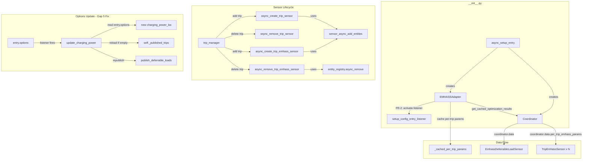
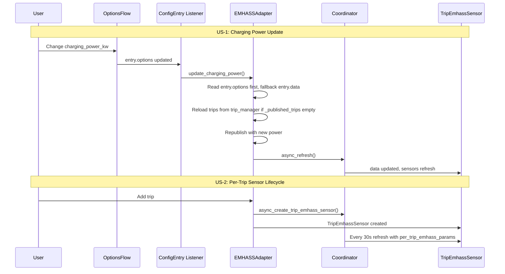
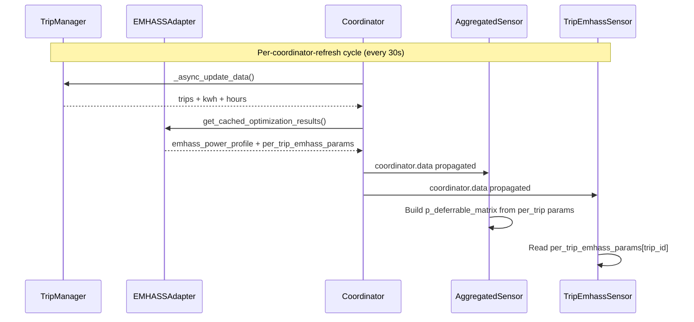

# Design: m401-emhass-hotfixes

## Overview

Fix 3 root causes for charging power updates being silently ignored (Gap #5) and add per-trip EMHASS sensors with dynamic lifecycle plus auto-config `p_deferrable_matrix` attribute (Gap #8). Per-trip sensors read EMHASS params from `coordinator.data["per_trip_emhass_params"]`, created alongside `TripSensor` via existing `sensor_async_add_entities` callback, removed on hard delete. Aggregated sensor gains 6 new array/matrix attributes for one-template EMHASS auto-config.

## Architecture





## Components

### 1. EMHASSAdapter (modify)

**Purpose**: Fix 3 root causes for charging power updates + cache per-trip EMHASS params.

**Changes**:

1. **`update_charging_power()`** (line 1359): Read `entry.options` first, fallback `entry.data`
2. **`setup_config_entry_listener()`** (line 1311): Activated in `__init__.py:async_setup_entry`
3. **`_handle_config_entry_update()`** (line 1334): Reload trips from `trip_manager` when `_published_trips` is empty
4. **`publish_deferrable_loads()`** (line ~540): Cache per-trip params in `_cached_per_trip_params`
5. **`get_cached_optimization_results()`** (line 161): Include `per_trip_emhass_params` in returned dict
6. **`async_publish_deferrable_load()`** (line 276): Fix `def_start_timestep: 0` hardcoded → compute from charging windows
7. **New helpers**: `_get_current_soc()`, `_get_hora_regreso()` — encapsulate HA state reads

**Interfaces**:
```python
# New instance variable
_cached_per_trip_params: Dict[str, dict]  # trip_id -> {def_total_hours, P_deferrable_nom, ...}

# Updated return for get_cached_optimization_results
def get_cached_optimization_results(self) -> Dict[str, Any]:
    return {
        "emhass_power_profile": ...,
        "emhass_deferrables_schedule": ...,
        "emhass_status": ...,
        "per_trip_emhass_params": self._cached_per_trip_params,  # NEW
    }
```

### 2. TripEmhassSensor (new class in sensor.py)

**Purpose**: Per-trip EMHASS sensor exposing all 9 deferrable load parameters.

**Responsibilities**:
- Read EMHASS params from `coordinator.data["per_trip_emhass_params"][trip_id]`
- `native_value` = `emhass_index` (int), -1 if unassigned
- 9 extra_state_attributes
- Visible entity (not DIAGNOSTIC)
- Zeroed values when trip `activo=false`

**Interfaces**:
```python
class TripEmhassSensor(CoordinatorEntity[TripPlannerCoordinator], SensorEntity):
    def __init__(self, coordinator: TripPlannerCoordinator, vehicle_id: str, trip_id: str) -> None:
        self._attr_unique_id = f"emhass_trip_{vehicle_id}_{trip_id}"
        self._vehicle_id = vehicle_id
        self._trip_id = trip_id

    @property
    def native_value(self) -> int:
        """Return emhass_index from coordinator data."""

    @property
    def extra_state_attributes(self) -> Dict[str, Any]:
        """Return 9 EMHASS attributes per trip."""

    @property
    def device_info(self) -> Dict[str, Any]:
        """Return device_info with identifiers={(DOMAIN, vehicle_id)}."""

    def _get_params(self) -> Optional[Dict[str, Any]]:
        """Get per-trip params from coordinator.data."""

    def _zeroed_attributes(self) -> Dict[str, Any]:
        """Return zeroed attributes for inactive/unavailable trips."""
```

### 3. EmhassDeferrableLoadSensor (modify)

**Purpose**: Add 6 new aggregated array/matrix attributes for EMHASS auto-config.

**Changes**: `extra_state_attributes` gains:
- `p_deferrable_matrix`: `list[list[float]]` (rows = active trips, 168 cols)
- `number_of_deferrable_loads`: `int`
- `def_total_hours_array`: `list[float]`
- `p_deferrable_nom_array`: `list[int]`
- `def_start_timestep_array`: `list[int]`
- `def_end_timestep_array`: `list[int]`

New helper `_get_active_trips_ordered(per_trip)` returns active trip params sorted by `emhass_index` ascending.

### 4. TripPlannerCoordinator (no structural change)

**Purpose**: Pass per-trip EMHASS params through `coordinator.data`.

`_async_update_data()` already calls `get_cached_optimization_results()` and spreads `**emhass_data`. When adapter includes `per_trip_emhass_params` in its cache, coordinator.data automatically contains it. No code change needed.

### 5. Sensor CRUD Functions (new in sensor.py)

**Purpose**: `async_create_trip_emhass_sensor` and `async_remove_trip_emhass_sensor`.

**Pattern**: Mirrors existing `async_create_trip_sensor` / `async_remove_trip_sensor`.

```python
async def async_create_trip_emhass_sensor(
    hass: HomeAssistant, entry_id: str, trip_data: Dict[str, Any]
) -> bool:
    """Create TripEmhassSensor via sensor_async_add_entities callback."""

async def async_remove_trip_emhass_sensor(
    hass: HomeAssistant, entry_id: str, trip_id: str
) -> bool:
    """Remove TripEmhassSensor from entity registry."""
```

### 6. TripManager (modify)

**Purpose**: Call EMHASS sensor CRUD alongside existing TripSensor CRUD.

**Changes at 3 call sites**:
1. `async_add_recurring_trip()` (line ~481): After sensor creation, call `async_create_trip_emhass_sensor`
2. `async_add_punctual_trip()` (line ~524): Same pattern
3. Trip hard delete (line ~604): After sensor removal, call `async_remove_trip_emhass_sensor`

**Legacy coupling refactor (IN SCOPE)**:

Current state: trip_manager has TWO versions of sensor CRUD:
- **Internal methods** (trip_manager.py:1891-1993): `self.async_create_trip_sensor()`, `self.async_remove_trip_sensor()` — use entity_registry directly
- **sensor.py functions** (sensor.py:435-584): `async_create_trip_sensor()`, `async_remove_trip_sensor()` — use `async_add_entities` callback (properly decoupled)

trip_manager calls its INTERNAL version (line 481, 524, 604). If we add EMHASS sensor CRUD via sensor.py functions, we'd have TWO mechanisms for sensor CRUD — confusion and maintenance burden.

**Refactor**: Replace trip_manager's internal calls (lines 481, 524, 604) with calls to the sensor.py functions. This aligns both mechanisms:
- `self.async_create_trip_sensor(trip_id, ...)` → `async_create_trip_sensor(self.hass, self._entry_id, ...)`
- `self.async_remove_trip_sensor(trip_id)` → `async_remove_trip_sensor(self.hass, self._entry_id, trip_id)`

Then add EMHASS sensor CRUD calls alongside:
- `async_create_trip_emhass_sensor(self.hass, self._entry_id, ...)`
- `async_remove_trip_emhass_sensor(self.hass, self._entry_id, trip_id)`

The old internal methods (lines 1891-1993) become dead code and can be removed.

**Why this refactor is necessary**: Without it, the agent implementing tasks would have to maintain two incompatible sensor CRUD patterns, leading to bugs where TripSensor is created via one path and TripEmhassSensor via another. The refactor unifies the approach and makes the code SOLID.

### 7. Panel (modify panel.js)

**Purpose**: Add EMHASS Jinja2 config section with copy button.

**Change**: Add `_renderEmhassConfig()` method returning a card with Jinja2 template text + copy button. Insert in `render()` after sensors section.

### 8. __init__.py (modify)

**Purpose**: Activate `setup_config_entry_listener()` after adapter creation.

**Change**: Add `emhass_adapter.setup_config_entry_listener()` call after line 119.

### 9. EMHASS Documentation (new file)

**Purpose**: FR-11 — EMHASS setup documentation with template examples.

**File**: `docs/emhass-setup.md`

**Content**: Jinja2 template syntax for `P_deferrable` and `number_of_deferrable_loads`, per-trip sensor attribute descriptions, example EMHASS `optimize` configuration.

## Data Flow



1. Coordinator refreshes every 30s via `DataUpdateCoordinator`
2. `_async_update_data()` gets trip data from trip_manager + cached EMHASS data from adapter
3. Adapter caches per-trip params during `publish_deferrable_loads()` (called by trip CRUD or options change)
4. `coordinator.data["per_trip_emhass_params"]` = `{trip_id: {def_total_hours, P_deferrable_nom, ...}}`
5. `EmhassDeferrableLoadSensor.extra_state_attributes` builds matrix + array attrs from per-trip params (active trips only, sorted by emhass_index)
6. Each `TripEmhassSensor._get_params()` reads `coordinator.data["per_trip_emhass_params"][self._trip_id]`
7. Sensor CRUD creates/removes `TripEmhassSensor` alongside existing `TripSensor`

## Technical Decisions

| Decision | Options Considered | Choice | Rationale |
|----------|-------------------|--------|-----------|
| Per-trip param source | A: Compute in sensor, B: Cache in adapter via coordinator | B | Adapter already has `_index_map`, charging power, trip data. Avoids duplicating calculation logic. Follows existing `_cached_power_profile` pattern. |
| `def_start_timestep` source | A: Hardcode 0 (current), B: Use `calculate_multi_trip_charging_windows()` | B | FR-9c explicitly requires non-hardcoded. Trip 1 starts at 0 (home), Trip 2 starts when Trip 1 returns. |
| Sensor CRUD mechanism | A: Coordinator listener, B: Explicit calls from trip_manager | B | Existing pattern: trip_manager calls `async_create_trip_sensor` at lines 481/524. Adding parallel EMHASS calls is simpler, more explicit, easier to test. |
| Aggregated sensor attrs | A: New separate sensor, B: Add to existing `EmhassDeferrableLoadSensor` | B | Simpler. One entity_id for Jinja2 template. All data from same `coordinator.data`. |
| Per-trip params key structure | A: Flat keys in coordinator, B: Nested `per_trip_emhass_params[trip_id]` | B | Clean namespace. Avoids key collisions with existing coordinator.data keys. |
| Inactive trip handling | A: Exclude from per_trip params entirely, B: Include with `activo` flag | B | Sensor needs data for zeroed output. Matrix building filters by `activo=True`. |
| Panel implementation | A: Full EMHASS config editor, B: Minimal Jinja2 template display + copy | B | AC-4.1-4.4 specify minimal. Copy-only. |
| SOC/hora_regreso for charging windows | A: Pass as params to publish_deferrable_loads, B: Adapter reads sensor directly | B | emhass_adapter has `self._hass` and `self._entry` with `soc_sensor` in data. Can read SOC from HA state. hora_regreso from presence_monitor via coordinator. Avoids parameter explosion. |
| E2E tests for panel | A: Full E2E suite, B: Unit tests only | B | Panel JS is declarative (template string + clipboard API). Low risk. No justification for E2E overhead. |

## File Structure

| File | Action | Purpose |
|------|--------|---------|
| `emhass_adapter.py` | Modify | Fix `update_charging_power` options read (line ~1359), activate listener, add `_cached_per_trip_params`, cache in `publish_deferrable_loads()`, fix `def_start_timestep` in `async_publish_deferrable_load()`, compute charging windows |
| `sensor.py` | Modify | Add `TripEmhassSensor` class, `async_create_trip_emhass_sensor()`, `async_remove_trip_emhass_sensor()`, extend `EmhassDeferrableLoadSensor.extra_state_attributes` with matrix + arrays, add `_get_active_trips_ordered()` helper |
| `coordinator.py` | No code change | `**emhass_data` spread handles new key from adapter automatically |
| `__init__.py` | Modify | Add `emhass_adapter.setup_config_entry_listener()` call after adapter creation |
| `trip_manager.py` | Modify | Replace internal sensor CRUD calls (lines 481, 524, 604) with sensor.py functions, add EMHASS sensor CRUD calls alongside, remove dead internal CRUD methods (lines 1891-1993) |
| `frontend/panel.js` | Modify | Add EMHASS config section with Jinja2 template + copy button |
| `docs/emhass-setup.md` | Create | FR-11: EMHASS setup documentation with Jinja2 template examples |
| `definitions.py` | No change | TripEmhassSensor is dynamic, per-trip -- no SensorEntityDescription needed |
| `tests/test_emhass_adapter.py` | Modify | Tests for options-first read, empty-trips guard, per-trip param caching |
| `tests/test_sensor_coverage.py` | Modify | Tests for TripEmhassSensor, aggregated sensor new attrs, EMHASS sensor CRUD |
| `tests/test_trip_manager.py` | Modify | Tests for EMHASS sensor CRUD call integration |

## Error Handling

| Error Scenario | Handling Strategy | User Impact |
|----------------|-------------------|-------------|
| `entry.options` missing `charging_power_kw` | Fallback to `entry.data` | Transparent, uses initial config value |
| Config entry not found in `update_charging_power()` | Early return with warning log | Sensor keeps old power value until next restart |
| `_published_trips` empty at republish time | Reload from `trip_manager._get_all_active_trips()` | Seamless, trips reloaded and republished |
| `per_trip_emhass_params` missing from coordinator.data | Sensor returns zeroed attributes | Sensor shows zeros, no crash |
| `emhass_index` not assigned for trip | Sensor `native_value` = -1 | Visible indicator that index not yet assigned |
| `async_create_trip_emhass_sensor` fails | Log error, return False | EMHASS sensor not created, but trip still works |
| `async_remove_trip_emhass_sensor` fails (orphan) | Log warning, entity may persist | Orphan entity, cleaned up on HA restart |
| SOC sensor unavailable | Fallback to 0.0, log warning | Charging windows computed without SOC, may be imprecise |
| hora_regreso unavailable | Use default trip duration (6h) from departure time | Standard fallback, matches existing behavior |
| Mismatched EMHASS array lengths | Cannot happen -- all arrays built from same sorted list | N/A (prevented by construction) |

## Edge Cases

- **No active trips**: `p_deferrable_matrix` = `[]`, `number_of_deferrable_loads` = 0, all arrays empty `[]`.
- **Trip added before adapter initialized**: `per_trip_emhass_params` empty, sensor shows zeros. After adapter creates and first publish, params populated on next coordinator refresh (30s).
- **Multiple trips with same deadline**: Each gets separate `emhass_index`, separate matrix row. Charging windows may overlap. EMHASS optimizer handles this.
- **Trip deadline in past**: `async_publish_deferrable_load` returns False, no index assigned, sensor shows -1.
- **Charging power changed while no trips exist**: `update_charging_power` updates stored value, skips republish (nothing to republish). New trips use new power.
- **HA restart**: `_cached_per_trip_params` empty, adapter reloads from storage, coordinator first refresh rebuilds cache via `publish_deferrable_loads`.
- **Concurrent trip add + options change**: Listener fires, reloads trips (including new one), republishes with new power. HA async serialization prevents race.
- **Recurring trip with `activo=false`**: Per-trip sensor persists with zeroed values. Excluded from matrix and arrays.

## Per-Trip Params Caching Detail

In `publish_deferrable_loads()`, after the existing per-trip loop:

```python
# Cache per-trip params for coordinator/sensor access
self._cached_per_trip_params = {}
for trip in trips:
    trip_id = trip.get("id")
    if trip_id and trip_id in self._index_map:
        params = self.calculate_deferrable_parameters(trip, charging_power_kw)
        individual_profile = self._calculate_individual_power_profile(trip, charging_power_kw)
        self._cached_per_trip_params[trip_id] = {
            **params,
            "trip_id": trip_id,
            "emhass_index": self._index_map[trip_id],
            "kwh_needed": float(trip.get("kwh", 0)),
            "deadline": trip.get("datetime", ""),
            "activo": trip.get("activo", True),
            "power_profile_watts": individual_profile,
        }
```

### def_start_timestep Calculation

The current `async_publish_deferrable_load()` hardcodes `def_start_timestep: 0` (emhass_adapter.py:329). This is incorrect for multi-trip scenarios.

**Problem**: `calculate_multi_trip_charging_windows()` (calculations.py:332) needs:
- `soc_actual: float` — from configured SOC sensor via `hass.states.get(entry.data["soc_sensor"])`
- `hora_regreso: Optional[datetime]` — from `presence_monitor.async_get_hora_regreso()`
- `duration_hours: float = 6.0` — default trip duration constant

**Data access in emhass_adapter**:
- `self._hass` is available → can read SOC sensor state directly
- `self._entry.data.get("soc_sensor")` → sensor entity_id for SOC
- `hora_regreso` requires `presence_monitor` → accessed via coordinator's trip_manager

**Implementation approach**: Compute charging windows inside `async_publish_deferrable_load()` per trip using dedicated helpers:

```python
def _get_current_soc(self) -> float:
    """Read current SOC from configured sensor via HA state bus.

    Returns:
        SOC percentage (0.0-100.0), or 0.0 if unavailable.
    """
    soc_sensor = self._entry.data.get("soc_sensor") if self._entry else None
    if soc_sensor:
        state = self.hass.states.get(soc_sensor)
        if state and state.state not in ("unknown", "unavailable", "none"):
            try:
                return float(state.state)
            except (ValueError, TypeError):
                _LOGGER.warning("Cannot parse SOC value: %s", state.state)
    return 0.0

async def _get_hora_regreso(self) -> Optional[datetime]:
    """Get hora_regreso from presence_monitor, encapsulating access chain.

    Respects Law of Demeter by encapsulating the coordinator → trip_manager →
    vehicle_controller → presence_monitor chain in a single method.

    Returns:
        hora_regreso datetime, or None if unavailable.
    """
    coordinator = self._get_coordinator()
    if coordinator and hasattr(coordinator, '_trip_manager') and coordinator._trip_manager:
        tm = coordinator._trip_manager
        if hasattr(tm, 'vehicle_controller') and tm.vehicle_controller:
            if hasattr(tm.vehicle_controller, '_presence_monitor') and tm.vehicle_controller._presence_monitor:
                return await tm.vehicle_controller._presence_monitor.async_get_hora_regreso()
    return None
```

Then in `async_publish_deferrable_load()`:

```python
async def async_publish_deferrable_load(self, trip: Dict[str, Any]) -> bool:
    # ... existing code for index assignment, hours_available check ...

    # Get real-time data for charging window calculation
    soc_actual = self._get_current_soc()
    hora_regreso = await self._get_hora_regreso()

    # Compute charging windows for def_start_timestep
    from .calculations import calculate_multi_trip_charging_windows
    sorted_trip = [(deadline_dt, trip)]
    windows = calculate_multi_trip_charging_windows(
        sorted_trip,
        soc_actual=soc_actual,
        hora_regreso=hora_regreso,
        charging_power_kw=self._charging_power_kw,
        duration_hours=6.0,  # DURACION_VIAJE_HORAS default
    )

    # Convert inicio_ventana (datetime) to timestep (int 0-167)
    # calculate_multi_trip_charging_windows returns "inicio_ventana" as datetime,
    # not "start_timestep" as int. Must convert.
    now = datetime.now()
    if windows and windows[0].get("inicio_ventana"):
        start_timestep = max(0, min(int((windows[0]["inicio_ventana"] - now).total_seconds() / 3600), 168))
    else:
        start_timestep = 0

    # Create attributes with correct start_timestep
    attributes = {
        "def_total_hours": round(total_hours, 2),
        "P_deferrable_nom": round(power_watts, 0),
        "def_start_timestep": start_timestep,  # FIXED: was hardcoded 0
        "def_end_timestep": end_timestep,
        # ... rest of attributes ...
    }
```

**Why this approach**:
- SOC read encapsulated in `_get_current_soc()` — uses `self.hass.states.get()` (note: `self.hass`, NOT `self._hass` — emhass_adapter.py:43 stores as `self.hass`). The configured sensor entity_id is in `self._entry.data["soc_sensor"]`.
- `hora_regreso` encapsulated in `_get_hora_regreso()` — hides the 5-level access chain (Law of Demeter). The chain follows the same path trip_manager uses (trip_manager.py:1706).
- `calculate_multi_trip_charging_windows()` returns `inicio_ventana` as datetime (not `start_timestep` as int). Conversion: `max(0, min(int((inicio_ventana - now).total_seconds() / 3600), 168))`
- Default trip duration = 6.0 hours (`DURACION_VIAJE_HORAS = 6`, calculations.py:781)

**Real-time accuracy (NFR-7)**: Every 30s coordinator refresh triggers `publish_deferrable_loads()` → `async_publish_deferrable_load()` per trip. SOC sensor is re-read each time. As time passes, `def_start_timestep` and `def_end_timestep` decrease, `power_profile_watts` shifts accordingly — sensor state always reflects current reality.

## _calculate_individual_power_profile Helper

New helper method in EMHASSAdapter that wraps `calculate_power_profile_from_trips` for a single trip:

```python
def _calculate_individual_power_profile(
    self,
    trip: Dict[str, Any],
    charging_power_kw: float,
    planning_horizon_hours: int = 168,
) -> List[float]:
    """Calculate individual power profile for a single trip.

    Wraps calculate_power_profile_from_trips for single-trip usage.
    Returns 168-element list of power values in watts.

    Args:
        trip: Single trip dictionary
        charging_power_kw: Charging power in kW
        planning_horizon_hours: Number of hours in the profile

    Returns:
        List of power values in watts (168 elements)
    """
    return calculate_power_profile_from_trips(
        [trip], charging_power_kw, horizon=planning_horizon_hours
    )
```

## Aggregated Sensor Matrix Construction

In `EmhassDeferrableLoadSensor.extra_state_attributes`:

```python
def _get_active_trips_ordered(self, per_trip: dict) -> list:
    """Return active trip params sorted by emhass_index ascending."""
    active = []
    for trip_id, params in per_trip.items():
        if params.get("activo", True) and params.get("emhass_index", -1) >= 0:
            active.append(params)
    active.sort(key=lambda p: p.get("emhass_index", 999))
    return active

@property
def extra_state_attributes(self) -> Dict[str, Any]:
    """Return aggregated EMHASS attributes."""
    # ... existing attributes ...

    per_trip = self.coordinator.data.get("per_trip_emhass_params", {}) if self.coordinator.data else {}
    active = self._get_active_trips_ordered(per_trip)

    # 6 new aggregated attributes
    new_attrs = {
        "p_deferrable_matrix": [p.get("power_profile_watts", []) for p in active],
        "number_of_deferrable_loads": len(active),
        "def_total_hours_array": [p.get("def_total_hours", 0.0) for p in active],
        "p_deferrable_nom_array": [int(p.get("P_deferrable_nom", 0)) for p in active],
        "def_start_timestep_array": [p.get("def_start_timestep", 0) for p in active],
        "def_end_timestep_array": [p.get("def_end_timestep", 0) for p in active],
    }
    return {**existing_attrs, **new_attrs}
```

All 6 new attributes built from same sorted list -- guaranteed length consistency.

## Gap #5 Root Cause Fixes Detail

### Root Cause 1: entry.data vs entry.options (emhass_adapter.py:1359)

**Current code**:
```python
new_power = entry.data.get("charging_power_kw")  # ALWAYS reads stale value
```

**Fix**:
```python
new_power = entry.options.get("charging_power_kw") or entry.data.get("charging_power_kw")
```

### Root Cause 2: Listener never activated (emhass_adapter.py:1311 → __init__.py)

**Current code**: `setup_config_entry_listener()` exists but is never called in production.

**Fix**: Add in `__init__.py` after `await emhass_adapter.async_load()`:
```python
emhass_adapter.setup_config_entry_listener()
```

### Root Cause 3: Empty _published_trips (emhass_adapter.py:1380)

**Current code**:
```python
await self.publish_deferrable_loads(self._published_trips, new_power)
```

**Fix**: In `_handle_config_entry_update`, before calling `update_charging_power`:
```python
async def _handle_config_entry_update(self, hass: HomeAssistant, config_entry) -> None:
    # Reload trips if empty (after restart or before first publish)
    if not self._published_trips:
        coordinator = self._get_coordinator()
        if coordinator and hasattr(coordinator, '_trip_manager'):
            recurring = await coordinator._trip_manager.async_get_recurring_trips()
            punctual = await coordinator._trip_manager.async_get_punctual_trips()
            self._published_trips = list(recurring.values()) + list(punctual.values())
    await self.update_charging_power()
```

## Test Strategy

> Core rule: if it lives in this repo and is not an I/O boundary, test it real.

### Test Double Policy

| Type | What it does | When to use |
|---|---|---|
| **Stub** | Returns predefined data, no behavior | Isolate from HA config entry I/O when only SUT output matters |
| **Mock** | Verifies interactions (call args, call count) | Only when interaction is the observable outcome (sensor creation called, registry removal called) |
| **Fixture** | Predefined data state | Every test needs known trip data, coordinator.data shapes |

### E2E Test Justification

Panel JS changes are **declarative** (template string + clipboard API). The risk is low:
- No complex logic — just string interpolation + `navigator.clipboard.writeText()`
- Template correctness verified by unit tests on sensor attributes
- E2E overhead not justified for a copy-paste UI element

If panel testing becomes a requirement in future specs, Playwright E2E infrastructure exists (`make e2e`).

### Mock Boundary

| Component | Unit test | Integration test | Rationale |
|---|---|---|---|
| `EMHASSAdapter.update_charging_power` | Stub ConfigEntry (options/data) | Stub ConfigEntry | Options read path is SUT output, not interaction |
| `EMHASSAdapter._handle_config_entry_update` | Stub update_charging_power | Real | Interaction check: was update_charging_power called |
| `EMHASSAdapter.publish_deferrable_loads` | Stub coordinator.async_refresh | Real adapter + stub coordinator | Business logic: verify cache populated |
| `EMHASSAdapter._calculate_individual_power_profile` | None (pure) | None (pure) | Delegates to calculations.py, pure logic |
| `EMHASSAdapter.async_publish_deferrable_load` SOC read | Mock hass.states.get | Stub hass.states | SOC read from HA state bus |
| `TripEmhassSensor` | Stub coordinator.data | Real coordinator.data shape | SUT output = native_value + attrs |
| `EmhassDeferrableLoadSensor` (matrix) | Stub coordinator.data | Real coordinator.data shape | Matrix construction from data |
| `async_create_trip_emhass_sensor` | Mock async_add_entities | Stub runtime_data | Interaction = "callback called with sensor" |
| `async_remove_trip_emhass_sensor` | Mock entity_registry | Stub entity_registry | Interaction = "entity removed from registry" |
| `TripManager.async_add_*_trip` | Mock sensor CRUD calls | Real trip_manager + stub sensor functions | Verify CRUD integration calls correct functions |
| `__init__.py` listener activation | Mock adapter.setup_config_entry_listener | Real __init__ flow | Interaction = "method called" |
| Panel JS | N/A (frontend) | Skipped (low-risk declarative) | Visual component, declarative |

### Fixtures & Test Data

| Component | Required state | Form |
|---|---|---|
| `update_charging_power` tests | ConfigEntry with `options={"charging_power_kw": 3.6}`, `data={"charging_power_kw": 11}` | Inline mock `MockConfigEntry` |
| `TripEmhassSensor` tests | `coordinator.data["per_trip_emhass_params"]` with 2 trips (1 active, 1 inactive), `_index_map` with indices | Factory fn `build_per_trip_params(vehicle_id, trip_configs)` |
| Aggregated sensor tests | Same per_trip params + at least 2 active trips | Reuse `build_per_trip_params` |
| Sensor CRUD tests | `runtime_data` with `coordinator`, `sensor_async_add_entities` callback | Existing `MockRuntimeData` pattern |
| Charging window tests | Sorted trip list with deadlines | Inline trip dicts with computed datetimes |
| Empty `_published_trips` test | Adapter with empty `_published_trips`, trip_manager with trips | `MockTripManager` with `async_get_recurring_trips` |
| SOC read tests | `hass.states.get` returning SOC state | Mock hass.states |

### Test Coverage Table

| Component / Function | Test type | What to assert | Test double |
|---|---|---|---|
| `update_charging_power` reads `entry.options` first | unit | Returns 3.6 when options=3.6, data=11 | Stub ConfigEntry |
| `update_charging_power` falls back to `entry.data` | unit | Returns 11 when options has no key, data=11 | Stub ConfigEntry |
| `update_charging_power` unchanged power skips republish | unit | `publish_deferrable_loads` not called | Stub entry + mock publish |
| `update_charging_power` empty trips guard | unit | Trips reloaded from trip_manager before republish | Mock trip_manager |
| `setup_config_entry_listener` registers listener | unit | `add_update_listener` called on config_entry | Mock config_entry |
| `publish_deferrable_loads` caches per-trip params | unit | `_cached_per_trip_params` populated with correct keys/values | Stub coordinator |
| `_calculate_individual_power_profile` | unit | Returns 168-element list for single trip | None (pure) |
| `get_cached_optimization_results` includes per-trip | unit | Dict contains `per_trip_emhass_params` key | None |
| `async_publish_deferrable_load` reads SOC from sensor | unit | `hass.states.get(soc_sensor)` called | Mock hass.states |
| `async_publish_deferrable_load` computes start_timestep | unit | `def_start_timestep` != 0 for second trip | Mock hass.states + charging windows |
| `async_publish_deferrable_load` SOC fallback | unit | SOC=0.0 when sensor unavailable | Stub hass.states returning None |
| `async_publish_deferrable_load` hora_regreso fallback | unit | Uses default duration when no presence_monitor | Mock coordinator chain |
| `_get_current_soc` helper | unit | Returns float from sensor state | Mock hass.states |
| `_get_current_soc` sensor unavailable | unit | Returns 0.0 | Stub hass.states returning None |
| `_get_hora_regreso` helper | unit | Returns datetime from presence_monitor | Mock coordinator chain |
| `_get_hora_regreso` no coordinator | unit | Returns None | Stub coordinator=None |
| `inicio_ventana` to timestep conversion | unit | Correct int conversion from datetime | Inline datetime math |
| `TripEmhassSensor.native_value` active trip | unit | Returns `emhass_index` from params | Stub coordinator.data |
| `TripEmhassSensor.native_value` no params | unit | Returns -1 | Stub coordinator.data=None |
| `TripEmhassSensor.extra_state_attributes` all 9 attrs | unit | Dict has all 9 keys with correct values | Stub coordinator.data |
| `TripEmhassSensor.extra_state_attributes` zeroed | unit | All values zeroed when no params | Stub coordinator.data=None |
| `TripEmhassSensor.device_info` | unit | Uses `(DOMAIN, vehicle_id)` identifiers | None |
| `EmhassDeferrableLoadSensor` matrix | unit | `p_deferrable_matrix` is list of lists, rows=active trips | Stub coordinator.data |
| `EmhassDeferrableLoadSensor` arrays match | unit | All 5 array attrs length = `number_of_deferrable_loads` | Stub coordinator.data |
| `EmhassDeferrableLoadSensor` excludes inactive | unit | Inactive trip NOT in matrix or arrays | Stub coordinator.data with activo=False |
| `_get_active_trips_ordered` | unit | Sorted by emhass_index ascending | None (pure) |
| `async_create_trip_emhass_sensor` success | unit | Returns True, `async_add_entities` called with TripEmhassSensor instance | Mock runtime_data |
| `async_create_trip_emhass_sensor` no entry | unit | Returns False, no sensor created | Stub hass |
| `async_remove_trip_emhass_sensor` success | unit | Returns True, registry.async_remove called | Mock entity_registry |
| `async_remove_trip_emhass_sensor` not found | unit | Returns False, no removal attempted | Stub registry |
| `TripManager.async_add_recurring_trip` calls EMHASS CRUD | unit | `async_create_trip_emhass_sensor` called after `async_create_trip_sensor` | Mock sensor functions |
| `TripManager.async_delete_trip` calls EMHASS removal | unit | `async_remove_trip_emhass_sensor` called | Mock sensor functions |
| `__init__.py` listener activated | unit | `setup_config_entry_listener()` called when adapter exists | Mock adapter |
| `def_start_timestep` uses charging windows | unit | Trip 2 start > Trip 1 start (not hardcoded 0) | Stub trip data with computed datetimes |

### Test File Conventions

Discovered from codebase scan:
- Test runner: **pytest** (`PYTHONPATH=. .venv/bin/python -m pytest tests/`)
- Test file location: `tests/test_*.py` (all in `tests/` dir)
- No co-located tests, no `__tests__/` dir
- Integration test pattern: None (all tests in `tests/` use mocked HA components)
- E2E test pattern: `tests/e2e/` with Playwright (`make e2e`)
- Mock framework: `unittest.mock` (`AsyncMock`, `MagicMock`, `patch`)
- Async tests: `@pytest.mark.asyncio` decorator
- Fixtures: `@pytest.fixture` in conftest.py and per-file
- Mock cleanup: pytest-asyncio handles coroutine cleanup; explicit `MagicMock` in conftest
- Fixture/factory location: Inline in test files, `MockConfigEntry` class per test file
- Coverage: `--cov-fail-under=100` required
- Unit test command: `make test` or `make test-cover`
- E2E command: `make e2e`
- Runner status: VERIFIED (1376 tests collected, 0 collection errors)

## Performance Considerations

- Per-trip power profile calculation: O(trips * 168). With max 50 deferrable loads = 8,400 iterations. Negligible.
- `_get_active_trips_ordered`: O(n log n) sort, n <= 50. Negligible.
- `p_deferrable_matrix` construction: 50 trips * 168 floats = ~50KB per 30s cycle. No concern.
- SOC sensor read: Single `hass.states.get()` call per trip per publish. HA state cache, no I/O.
- Charging window calculation: O(trips * deadline_hours). Negligible for < 50 trips.
- Panel Jinja2 template generation: O(1) string interpolation. No concern.

## Security Considerations

- No new external I/O boundaries. All data stays within HA.
- Per-trip params derived from trip data (user-input) and config (user-configured). No injection risk.
- Entity registry operations require HA admin context (enforced by HA platform).
- SOC sensor read via `hass.states.get()` — respects HA access control.

## Existing Patterns to Follow

Based on codebase analysis:
- **`TripSensor(CoordinatorEntity, SensorEntity)`** pattern: Constructor takes `(coordinator, vehicle_id, trip_id)`, reads from `coordinator.data`, uses `_get_trip_data()` helper
- **`async_create_trip_sensor` / `async_remove_trip_sensor`** pattern: Module-level functions in sensor.py, accessed via `runtime_data.sensor_async_add_entities`, use `hass.config_entries.async_get_entry(entry_id)` to get runtime_data
- **`MockConfigEntry`** in test files: Simple class with `entry_id`, `data`, optional `options`
- **`_attr_unique_id` format**: `f"{DOMAIN}_{vehicle_id}_{key}"` for generic sensors, `f"emhass_trip_{vehicle_id}_{trip_id}"` for EMHASS per-trip sensors
- **`device_info`**: `DeviceInfo(identifiers={(DOMAIN, vehicle_id)}, entry_type=DeviceEntryType.SERVICE)`
- **Cache pattern**: `_cached_power_profile` / `_cached_deferrables_schedule` in EMHASSAdapter
- **100% coverage**: `--cov-fail-under=100` on all changed modules, pragma: no cover only for HA I/O boundaries

## FR-11: EMHASS Setup Documentation

**File**: `docs/emhass-setup.md`

**Content structure**:
1. **Introduction**: What EMHASS is and why per-trip optimization matters
2. **Prerequisites**: EV Trip Planner configured with at least 1 active trip
3. **Sensor Reference**: Table of per-trip sensor attributes and their EMHASS meaning
4. **Jinja2 Templates**: Complete template for `P_deferrable`, `number_of_deferrable_loads`, `def_total_hours`, `P_deferrable_nom`, `def_start_timestep`, `def_end_timestep`
5. **EMHASS Configuration Example**: Complete `optimize` configuration using templates
6. **Troubleshooting**: Common issues (sensor shows zeros, matrix empty)

**Template example for docs**:
```yaml
# In EMHASS configuration (configuration.yaml or EMHASS add-on)
shell_command:
  emhass_optimize:
    url: http://emhass.local:5000/action
    method: POST
    content_type: "application/json"
    payload: >
      {
        "number_of_deferrable_loads": {{ state_attr('sensor.emhass_perfil_diferible_VEHICLE', 'number_of_deferrable_loads') }},
        "def_total_hours": {{ state_attr('sensor.emhass_perfil_diferible_VEHICLE', 'def_total_hours_array') | tojson }},
        "P_deferrable_nom": {{ state_attr('sensor.emhass_perfil_diferible_VEHICLE', 'p_deferrable_nom_array') | tojson }},
        "def_start_timestep": {{ state_attr('sensor.emhass_perfil_diferible_VEHICLE', 'def_start_timestep_array') | tojson }},
        "def_end_timestep": {{ state_attr('sensor.emhass_perfil_diferible_VEHICLE', 'def_end_timestep_array') | tojson }},
        "P_deferrable": {{ state_attr('sensor.emhass_perfil_diferible_VEHICLE', 'p_deferrable_matrix') | tojson }}
      }
```

## Unresolved Questions

None. All product and technical decisions resolved during research/requirements phases.

## Implementation Steps

### Phase 1: Gap #5 Fixes (Prerequisite for Phase 2)

| Step | Component | Description | Tests |
|------|-----------|-------------|-------|
| 1 | `emhass_adapter.py:1359` | Fix `update_charging_power` to read `entry.options` first, fallback `entry.data` | Unit: options read, fallback |
| 2 | `__init__.py:~120` | Add `emhass_adapter.setup_config_entry_listener()` after adapter creation | Unit: listener activated |
| 3 | `emhass_adapter.py:~1334` | Add empty `_published_trips` guard in `_handle_config_entry_update` — reload from trip_manager | Unit: empty trips guard |
| 4 | `tests/test_emhass_adapter.py` | Write unit tests for steps 1-3 | — |

### Phase 2: Per-Trip EMHASS Params Cache

| Step | Component | Description | Tests |
|------|-----------|-------------|-------|
| 5 | `emhass_adapter.py` | Add `_cached_per_trip_params` instance variable, init in `__init__` | — |
| 6 | `emhass_adapter.py` | Add `_calculate_individual_power_profile()` helper — wraps `calculate_power_profile_from_trips` for single trip | Unit: returns 168 elements |
| 7 | `emhass_adapter.py:~329` | Fix `def_start_timestep` in `async_publish_deferrable_load()` — read SOC from sensor, get hora_regreso, compute charging windows | Unit: SOC read, charging windows, fallbacks |
| 8 | `emhass_adapter.py:~540` | Cache per-trip params in `publish_deferrable_loads()` after enrichment | Unit: cache populated |
| 9 | `emhass_adapter.py:162` | Update `get_cached_optimization_results()` to include `per_trip_emhass_params` | Unit: key present |
| 10 | `tests/test_emhass_adapter.py` | Write unit tests for steps 5-9 | — |

### Phase 3: Per-Trip Sensor

| Step | Component | Description | Tests |
|------|-----------|-------------|-------|
| 11 | `sensor.py` | Add `TripEmhassSensor` class — CoordinatorEntity with 9 attributes, zeroed fallback | Unit: native_value, attrs, zeroed, device_info |
| 12 | `sensor.py` | Add `async_create_trip_emhass_sensor()` — mirrors existing create pattern | Unit: success, no entry |
| 13 | `sensor.py` | Add `async_remove_trip_emhass_sensor()` — mirrors existing remove pattern | Unit: success, not found |
| 14 | `tests/test_sensor_coverage.py` | Write unit tests for steps 11-13 | — |

### Phase 4: Aggregated Sensor Extensions

| Step | Component | Description | Tests |
|------|-----------|-------------|-------|
| 15 | `sensor.py` | Extend `EmhassDeferrableLoadSensor.extra_state_attributes` with 6 new attrs + `_get_active_trips_ordered` helper | Unit: matrix, arrays, inactive exclusion, ordering |
| 16 | `tests/test_sensor_coverage.py` | Write unit tests for step 15 | — |

### Phase 5: Integration + Legacy Refactor

| Step | Component | Description | Tests |
|------|-----------|-------------|-------|
| 17 | `trip_manager.py` | Refactor 3 existing sensor CRUD call sites (lines 481, 524, 604) to use sensor.py functions instead of internal methods | Unit: verify calls go to sensor.py |
| 18 | `trip_manager.py` | Add EMHASS sensor CRUD calls at the same 3 sites | Unit: CRUD calls verified |
| 19 | `trip_manager.py` | Remove dead internal CRUD methods (lines 1891-1993) | Verify no references remain |
| 20 | `tests/test_trip_manager.py` | Write integration tests for steps 17-19 | — |

### Phase 6: Frontend & Documentation

| Step | Component | Description | Tests |
|------|-----------|-------------|-------|
| 21 | `frontend/panel.js` | Add EMHASS config section with Jinja2 template + copy button | Manual / visual |
| 22 | `docs/emhass-setup.md` | Create FR-11 documentation with template examples | — |

### Task Mapping

| Task | Steps | Description | Depends on |
|------|-------|-------------|------------|
| Task 1: Gap #5 Hotfixes | 1-4 | Fix 3 root causes for charging power | None |
| Task 2: Per-Trip Params Cache | 5-10 | Add caching + helpers + fix def_start_timestep | Task 1 |
| Task 3: TripEmhassSensor | 11-14 | New sensor class + CRUD | Task 2 |
| Task 4: Aggregated Sensor Extensions | 15-16 | Matrix + arrays | Task 2 |
| Task 5: TripManager Integration + Refactor | 17-20 | Wire up CRUD calls, refactor legacy coupling | Tasks 3+4 |
| Task 6: Frontend & Docs | 21-22 | Panel + documentation | Task 5 |
