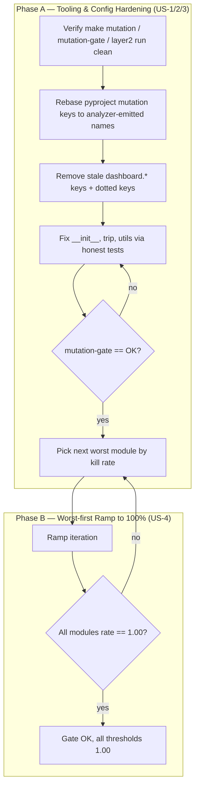
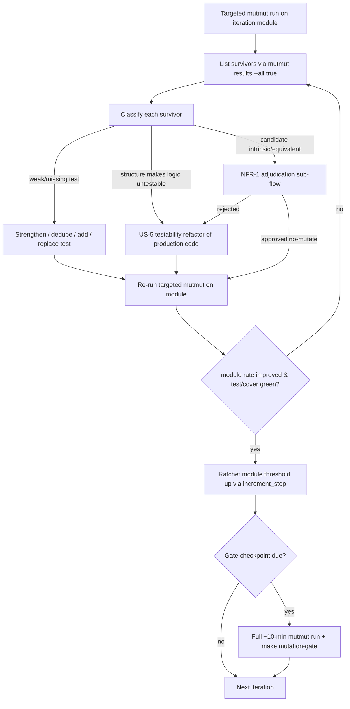
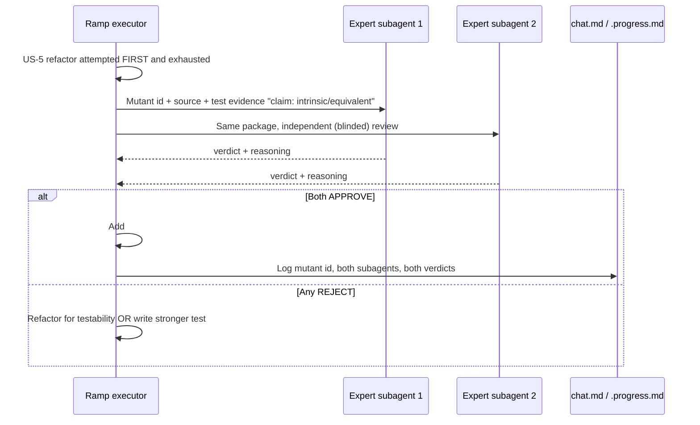

# Design: Mutation Score Ramp

## Overview

Phased delivery: (Phase A) harden the mutation tooling and rebase `pyproject.toml` mutation keys so the gate computes a real per-module verdict, then fix the 3 gate-failing modules to lock the gate green; (Phase B) ramp the remaining modules worst-first through iterations of honest test improvement and US-5 testability refactors, ratcheting each satisfied module's threshold toward `1.00` until `make mutation-gate` is `OK` with every per-module rate = `1.00`. The only honest path to 100% for a genuinely intrinsic/equivalent mutant is the NFR-1 `≥2`-expert-subagent adjudication gate.

## Architecture

### A. Overall phased flow



### B. Per-iteration ramp loop (the unit of work in Phase B and step A4)



### C. NFR-1 adjudication sub-flow (decision #3/#4)



## Components

This spec edits configuration and tests; it has no runtime "components" in the service sense. The design components are the *artifacts and mechanisms* the tasks phase operates on.

### C1. pyproject mutation config (`[tool.quality-gate.mutation]`)
**Purpose**: Source of per-module thresholds the analyzer compares against.
**Responsibilities**: 1:1 key↔analyzer-module correspondence; hold the ratchet state (`kill_threshold` per module, `increment_step`, `target_final`).

### C2. `mutation_analyzer.py` (read-only this spec)
**Purpose**: Aggregates `mutmut results --all true` by path **segment 3** (`custom_components.ev_trip_planner.<segment3>`), emits gate `OK`/`NOK`.
**Constraint**: NOT modified (out of scope). Design works *around* its segment-3 aggregation by rebasing keys.

### C3. Targeted-run mechanism
**Purpose**: Fast per-iteration feedback without a full ~10-min run.
**Interface** (verified against installed mutmut 3.5.0): `mutmut run` accepts positional `[MUTANT_NAMES]...` which support glob patterns. A module-scoped run is:
```bash
.venv/bin/mutmut run --max-children=4 "custom_components.ev_trip_planner.config_flow.*"
```
`paths_to_mutate` stays untouched (config-only, not a CLI flag); the positional glob is the targeted mechanism. For split packages, segment 3 is the package name, so `"custom_components.ev_trip_planner.trip.*"` re-runs the whole `trip` aggregate. Re-running mutants updates the same cache the analyzer reads — no config edit, no scoping file.

### C4. Ratchet mechanism
**Purpose**: Lock in progress; gate cannot regress.
**Interface**: after a module's measured rate ≥ its current `kill_threshold + increment_step` (0.01), raise that module's `kill_threshold` toward `target_final = 1.00`. Final state: every module `kill_threshold = 1.00`.

## Phase A — Tooling & Config Hardening (US-1, US-2, US-3)

### A.1 Verify the three make targets run clean (US-1)

| Target | Command | Pass signal | AC |
|---|---|---|---|
| `make mutation` | `.venv/bin/mutmut run --max-children=4` | exit 0, full run, runtime recorded (~9.7 min / 583 s baseline), 0 timeouts, `_other` bucket 0 | AC-1.1, AC-1.4, AC-1.5 |
| `make mutation-gate` | `mutation_analyzer.py . --gate` | gate table + JSON printed, no traceback | AC-1.2 |
| `make layer2` | gate + `weak_test_detector.py` + `diversity_metric.py` | all 3 sub-steps run, no error | AC-1.3 |

`_other`-bucket check (AC-1.5): grep `mutmut results --all true` for any line not matching `custom_components.ev_trip_planner.<seg>...`; expect 0. Timeout check (AC-1.4): grep for `: timeout`; expect 0.

**Authoritative baseline (binding for all of Phase A and Phase B)**: The per-module baseline table in `research.md` (overall 48.9%, `__init__` 51.5%, `trip` 46.8%, …) is **SUPERSEDED / stale** and MUST NOT be used for any decision. The **fresh full `make mutation` run executed in this step A.1 is the SOLE authoritative baseline** for every per-module kill rate, the worst-first ordering (B.1), the failing-module list (A.3), and the overall rate (B.6). Every specific per-module percentage quoted anywhere in this design — the A.3 figures (`__init__` ~32.5%, `trip` ~47.5%, `utils` ~86.1%), the B.1 worst-first ordering, the B.6 baseline row `57.1%` overall — is **"expected from prior runs — to be confirmed/replaced by the A.1 authoritative full run"** and carries no decision weight until that run replaces it. There is a known discrepancy for `__init__` (research.md reports 51.5%, requirements and design A.3 report ~32.5%); this is **resolved by the A.1 run**, whose number is authoritative. The design deliberately rests no decision on a number it does not trust — A.1 produces the trusted numbers, and B.1 references this statement for ordering.

### A.2 Threshold-rebasing plan (US-2)

The analyzer keys modules by **path segment 3**. Any pyproject key with a dot inside the module portion (`trip.manager`, `emhass.adapter`, …) can never match — the analyzer emits `trip`, `emhass`, etc. Every dotted key silently falls back to `global_kill_threshold`. `dashboard.*` keys are fully dead (`dashboard/` merged into `panel.py`).

**Authoritative mapping table** (analyzer-emitted name ↔ current pyproject key(s) ↔ corrected key ↔ source path):

| Analyzer-emitted module | Current pyproject key(s) | Action | Corrected key | Source path |
|---|---|---|---|---|
| `calculations` | `calculations.core/.windows/.power/.schedule/.deficit` (5 dotted) | collapse 5→1 | `calculations` | `custom_components/ev_trip_planner/calculations/` |
| `trip` | `trip.manager/.crud_mixin/.soc_mixin/.power_profile_mixin/.schedule_mixin` (5 dotted) | collapse 5→1 | `trip` | `custom_components/ev_trip_planner/trip/` |
| `emhass` | `emhass.adapter/.index_manager/.load_publisher/.error_handler/.cache_entry_builder` (5 dotted) | collapse 5→1 | `emhass` | `custom_components/ev_trip_planner/emhass/` |
| `services` | `services.handlers/._handler_factories/.cleanup/.dashboard_helpers/.presence/._lookup` (6 dotted) | collapse 6→1 | `services` | `custom_components/ev_trip_planner/services/` |
| `vehicle` | `vehicle.controller/.strategy/.external` (3 dotted) | collapse 3→1 | `vehicle` | `custom_components/ev_trip_planner/vehicle/` |
| `config_flow` | `config_flow` | keep | `config_flow` | `custom_components/ev_trip_planner/config_flow/` |
| `presence_monitor` | `presence_monitor` | keep | `presence_monitor` | `custom_components/ev_trip_planner/presence_monitor/` |
| `coordinator` | `coordinator` | keep | `coordinator` | `custom_components/ev_trip_planner/coordinator.py` |
| `panel` | `panel` | keep | `panel` | `custom_components/ev_trip_planner/panel.py` |
| `sensor` | `sensor` | keep | `sensor` | `custom_components/ev_trip_planner/sensor/` |
| `utils` | `utils` | keep | `utils` | `custom_components/ev_trip_planner/utils.py` |
| `definitions` | `definitions` | keep | `definitions` | `custom_components/ev_trip_planner/definitions.py` |
| `diagnostics` | `diagnostics` | keep | `diagnostics` | `custom_components/ev_trip_planner/diagnostics.py` |
| `yaml_trip_storage` | `yaml_trip_storage` | keep | `yaml_trip_storage` | `custom_components/ev_trip_planner/yaml_trip_storage.py` |
| `__init__` | `__init__` | keep | `__init__` | `custom_components/ev_trip_planner/__init__.py` |
| `const` | (none) | **ADD if analyzer emits it** | `const` | `custom_components/ev_trip_planner/const.py` |
| `frontend` | (none) | **ADD if analyzer emits it** | `frontend` | `custom_components/ev_trip_planner/frontend/` |
| — | `dashboard.importer/.builder/.template_manager` (3) | **DELETE (stale)** | — | merged into `panel.py` |

**Keys to remove**: 3 `dashboard.*` keys (FR-4, AC-2.1).
**Dotted keys to collapse**: 24 dotted keys → 5 top-level keys (`calculations`, `trip`, `emhass`, `services`, `vehicle`) (FR-5, AC-2.2).
**Keys to verify/add**: after the first full run in step A.1, list the *exact* module set the analyzer emits; add a key for every emitted module with no key (`const`, `frontend` likely), and delete any key with no emitted module (AC-2.3).

**Collapsed-key threshold rule (deterministic)**: when collapsing N dotted sub-module keys into one top-level key, the collapsed key's `kill_threshold` is set to **the module's true measured rate from the A.1 authoritative full run**. Because A.3 fixes the failing modules via real honest tests *before* the gate is declared green, and Phase B only ever ratchets thresholds upward, setting the collapsed threshold to the measured rate never lowers a real bar — NFR-2 is preserved.

After rebasing, every module the analyzer prints has exactly one matching key, and `make mutation-gate` reports each module against its own threshold (AC-2.4). The mapping table above is committed in `design.md` and echoed into `.progress.md` (AC-2.5, FR-13).

### A.3 Lock the gate green (US-3)

After A.2, the A.1 authoritative full run is expected to identify 3 failing modules: `__init__`, `trip`, `utils` (expected from prior runs `__init__` ~32.5%, `trip` ~47.5%, `utils` ~86.1% — *to be confirmed/replaced by the A.1 authoritative full run*; see A.1) measured below their **existing** thresholds (`__init__` 51, `trip` 48, `utils` 89).

**Decision (locked, interview #1)**: Phase A4 fixes `__init__`, `trip`, `utils` *first via real honest tests* so each module meets its **existing** 51/48/89 threshold — then the gate is `OK` (AC-3.1, AC-3.2, FR-7, FR-8). No threshold is lowered, no code is excluded, and no module's `kill_threshold` is rebased down to its measured rate to make the gate pass (AC-3.3, NFR-2) — verified by `git diff` of `pyproject.toml` `[tool.mutmut]` + `[tool.quality-gate.mutation]`. The ramp (Phase B) raises these modules further toward `1.00` only after they already meet 51/48/89.

## Phase B — Iterative Ramp Design (US-4)

### B.1 Worst-first module ordering

After Phase A's fresh full run, order modules ascending by measured kill rate. The ordering below is **expected from prior runs — to be confirmed/replaced by the A.1 authoritative full run** (see the Authoritative-baseline statement in A.1): `config_flow` (~31%) → `panel` (~38%) → `services` (~38%) → `sensor` (~39%) → `coordinator` (~38%) → `trip`/`emhass`/`presence_monitor` → `calculations` → `utils`/`diagnostics`/`definitions`. The *exact* order is fixed by the A.1 authoritative full-run numbers, never by the stale `research.md` baseline. Worst-first maximises overall-rate delta per iteration (a module with the most survivors moves the aggregate most).

### B.2 Per-iteration loop structure

Each iteration targets one module (or a small package). Steps:
1. **Measure**: `mutmut run --max-children=4 "custom_components.ev_trip_planner.<module>.*"` (targeted, fast).
2. **Enumerate survivors**: `mutmut results --all true | grep "<module>" | grep ": survived"`.
3. **Classify** each survivor (see Testability-refactor strategy + adjudication workflow).
4. **Improve**: strengthen weak test / dedupe / add new test / replace weak test / US-5 refactor (AC-4.3).
5. **Re-measure targeted**: re-run step 1 for that module; confirm module rate strictly up.
6. **Regression guard**: `make test` and `make test-cover` (`--cov-fail-under=100`) both green (AC-4.6, NFR-3).
7. **Ratchet**: raise that module's `kill_threshold` toward `1.00` (B.3).
8. **Record**: one-line What & Why in `chat.md` before verify (NFR-7); append delta row.

### B.3 Ratchet workflow (AC-4.5, FR-10)

After step 5 confirms a module's measured rate `r`:
- New `kill_threshold = min(r, target_final)` — i.e. ratchet up to the rate just achieved, never above `1.00`, never down (NFR-2).
- The `increment_step = 0.01` floor guarantees each iteration's ratchet is a real, ≥1-point move (the ratchet "is exercised, not just documented").
- Modules already at `1.00` measured get `kill_threshold = 1.00`.
- Ramp end-state: **every** module `kill_threshold = 1.00`, `status = "passing"`. `definitions` (loose 0.45 today, ~100% measured) is ratcheted to `1.00` per resolved Unresolved-Question.

### B.4 Gate checkpoints (decision #2)

Targeted runs give fast feedback but not the true overall aggregate. A **full `make mutation` (~10 min) + `make mutation-gate`** is run at each checkpoint to capture the exact overall delta. Checkpoint cadence: after every Phase-A completion, and after every N ramp iterations (N decided by task plan; recommended N=2–3 to bound the ~10-min cost). The final iteration always ends on a full-run checkpoint proving overall rate = `1.00`.

### B.5 Iteration entry / exit criteria

**Entry**: previous iteration's regression guard green; target module selected per worst-first order; survivor list freshly enumerated.
**Exit**: target module's measured kill rate strictly greater than at entry; `make test` + `make test-cover` green at 100%; module threshold ratcheted; delta row appended; What & Why logged. An iteration that raises a previously-unkillable mutant to killable via US-5 also counts (AC-4.3e).

### B.6 Per-iteration delta table format

Maintained in `.progress.md` (and mirrored in `chat.md`):

| Iter | Module(s) | Survivors before | Survivors after | Module rate before→after | Overall rate (last full run) | Improvement type(s) | Threshold ratcheted to |
|---|---|---|---|---|---|---|---|
| 0 (baseline) | — | — | — | — | A.1 authoritative full run (expected ~57.1% from prior runs — replaced by the A.1 number) | — | — |
| 1 | `__init__` | … | … | (A.1 measured)→… | (full-run @ checkpoint) | strengthened+new | … |
| … | … | … | … | … | … | … | … |
| N (final) | — | 0 | 0 | all 100% | **100.0%** | — | all 1.00 |

Overall rate must be **monotonically non-decreasing** and strictly increase across the ramp (AC-4.2); the final row shows `100.0%` (AC-4.4, FR-9).

## Testability-refactor Strategy (US-5)

### When a survivor needs a production refactor vs a stronger test

Decision rule applied per survivor:

| Symptom | Verdict |
|---|---|
| Mutated logic *is* exercised by a test, but the test asserts too little (return value, intermediate state) | **Stronger/new test** — no refactor |
| Logic is unreachable from any honest test because it is buried in an un-injected dependency, a closure capture, a private branch with no observable effect, or HA-framework glue with no seam | **US-5 refactor** — extract the logic to a pure, directly-callable function/method so a test can assert on it |
| Mutation has *no* behavioural difference at all (mathematically equivalent / intrinsic) even after a refactor exposing it | **NFR-1 adjudication** (last resort) |

### Refactor constraints (AC-5.2, AC-5.3, NFR-6)

- **API-preserving**: public entry points (HA entities, services, config-flow steps, `async_setup_entry`) keep the same signatures and behaviour.
- **Import-linter contracts hold**: `make import-check` / `lint-imports` green — the layered contract (`trip`/`emhass`/`dashboard` must not import `services`) is not violated by any extraction.
- **HA-observable behaviour unchanged**: no change to any entity state, service result, or config-flow outcome; `make test` proves it.
- Every refactor names, in `chat.md`, the specific mutant(s)/logic it makes testable (AC-5.1, FR-12). Typical pattern: extract a closure body or an inline branch into a module-level pure helper, then unit-test that helper directly.
- Source-inspection test exclusions (`test_solid_metrics`, `test_vehicle_controller_event`) MAY remain but MUST NOT be expanded (NFR-1).

## Unkillable-mutant Adjudication Workflow (decision #3/#4, NFR-1)

A `# pragma: no mutate` comment is the **only** sanctioned suppression, and only after:

1. **US-5 refactor exhausted first** — aggressive testability refactor is mandatory before any mutant may be called unkillable. A mutant is a candidate only if it survives even after the logic is exposed for direct testing.
2. **Two independent expert subagents** review *each* proposed comment. They are spawned separately (blinded — each gets the mutant in isolation, not the other's verdict). Each receives:
   - the exact mutant id (e.g. `custom_components.ev_trip_planner.panel.xǁ…ǁ…__mutmut_7`),
   - the original source line and the mutated line (`mutmut show <id>`),
   - the tests that exercise it (`mutmut tests-for-mutant <id>`),
   - the executor's argument for why it is intrinsic/equivalent.
3. **Verdict**: both must independently APPROVE (confirm genuinely intrinsic/equivalent — no honest test can ever distinguish it). Any REJECT → back to refactor or stronger test. No solo decision.
4. **Logging**: the mutant identity, both subagent names, both verdicts, and the reasoning are written to `chat.md` and `.progress.md` (AC-4.4, NFR-1).
5. A survivor caused by **bad architectural design** is NOT eligible for a comment — it MUST be refactored (decision #3b).

The adjudicated set must be minimised; if it grows large enough to suggest a tooling/architecture gap, escalate for a scope decision.

## Technical Decisions

| Decision | Options Considered | Choice | Rationale |
|---|---|---|---|
| Fix segment-3 key mismatch | (a) modify analyzer to gate per sub-module; (b) rebase pyproject keys to top-level names | (b) rebase keys | Analyzer change is explicitly out of scope (req. Assumptions); rebasing is config-only, low-risk, and matches what the analyzer already emits. |
| Targeted-run mechanism | (a) temporary `paths_to_mutate` scoping file; (b) `mutmut run <MUTANT_NAMES>` glob | (b) positional glob | Verified in installed mutmut 3.5.0: `mutmut run` accepts `[MUTANT_NAMES]...` with globs. No config mutation, no race with the shared cache, reversible. |
| Re-measure cadence | (a) full run every iteration; (b) targeted per iteration + full at checkpoints | (b) | Full run is ~10 min; targeted run on one module is seconds-to-minutes. Checkpoints still give the exact overall delta (interview #2). |
| Module ordering | (a) by survivor count; (b) by kill rate ascending (worst-first); (c) by LOC | (b) worst-first by rate | Locked interview #1. Lowest-rate modules have most headroom; moves the aggregate fastest and front-loads risk. |
| Failing-module strategy in Phase A | (a) rebase thresholds down to measured; (b) fix via tests first | (b) fix first | Locked interview #1: `__init__`/`trip`/`utils` fixed by real tests before the gate is declared green — no threshold lowered (AC-3.3, NFR-2). |
| 100% for equivalent mutants | (a) accept <100%; (b) `≥2`-subagent adjudicated `# pragma: no mutate` | (b) | Locked interview #3/#4 + NFR-1: the only honest path to a literal 100% when a mutant is provably equivalent. |
| Collapsed-key threshold value | (a) max of merged; (b) lowest of merged thresholds; (c) module's true measured rate from the A.1 authoritative full run | (c) true measured rate | Single deterministic rule: the collapsed key's `kill_threshold` = the module's A.1-measured rate. Max could raise a sub-module's bar above its real rate and fail the gate spuriously; "lowest of merged" is ambiguous when sub-module thresholds diverge. Measured rate is unambiguous; since A.3 fixes failing modules via real tests first and Phase B only ratchets upward, it never lowers a real bar (NFR-2). |

## File Structure

| File | Action | Phase | Purpose |
|---|---|---|---|
| `pyproject.toml` | Modify | A | Remove 3 `dashboard.*` keys; collapse 24 dotted keys → 5 top-level keys; add `const`/`frontend` keys if analyzer emits them; ratchet `kill_threshold`s during Phase B; final `target_final`-aligned values. |
| `specs/mutation-score-ramp/design.md` | Create | A | This document — mapping table + ramp design. |
| `specs/mutation-score-ramp/.progress.md` | Modify | A+B | Append mapping table, baseline, per-iteration delta table, learnings. |
| `specs/mutation-score-ramp/chat.md` | Create/Modify | B | One-line What & Why per iteration (NFR-7); refactor justifications (AC-5.1); adjudication logs (NFR-1). |
| `tests/unit/**`, `tests/integration/**` | Modify/Create | A+B | Strengthen/dedupe/add/replace tests per iteration (AC-4.3). Files chosen per module under ramp. |
| `custom_components/ev_trip_planner/**` | Modify | B (only as needed) | US-5 testability refactors — API-preserving, justified in `chat.md`. May be zero files if all survivors are killable by tests alone. |
| `specs/mutation-score-ramp/.ralph-state.json` | Modify | A | Set `awaitingApproval = true` at end of design phase. |

**Create**: 2 (`design.md`, `chat.md`).
**Modify**: `pyproject.toml`, `.progress.md`, `.ralph-state.json`, plus an iteration-determined set of test files and (only where required) production files.

## Error Handling & Failure Modes

| Failure mode | Detection | Handling |
|---|---|---|
| mutmut timeout regression | `mutmut results --all true` shows `: timeout` lines (baseline 0) | Investigate the slow mutant; if a new test introduced an unbounded path, fix the test. NFR-5 = 0 timeouts. Escalate if intrinsic. |
| `_other` bucket non-zero | grep for lines not matching `custom_components.ev_trip_planner.<seg>...` | A new/renamed source path the analyzer's regex misses → reconcile the mapping table; if a true regex gap, escalate (analyzer change is out of scope). |
| Module whose survivors resist both tests and refactor | Iteration cannot raise module rate after honest effort | Enter NFR-1 adjudication; if the adjudicated set is large, escalate for a scope decision (possible tooling/architecture gap). |
| Full-run time exceeds ~15 min (NFR-4) | Wall-clock of `make mutation` at a checkpoint | Escalate (NFR-4 breach). Mitigations to propose: higher `--max-children`, lower per-mutant `timeout` from 600 s — but only as an escalated scope decision, not silently. |
| Gate `NOK` after a rebase | `make mutation-gate` exit 1 | Expected before ramp completes; only a *blocking* failure if a key still mismatches (module falls back to global) — re-check the 1:1 mapping. |
| Coverage drops below 100% | `make test-cover` `--cov-fail-under=100` fails | Iteration's exit criterion not met; fix tests before ratcheting (NFR-3). |
| Import-linter contract broken by a refactor | `make import-check` / `lint-imports` fails | Revert/redo the extraction so the layered contract holds (NFR-6). |

## Test Strategy

> This spec's "tests" are the project's pytest suite plus the mutation harness itself. The mutation kill rate *is* the test-quality metric. There is no new product code with its own unit tests; the deliverable is stronger tests + a correct gate.

### Test Double Policy

| Type | Use in this spec |
|---|---|
| **Stub** | Existing HA fixtures that stub `hass`, config entries, external HTTP — kept; new tests should assert on *real* observable effects, not just that a stub was reached. |
| **Fake** | In-memory HA test harness (`pytest-homeassistant-custom-component`) — used for integration-level tests where a real HA core object is needed. |
| **Mock** | Only where the *interaction* is the observable outcome (e.g. a service call dispatched, a coordinator refresh triggered). Over-mocking is the documented root cause of survivors — minimise. |
| **Fixture** | `conftest.py` fixtures providing known config-entry / trip / vehicle state — extend as needed for new strong tests. |

### Mock Boundary

| Component | Unit test | Integration test | Rationale |
|---|---|---|---|
| `mutation_analyzer.py` (gate) | Real (run against real cache) | Real | Verifying it via `make mutation-gate` — no doubles; it is the harness under test. |
| `pyproject.toml` mutation config | Real (parsed by analyzer) | Real | Correctness verified by gate output, not in isolation. |
| Production modules under ramp (`config_flow`, `trip`, `services`, …) | Real logic; Stub only true external I/O (HTTP, HA core internals) | Fake HA core | Survivors are mostly *caused* by mocks hiding behaviour — new tests assert real return values/state. |
| HA framework registration glue (`panel.async_register_panel`, schema defaults) | Mock only where the call itself is the outcome; else US-5-refactor to expose logic | Fake HA core | Decision #3: framework glue is not auto-unkillable; refactor or assert observable effect first. |

### Fixtures & Test Data

| Component | Required state | Form |
|---|---|---|
| Ramp executor (each iteration) | Populated mutmut cache from a prior `mutmut run` | Produced by `make mutation` / targeted run |
| `mutation-gate` verification | `pyproject.toml` with rebased 1:1 keys | The config file itself (C1) |
| New strong tests for `config_flow` | Valid + invalid config-entry input, generated schema | `conftest.py` factory / inline constants |
| New strong tests for `trip`/`services` | Trip with known SOC/line items, vehicle, tenant/entry | Existing `conftest.py` factories, extended |
| Adjudication | Mutant id + `mutmut show`/`tests-for-mutant` output | Captured into `chat.md` |

### Test Coverage Table

| Component / Mechanism | Test type | What to assert | Test double |
|---|---|---|---|
| `make mutation` | integration | Exit 0, full run, 0 timeouts, `_other` = 0, runtime ≤ ~15 min | none |
| `make mutation-gate` | integration | Prints gate table + JSON, no traceback; final run prints `RESULT: ✅ OK` | none |
| `make layer2` | integration | gate + weak-test detector + diversity metric all run, no error | none |
| pyproject mutation config | integration | Every analyzer-emitted module has exactly one key; no orphan key; no `dashboard.*` key | none |
| Each ramp iteration | integration | Target module measured kill rate strictly increased vs entry | none |
| Regression guard per iteration | unit+integration | `make test` green; `make test-cover` exit 0 at 100% coverage | existing HA fixtures |
| Production refactors (US-5) | unit+integration | `make test` green; `lint-imports` green; HA-observable behaviour unchanged | Fake HA core |
| Final state | integration | Overall kill rate JSON `== 1.0`; every module `kill_rate == 1.00` vs threshold `1.00` | none |
| NFR-1 adjudications | manual | Each `# pragma: no mutate` traces to a logged ≥2-subagent approval in `chat.md` | none |

### Test File Conventions

Discovered from the repo:
- **Test runner**: `pytest` 9.x (`.venv/bin/python -m pytest`), `asyncio_mode = auto`.
- **Test location**: `tests/unit/` and `tests/integration/`; `python_files = test_*.py`.
- **Unit command**: `make test` → `pytest tests/unit tests/integration -v --tb=short`.
- **Coverage command**: `make test-cover` → adds `--cov=custom_components.ev_trip_planner --cov-fail-under=100`.
- **Mutation commands**: `make mutation` (full), `mutmut run "custom_components.ev_trip_planner.<module>.*"` (targeted), `make mutation-gate`, `make layer2`.
- **E2E**: `tests/e2e/*.spec.ts` (Playwright) — exists but unrelated to this spec; not run here.
- **Mock cleanup**: pytest fixtures with function scope (`asyncio_default_fixture_loop_scope = function`); HA fixtures auto-teardown.
- **Markers**: `unit`, `integration`, `slow`, `mutmut_skip` — `mutmut_skip` MUST NOT be newly applied (NFR-1).
- **Pre-existing mutmut exclusions** (`-k "not test_solid_metrics and not test_vehicle_controller_event"`): may remain, must not be expanded.

## Traceability

| Req | Design element |
|---|---|
| US-1 / FR-1,2,3 / AC-1.1–1.5 | Phase A.1 verification table; error-handling `_other`/timeout rows |
| US-2 / FR-4,5,6,13 / AC-2.1–2.5 | Phase A.2 mapping table; C1; technical decision "Fix segment-3 mismatch" |
| US-3 / FR-7,8 / AC-3.1–3.3 | Phase A.3; decision "Failing-module strategy"; NFR-2 git-diff check |
| US-4 / FR-9,10,11 / AC-4.1–4.6 | Phase B.1–B.6; C3, C4; delta table format |
| US-5 / FR-12 / AC-5.1–5.3 | Testability-refactor Strategy; NFR-6 constraints |
| NFR-1 | Adjudication workflow; decision "100% for equivalent mutants" |
| NFR-2 | Decisions "Failing-module strategy", "Collapsed-key threshold value"; git-diff verification |
| NFR-3 | B.2 step 6; B.5 exit criteria; Test Coverage "Regression guard" row |
| NFR-4 | Error-handling "Full-run time exceeds ~15 min" row; B.4 checkpoint cost note |
| NFR-5 | Error-handling "mutmut timeout regression" row; A.1 timeout check |
| NFR-6 | Testability-refactor constraints; import-linter contract handling |
| NFR-7 | B.2 step 8; chat.md in File Structure |

## Unresolved Questions

- Whether the analyzer emits `const` and `frontend` as their own segment-3 modules is confirmed only after Phase A.1's full run; the mapping table is finalised then (handled, not blocking).
- The number of ramp iterations is unbounded and decided by the tasks phase (per requirements); design supports any count.
- The proportion of mutants needing the NFR-1 escape hatch is unknown until the ramp runs; minimised by mandatory US-5-first.

## Implementation Steps

1. **A.1** — Run `make mutation` (record runtime, timeouts, `_other` count); run `make mutation-gate` and `make layer2`; confirm all exit cleanly (AC-1.x).
2. **A.2** — Capture the exact analyzer-emitted module set; rewrite `[tool.quality-gate.mutation.modules.*]`: delete 3 `dashboard.*` keys, collapse 24 dotted keys → 5 top-level keys (`calculations`/`trip`/`emhass`/`services`/`vehicle`), add any missing key (`const`/`frontend`); verify 1:1 correspondence (AC-2.x).
3. **A.3** — Ramp-iterate `__init__`, `trip`, `utils` with honest tests until each meets its threshold; confirm `make mutation-gate` = `OK` without lowering any threshold (AC-3.x).
4. **B (loop)** — For each remaining module worst-first: targeted `mutmut run`, enumerate survivors, classify, improve (strengthen/dedupe/add/replace test or US-5 refactor), re-measure targeted, run `make test`+`make test-cover`, ratchet threshold, log What & Why + delta row (AC-4.x, US-5).
5. **B (adjudication, as needed)** — For any survivor unkillable after US-5: run the ≥2-expert-subagent adjudication; on dual-APPROVE add `# pragma: no mutate` and log (NFR-1).
6. **B (checkpoints)** — Every N iterations and at the end: full `make mutation` + `make mutation-gate`; append overall-rate delta row.
7. **Final** — Confirm gate `OK`, overall kill rate `1.00`, every module threshold `1.00`; finalise delta table and mapping table in `.progress.md`.

<!-- Changelog 2026-05-18: initial design.md for mutation-score-ramp — Phase A tooling/config hardening + green gate, Phase B worst-first ramp to 100%, targeted-run via mutmut positional globs, ratchet to 1.00, ≥2-subagent NFR-1 adjudication. -->
<!-- Changelog 2026-05-18: fixed spec-reviewer findings #9/#10/#13 — removed the rejected threshold-rebase-down narrative from A.3; added the A.1 authoritative-baseline statement marking research.md per-module figures stale and all quoted percentages as to-be-confirmed; made the collapsed-key threshold rule a single deterministic rule (A.1 true measured rate) in both A.2 and the Technical Decisions table. -->
