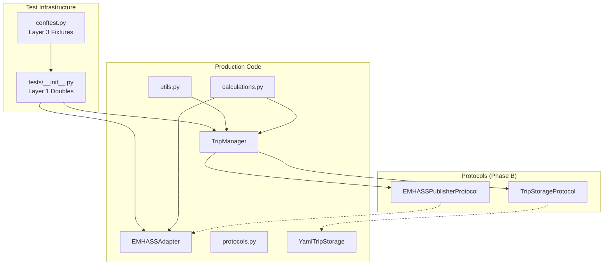

# Design: SOLID Refactor via Protocol DI

## Overview

Refactor `trip_manager.py` and `emhass_adapter.py` applying SOLID principles via Protocol Dependency Injection. Phase A extracts pure functions to `calculations.py`/`utils.py` for immediate 100% coverage. Phase B defines Protocols. Phase C injects them via constructor. Phase D populates `tests/__init__.py` and fixes MagicMock() violations.

## Architecture



## Pure Functions to Extract

### TripManager -> utils.py (5 functions)

| Function | Signature | Purpose |
|----------|-----------|---------|
| `_validate_hora` | `(hora: str) -> None` | Validates HH:MM format, raises ValueError |
| `_sanitize_recurring_trips` | `(trips: Dict) -> Dict` | Filters trips with invalid hora |
| `_is_trip_today` | `(trip: Dict, today: date) -> bool` | Checks if recurring/punctual trip is today |
| `_get_trip_time` | `(trip: Dict) -> Optional[datetime]` | Delegates to `calculate_trip_time` |
| `_get_day_index` | `(day_name: str) -> int` | Delegates to `calculate_day_index` |

### TripManager -> calculations.py (3 functions)

| Function | Signature | Purpose |
|----------|-----------|---------|
| `_calcular_tasa_carga_soc` | `(power_kw: float, capacity: float) -> float` | Delegates to `calculate_charging_rate` |
| `_calcular_soc_objetivo_base` | `(trip, capacity, consumption) -> float` | Delegates to `calculate_soc_target` |
| `get_charging_power` | `(self) -> float` | Stays in class — iterates `hass.config_entries` (requires hass, I/O-bound) |

**Note**: `_get_charging_power` calls `hass.config_entries.async_entries(DOMAIN)` — this is I/O-bound (reads HA config store) and cannot be extracted as a pure function. It stays in TripManager as a class method. The public `get_charging_power()` delegates to it.

### EMHASSAdapter -> calculations.py (3 functions)

| Function | Signature | Purpose |
|----------|-----------|---------|
| `calculate_deferrable_parameters` | `(trip, power_kw) -> Dict` | Pure calculation of deferrable params |
| `_calculate_power_profile_from_trips` | `(trips, power_kw, horizon) -> List[float]` | Pure power profile calculation |
| `_generate_schedule_from_trips` | `(trips, power_kw) -> List[Dict]` | Pure schedule generation |

## Components

### protocols.py (NEW - Phase B)

```python
"""Protocols for TripManager dependency injection."""

from typing import Protocol, runtime_checkable, Dict, List, Any


@runtime_checkable
class TripStorageProtocol(Protocol):
    """Storage interface for trip data."""
    async def async_load(self) -> Dict[str, Any]: ...
    async def async_save(self, data: Dict[str, Any]) -> None: ...


@runtime_checkable
class EMHASSPublisherProtocol(Protocol):
    """EMHASS publishing interface."""
    async def async_publish_deferrable_load(self, trip: Dict[str, Any]) -> bool: ...
    async def async_remove_deferrable_load(self, trip_id: str) -> bool: ...
```

### TripManager Changes (Phase C)

```python
_UNSET = object()  # sentinel - private module constant

class TripManager:
    def __init__(
        self,
        hass: HomeAssistant,
        vehicle_id: str,
        presence_config: Optional[Dict[str, Any]] = None,
        storage: TripStorageProtocol = _UNSET,
        emhass_adapter: EMHASSPublisherProtocol = _UNSET,
    ) -> None:
        self.hass = hass
        self.vehicle_id = vehicle_id
        # Inline default — no if-branch in constructor body (AC-C1.3)
        self._storage = (
            storage
            if storage is not _UNSET
            else YamlTripStorage(hass, vehicle_id)
        )
        self._emhass_adapter = (
            emhass_adapter
            if emhass_adapter is not _UNSET
            else EMHASSAdapter(hass, entry)
        )
```

**Key AC-C1 constraint**: Constructor takes protocols with sentinel defaults (`= _UNSET`), NOT `| None = None`. Body uses `if storage is not _UNSET` — no `if storage is not None` branching.

### tests/__init__.py (Phase D - POPULATE)

```python
"""Layer 1 test doubles - shared constants, factories, and fakes."""

from unittest.mock import AsyncMock, MagicMock
from datetime import datetime, date

# =============================================================================
# CONSTANTS
# =============================================================================

TEST_VEHICLE_ID = "coche1"
TEST_ENTRY_ID = "test_entry_id_abc123"

TEST_CONFIG = {
    "vehicle_name": "Coche 1",
    "vehicle_id": TEST_VEHICLE_ID,
    "soc_sensor": "sensor.coche1_soc",
    "battery_capacity_kwh": 60.0,
    "charging_power_kw": 7.4,
}

TEST_TRIPS = {
    "recurring": [
        {
            "id": "rec_lun_abc123",
            "tipo": "recurrente",
            "dia_semana": "lunes",
            "hora": "08:00",
            "km": 50.0,
            "kwh": 7.5,
            "descripcion": "Trabajo",
            "activo": True,
        },
    ],
    "punctual": [
        {
            "id": "pun_20260501_xyz789",
            "tipo": "puntual",
            "datetime": "2026-05-01T10:00:00",
            "km": 120.0,
            "kwh": 18.0,
            "descripcion": "Viaje largo",
            "estado": "pendiente",
        },
    ],
}

TEST_COORDINATOR_DATA = {
    "recurring_trips": {},
    "punctual_trips": {},
    "kwh_today": 0.0,
    "next_trip": None,
    "soc": 80.0,
}

# =============================================================================
# LAYER 1: FAKE CLASSES
# =============================================================================

class FakeTripStorage:
    """In-memory fake for TripStorageProtocol."""

    def __init__(self, initial_data: dict = None):
        self._data = initial_data or {"trips": {}, "recurring_trips": {}, "punctual_trips": {}}

    async def async_load(self) -> dict:
        return self._data

    async def async_save(self, data: dict) -> None:
        self._data = data


class FakeEMHASSPublisher:
    """In-memory fake for EMHASSPublisherProtocol."""

    def __init__(self):
        self.published_trips: list[dict] = []
        self.removed_trip_ids: list[str] = []

    async def async_publish_deferrable_load(self, trip: dict) -> bool:
        self.published_trips.append(trip)
        return True

    async def async_remove_deferrable_load(self, trip_id: str) -> bool:
        self.removed_trip_ids.append(trip_id)
        return True

# =============================================================================
# LAYER 1: FACTORY FUNCTIONS (with HA boundary patches INSIDE)
# =============================================================================

def create_mock_trip_manager() -> MagicMock:
    """Create a spec'd MagicMock for TripManager.

    AC-D1.2: Must use MagicMock(spec=TripManager) with async methods
    configured individually - NOT AsyncMock without spec.
    """
    from custom_components.ev_trip_planner.trip_manager import TripManager

    mock = MagicMock(spec=TripManager)
    mock.async_setup = AsyncMock(return_value=None)
    mock.async_get_recurring_trips = AsyncMock(return_value=TEST_TRIPS["recurring"])
    mock.async_get_punctual_trips = AsyncMock(return_value=TEST_TRIPS["punctual"])
    mock.get_all_trips = MagicMock(return_value=TEST_TRIPS)
    mock.async_add_recurring_trip = AsyncMock(return_value=None)
    mock.async_add_punctual_trip = AsyncMock(return_value=None)
    mock.async_save_trips = AsyncMock(return_value=None)
    mock.async_delete_trip = AsyncMock(return_value=None)
    mock._publish_deferrable_loads = AsyncMock(return_value=None)
    mock._emhass_adapter = None
    mock._trips = {}
    mock._recurring_trips = {}
    mock._punctual_trips = {}
    return mock


def create_mock_coordinator(
    hass=None,
    entry=None,
    trip_manager=None,
) -> MagicMock:
    """Create a spec'd MagicMock for TripPlannerCoordinator."""
    from custom_components.ev_trip_planner.coordinator import TripPlannerCoordinator

    mock = MagicMock(spec=TripPlannerCoordinator)
    mock.data = dict(TEST_COORDINATOR_DATA)
    mock.hass = hass
    mock._trip_manager = trip_manager or create_mock_trip_manager()
    mock.async_config_entry_first_refresh = AsyncMock(return_value=None)
    return mock


def create_mock_ev_config_entry(
    hass=None,
    data: dict = None,
    entry_id: str = TEST_ENTRY_ID,
):
    """Create a MockConfigEntry for testing."""
    from pytest_homeassistant_custom_component.common import MockConfigEntry

    config_entry = MockConfigEntry(
        entry_id=entry_id,
        domain="ev_trip_planner",
        data=data or TEST_CONFIG,
        version=1,
    )
    if hass:
        config_entry.add_to_hass(hass)
    return config_entry


async def setup_mock_ev_config_entry(
    hass,
    config_entry=None,
    trip_manager=None,
):
    """Set up full mock integration entry with HA boundary patches INSIDE.

    AC-D1.5: Patches at HA boundary go inside this factory function,
    NOT in conftest.py Layer 3 directly.
    """
    from unittest.mock import patch
    from custom_components.ev_trip_planner.trip_manager import TripManager

    config_entry = config_entry or create_mock_ev_config_entry(hass)
    manager = trip_manager or create_mock_trip_manager()

    with patch(
        "custom_components.ev_trip_planner.TripManager",
        return_value=manager,
    ):
        await hass.config_entries.async_setup(config_entry.entry_id)
        await hass.async_block_till_done()

    return config_entry, manager
```

## Data Flow

### Phase A: Pure Function Extraction

```
TripManager._calcular_tasa_carga_soc()
    -> imports calculate_charging_rate from calculations.py
    -> calls calculate_charging_rate(charging_power_kw, battery_capacity_kwh)
    -> returns float

EMHASSAdapter.calculate_deferrable_parameters()
    -> MOVED to calculations.py as standalone function
    -> called by EMHASSAdapter.publish_deferrable_loads() via import
```

### Phase C: Protocol Injection

```
TripManager.__init__(storage=TripStorageProtocol, emhass_adapter=EMHASSPublisherProtocol)
    -> self._storage = storage or YamlTripStorage(hass, vehicle_id)
    -> self._emhass_adapter = emhass_adapter or EMHASSAdapter(hass, entry)
    -> BACKWARD COMPAT: set_emhass_adapter() / get_emhass_adapter() still work
```

## Technical Decisions

| Decision | Options | Choice | Rationale |
|----------|---------|--------|-----------|
| Where to put pure functions | calculations.py only, utils.py only, split both | **Split** | `_validate_hora`, `_sanitize_recurring_trips`, `_is_trip_today`, `_get_trip_time`, `_get_day_index` -> utils.py (day/time handling). `_calcular_tasa_carga_soc`, `_calcular_soc_objetivo_base`, `_get_charging_power`, `calculate_deferrable_parameters`, `_calculate_power_profile_from_trips`, `_generate_schedule_from_trips` -> calculations.py (energy/SOC calculations) |
| Protocol definition style | Abstract base class, duck typing, typing.Protocol | **typing.Protocol** | Python's Protocol gives structural subtyping without inheritance. YamlTripStorage implements `async_load`/`async_save` implicitly — no wrapper needed (AC-B1.4) |
| Constructor injection style | `param: Protocol = None` with if-branch, `param: Protocol` direct | **Direct with inline default** | AC-C1.1: `storage: TripStorageProtocol` NOT `| None`. Default: `storage if storage is not _UNSET else YamlTripStorage(...)` — no if-branch in constructor body |
| Test double location | conftest.py, test files, tests/__init__.py | **tests/__init__.py for Layer 1** | TDD_METHODOLOGY.md is explicit: Layer 1 (TEST_*, create_mock_*, Fake*) goes in tests/__init__.py. Layer 3 (fixtures) stays in conftest.py |
| MagicMock vs spec | MagicMock() bare, MagicMock(spec=Clase) | **spec= for own classes** | TDD methodology: MagicMock(spec=ClaseReal) catches API errors. AsyncMock() acceptable for stable external interfaces |

## File Structure

| File | Action | Purpose |
|------|--------|---------|
| `custom_components/ev_trip_planner/utils.py` | MODIFY | Add: `validate_hora()`, `sanitize_recurring_trips()`, `is_trip_today()` |
| `custom_components/ev_trip_planner/calculations.py` | MODIFY | Add: `calculate_deferrable_parameters()`, `_calculate_power_profile_from_trips()`, `_generate_schedule_from_trips()` |
| `custom_components/ev_trip_planner/protocols.py` | CREATE | Define `TripStorageProtocol` and `EMHASSPublisherProtocol` |
| `custom_components/ev_trip_planner/trip_manager.py` | MODIFY | Import pure funcs, delegate to them. Add protocol params to `__init__` |
| `custom_components/ev_trip_planner/emhass_adapter.py` | MODIFY | Import pure funcs from calculations.py, call them |
| `tests/__init__.py` | POPULATE | Add all Layer 1 doubles per TDD_METHODOLOGY.md |
| `tests/test_trip_manager.py` | FIX | Replace MagicMock() with MagicMock(spec=TripManager) |
| `tests/test_emhass_adapter.py` | FIX | Replace MagicMock() with MagicMock(spec=EMHASSAdapter) |

## Error Handling

| Scenario | Handling | User Impact |
|----------|----------|--------------|
| `validate_hora` receives invalid format | Raises `ValueError` with descriptive message | Logged as warning in `_sanitize_recurring_trips` |
| `YamlTripStorage` file missing | Falls back to empty dict `{}` | No trips loaded, clean slate |
| EMHASS publish fails | Logs error, index released | Trip saved locally but not published |
| Protocol mismatch (FakeTripStorage missing method) | TypeError at construction time | Test fails immediately — caught by spec |
| MagicMock API violation | `SpecificationError` from spec= | Test fails immediately — catches wrong API usage |

## Edge Cases

- **Empty trips dict**: Pure functions handle gracefully (return empty results, no crashes)
- **Invalid hora in stored data**: `_sanitize_recurring_trips` filters invalid entries, logs warnings
- **Trip with no deadline**: `calculate_deferrable_parameters` returns empty dict — caller handles
- **Index cooldown**: Soft-deleted indices tracked with timestamps — reused after cooldown expires
- **Circular import**: `calculations.py` imports from `utils.py` only (calcular_energia_kwh) — no cycles

## Test Strategy

### Test Double Policy

| Type | When to Use | Example |
|------|-------------|---------|
| **Stub** | Isolate SUT from external I/O when only the SUT's output matters | `FakeTripStorage.async_load()` returns shaped data |
| **Fake** | Simplified real implementation for integration tests | `FakeEMHASSPublisher` tracks published trips in memory |
| **Mock** | Verify interactions (call args, call count) as observable outcome | `mock_trip_manager.async_add_recurring_trip.assert_called_once()` |
| **Fixture** | Predefined data state | `TEST_TRIPS` constant provides known trip data |

### Mock Boundary

| Component | Unit Test | Integration Test | Rationale |
|-----------|-----------|------------------|-----------|
| TripManager | Stub storage + Fake EMHASS | Real storage + Fake EMHASS | Unit tests: isolate from I/O. Integration: use FakeTripStorage for speed |
| EMHASSAdapter | Stub (HTTP calls external) | Fake + real hass states | Adapter is I/O-bound — stub the external HTTP layer |
| calculations.py functions | **none** (pure) | **none** (pure) | 100% deterministic — test with @pytest.mark.parametrize |
| utils.py functions | **none** (pure) | **none** (pure) | 100% deterministic — test with @pytest.mark.parametrize |
| TripStorageProtocol | Fake (FakeTripStorage) | Real YamlTripStorage | Protocol boundary — fake in unit, real in integration |

### Fixtures & Test Data

| Component | Required State | Form |
|-----------|----------------|------|
| `validate_hora` | Valid: "08:00", "23:59"; Invalid: "25:00", "ab:cd" | `@pytest.mark.parametrize` |
| `sanitize_recurring_trips` | Mix of valid/invalid hora entries | Inline dicts in test |
| `calculate_deferrable_parameters` | Trip with kwh, datetime; trip without deadline | `@pytest.mark.parametrize` |
| TripManager with protocol | FakeTripStorage + FakeEMHASSPublisher | Factory function in tests/__init__.py |
| EMHASSAdapter | FakeTripStorage (for index persistence) | Inline fake in test |

### Test Coverage Table

| Component / Function | Test Type | What to Assert | Double |
|---------------------|-----------|----------------|--------|
| `validate_hora("08:00")` | unit | Returns None (no exception) | none |
| `validate_hora("25:00")` | unit | Raises ValueError | none |
| `sanitize_recurring_trips(mixed)` | unit | Returns only valid, logs warning for invalid | none |
| `is_trip_today(recurring_lunes, monday)` | unit | Returns True | none |
| `is_trip_today(recurring_lunes, tuesday)` | unit | Returns False | none |
| `calculate_deferrable_parameters(trip, 7.4)` | unit | Returns dict with total_energy_kwh, power_watts | none |
| `calculate_power_profile_from_trips(trips, 7.4)` | unit | Returns list of floats | none |
| `generate_deferrable_schedule_from_trips(trips, 7.4)` | unit | Returns list of dicts with date, p_deferrable* | none |
| TripManager with FakeStorage | unit | CRUD operations work, storage called | FakeTripStorage |
| TripManager -> EMHASSAdapter | unit | publish_deferrable_loads called | FakeEMHASSPublisher |
| EMHASSAdapter with FakeStorage | integration | Index assignment, release, persist | FakeTripStorage |
| TripManager (full flow) | integration | End-to-end with real YamlTripStorage | none |

### Test File Conventions

Discovered from codebase:
- **Runner**: pytest (configured in pyproject.toml)
- **Test location**: `tests/test_*.py`
- **Integration pattern**: `*.integration.test.py` not used — integration tests in same files
- **E2E pattern**: `tests/e2e/` with Playwright
- **Mock cleanup**: `afterEach` with `mockClear` not used — each test creates fresh mocks
- **Fixture location**: `conftest.py` for Layer 3 (HA fixtures), `tests/__init__.py` for Layer 1 (TO CREATE)
- **Coverage command**: `python3 -m pytest tests --cov=custom_components.ev_trip_planner --cov-report=term-missing`

## Phase-by-Phase Checklist

### Phase A: Pure Functions

**Before Phase A:**
- [ ] Record baseline coverage: `pytest tests --cov=custom_components.ev_trip_planner --cov-report=term-missing`

**Phase A Step 1 — TripManager utils:**
1. Add `validate_hora(hora: str) -> None` to utils.py
2. Add `sanitize_recurring_trips(trips: Dict) -> Dict` to utils.py (imports validate_hora)
3. Add `is_trip_today(trip: Dict, today: date) -> bool` to utils.py
4. Add `_get_trip_time` delegation in TripManager: `from .calculations import calculate_trip_time`
5. Add `_get_day_index` delegation in TripManager: `from .calculations import calculate_day_index`
6. Update TripManager to call imported functions (not its own private methods)
7. Run tests: `pytest tests/test_trip_manager_core.py -v`
8. Verify coverage: pure functions in utils.py should show 100%

**Phase A Step 2 — TripManager calculations:**
1. Verify `_calcular_tasa_carga_soc` already delegates to `calculate_charging_rate`
2. Verify `_calcular_soc_objetivo_base` already delegates to `calculate_soc_target`
3. If not, add delegation

**Phase A Step 3 — EMHASSAdapter calculations:**
1. Add `calculate_deferrable_parameters(trip, power_kw) -> Dict` to calculations.py
2. Add `_calculate_power_profile_from_trips(trips, power_kw, horizon) -> List[float]` to calculations.py
3. Add `_generate_schedule_from_trips(trips, power_kw) -> List[Dict]` to calculations.py
4. Update EMHASSAdapter to call imported functions
5. Run tests: `pytest tests/test_emhass_adapter.py -v`

**Phase A Gate:**
- [ ] All pure functions 100% covered
- [ ] `ruff check custom_components/ev_trip_planner/ --select=I` clean
- [ ] `mypy custom_components/ev_trip_planner/` zero errors
- [ ] `pytest tests/test_trip_manager_core.py tests/test_emhass_adapter.py -v` all pass

### Phase B: Protocols

1. Create `protocols.py` with `TripStorageProtocol` and `EMHASSPublisherProtocol`
2. Verify YamlTripStorage implements `TripStorageProtocol` structurally (no code change needed)
3. Verify EMHASSAdapter implements `EMHASSPublisherProtocol` structurally
4. Run: `pytest tests/test_trip_manager.py -v` (should still pass)

**Phase B Gate:**
- [ ] `protocols.py` exists with both protocols defined
- [ ] `mypy custom_components/ev_trip_planner/protocols.py` clean
- [ ] Existing tests still pass

### Phase C: Constructor Injection

1. Modify TripManager.__init__ to accept `storage: TripStorageProtocol` and `emhass_adapter: EMHASSPublisherProtocol`
2. Default to real implementations inline sentinel: `storage if storage is not _UNSET else YamlTripStorage(...)`
3. Update set_emhass_adapter / get_emhass_adapter for backward compatibility
4. Run tests incrementally

**Phase C Gate:**
- [ ] `pytest tests/test_trip_manager_core.py -v` passes
- [ ] `pytest tests/test_trip_manager_emhass.py -v` passes
- [ ] Backward compatibility: `set_emhass_adapter()` still works

### Phase D: Layer 1 Migration + MagicMock Fixes

1. Populate `tests/__init__.py` with all Layer 1 doubles (see Component section above)
2. Fix MagicMock() violations in test files:
   - `test_trip_manager.py`: MagicMock() -> MagicMock(spec=TripManager)
   - `test_emhass_adapter.py`: MagicMock() -> MagicMock(spec=EMHASSAdapter)
   - `test_coordinator.py`: MagicMock() -> MagicMock(spec=TripPlannerCoordinator)
3. Update test files to import from tests/__init__.py

**Phase D Gate:**
- [ ] `tests/__init__.py` contains all Layer 1 doubles
- [ ] No MagicMock() without spec for own classes (TripManager, EMHASSAdapter, TripPlannerCoordinator)
- [ ] `pytest tests/ -v` all pass
- [ ] `pytest --randomly-seed=1 --randomly-seed=2 --randomly-seed=3` identical results

## Implementation Steps

### Step 1: Phase A — utils.py additions
1. Add `validate_hora()` to utils.py
2. Add `sanitize_recurring_trips()` to utils.py (imports validate_hora)
3. Add `is_trip_today()` to utils.py
4. Update TripManager._sanitize_recurring_trips to call utils.sanitize_recurring_trips
5. Update TripManager._is_trip_today to call utils.is_trip_today
6. Update TripManager._get_trip_time to delegate to calculations.calculate_trip_time
7. Update TripManager._get_day_index to delegate to calculations.calculate_day_index
8. Write tests for validate_hora, sanitize_recurring_trips, is_trip_today in test_utils.py

### Step 2: Phase A — calculations.py additions (EMHASSAdapter)
1. Add `calculate_deferrable_parameters()` to calculations.py
2. Add `_calculate_power_profile_from_trips()` to calculations.py  
3. Add `_generate_schedule_from_trips()` to calculations.py
4. Update EMHASSAdapter to call calculations functions
5. Write tests for calculate_deferrable_parameters

### Step 3: Phase B — Create protocols.py
1. Create protocols.py with TripStorageProtocol and EMHASSPublisherProtocol
2. Verify structural compatibility (YamlTripStorage and EMHASSAdapter already implement required methods)

### Step 4: Phase C — TripManager constructor injection
1. Add storage and emhass_protocol parameters to TripManager.__init__
2. Default to real implementations inline
3. Preserve set_emhass_adapter / get_emhass_adapter
4. Run tests

### Step 5: Phase D — Populate tests/__init__.py
1. Add TEST_* constants
2. Add FakeTripStorage and FakeEMHASSPublisher classes
3. Add create_mock_trip_manager() with MagicMock(spec=TripManager)
4. Add create_mock_coordinator() with MagicMock(spec=TripPlannerCoordinator)
5. Add setup_mock_ev_config_entry() with HA boundary patches inside
6. Fix MagicMock() violations in test files

### Step 6: Final verification
1. Run: `pytest tests/ -v`
2. Run: `ruff check custom_components/ev_trip_planner/ --select=I`
3. Run: `mypy custom_components/ev_trip_planner/`
4. Run: `pytest --randomly-seed=1 --randomly-seed=2 --randomly-seed=3`
5. Run: `make e2e` (if available)
