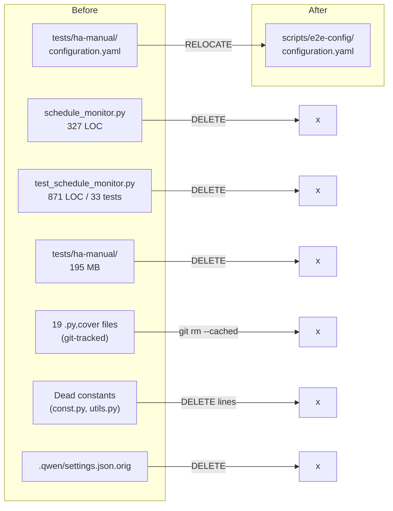
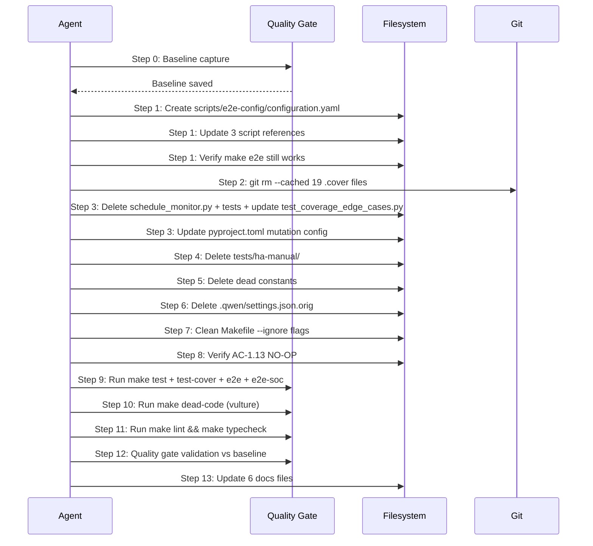

# Design: Dead Code & Artifact Elimination

## Overview

Mechanical deletion of dead module (schedule_monitor), orphaned artifacts (19 .cover files, .qwen backup), stale test infrastructure (tests/ha-manual/), and unreferenced constants. Pre-step relocates E2E configuration.yaml before ha-manual deletion. Quality gate baseline captured before first change, validated after last.

## Architecture



## Data Flow



## Components

### 1. E2E Configuration Relocation (PRE-STEP / BLOCKER)

**Purpose**: Move configuration.yaml from doomed directory to permanent location before ha-manual deletion.

**Source**: `tests/ha-manual/configuration.yaml` (62 lines)
**Destination**: `scripts/e2e-config/configuration.yaml`

**Files to modify (path updates)**:

| File | Current Line | Old Path | New Path |
|------|-------------|----------|----------|
| `scripts/run-e2e.sh` | 93 | `tests/ha-manual/configuration.yaml` | `scripts/e2e-config/configuration.yaml` |
| `scripts/run-e2e-soc.sh` | 85 | `tests/ha-manual/configuration.yaml` | `scripts/e2e-config/configuration.yaml` |
| `.github/workflows/playwright.yml.disabled` | 41 | `tests/ha-manual/configuration.yaml` | `scripts/e2e-config/configuration.yaml` |

### 2. Git Untrack: 19 .cover Files

**Purpose**: Remove mutmut coverage artifacts from git tracking. Files already gitignored.

**Command**: `git rm --cached` for each file. 19 files total including `protocols.py,cover` (orphaned -- no source exists).

### 3. Dead Module: schedule_monitor.py + Tests

**Purpose**: Remove module with zero production imports, not registered as HA platform.

**Files to delete**:
- `custom_components/ev_trip_planner/schedule_monitor.py` (327 LOC)
- `tests/test_schedule_monitor.py` (871 LOC, 33 tests)

**File to edit**: `tests/test_coverage_edge_cases.py`
- Remove lines 522-548 (section header + 1 test: `test_schedule_monitor_notify_with_none_service`)

**File to edit**: `pyproject.toml`
- Remove lines 155-157 (`[tool.quality-gate.mutation.modules.schedule_monitor]` section)

### 4. tests/ha-manual/ Directory Deletion

**Purpose**: Remove 195 MB of unused HA test instance data.

**Prerequisite**: Step 1 complete (configuration.yaml relocated).

**Action**: Delete entire `tests/ha-manual/` directory.

### 5. Dead Constants Removal

**Purpose**: Remove 4 constants with zero references in any file type.

**File: `custom_components/ev_trip_planner/const.py`**:
- Line 21: `SIGNAL_TRIPS_UPDATED = "ev_trip_planner_trips_updated"` + blank line after
- Line 67: `DEFAULT_CONTROL_TYPE = CONTROL_TYPE_NONE`
- Line 71: `DEFAULT_NOTIFICATION_SERVICE = "persistent_notification.create"`

**File: `custom_components/ev_trip_planner/utils.py`**:
- Line 34: `ALL_DAYS = set(DAY_ABBREVIATIONS.keys())`
- Note: `DAY_ABBREVIATIONS` (parent) is active -- do NOT touch.

### 6. Orphaned Backup Cleanup

**Purpose**: Remove stale editor/tool artifact.

**Action**: Delete `.qwen/settings.json.orig` (70 bytes).

### 7. Makefile Cleanup

**Purpose**: Remove 6 `--ignore=tests/ha-manual/` flags after directory deletion.

**Targets to update** (remove `--ignore=tests/ha-manual/` from each):
- Line 66: `test`
- Line 69: `test-cover`
- Line 72: `test-verbose`
- Line 75: `test-dashboard`
- Line 271: `test-parallel`
- Line 275: `test-random`

### 8. Documentation Updates

**Purpose**: Remove stale schedule_monitor references from 6 docs.

| File | Lines | Reference |
|------|-------|-----------|
| `docs/architecture.md` | 171 | Section 11 describing schedule_monitor.py module |
| `docs/source-tree-analysis.md` | 24, 64 | File tree entries for schedule_monitor.py and its tests |
| `docs/development-guide.md` | 131 | File tree entry for schedule_monitor.py |
| `docs/MILESTONE_4_POWER_PROFILE.md` | 279 | Planning reference to schedule_monitor |
| `docs/MILESTONE_4_1_PLANNING.md` | 22, 285 | Starting point reference (line 22) + Wire ScheduleMonitor task in table (line 285) |
| `docs/DOCS_DEEP_AUDIT.md` | 99, 132 | Audit entries listing schedule_monitor |

## Technical Decisions

| Decision | Options Considered | Choice | Rationale |
|----------|-------------------|--------|-----------|
| Config relocation target | `scripts/e2e-config/`, `config/`, root | `scripts/e2e-config/` | Co-located with scripts that use it; clear separation |
| .cover file cleanup | `git rm --cached`, manual `.gitignore` update | `git rm --cached` only | Pattern already in .gitignore; just untrack |
| Test removal scope | Full file delete, selective test removal | Both | Full file for test_schedule_monitor.py, surgical for test_coverage_edge_cases.py |
| Dead constants scope | Delete all 4, defer to Spec 5 | Delete all 4 | Zero references confirmed; trivial and safe |
| Docs update timing | During implementation, defer to later spec | During implementation | Low effort, prevents confusion; non-blocking |
| AC-1.13 (Lovelace import) | Remove, gate with feature flag, NO-OP | NO-OP | Function is active, tested, standard HA pattern |
| vulture false positives | Whitelist, ignore, reconfigure | Iterate: configure whitelist | Requirements say iterate until zero findings at confidence 80 |

## File Structure

| File | Action | Purpose |
|------|--------|---------|
| `scripts/e2e-config/configuration.yaml` | CREATE | E2E config relocated from ha-manual |
| `custom_components/ev_trip_planner/schedule_monitor.py` | DELETE | Dead module |
| `tests/test_schedule_monitor.py` | DELETE | Tests for dead module |
| `tests/test_coverage_edge_cases.py` | MODIFY | Remove lines 522-548 (1 test) |
| `pyproject.toml` | MODIFY | Remove lines 155-157 (mutation config) |
| `custom_components/ev_trip_planner/const.py` | MODIFY | Remove 3 dead constants |
| `custom_components/ev_trip_planner/utils.py` | MODIFY | Remove 1 dead constant |
| `scripts/run-e2e.sh` | MODIFY | Update config path at line 93 |
| `scripts/run-e2e-soc.sh` | MODIFY | Update config path at line 85 |
| `.github/workflows/playwright.yml.disabled` | MODIFY | Update config path at line 41 |
| `Makefile` | MODIFY | Remove 6 `--ignore=tests/ha-manual/` flags |
| `tests/ha-manual/` | DELETE | Entire directory (195 MB) |
| `.qwen/settings.json.orig` | DELETE | Orphaned backup |
| 19 `*.py,cover` files | GIT RM --CACHED | Untrack mutmut artifacts |
| `docs/architecture.md` | MODIFY | Remove schedule_monitor section |
| `docs/source-tree-analysis.md` | MODIFY | Remove schedule_monitor entries |
| `docs/development-guide.md` | MODIFY | Remove schedule_monitor entry |
| `docs/MILESTONE_4_POWER_PROFILE.md` | MODIFY | Update schedule_monitor reference |
| `docs/MILESTONE_4_1_PLANNING.md` | MODIFY | Update ScheduleMonitor task |
| `docs/DOCS_DEEP_AUDIT.md` | MODIFY | Remove schedule_monitor entries |

## Error Handling

| Error Scenario | Handling Strategy | User Impact |
|----------------|-------------------|-------------|
| `make e2e` fails after config relocation | Revert path changes, verify file exists at new location, check permissions | E2E tests blocked |
| `make test` shows unexpected failures (not the 34 removed) | `git stash` changes, bisect to find which deletion caused failure | Cannot proceed until root cause found |
| vulture reports false positives on active code | Add to vulture whitelist in pyproject.toml, iterate | None -- whitelist is the intended mechanism |
| `ruff check --select F401` reports new warnings | Find and remove the leftover import causing it | None -- quick fix |
| Dead constant has gained references since research | Re-run grep before deletion; if references found, SKIP that constant | Partial completion -- escalate |
| `make quality-gate` regression | Compare layer-by-layer; if single layer regressed, investigate | Blocked until resolved |

## Edge Cases

- **mock_schedule_monitor in test_init.py:569**: NOT an import -- orphaned mock fixture name. No action needed. Will become a dead reference to a non-existent module name but it creates a MagicMock, not importing the real class.
- **tests/ha-manual/ contains mutmut copies**: The `mutants/` directory also has copies of ha-manual content but is gitignored. No action needed.
- **ALL_DAYS derives from DAY_ABBREVIATIONS**: Only ALL_DAYS is deleted. DAY_ABBREVIATIONS remains (active: lines 89, 271, 274 in utils.py).
- **protocols.py,cover has no source**: Orphaned mutmut artifact. Included in the 19-file git rm --cached sweep. Do NOT create protocols.py.
- **playwright.yml.disabled**: File is disabled but must still be updated to prevent confusion if re-enabled.

## Test Strategy

> Core rule: if it lives in this repo and is not an I/O boundary, test it real.

### Test Double Policy

| Type | What it does | When to use |
|---|---|---|
| **Stub** | Returns predefined data, no behavior | N/A for this spec -- no external I/O |
| **Fake** | Simplified real implementation | N/A for this spec |
| **Mock** | Verifies interactions | N/A for this spec |
| **Fixture** | Predefined data state | Quality gate baseline capture |

### Mock Boundary

| Component | Unit test | Integration test | Rationale |
|---|---|---|---|
| Config relocation (scripts) | none -- verified by make e2e | none -- verified by make e2e | Shell scripts, tested via execution |
| Dead module deletion | none -- deletion verified by grep + make test | none -- make test confirms no regressions | Deletion, not code change |
| Dead constants removal | none -- verified by grep + make test | none -- make test confirms no regressions | Line deletion, not logic change |
| Makefile cleanup | none -- verified by make test targets | none -- make test confirms targets work | Makefile edit, tested by execution |
| Docs updates | none -- not testable | none -- documentation only | No code impact |

### Fixtures & Test Data

| Component | Required state | Form |
|---|---|---|
| Quality gate baseline | Full quality gate output BEFORE changes | Directory `_bmad-output/quality-gate/spec1-baseline/` |
| Test count baseline | 1,849 tests collected | `make test` output capture |
| Config file | 62-line HA minimal configuration | `scripts/e2e-config/configuration.yaml` |

### Test Coverage Table

| Component / Function | Test type | What to assert | Test double |
|---|---|---|---|
| Config relocation | integration | `make e2e` and `make e2e-soc` pass with new config path | none |
| Schedule monitor deletion | integration | `make test` passes with ~1,815 tests (34 fewer) | none |
| Cover file untracking | verification | `git ls-files '*.py,cover'` returns empty | none |
| ha-manual deletion | verification | `ls tests/ha-manual/` fails | none |
| Dead constants deletion | integration | `make test` passes, `grep` returns empty | none |
| Full suite regression | integration | `make test && make test-cover && make e2e && make e2e-soc` all exit 0 | none |
| Dead code detection | verification | `make dead-code` exits 0 with zero findings | none |
| Import validation | verification | `ruff check --select F401` exits 0 | none |
| Lint + typecheck | verification | `make lint && make typecheck` exit 0 | none |
| Quality gate validation | integration | Post-impl quality gate >= baseline on all layers | none |

### Test File Conventions

- Test runner: **pytest** (Python unit), **Playwright** (E2E), **Jest** (frontend panel)
- Unit test command: `make test` (pytest, ~1,815 tests after cleanup)
- E2E test command: `make e2e` (Playwright against HA on :8123)
- E2E SOC command: `make e2e-soc` (Playwright dynamic SOC)
- Test file location: co-located `tests/test_*.py` (Python), `tests/e2e/*.spec.ts` (Playwright), `tests/panel.test.js` (Jest)
- Integration test pattern: none separate -- all via `make test`
- Dead code: `make dead-code` (vulture --min-confidence 80)
- Lint: `make lint` (ruff + pylint)
- Typecheck: `make typecheck` (pyright)
- Quality gate: `make quality-gate` (multi-layer: test, mutation, lint, security)
- Mock cleanup: N/A for this spec (no mocks used)
- Fixture/factory location: `tests/conftest.py` (shared fixtures)

## Performance Considerations

- Repository size reduced by ~195 MB (ha-manual deletion)
- Test suite runs faster: 34 fewer tests to collect and execute
- Vulture scan faster: one fewer source file

## Security Considerations

- No security implications -- pure deletion of dead code and artifacts
- Quality gate Layer 4 (security) must not regress vs baseline

## Existing Patterns to Follow

- Config files colocated with their consumers (scripts/e2e-config/ follows scripts/ pattern)
- Mutation config in pyproject.toml `[tool.quality-gate.mutation.modules.*]` sections
- Test ignore flags in Makefile use `--ignore=` prefix
- Constants defined at module level in const.py and utils.py
- Documentation updates are section removals, not full rewrites

## Unresolved Questions

- None. All questions resolved during research/requirements phases.

## Implementation Steps

### Step 0: Quality Gate Baseline

```bash
mkdir -p _bmad-output/quality-gate/spec1-baseline/
. .venv/bin/activate
make quality-gate 2>&1 | tee _bmad-output/quality-gate/spec1-baseline/output.txt
BASELINE_SHA=$(git rev-parse HEAD) && echo "Baseline commit: $BASELINE_SHA"
```

Save baseline metrics: test count (1,849), coverage %, mutation scores, lint errors, security findings.

### Step 1: PRE-STEP -- Config Relocation (BLOCKER)

```bash
# Create target directory
mkdir -p scripts/e2e-config/

# Copy configuration file
cp tests/ha-manual/configuration.yaml scripts/e2e-config/configuration.yaml

# Add to git
git add scripts/e2e-config/configuration.yaml
```

Then update 3 files:

**scripts/run-e2e.sh line 93**:
```bash
# Old: cp tests/ha-manual/configuration.yaml "${HA_CONFIG_DIR}/configuration.yaml"
# New:
cp scripts/e2e-config/configuration.yaml "${HA_CONFIG_DIR}/configuration.yaml"
```

**scripts/run-e2e-soc.sh line 85**:
```bash
# Old: cp tests/ha-manual/configuration.yaml "${HA_CONFIG_DIR}/configuration.yaml"
# New:
cp scripts/e2e-config/configuration.yaml "${HA_CONFIG_DIR}/configuration.yaml"
```

**.github/workflows/playwright.yml.disabled line 41**:
```yaml
# Old: cp tests/ha-manual/configuration.yaml /tmp/ha-e2e-config/configuration.yaml
# New:
        cp scripts/e2e-config/configuration.yaml /tmp/ha-e2e-config/configuration.yaml
```

**Verify**: `grep -rn "tests/ha-manual/configuration.yaml" scripts/ .github/` returns empty.

### Step 2: Untrack .cover Files

**Pre-check** (#19): Verify .gitignore has cover pattern:
```bash
grep ',cover' .gitignore  # Must return match at line 30
```

```bash
git rm --cached $(git ls-files '*.py,cover')
rm -f custom_components/ev_trip_planner/*.py,cover  # Remove from disk too (#7)
```

**Verify**: `git ls-files '*.py,cover'` returns empty.

### Step 3: Delete schedule_monitor + Tests

```bash
# Delete production module
rm custom_components/ev_trip_planner/schedule_monitor.py

# Delete test file
rm tests/test_schedule_monitor.py

# Also delete the .cover file for schedule_monitor (now untracked but still on disk)
rm -f custom_components/ev_trip_planner/schedule_monitor.py,cover
```

Edit `tests/test_coverage_edge_cases.py`: remove lines 522-548 (section header `# Coverage: schedule_monitor.py:282` through end of `test_schedule_monitor_notify_with_none_service`).

Edit `pyproject.toml`: remove lines 155-157:
```toml
[tool.quality-gate.mutation.modules.schedule_monitor]
kill_threshold = 0.50
status = "passing"
```

**Verify**: `grep -rn "schedule_monitor" custom_components/ tests/test_schedule_monitor.py pyproject.toml` returns empty (only test_init.py mock name should remain).

### Step 4: Delete tests/ha-manual/

```bash
rm -rf tests/ha-manual/
```

**Verify**: `ls tests/ha-manual/` returns error.

### Step 5: Delete Dead Constants

**IMPORTANT**: The verification grep MUST run after Step 4 (tests/ha-manual/ deletion). ha-manual/ contains copies of const.py with the same constants -- grep will find references there until the directory is deleted.

**const.py** -- remove 3 constants:
- Line 21-22: `SIGNAL_TRIPS_UPDATED = "ev_trip_planner_trips_updated"` + trailing blank line
- Line 67: `DEFAULT_CONTROL_TYPE = CONTROL_TYPE_NONE`
- Line 71: `DEFAULT_NOTIFICATION_SERVICE = "persistent_notification.create"`

**utils.py** -- remove 1 constant:
- Line 34: `ALL_DAYS = set(DAY_ABBREVIATIONS.keys())`
- Also remove blank line 35 if it becomes double-blank

**Verify before deletion**: Re-run `grep -rn "SIGNAL_TRIPS_UPDATED\|DEFAULT_CONTROL_TYPE\|DEFAULT_NOTIFICATION_SERVICE\|ALL_DAYS" custom_components/ tests/ --include="*.py"`. Must return ONLY the definitions themselves.

### Step 6: Delete .qwen/settings.json.orig

```bash
rm .qwen/settings.json.orig
```

**Verify**: `ls .qwen/settings.json.orig` returns error.

### Step 7: Clean Makefile --ignore Flags

Remove `--ignore=tests/ha-manual/` from 6 lines:

| Line | Target | Change |
|------|--------|--------|
| 66 | `test` | Remove `--ignore=tests/ha-manual/` |
| 69 | `test-cover` | Remove `--ignore=tests/ha-manual/` |
| 72 | `test-verbose` | Remove `--ignore=tests/ha-manual/` |
| 75 | `test-dashboard` | Remove `--ignore=tests/ha-manual/` |
| 271 | `test-parallel` | Remove `--ignore=tests/ha-manual/` |
| 275 | `test-random` | Remove `--ignore=tests/ha-manual/` |

**Verify**: `grep "ha-manual" Makefile` returns empty.

### Step 8: Verify AC-1.13 (NO-OP)

```bash
grep -rn "async_import_dashboard_for_entry" custom_components/ tests/ --include="*.py"
```

Expected: function defined in services.py, called from __init__.py and config_flow.py, tested by test_init.py and test_services_core.py. NO-OP confirmed.

### Step 9: Run Test Suite

```bash
. .venv/bin/activate
make test           # ~1,815 tests expected
make test-cover     # Coverage report (100%)
make e2e            # All E2E specs pass
make e2e-soc        # All SOC specs pass
```

### Step 10: Run Dead Code Detection

```bash
make dead-code      # vulture --min-confidence 80
```

If false positives: add to vulture whitelist in pyproject.toml and iterate.

### Step 11: Run Lint + Typecheck

```bash
make lint && make typecheck
```

### Step 12: Quality Gate Validation

```bash
make quality-gate 2>&1 | tee _bmad-output/quality-gate/spec1-validation/output.txt
```

Compare layer-by-layer against baseline. Every metric must be equal or better.

### Step 13: Update Documentation

Update 6 files to remove schedule_monitor references:

1. `docs/architecture.md:171` -- Remove section 11
2. `docs/source-tree-analysis.md:24,64` -- Remove tree entries
3. `docs/development-guide.md:131` -- Remove tree entry
4. `docs/MILESTONE_4_POWER_PROFILE.md:279` -- Update reference
5. `docs/MILESTONE_4_1_PLANNING.md:22` -- Update task description
6. `docs/DOCS_DEEP_AUDIT.md:99,132` -- Remove audit entries

### Rollback Plan

Each step is independently revertible via `git checkout -- <file>` or `git rm` + `git checkout HEAD -- <file>`. The quality gate baseline provides the pass/fail criterion. If any verification step fails:

1. `git stash` all uncommitted changes
2. Investigate failure
3. Apply fix or revert specific file
4. Re-run failed verification step

If full rollback needed: `git reset --hard $BASELINE_SHA` (use baseline commit hash captured in Step 0).
