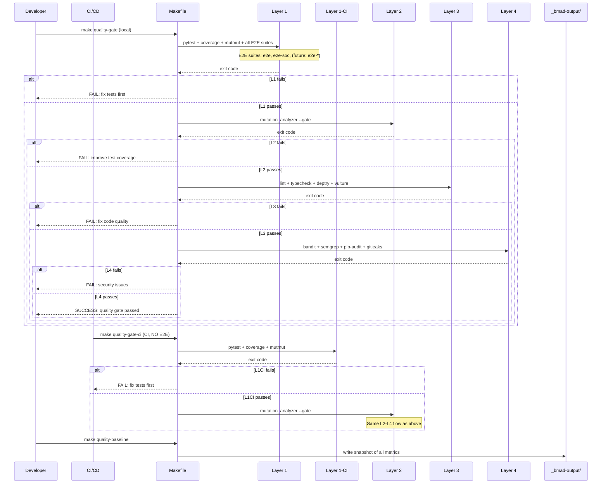

# Design: Tooling Foundation

## Overview

Install missing security and quality tools (bandit, pip-audit, gitleaks, semgrep, deptry, vulture, import-linter, refurb), migrate from mypy to pyright, create a 4-layer quality gate Makefile target with fail-fast semantics, establish baseline metrics, and update CI—all while maintaining 100% backward compatibility of existing Makefile targets.

## Architecture

```mermaid
graph TB
    subgraph Developer["Developer Workflow"]
        A[make test] --> B[make lint]
        B --> C[make typecheck]
        C --> D[make format]
        D --> E[make check]
        E --> F[make quality-gate]
        F --> G[make quality-baseline]
    end

    subgraph Layer4["Layer 4: Security"]
        S1[security-bandit]
        S2[security-semgrep]
        S3[security-pip-audit]
        S4[security-gitleaks]
    end

    subgraph Layer3["Layer 3: Code Quality"]
        Q1[lint: ruff, pylint]
        Q2[typecheck: pyright]
        Q3[deptry: unused deps]
        Q4[vulture: dead code]
        Q5[import-linter]
    end

    subgraph Layer2["Layer 2: Test Quality"]
        T1[mutation_analyzer.py --gate]
        T2[weak_test_detector.py]
    end

    subgraph Layer1["Layer 1: Test Execution (Local)"]
        X1[pytest]
        X2[coverage 100%]
        X3[mutmut --runner=pytest]
        X4[E2E Suites]
        XS1[e2e suite]
        XS2[e2e-soc suite]
        XFN[future suites...]
    end

    subgraph Layer1CI["Layer 1-CI: Test Execution (CI)"]
        X1CI[pytest]
        X2CI[coverage 100%]
        X3CI[mutmut --runner=pytest]
    end

    F --> L1[Layer 1 (local)]
    L1 -->|pass| L2[Layer 2]

    FCI[quality-gate-ci] --> L1CI[Layer 1-CI (CI only)]
    L1CI -->|pass| L2[Layer 2]
    L2 -->|pass| L3[Layer 3]
    L3 -->|pass| L4[Layer 4]

    L1 -->|fail| FAIL1[STOP: fix tests]
    L2 -->|fail| FAIL2[STOP: improve tests]
    L3 -->|fail| FAIL3[STOP: fix code quality]
    L4 -->|fail| FAIL4[STOP: fix security]

    style FAIL1 fill:#f66,stroke:#333,stroke-width:2px
    style FAIL2 fill:#f66,stroke:#333,stroke-width:2px
    style FAIL3 fill:#f66,stroke:#333,stroke-width:2px
    style FAIL4 fill:#f66,stroke:#333,stroke-width:2px
    style L4 fill:#bfa,stroke:#333,stroke-width:2px
```

## Components

### Makefile Target Structure

**Purpose**: Orchestrate all quality tools with flexible, composable targets.

**Independent Targets** (run single tool):
- `make typecheck` — pyright (replaces mypy, keeps target name)
- `make lint` — ruff + pylint (existing)
- `make security-bandit` — bandit security scan
- `make security-semgrep` — semgrep SAST
- `make security-pip-audit` — pip-audit dependency scan
- `make security-gitleaks` — gitleaks secret scan
- `make dead-code` — vulture unused code
- `make unused-deps` — deptry dependency analysis
- `make import-check` — import-linter (circular imports)
- `make refurb` — refurb modernization suggestions
- `make mutation` — mutmut mutation testing
- `make mutation-gate` — mutation_analyzer.py --gate
- `make test-parallel` — pytest with pytest-xdist (parallel execution)
- `make test-random` — pytest with pytest-randomly (random order)
- `make e2e-lint` — ESLint + tsc for E2E tests
- `make pre-commit-install` — install pre-commit hooks
- `make pre-commit-run` — run pre-commit hooks on all files
- `make pre-commit-update` — update pre-commit hooks to latest versions

**Layer Targets** (run all tools in a layer):
- `make layer1` — test execution (pytest, coverage, mutmut, **all E2E suites**)
  - E2E suites: `make e2e`, `make e2e-soc` (extensible for future suites)
- `make layer1-ci` — test execution (pytest, coverage, mutmut) — **NO E2E, for CI**
- `make layer2` — test quality (mutation-gate, weak_test_detector)
- `make layer3` — code quality (lint, typecheck, deptry, vulture, import-linter, e2e-lint)
- `make layer4` — security (bandit, semgrep, pip-audit, gitleaks)

**Orchestrator Targets**:
- `make quality-gate` — run layer1 → layer2 → layer3 → layer4 (fail-fast) — **includes all E2E suites**
- `make quality-gate-ci` — run layer1-ci → layer2 → layer3 → layer4 (fail-fast) — **NO E2E, for CI/CD**
- `make quality-baseline` — snapshot all metrics to _bmad-output/quality-gate/baseline/

**Backward Compatibility** (existing targets unchanged behavior):
- `make test` — pytest only (existing)
- `make test-cover` — pytest + coverage (existing)
- `make lint` — ruff + pylint (existing)
- `make mypy` — NOW: runs pyright (for compatibility), DEPRECATED warning
- `make format` — black + isort (existing)
- `make check` — test + lint + mypy (existing, now runs pyright)
- **E2E suite targets — all unchanged (existing)**:
  - `make e2e` — standard E2E suite
  - `make e2e-soc` — SOC-specific E2E suite
  - Future E2E suites follow pattern: `e2e-{suite-name}`
- `make staging-*` — all staging targets unchanged (existing)

### Configuration Files

**pyproject.toml** (modify):
- Remove `[tool.mypy]` section entirely
- Add `[tool.pyright]` with Python 3.14 target
- Add `[tool.bandit]` with exclude_dirs
- Add `[tool.deptry]` with ignore rules
- Add `[tool.vulture]` with make_whitelist config
- Add `[tool.import-linter]` with layers config
- Update `[tool.pylint.MASTER]` py-version from 3.11 → 3.14

**New Files** (create):
- `.gitleaks.toml` — secret detection rules
- `.semgrep.yml` — SAST rules
- `.pre-commit-config.yaml` — pre-commit hooks configuration
- `_bmad-output/quality-gate/baseline/` — baseline snapshots

**Modified Files**:
- `.eslintrc.json` — add `"extends": ["plugin:@typescript-eslint/recommended"]`
- `Makefile` — add new targets, update help

### Pre-commit Hooks Configuration

**`.pre-commit-config.yaml`** (create):
```yaml
repos:
  - repo: local
    hooks:
      - id: ruff
        name: ruff linting
        entry: .venv/bin/ruff check .
        language: system
        types: [python]
      - id: ruff-format
        name: ruff formatting
        entry: .venv/bin/ruff format .
        language: system
        types: [python]
      - id: pyright
        name: pyright type checking
        entry: .venv/bin/pyright
        language: system
        types: [python]
        pass_filenames: false
      - id: bandit
        name: bandit security scan
        entry: .venv/bin/bandit -r custom_components/
        language: system
        types: [python]
      - id: deptry
        name: deptry dependency check
        entry: .venv/bin/deptry . --ignore "DEP003"
        language: system
        pass_filenames: false
```

**Pre-commit workflow**:
- Developer runs `make pre-commit-install` (one-time setup)
- Hooks run automatically on `git commit`
- Can run manually with `make pre-commit-run`
- Update hooks with `make pre-commit-update`

### Pytest Configuration

**pytest execution modes**:
- **Normal**: `pytest` (sequential, deterministic order)
- **Parallel**: `pytest -n auto` (via pytest-xdist, uses all CPUs)
- **Random**: `pytest --randomly-seed=1234` (via pytest-randomly, detects order dependencies)

**CI configuration** (pytest.ini or pyproject.toml):
```toml
[tool.pytest.ini_options]
addopts = """
    --strict-markers
    --strict-config
    --cov=custom_components
    --cov-report=term-missing
    --cov-report=html
"""
testpaths = ["tests"]
python_files = ["test_*.py"]
python_classes = ["Test*"]
python_functions = ["test_*"]
asyncio_mode = "auto"
```

**pytest-xdist and pytest-randomly**:
- `make test-parallel`: adds `-n auto` for parallel execution (3-5x speedup in CI)
- `make test-random`: adds `--randomly-seed` flag to detect inter-test dependencies
- CI uses parallel by default: `PYTEST_XDIST_AUTO_WORKER_COUNT=3`

### CI Integration

**python-tests.yml** (modify):
- Add security layer step: `make layer4`
- Add quality gate step: `make quality-gate-ci` (excludes E2E to avoid CI issues)
- E2E tests: NOT run in CI (use `make e2e` locally or separate E2E workflow)
- Update help text in comments

**New Job** (optional, separate PR):
- `quality-gate.yml` — full quality gate run on schedule/manual

### Tool Installation Scripts

**install-tools.sh** (create):
```bash
#!/bin/bash
# Install all security and quality tools
.venv/bin/pip install bandit[toml] pip-audit semgrep deptry vulture pyright-nodecli import-linter pre-commit pytest-randomly pytest-xdist refurb
# gitleaks binary to /usr/local/bin/
```

## Data Flow



1. Developer runs `make quality-gate`
2. Layer 1 executes: pytest, coverage, mutmut, **all E2E suites** (e2e, e2e-soc, future suites)
3. If Layer 1 fails: stop immediately (fail-fast)
4. If Layer 1 passes: Layer 2 executes mutation analysis
5. If Layer 2 fails: stop, report weak tests
6. If Layer 2 passes: Layer 3 executes code quality checks
7. If Layer 3 fails: stop, report quality issues
8. If Layer 3 passes: Layer 4 executes security scans
9. If Layer 4 fails: report security issues
10. All layers pass: quality gate passed
11. `make quality-baseline` snapshots all metrics to _bmad-output/

## Technical Decisions

| Decision | Options Considered | Choice | Rationale |
|----------|-------------------|--------|-----------|
| Type checker | mypy, pyright, pyre | pyright | Faster, better VSCode integration, handles HA stubs better, official Microsoft support |
| Security audit | safety, pip-audit, pip-audit bundled | pip-audit | Built into pip 23.1+, actively maintained, better vulnerability database |
| Makefile organization | Monolithic, layered-only, hybrid | Hybrid | Independent targets for flexibility + layer targets for orchestration + quality-gate for full CI |
| Python target version | 3.11, 3.12, 3.13, 3.14 | 3.14 | CI already uses 3.14, forward-looking, mypy→pyright migration opportunity |
| Dead code tool | dead, vulture, autoflake | vulture | Simple, whitelist-based, works well with HA custom components |
| Dependency analysis | pip-check, pipdeptree, deptry | deptry | Static analysis (no install needed), DEP001-004 codes clear, finds unused imports |
| Secret detection | trufflehog, gitleaks, git-secrets | gitleaks | Fast, binary install, TOML config, good default rules |
| SAST tool | pylint, semgrep, codeql | semgrep | Configurable rules, cross-language, fast, good HA rule sets |

## File Structure

| File | Action | Purpose |
|------|--------|---------|
| `requirements_dev.txt` | Modify | Add bandit, pip-audit, semgrep, deptry, vulture, pyright-nodecli, import-linter, refurb, pytest-randomly, pytest-xdist; remove mypy |
| `pyproject.toml` | Modify | Remove [tool.mypy], add [tool.pyright], [tool.bandit], [tool.deptry], [tool.vulture], [tool.import-linter]; update pylint py-version to 3.14 |
| `.gitleaks.toml` | Create | Secret detection rules (API keys, tokens, passwords) |
| `.semgrep.yml` | Create | SAST rules for Python security issues |
| `.eslintrc.json` | Modify | Add TypeScript extends for E2E tests |
| `Makefile` | Modify | Add new targets (layer1-4, quality-gate, quality-baseline, tool-specific), update help, add deprecation warning to mypy target |
| `.github/workflows/python-tests.yml` | Modify | Add layer4 security step, add quality-gate step (non-blocking) |
| `scripts/install-tools.sh` | Create | One-time setup script for all tools |
| `scripts/quality-baseline.sh` | Create | Snapshot all quality metrics to _bmad-output/quality-gate/baseline/ |
| `_bmad-output/quality-gate/baseline/` | Create | Directory for baseline snapshots |

## Error Handling

| Error Scenario | Handling Strategy | User Impact |
|----------------|-------------------|-------------|
| pytest fails (Layer 1) | Stop immediately, show failing test | Developer must fix test before quality gate proceeds |
| coverage < 100% (Layer 1) | Fail with uncovered lines report | Add tests or update exclusions |
| mutmut score below threshold (Layer 2) | Fail with per-module kill map | Improve test coverage for weak modules |
| pyright type error (Layer 3) | Fail with file:line:error details | Fix type annotations or add ignores |
| deptry finds unused dep (Layer 3) | Fail with DEP001-004 codes | Remove unused imports or add to requirements |
| vulture finds dead code (Layer 3) | Fail with function/class names | Remove dead code or add to whitelist |
| bandit finds issue (Layer 4) | Fail with severity + CWE | Fix security issue or add justified ignore |
| semgrep finds issue (Layer 4) | Fail with rule ID + location | Fix or add ignore with justification |
| pip-audit finds vuln (Layer 4) | Fail with CVE + upgrade path | Update dependency or accept risk |
| gitleaks finds secret (Layer 4) | Fail with file:line + secret type | Rotate secret, remove from git |
| Tool not installed | Clear error: "run make install-tools" | Run install-tools.sh |
| mypy target invoked | Warning: "DEPRECATED: use make typecheck" | Runs pyright for compatibility |

## Edge Cases

- **Edge case 1**: HA stub files trigger type errors — pyright handles better than mypy with `ignore_missing_imports = true`
- **Edge case 2**: E2E tests fail but unit tests pass — Layer 1 requires both to pass. All E2E suites (`e2e`, `e2e-soc`, future suites) must pass.
- **Edge case 3**: Mutmut takes too long in CI — Layer 2 has timeout (600s), skips if no mutations found
- **Edge case 4**: Gitleaks scans entire git history — use `--no-banner` and limit to recent commits with `--log-opts`
- **Edge case 5**: Semgrep slow on first run — cache warmed in CI, local runs can use `--config-ignore`
- **Edge case 6**: Vulture false positives on dynamic attributes — whitelist generated automatically with `--make-whitelist`
- **Edge case 7**: Deptry flags HA dependencies as unused — ignore HA imports in config
- **Edge case 8**: Pyright finds issues in tests/ — strict mode on custom_components/ only
- **Edge case 9**: New E2E suite added — Layer 1 automatically includes new `e2e-*` targets via Makefile pattern

### E2E Suite Extensibility

**Current E2E Suites** (2 suites):
1. **Standard E2E suite**: `make e2e`
2. **SOC E2E suite**: `make e2e-soc`

**Future E2E Suites** — Extensibility Design:
- New suites follow the pattern: `e2e-{suite-name}`
- Layer 1 Makefile target uses wildcard pattern to auto-discover all `e2e-*` targets
- No changes needed to quality-gate when adding new E2E suites
- Example: Adding `e2e-charging` suite would create `make e2e-charging`

**Implementation** (Makefile pattern):
```makefile
# Auto-discover all E2E suites (excluding headed/debug variants for Layer 1)
E2E_SUITE_TARGETS := $(filter-out %-headed %-debug,$(sort $(patsubst e2e-%,e2e-%,$(shell grep -o '^e2e-[^:]*' Makefile))))

layer1:
	@echo "=== Layer 1: Test Execution ==="
	@echo "Running pytest..."
	@$(MAKE) test-cover
	@echo "Running mutation testing..."
	@$(MAKE) mutation
	@echo "Running E2E suites..."
	@for suite in $(E2E_SUITE_TARGETS); do \
		echo "  Running $$suite..."; \
		$(MAKE) $$suite || exit 1; \
	done
	@echo "=== Layer 1: PASS ==="
```

## Test Strategy

### Test Double Policy

| Type | What it does | When to use |
|---|---|---|
| **Stub** | Returns predefined data, no behavior | Isolate SUT from external I/O (HA API, file system) |
| **Fake** | Simplified real implementation | In-memory state for tests (e.g., fake storage) |
| **Mock** | Verifies interactions (call args, count) | Only when interaction itself is the observable outcome |
| **Fixture** | Predefined data state | Any test needing known initial data |

### Mock Boundary

| Component | Unit test | Integration test | Rationale |
|---|---|---|---|
| `custom_components.ev_trip_planner.calculations` | Real | Real | Pure business logic, no I/O |
| `custom_components.ev_trip_planner.coordinator` → HA API | Stub async responses | Stub HA API | External I/O boundary |
| `custom_components.ev_trip_planner.yaml_trip_storage` → YAML files | Fake in-memory dict | Real test file | I/O boundary — fake for unit, real for integration |
| `custom_components.ev_trip_planner.emhass_adapter` → EMHASS | Stub HTTP responses | Stub HTTP | Third-party, charges per call |
| `tests.e2e.*` → HA UI | None | Real | E2E tests against real HA instance |
| `bandit` CLI | None | Real | Security scanner — test real output |
| `semgrep` CLI | None | Real | SAST scanner — test real output |
| `pyright` CLI | None | Real | Type checker — test real output |
| `deptry` CLI | None | Real | Dependency analyzer — test real output |
| `vulture` CLI | None | Real | Dead code finder — test real output |

### Fixtures & Test Data

| Component | Required state | Form |
|---|---|---|
| `calculations` module | EV params (capacity, efficiency), trip data, SOC profile | Factory fn `build_ev_params()` |
| `coordinator` | Mock HA entity states, mock config entry | `mock_async_add_entities` fixture |
| `yaml_trip_storage` | Test YAML files with valid trips | `tests/fixtures/trips/test_trip.yaml` |
| `emhass_adapter` | Mock EMHASS API responses | `mock_emhass_response` fixture |
| E2E tests | HA instance with test config loaded | `scripts/run-e2e.sh` setup |

### Test Coverage Table

| Component / Function | Test type | What to assert | Test double |
|---|---|---|---|
| `Makefile layer1` target | integration | pytest exit 0, coverage >= 100%, mutmut >= threshold, all E2E suites pass | none (real tools) |
| `Makefile layer1` - E2E suites | integration | `make e2e` exit 0, `make e2e-soc` exit 0, future suites auto-discovered | none (real tools) |
| `Makefile layer2` target | integration | mutation_analyzer exit 0, weak_test_detector exit 0 | none (real scripts) |
| `Makefile layer3` target | integration | ruff/pylint/pyright/deptry/vulture exit 0 | none (real tools) |
| `Makefile layer4` target | integration | bandit/semgrep/pip-audit/gitleaks exit 0 | none (real tools) |
| `Makefile quality-gate` | integration | Fails fast when layer1 fails, reports correct layer | none (real tools) |
| `Makefile quality-baseline` | integration | Creates snapshot files in _bmad-output/quality-gate/baseline/ | none |
| `Makefile typecheck` | unit | Runs pyright (not mypy), exit 0 on valid code | none |
| `Makefile mypy` (backward compat) | unit | Runs pyright, prints DEPRECATED warning | none |
| `Makefile check` | integration | Runs test + lint + typecheck, exit 0 | none |
| `scripts/install-tools.sh` | unit | All tools installed, versions match expected | none (real install) |
| `scripts/quality-baseline.sh` | unit | Creates JSON snapshot with all metrics | none |
| `pyproject.toml [tool.pyright]` | integration | pyright uses config, ignores HA stubs | none |
| `.gitleaks.toml` | integration | gitleaks uses rules, finds test secrets | none |
| `.semgrep.yml` | integration | semgrep uses rules, finds test issues | none |

### Test File Conventions

Discover from codebase:
- **Test runner**: pytest (via Makefile `make test`)
- **Test file location**: `tests/` directory, `test_*.py` naming
- **Integration test pattern**: No separate pattern (all tests are integration with HA stubs)
- **E2E test pattern**: `tests/e2e/*.spec.ts` (Playwright TypeScript)
- **Mock cleanup**: `mocker.stop()` in pytest fixtures, `afterEach` not used (pytest autouse fixtures)
- **Fixture/factory location**: `tests/conftest.py` for shared fixtures, co-located fixtures in test files

## Performance Considerations

- **Layer 1 timeout**: 60 minutes (pytest + mutmut can be slow)
- **Layer 2 timeout**: 5 minutes (mutation analysis only)
- **Layer 3 timeout**: 10 minutes (all code quality tools)
- **Layer 4 timeout**: 15 minutes (security scanners, semgrep can be slow)
- **pytest-xdist**: Add `-n auto` for parallel test execution in CI
- **pytest-randomly**: Detect order-dependent tests (adds minimal overhead)
- **mutmut incremental**: Use existing cache for re-runs
- **pyright daemon**: Uses server mode for faster subsequent runs

## Security Considerations

- **gitleaks**: Scans git history for secrets — rotate any found immediately
- **bandit**: Detects common security issues (SQL injection, shell injection, etc.)
- **semgrep**: Custom rules for HA-specific security patterns
- **pip-audit**: Checks for known vulnerabilities in dependencies
- **pre-commit**: Hook to prevent secrets from being committed
- **CI secrets**: Never log or output scan results that contain actual secrets

## Existing Patterns to Follow

Based on codebase analysis:
- **Makefile help text**: Bilingual (English + Spanish), keep this format
- **Target naming**: kebab-case, lowercase (e.g., `e2e-soc`)
- **E2E suite pattern**: `e2e-{suite-name}` (e.g., `e2e`, `e2e-soc`)
- **PY project structure**: `[tool.*]` sections in pyproject.toml
- **pytest config**: Already has `asyncio_mode = "auto"` for HA async tests
- **Coverage target**: Already set to 100%, maintain this
- **E2E separation**: E2E uses separate HA config, never mix with unit test config
- **Venv activation**: Scripts use `.venv/bin/python` pattern
- **Quality gate config**: `[tool.quality-gate.mutation]` already exists, extend pattern

## Implementation Steps

1. Install Python tools via pip to `.venv/`
2. Download and install gitleaks binary to `/usr/local/bin/`
3. Update `requirements_dev.txt`: add new tools, remove mypy
4. Modify `pyproject.toml`: remove [tool.mypy], add [tool.pyright], [tool.bandit], [tool.deptry], [tool.vulture], [tool.import-linter], update pylint py-version to 3.14
5. Create `.gitleaks.toml` with basic secret detection rules
6. Create `.semgrep.yml` with Python security rules
7. Update `.eslintrc.json`: add `"extends": ["plugin:@typescript-eslint/recommended"]` for TypeScript E2E tests
8. Modify `Makefile`:
   - Add independent targets: typecheck (pyright), dead-code, unused-deps, import-check, mutation-gate, security-bandit, security-semgrep, security-pip-audit, security-gitleaks, e2e-lint
   - Add layer targets: layer1 (auto-discovers all E2E suites), layer1-ci (NO E2E), layer2, layer3, layer4
   - Add orchestrator targets: quality-gate (with all E2E), quality-gate-ci (NO E2E), quality-baseline
   - Update `mypy` target to run pyright with deprecation warning
   - Update help text with new targets
   - Ensure E2E suite extensibility: Layer 1 uses wildcard pattern to auto-discover `e2e-*` targets
9. Create `scripts/install-tools.sh` for one-time setup
10. Create `scripts/quality-baseline.sh` for metric snapshots
11. Create `_bmad-output/quality-gate/baseline/` directory
12. Verify backward compatibility: run all existing targets (test, lint, mypy, format, check, e2e*, staging-*)
13. Run `make quality-baseline` to establish initial metrics
14. Update `.github/workflows/python-tests.yml`: add layer4 step, add quality-gate step
15. Document tool outputs and exit codes in project README or docs/

## Unresolved Questions

- **Q1**: Should `make quality-gate` be required in CI or optional initially?
  - **Recommendation**: Optional initially (`|| true`), enforce after baseline established

- **Q2**: Should mutmut run in every CI or only on schedule?
  - **Recommendation**: Every CI for now (existing pattern), move to schedule if too slow

- **Q3**: Should semgrep use full rule set or HA-specific subset?
  - **Recommendation**: Start with Python security rules, add HA-specific rules incrementally

## Verification Matrix

| AC | Verification |
|----|---------------|
| AC-1: bandit installed | `make security-bandit` runs without error |
| AC-2: pip-audit installed | `make security-pip-audit` runs without error |
| AC-3: gitleaks installed | `make security-gitleaks` runs without error |
| AC-4: semgrep installed | `make security-semgrep` runs without error |
| AC-5: mypy removed, pyright works | `make typecheck` runs pyright, `make mypy` runs pyright with warning |
| AC-6: quality-gate orchestrates layers | `make quality-gate` runs L1→L2→L3→L4 (with all E2E suites), `make quality-gate-ci` runs L1-CI→L2→L3→L4 (NO E2E), both fail fast |
| AC-7: E2E suite extensibility | Layer 1 auto-discovers all `e2e-*` targets; `make e2e`, `make e2e-soc` pass; future suites auto-included |
| AC-8: deptry and vulture installed | `make unused-deps` and `make dead-code` run |
| AC-9: mutmut works with quality-gate | `make mutation-gate` runs mutation_analyzer.py |
| AC-10: existing targets work | `make test`, `make lint`, `make check`, `make e2e`, `make e2e-soc`, `make format` work identically |
| AC-10.1: quality-gate-ci excludes E2E | `make quality-gate-ci` runs L1-CI→L2→L3→L4, NO e2e step |
| AC-11: CI updated | python-tests.yml has layer4 and quality-gate-ci steps; `make quality-gate-ci` runs without E2E |
| AC-12: TypeScript tooling | `make e2e-lint` runs ESLint + tsc |
| AC-13: pyproject.toml updated | No [tool.mypy], has [tool.pyright], [tool.bandit], etc. |
| AC-14: Python 3.14 target | pyright and pylint configured for 3.14 |
| AC-15: gitleaks config | .gitleaks.toml exists and is valid |
| AC-16: semgrep config | .semgrep.yml exists and is valid |
| AC-17: baseline snapshot | `make quality-baseline` creates _bmad-output/quality-gate/baseline/*.json |
| AC-18: import-linter installed | `make import-check` runs without error |
| AC-19: pre-commit installed | pre-commit installed via pip, can run `pre-commit run --all-files` |
| AC-20: pytest-randomly installed | pytest runs with --randomly-seed flag |
| AC-21: pytest-xdist installed | pytest supports -n auto for parallel execution |
| AC-22: refurb installed | `make refurb` runs without error (if target added) |
| AC-23: E2E suite pattern | All E2E targets follow `e2e-{suite-name}` pattern |
