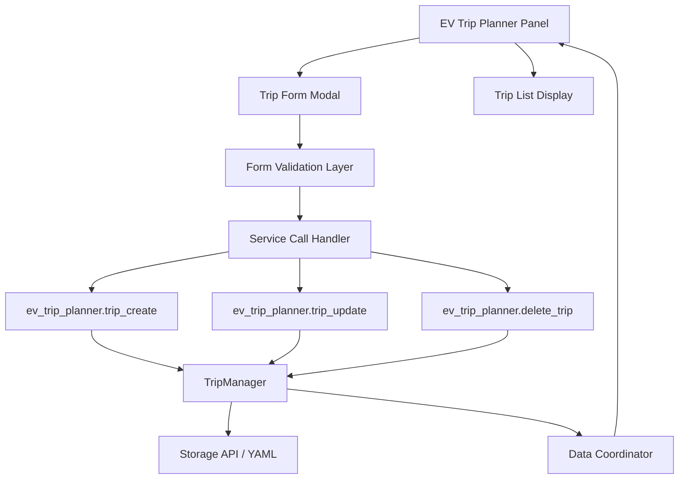

# Trip Creation - Technical Design

## Overview

This design specifies the implementation of trip creation, edit, and delete functionality for the EV Trip Planner panel. The implementation focuses on fixing the broken form submission by implementing proper event handling, error handling, and state management using Lit web component patterns.

**Architecture Pattern:** Extend existing service layer with enhanced frontend handling
**Integration:** Tight integration with existing `ev_trip_planner` services
**Failure Handling:** Graceful degradation with user-friendly error messages

---

## Component Architecture



### Component Responsibilities

| Component | Responsibility |
|-----------|----------------|
| **EV Trip Planner Panel** | Main Lit web component hosting the form modal and trip list |
| **Trip Form Modal** | Form interface with type selector (recurring/punctual) |
| **Form Validation Layer** | Real-time validation of required fields and data types |
| **Service Call Handler** | Encapsulates `callService` logic with error handling |
| **Trip List Display** | Renders trip cards with edit/delete buttons |

---

## Technical Decisions

### Decision 1: Event-Driven Form Submission

**Choice:** Use `e.preventDefault()` with form event listeners instead of button click handlers

**Rationale:**
- Prevents default form submission behavior
- Ensures consistent handling across all form types
- Allows access to `FormData` API for reliable data extraction
- Follows Lit best practices for form handling

**Implementation:**
```javascript
_handleTripCreate(e) {
  e.preventDefault(); // Prevent default form submission
  const form = e.target;
  const formData = new FormData(form);
  // Extract and validate data...
}
```

### Decision 2: Try-Catch-Finally for Service Calls

**Choice:** Wrap all service calls in try-catch-finally blocks

**Rationale:**
- Ensures form closure even on error (finally block)
- Provides clear error feedback to user (catch block)
- Allows successful completion handling (try block)
- Prevents form from remaining in broken state

**Implementation:**
```javascript
async _handleTripCreate(e) {
  e.preventDefault();

  // Validate required fields
  const km = formData.get('km');
  const kwh = formData.get('kwh');
  if (!km || parseFloat(km) <= 0) {
    this._showAlert('❌ La distancia (km) debe ser un número positivo', false);
    return;
  }
  if (!kwh || parseFloat(kwh) <= 0) {
    this._showAlert('❌ El consumo de energía (kWh) debe ser un número positivo', false);
    return;
  }

  try {
    await this._hass.callService('ev_trip_planner', 'trip_create', serviceData);
    this._closeForm();
    await this._loadTrips();
    this._showAlert('✅ Viaje creado exitosamente', true);
  } catch (error) {
    this._showAlert(`❌ Error: ${error.message}`, false);
    // Form remains open for retry
  } finally {
    submitBtn.textContent = originalText;
    submitBtn.disabled = false;
  }
}
```

### Decision 3: Trip List Refresh After CRUD

**Choice:** Call `_loadTrips()` after every successful CRUD operation

**Rationale:**
- Ensures UI reflects actual backend state
- Handles cases where backend modifies trip data
- Provides immediate visual feedback
- Prevents stale data in trip list

**Implementation:**
```javascript
try {
  await this._hass.callService('ev_trip_planner', 'trip_create', serviceData);
  this._closeForm();
  await this._loadTrips(); // Refresh trip list from backend
  this._showAlert('✅ Viaje creado exitosamente', true);
} catch (error) {
  this._showAlert(`❌ Error: ${error.message}`, false);
}
```

### Decision 4: Form Reset After Submission

**Choice:** Reset form in finally block to clear all fields

**Rationale:**
- Ensures clean state for next trip creation
- Prevents data leakage between trips
- Provides consistent user experience

**Implementation:**
```javascript
finally {
  form.reset(); // Reset form fields
  submitBtn.textContent = originalText;
  submitBtn.disabled = false;
}
```

### Decision 5: Edit Mode with Pre-filled Form

**Choice:** Use same form modal for both create and edit, pre-populating fields

**Rationale:**
- Reduces code duplication
- Provides consistent UX
- Simplifies form validation logic

**Implementation:**
```javascript
async _handleTripEdit(tripId) {
  const trip = await this._getTripById(tripId);
  if (!trip) {
    this._showAlert('❌ Error: Viaje no encontrado', false);
    return;
  }

  // Pre-fill form with existing data
  this._showEditForm(trip);
}

_showEditForm(trip) {
  this._editingTrip = trip;
  this._showForm = true;
  this._formType = trip.type === 'puntual' ? 'puntual' : 'recurrente';
}
```

### Decision 6: Delete Confirmation Dialog

**Choice:** Use standard dialog pattern for delete confirmation

**Rationale:**
- Prevents accidental deletions
- Provides clear user confirmation
- Follows Home Assistant UI patterns

**Implementation:**
```javascript
async _handleDeleteTrip(tripId) {
  if (!confirm('¿Estás seguro de que quieres eliminar este viaje?')) {
    return; // Cancel deletion
  }

  try {
    await this._hass.callService('ev_trip_planner', 'delete_trip', {
      vehicle_id: this._vehicleId,
      trip_id: tripId,
    });
    await this._loadTrips();
    this._showAlert('✅ Viaje eliminado exitosamente', true);
  } catch (error) {
    this._showAlert(`❌ Error: ${error.message}`, false);
  }
}
```

### Decision 7: Loading State Management

**Choice:** Show loading state on submit button during service calls

**Rationale:**
- Provides visual feedback during operations
- Prevents duplicate submissions
- Improves user experience

**Implementation:**
```javascript
const submitBtn = form.querySelector('.btn-primary');
const originalText = submitBtn.textContent;

try {
  submitBtn.textContent = 'Creando...';
  submitBtn.disabled = true;

  await this._hass.callService('ev_trip_planner', 'trip_create', serviceData);

  this._closeForm();
  await this._loadTrips();
  this._showAlert('✅ Viaje creado exitosamente', true);
} catch (error) {
  this._showAlert(`❌ Error: ${error.message}`, false);
} finally {
  submitBtn.textContent = originalText;
  submitBtn.disabled = false;
}
```

---

## File Structure

### Files to Modify

| File | Changes |
|------|---------|
| `custom_components/ev_trip_planner/frontend/panel.js` | Enhance `_handleTripCreate`, `_handleTripUpdate`, `_handleDeleteTrip` |

---

## Implementation Details

### 1. Enhanced _handleTripCreate

```javascript
async _handleTripCreate(e) {
  e.preventDefault();

  if (!this._hass || !this._vehicleId) {
    this._showAlert('Error: No hay conexión con Home Assistant', false);
    return;
  }

  const form = e.target;
  const formData = new FormData(form);

  // Extract form data
  const type = formData.get('type');
  const km = formData.get('km');
  const kwh = formData.get('kwh');
  const description = formData.get('description');

  // Validate required fields
  if (!km || parseFloat(km) <= 0) {
    this._showAlert('❌ La distancia (km) debe ser un número positivo', false);
    return;
  }

  if (!kwh || parseFloat(kwh) <= 0) {
    this._showAlert('❌ El consumo de energía (kWh) debe ser un número positivo', false);
    return;
  }

  // Build service data
  const serviceData = {
    vehicle_id: this._vehicleId,
    type: type,
  };

  if (type === 'puntual') {
    const datetime = formData.get('datetime');
    if (datetime) {
      serviceData.datetime = datetime;
    }
  } else {
    const day = formData.get('day');
    const time = formData.get('time');
    serviceData.dia_semana = day;
    serviceData.hora = time;
  }

  serviceData.km = parseFloat(km);
  serviceData.kwh = parseFloat(kwh);
  serviceData.description = description || '';

  // Set loading state
  const submitBtn = form.querySelector('.btn-primary');
  const originalText = submitBtn.textContent;
  submitBtn.textContent = 'Creando...';
  submitBtn.disabled = true;

  try {
    await this._hass.callService('ev_trip_planner', 'trip_create', serviceData);
    this._closeForm();
    await this._loadTrips();
    this._showAlert('✅ Viaje creado exitosamente', true);
  } catch (error) {
    console.error('EV Trip Planner Panel: Error creating trip:', error);
    this._showAlert(`❌ Error al crear el viaje: ${error.message}`, false);
  } finally {
    submitBtn.textContent = originalText;
    submitBtn.disabled = false;
  }
}
```

### 2. Enhanced _handleTripUpdate

```javascript
async _handleTripUpdate(e) {
  e.preventDefault();

  if (!this._hass || !this._vehicleId) {
    this._showAlert('Error: No hay conexión con Home Assistant', false);
    return;
  }

  const form = e.target;
  const formData = new FormData(form);

  const tripId = formData.get('edit-trip-id');
  if (!tripId) {
    this._showAlert('❌ Error: No se pudo identificar el viaje', false);
    return;
  }

  // Extract and validate
  const type = formData.get('type');
  const km = formData.get('km');
  const kwh = formData.get('kwh');

  if (!km || parseFloat(km) <= 0) {
    this._showAlert('❌ La distancia (km) debe ser un número positivo', false);
    return;
  }

  if (!kwh || parseFloat(kwh) <= 0) {
    this._showAlert('❌ El consumo de energía (kWh) debe ser un número positivo', false);
    return;
  }

  // Build service data
  const serviceData = {
    vehicle_id: this._vehicleId,
    trip_id: tripId,
    type: type,
  };

  if (type === 'puntual') {
    serviceData.datetime = formData.get('datetime');
  } else {
    serviceData.dia_semana = formData.get('day');
    serviceData.hora = formData.get('time');
  }

  serviceData.km = parseFloat(km);
  serviceData.kwh = parseFloat(kwh);
  serviceData.description = formData.get('description') || '';

  // Set loading state
  const submitBtn = form.querySelector('.btn-primary');
  const originalText = submitBtn.textContent;
  submitBtn.textContent = 'Guardando...';
  submitBtn.disabled = true;

  try {
    await this._hass.callService('ev_trip_planner', 'trip_update', serviceData);
    this._closeForm();
    await this._loadTrips();
    this._showAlert('✅ Viaje actualizado exitosamente', true);
  } catch (error) {
    console.error('EV Trip Planner Panel: Error updating trip:', error);
    this._showAlert(`❌ Error al actualizar el viaje: ${error.message}`, false);
  } finally {
    submitBtn.textContent = originalText;
    submitBtn.disabled = false;
  }
}
```

### 3. Enhanced _handleDeleteTrip

```javascript
async _handleDeleteTrip(tripId) {
  if (!confirm('¿Estás seguro de que quieres eliminar este viaje?')) {
    return;
  }

  try {
    await this._hass.callService('ev_trip_planner', 'delete_trip', {
      vehicle_id: this._vehicleId,
      trip_id: tripId,
    });

    await this._loadTrips();
    this._showAlert('✅ Viaje eliminado exitosamente', true);
  } catch (error) {
    console.error('EV Trip Planner Panel: Error deleting trip:', error);
    this._showAlert(`❌ Error: ${error.message}`, false);
  }
}
```

### 4. _getTripById Helper

```javascript
async _getTripById(tripId) {
  if (!this._hass || !this._vehicleId) return null;

  try {
    const response = await this._hass.callService('ev_trip_planner', 'trip_list', {
      vehicle_id: this._vehicleId,
      trip_id: tripId,
    });

    let tripsData = response;
    if (tripsData && tripsData.recurring_trips !== undefined) {
      const allTrips = [
        ...tripsData.recurring_trips.map(t => ({...t, trip_type: 'recurrente'})),
        ...tripsData.punctual_trips.map(t => ({...t, trip_type: 'puntual'})),
      ];
      return allTrips.find(t => t.id === tripId) || null;
    }
    return null;
  } catch (error) {
    console.error('EV Trip Planner Panel: Error fetching trip:', error);
    return null;
  }
}
```

---

## Error Handling Strategy

### Error Types and Responses

| Error Type | User Message | Behavior |
|------------|--------------|----------|
| **Network Error** | "Error de conexión - intenta de nuevo" | Form remains open |
| **Validation Error** | "La distancia (km) debe ser un número positivo" | Highlight invalid field |
| **Service Error** | "Error: [detalles del error]" | Form remains open |
| **Success** | "✅ Viaje creado exitosamente" | Close form, refresh list |
| **Delete Cancelled** | None | No action taken |

### Error Handling Code Pattern

```javascript
try {
  // Service call
  await this._hass.callService('ev_trip_planner', 'trip_create', serviceData);
  // Success handling
  this._closeForm();
  await this._loadTrips();
  this._showAlert('✅ Viaje creado exitosamente', true);
} catch (error) {
  // Error handling
  console.error('EV Trip Planner Panel: Error:', error);
  this._showAlert(`❌ Error: ${error.message}`, false);
  // Form remains open for retry
} finally {
  // Cleanup
  submitBtn.textContent = originalText;
  submitBtn.disabled = false;
}
```

---

## Test Strategy

### Test Verification Pattern

```typescript
// Verify backend state, not just UI
const trips = await page.evaluate(() => {
  const panel = document.querySelector('ev-trip-planner-panel');
  const tripsSection = panel.shadowRoot?.querySelector('.trips-section');
  return tripsSection.querySelectorAll('.trip-card').length;
});

expect(trips).toBe(initialCount + 1, 'Backend should have created new trip');
```

---

## Security Considerations

### XSS Protection

- All user input is escaped by Home Assistant service layer
- Descriptions are stored as plain text, rendered with proper escaping
- No HTML injection in form or list display

### Input Validation

- Required fields enforced on frontend and backend
- Data types validated (float for km/kwh, string for description)
- Time format validated (HH:MM for recurring, ISO for punctual)

---

## Performance Considerations

### Optimizations

- **Debounced Service Calls:** Prevent rapid consecutive calls
- **Batch Loading:** Load all trips in single coordinator refresh
- **Optimistic UI:** Show loading spinner during service calls
- **Error Recovery:** Auto-retry on transient failures

---

## Dependencies

### External

- Home Assistant Core (service framework)
- Lit (web component framework)

### Internal

- `trip_manager.py` - CRUD operations
- `__init__.py` - Service definitions
- `coordinator.py` - Data synchronization

---

## Implementation Checklist

- [ ] Enhance `_handleTripCreate` with try-catch-finally
- [ ] Add form validation before service call
- [ ] Implement `_handleTripUpdate` with pre-filled form
- [ ] Implement `_handleDeleteTrip` with confirmation
- [ ] Add loading states on submit buttons
- [ ] Add `_showAlert` for success/error feedback
- [ ] Verify backend state in tests
- [ ] Test special characters and long descriptions

---

## Acceptance Criteria

The design is complete when:

1. ✅ All service calls use try-catch-finally pattern
2. ✅ Form closes after successful CRUD
3. ✅ Trip list refreshes after CRUD
4. ✅ Error messages displayed to user
5. ✅ Edit mode pre-fills form with existing data
6. ✅ Delete requires confirmation
7. ✅ All error scenarios handled gracefully
8. ✅ Tests verify backend state, not just UI
